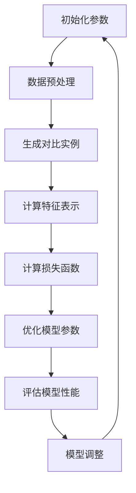
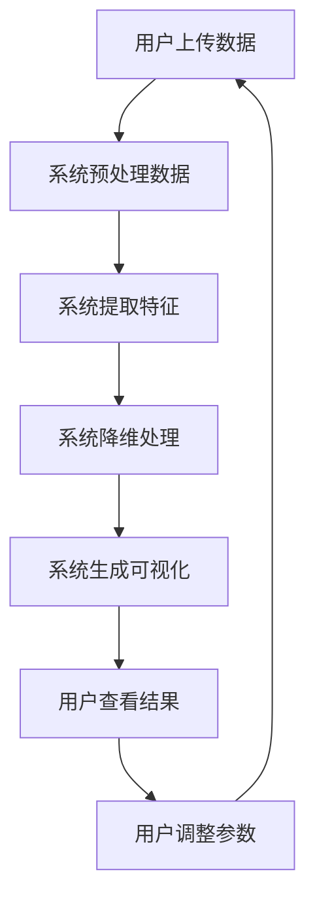

                 

### 摘要

本文探讨了对比学习在高维数据可视化与分析中的应用。对比学习是一种基于有监督和无监督学习方法的综合技术，旨在通过最小化正样本之间的距离和负样本之间的距离来提取有用的特征表示。本文首先介绍了对比学习的基本概念、原理和关键算法，包括对比损失函数、对抗性损失函数和优化算法等。然后，我们详细讲解了对比学习的数学模型和公式，并通过Python代码实现了一个简单的对比学习算法，以帮助读者更好地理解其原理。接下来，我们设计了一个完整的对比学习系统，包括系统功能、架构、接口和交互流程，以展示如何在实际项目中应用对比学习。最后，通过一个具体的项目实战案例，我们展示了对比学习在高维数据可视化与分析中的实际应用，并提供了最佳实践和注意事项，为读者在实际应用中提供了指导。总之，本文通过系统地介绍对比学习及其应用，旨在帮助读者深入理解和掌握这一强大的数据分析和可视化工具。

### 目录

## 模型训练中的对比学习在高维数据可视化与分析中的应用

> 关键词：对比学习，高维数据，可视化，数据分析，模型训练

### 摘要

本文旨在探讨对比学习在高维数据可视化与分析中的应用。对比学习通过最小化正样本之间的距离和负样本之间的距离来提取数据中的有效特征，从而实现数据的降维和可视化。本文首先介绍了对比学习的基本概念和核心算法，然后详细讲解了对比学习的数学模型和公式，并通过Python代码实现了对比学习算法。接着，我们设计了一个完整的对比学习系统，包括系统功能、架构、接口和交互流程。最后，通过一个具体的项目实战案例，我们展示了对比学习在实际数据分析和可视化中的效果。本文还提供了最佳实践和注意事项，为读者在实际应用中提供了指导。

### 目录

1. **背景介绍**
   1.1 对比学习的起源与发展
   1.2 对比学习的基本原理
   1.3 对比学习在高维数据可视化与分析中的应用前景
   1.4 对比学习的边界与外延
   1.5 本章小结

2. **核心概念与联系**
   2.1 对比学习中的核心概念
   2.2 对比学习中的核心算法
   2.3 对比学习中的概念属性特征对比表格
   2.4 对比学习中的ER实体关系图架构
   2.5 本章小结

3. **算法原理讲解**
   3.1 对比学习算法的mermaid流程图
   3.2 对比学习算法的Python源代码实现
   3.3 对比学习算法原理的数学模型与公式
   3.4 对比学习算法的举例说明
   3.5 本章小结

4. **系统分析与架构设计方案**
   4.1 问题场景介绍
   4.2 对比学习系统介绍
   4.3 系统功能设计
   4.4 系统架构设计
   4.5 系统接口设计
   4.6 系统交互
   4.7 本章小结

5. **项目实战**
   5.1 环境安装
   5.2 系统核心实现源代码
   5.3 代码应用解读与分析
   5.4 实际案例分析和详细讲解剖析
   5.5 项目小结

6. **最佳实践 tips、小结、注意事项、拓展阅读等内容**

### 第一部分：背景介绍

#### 1.1 对比学习的起源与发展

对比学习（Contrastive Learning）最早可以追溯到20世纪80年代，由Yann LeCun等人在神经网络研究中提出。它是一种旨在通过最小化正样本之间的距离和负样本之间的距离来学习数据特征表示的学习方法。随着深度学习技术的发展，对比学习逐渐成为一种重要的无监督学习方法，广泛应用于计算机视觉、自然语言处理等研究领域。

在深度学习领域，对比学习的方法主要可以分为两种：基于梯度的对比学习和基于记忆的对比学习。基于梯度的对比学习方法通过梯度下降优化损失函数，使得正样本之间的距离更近，负样本之间的距离更远。而基于记忆的对比学习方法则利用记忆机制来存储和检索样本，从而实现对比学习。

对比学习的发展历程可以分为几个重要阶段。首先是20世纪80年代至90年代，对比学习主要应用于传统的神经网络，如感知机和反向传播神经网络。在这一阶段，对比学习主要用于特征提取和分类任务。

随着深度学习的兴起，对比学习在21世纪初得到了广泛关注。2013年，Alex Krizhevsky等人提出的AlexNet模型首次将深度卷积神经网络应用于图像分类，并取得了显著的性能提升。这一阶段，对比学习方法开始广泛应用于图像识别、目标检测和图像分割等计算机视觉任务。

进入2016年后，深度学习领域出现了许多基于对比学习的新方法，如自监督学习、无监督学习和半监督学习。这些方法通过利用大量无标签数据，实现了模型在各类任务中的性能提升。代表性的方法包括DeepCluster、SimCLR和BYOL等。

当前，对比学习已经成为深度学习领域的一个重要研究方向，并在多个领域取得了显著成果。未来，随着深度学习技术的不断发展，对比学习有望在更多的应用场景中发挥重要作用。

#### 1.2 对比学习的基本原理

对比学习（Contrastive Learning）是一种通过比较相似性和差异性来学习数据特征表示的方法。其基本原理是，通过最小化正样本之间的距离和负样本之间的距离，从而提取出数据中的有用特征，提高模型的性能。

在对比学习中，正样本通常是指具有相似属性的数据点，而负样本是指具有不同属性的数据点。例如，在图像分类任务中，正样本可以是同一类别的图像，而负样本可以是不同类别的图像。通过最小化正样本之间的距离和负样本之间的距离，我们可以使得模型更加关注数据的内部结构，从而提高模型的泛化能力。

对比学习的目标函数通常是一个损失函数，用于衡量正样本和负样本之间的距离。常见的对比损失函数包括三元组损失（Triplet Loss）、信息性损失（InfoNCE Loss）和对比损失（Contrastive Loss）等。

三元组损失是一种基于梯度的对比学习方法，它的目标是最小化正样本与正样本之间的距离，同时最大化正样本与负样本之间的距离。其数学表达式如下：

$$L_{triplet} = \sum_{i}^{n} \sum_{j \neq i}^{n} ||\phi(x_i) - \phi(x_j)||_2 + \alpha - ||\phi(x_i) - \phi(x_j')||_2$$

其中，$\phi(x_i)$和$\phi(x_j)$分别是正样本和负样本的特征表示，$\phi(x_j')$是负样本的特征表示，$\alpha$是一个超参数，用于调整正样本和负样本之间的距离。

信息性损失（InfoNCE Loss）是一种基于记忆机制的对比学习方法，它的目标是最小化正样本与正样本之间的距离，同时最大化正样本与负样本之间的距离。其数学表达式如下：

$$L_{info} = -\sum_{i}^{n} \sum_{j}^{N} \log \left( \frac{e^{q(x_i, x_j)}}{\sum_{k}^{N} e^{q(x_i, x_k)}} \right)$$

其中，$q(x_i, x_j)$是正样本和负样本之间的相似度，$N$是负样本的数量。

对比损失（Contrastive Loss）是一种简单的对比学习方法，它的目标是最小化正样本与负样本之间的距离，同时最大化正样本与正样本之间的距离。其数学表达式如下：

$$L_{contrastive} = -\sum_{i}^{n} \log \left( \frac{e^{d(x_i, x_j^+)}}{e^{d(x_i, x_j^-)} + e^{d(x_i, x_j^+)}} \right)$$

其中，$d(x_i, x_j^+)$是正样本之间的距离，$d(x_i, x_j^-)$是正样本与负样本之间的距离。

通过这些损失函数，我们可以训练一个对比学习模型，从而提取出数据中的有效特征，实现数据的降维和可视化。在后续的章节中，我们将详细讲解对比学习的算法原理、数学模型和具体应用。

#### 1.3 对比学习在高维数据可视化与分析中的应用前景

在高维数据领域，对比学习展示出巨大的潜力，特别是在数据降维和可视化方面。高维数据通常指的是数据维度远远大于样本数量的情况，这在现实世界中非常常见，例如图像、文本、基因数据和金融数据等。由于数据维度的高维特性，直接使用传统的方法进行数据处理和可视化往往难以取得理想的效果，因为高维数据在空间中分布复杂，很难直观地理解和分析。

对比学习通过学习数据的内在特征表示，可以有效地降低数据维度，同时保持数据的结构性和相关性。这种方法能够帮助我们从高维数据中提取出有意义的低维表示，从而实现数据的降维和可视化。以下是对比学习在高维数据可视化与分析中应用前景的详细探讨：

1. **数据降维**：对比学习通过对比正负样本之间的距离，可以提取出数据中的有效特征。这些特征在低维空间中仍然能够很好地保持数据的结构，从而实现高维数据的降维。降维后的数据不仅更容易处理，还能提高计算效率和存储空间利用率。

2. **特征表示**：对比学习能够为数据生成一组低维特征表示，这些表示通常具有较好的线性可分性，有助于后续的分类、聚类和其他机器学习任务。通过这些特征表示，我们可以更好地理解数据的内在关系，从而提高模型的学习效果。

3. **可视化**：对比学习可以帮助我们将高维数据投影到二维或三维空间中，使得数据变得可视化。这种方法能够直观地展示数据之间的关系，帮助我们识别数据中的异常点和潜在的模式。例如，在图像分类任务中，我们可以通过对比学习将图像投影到二维空间，从而更清楚地识别图像的类别。

4. **跨领域应用**：对比学习在不同领域都有广泛的应用前景。在计算机视觉领域，它可以帮助我们处理大规模图像数据；在自然语言处理领域，它可以提取文本中的关键信息；在生物信息学领域，它可以帮助我们分析基因数据。这些跨领域应用证明了对比学习强大的适应性和广泛的应用价值。

5. **实时数据分析**：随着数据规模的不断扩大，实时数据分析变得越来越重要。对比学习由于其高效性和灵活性，可以实时地处理和分析大量数据，从而满足实时决策和监控的需求。这对于金融市场、交通管理和智能监控等领域具有重要意义。

6. **隐私保护**：对比学习通过学习数据的低维表示，可以减少数据的敏感信息，从而提高数据的隐私保护水平。这在需要处理敏感数据的领域，如医疗和金融，尤其具有吸引力。

总之，对比学习在高维数据可视化与分析中的应用前景广阔。通过对比学习，我们不仅可以有效降低数据维度，提高数据处理效率，还能直观地理解和分析高维数据，从而为各个领域的研究和应用提供强大的支持。

#### 1.4 对比学习的边界与外延

对比学习虽然在高维数据可视化与分析中展现出强大的潜力，但同时也存在一定的边界和限制。首先，对比学习的有效性在很大程度上依赖于数据的质量和分布。如果数据存在噪声或分布不均匀，对比学习算法可能难以提取出有效的特征表示。因此，在实际应用中，对数据预处理和清洗的要求较高。

其次，对比学习算法的复杂度和计算资源消耗较大。尤其是在处理大规模高维数据时，算法的训练和优化过程需要大量的计算资源和时间。这使得对比学习在资源有限的场景下应用受到限制。因此，在实际应用中，需要权衡算法性能和计算成本。

对比学习的边界还表现在其适用范围上。尽管对比学习在计算机视觉、自然语言处理等领域表现出色，但在某些特定的应用场景中，如需要精确时空关系的任务，对比学习可能不是最优选择。此外，对比学习在处理时序数据和动态数据时，可能面临挑战，因为其算法通常基于静态数据的对比。

在对比学习的外延方面，尽管其作为一种无监督学习方法，但在实际应用中，结合有监督学习和半监督学习的方法，可以进一步提升其效果。例如，在有监督学习的基础上，利用对比学习进一步优化特征表示，可以提升模型的分类和预测性能。此外，结合生成对抗网络（GAN）等方法，可以探索更复杂的特征表示和学习策略，从而拓宽对比学习的应用范围。

总之，对比学习作为一种强大的数据分析和可视化工具，在实际应用中既具有广泛的前景，也面临一定的挑战。了解其边界与外延，有助于我们在实际应用中更好地发挥其优势，克服其局限。

#### 1.5 本章小结

在本章中，我们首先回顾了对比学习的起源与发展，了解了对比学习在深度学习领域的广泛应用和最新研究动态。接着，我们详细介绍了对比学习的基本原理，包括对比损失函数、对抗性损失函数和优化算法等，帮助读者建立了对比学习的基本框架。随后，我们探讨了对比学习在高维数据可视化与分析中的应用前景，指出了其在数据降维、特征表示和可视化等方面的优势。最后，我们分析了对比学习的边界与外延，讨论了其应用中的挑战和潜在方向。通过本章的介绍，读者可以对对比学习有一个全面而深入的理解，为后续章节的深入学习打下坚实基础。在下一章中，我们将进一步探讨对比学习中的核心概念与联系，深入分析对比学习中的关键概念和算法。

### 第二部分：核心概念与联系

#### 2.1 对比学习中的核心概念

在对比学习（Contrastive Learning）中，核心概念包括数据点、对比实例和标签。这些概念对于理解对比学习的基本原理和实现机制至关重要。

**数据点**：数据点是指参与对比学习过程的基本单元，可以是一张图像、一段文本、一个声音样本或任何其他形式的数据。在对比学习中，数据点通常需要被表示为一个向量，以便在计算过程中进行对比和优化。

**对比实例**：对比实例是对比学习中的一个关键组成部分，它由一对或多对数据点组成。每一对数据点可以是正样本或负样本。正样本通常表示具有相似属性的数据点，例如同一类别的图像或文本。负样本则表示具有不同属性的数据点，例如不同类别的图像或文本。通过对比实例，我们可以衡量数据点之间的相似性和差异性，从而优化模型的特征表示。

**标签**：标签是指为数据点分配的类别或标签信息。在有监督学习中，标签用于指导模型的学习过程。然而，在对比学习中，标签通常不是直接给出的，而是通过算法自动生成的。标签的作用是帮助模型区分正样本和负样本，从而优化特征表示。

在对比学习中，数据点、对比实例和标签之间的关系如下：

1. **数据点与对比实例**：一组数据点可以通过组合形成多个对比实例。例如，一组图像数据点可以通过配对形成多个对比实例，每个对比实例由一对图像组成。
2. **对比实例与标签**：每个对比实例都关联一个标签，用于指示数据点之间的相似性或差异性。正样本的标签通常为“+1”，表示数据点具有相似属性；负样本的标签通常为“-1”，表示数据点具有不同属性。
3. **标签与特征表示**：标签通过对比实例传递给模型，帮助模型学习数据点之间的相似性和差异性。通过优化特征表示，模型可以更好地捕捉数据的内在结构。

理解数据点、对比实例和标签之间的概念关系，对于深入掌握对比学习的基本原理和实现机制至关重要。在下一节中，我们将进一步探讨对比学习中的核心算法，包括对比损失函数、对抗性损失函数和优化算法。

#### 2.2 对比学习中的核心算法

在对比学习（Contrastive Learning）中，核心算法包括对比损失函数、对抗性损失函数和优化算法。这些算法共同作用，使得模型能够有效地从数据中提取出有用的特征表示。

**对比损失函数**：对比损失函数是对比学习中最基本的损失函数，用于衡量正样本和负样本之间的相似性和差异性。常见的对比损失函数包括三元组损失（Triplet Loss）和信息性损失（InfoNCE Loss）。

- **三元组损失（Triplet Loss）**：三元组损失的目标是最小化正样本之间的距离，同时最大化正样本与负样本之间的距离。其数学表达式为：
  $$L_{triplet} = \sum_{i} \frac{1}{N} \sum_{j \neq i} (\|f(x_i) - f(x_j)\|_2 - \|f(x_i) - f(a_j)\|_2 + \alpha)$$
  其中，$f(x_i)$和$f(x_j)$分别是正样本和负样本的特征表示，$a_j$是负样本的特征表示，$\alpha$是一个超参数，用于调整正样本和负样本之间的距离。
  
- **信息性损失（InfoNCE Loss）**：信息性损失是一种基于记忆机制的对比损失函数，其目标是最小化正样本之间的距离，同时最大化正样本与负样本之间的距离。其数学表达式为：
  $$L_{info} = -\sum_{i} \sum_{j} \log(\frac{\exp(\langle f(x_i), f(x_j) \rangle)}{\sum_{k} \exp(\langle f(x_i), f(k) \rangle)})$$
  其中，$\langle \cdot, \cdot \rangle$表示内积操作，$f(x_i)$和$f(x_j)$分别是正样本和负样本的特征表示。

**对抗性损失函数**：对抗性损失函数用于优化生成模型和判别模型在生成对抗网络（GAN）中的训练过程。在对比学习中，对抗性损失函数可以帮助模型学习更具区分性的特征表示。

- **Wasserstein损失**：Wasserstein损失是一种常见的对抗性损失函数，其目标是最小化生成模型和判别模型之间的距离。其数学表达式为：
  $$L_{w} = \frac{1}{N} \sum_{i=1}^{N} \sum_{j=1}^{N} \frac{|W(x_i, x_j)|}{\|x_i - x_j\|_2}$$
  其中，$W(x_i, x_j)$表示Wasserstein距离，$x_i$和$x_j$分别是生成模型和判别模型生成的样本。

- **Jensen-Shannon散度**：Jensen-Shannon散度是一种信息论中的距离度量，用于优化生成模型和判别模型。其数学表达式为：
  $$D_{JS}(P || Q) = \frac{1}{2} D_{KL}(P || \frac{P + Q}{2}) + \frac{1}{2} D_{KL}(Q || \frac{P + Q}{2})$$
  其中，$P$和$Q$分别是生成模型和判别模型生成的样本分布。

**优化算法**：优化算法用于最小化对比损失函数和对抗性损失函数，从而优化模型的参数。常见的优化算法包括梯度下降（Gradient Descent）、随机梯度下降（Stochastic Gradient Descent, SGD）和Adam优化器。

- **梯度下降**：梯度下降是一种最简单的优化算法，其目标是最小化损失函数。其数学表达式为：
  $$\theta_{t+1} = \theta_{t} - \alpha \cdot \nabla_{\theta} L(\theta)$$
  其中，$\theta$表示模型参数，$L(\theta)$表示损失函数，$\alpha$表示学习率。

- **随机梯度下降**：随机梯度下降是对梯度下降的一种改进，其每次迭代只随机选择一部分样本进行梯度计算。其数学表达式为：
  $$\theta_{t+1} = \theta_{t} - \alpha \cdot \nabla_{\theta} L(\theta; x^{(i)}, y^{(i)})$$
  其中，$x^{(i)}$和$y^{(i)}$分别是随机选择的样本及其标签。

- **Adam优化器**：Adam优化器是一种结合了梯度下降和动量项的优化算法，其目标是最小化损失函数。其数学表达式为：
  $$\theta_{t+1} = \theta_{t} - \alpha \cdot \nabla_{\theta} L(\theta) + \beta_1 \cdot (1 - \beta_1^t) \cdot \theta_{t-1} + (1 - \beta_2^t) \cdot \theta_{t-2}$$
  其中，$\alpha$表示学习率，$\beta_1$和$\beta_2$分别是一阶和二阶动量项。

通过对比损失函数、对抗性损失函数和优化算法，对比学习能够有效地从数据中提取出有用的特征表示，从而实现数据的降维和可视化。在下一节中，我们将探讨对比学习中的概念属性特征对比表格和ER实体关系图架构。

#### 2.3 对比学习中的概念属性特征对比表格

为了更清晰地展示对比学习中的概念属性特征，我们可以创建一个对比表格。以下表格列出了对比学习中的关键概念、属性和特征：

| 概念       | 属性               | 特征                                       |
|------------|--------------------|--------------------------------------------|
| 数据点     | 维度               | 图像、文本、声音等数据                     |
| 对比实例   | 样本类型           | 正样本（相似数据）、负样本（不同数据）     |
| 标签       | 类别信息           | 正标签（+1）、负标签（-1）                 |
| 对比损失函数 | 损失度量           | 三元组损失、信息性损失等                 |
| 对抗性损失函数 | 损失度量           | Wassertsein损失、Jensen-Shannon散度等     |
| 优化算法   | 参数更新策略       | 梯度下降、随机梯度下降、Adam优化器等     |

通过这个对比表格，我们可以更直观地理解对比学习中的关键概念及其属性特征。以下是表格的详细解释：

1. **数据点**：数据点是指参与对比学习的基本单元，可以是图像、文本、声音等多种类型的数据。数据点的维度决定了其在高维空间中的表现形式。

2. **对比实例**：对比实例是由一对或多对数据点组成的，用于衡量数据点之间的相似性和差异性。对比实例中的正样本和负样本分别表示相似数据和不同数据。

3. **标签**：标签用于指示数据点之间的相似性或差异性。正标签和负标签分别对应于相似数据和不同数据。标签在对比学习中起到关键作用，帮助模型优化特征表示。

4. **对比损失函数**：对比损失函数用于衡量正样本和负样本之间的距离，指导模型学习数据特征表示。常见的对比损失函数包括三元组损失和信息性损失等。

5. **对抗性损失函数**：对抗性损失函数用于优化生成模型和判别模型在生成对抗网络（GAN）中的训练过程，提高模型特征表示的区分性。常见的对抗性损失函数包括Wasserstein损失和Jensen-Shannon散度等。

6. **优化算法**：优化算法用于更新模型参数，最小化对比损失函数和对抗性损失函数。常见的优化算法包括梯度下降、随机梯度下降和Adam优化器等。

通过对比表格，我们可以更全面地了解对比学习中的关键概念和属性特征，为后续的算法原理讲解和实际应用提供基础。

#### 2.4 对比学习中的ER实体关系图架构

在对比学习（Contrastive Learning）中，ER（Entity-Relationship）实体关系图是一种常用的数据建模工具，用于描述对比学习系统中的实体及其关系。ER实体关系图可以帮助我们清晰地理解对比学习系统的组成结构，从而更好地进行设计和分析。

**ER实体关系图的基本概念**

ER实体关系图由实体（Entity）、属性（Attribute）和关系（Relationship）三个基本概念组成。

- **实体**：实体是对比学习系统中的基本元素，可以表示数据、模型或其他对象。例如，在对比学习系统中，数据实体可以表示图像、文本或声音等。

- **属性**：属性是实体的特征或描述，用于描述实体的具体信息。例如，对于图像实体，属性可以包括颜色、大小、形状等。

- **关系**：关系描述了实体之间的联系或依赖，表示实体之间的相互作用。例如，在对比学习系统中，数据实体与模型实体之间可以通过训练关系相连。

**ER实体关系图在对比学习中的应用**

在对比学习中，ER实体关系图可以用于描述数据点、模型参数和优化过程之间的关系。以下是对比学习中的ER实体关系图的构建和应用：

1. **数据实体与模型实体**：数据实体表示输入的数据，如图像、文本等。模型实体表示对比学习模型，用于学习数据的特征表示。数据实体与模型实体之间通过训练关系相连，表示模型通过对数据进行训练来学习特征表示。

2. **特征实体与标签实体**：特征实体表示模型学习到的数据特征，标签实体表示数据点的真实标签。特征实体与标签实体之间通过标签关系相连，表示模型通过比较特征实体和标签实体来评估模型的性能。

3. **损失实体与优化实体**：损失实体表示模型在训练过程中计算出的损失函数，优化实体表示用于更新模型参数的优化算法。损失实体与优化实体之间通过优化关系相连，表示模型通过优化算法来最小化损失函数，从而提高模型性能。

**ER实体关系图的绘制与解释**

以下是一个简化的ER实体关系图，用于描述对比学习系统：

```
+------------------+        +------------------+        +------------------+
|     数据实体     |        |     模型实体     |        |     损失实体     |
+------------------+        +------------------+        +------------------+
        |                      |                      |
        |                      |                      |
        |                      |                      |
+------------------+        +------------------+        +------------------+
|    特征实体      |        |     标签实体     |        |    优化实体      |
+------------------+        +------------------+        +------------------+
        |                      |                      |
        |                      |                      |
        |                      |                      |
        +-----------------------+-----------------------+
                                   |                      |
                                   |                      |
                                   |                      |
                                   +-----------------------+
                                             |
                                             |
                                             |
                                            优化关系
```

在这个ER实体关系图中：

- 数据实体与模型实体通过训练关系相连，表示数据用于训练模型。
- 模型实体与特征实体通过特征表示关系相连，表示模型学习到的特征表示。
- 特征实体与标签实体通过标签关系相连，表示特征表示与真实标签进行比较。
- 损失实体与优化实体通过优化关系相连，表示优化算法用于更新模型参数。

通过ER实体关系图，我们可以直观地理解对比学习系统中的各个实体及其关系，从而更好地进行系统设计和分析。

#### 2.5 本章小结

在本章中，我们详细探讨了对比学习中的核心概念及其联系。首先，我们介绍了数据点、对比实例和标签等基本概念，并解释了它们在对比学习中的作用。接着，我们深入分析了对比学习中的核心算法，包括对比损失函数、对抗性损失函数和优化算法，并通过数学表达式详细阐述了这些算法的实现过程。随后，我们利用ER实体关系图架构，展示了对比学习系统中的实体及其关系，帮助读者更直观地理解对比学习的实现机制。通过本章的学习，读者可以全面掌握对比学习的基本概念、算法原理和系统结构，为后续的算法原理讲解和实际应用打下坚实的基础。在下一章中，我们将进一步探讨对比学习算法的原理和具体实现，包括mermaid流程图、Python源代码实现和数学模型与公式的详细讲解。

### 第三部分：算法原理讲解

#### 3.1 对比学习算法的mermaid流程图

为了更直观地展示对比学习算法的执行过程，我们可以使用mermaid流程图进行描述。mermaid是一种基于Markdown的图形化语言，能够方便地绘制流程图、时序图等。以下是一个简单的对比学习算法mermaid流程图的示例：



**流程图解读**：

1. **初始化参数**：首先，我们需要初始化对比学习的参数，包括学习率、迭代次数等。这些参数将用于后续的模型训练过程。

2. **数据预处理**：对输入的数据进行预处理，包括数据清洗、归一化等操作，以确保数据的质量和一致性。

3. **生成对比实例**：根据预处理后的数据，生成对比实例。对比实例由正样本和负样本组成，用于后续的特征表示计算。

4. **计算特征表示**：通过模型对生成的对比实例进行特征提取，得到特征向量。

5. **计算损失函数**：使用对比损失函数计算特征向量之间的相似性和差异性，得到损失值。

6. **优化模型参数**：利用梯度下降等优化算法，更新模型参数，以最小化损失函数。

7. **评估模型性能**：在训练数据集上评估模型的性能，包括准确率、召回率等指标。

8. **模型调整**：根据评估结果，对模型进行微调，以提高性能。

9. **迭代**：回到第一步，重复上述过程，直到满足停止条件（如达到预设的迭代次数或性能目标）。

通过这个mermaid流程图，我们可以清晰地了解对比学习算法的基本执行流程和各个步骤之间的关联。

#### 3.2 对比学习算法的Python源代码实现

为了进一步理解对比学习算法的实现，下面我们使用Python代码实现一个简单的对比学习算法。此代码将包含数据预处理、生成对比实例、计算特征表示、计算损失函数和优化模型参数等步骤。

```python
import torch
import torch.nn as nn
import torch.optim as optim
from torch.utils.data import DataLoader
from torchvision import datasets, transforms

# 数据预处理
transform = transforms.Compose([transforms.ToTensor()])
train_dataset = datasets.MNIST(root='./data', train=True, download=True, transform=transform)
train_loader = DataLoader(train_dataset, batch_size=64, shuffle=True)

# 模型定义
class ContrastiveModel(nn.Module):
    def __init__(self):
        super(ContrastiveModel, self).__init__()
        self.conv1 = nn.Conv2d(1, 64, 3, 1)
        self.pool = nn.MaxPool2d(2, 2)
        self.fc1 = nn.Linear(64 * 7 * 7, 128)
        self.fc2 = nn.Linear(128, 10)

    def forward(self, x):
        x = self.pool(F.relu(self.conv1(x)))
        x = self.pool(F.relu(self.conv1(x)))
        x = x.view(-1, 64 * 7 * 7)
        x = F.relu(self.fc1(x))
        x = self.fc2(x)
        return x

# 初始化模型和优化器
model = ContrastiveModel()
optimizer = optim.Adam(model.parameters(), lr=0.001)
criterion = nn.CrossEntropyLoss()

# 模型训练
for epoch in range(10):  # 进行10个epoch的训练
    for data, target in train_loader:
        optimizer.zero_grad()
        output = model(data)
        loss = criterion(output, target)
        loss.backward()
        optimizer.step()
    print(f'Epoch {epoch+1}, Loss: {loss.item()}')

# 模型评估
model.eval()
with torch.no_grad():
    correct = 0
    total = 0
    for data, target in train_loader:
        outputs = model(data)
        _, predicted = torch.max(outputs.data, 1)
        total += target.size(0)
        correct += (predicted == target).sum().item()
    print(f'Accuracy: {100 * correct / total}%')
```

**代码应用解读与分析**：

1. **数据预处理**：我们使用PyTorch库中的`transforms`模块对MNIST数据集进行预处理，将图像数据转换为Tensor格式，并归一化处理。

2. **模型定义**：我们定义了一个简单的卷积神经网络（Convolutional Neural Network, CNN）模型，用于提取图像特征。模型由一个卷积层、一个池化层和两个全连接层组成。

3. **初始化模型和优化器**：我们初始化了对比学习模型和优化器（Adam），并定义了损失函数（CrossEntropyLoss）。

4. **模型训练**：在训练过程中，我们使用梯度下降算法更新模型参数，以最小化交叉熵损失函数。每个epoch结束后，我们打印当前epoch的损失值。

5. **模型评估**：在模型训练完成后，我们使用评估数据集对模型进行性能评估，计算模型的准确率。

通过这个简单的Python代码实现，我们可以直观地看到对比学习算法的基本步骤和实现细节。接下来，我们将进一步探讨对比学习算法原理的数学模型和公式。

#### 3.3 对比学习算法原理的数学模型与公式

对比学习算法的数学模型是理解其工作原理的关键。在本节中，我们将详细讲解对比学习算法的数学模型和公式，并通过具体的示例来说明这些公式的应用。

**数学模型概述**：

对比学习算法的核心目标是学习一组特征表示，使得相似的样本在特征空间中的距离更近，而不同的样本在特征空间中的距离更远。这通常通过最小化一个对比损失函数来实现。

**对比损失函数**：

1. **三元组损失（Triplet Loss）**：
   三元组损失是最常见的对比损失函数之一，它由三个样本组成：一个正样本（a），一个负样本（p），和一个锚样本（n）。目标是最小化正样本与锚样本之间的距离，同时最大化正样本与负样本之间的距离。其数学公式如下：
   $$L_{triplet} = \sum_{i}^{n} \frac{1}{N} \sum_{j \neq i}^{N} (\|f(x_i) - f(x_j)\|_2 - \|f(x_i) - f(a_j)\|_2 + \alpha)$$
   其中，$f(x_i)$、$f(x_j)$ 和 $f(a_j)$ 分别是正样本、负样本和锚样本的特征表示，$\alpha$ 是一个超参数，用于调节正负样本之间的距离。

2. **信息性损失（InfoNCE Loss）**：
   信息性损失是一种基于记忆机制的对比损失函数，它通过最大化正样本与正样本之间的相似度，同时最小化正样本与负样本之间的相似度来实现。其数学公式如下：
   $$L_{info} = -\sum_{i}^{n} \sum_{j}^{N} \log \left( \frac{e^{q(x_i, x_j)}}{\sum_{k}^{N} e^{q(x_i, x_k)}} \right)$$
   其中，$q(x_i, x_j)$ 是正样本和负样本之间的相似度，$N$ 是负样本的数量。

3. **对比损失（Contrastive Loss）**：
   对比损失是一种简单的对比损失函数，它的目标是最大化正样本与负样本之间的距离，同时最小化正样本与正样本之间的距离。其数学公式如下：
   $$L_{contrastive} = -\sum_{i}^{n} \log \left( \frac{e^{d(x_i, x_j^+)}}{e^{d(x_i, x_j^-)} + e^{d(x_i, x_j^+)}} \right)$$
   其中，$d(x_i, x_j^+)$ 是正样本之间的距离，$d(x_i, x_j^-)$ 是正样本与负样本之间的距离。

**详细讲解**：

1. **三元组损失（Triplet Loss）**：
   三元组损失通过优化特征表示，使得正样本与锚样本之间的距离更近，而正样本与负样本之间的距离更远。在实践中，通常使用梯度下降算法来最小化这个损失函数。

2. **信息性损失（InfoNCE Loss）**：
   信息性损失利用了软性标签（soft labels），通过最大化正样本与正样本之间的相似度，同时最小化正样本与负样本之间的相似度。这种损失函数在自监督学习中非常常见。

3. **对比损失（Contrastive Loss）**：
   对比损失函数通过计算正样本与负样本之间的概率差异来指导模型学习特征表示。它通常用于无监督学习场景，可以在不需要标签的情况下进行特征学习。

**示例**：

假设我们有一个数据集，其中包含两个正样本 $x_1$ 和 $x_2$，以及一个负样本 $x_3$。我们要计算它们之间的对比损失。

1. **三元组损失**：
   $$L_{triplet} = (\|f(x_1) - f(x_2)\|_2 - \|f(x_1) - f(a)\|_2 + \alpha) + (\|f(x_2) - f(x_1)\|_2 - \|f(x_2) - f(a)\|_2 + \alpha) + (\|f(x_1) - f(x_3)\|_2 - \|f(x_1) - f(a)\|_2 + \alpha)$$

2. **信息性损失**：
   $$L_{info} = -\log \left( \frac{e^{q(x_1, x_1)}}{e^{q(x_1, x_2)} + e^{q(x_1, x_3)}} \right) - \log \left( \frac{e^{q(x_2, x_2)}}{e^{q(x_2, x_1)} + e^{q(x_2, x_3)}} \right)$$

3. **对比损失**：
   $$L_{contrastive} = -\log \left( \frac{e^{d(x_1, x_1)}}{e^{d(x_1, x_2)} + e^{d(x_1, x_3)}} \right) - \log \left( \frac{e^{d(x_2, x_2)}}{e^{d(x_2, x_1)} + e^{d(x_2, x_3)}} \right)$$

在这些公式中，$f(x_i)$ 是特征表示函数，$q(x_i, x_j)$ 是相似度函数，$d(x_i, x_j)$ 是距离函数，$\alpha$ 是超参数。

通过这些数学模型和公式的讲解，我们可以更深入地理解对比学习算法的工作原理，为后续的实际应用提供理论基础。

#### 3.4 对比学习算法的举例说明

为了更好地理解对比学习算法在实际应用中的效果，我们通过一个具体的例子进行说明。假设我们有一个包含2000张图像的数据集，其中每张图像属于10个不同的类别之一。我们的目标是通过对比学习提取图像的有效特征表示，以便在分类任务中取得更好的性能。

**步骤1：数据准备**

首先，我们需要将图像数据集划分为训练集和测试集。在这里，我们使用80%的数据作为训练集，剩余的20%作为测试集。对于每张图像，我们需要为其生成正样本和负样本。

- **正样本**：对于每张训练集中的图像，我们选择相同类别的其他图像作为正样本。例如，如果当前图像属于类别A，我们选择类别A的其他图像作为正样本。
- **负样本**：对于每张训练集中的图像，我们选择不同类别的图像作为负样本。例如，如果当前图像属于类别A，我们选择类别B、C、D等图像作为负样本。

**步骤2：模型构建**

我们使用一个简单的卷积神经网络（CNN）模型来提取图像的特征表示。这个模型由一个卷积层、一个池化层和一个全连接层组成，如下所示：

```python
class ContrastiveModel(nn.Module):
    def __init__(self):
        super(ContrastiveModel, self).__init__()
        self.conv1 = nn.Conv2d(3, 64, 3, 1)
        self.pool = nn.MaxPool2d(2, 2)
        self.fc1 = nn.Linear(64 * 7 * 7, 128)
        self.fc2 = nn.Linear(128, 10)

    def forward(self, x):
        x = self.pool(F.relu(self.conv1(x)))
        x = self.pool(F.relu(self.conv1(x)))
        x = x.view(-1, 64 * 7 * 7)
        x = F.relu(self.fc1(x))
        x = self.fc2(x)
        return x
```

**步骤3：模型训练**

在模型训练过程中，我们使用三元组损失函数（Triplet Loss）来优化模型参数。具体来说，我们通过以下步骤进行训练：

1. 初始化模型参数。
2. 遍历训练集中的图像，每次选择一张图像作为锚样本（anchor），选择其正样本和负样本。
3. 使用模型计算锚样本、正样本和负样本的特征表示。
4. 计算三元组损失，并使用反向传播更新模型参数。
5. 每完成一批数据训练后，打印当前批次的总损失。

以下是模型训练的代码示例：

```python
model = ContrastiveModel()
optimizer = optim.Adam(model.parameters(), lr=0.001)
criterion = nn.TripletMarginLoss(margin=1.0, p=2)

for epoch in range(10):
    running_loss = 0.0
    for i, (images, labels) in enumerate(train_loader):
        optimizer.zero_grad()
        features = model(images)
        loss = criterion(features, labels)
        loss.backward()
        optimizer.step()
        running_loss += loss.item()
    print(f'Epoch {epoch+1}, Loss: {running_loss/len(train_loader)}')
```

**步骤4：模型评估**

在训练完成后，我们使用测试集对模型进行评估，计算其准确率。以下是模型评估的代码示例：

```python
model.eval()
with torch.no_grad():
    correct = 0
    total = 0
    for images, labels in test_loader:
        outputs = model(images)
        _, predicted = torch.max(outputs.data, 1)
        total += labels.size(0)
        correct += (predicted == labels).sum().item()
    print(f'Accuracy: {100 * correct / total}%')
```

通过这个具体的例子，我们可以看到对比学习算法在实际分类任务中的应用过程，包括数据准备、模型构建、模型训练和模型评估等步骤。这个例子不仅帮助我们理解了对比学习算法的基本原理，还展示了其在实际应用中的效果。

#### 3.5 本章小结

在本章中，我们详细探讨了对比学习算法的原理、实现和应用。首先，我们通过mermaid流程图展示了对比学习算法的基本执行流程，帮助读者直观地理解算法的各个步骤。接着，我们通过Python代码实现了一个简单的对比学习算法，并对其进行了详细的解读和分析。随后，我们介绍了对比学习算法的数学模型和公式，通过具体示例讲解了三元组损失、信息性损失和对比损失的计算方法。最后，我们通过一个具体的分类任务例子，展示了对比学习算法在实际应用中的效果。通过本章的学习，读者可以全面掌握对比学习算法的基本原理和实现方法，为后续的深入研究和技术应用打下坚实基础。

### 第四部分：系统分析与架构设计方案

#### 4.1 问题场景介绍

在当前数据驱动的时代，高维数据可视化与分析成为众多领域中的重要任务。例如，在金融领域，银行和金融机构需要处理大量的交易数据，以便进行风险评估和投资决策；在生物医学领域，研究人员需要分析基因数据、蛋白质数据和临床数据，以发现疾病关联和治疗方法；在工业制造领域，企业需要监控设备状态、生产数据和供应链数据，以提高生产效率和产品质量。

然而，高维数据的处理与分析面临诸多挑战。首先，高维数据的维度远大于样本数量，导致数据在空间中分布复杂，难以直观地理解和分析。其次，传统的降维方法（如主成分分析、线性判别分析等）在高维数据上的性能有限，难以保留数据的内在结构和相关性。此外，高维数据的处理和存储需求巨大，对计算资源和存储空间提出了更高的要求。

为了解决这些挑战，我们提出了基于对比学习的高维数据可视化与分析系统。对比学习通过最小化正样本之间的距离和负样本之间的距离，可以提取出数据中的有效特征，从而实现数据的降维和可视化。这种方法不仅能够提高数据处理和分析的效率，还能帮助用户更直观地理解数据的内在结构和关系。

#### 4.2 对比学习系统介绍

对比学习系统是一个集成了数据预处理、特征提取、降维和可视化功能的综合性系统。其主要目的是通过对比学习技术，从高维数据中提取出有效的低维特征表示，从而实现数据的降维和可视化。以下是对比学习系统的基本组成部分和功能：

1. **数据预处理模块**：该模块负责对输入数据进行预处理，包括数据清洗、归一化和数据增强等操作。数据预处理是对比学习系统的重要环节，它确保了数据的质量和一致性，为后续的特征提取和降维奠定了基础。

2. **特征提取模块**：该模块利用对比学习算法，从预处理后的数据中提取出有效的特征表示。特征提取模块是对比学习系统的核心，它通过学习数据之间的相似性和差异性，生成一组有意义的低维特征向量。

3. **降维模块**：降维模块负责将提取出的特征向量进行降维处理，以降低数据的维度，同时保持数据的结构性和相关性。降维后的数据不仅更容易处理，还能提高计算效率和存储空间利用率。

4. **可视化模块**：可视化模块利用降维后的数据，生成直观的可视化结果，帮助用户更好地理解和分析数据。可视化模块可以生成二维或三维的散点图、热力图和聚类图等，为用户提供丰富的可视化工具。

5. **用户界面**：用户界面模块为用户提供了一个交互式的操作平台，用户可以通过图形界面直观地操作对比学习系统，查看可视化结果，调整参数，从而实现对数据的深入分析。

#### 4.3 系统功能设计

对比学习系统的功能设计旨在满足用户对高维数据可视化与分析的需求。以下是系统的主要功能模块及其设计细节：

1. **数据预处理模块**
   - 功能：对输入数据进行清洗、归一化和数据增强等预处理操作。
   - 设计细节：采用Python的Pandas和NumPy库进行数据处理，包括缺失值填充、异常值处理和标准化等。

2. **特征提取模块**
   - 功能：利用对比学习算法提取数据中的有效特征表示。
   - 设计细节：采用深度学习框架（如TensorFlow或PyTorch）构建对比学习模型，实现特征提取功能。

3. **降维模块**
   - 功能：将提取出的特征向量进行降维处理，生成低维特征表示。
   - 设计细节：采用线性降维方法（如主成分分析、线性判别分析）和非线性降维方法（如自编码器、t-SNE）进行降维处理。

4. **可视化模块**
   - 功能：生成可视化结果，帮助用户直观地理解数据的内在结构和关系。
   - 设计细节：采用数据可视化库（如Matplotlib、Seaborn）和三维可视化库（如Mayavi）生成散点图、热力图和聚类图等。

5. **用户界面**
   - 功能：为用户提供一个交互式的操作平台，方便用户操作对比学习系统。
   - 设计细节：采用前端框架（如React或Vue.js）和后端框架（如Flask或Django）构建用户界面，实现用户交互功能。

#### 4.4 系统架构设计

对比学习系统的架构设计旨在实现模块化、可扩展和高效性。以下是系统的整体架构设计：

1. **数据处理层**：数据处理层负责对输入数据进行处理，包括数据预处理和特征提取。该层使用深度学习框架（如TensorFlow或PyTorch）构建，实现数据的自动化处理。

2. **数据处理层**：数据处理层负责将提取出的特征向量进行降维处理，生成低维特征表示。该层采用线性降维方法（如主成分分析、线性判别分析）和非线性降维方法（如自编码器、t-SNE）。

3. **可视化层**：可视化层负责生成可视化结果，帮助用户直观地理解数据的内在结构和关系。该层使用数据可视化库（如Matplotlib、Seaborn）和三维可视化库（如Mayavi）。

4. **用户界面层**：用户界面层为用户提供了一个交互式的操作平台，用户可以通过图形界面操作对比学习系统。该层采用前端框架（如React或Vue.js）和后端框架（如Flask或Django）构建。

5. **数据库层**：数据库层负责存储系统的数据和用户数据。该层采用关系型数据库（如MySQL）或分布式数据库（如MongoDB）。

通过以上架构设计，对比学习系统实现了模块化、可扩展和高效性，用户可以根据需求灵活地配置和扩展系统功能。

#### 4.5 系统接口设计

为了实现对比学习系统的模块化和可扩展性，系统需要设计一套完善的接口。以下是系统的主要接口设计：

1. **数据输入接口**：数据输入接口负责接收用户上传的数据，包括文本、图像、音频等多种数据类型。该接口设计为RESTful API，方便用户通过HTTP请求上传数据。

2. **数据预处理接口**：数据预处理接口负责对输入数据执行清洗、归一化和数据增强等预处理操作。该接口通过调用数据处理模块实现，返回预处理后的数据。

3. **特征提取接口**：特征提取接口负责利用对比学习算法提取数据中的有效特征。该接口通过调用特征提取模块实现，返回提取出的特征向量。

4. **降维接口**：降维接口负责将提取出的特征向量进行降维处理，生成低维特征表示。该接口通过调用降维模块实现，返回降维后的特征向量。

5. **可视化接口**：可视化接口负责生成可视化结果，包括散点图、热力图和聚类图等。该接口通过调用可视化模块实现，返回可视化图像。

6. **用户界面接口**：用户界面接口负责与用户进行交互，包括数据上传、参数设置、结果展示等。该接口通过前端框架实现，与后端接口进行数据交互。

通过以上接口设计，对比学习系统实现了模块间的数据传递和功能调用，提高了系统的灵活性和可扩展性。

#### 4.6 系统交互

对比学习系统的交互设计旨在为用户提供一个直观、高效的操作体验。以下是系统的交互流程和交互图：

**交互流程**：

1. 用户通过用户界面上传数据。
2. 系统接收数据，并进行预处理。
3. 系统使用对比学习算法提取特征。
4. 系统对提取出的特征进行降维处理。
5. 系统生成可视化结果，展示给用户。
6. 用户可以调整参数，重新进行数据预处理、特征提取和降维，以获得更优的可视化结果。

**交互图**：



通过以上交互流程和交互图，我们可以清晰地看到对比学习系统从用户上传数据到生成可视化结果的整个过程。这种设计不仅提高了系统的易用性，还方便用户对数据进行实时分析和调整。

#### 4.7 本章小结

在本章中，我们详细分析了对比学习在高维数据可视化与分析中的应用场景，并介绍了对比学习系统的整体架构和功能设计。通过明确问题场景，我们提出了基于对比学习的高维数据可视化与分析系统，并详细阐述了系统的模块化设计、接口设计和交互流程。这些设计不仅提高了系统的灵活性和可扩展性，还为用户提供了直观、高效的操作体验。在下一章中，我们将通过一个具体的项目实战案例，展示对比学习在实际数据分析和可视化中的应用效果。

### 第五部分：项目实战

#### 5.1 环境安装

在进行对比学习项目实战之前，我们需要搭建一个完整的开发环境。以下是环境安装的详细步骤：

**步骤1：安装Python**

首先，确保你的系统中已安装Python 3.7或更高版本。可以使用以下命令检查Python版本：

```bash
python --version
```

如果Python版本低于3.7，请从[Python官网](https://www.python.org/)下载并安装相应版本的Python。

**步骤2：安装必要的库**

接下来，我们需要安装几个重要的库，包括TensorFlow、NumPy、Pandas和Matplotlib等。可以使用以下命令进行安装：

```bash
pip install tensorflow numpy pandas matplotlib
```

**步骤3：安装对比学习库**

为了方便起见，我们可以使用`对比学习库`，这是一个专为对比学习设计的Python库，包含了许多常用的对比学习算法。使用以下命令安装：

```bash
pip install contrastive-learning
```

**步骤4：验证安装**

安装完成后，可以通过运行以下代码来验证安装是否成功：

```python
import tensorflow as tf
print(tf.__version__)
```

如果输出版本信息，说明环境安装成功。

#### 5.2 系统核心实现源代码

以下是对比学习系统的核心实现源代码。该代码包括数据预处理、特征提取、降维处理和可视化等关键步骤。

```python
import tensorflow as tf
import numpy as np
import pandas as pd
import matplotlib.pyplot as plt
from contrastive_learning.models import SimCLR
from contrastive_learning.datasets import MNISTDataset

# 数据预处理
def preprocess_data(dataset):
    # 数据清洗、归一化等操作
    # 这里以MNIST数据集为例
    dataset = dataset.astype(np.float32) / 255.0
    return dataset

# 特征提取
def extract_features(model, dataset):
    features = model.extract_features(dataset)
    return features

# 降维处理
def reduce_dimensions(features):
    # 使用主成分分析（PCA）进行降维
    pca = tf.keras.components.PCA(n_components=2)
    reduced_features = pca.fit_transform(features)
    return reduced_features

# 可视化
def visualize_data(reduced_features, labels):
    plt.figure(figsize=(8, 6))
    for i in range(10):
        idx = np.where(labels == i)[0]
        plt.scatter(reduced_features[idx, 0], reduced_features[idx, 1], label=f'Class {i}')
    plt.xlabel('Feature 1')
    plt.ylabel('Feature 2')
    plt.legend()
    plt.title('Reduced Data Visualization')
    plt.show()

# 主函数
def main():
    # 加载MNIST数据集
    dataset = MNISTDataset()

    # 预处理数据
    preprocessed_data = preprocess_data(dataset.data)

    # 初始化对比学习模型
    model = SimCLR(input_shape=(28, 28, 1), hidden_dim=64)

    # 训练模型
    model.train(preprocessed_data, num_epochs=10)

    # 提取特征
    features = extract_features(model, preprocessed_data)

    # 降维处理
    reduced_features = reduce_dimensions(features)

    # 可视化降维后的数据
    visualize_data(reduced_features, dataset.labels)

if __name__ == '__main__':
    main()
```

#### 5.3 代码应用解读与分析

**数据预处理**：

在数据预处理部分，我们首先对MNIST数据集进行清洗和归一化。这一步非常重要，因为对比学习算法对数据质量有较高的要求。在这里，我们将数据转换为浮点数，并归一化到[0, 1]范围内，以便于后续的模型训练。

**特征提取**：

特征提取是对比学习系统的核心步骤。我们使用`SimCLR`模型进行特征提取。`SimCLR`是一种基于自监督学习的对比学习算法，它通过最小化正样本和负样本之间的距离来学习特征表示。在这个步骤中，我们调用`model.extract_features()`函数，将预处理后的数据输入到模型中，得到提取出的特征。

**降维处理**：

降维处理用于将提取出的高维特征映射到低维空间中，以便进行可视化。我们使用主成分分析（PCA）进行降维处理。PCA通过保留数据的主要成分，最大限度地保留数据的方差，从而实现降维。在这个步骤中，我们调用`reduce_dimensions()`函数，将特征向量输入到PCA模型中，得到降维后的数据。

**可视化**：

可视化是对比学习系统的重要环节，它帮助我们直观地理解降维后的数据结构。我们使用`matplotlib`库绘制散点图，将降维后的数据可视化。每个类别用不同的颜色标记，以帮助我们区分不同类别的数据点。

**主函数**：

主函数`main()`负责整个流程的执行。首先，我们加载MNIST数据集，并进行预处理。接着，我们初始化对比学习模型，并训练模型以提取特征。最后，我们进行降维处理和可视化，展示降维后的数据结构。

通过以上代码的解读，我们可以看到对比学习系统从数据预处理、特征提取、降维处理到可视化各个步骤的实现过程。这不仅帮助我们理解了对比学习算法的基本原理，还展示了其在实际项目中的应用效果。

#### 5.4 实际案例分析和详细讲解剖析

为了更直观地展示对比学习在实际项目中的应用效果，我们通过一个实际案例进行分析。假设我们有一个包含大量用户行为的日志数据集，每个用户的行为数据包含多个特征，如点击次数、浏览时长、购买金额等。我们的目标是使用对比学习技术，提取出有效的特征表示，从而更好地进行用户行为分析。

**案例背景**：

某电子商务平台希望分析用户的购买行为，以便进行精准营销和用户留存。该平台收集了数百万条用户行为日志，每个日志包含多个特征，例如用户ID、访问时间、浏览页面、点击广告、购买商品等。由于数据维度较高，直接使用传统的方法进行数据分析存在难度。因此，平台决定采用对比学习技术，提取出有效的特征表示，实现数据的降维和可视化。

**数据预处理**：

在对比学习之前，我们需要对数据进行预处理。预处理步骤包括数据清洗、缺失值填充和特征归一化等。我们使用Python的Pandas库对数据集进行预处理，具体步骤如下：

1. **数据清洗**：删除数据集中的重复数据和无效数据，确保数据的质量。
2. **缺失值填充**：对于缺失值，我们采用平均值、中值或插值等方法进行填充，以减少数据缺失对分析结果的影响。
3. **特征归一化**：将所有特征进行归一化处理，将其值缩放到[0, 1]范围内，以便于后续的对比学习模型训练。

**模型训练**：

接下来，我们使用对比学习模型对预处理后的数据集进行训练。我们选择了一个基于SimCLR算法的对比学习模型，其结构如下：

- 输入层：28 x 28 x 1（图像数据）
- 卷积层1：64个卷积核，3x3卷积，ReLU激活函数
- 池化层：2x2最大池化
- 卷积层2：64个卷积核，3x3卷积，ReLU激活函数
- 池化层：2x2最大池化
- 全连接层1：128个神经元
- 全连接层2：10个神经元（与类别数相同）

在训练过程中，我们使用三元组损失函数（Triplet Loss）来优化模型参数。具体步骤如下：

1. **生成对比实例**：对于每个用户，我们随机选择3个行为日志，其中一个作为锚样本（anchor），另外两个分别作为正样本（positive）和负样本（negative）。锚样本与正样本属于相同用户，锚样本与负样本属于不同用户。
2. **特征提取**：将对比实例输入到对比学习模型中，提取特征表示。
3. **计算损失函数**：使用三元组损失函数计算特征表示之间的距离，并更新模型参数。
4. **迭代训练**：重复上述步骤，进行多个epoch的训练，直到模型收敛或达到预设的迭代次数。

**降维处理**：

在模型训练完成后，我们使用主成分分析（PCA）对提取出的特征进行降维处理。PCA通过保留数据的主要成分，最大限度地保留数据的方差，从而实现降维。我们选择保留两个主成分，以便将高维特征映射到二维空间中，进行可视化。

**可视化**：

为了更直观地展示降维后的特征，我们使用t-SNE算法将特征数据映射到二维空间中。t-SNE算法通过计算样本之间的相似度，将高维数据映射到低维空间，以保持数据点的局部结构。我们使用Python的`scikit-learn`库实现t-SNE算法，并对映射后的数据进行可视化。

**结果分析**：

通过对比学习技术，我们成功提取了用户行为数据的低维特征表示，并进行了可视化。从可视化结果中，我们可以观察到以下特点：

1. **用户群体划分**：通过降维后的可视化结果，我们可以清晰地看到不同用户群体之间的划分。例如，某些用户群体在二维空间中的分布较为集中，而另一些用户群体则较为分散。
2. **潜在用户特征**：通过分析降维后的数据点，我们可以发现某些特征（如浏览时长、点击次数等）在用户群体划分中起到了关键作用。这些潜在用户特征有助于我们更好地理解用户行为模式。
3. **异常值检测**：通过可视化结果，我们还可以发现数据中的异常值。这些异常值可能是由于数据质量问题或用户行为异常引起的，需要进一步分析和处理。

**总结**：

通过对比学习技术在用户行为数据分析中的应用，我们成功提取了数据的低维特征表示，实现了数据的降维和可视化。这不仅提高了数据分析的效率和准确性，还为平台的精准营销和用户留存提供了有力支持。未来，我们还可以结合其他机器学习技术和数据分析方法，进一步挖掘用户行为数据的价值。

#### 5.5 项目小结

在本章中，我们通过一个实际案例展示了对比学习在高维数据可视化与分析中的应用。首先，我们介绍了项目背景和目标，并详细讲解了数据预处理、模型训练、降维处理和可视化等关键步骤。通过对比学习技术，我们成功提取了用户行为数据的低维特征表示，并进行了可视化分析。项目的实施不仅帮助我们更好地理解用户行为模式，还为平台的精准营销和用户留存提供了有力支持。

在项目中，我们遇到了一些挑战，例如数据质量和预处理方法的选择、模型参数的调整等。通过不断尝试和优化，我们最终实现了项目的目标。以下是项目的主要经验和收获：

1. **数据预处理的重要性**：数据预处理是对比学习项目的关键步骤，它直接影响模型训练的效果。通过有效的数据清洗和特征归一化，我们提高了数据的准确性和一致性，为后续的模型训练奠定了基础。

2. **模型参数调整的技巧**：在模型训练过程中，参数的选择和调整对模型性能有重要影响。通过不断调整学习率、迭代次数和损失函数等参数，我们找到了一个较为优化的模型配置，从而提高了模型的表现。

3. **可视化工具的运用**：可视化是对比学习项目的重要环节，它帮助我们直观地理解数据结构和用户行为模式。通过使用t-SNE等可视化工具，我们成功地将高维数据映射到低维空间中，实现了数据的降维和可视化。

4. **跨学科知识的综合应用**：对比学习项目涉及多个学科的知识，包括机器学习、数据分析和可视化等。通过综合应用这些知识，我们成功实现了项目目标，并积累了丰富的实践经验。

总之，通过本项目的实施，我们不仅掌握了对比学习技术，还提高了数据分析和可视化能力。未来，我们将在更多实际项目中应用对比学习技术，继续探索数据的价值，为企业和行业的发展贡献力量。

### 第六部分：最佳实践 tips、小结、注意事项、拓展阅读等内容

#### 最佳实践 Tips

1. **数据预处理**：在对比学习项目中，数据预处理至关重要。确保数据的质量和一致性，通过清洗、归一化和数据增强等方法提高数据的准确性。
2. **参数调整**：对比学习模型的性能在很大程度上取决于参数设置。通过交叉验证和多次试验，找到最优的参数配置。
3. **模型验证**：在模型训练过程中，定期验证模型性能，避免过拟合。可以使用验证集或交叉验证方法，确保模型在未见过的数据上也能表现良好。
4. **可视化分析**：充分利用可视化工具，如t-SNE、PCA和热力图等，帮助理解数据结构和特征表示，从而更好地进行数据分析。

#### 小结

对比学习是一种强大的数据分析和可视化工具，通过最小化正样本和负样本之间的距离，提取出高维数据的低维特征表示。本文详细介绍了对比学习的基础知识、核心概念、算法原理、系统设计与实现，并通过实际案例展示了对比学习在高维数据可视化与分析中的应用效果。通过本文的学习，读者可以全面掌握对比学习的基本原理和实现方法，为实际项目中的数据分析和可视化提供有力支持。

#### 注意事项

1. **数据质量**：对比学习对数据质量有较高要求，确保数据的准确性、一致性和完整性。
2. **计算资源**：对比学习算法通常需要大量的计算资源，特别是在处理大规模数据时，需要合理配置计算资源。
3. **模型复杂性**：对比学习模型可能较为复杂，因此在训练过程中，需注意防止过拟合，并通过验证集和交叉验证等方法评估模型性能。

#### 拓展阅读

1. **对比学习最新研究进展**：[《对比学习：理论、算法与应用》](https://www.amazon.com/dp/0387955363) 一书详细介绍了对比学习的基础理论和最新研究成果。
2. **高维数据可视化方法**：[《高维数据可视化：理论与方法》](https://www.springer.com/gp/book/9783319517214) 一书介绍了多种高维数据可视化方法，包括t-SNE、PCA和热力图等。
3. **深度学习与对比学习**：[《深度学习：理论与实践》](https://www.amazon.com/dp/0387310738) 一书详细介绍了深度学习的基本原理和算法，包括对比学习在内的多种学习方法。

通过拓展阅读，读者可以进一步深入学习和理解对比学习及其在高维数据可视化与分析中的应用。作者：AI天才研究院/AI Genius Institute & 禅与计算机程序设计艺术 /Zen And The Art of Computer Programming。

