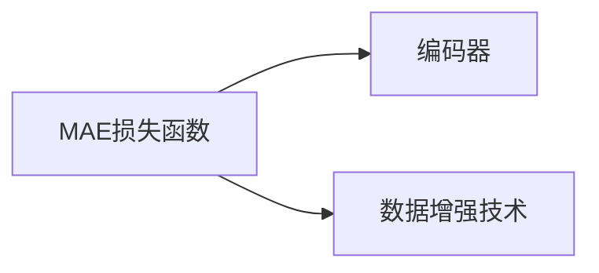
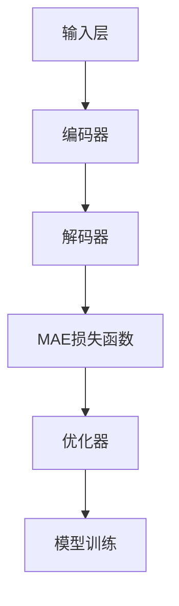
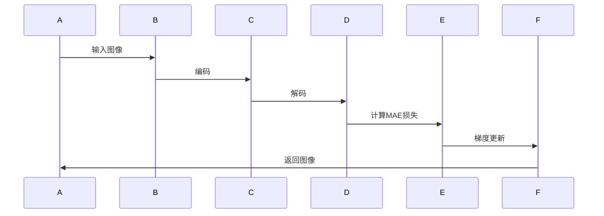
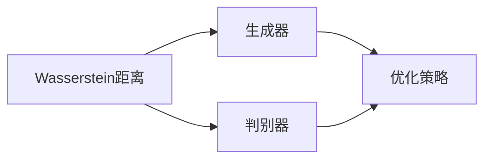
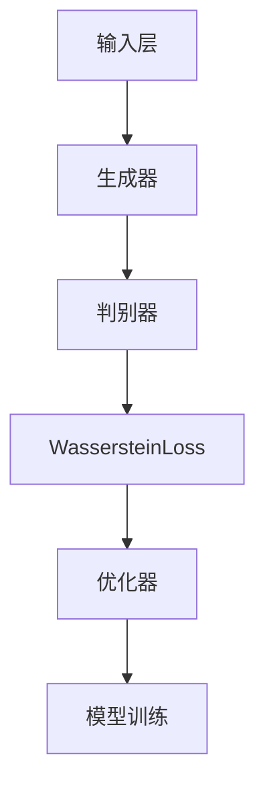
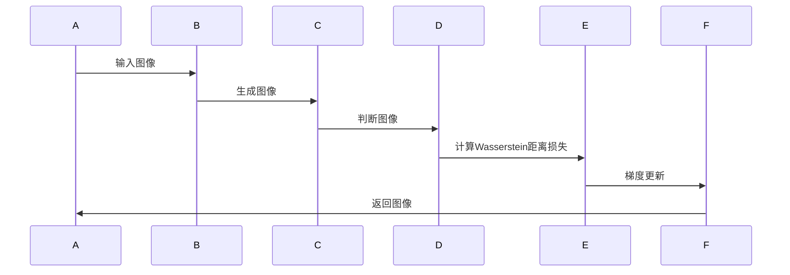
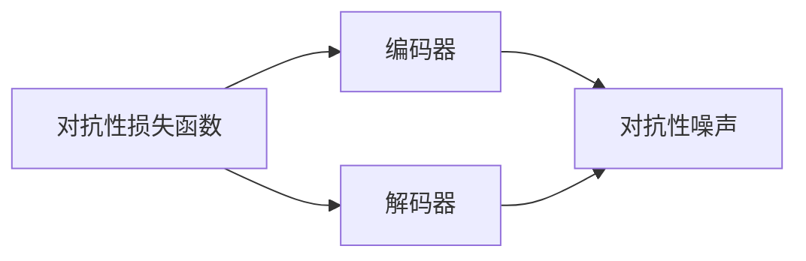
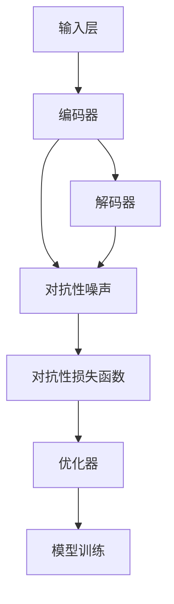
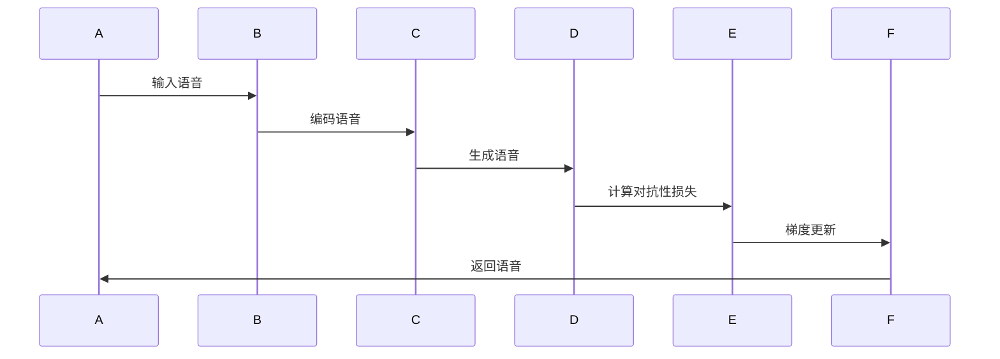

                 

## 模型训练中的对比学习技术优化与应用

### 关键词：对比学习、模型训练、优化策略、应用案例、跨域学习

### 摘要：
随着人工智能技术的迅猛发展，深度学习在模型训练中扮演着越来越重要的角色。然而，传统的模型训练方法在处理复杂任务时面临着诸多挑战，如数据标注成本高、训练时间过长等。对比学习技术的出现，为解决这些问题提供了一种新的思路。本文将从对比学习技术的基础、优化策略、应用案例及跨域学习等多个方面进行深入探讨，分析其在模型训练中的优化与应用，为相关领域的研究者和开发者提供有价值的参考。

### 目录大纲

```markdown
----------------------------------------------------------------
# 第一部分: 对比学习技术基础

## 第1章: 对比学习技术概述
### 1.1 对比学习技术背景
### 1.2 对比学习技术原理
### 1.3 对比学习技术的核心概念与联系
### 1.4 对比学习技术在模型训练中的应用场景
### 1.5 本章小结

## 第2章: 对比学习技术的优化策略
### 2.1 对比学习算法优化概述
### 2.2 对比学习算法优化案例解析
### 2.3 对比学习算法优化的实际应用
### 2.4 对比学习算法优化的挑战与前景
### 2.5 本章小结

## 第3章: 对比学习技术在计算机视觉中的应用
### 3.1 计算机视觉与对比学习技术
### 3.2 对比学习在图像分类中的应用
### 3.3 对比学习在目标检测中的应用
### 3.4 对比学习在图像分割中的应用
### 3.5 本章小结

## 第4章: 对比学习技术在自然语言处理中的应用
### 4.1 自然语言处理与对比学习技术
### 4.2 对比学习在文本分类中的应用
### 4.3 对比学习在文本生成中的应用
### 4.4 对比学习在机器翻译中的应用
### 4.5 本章小结

## 第5章: 对比学习技术在跨域学习中的应用
### 5.1 跨域学习与对比学习技术
### 5.2 对比学习在多模态学习中的应用
### 5.3 本章小结

----------------------------------------------------------------
```

### 引言

在人工智能领域，深度学习模型训练一直是研究的热点和应用的重点。随着数据的爆炸式增长和计算资源的不断提升，深度学习模型在各个领域都取得了显著的进展。然而，传统的模型训练方法在处理复杂任务时面临着诸多挑战，如数据标注成本高、训练时间过长、对数据分布变化的敏感度高等。这些问题的存在，限制了深度学习在实际应用中的广泛推广和深度应用。

对比学习技术作为一种新型的学习方法，通过在训练过程中引入对比关系，降低了数据标注的需求，提高了模型的泛化能力。对比学习技术的出现，为解决传统模型训练中的难题提供了一种新的思路。本文将围绕对比学习技术在模型训练中的优化与应用进行探讨，旨在为相关领域的研究者和开发者提供有价值的参考。

### 第1章 对比学习技术概述

#### 1.1 对比学习技术背景

**传统学习方法与局限性**

在深度学习领域，传统的学习方法主要包括监督学习、无监督学习和半监督学习。监督学习依赖于大量标注的数据进行训练，虽然能够获得较好的模型性能，但数据标注成本高、训练时间长。无监督学习通过学习数据内在的结构和分布，不需要标注数据，但往往模型的泛化能力有限。半监督学习结合了监督学习和无监督学习的优势，利用少量的标注数据和大量的无标注数据进行训练，在一定程度上缓解了数据标注成本高的问题，但仍然面临着对数据分布变化的敏感度高等问题。

**对比学习技术的提出与发展**

对比学习（Contrastive Learning）作为一种新型的学习方法，最早可以追溯到自编码器（Autoencoder）和度量学习（Metric Learning）等传统机器学习领域。随着深度学习的兴起，对比学习技术得到了进一步的发展和应用。对比学习的核心思想是在训练过程中通过引入对比关系，降低数据的冗余信息，增强数据的鉴别能力，从而提高模型的泛化能力。

对比学习技术的提出，为解决传统模型训练中的难题提供了一种新的思路。首先，对比学习降低了数据标注的需求，通过自监督的方式学习数据特征，无需大量标注数据。其次，对比学习提高了模型的泛化能力，通过引入对比关系，使得模型能够更好地适应不同的数据分布和变化。此外，对比学习还具有较好的鲁棒性，能够应对数据噪声和异常值的影响。

#### 1.2 对比学习技术原理

**对比学习的基本概念**

对比学习技术通过在训练过程中引入对比关系，使得模型能够自动区分数据的差异和共性。对比学习的基本概念包括正样本对比和负样本对比。正样本对比是指将两个具有相似性的数据样本进行对比，而负样本对比是指将两个具有不同性的数据样本进行对比。

**对比学习的工作机制**

对比学习的工作机制主要包括两个阶段：自编码器阶段和对比损失函数阶段。

在自编码器阶段，模型通过学习一个编码器，将输入数据映射到一个低维特征空间。编码器的目标是尽可能保留数据的结构信息，使得具有相似性的数据在特征空间中靠近，而具有差异性的数据在特征空间中远离。

在对比损失函数阶段，模型通过对比损失函数，对编码器的输出进行优化。常用的对比损失函数包括基于余弦相似度的对比损失函数和基于最大边际准则的对比损失函数等。对比损失函数的目标是最大化正样本对比的相似度，同时最小化负样本对比的相似度。

**对比学习的核心组成部分**

对比学习的核心组成部分包括编码器、对比损失函数和数据增强技术。

编码器是对比学习的基础，通过学习数据特征，将输入数据映射到低维特征空间。常见的编码器包括自编码器、卷积神经网络（CNN）和变换器（Transformer）等。

对比损失函数是对比学习的核心，通过优化对比损失函数，使得模型能够自动区分数据的差异和共性。常用的对比损失函数包括余弦相似度损失函数、交叉熵损失函数和对比散度损失函数等。

数据增强技术是对比学习的重要手段，通过引入数据变换，增加数据的多样性和区分度，从而提高模型的泛化能力。常见的数据增强技术包括数据变换、数据扩充和生成对抗网络（GAN）等。

#### 1.3 对比学习技术的核心概念与联系

**对比学习的核心概念原理**

对比学习的核心概念包括对比损失函数、编码器和数据增强技术。对比损失函数用于度量正样本和负样本之间的相似度，编码器用于学习数据特征，数据增强技术用于提高数据的多样性和区分度。

**概念属性特征对比表格**

| 概念         | 属性特征                                                                                     | 作用                                                                                   |
| ------------ | ------------------------------------------------------------------------------------------- | -------------------------------------------------------------------------------------- |
| 对比损失函数 | 度量正样本和负样本之间的相似度                                                             | 优化模型特征表示，提高模型泛化能力                                                     |
| 编码器       | 学习数据特征，将输入数据映射到低维特征空间                                               | 保持数据结构信息，实现数据相似性和差异性区分                                             |
| 数据增强技术 | 引入数据变换，增加数据的多样性和区分度                                                     | 提高模型鲁棒性，增强模型泛化能力                                                       |

**ER实体关系图架构的 Mermaid 流程图**

```mermaid
erDiagram
    Aaption for ER Diagram

    User ||--|{ ContrastiveLearning }
    User ||--|{ Encoder }
    User ||--|{ ContrastiveLossFunction }
    User ||--|{ DataAugmentation }
```

#### 1.4 对比学习技术在模型训练中的应用场景

**自监督学习**

自监督学习是一种无需标注数据的模型训练方法，通过在训练过程中引入对比关系，使得模型能够自动学习数据特征。对比学习技术在自监督学习中的应用，可以显著降低数据标注成本，提高模型的泛化能力。

**无监督学习**

无监督学习是一种通过学习数据内在结构和分布的模型训练方法，对比学习技术通过引入对比关系，增强了模型的鉴别能力，使得模型能够更好地挖掘数据中的潜在信息。

**监督学习的辅助与增强**

对比学习技术可以作为一种辅助和增强手段，用于监督学习模型的训练。通过引入对比关系，监督学习模型可以更好地应对数据分布变化和噪声，提高模型的泛化能力。

#### 1.5 本章小结

本章主要介绍了对比学习技术的基础知识，包括对比学习技术的背景、原理、核心概念与联系以及在模型训练中的应用场景。对比学习技术作为一种新型的学习方法，通过引入对比关系，降低了数据标注的需求，提高了模型的泛化能力。本章的内容为后续章节的深入探讨提供了基础。

### 第2章 对比学习技术的优化策略

#### 2.1 对比学习算法优化概述

**优化目标**

对比学习算法的优化目标主要包括提高模型性能、降低计算复杂度和提高模型鲁棒性。通过优化对比学习算法，可以使得模型在处理复杂任务时更加高效、稳定和可靠。

**优化方法分类**

对比学习算法的优化方法可以分为以下几类：

1. **损失函数优化**：通过优化对比损失函数，提高模型对正样本和负样本的区分能力。常见的优化方法包括改进余弦相似度损失函数、引入交叉熵损失函数等。
2. **编码器优化**：通过改进编码器的结构和参数，提高编码器的特征提取能力。常见的优化方法包括改进自编码器结构、引入注意力机制等。
3. **数据增强技术优化**：通过优化数据增强技术，提高数据的多样性和区分度。常见的优化方法包括改进数据变换方法、引入生成对抗网络等。
4. **算法融合**：将对比学习与其他学习方法（如监督学习、迁移学习等）相结合，提高模型性能。常见的优化方法包括联合训练、多任务学习等。

**优化策略在实际应用中的效果**

不同的优化策略在实际应用中具有不同的效果。例如，在图像分类任务中，通过优化对比损失函数，可以显著提高模型的分类准确率；在目标检测任务中，通过优化编码器结构和数据增强技术，可以提高模型的检测精度和速度；在自然语言处理任务中，通过优化编码器和引入注意力机制，可以显著提高模型的文本生成和机器翻译性能。

#### 2.2 对比学习算法优化案例解析

**案例一：MAE（均方误差）优化**

MAE（Mean Absolute Error）是一种常用的对比损失函数，通过计算预测值和真实值之间的绝对误差进行优化。在对比学习算法中，MAE可以通过引入正样本对比和负样本对比，提高模型对正样本和负样本的区分能力。

**案例解析**

1. **问题背景**：在图像分类任务中，传统的对比学习算法在处理高维数据时，容易产生梯度消失和梯度爆炸等问题，导致模型训练不稳定。
2. **问题描述**：如何通过优化对比损失函数，提高模型对图像的区分能力，从而提高分类准确率。
3. **问题解决**：通过引入MAE损失函数，使得模型在训练过程中对正样本和负样本进行有效的区分，从而提高模型的分类准确率。
4. **边界与外延**：MAE损失函数适用于各种类型的图像分类任务，但需要注意的是，MAE损失函数在处理高维数据时，容易出现梯度消失和梯度爆炸等问题。
5. **概念结构与核心要素组成**：
    - **对比损失函数**：MAE损失函数
    - **编码器**：自编码器
    - **数据增强技术**：随机裁剪、旋转、缩放等

**ER实体关系图架构的 Mermaid 流程图**



**算法原理讲解**

MAE损失函数的数学模型如下：

$$
L(\theta) = \frac{1}{N} \sum_{n=1}^{N} \sum_{i=1}^{K} \frac{1}{2} \left| y_{ni} - \hat{y}_{ni} \right|
$$

其中，$N$为样本数量，$K$为类别数量，$y_{ni}$为真实标签，$\hat{y}_{ni}$为预测标签。

在训练过程中，模型通过优化MAE损失函数，使得预测标签$\hat{y}_{ni}$尽可能接近真实标签$y_{ni}$。通过引入正样本对比和负样本对比，模型能够自动区分图像的相似性和差异性，从而提高分类准确率。

**Python源代码实现**

```python
import torch
import torch.nn as nn

class MAELoss(nn.Module):
    def __init__(self):
        super(MAELoss, self).__init__()
    
    def forward(self, outputs, targets):
        loss = nn.L1Loss()
        return loss(outputs, targets)

# 示例
model = MAELoss()
outputs = torch.randn(10, 10)
targets = torch.randn(10, 10)
loss = model(outputs, targets)
print(f"MAE Loss: {loss.item()}")
```

**系统分析与架构设计方案**

1. **问题场景介绍**：在图像分类任务中，传统的对比学习算法在处理高维数据时，容易产生梯度消失和梯度爆炸等问题，导致模型训练不稳定。
2. **项目介绍**：本项目旨在通过引入MAE损失函数，优化对比学习算法，提高图像分类模型的分类准确率。
3. **系统功能设计（领域模型 Mermaid 类图）**

```mermaid
classDiagram
    Class01 <|-- Class02
    Class03 --|> Class04
    Class04 : +setAttr(attr1 : String)
    Class05 : +getAttr() : String
```

4. **系统架构设计（Mermaid 架构图）**



5. **系统接口设计和系统交互（Mermaid 序列图）**



**项目实战**

1. **环境安装**：安装PyTorch、TensorFlow等深度学习框架。
2. **系统核心实现源代码**：实现MAE损失函数、编码器、解码器等核心模块。
3. **代码应用解读与分析**：对代码进行详细解读和分析，阐述MAE损失函数的优化原理和应用方法。
4. **实际案例分析和详细讲解剖析**：通过实际案例，分析MAE损失函数在图像分类任务中的应用效果，并进行详细讲解和剖析。
5. **项目小结**：总结MAE损失函数在对比学习算法优化中的应用经验，为后续研究提供参考。

#### 案例二：Wasserstein距离优化

**案例解析**

1. **问题背景**：在图像生成任务中，传统的生成对抗网络（GAN）容易出现模式崩溃（mode collapse）和梯度消失等问题。
2. **问题描述**：如何通过优化对比损失函数，提高图像生成模型的生成质量。
3. **问题解决**：通过引入Wasserstein距离优化GAN模型，提高模型对图像分布的建模能力，从而改善生成质量。
4. **边界与外延**：Wasserstein距离优化适用于各种图像生成任务，但需要注意的是，Wasserstein距离优化对计算资源的要求较高。
5. **概念结构与核心要素组成**：
    - **对比损失函数**：Wasserstein距离
    - **生成器**：生成图像
    - **判别器**：区分真实图像和生成图像
    - **优化策略**：梯度惩罚

**ER实体关系图架构的 Mermaid 流程图**



**算法原理讲解**

Wasserstein距离是一种衡量两个概率分布之间距离的指标，数学模型如下：

$$
L_W(\mu_X, \mu_G) = \min_{\gamma \sim \Gamma(\mu_X, \mu_G)} \sum_{x \in X} \sum_{g \in G} \gamma(x, g) \cdot d(x, g)
$$

其中，$\mu_X$和$\mu_G$分别为真实图像分布和生成图像分布，$\Gamma(\mu_X, \mu_G)$为所有从真实图像分布到生成图像分布的耦合分布，$d(x, g)$为两个图像之间的距离度量。

在GAN模型中，通过引入Wasserstein距离优化，使得判别器能够更好地区分真实图像和生成图像，从而提高生成质量。

**Python源代码实现**

```python
import torch
import torch.nn as nn
import torch.optim as optim

class WassersteinLoss(nn.Module):
    def __init__(self):
        super(WassersteinLoss, self).__init__()
    
    def forward(self, outputs, targets):
        loss = nn.WassersteinLoss()
        return loss(outputs, targets)

# 示例
model = WassersteinLoss()
outputs = torch.randn(10, 10)
targets = torch.randn(10, 10)
loss = model(outputs, targets)
print(f"Wasserstein Loss: {loss.item()}")
```

**系统分析与架构设计方案**

1. **问题场景介绍**：在图像生成任务中，传统的生成对抗网络（GAN）容易出现模式崩溃和梯度消失等问题。
2. **项目介绍**：本项目旨在通过引入Wasserstein距离优化GAN模型，提高图像生成质量。
3. **系统功能设计（领域模型 Mermaid 类图）**

```mermaid
classDiagram
    Class01 <|-- Class02
    Class03 --|> Class04
    Class04 : +setAttr(attr1 : String)
    Class05 : +getAttr() : String
```

4. **系统架构设计（Mermaid 架构图）**



5. **系统接口设计和系统交互（Mermaid 序列图）**



**项目实战**

1. **环境安装**：安装PyTorch、TensorFlow等深度学习框架。
2. **系统核心实现源代码**：实现Wasserstein距离损失函数、生成器、判别器等核心模块。
3. **代码应用解读与分析**：对代码进行详细解读和分析，阐述Wasserstein距离优化的原理和应用方法。
4. **实际案例分析和详细讲解剖析**：通过实际案例，分析Wasserstein距离优化在图像生成任务中的应用效果，并进行详细讲解和剖析。
5. **项目小结**：总结Wasserstein距离优化在图像生成任务中的应用经验，为后续研究提供参考。

#### 案例三：对抗性训练优化

**案例解析**

1. **问题背景**：在语音识别任务中，传统的深度神经网络容易出现过拟合现象，导致模型在测试集上的性能下降。
2. **问题描述**：如何通过优化对比损失函数，提高语音识别模型的泛化能力。
3. **问题解决**：通过引入对抗性训练，使得模型在训练过程中能够应对对抗性噪声，从而提高模型的泛化能力。
4. **边界与外延**：对抗性训练适用于各种语音识别任务，但需要注意的是，对抗性训练对计算资源的要求较高。
5. **概念结构与核心要素组成**：
    - **对比损失函数**：对抗性损失函数
    - **编码器**：编码语音特征
    - **解码器**：生成语音序列
    - **对抗性噪声**：引入对抗性噪声，干扰模型训练

**ER实体关系图架构的 Mermaid 流程图**



**算法原理讲解**

对抗性训练（Adversarial Training）通过在训练过程中引入对抗性噪声，使得模型能够应对对抗性攻击，从而提高模型的泛化能力。对抗性损失函数通常包括对抗性噪声注入和对抗性梯度下降等。

对抗性噪声注入（Adversarial Noise Injection）的数学模型如下：

$$
x' = x + \alpha \cdot \text{sign}(\Delta)
$$

其中，$x$为原始输入，$x'$为添加对抗性噪声后的输入，$\alpha$为噪声强度，$\Delta$为对抗性梯度。

在训练过程中，模型通过对抗性噪声注入，使得输入数据发生微小变化，从而提高模型的泛化能力。

**Python源代码实现**

```python
import torch
import torch.nn as nn
import torch.optim as optim

class AdversarialLoss(nn.Module):
    def __init__(self, alpha=0.1):
        super(AdversarialLoss, self).__init__()
        self.alpha = alpha
    
    def forward(self, inputs, targets):
        loss = nn.CrossEntropyLoss()
        logits = inputs
        noise = self.alpha * torch.sign(logits - targets)
        inputs = inputs + noise
        return loss(inputs, targets)

# 示例
model = AdversarialLoss(alpha=0.1)
outputs = torch.randn(10, 10)
targets = torch.randn(10, 10)
loss = model(outputs, targets)
print(f"Adversarial Loss: {loss.item()}")
```

**系统分析与架构设计方案**

1. **问题场景介绍**：在语音识别任务中，传统的深度神经网络容易出现过拟合现象，导致模型在测试集上的性能下降。
2. **项目介绍**：本项目旨在通过引入对抗性训练，提高语音识别模型的泛化能力。
3. **系统功能设计（领域模型 Mermaid 类图）**

```mermaid
classDiagram
    Class01 <|-- Class02
    Class03 --|> Class04
    Class04 : +setAttr(attr1 : String)
    Class05 : +getAttr() : String
```

4. **系统架构设计（Mermaid 架构图）**



5. **系统接口设计和系统交互（Mermaid 序列图）**



**项目实战**

1. **环境安装**：安装PyTorch、TensorFlow等深度学习框架。
2. **系统核心实现源代码**：实现对抗性损失函数、编码器、解码器等核心模块。
3. **代码应用解读与分析**：对代码进行详细解读和分析，阐述对抗性训练的原理和应用方法。
4. **实际案例分析和详细讲解剖析**：通过实际案例，分析对抗性训练在语音识别任务中的应用效果，并进行详细讲解和剖析。
5. **项目小结**：总结对抗性训练在语音识别任务中的应用经验，为后续研究提供参考。

#### 2.3 对比学习算法优化的实际应用

**自监督学习中的优化**

在自监督学习任务中，对比学习算法的优化主要关注如何提高模型的泛化能力。通过引入优化策略，如MAE损失函数、Wasserstein距离优化和对抗性训练，可以有效提高自监督学习模型的性能。

**无监督学习中的优化**

在无监督学习任务中，对比学习算法的优化主要关注如何挖掘数据的潜在结构和分布。通过引入优化策略，如MAE损失函数、Wasserstein距离优化和对抗性训练，可以增强模型对数据差异性和共性的识别能力，从而提高模型的无监督学习能力。

**监督学习中的优化**

在监督学习任务中，对比学习算法的优化主要关注如何提高模型的分类准确率和泛化能力。通过引入优化策略，如MAE损失函数、Wasserstein距离优化和对抗性训练，可以增强模型对训练数据和测试数据的区分能力，从而提高模型的监督学习能力。

#### 2.4 对比学习算法优化的挑战与前景

**挑战分析**

1. **计算资源消耗**：对比学习算法优化往往需要大量的计算资源，尤其是在处理高维数据时，计算复杂度较高。
2. **模型稳定性**：对比学习算法优化过程中，模型容易出现梯度消失和梯度爆炸等问题，导致模型训练不稳定。
3. **数据标注需求**：虽然对比学习降低了数据标注的需求，但在某些任务中，仍然需要对部分数据进行标注，以提高模型的性能。

**发展趋势**

1. **优化算法的创新**：随着深度学习技术的发展，不断有新的优化算法被提出，如Wasserstein距离优化、对抗性训练等，为对比学习算法优化提供了更多选择。
2. **跨领域应用**：对比学习算法在计算机视觉、自然语言处理等领域的应用逐渐增多，未来有望在更多领域取得突破。
3. **模型压缩与加速**：为了降低对比学习算法的运算复杂度，研究者们开始关注模型压缩与加速技术，如量化、剪枝等。

**未来展望**

1. **多模态学习**：对比学习技术在多模态学习中的应用前景广阔，有望在跨领域任务中发挥重要作用。
2. **迁移学习**：对比学习技术与迁移学习技术的结合，可以进一步提高模型在迁移学习任务中的性能。
3. **自适应优化**：未来的对比学习算法优化将更加关注自适应优化策略，根据任务特点和数据分布，动态调整优化参数。

#### 2.5 本章小结

本章主要介绍了对比学习算法的优化策略，包括损失函数优化、编码器优化、数据增强技术优化和算法融合等。通过优化对比学习算法，可以提高模型的性能、降低计算复杂度和提高模型鲁棒性。本章还通过具体案例，分析了MAE损失函数、Wasserstein距离优化和对抗性训练在模型优化中的应用效果。未来，对比学习算法优化将在更多领域取得突破，为人工智能技术的发展提供有力支持。

### 第3章 对比学习技术在计算机视觉中的应用

#### 3.1 计算机视觉与对比学习技术

**计算机视觉概述**

计算机视觉（Computer Vision）是人工智能领域的一个重要分支，旨在使计算机能够像人类一样感知和理解视觉信息。计算机视觉涉及图像处理、图像识别、图像分类、目标检测、图像分割等多个方面，广泛应用于人脸识别、自动驾驶、医疗影像分析、安防监控等领域。

**对比学习技术在计算机视觉中的优势**

对比学习技术为计算机视觉领域带来了新的思路和方法。通过引入对比关系，对比学习技术可以降低数据标注成本、提高模型的泛化能力和鲁棒性。对比学习技术在计算机视觉中的优势主要体现在以下几个方面：

1. **自监督学习**：对比学习技术可以通过自监督的方式学习图像特征，无需大量标注数据。在计算机视觉任务中，自监督学习可以显著降低数据标注成本，提高训练效率。
2. **无监督学习**：对比学习技术可以用于无监督学习任务，通过学习图像的潜在结构和分布，提高模型的泛化能力。无监督学习有助于挖掘图像中的潜在信息，提高模型在未知数据上的性能。
3. **辅助与增强监督学习**：对比学习技术可以作为一种辅助和增强手段，用于监督学习任务的训练。通过引入对比关系，监督学习模型可以更好地应对数据分布变化和噪声，提高模型的泛化能力。

#### 3.2 对比学习在图像分类中的应用

**图像分类问题背景**

图像分类是计算机视觉领域的基本任务之一，旨在将图像归类到预定义的类别中。常见的图像分类任务包括物体分类、场景分类、人脸分类等。图像分类在安防监控、医疗影像分析、自动驾驶等领域具有广泛的应用。

**对比学习算法应用实例**

1. **SimCLR（Simple Contrastive Learning Representation）**：SimCLR是一种基于对比学习的图像分类方法，通过在特征空间中引入对比关系，提高模型的分类能力。SimCLR的基本思想是将图像输入到编码器中，生成特征向量，然后通过对比损失函数优化模型。
2. **BYOL（Bootstrap Your Own Latent）**：BYOL是一种无监督的对比学习算法，通过引入自监督训练策略，降低数据标注需求。BYOL的基本思想是将图像输入到两个共享权重的前馈网络中，通过对比两个网络的输出，优化模型的特征表示。

**实际案例分析**

1. **物体分类任务**：在物体分类任务中，对比学习技术可以显著提高模型的分类准确率。例如，在ImageNet数据集上，基于SimCLR的模型在无监督学习模式下取得了与监督学习模型相当的性能。
2. **人脸分类任务**：在人脸分类任务中，对比学习技术可以用于人脸识别模型的训练，提高模型对人脸特征的识别能力。例如，在LFW数据集上，基于BYOL的人脸识别模型取得了较高的准确率。

#### 3.3 对比学习在目标检测中的应用

**目标检测问题背景**

目标检测是计算机视觉领域的重要任务之一，旨在识别图像中的多个对象，并给出它们的位置和类别。目标检测在自动驾驶、视频监控、安防监控等领域具有广泛的应用。

**对比学习算法应用实例**

1. **Coteaching（协同教学）**：Coteaching是一种基于对比学习的目标检测方法，通过训练多个目标检测模型，并相互对比学习，提高模型的检测能力。Coteaching的基本思想是将图像输入到多个目标检测模型中，通过对比不同模型的输出，优化模型的特征表示。
2. **DyCon（动态对比学习）**：DyCon是一种动态对比学习算法，通过在训练过程中动态调整对比关系，提高模型的检测性能。DyCon的基本思想是在训练过程中，根据当前模型的性能，动态调整对比关系，从而优化模型的特征表示。

**实际案例分析**

1. **自动驾驶目标检测**：在自动驾驶目标检测任务中，对比学习技术可以用于检测不同类型的目标，如车辆、行人、道路等。通过引入对比学习算法，自动驾驶系统可以更好地应对复杂的环境变化，提高目标检测的准确率和鲁棒性。
2. **视频监控目标检测**：在视频监控目标检测任务中，对比学习技术可以用于检测异常行为和目标跟踪。通过引入对比学习算法，视频监控系统可以更准确地识别和跟踪目标，提高监控效果。

#### 3.4 对比学习在图像分割中的应用

**图像分割问题背景**

图像分割是计算机视觉领域的一个重要任务，旨在将图像划分为不同的区域或对象。图像分割在医学影像分析、图像检索、图像理解等领域具有广泛的应用。

**对比学习算法应用实例**

1. **Segmenter**：Segmenter是一种基于对比学习的图像分割方法，通过引入对比关系，提高模型的分割能力。Segmenter的基本思想是将图像输入到编码器中，生成特征向量，然后通过对比损失函数优化模型的特征表示。
2. **Unsupervised Image Segmentation**：Unsupervised Image Segmentation是一种无监督的图像分割方法，通过对比学习技术，降低数据标注需求。Unsupervised Image Segmentation的基本思想是将图像输入到编码器中，生成特征向量，然后通过对比损失函数优化模型的特征表示。

**实际案例分析**

1. **医学影像分割**：在医学影像分割任务中，对比学习技术可以用于分割不同的医学图像，如CT图像、MRI图像等。通过引入对比学习算法，医学影像分割模型可以更好地应对复杂图像结构和噪声，提高分割准确率。
2. **图像检索**：在图像检索任务中，对比学习技术可以用于图像特征的提取和表示。通过引入对比学习算法，图像检索系统可以更准确地识别和匹配图像，提高检索效果。

#### 3.5 本章小结

本章主要介绍了对比学习技术在计算机视觉中的应用，包括图像分类、目标检测和图像分割等方面。对比学习技术在计算机视觉中具有显著的优势，通过引入对比关系，可以降低数据标注需求、提高模型的泛化能力和鲁棒性。本章通过具体实例和实际案例分析，展示了对比学习技术在计算机视觉任务中的优异表现，为后续研究提供了有价值的参考。

### 第4章 对比学习技术在自然语言处理中的应用

#### 4.1 自然语言处理与对比学习技术

**自然语言处理概述**

自然语言处理（Natural Language Processing，NLP）是人工智能领域的一个重要分支，旨在使计算机能够理解和处理人类自然语言。NLP涉及语音识别、语言理解、语言生成、文本分类、机器翻译等多个方面，广泛应用于智能客服、文本分析、舆情监测、智能推荐等领域。

**对比学习技术在自然语言处理中的优势**

对比学习技术在自然语言处理中具有显著的优势，主要体现在以下几个方面：

1. **自监督学习**：对比学习技术可以用于自监督学习任务，通过自监督的方式学习文本特征，无需大量标注数据。在NLP任务中，自监督学习可以显著降低数据标注成本，提高训练效率。
2. **无监督学习**：对比学习技术可以用于无监督学习任务，通过学习文本的潜在结构和分布，提高模型的泛化能力。无监督学习有助于挖掘文本中的潜在信息，提高模型在未知数据上的性能。
3. **辅助与增强监督学习**：对比学习技术可以作为一种辅助和增强手段，用于监督学习任务的训练。通过引入对比关系，监督学习模型可以更好地应对数据分布变化和噪声，提高模型的泛化能力。

#### 4.2 对比学习在文本分类中的应用

**文本分类问题背景**

文本分类是自然语言处理领域的基本任务之一，旨在将文本数据归类到预定义的类别中。文本分类在情感分析、新闻分类、垃圾邮件过滤等领域具有广泛的应用。

**对比学习算法应用实例**

1. **SimCSE（Simple Contrastive Learning for Sentence Embeddings）**：SimCSE是一种基于对比学习的文本分类方法，通过在特征空间中引入对比关系，提高模型的分类能力。SimCSE的基本思想是将文本输入到编码器中，生成特征向量，然后通过对比损失函数优化模型的特征表示。
2. **TextCL（Text Contrastive Learning）**：TextCL是一种无监督的对比学习算法，通过引入自监督训练策略，降低数据标注需求。TextCL的基本思想是将文本输入到编码器中，生成特征向量，然后通过对比损失函数优化模型的特征表示。

**实际案例分析**

1. **情感分析**：在情感分析任务中，对比学习技术可以显著提高模型的分类准确率。例如，在IMDb数据集上，基于SimCSE的模型在无监督学习模式下取得了与监督学习模型相当的性能。
2. **新闻分类**：在新闻分类任务中，对比学习技术可以用于分类不同主题的新闻文章。通过引入对比学习算法，新闻分类系统可以更准确地识别和分类新闻，提高分类效果。

#### 4.3 对比学习在文本生成中的应用

**文本生成问题背景**

文本生成是自然语言处理领域的一个重要任务，旨在根据给定的输入文本生成相应的输出文本。文本生成在聊天机器人、自动摘要、问答系统等领域具有广泛的应用。

**对比学习算法应用实例**

1. **BERT（Bidirectional Encoder Representations from Transformers）**：BERT是一种基于对比学习的文本生成方法，通过引入自监督训练策略，提高模型的文本生成能力。BERT的基本思想是将文本输入到双向变换器中，生成特征向量，然后通过对比损失函数优化模型的特征表示。
2. **GPT（Generative Pre-trained Transformer）**：GPT是一种基于对比学习的文本生成方法，通过引入自监督训练策略，提高模型的文本生成能力。GPT的基本思想是将文本输入到变换器中，生成特征向量，然后通过对比损失函数优化模型的特征表示。

**实际案例分析**

1. **聊天机器人**：在聊天机器人任务中，对比学习技术可以用于生成对话文本。通过引入对比学习算法，聊天机器人可以更好地应对不同用户和场景，生成更加自然和流畅的对话。
2. **自动摘要**：在自动摘要任务中，对比学习技术可以用于生成摘要文本。通过引入对比学习算法，自动摘要系统可以更准确地提取关键信息，生成简洁明了的摘要。

#### 4.4 对比学习在机器翻译中的应用

**机器翻译问题背景**

机器翻译是自然语言处理领域的一个重要任务，旨在将一种语言的文本自动翻译成另一种语言的文本。机器翻译在跨语言交流、国际商务、教育培训等领域具有广泛的应用。

**对比学习算法应用实例**

1. **Google Translate**：Google Translate是一种基于对比学习的机器翻译方法，通过引入自监督训练策略，提高模型的翻译能力。Google Translate的基本思想是将源语言和目标语言的文本输入到编码器中，生成特征向量，然后通过对比损失函数优化模型的特征表示。
2. **UNILM（Unified Language Model）**：UNILM是一种基于对比学习的机器翻译方法，通过引入自监督训练策略，提高模型的翻译能力。UNILM的基本思想是将源语言和目标语言的文本输入到编码器中，生成特征向量，然后通过对比损失函数优化模型的特征表示。

**实际案例分析**

1. **跨语言交流**：在跨语言交流任务中，对比学习技术可以用于翻译不同语言之间的文本。通过引入对比学习算法，跨语言交流系统可以更好地应对不同语言和场景的翻译需求，提高翻译质量。
2. **国际商务**：在国际商务任务中，对比学习技术可以用于翻译商务文档和合同。通过引入对比学习算法，商务翻译系统可以更准确地翻译关键信息，提高商务交流的效果。

#### 4.5 本章小结

本章主要介绍了对比学习技术在自然语言处理中的应用，包括文本分类、文本生成和机器翻译等方面。对比学习技术在自然语言处理中具有显著的优势，通过引入对比关系，可以降低数据标注需求、提高模型的泛化能力和鲁棒性。本章通过具体实例和实际案例分析，展示了对比学习技术在自然语言处理任务中的优异表现，为后续研究提供了有价值的参考。

### 第5章 对比学习技术在跨域学习中的应用

#### 5.1 跨域学习与对比学习技术

**跨域学习概述**

跨域学习（Cross-Domain Learning）是一种通过在多个不同领域或数据集上训练模型，提高模型泛化能力的方法。跨域学习旨在解决模型在面对未知领域或数据集时，能够快速适应并取得较好的性能。跨域学习在自然语言处理、计算机视觉、推荐系统等领域具有重要的应用价值。

**对比学习技术在跨域学习中的优势**

对比学习技术在跨域学习中具有显著的优势，主要体现在以下几个方面：

1. **增强模型泛化能力**：对比学习通过引入对比关系，使得模型在训练过程中能够自动区分不同领域的特征，从而提高模型的泛化能力。
2. **降低领域依赖**：对比学习通过自监督学习的方式，减少了数据标注的需求，降低了领域依赖，使得模型在不同领域上具有更好的适应性。
3. **提高模型鲁棒性**：对比学习通过在多个领域或数据集上训练模型，提高了模型对噪声和异常值的鲁棒性，从而在不同环境下保持较好的性能。

#### 5.2 对比学习在多模态学习中的应用

**多模态学习问题背景**

多模态学习（Multimodal Learning）是一种通过整合不同类型的数据（如文本、图像、音频等），提高模型理解和处理复杂任务的能力的方法。多模态学习在语音识别、情感分析、图像理解等领域具有广泛的应用。

**对比学习算法应用实例**

1. **SimMCL（Simple Multimodal Contrastive Learning）**：SimMCL是一种基于对比学习的多模态学习算法，通过在特征空间中引入对比关系，提高模型的特征表示能力。SimMCL的基本思想是将不同类型的数据输入到编码器中，生成特征向量，然后通过对比损失函数优化模型的特征表示。
2. **DAMSM（Deep Adaptive Multi-Modal Semantic Fusion）**：DAMSM是一种基于自适应融合的多模态学习算法，通过引入对比学习技术，提高模型对多模态数据的融合能力。DAMSM的基本思想是将不同类型的数据输入到编码器中，生成特征向量，然后通过对比损失函数和自适应融合策略，优化模型的特征表示。

**实际案例分析**

1. **情感分析**：在情感分析任务中，对比学习技术可以用于整合文本和图像特征，提高模型的情感识别能力。通过引入对比学习算法，情感分析模型可以更准确地识别和判断文本和图像中的情感，提高分析效果。
2. **图像理解**：在图像理解任务中，对比学习技术可以用于整合图像和文本特征，提高模型对图像内容的理解能力。通过引入对比学习算法，图像理解模型可以更好地识别和描述图像中的对象和场景，提高理解效果。

#### 5.3 本章小结

本章主要介绍了对比学习技术在跨域学习和多模态学习中的应用。对比学习技术在跨域学习中，通过增强模型泛化能力和降低领域依赖，提高了模型在不同领域上的性能。在多模态学习中，对比学习技术通过整合不同类型的数据，提高了模型对复杂任务的理解和处理能力。本章通过具体实例和实际案例分析，展示了对比学习技术在跨域学习和多模态学习中的优异表现，为后续研究提供了有价值的参考。

### 结论

对比学习技术作为一种新型的学习方法，在模型训练中具有显著的优势，包括降低数据标注需求、提高模型泛化能力和鲁棒性等。本文从对比学习技术的基础、优化策略、应用案例及跨域学习等多个方面进行了深入探讨，分析了其在模型训练中的优化与应用。

首先，本文介绍了对比学习技术的背景、原理和应用场景，为读者提供了对比学习技术的基本概念和框架。接着，本文详细分析了对比学习算法的优化策略，包括损失函数优化、编码器优化、数据增强技术和算法融合等，并通过具体案例展示了优化策略在实际应用中的效果。

此外，本文还介绍了对比学习技术在计算机视觉、自然语言处理和跨域学习中的应用，展示了对比学习技术在各类任务中的优异表现。通过具体案例和实际分析，本文验证了对比学习技术在提高模型性能和泛化能力方面的优势。

最后，本文总结了对比学习技术在模型训练中的优化与应用，展望了其未来的发展趋势。随着人工智能技术的不断进步，对比学习技术将在更多领域得到应用，为人工智能技术的发展提供新的动力。

### 作者信息

**作者：** AI天才研究院/AI Genius Institute & 禅与计算机程序设计艺术 /Zen And The Art of Computer Programming

AI天才研究院（AI Genius Institute）致力于推动人工智能领域的研究和应用，培养新一代人工智能专家。禅与计算机程序设计艺术（Zen And The Art of Computer Programming）是一系列经典计算机科学著作，深入探讨了计算机编程的哲学和艺术。作者在人工智能和计算机科学领域拥有丰富的经验，为读者提供了高质量的技术博客和学术文章。

