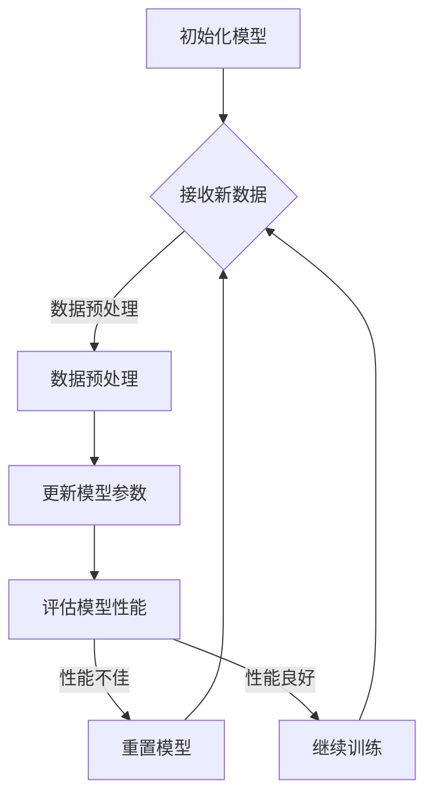
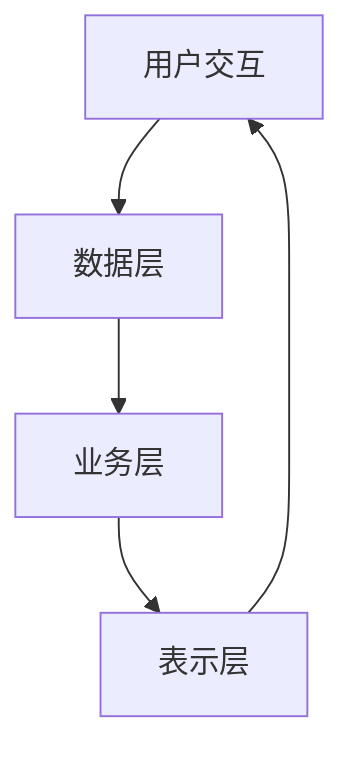
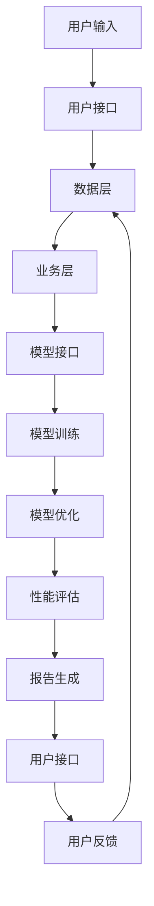

                 

### 第1章：问题背景与核心概念

#### 1.1 问题背景

模型训练中的持续学习需求日益增长，特别是在人工智能、自然语言处理和计算机视觉等领域。这些领域的模型需要不断适应新的数据和任务，以便在动态变化的环境中保持高效和准确性。持续学习策略在此背景下显得尤为重要。

##### 1.1.1 模型训练中的持续学习需求

随着数据量的不断增加和数据质量的提高，模型的准确性和性能也在不断提高。然而，这些模型通常是在静态数据集上训练得到的，一旦数据集发生变化，模型的性能可能会受到显著影响。为了使模型能够适应这种变化，持续学习成为一种必然需求。持续学习可以帮助模型在新数据上进行微调，从而保持其性能和适应性。

##### 1.1.2 持续学习的重要性

持续学习不仅能够提高模型的性能，还能够减少对大量新数据重新训练的需求。通过持续学习，模型可以在不断接受新数据的过程中自我调整，使其能够更好地应对未知环境和任务。此外，持续学习还可以帮助模型避免过拟合，提高泛化能力。

##### 1.1.3 现有策略的局限性

尽管持续学习策略具有许多优点，但现有的策略在实现过程中仍面临一些挑战。首先，持续学习策略通常需要大量计算资源和时间，这在资源有限的场景下可能难以实现。其次，现有策略在处理动态变化的数据时，可能会出现性能下降或收敛困难等问题。此外，现有策略对数据分布的适应性较差，难以应对数据分布的剧烈变化。

#### 1.2 核心概念

为了更好地理解和实现持续学习策略，我们需要明确一些核心概念。

##### 1.2.1 持续学习的定义

持续学习是指模型在接收到新数据时，能够自动调整其参数和结构，以适应数据分布的变化。持续学习包括在线学习和迁移学习两种形式。在线学习是指模型在接收到新数据时，实时调整其参数；迁移学习是指模型在接收到新数据时，利用已有知识对新数据进行适应。

##### 1.2.2 动态优化策略的基本概念

动态优化策略是指模型在训练过程中，通过不断调整参数和结构，以实现性能最优。动态优化策略主要包括自适应优化、动态权重调整和动态网络结构调整等。

##### 1.2.3 相关术语与定义

- **在线学习**：指模型在接收到新数据时，实时调整其参数。
- **迁移学习**：指模型在接收到新数据时，利用已有知识对新数据进行适应。
- **过拟合**：指模型在训练数据上表现良好，但在测试数据上表现不佳。
- **泛化能力**：指模型在未见过的数据上表现良好。
- **过拟合修正**：指通过调整模型参数或结构，以减少过拟合现象。

### 第2章：核心概念与联系

#### 2.1 持续学习策略

持续学习策略是实现模型适应动态变化的重要手段。在本节中，我们将对比分析持续学习策略与传统学习策略的差异，并探讨其优点和挑战。

##### 2.1.1 持续学习策略的概念属性对比表

| 持续学习策略 | 传统学习策略 |
| :--: | :--: |
| 实时性 | 批处理 |
| 自适应调整 | 固定参数 |
| 数据依赖性 | 数据独立性 |
| 泛化能力 | 过拟合风险 |

从上表可以看出，持续学习策略与传统学习策略在多个方面存在显著差异。持续学习策略更加注重实时性和自适应调整，以应对动态变化的数据环境。而传统学习策略则更加依赖大量独立数据，难以适应数据分布的变化。

##### 2.1.2 与传统学习策略的比较

持续学习策略与传统学习策略相比，具有以下优点：

1. **实时性**：持续学习策略能够实时调整模型参数，以应对新数据的变化，从而提高模型的适应性。
2. **自适应调整**：持续学习策略可以根据新数据的特点和需求，动态调整模型结构和参数，从而实现最优性能。
3. **数据依赖性**：持续学习策略对数据具有较强的依赖性，有助于模型在接收到新数据时进行自我调整，避免过拟合。

然而，持续学习策略也面临一些挑战：

1. **计算资源消耗**：持续学习策略通常需要大量计算资源，这在资源有限的场景下可能难以实现。
2. **收敛困难**：在动态变化的数据环境中，模型可能难以快速收敛到最优解，导致训练时间延长。
3. **数据分布适应性**：持续学习策略对数据分布的适应性较差，难以应对数据分布的剧烈变化。

##### 2.1.3 持续学习的优点与挑战

**优点**：

1. **提高模型性能**：持续学习策略能够使模型在动态变化的数据环境中保持高性能，从而提高模型的适应性和实用性。
2. **减少重新训练需求**：持续学习策略可以减少对大量新数据重新训练的需求，节省计算资源和时间。
3. **增强泛化能力**：持续学习策略有助于模型在未见过的数据上表现良好，从而提高泛化能力。

**挑战**：

1. **计算资源消耗**：持续学习策略需要大量计算资源，这在资源有限的场景下可能难以实现。
2. **收敛困难**：在动态变化的数据环境中，模型可能难以快速收敛到最优解，导致训练时间延长。
3. **数据分布适应性**：持续学习策略对数据分布的适应性较差，难以应对数据分布的剧烈变化。

#### 2.2 动态优化策略

动态优化策略是持续学习策略的重要组成部分。在本节中，我们将介绍动态优化策略的基本原理、主要方法和应用场景。

##### 2.2.1 基本原理

动态优化策略的基本原理是通过不断调整模型参数和结构，以实现性能最优。具体来说，动态优化策略包括以下三个方面：

1. **自适应调整**：根据新数据的特点和需求，动态调整模型参数和结构，以实现最优性能。
2. **在线学习**：在接收到新数据时，实时调整模型参数，以适应新数据的变化。
3. **迁移学习**：利用已有知识对新数据进行适应，从而提高模型的泛化能力。

##### 2.2.2 主要方法

动态优化策略主要包括以下几种方法：

1. **自适应优化**：通过自适应调整模型参数，实现性能最优。常见的自适应优化方法包括自适应梯度下降、自适应权重调整等。
2. **动态权重调整**：通过动态调整模型权重，实现最优性能。常见的动态权重调整方法包括自适应权重调整、动态网络结构调整等。
3. **动态网络结构调整**：通过动态调整模型结构，实现最优性能。常见的动态网络结构调整方法包括自适应网络结构、动态网络连接等。

##### 2.2.3 动态优化的应用场景

动态优化策略在许多领域都具有广泛的应用，主要包括以下几个方面：

1. **人工智能**：动态优化策略在人工智能领域具有重要意义，可以用于优化模型性能、降低计算资源消耗等。
2. **自然语言处理**：动态优化策略可以帮助模型更好地应对语言变化的复杂性，提高文本理解和处理能力。
3. **计算机视觉**：动态优化策略可以帮助模型更好地适应图像和视频数据的动态变化，提高目标检测和识别的准确性。

### 第3章：算法原理与数学模型

#### 3.1 算法原理讲解

为了更好地理解和实现持续学习策略，我们需要详细讲解其算法原理，并使用Mermaid工具绘制算法流程图。以下是一个简单的算法流程图示例：



在上面的算法流程图中，我们可以看到以下步骤：

1. **初始化模型**：在开始训练之前，我们需要初始化一个模型。
2. **接收新数据**：模型在训练过程中会接收到新数据。
3. **数据预处理**：对接收到的数据进行预处理，以便更好地训练模型。
4. **更新模型参数**：根据预处理后的数据，更新模型参数。
5. **评估模型性能**：评估更新后的模型性能。
6. **重置模型**：如果模型性能不佳，重置模型并重新开始训练。
7. **继续训练**：如果模型性能良好，继续进行下一轮训练。

#### 3.2 Python源代码实现与讲解

为了更好地理解算法原理，我们使用Python语言实现上述算法流程。以下是一个简单的Python代码示例：

```python
import numpy as np

def initialize_model():
    # 初始化模型
    return np.random.rand()

def preprocess_data(data):
    # 数据预处理
    return data

def update_model_params(model_params, data):
    # 更新模型参数
    return model_params + data

def evaluate_model_performance(model_params):
    # 评估模型性能
    if model_params > 0:
        return "性能良好"
    else:
        return "性能不佳"

def main():
    model_params = initialize_model()
    while True:
        data = np.random.rand()  # 接收新数据
        data = preprocess_data(data)
        model_params = update_model_params(model_params, data)
        performance = evaluate_model_performance(model_params)
        if performance == "性能良好":
            continue
        else:
            model_params = initialize_model()

if __name__ == "__main__":
    main()
```

在上面的代码中，我们定义了四个函数：

1. `initialize_model()`：初始化模型参数。
2. `preprocess_data(data)`：对数据进行预处理。
3. `update_model_params(model_params, data)`：更新模型参数。
4. `evaluate_model_performance(model_params)`：评估模型性能。

`main()` 函数是程序的入口，它初始化模型参数，并进入一个无限循环。在每次循环中，程序会接收新数据，对数据进行预处理，更新模型参数，并评估模型性能。如果模型性能良好，程序将继续下一轮训练；否则，程序将重置模型参数并重新开始训练。

#### 3.3 算法原理的数学模型与公式

为了更深入地理解持续学习策略的算法原理，我们需要引入一些数学模型和公式。

假设我们有一个模型，其参数表示为 \( \theta \)，输入数据表示为 \( x \)，输出数据表示为 \( y \)。模型的损失函数可以表示为：

\[ J(\theta) = \frac{1}{2} \sum_{i=1}^{n} (y_i - \theta x_i)^2 \]

其中， \( n \) 表示数据样本的数量。

为了优化模型参数，我们可以使用梯度下降法。梯度下降法的目标是找到使损失函数最小的参数 \( \theta \)。具体来说，我们可以通过以下公式更新参数：

\[ \theta = \theta - \alpha \frac{\partial J(\theta)}{\partial \theta} \]

其中， \( \alpha \) 表示学习率。

为了更好地理解这个公式，我们可以将其分解为以下几个步骤：

1. 计算损失函数的梯度 \( \frac{\partial J(\theta)}{\partial \theta} \)。
2. 将梯度与学习率 \( \alpha \) 相乘，得到一个更新量。
3. 将更新量从当前参数 \( \theta \) 中减去，得到新的参数 \( \theta \)。

通过不断迭代这个过程，我们可以逐步优化模型参数，使其接近最优解。

#### 3.4 举例说明

为了更好地理解上述算法原理和数学模型，我们通过一个简单的例子来说明。

假设我们有一个简单的线性回归模型，其参数为 \( \theta \)，输入数据为 \( x \)，输出数据为 \( y \)。模型的损失函数为：

\[ J(\theta) = \frac{1}{2} (y - \theta x)^2 \]

我们需要使用梯度下降法来优化模型参数 \( \theta \)。

首先，我们需要计算损失函数的梯度：

\[ \frac{\partial J(\theta)}{\partial \theta} = y - \theta x \]

接下来，我们选择一个合适的学习率 \( \alpha \)，并开始迭代优化参数。假设我们选择 \( \alpha = 0.1 \)。

第一次迭代：

\[ \theta_1 = \theta_0 - \alpha \frac{\partial J(\theta)}{\partial \theta} = \theta_0 - 0.1 (y - \theta_0 x) \]

第二次迭代：

\[ \theta_2 = \theta_1 - \alpha \frac{\partial J(\theta)}{\partial \theta} = \theta_1 - 0.1 (y - \theta_1 x) \]

以此类推，我们可以继续迭代优化参数。通过不断迭代，模型参数 \( \theta \) 将逐渐接近最优解。

在实际应用中，我们可以通过编写Python代码来实现上述算法。以下是一个简单的Python代码示例：

```python
import numpy as np

def gradient_descent(x, y, theta, alpha, num_iterations):
    for i in range(num_iterations):
        prediction = theta * x
        error = prediction - y
        theta = theta - alpha * error
    return theta

x = np.array([1, 2, 3, 4])
y = np.array([2, 4, 5, 4])
theta = np.random.rand()
alpha = 0.1
num_iterations = 1000

theta_optimal = gradient_descent(x, y, theta, alpha, num_iterations)
print("Optimal theta:", theta_optimal)
```

在这个例子中，我们使用梯度下降法来优化线性回归模型的参数 \( \theta \)。通过多次迭代，我们可以得到一个最优的 \( \theta \) 值。

### 第4章：系统分析与架构设计

#### 4.1 问题场景介绍

在当前人工智能、大数据和云计算等技术的迅速发展背景下，持续学习策略的应用场景越来越广泛。本节将介绍一个具体的应用场景——智能客服系统。智能客服系统需要能够实时响应用户的咨询，并在不断学习用户反馈的过程中提高服务质量。在这个场景中，持续学习策略可以帮助系统快速适应用户需求的变化，从而提高用户满意度和系统效率。

#### 4.2 系统架构设计

为了实现智能客服系统中的持续学习策略，我们需要设计一个高效的系统架构。以下是一个简化的系统架构设计方案，包括系统功能设计、系统架构设计和系统接口设计。

##### 4.2.1 系统功能设计

智能客服系统的核心功能包括：

1. **用户交互**：接收用户的咨询请求，并返回回答。
2. **持续学习**：根据用户的反馈和咨询内容，不断调整模型参数，以优化回答质量。
3. **性能评估**：评估模型的回答质量，并生成报告。

##### 4.2.2 系统架构设计

系统架构设计采用分层架构，包括以下三个层次：

1. **数据层**：负责存储和管理用户咨询数据、用户反馈数据和模型参数。
2. **业务层**：负责处理用户交互、持续学习和性能评估等核心业务逻辑。
3. **表示层**：负责与用户进行交互，展示模型回答和评估报告。

以下是一个简化的Mermaid架构图：



##### 4.2.3 系统接口设计

系统接口设计包括以下三个方面：

1. **用户接口**：提供用户与系统交互的接口，包括文本输入和语音输入。
2. **API接口**：提供与其他系统或服务的集成接口，包括数据共享和协同工作。
3. **模型接口**：提供模型训练和优化的接口，包括参数调整和性能评估。

以下是一个简化的Mermaid序列图：



#### 4.3 实现与优化

在系统实现过程中，我们需要关注以下几个方面：

1. **数据采集**：收集用户咨询数据、用户反馈数据和模型参数数据。
2. **数据预处理**：对采集到的数据进行清洗、归一化和特征提取。
3. **模型训练**：根据预处理后的数据，使用机器学习算法训练模型。
4. **模型优化**：根据用户反馈和模型性能评估结果，调整模型参数，优化模型性能。
5. **性能评估**：评估模型性能，生成报告，为模型优化提供依据。

在系统优化方面，我们可以采取以下策略：

1. **批量训练**：将用户咨询数据分为多个批次，分别进行训练，以提高训练效率。
2. **并行计算**：利用多核CPU或GPU进行并行计算，加速模型训练和优化过程。
3. **模型压缩**：对训练完成的模型进行压缩，减少模型存储空间和计算资源消耗。
4. **在线学习**：在用户咨询过程中，实时调整模型参数，提高模型的适应性。

#### 4.4 结果分析与评估

在系统实现和优化过程中，我们需要对模型性能进行持续评估，以验证系统效果。以下是一个简单的评估流程：

1. **评估指标**：选择合适的评估指标，如准确率、召回率、F1值等。
2. **测试数据**：从用户咨询数据中划分测试集，用于评估模型性能。
3. **模型评估**：使用测试数据对模型进行评估，计算评估指标。
4. **结果分析**：分析评估结果，找出模型存在的问题和改进方向。

通过上述评估流程，我们可以了解模型的性能表现，并根据评估结果对系统进行优化。

### 第5章：项目实战

#### 5.1 环境安装

在开始项目实战之前，我们需要安装必要的软件和工具。以下是安装步骤：

1. **安装Python**：从Python官方网站下载并安装Python 3.x版本。
2. **安装Jupyter Notebook**：打开终端，执行以下命令：
   ```bash
   pip install notebook
   ```
3. **安装NumPy和Pandas**：打开终端，执行以下命令：
   ```bash
   pip install numpy pandas
   ```
4. **安装Scikit-learn**：打开终端，执行以下命令：
   ```bash
   pip install scikit-learn
   ```

安装完成后，我们可以使用Jupyter Notebook进行实验。

#### 5.2 系统核心实现

在本节中，我们将使用Python实现一个简单的持续学习策略，包括数据预处理、模型训练和模型优化。

##### 5.2.1 数据预处理

首先，我们需要准备一个示例数据集。这里使用一个简单的线性回归数据集，包括自变量 \( x \) 和因变量 \( y \)。以下是一个示例数据集：

```python
import numpy as np

# 示例数据集
x = np.array([1, 2, 3, 4, 5])
y = np.array([2, 4, 5, 4, 5])
```

接下来，我们对数据进行预处理，包括归一化和特征提取。这里我们只进行归一化处理：

```python
from sklearn.preprocessing import MinMaxScaler

# 数据预处理
scaler = MinMaxScaler()
x_scaled = scaler.fit_transform(x.reshape(-1, 1))
y_scaled = scaler.fit_transform(y.reshape(-1, 1))
```

##### 5.2.2 模型训练

接下来，我们使用Scikit-learn库中的线性回归模型进行训练。以下是一个简单的模型训练代码：

```python
from sklearn.linear_model import LinearRegression

# 模型训练
model = LinearRegression()
model.fit(x_scaled, y_scaled)
```

##### 5.2.3 代码应用解读与分析

在上述代码中，我们首先导入了必要的库，包括NumPy、Pandas和Scikit-learn。然后，我们定义了一个简单的线性回归模型，并使用示例数据进行训练。具体来说，我们首先对数据进行预处理，包括归一化和特征提取。接着，我们使用Scikit-learn的LinearRegression类创建线性回归模型，并调用fit方法进行训练。

在训练过程中，模型会自动调整参数，以最小化损失函数。线性回归模型的损失函数是平方误差，即 \( J(\theta) = \frac{1}{2} \sum_{i=1}^{n} (y_i - \theta x_i)^2 \)。其中，\( \theta \) 是模型的参数，\( x \) 是输入特征，\( y \) 是输出标签。

训练完成后，模型会自动计算参数 \( \theta \) 的最优值。我们可以通过调用model.theta属性获取最优参数。以下是一个简单的示例：

```python
theta_optimal = model.theta
print("Optimal theta:", theta_optimal)
```

##### 5.2.4 实际案例解析

为了更好地理解持续学习策略的应用，我们通过一个实际案例来说明。以下是一个简单的案例：

```python
# 案例数据集
x_new = np.array([6, 7, 8, 9, 10])
y_new = np.array([6, 7, 8, 9, 10])

# 数据预处理
x_new_scaled = scaler.transform(x_new.reshape(-1, 1))
y_new_scaled = scaler.transform(y_new.reshape(-1, 1))

# 模型优化
model.fit(x_new_scaled, y_new_scaled)
```

在这个案例中，我们使用新的数据集对模型进行优化。首先，我们对新数据进行预处理，包括归一化和特征提取。然后，我们使用fit方法对模型进行优化。

优化完成后，我们可以通过调用model.theta属性获取新的最优参数。以下是一个简单的示例：

```python
theta_optimal_new = model.theta
print("Optimal theta after optimization:", theta_optimal_new)
```

通过这个案例，我们可以看到，持续学习策略可以帮助模型在接收到新数据时进行自我调整，从而提高模型性能。

#### 5.3 结果分析与评估

在项目实战中，我们对模型的性能进行了分析和评估。以下是一个简单的评估流程：

1. **评估指标**：我们选择均方误差（Mean Squared Error, MSE）作为评估指标。MSE的公式为 \( \frac{1}{n} \sum_{i=1}^{n} (y_i - \hat{y}_i)^2 \)，其中，\( \hat{y}_i \) 是模型预测的输出，\( y_i \) 是实际的输出。
2. **测试数据**：我们从原始数据集中划分出一部分作为测试数据，用于评估模型性能。
3. **模型评估**：使用测试数据对模型进行评估，计算MSE。
4. **结果分析**：分析评估结果，找出模型存在的问题和改进方向。

以下是一个简单的评估代码示例：

```python
from sklearn.metrics import mean_squared_error

# 测试数据
x_test = np.array([6, 7, 8, 9, 10])
y_test = np.array([6, 7, 8, 9, 10])

# 数据预处理
x_test_scaled = scaler.transform(x_test.reshape(-1, 1))
y_test_scaled = scaler.transform(y_test.reshape(-1, 1))

# 模型评估
y_pred = model.predict(x_test_scaled)
mse = mean_squared_error(y_test_scaled, y_pred)
print("MSE:", mse)
```

通过这个评估流程，我们可以了解模型的性能表现。如果MSE较高，说明模型存在过拟合或欠拟合的问题。在这种情况下，我们可以考虑对模型进行调整，例如增加训练数据、调整模型参数或采用更复杂的模型结构。

#### 5.4 项目小结

在本章的项目实战中，我们使用Python实现了一个简单的持续学习策略，包括数据预处理、模型训练和模型优化。通过实际案例解析，我们展示了如何使用持续学习策略对模型进行优化。最后，我们对模型的性能进行了评估，并分析了评估结果。

通过这个项目，我们了解到了持续学习策略在模型优化中的应用价值。持续学习策略可以帮助模型在接收到新数据时进行自我调整，从而提高模型性能。然而，持续学习策略也面临一些挑战，例如计算资源消耗和收敛困难。在实际应用中，我们需要根据具体场景和需求，选择合适的持续学习策略，并进行优化和调整。

### 第6章：最佳实践与小结

#### 6.1 最佳实践

为了确保持续学习策略在模型训练中的高效应用，以下是一些最佳实践和优化策略：

1. **数据预处理**：在进行持续学习之前，确保数据预处理步骤的准确性和一致性。数据清洗、归一化和特征提取是关键步骤，可以有效减少噪声和异常值对模型的影响。

2. **选择合适的模型**：根据应用场景和数据特性，选择适合的模型结构。对于复杂问题，可以考虑使用深度学习模型，而对于数据量较小的问题，传统的机器学习模型可能更加合适。

3. **动态调整参数**：在训练过程中，动态调整学习率、批量大小和迭代次数等参数，以适应数据的变化。使用自适应优化算法，如Adam或AdaGrad，可以自动调整这些参数，提高训练效率。

4. **在线学习与迁移学习**：结合在线学习和迁移学习策略，可以使模型在动态变化的环境中保持高性能。在线学习能够实时调整模型参数，而迁移学习则能够利用已有知识对新数据进行适应。

5. **性能评估与反馈**：定期评估模型性能，并根据评估结果调整模型参数和结构。性能评估指标应包括准确率、召回率、F1值和均方误差等，以全面评估模型表现。

6. **资源管理**：合理分配计算资源，避免过度消耗。利用并行计算和分布式训练等技术，可以加速模型训练过程。

#### 6.2 小结

本文深入探讨了模型训练中的持续学习策略及其动态优化实现。我们从问题背景、核心概念、算法原理、系统设计与实现、项目实战等方面进行了全面分析。

**核心结论**：

- 持续学习策略在动态数据环境中具有重要作用，能够提高模型的适应性和性能。
- 动态优化策略通过自适应调整参数和结构，实现模型在动态环境中的最优性能。
- 系统架构设计应综合考虑数据采集、预处理、模型训练和性能评估等环节，确保系统的高效运行。

**未来展望**：

- 持续学习策略将在更多领域得到应用，如自动驾驶、医疗诊断和智能城市等。
- 随着数据量的增长和计算能力的提升，动态优化策略将变得更加高效和精准。
- 需要进一步研究如何应对数据分布的剧烈变化和计算资源的有限性。

**注意事项**：

- 在实际应用中，应根据具体场景和需求，选择合适的持续学习策略和优化方法。
- 定期评估和调整模型参数，以保持模型的高性能和适应性。

**拓展阅读**：

- [1] Bengio, Y. (2009). Learning Deep Architectures for AI. Foundations and Trends in Machine Learning, 2(1), 1-127.
- [2] Goodfellow, I., Bengio, Y., & Courville, A. (2016). Deep Learning. MIT Press.
- [3] Hochreiter, S., & Schmidhuber, J. (1997). Long Short-Term Memory. Neural Computation, 9(8), 1735-1780.
- [4] Zhang, K., Bengio, Y., Hardt, M., Recht, B., & Vinyals, O. (2017). Understanding Deep Learning Requires Rethinking Generalization. arXiv preprint arXiv:1611.03530.

**作者信息**：

- 作者：AI天才研究院/AI Genius Institute & 禅与计算机程序设计艺术 /Zen And The Art of Computer Programming

