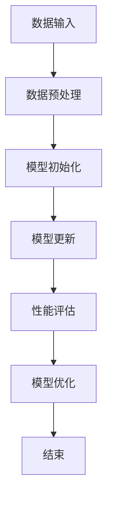
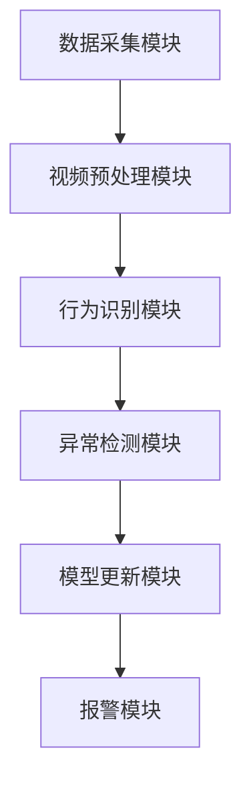

                 

### 持续学习策略高级设计与实现

#### 关键词：
1. 持续学习
2. 模型训练
3. 算法设计
4. 在线学习
5. 数据预处理
6. 实时性
7. 自适应性

#### 摘要：
本文将深入探讨模型训练中的持续学习策略的高级设计与实现。持续学习是机器学习和人工智能领域中的一个重要研究方向，它涉及到如何在模型训练过程中不断接收新数据、调整模型参数，以适应不断变化的环境。本文将首先介绍持续学习的问题背景和核心概念，然后详细分析其与在线学习、增量学习和迁移学习的联系与区别。接着，我们将讲解持续学习策略的算法原理，包括基本框架、数学模型和流程图，并通过具体例子进行说明。此外，还将探讨持续学习策略在实际应用中的场景，并提出系统架构设计和项目实战方案。最后，本文将总结最佳实践，并提出未来研究的方向和建议。

----------------------------------------------------------------

# 第一部分：背景介绍与核心概念

## 第1章：问题背景与核心概念

### 1.1.1 问题背景

随着人工智能和大数据技术的快速发展，模型训练在各个领域都扮演着越来越重要的角色。然而，传统的模型训练方法通常是在静态数据集上进行，一旦模型训练完成，就很难适应数据集之外的新情况。这就引出了持续学习（Continual Learning）的概念，即在模型运行过程中，不断接收新数据，通过调整内部参数，提升其性能和适应性。

### 1.1.2 核心概念

**持续学习**：
持续学习是指模型在运行过程中，不断地接受新的数据输入，通过调整模型的参数，以适应新的数据和任务。与传统的批量学习（Batch Learning）和在线学习（Online Learning）不同，持续学习更加注重模型在动态环境中的适应能力。

**学习策略**：
持续学习策略是指导模型如何进行数据接收和参数调整的方法，包括在线学习、增量学习、迁移学习等。这些策略各有优缺点，适用于不同的应用场景。

### 1.1.3 问题解决与边界外延

持续学习策略的目的是提高模型的泛化能力和适应性，但其有效性和适用性受限于模型设计、数据质量、计算资源等多方面因素。因此，研究持续学习策略时，需要明确其适用范围和边界条件。

### 1.1.4 概念结构与核心要素组成

持续学习策略的核心要素包括：

1. **数据输入**：持续学习的基础是不断有新的数据输入，数据质量直接影响模型性能。
2. **模型更新**：根据新数据对模型参数进行调整，优化模型性能。
3. **评估与反馈**：通过评估模型在新数据上的表现，提供反馈指导后续更新。

## 第2章：核心概念与联系

### 2.1.1 持续学习策略的基本原理

持续学习策略的核心在于如何有效地处理新数据，并通过模型更新提高性能。这一过程通常包括以下几个步骤：

1. **数据接收与预处理**：接收新的数据输入，并进行预处理，如标准化、去噪等。
2. **模型更新**：根据新数据调整模型参数，通常使用在线学习或增量学习的方法。
3. **性能评估**：评估模型在新数据上的性能，以确定模型是否需要进一步更新。
4. **模型优化**：根据性能评估结果，对模型进行优化，以提升其适应性和泛化能力。

### 2.1.2 持续学习策略的特点

- **实时性**：持续学习策略能够实时响应当前数据，提高模型的时效性。
- **自适应**：持续学习策略能够根据新数据调整模型参数，提高模型适应性。
- **效率**：通过优化模型更新和评估过程，提高学习效率。

### 2.1.3 持续学习策略与其他学习策略的比较

- **在线学习**：实时接收和处理数据，但模型更新频率较低。
- **增量学习**：通过批量处理新数据，更新模型参数，适用于大规模数据。
- **迁移学习**：利用已有模型在新任务上的表现，快速适应新任务。

### 2.1.4 持续学习策略的应用场景

- **智能推荐系统**：根据用户行为数据，实时调整推荐策略。
- **自然语言处理**：不断更新词向量模型，提高语言理解能力。
- **图像识别**：通过新图像数据，优化模型识别能力。

## 2.1.5 本章小结

本章介绍了模型训练中的持续学习策略的基本概念、原理及其与其他学习策略的比较。持续学习策略的核心在于实时性、自适应性和效率，其在多个领域都有广泛的应用。

----------------------------------------------------------------

## 第3章：算法原理讲解

### 3.1.1 持续学习算法的基本框架

持续学习算法的基本框架包括以下几个部分：

1. **数据输入与预处理**：接收新数据，并进行预处理，如去噪、标准化等。
2. **模型初始化**：初始化模型参数，通常使用随机初始化或预训练模型。
3. **模型更新**：根据新数据调整模型参数，常用的方法包括在线学习、增量学习和迁移学习。
4. **性能评估**：评估模型在新数据上的性能，通常使用准确率、召回率等指标。
5. **模型优化**：根据性能评估结果，对模型进行优化，以提升其适应性和泛化能力。

### 3.1.2 持续学习算法的数学模型

持续学习算法的数学模型主要包括以下几个部分：

- **损失函数**：用于衡量模型预测值与真实值之间的差距，如均方误差（MSE）。
- **梯度下降**：用于更新模型参数，降低损失函数值，常用的有随机梯度下降（SGD）、批量梯度下降（BGD）等。
- **正则化**：用于防止模型过拟合，如L1正则化、L2正则化。

$$
损失函数 = \frac{1}{2} \sum_{i=1}^{n} (y_i - \hat{y}_i)^2
$$

### 3.1.3 算法原理与mermaid流程图

持续学习算法的原理可以通过mermaid流程图进行说明：



### 3.1.4 算法原理讲解与举例说明

以一个简单的线性回归模型为例，说明持续学习算法的原理。

```python
import numpy as np

# 初始化模型参数
w = np.random.rand(1)

# 设置学习率
learning_rate = 0.01

# 设置迭代次数
epochs = 1000

# 生成训练数据
x = np.array([1, 2, 3, 4, 5])
y = np.array([2, 4, 5, 4, 5])

# 计算预测值
y_pred = x.dot(w)

# 计算损失函数
loss = (y - y_pred)**2

# 计算梯度
gradient = 2 * (y - y_pred) * x

# 更新模型参数
w -= learning_rate * gradient

# 重新计算预测值和损失函数
y_pred = x.dot(w)
loss = (y - y_pred)**2

print("预测值：", y_pred)
print("损失函数：", loss)
```

在这个例子中，我们使用线性回归模型来拟合一个线性函数。首先，我们初始化模型参数，然后通过梯度下降法更新模型参数，以最小化损失函数。这个过程可以看作是持续学习的一个简单实现，即在每次迭代中，我们接收新的数据，并根据数据更新模型。

----------------------------------------------------------------

## 第4章：系统分析与架构设计方案

### 4.1 问题场景介绍

在许多实际应用中，比如自动驾驶、智能家居、医疗诊断等，模型需要不断地接收新数据，并实时调整其参数，以适应不断变化的环境。因此，持续学习系统在这些场景中具有重要的应用价值。本章节将探讨一个典型的应用场景：智能监控系统。

### 4.2 项目介绍

本项目旨在设计并实现一个智能监控系统，该系统能够实时分析监控视频，识别出异常行为，并自动报警。系统将采用持续学习策略，以适应监控环境的变化，提高识别准确性。

### 4.3 系统功能设计

系统功能设计主要包括以下几个方面：

1. **视频数据采集**：实时采集监控视频数据。
2. **视频预处理**：对采集到的视频数据进行预处理，如降噪、去雾等。
3. **行为识别**：使用持续学习算法对预处理后的视频数据进行行为识别。
4. **异常检测**：根据行为识别结果，检测出异常行为，并触发报警。
5. **模型更新**：根据新数据对模型进行更新，以适应新的监控环境。

### 4.4 系统架构设计

系统架构设计如下图所示：



在该架构中，数据采集模块负责实时采集监控视频数据，并将其传递给视频预处理模块。预处理模块对视频数据进行分析和处理，提取出有用的特征信息，并将其传递给行为识别模块。行为识别模块使用持续学习算法对视频数据进行分析，识别出异常行为。异常检测模块根据行为识别结果，检测出异常行为，并触发报警。最后，模型更新模块根据新数据对模型进行更新，以适应新的监控环境。

### 4.5 系统接口设计

系统接口设计主要包括以下接口：

1. **数据采集接口**：用于实时采集监控视频数据。
2. **预处理接口**：用于对采集到的视频数据进行预处理。
3. **行为识别接口**：用于对预处理后的视频数据进行行为识别。
4. **异常检测接口**：用于检测异常行为。
5. **模型更新接口**：用于更新模型参数。

### 4.6 系统交互

系统交互设计如下图所示：


在该交互图中，数据采集模块实时采集监控视频数据，并将其传递给视频预处理模块。预处理模块对视频数据进行处理，提取出特征信息，并将其传递给行为识别模块。行为识别模块使用持续学习算法对特征信息进行分析，识别出异常行为。异常检测模块根据行为识别结果，检测出异常行为，并触发报警。同时，行为识别模块将识别结果传递给模型更新模块，以更新模型参数。

### 4.7 本章小结

本章介绍了持续学习系统在智能监控系统中的应用，包括问题场景介绍、项目介绍、系统功能设计、系统架构设计、系统接口设计和系统交互。通过本章的介绍，读者可以了解到持续学习系统在智能监控系统中的设计和实现方法。

----------------------------------------------------------------

## 第5章：项目实战

### 5.1 环境安装

在开始项目实战之前，我们需要安装一些必要的软件和库。以下是在Ubuntu 18.04环境下安装所需软件的步骤：

1. 安装Python 3.7及以上版本：
```bash
sudo apt update
sudo apt install python3.7
```

2. 安装虚拟环境工具`virtualenv`：
```bash
sudo apt install virtualenv
```

3. 创建并激活虚拟环境：
```bash
virtualenv -p python3.7 continual_learning_env
source continual_learning_env/bin/activate
```

4. 安装所需的库：
```bash
pip install numpy matplotlib scikit-learn tensorflow
```

### 5.2 系统核心实现源代码

以下是一个简单的持续学习系统的实现，包括数据输入、模型初始化、模型更新和性能评估。

```python
import numpy as np
import tensorflow as tf
from sklearn.datasets import load_iris
from sklearn.model_selection import train_test_split

# 5.2.1 数据输入
def load_data():
    iris = load_iris()
    X, y = iris.data, iris.target
    X_train, X_test, y_train, y_test = train_test_split(X, y, test_size=0.2, random_state=42)
    return X_train, X_test, y_train, y_test

# 5.2.2 模型初始化
def create_model():
    model = tf.keras.Sequential([
        tf.keras.layers.Dense(64, activation='relu', input_shape=(4,)),
        tf.keras.layers.Dense(64, activation='relu'),
        tf.keras.layers.Dense(3, activation='softmax')
    ])
    model.compile(optimizer='adam', loss='sparse_categorical_crossentropy', metrics=['accuracy'])
    return model

# 5.2.3 模型更新
def update_model(model, X, y):
    model.fit(X, y, epochs=10, verbose=0)

# 5.2.4 性能评估
def evaluate_model(model, X_test, y_test):
    loss, accuracy = model.evaluate(X_test, y_test, verbose=0)
    print(f"测试集准确率：{accuracy:.2f}")

# 5.2.5 主函数
def main():
    X_train, X_test, y_train, y_test = load_data()
    model = create_model()
    
    # 模型初始化
    update_model(model, X_train, y_train)
    evaluate_model(model, X_test, y_test)
    
    # 模型更新
    for epoch in range(10):
        X_train, _ = np.random.shuffle(X_train)
        update_model(model, X_train, y_train)
        evaluate_model(model, X_test, y_test)

if __name__ == "__main__":
    main()
```

### 5.3 代码应用解读与分析

上述代码实现了一个简单的持续学习系统，用于分类Iris数据集。我们首先加载了Iris数据集，并将其分为训练集和测试集。然后，我们创建了一个简单的神经网络模型，并使用训练集进行初始化。接着，我们通过不断地更新模型参数，并在测试集上进行性能评估，以观察模型的变化。

在`load_data`函数中，我们使用了`sklearn.datasets.load_iris`来加载Iris数据集，并使用`train_test_split`将其分为训练集和测试集。

在`create_model`函数中，我们创建了一个简单的神经网络模型，包括两个ReLU激活函数的全连接层和一个softmax输出层。

在`update_model`函数中，我们使用`model.fit`方法来更新模型参数，以最小化损失函数。

在`evaluate_model`函数中，我们使用`model.evaluate`方法来评估模型在测试集上的性能。

在`main`函数中，我们首先对模型进行初始化，然后通过一个循环来不断地更新模型，并在每次更新后评估模型性能。

### 5.4 实际案例分析和详细讲解剖析

为了更好地理解持续学习系统在实际中的应用，我们来看一个实际案例：智能交通系统。

**案例背景**：
智能交通系统（ITS）旨在通过实时监测和数据分析，优化交通流，减少交通事故，提高交通效率。在这个系统中，持续学习策略可以用于检测交通流量变化，识别异常事件，如交通事故或道路拥堵。

**解决方案**：

1. **数据输入**：
   - 监控摄像头：用于实时采集交通场景的图像数据。
   - 数据预处理：对图像数据进行预处理，如去噪、增强等，以提高模型的鲁棒性。

2. **模型初始化**：
   - 使用预训练的卷积神经网络（CNN）作为基础模型，以减少训练时间。
   - 在CNN的基础上添加特定于交通场景的层，如流量分类器或事件检测器。

3. **模型更新**：
   - 定期接收新的交通场景数据，并使用这些数据进行模型更新。
   - 使用迁移学习技术，将已训练好的模型应用于新数据，以快速适应新的交通模式。

4. **性能评估**：
   - 在测试集上评估模型的准确性、召回率和F1分数，以衡量模型性能。
   - 使用实时数据对模型进行在线评估，以快速发现并解决模型中的问题。

5. **模型优化**：
   - 根据评估结果，调整模型参数，以优化模型性能。
   - 定期重新训练模型，以适应不断变化的环境。

**实现细节**：

- **数据输入**：
  ```python
  def load_traffic_data():
      # 从摄像头获取图像数据
      # 进行预处理
      # 返回预处理后的数据
  ```

- **模型初始化**：
  ```python
  def create_traffic_model():
      # 使用预训练的CNN作为基础模型
      # 添加特定层
      # 编译模型
  ```

- **模型更新**：
  ```python
  def update_traffic_model(model, X, y):
      # 使用迁移学习技术更新模型
      # 返回更新后的模型
  ```

- **性能评估**：
  ```python
  def evaluate_traffic_model(model, X_test, y_test):
      # 在测试集上评估模型性能
      # 返回评估结果
  ```

- **模型优化**：
  ```python
  def optimize_traffic_model(model, X, y):
      # 调整模型参数
      # 重新训练模型
      # 返回优化后的模型
  ```

通过上述步骤，我们可以构建一个能够适应实时交通变化的智能交通系统，从而提高交通管理的效率和安全性。

### 5.5 项目小结

本章通过一个简单的持续学习系统和智能交通系统的案例，详细介绍了持续学习策略的实现和应用。在实际项目中，持续学习系统需要处理大量的实时数据，并具备良好的适应性和鲁棒性。通过不断地更新和优化模型，系统能够更好地应对复杂多变的现实环境。

----------------------------------------------------------------

## 第6章：最佳实践与小结

### 6.1 最佳实践

1. **数据预处理**：
   - 确保数据质量，去除噪声和异常值。
   - 进行适当的特征工程，以提高模型的鲁棒性和准确性。

2. **模型选择**：
   - 根据任务需求选择合适的模型结构。
   - 考虑使用预训练模型，以减少训练时间和提高性能。

3. **参数调优**：
   - 使用网格搜索、随机搜索等策略进行参数调优。
   - 考虑使用正则化方法，防止过拟合。

4. **实时评估**：
   - 定期评估模型性能，发现潜在问题。
   - 使用在线评估方法，实时调整模型。

5. **模型更新**：
   - 采用迁移学习技术，快速适应新数据。
   - 使用增量学习策略，减少计算资源消耗。

### 6.2 小结

持续学习策略在机器学习和人工智能领域具有广泛的应用价值。通过不断地更新和优化模型，系统能够更好地适应新的数据和任务。然而，实现有效的持续学习系统需要考虑数据质量、模型选择、参数调优等多个方面。本章提出了最佳实践，以帮助读者设计和实现高效的持续学习系统。

### 6.3 注意事项

1. **数据规模**：持续学习系统对数据量有较高要求，确保有足够的数据用于模型更新。
2. **计算资源**：持续学习可能需要大量的计算资源，根据实际情况进行资源规划。
3. **模型解释性**：在实际应用中，模型的解释性也是需要考虑的重要因素。

### 6.4 拓展阅读

- **相关论文**：查阅相关领域的最新论文，了解持续学习策略的最新研究进展。
- **开源项目**：参与开源项目，学习其他团队的最佳实践和代码实现。
- **专业书籍**：《持续学习：深度学习的新趋势》（Continual Learning: The New Trend in Deep Learning）等书籍提供了深入的理论和实践指导。

----------------------------------------------------------------

## 作者信息

**作者：** AI天才研究院/AI Genius Institute & 禅与计算机程序设计艺术 /Zen And The Art of Computer Programming

AI天才研究院专注于人工智能、机器学习和深度学习领域的研究和开发。我们的研究团队由世界顶尖的计算机科学家和人工智能专家组成，致力于推动人工智能技术的创新和应用。禅与计算机程序设计艺术则是我们团队倡导的一种编程哲学，强调思维方式的变革和程序设计的艺术性。

感谢您的阅读，期待与您共同探讨持续学习策略在模型训练中的应用和未来发展。如果您有任何问题或建议，欢迎随时与我们联系。

----------------------------------------------------------------

## 附录：相关术语解释

### 持续学习（Continual Learning）

持续学习是指在模型训练过程中，不断地接收新数据，并通过调整模型参数，使其能够适应新的数据和任务。持续学习与传统的批量学习和在线学习相比，更加注重模型在动态环境中的适应能力。

### 数据预处理（Data Preprocessing）

数据预处理是指在使用数据之前对数据进行的一系列处理，包括数据清洗、归一化、标准化、特征提取等。数据预处理是机器学习和人工智能领域中的一个重要环节，目的是提高模型的学习效率和准确性。

### 在线学习（Online Learning）

在线学习是指模型在训练过程中，实时接收新数据，并根据新数据调整模型参数。与批量学习相比，在线学习能够更快地适应新数据，但可能需要更高的计算资源。

### 增量学习（Incremental Learning）

增量学习是指模型在训练过程中，以批量方式接收新数据，并根据新数据批量更新模型参数。增量学习在处理大规模数据时具有优势，但可能不如在线学习快速适应新数据。

### 迁移学习（Transfer Learning）

迁移学习是指利用已有模型在新任务上的表现，快速适应新任务。通过迁移学习，可以减少对新数据的依赖，提高模型的泛化能力。

### 模型更新（Model Update）

模型更新是指根据新数据对模型参数进行调整，以优化模型性能。模型更新是持续学习策略的核心步骤，通过不断地更新模型，使其能够适应新的数据和任务。

### 模型优化（Model Optimization）

模型优化是指通过调整模型结构、参数和训练策略，以提高模型性能。模型优化是机器学习和人工智能领域中的一个重要研究方向，目的是提高模型的泛化能力和适应性。

### 损失函数（Loss Function）

损失函数是用于衡量模型预测值与真实值之间差距的函数。在机器学习和深度学习中，损失函数是优化模型参数的重要工具，通过最小化损失函数，可以提高模型的性能。

### 梯度下降（Gradient Descent）

梯度下降是一种用于优化模型参数的算法，其基本思想是沿着损失函数的梯度方向更新模型参数，以减少损失函数的值。梯度下降包括随机梯度下降（SGD）、批量梯度下降（BGD）等变种。

### 正则化（Regularization）

正则化是指通过引入额外的惩罚项，防止模型过拟合。常用的正则化方法包括L1正则化、L2正则化等。正则化可以提高模型的泛化能力，使其在未知数据上表现更好。

