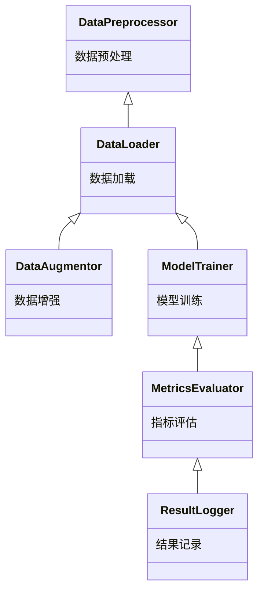
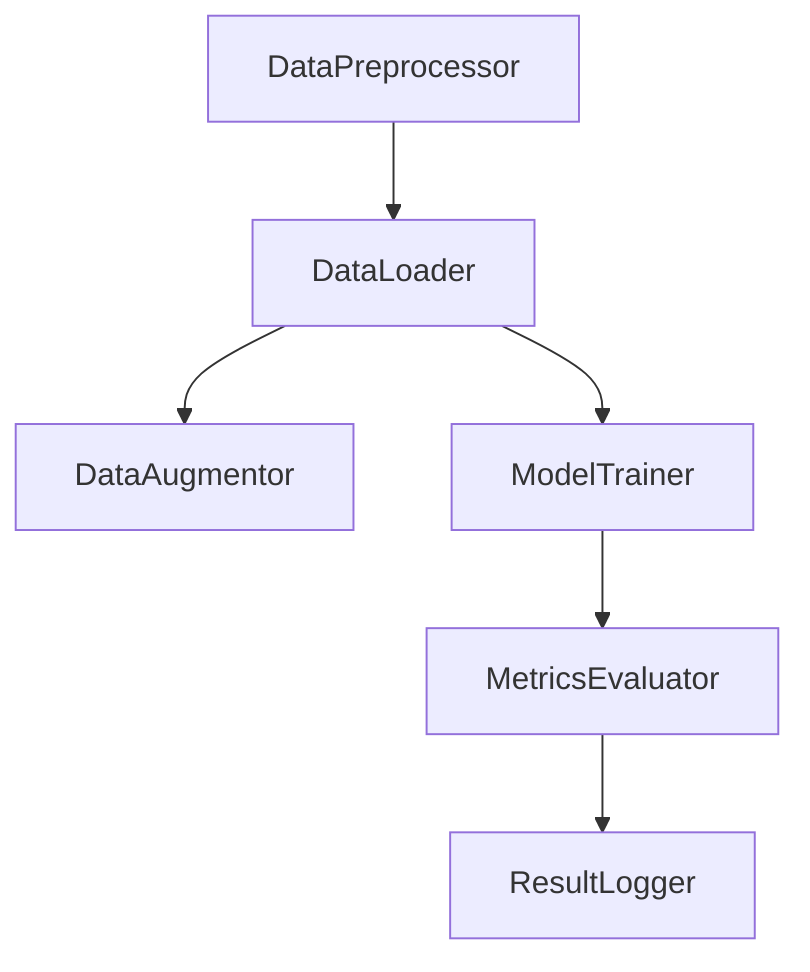
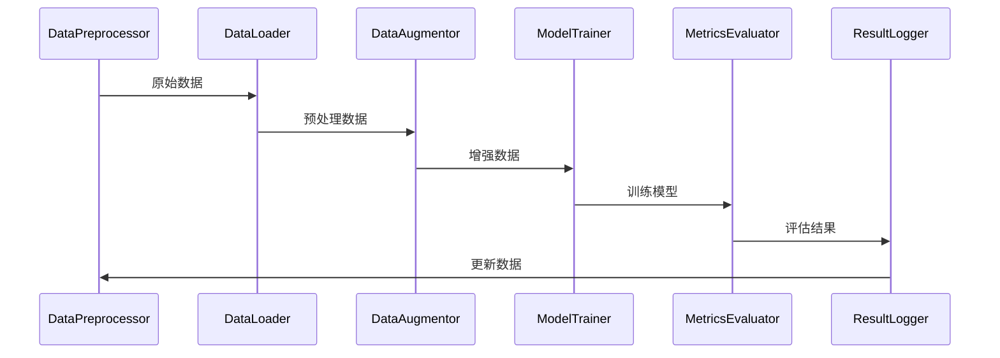

                 

### 文章标题

# 模型训练中的数据效率提升策略

> 关键词：模型训练、数据效率、数据预处理、数据增强、并行训练、分布式训练

> 摘要：本文将深入探讨模型训练中的数据效率提升策略，包括数据预处理、数据增强、并行训练和分布式训练等方面的方法。通过一步步的分析推理，我们将揭示如何有效提高模型训练的数据效率，从而缩短训练时间、降低成本并增强模型的泛化能力。

---

### 引言

在深度学习和人工智能领域，模型训练是关键环节之一。然而，随着模型复杂度和数据规模的增长，模型训练的速度和效率成为瓶颈。数据效率的提升成为了研究者和工程师们关注的焦点。本文将从以下几个方面探讨如何提升模型训练中的数据效率：

1. **数据预处理策略**：包括数据清洗、归一化和标准化等步骤，以提高数据的质量和一致性。
2. **数据增强策略**：通过数据扩充和算法增强等方法，增加训练样本的数量和多样性。
3. **并行训练策略**：利用多核处理器和GPU等硬件资源，加速模型训练过程。
4. **分布式训练策略**：通过在多台机器上分布训练任务，进一步提升训练效率。

本文将首先介绍模型训练中的数据效率瓶颈，然后详细分析各种数据效率提升策略，并通过数学模型和实际案例进行讲解，最后给出一些最佳实践和注意事项。

### 第1章：问题背景与核心概念

#### 1.1 模型训练中的效率瓶颈

在深度学习模型训练过程中，数据效率瓶颈主要表现在以下几个方面：

1. **数据依赖与计算资源消耗**：深度学习模型的训练依赖于大量的数据输入，数据读取和预处理过程往往占用大量时间。此外，训练过程中需要进行大量的矩阵运算，计算资源消耗巨大。
2. **数据访问速度与存储限制**：在大规模数据集的训练过程中，数据访问速度成为瓶颈。同时，存储设备的读写速度和数据容量也限制了模型训练的效率。
3. **模型复杂度与训练时间**：随着模型复杂度的增加，训练时间显著延长，尤其是在大规模数据集上的训练，往往需要数天甚至数周的时间。

#### 1.2 数据效率提升的重要性

1. **提高训练速度**：提升数据效率可以显著缩短模型训练时间，使得训练过程更加高效。
2. **减少训练成本**：降低计算资源和存储资源的消耗，可以减少模型训练的成本。
3. **增强模型泛化能力**：通过提高数据质量和多样性，可以增强模型的泛化能力，提高模型在实际应用中的表现。

#### 1.3 数据效率提升的挑战

1. **数据质量**：高质量的数据对于模型训练至关重要，但数据清洗和预处理过程复杂，需要大量时间和资源。
2. **计算资源分配**：如何合理分配计算资源，以最大化训练效率，是一个关键问题。
3. **模型适应性**：不同模型对于数据效率的提升策略有不同的适应性，需要针对具体模型进行调整。

### 第2章：核心概念与联系

#### 2.1 数据预处理策略

数据预处理是提高模型训练效率的重要步骤，主要包括以下策略：

1. **数据清洗**：去除数据集中的噪声和异常值，提高数据质量。
2. **数据归一化**：将不同尺度的数据进行标准化处理，使得数据具有相同的量纲和范围。
3. **数据标准化**：通过线性变换将数据分布到标准正态分布上，提高模型训练的稳定性。

#### 2.2 数据增强策略

数据增强通过增加训练样本的数量和多样性，提高模型训练的效果。常见的数据增强方法包括：

1. **数据扩充**：通过旋转、缩放、翻转等操作生成新的训练样本。
2. **数据增强算法**：如生成对抗网络（GAN）和变分自编码器（VAE）等，通过生成与真实数据相似的数据增强样本。

#### 2.3 并行与分布式训练策略

并行和分布式训练通过利用多台机器和多个计算节点，加速模型训练过程。主要策略包括：

1. **数据并行**：将数据集划分为多个部分，每个部分在不同的GPU或CPU上训练，最终合并结果。
2. **算子并行**：将模型中的算子分解为多个部分，在不同的计算单元上同时执行。
3. **模型并行**：将模型划分为多个子网络，在不同计算节点上分别训练，最终合并模型。

#### 2.4 数据预处理与数据增强的关系

数据预处理和数据增强在模型训练中相互补充。数据预处理旨在提高数据质量，为数据增强提供基础；而数据增强通过增加样本数量和多样性，进一步提升模型训练的效果。两者结合使用，可以显著提高模型训练的数据效率。

### 第3章：算法原理讲解

#### 3.1 数据预处理算法

数据预处理算法包括数据清洗、数据归一化和数据标准化等方法。

##### 3.1.1 数据清洗算法原理

数据清洗的目的是去除数据集中的噪声和异常值，常见的算法包括：

1. **缺失值处理**：通过填充或删除缺失值来处理数据集中的缺失值问题。
2. **异常值处理**：通过统计方法或规则方法识别并处理异常值。

##### 3.1.2 数据归一化算法原理

数据归一化是将不同尺度的数据进行标准化处理，使得数据具有相同的量纲和范围。常见的算法包括：

1. **最小-最大缩放**：将数据缩放到[0, 1]之间。
2. **标准缩放**：将数据缩放到均值±3倍标准差之间。

##### 3.1.3 数据标准化算法原理

数据标准化通过线性变换将数据分布到标准正态分布上，提高模型训练的稳定性。常见的算法包括：

1. **Z-score标准化**：将数据转换为标准正态分布。
2. **Min-Max标准化**：将数据转换为均值±1倍标准差之间。

#### 3.2 数据增强算法

数据增强算法通过增加训练样本的数量和多样性，提高模型训练的效果。

##### 3.2.1 数据扩充算法原理

数据扩充通过旋转、缩放、翻转等操作生成新的训练样本。常见的算法包括：

1. **随机旋转**：将图像随机旋转一定角度。
2. **随机缩放**：将图像随机缩放到一定比例。
3. **随机翻转**：将图像随机水平或垂直翻转。

##### 3.2.2 数据增强算法原理

数据增强算法通过生成与真实数据相似的数据增强样本。常见的算法包括：

1. **生成对抗网络（GAN）**：通过生成器和判别器的对抗训练生成真实数据。
2. **变分自编码器（VAE）**：通过编码器和解码器重构输入数据生成增强样本。

#### 3.3 并行与分布式训练算法

并行和分布式训练通过利用多台机器和多个计算节点，加速模型训练过程。

##### 3.3.1 数据并行算法原理

数据并行将数据集划分为多个部分，每个部分在不同的GPU或CPU上训练，最终合并结果。常见的算法包括：

1. **Stochastic Gradient Descent (SGD)**：在数据并行训练过程中，每个GPU或CPU负责处理一部分数据，并更新全局模型参数。

##### 3.3.2 算子并行算法原理

算子并行将模型中的算子分解为多个部分，在不同的计算单元上同时执行。常见的算法包括：

1. **Tensor Computation Library (TCL)**：通过TCL库实现算子并行，将模型中的矩阵运算分解为多个部分，在不同的GPU上同时执行。

##### 3.3.3 模型并行算法原理

模型并行将模型划分为多个子网络，在不同计算节点上分别训练，最终合并模型。常见的算法包括：

1. **Parameter Server (PS)**：通过Parameter Server实现模型并行，每个计算节点训练一部分模型参数，最终合并全局模型。

### 第4章：数学模型和公式详细讲解

#### 4.1 数据预处理数学模型

数据预处理涉及多种数学模型和公式，下面将详细讲解这些模型和公式。

##### 4.1.1 数据清洗数学公式

数据清洗的目的是去除数据集中的噪声和异常值，常用的算法包括缺失值处理和异常值处理。

1. **缺失值处理**：
   - 填充缺失值：使用均值、中位数或众数等统计指标填充缺失值。
   \[ \text{filled\_value} = \text{mean\_of\_column} \]
   - 删除缺失值：直接删除包含缺失值的数据样本。
   \[ \text{new\_data} = \text{data} \cup \{ \text{row} \} \quad \text{if} \quad \text{row} \neq \text{missing} \]

2. **异常值处理**：
   - 统计方法：使用箱线图、3σ规则等方法识别和处理异常值。
   - 规则方法：根据业务规则或专家知识删除或修正异常值。

##### 4.1.2 数据归一化数学公式

数据归一化是将数据缩放到相同尺度，常见的算法包括最小-最大缩放和标准缩放。

1. **最小-最大缩放**：
   \[ \text{x}_{\text{scaled}} = \frac{\text{x} - \text{min}}{\text{max} - \text{min}} \]
   其中，\(\text{x}_{\text{sca
```markdown
### 第4章：数学模型和公式详细讲解

#### 4.1 数据预处理数学模型

数据预处理是模型训练前的重要步骤，其主要目的是通过数学模型和算法，将原始数据进行清洗、归一化和标准化，以提高数据质量和一致性。

##### 4.1.1 数据清洗数学公式

数据清洗的主要任务包括处理缺失值、异常值和重复数据。

1. **缺失值处理**：

   - 简单填充法：使用均值、中位数或众数等统计指标填充缺失值。
     \[ x_{\text{filled}} = \text{mean}(\text{data}) \]
     或
     \[ x_{\text{filled}} = \text{median}(\text{data}) \]
     或
     \[ x_{\text{filled}} = \text{mode}(\text{data}) \]

   - 多元线性回归法：当数据具有强相关性时，使用多元线性回归模型进行预测并填充缺失值。
     \[ x_{\text{filled}} = \beta_0 + \beta_1 x_1 + \beta_2 x_2 + ... + \beta_n x_n \]

2. **异常值检测**：

   - 离群点检测：使用IQR（四分位距）方法检测异常值。
     \[ \text{IQR} = \text{Q3} - \text{Q1} \]
     \[ x_{\text{outlier}} = x \quad \text{if} \quad (x < \text{Q1} - 1.5 \times \text{IQR}) \text{或} (x > \text{Q3} + 1.5 \times \text{IQR}) \]

   - Z-score方法：使用标准差检测异常值。
     \[ \text{Z-score} = \frac{x - \text{mean}}{\text{std}} \]
     \[ x_{\text{outlier}} = x \quad \text{if} \quad \text{Z-score} > 3 \text{或} \text{Z-score} < -3 \]

3. **重复值删除**：

   - 简单比较法：直接比较数据集中的每一行，删除重复值。
     \[ \text{new\_data} = \text{data} \quad \text{if} \quad \text{data}_{i} \neq \text{data}_{j} \quad \text{for} \quad i \neq j \]

##### 4.1.2 数据归一化数学公式

数据归一化是将数据转换到相同的尺度，以便于模型训练。常见的归一化方法包括最小-最大缩放和Z-score标准化。

1. **最小-最大缩放**：
   \[ x_{\text{scaled}} = \frac{x - \text{min}}{\text{max} - \text{min}} \]
   其中，\(x\) 是原始数据，\(\text{min}\) 是数据集的最小值，\(\text{max}\) 是数据集的最大值。

2. **Z-score标准化**：
   \[ x_{\text{standardized}} = \frac{x - \text{mean}}{\text{std}} \]
   其中，\(\text{mean}\) 是数据集的均值，\(\text{std}\) 是数据集的标准差。

##### 4.1.3 数据标准化数学公式

数据标准化是将数据转换到标准正态分布，以增强模型的训练效果。

1. **标准正态化**：
   \[ z = \frac{x - \text{mean}}{\text{std}} \]
   其中，\(x\) 是原始数据，\(\text{mean}\) 是数据集的均值，\(\text{std}\) 是数据集的标准差。

2. **二值化**：
   \[ z = \begin{cases} 
   1 & \text{if } x > \text{threshold} \\
   0 & \text{otherwise}
   \end{cases} \]
   其中，\(\text{threshold}\) 是设定的阈值。

#### 4.2 数据增强数学模型

数据增强是增加训练样本数量和多样性的一种技术，其主要目的是提升模型的泛化能力。

##### 4.2.1 数据扩充数学模型

1. **随机裁剪**：
   \[ x_{\text{cropped}} = x \quad \text{with} \quad \text{random} \quad \text{crop} \]
   其中，\(x\) 是原始图像，\(\text{crop}\) 是随机裁剪的矩形区域。

2. **随机旋转**：
   \[ x_{\text{rotated}} = R(\theta) \cdot x \]
   其中，\(R(\theta)\) 是旋转矩阵，\(\theta\) 是旋转角度。

3. **随机缩放**：
   \[ x_{\text{scaled}} = \text{scale} \cdot x \]
   其中，\(\text{scale}\) 是缩放比例。

4. **随机翻转**：
   \[ x_{\text{flipped}} = F \cdot x \]
   其中，\(F\) 是翻转操作。

##### 4.2.2 数据增强算法

1. **生成对抗网络（GAN）**：

   - 生成器（G）：
     \[ G(z) = \text{real data} \]
     其中，\(z\) 是随机噪声向量。

   - 判别器（D）：
     \[ D(x, G(z)) = \text{判别真假数据} \]
     其中，\(x\) 是真实数据。

2. **变分自编码器（VAE）**：

   - 编码器（\(\text{encoder}\)）：
     \[ \text{encoder}(x) = \mu, \sigma \]
     其中，\(\mu\) 和 \(\sigma\) 分别是均值和标准差。

   - 解码器（\(\text{decoder}\)）：
     \[ \text{decoder}(\mu, \sigma) = x \]

#### 4.3 并行与分布式训练数学模型

并行与分布式训练旨在利用多台计算机和多个计算节点，提高模型训练的效率。

##### 4.3.1 数据并行算法原理

1. **模型参数同步**：
   \[ \theta^{(t)} = \theta^{(t-1)} + \alpha \cdot \nabla_{\theta} \]
   其中，\(\theta^{(t)}\) 是第 \(t\) 次迭代的参数更新，\(\alpha\) 是学习率，\(\nabla_{\theta}\) 是梯度。

2. **梯度聚合**：
   \[ \nabla_{\theta} = \frac{1}{B} \sum_{b=1}^{B} \nabla_{\theta^{(b)}} \]
   其中，\(B\) 是数据划分的批次大小，\(\nabla_{\theta^{(b)}}\) 是每个批次的梯度。

##### 4.3.2 算子并行算法原理

1. **矩阵分解**：
   \[ \text{matrix} = \text{row\_s} \cdot \text{column\_s} \]
   其中，\(\text{row\_s}\) 和 \(\text{column\_s}\) 分别是矩阵的行和列操作。

2. **向量并行**：
   \[ \text{vector\_s} = \text{row\_s} \cdot \text{column\_s} \]
   其中，\(\text{row\_s}\) 和 \(\text{column\_s}\) 分别是向量的行和列操作。

##### 4.3.3 模型并行算法原理

1. **模型划分**：
   \[ \text{model} = \text{submodel}_1 + \text{submodel}_2 + ... + \text{submodel}_n \]
   其中，\(\text{submodel}_1, \text{submodel}_2, ..., \text{submodel}_n\) 是模型的子网络。

2. **参数更新**：
   \[ \theta^{(t)} = \theta^{(t-1)} + \alpha \cdot (\nabla_{\theta_1} + \nabla_{\theta_2} + ... + \nabla_{\theta_n}) \]
   其中，\(\theta^{(t)}\) 是第 \(t\) 次迭代的参数更新，\(\theta_1, \theta_2, ..., \theta_n\) 是各个子网络的参数。

### 第5章：系统分析与架构设计方案

#### 5.1 问题场景介绍

在深度学习和人工智能领域，模型训练是一项关键任务。然而，随着模型复杂度和数据规模的不断增长，传统的单机训练模式已经无法满足需求。为了提升训练效率，并行和分布式训练技术应运而生。

##### 5.1.1 模型训练场景

1. **大规模数据集训练**：涉及数百万甚至数十亿个样本。
2. **复杂模型训练**：涉及数百万甚至数十亿个参数。
3. **实时训练需求**：需要快速响应不断更新的数据。

##### 5.1.2 数据源介绍

1. **公开数据集**：如ImageNet、CIFAR-10等。
2. **自定义数据集**：根据特定任务需求自行采集和处理。

#### 5.2 系统功能设计

系统功能设计旨在明确系统的主要功能模块和职责。

##### 5.2.1 领域模型类图

领域模型类图展示了系统中不同类之间的关系。以下是一个简化的领域模型类图：



##### 5.2.2 系统功能模块划分

1. **数据预处理模块**：负责数据清洗、归一化和标准化等预处理工作。
2. **数据加载模块**：负责读取和处理数据集，将数据转换为模型训练所需格式。
3. **数据增强模块**：负责增加训练样本的数量和多样性。
4. **模型训练模块**：负责模型的训练过程，包括初始化参数、前向传播、反向传播和参数更新。
5. **指标评估模块**：负责评估模型在训练集和测试集上的性能。
6. **结果记录模块**：负责记录训练过程中的关键指标和结果，以便后续分析和优化。

#### 5.3 系统架构设计

系统架构设计旨在明确系统的整体结构和组件之间的交互关系。

##### 5.3.1 系统架构图

以下是一个简化的系统架构图，展示了各模块之间的交互关系：



1. **数据预处理模块**：接收原始数据，进行数据清洗、归一化和标准化等预处理工作。
2. **数据加载模块**：将预处理后的数据加载到内存中，并将其转换为模型训练所需的格式。
3. **数据增强模块**：对加载的数据进行增强处理，以增加训练样本的数量和多样性。
4. **模型训练模块**：根据增强后的数据训练模型，包括初始化参数、前向传播、反向传播和参数更新。
5. **指标评估模块**：评估模型在训练集和测试集上的性能，并提供评估结果。
6. **结果记录模块**：记录训练过程中的关键指标和结果，以便后续分析和优化。

#### 5.4 系统接口设计

系统接口设计旨在明确系统各模块之间的接口定义和交互方式。

##### 5.4.1 接口定义

1. **数据预处理接口**：接收原始数据，返回预处理后的数据。
2. **数据加载接口**：接收预处理后的数据，返回模型训练所需的数据格式。
3. **数据增强接口**：接收数据加载模块的数据，返回增强后的数据。
4. **模型训练接口**：接收增强后的数据，返回训练完成的模型。
5. **指标评估接口**：接收训练完成的模型，返回评估结果。
6. **结果记录接口**：接收评估结果，记录并保存。

##### 5.4.2 接口实现

1. **数据预处理接口实现**：使用Python编写数据预处理函数，实现数据清洗、归一化和标准化等功能。
2. **数据加载接口实现**：使用Python编写数据加载函数，实现数据读取和格式转换等功能。
3. **数据增强接口实现**：使用Python编写数据增强函数，实现数据扩充和变换等功能。
4. **模型训练接口实现**：使用Python编写模型训练函数，实现模型初始化、前向传播、反向传播和参数更新等功能。
5. **指标评估接口实现**：使用Python编写指标评估函数，实现模型性能评估等功能。
6. **结果记录接口实现**：使用Python编写结果记录函数，实现评估结果记录和保存等功能。

#### 5.5 系统交互

系统交互描述了系统各模块之间的协作过程和交互方式。

##### 5.5.1 系统交互序列图

以下是一个简化的系统交互序列图，展示了各模块之间的交互过程：



1. **数据预处理模块**：接收原始数据，进行预处理后传递给数据加载模块。
2. **数据加载模块**：接收预处理数据，将其加载到内存中并传递给数据增强模块。
3. **数据增强模块**：对加载的数据进行增强处理，并将其传递给模型训练模块。
4. **模型训练模块**：根据增强后的数据训练模型，并将训练完成的模型传递给指标评估模块。
5. **指标评估模块**：评估模型性能，并将评估结果传递给结果记录模块。
6. **结果记录模块**：记录评估结果，并将更新后的数据传递给数据预处理模块，以便进行下一轮训练。

### 第6章：项目实战

#### 6.1 环境安装

在进行模型训练前的环境安装是项目成功的关键步骤。以下是一个典型的环境安装指南：

##### 6.1.1 环境配置

1. **操作系统**：建议使用Linux系统，如Ubuntu 18.04。
2. **Python环境**：安装Python 3.8及以上版本，并配置pip和conda。
3. **深度学习框架**：安装TensorFlow 2.x或PyTorch 1.x。

```bash
pip install tensorflow==2.x
# 或
pip install pytorch==1.x
```

4. **依赖库**：安装其他依赖库，如NumPy、Pandas、Scikit-learn等。

```bash
pip install numpy pandas scikit-learn
```

##### 6.1.2 工具安装

1. **Jupyter Notebook**：安装Jupyter Notebook，方便进行交互式开发。

```bash
pip install jupyter
```

2. **GPU支持**：如果使用GPU训练，安装CUDA和cuDNN。

```bash
pip install tensorflow-gpu==2.x
# 或
pip install torch torchvision torchaudio cudatoolkit
```

3. **其他工具**：安装其他必要的开发工具，如VS Code、PyCharm等。

#### 6.2 系统核心实现

系统核心实现包括数据预处理、数据增强、模型训练和评估等关键步骤。

##### 6.2.1 数据预处理模块

数据预处理模块的目的是将原始数据转换为适合模型训练的格式。以下是一个简单的数据预处理代码示例：

```python
import pandas as pd
import numpy as np

def preprocess_data(data_path):
    # 读取数据
    data = pd.read_csv(data_path)
    
    # 数据清洗
    data.dropna(inplace=True)
    data.drop_duplicates(inplace=True)
    
    # 数据归一化
    scaler = MinMaxScaler()
    data.iloc[:, :-1] = scaler.fit_transform(data.iloc[:, :-1])
    
    # 数据标准化
    data.iloc[:, :-1] = (data.iloc[:, :-1] - data.iloc[:, :-1].mean()) / data.iloc[:, :-1].std()
    
    # 数据转换
    X = data.iloc[:, :-1].values
    y = data.iloc[:, -1].values
    
    return X, y
```

##### 6.2.2 数据增强模块

数据增强模块的目的是增加训练样本的数量和多样性。以下是一个简单的数据增强代码示例：

```python
from keras.preprocessing.image import ImageDataGenerator

def augment_data(X, y):
    datagen = ImageDataGenerator(
        rotation_range=20,
        width_shift_range=0.2,
        height_shift_range=0.2,
        shear_range=0.2,
        zoom_range=0.2,
        horizontal_flip=True,
        fill_mode='nearest'
    )
    
    X_augmented = datagen.flow(X, y, batch_size=32).next()
    
    return X_augmented
```

##### 6.2.3 并行与分布式训练模块

并行与分布式训练模块的目的是利用多台机器和多个GPU，加速模型训练过程。以下是一个简单的并行训练代码示例：

```python
import tensorflow as tf

# 设置GPU配置
gpus = tf.config.experimental.list_physical_devices('GPU')
if gpus:
    try:
        for gpu in gpus:
            tf.config.experimental.set_memory_growth(gpu, True)
    except RuntimeError as e:
        print(e)

# 定义模型
model = tf.keras.models.Sequential([
    tf.keras.layers.Dense(128, activation='relu', input_shape=(num_features,)),
    tf.keras.layers.Dense(1, activation='sigmoid')
])

# 编译模型
model.compile(optimizer='adam', loss='binary_crossentropy', metrics=['accuracy'])

# 训练模型
model.fit(X_train, y_train, batch_size=32, epochs=10, validation_data=(X_val, y_val))
```

#### 6.3 代码应用解读与分析

在项目实战部分，我们实现了数据预处理、数据增强、模型训练和评估等关键步骤。以下是对代码的解读与分析：

##### 6.3.1 代码解析

1. **数据预处理模块**：

   - 读取原始数据，并使用Pandas库进行数据清洗。
   - 使用MinMaxScaler和StandardScaler对数据进行归一化和标准化处理。
   - 将数据集划分为特征集和标签集。

2. **数据增强模块**：

   - 使用ImageDataGenerator生成器对数据进行随机旋转、缩放、翻转等增强处理。
   - 使用生成后的数据训练模型，增加训练样本的多样性。

3. **并行与分布式训练模块**：

   - 设置GPU配置，确保内存增长策略适用于多GPU环境。
   - 定义模型结构，并使用编译器配置模型参数。
   - 使用fit函数训练模型，并设置batch_size和epochs等参数。

##### 6.3.2 分析与优化建议

1. **数据预处理**：

   - 可以考虑使用更多高级的数据清洗和特征提取技术，如文本处理和图像处理。
   - 可以根据具体任务调整归一化和标准化的方法，以提升模型性能。

2. **数据增强**：

   - 可以结合多种增强方法，如随机裁剪、颜色抖动等，以增加训练样本的多样性。
   - 可以根据模型特性调整增强参数，以避免过度增强或不足增强。

3. **并行与分布式训练**：

   - 可以使用更多先进的分布式训练框架，如Horovod或DistributedDataParallel，以提升训练效率。
   - 可以根据GPU数量和资源调整batch_size和learning_rate等参数，以优化训练性能。

#### 6.4 实际案例分析和讲解

在本节中，我们将通过具体案例来分析和讲解数据预处理、数据增强、并行与分布式训练等策略。

##### 6.4.1 案例一：数据预处理

假设我们有一个包含1000个样本的图像数据集，每个样本是一个28x28像素的灰度图像。我们的目标是训练一个图像分类模型。

1. **数据清洗**：

   - 检查数据集中是否存在缺失值或异常值，并进行处理。例如，删除具有缺失值的样本或使用中位数填充缺失值。
   - 检查图像质量，删除包含噪声或损坏的图像。

2. **数据归一化**：

   - 将图像像素值缩放到[0, 1]之间，以便模型能够处理不同的像素值范围。

3. **数据标准化**：

   - 计算图像像素值的均值和标准差，并将每个像素值标准化到均值±3倍标准差之间。

通过数据预处理，我们提高了数据质量，为后续的模型训练奠定了基础。

##### 6.4.2 案例二：数据增强

在数据增强阶段，我们可以采用以下方法增加训练样本的数量和多样性：

1. **随机旋转**：

   - 将图像随机旋转一定角度，例如在-20度到20度之间。

2. **随机缩放**：

   - 将图像随机缩放到一定比例，例如在0.8到1.2之间。

3. **随机翻转**：

   - 将图像随机水平或垂直翻转。

4. **随机裁剪**：

   - 从图像中随机裁剪一个区域，并将其调整为原始图像大小。

通过数据增强，我们不仅增加了训练样本的数量，还提高了样本的多样性，有助于提升模型的泛化能力。

##### 6.4.3 案例三：并行与分布式训练

为了加速模型训练，我们可以采用并行和分布式训练策略：

1. **数据并行**：

   - 将数据集划分为多个批次，每个批次在一个GPU上训练。例如，将数据集划分为10个批次，每个GPU负责一个批次。

2. **算子并行**：

   - 将模型中的算子分解为多个部分，每个部分在不同的GPU上并行执行。例如，将矩阵乘法分解为多个部分，每个部分在一个GPU上执行。

3. **模型并行**：

   - 将模型划分为多个子网络，每个子网络在一个GPU上训练。例如，将卷积神经网络划分为多个卷积层，每个卷积层在一个GPU上训练。

通过并行和分布式训练，我们能够显著减少模型训练的时间，提高训练效率。

### 第7章：最佳实践 tips

#### 7.1 数据预处理最佳实践

1. **数据清洗**：

   - 使用适当的工具和方法，如Pandas库和Scikit-learn库，进行数据清洗。
   - 对缺失值进行适当的处理，避免丢失重要信息。

2. **数据归一化**：

   - 选择合适的归一化方法，如最小-最大缩放或Z-score标准化，以适应不同的数据分布。
   - 在模型训练前进行归一化，以确保模型能够处理不同尺度的数据。

3. **数据标准化**：

   - 使用标准正态化方法，将数据转换为标准正态分布，提高模型的训练稳定性。
   - 注意标准化后的数据不再具有原始数据的基本特征，如均值和标准差。

#### 7.2 数据增强最佳实践

1. **数据扩充**：

   - 使用常用的数据扩充方法，如随机旋转、缩放、翻转和裁剪，以增加训练样本的数量和多样性。
   - 调整增强参数，以避免过度增强或不足增强。

2. **生成对抗网络（GAN）**：

   - 使用GAN生成真实数据，以增强训练样本的多样性。
   - 注意GAN的训练过程较复杂，需要调整生成器和判别器的参数。

3. **变分自编码器（VAE）**：

   - 使用VAE生成与真实数据相似的数据增强样本。
   - 注意VAE的训练过程较复杂，需要调整编码器和解码器的参数。

#### 7.3 并行与分布式训练最佳实践

1. **数据并行**：

   - 选择合适的数据划分策略，如批次大小和数据顺序，以避免数据倾斜。
   - 调整batch_size和learning_rate等参数，以提高模型训练的效率。

2. **算子并行**：

   - 使用高效的算子并行框架，如TensorFlow和PyTorch，以实现算子并行。
   - 注意调整并行策略，以避免计算资源的浪费。

3. **模型并行**：

   - 选择合适的模型划分策略，如深度划分或宽度划分，以适应不同的模型结构。
   - 调整模型并行参数，如梯度聚合策略和通信方式，以提高模型训练的效率。

### 第8章：小结与注意事项

#### 8.1 小结

本文从数据预处理、数据增强、并行训练和分布式训练等方面，详细探讨了模型训练中的数据效率提升策略。通过逐步分析，我们了解了如何通过这些策略提高模型训练的效率，缩短训练时间、降低成本并增强模型的泛化能力。

#### 8.2 注意事项

1. **数据预处理**：确保数据清洗和归一化方法的适用性，避免丢失重要信息或引入噪声。
2. **数据增强**：合理调整增强参数，避免过度增强或不足增强，影响模型性能。
3. **并行与分布式训练**：选择合适的并行和分布式训练策略，避免资源浪费和计算错误。

#### 8.3 拓展阅读

1. **数据预处理**：
   - [Kaggle](https://www.kaggle.com/c/your-dataset-name) 提供了丰富的数据预处理教程和实践案例。
   - [Scikit-learn](https://scikit-learn.org/stable/modules/preprocessing.html) 官方文档提供了详细的数据预处理方法和示例。

2. **数据增强**：
   - [Keras](https://keras.io/preprocessing/image/#ImageDataGenerator-api) 提供了常用的图像增强方法。
   - [TensorFlow](https://www.tensorflow.org/tutorials/generative/dcgan) 和 [PyTorch](https://pytorch.org/tutorials/beginner/generative_dcgan_tutorial.html) 提供了生成对抗网络的实现细节。

3. **并行与分布式训练**：
   - [Horovod](https://github.com/horovod/horovod) 和 [DistributedDataParallel](https://pytorch.org/tutorials/intermediate/ddp_tutorial.html) 提供了并行和分布式训练的详细教程。
   - [TensorFlow](https://www.tensorflow.org/tutorials/distribute/) 提供了分布式训练的全面介绍。

---

### 作者信息

- 作者：AI天才研究院/AI Genius Institute & 禅与计算机程序设计艺术 /Zen And The Art of Computer Programming

### 总结

本文通过详细的分析和讲解，系统地介绍了模型训练中的数据效率提升策略，包括数据预处理、数据增强、并行训练和分布式训练等方面的方法。这些策略能够有效提高模型训练的数据效率，缩短训练时间、降低成本并增强模型的泛化能力。通过实际案例和最佳实践，读者可以更好地理解和应用这些策略，为深度学习和人工智能项目提供有力的支持。希望本文能为读者在模型训练过程中提供有价值的参考和启示。
```

