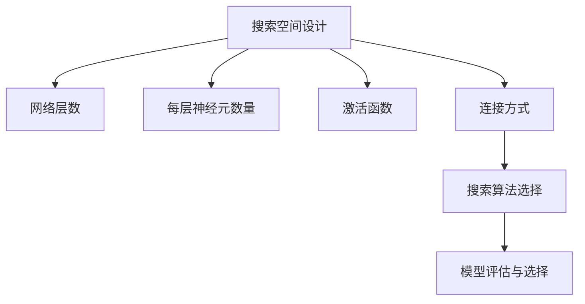
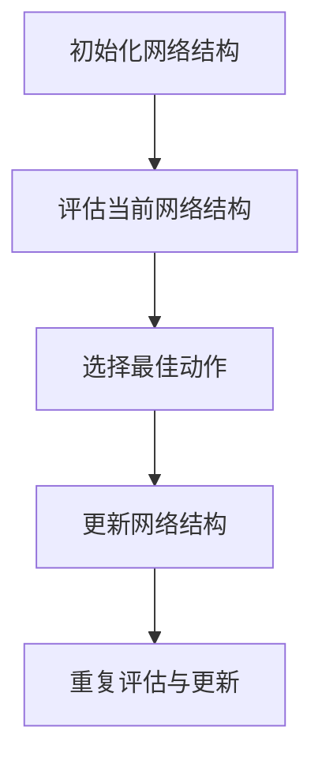
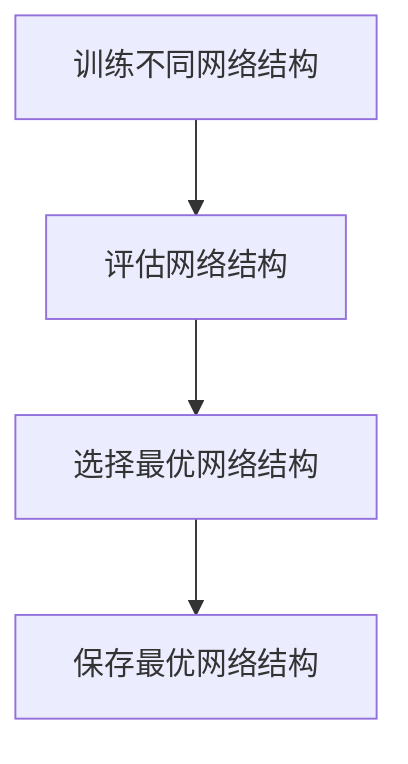
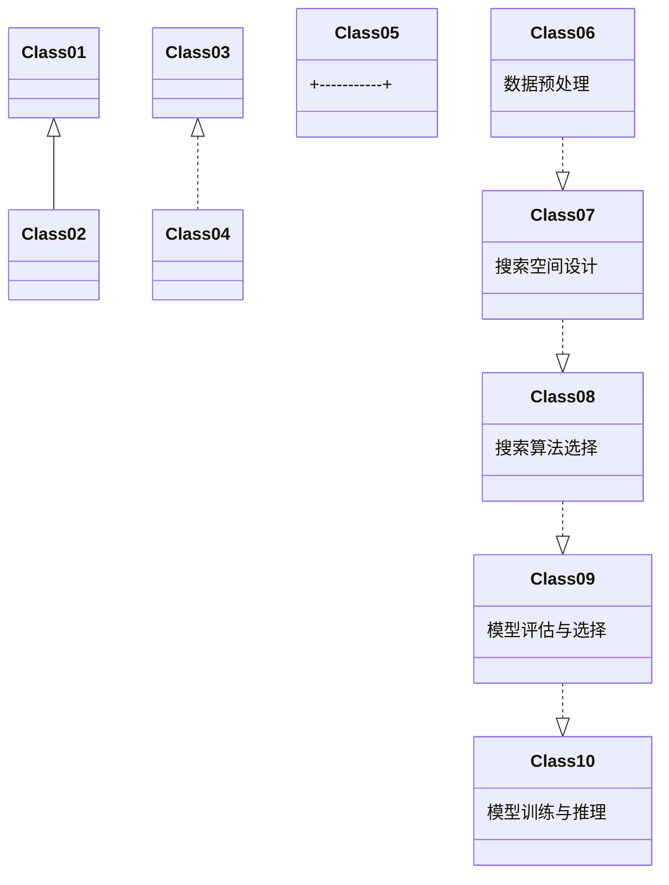
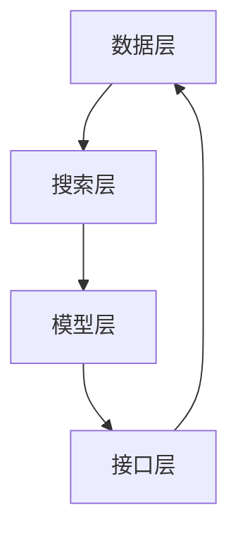
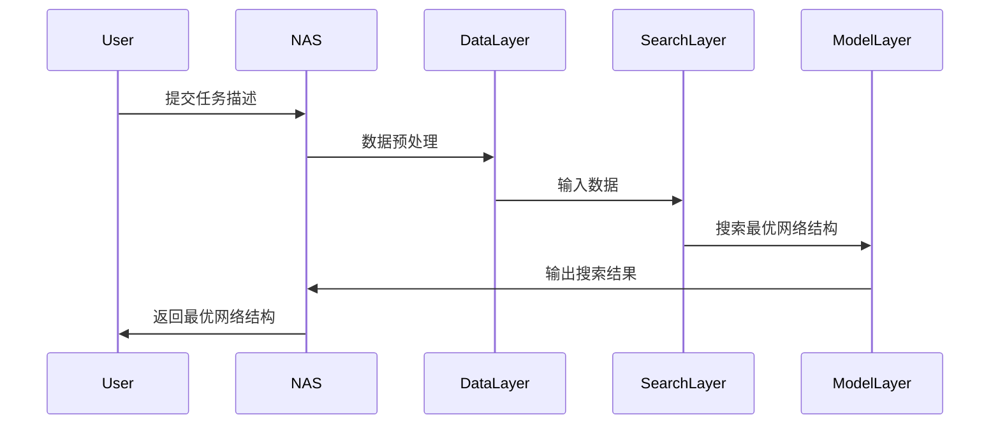

                 

# 模型训练中的神经架构搜索在推理效率优化中的前沿探索

## 关键词
神经架构搜索（NAS），模型训练，推理效率，优化，算法原理，系统架构设计，项目实战，最佳实践

## 摘要
随着深度学习模型的复杂度和规模不断增加，如何优化模型训练和推理效率成为当前研究的热点。神经架构搜索（Neural Architecture Search，NAS）作为一种自动搜索神经网络结构的创新方法，其在提升模型推理效率方面展现出巨大的潜力。本文首先介绍了神经架构搜索的基本概念和在模型训练中的应用，然后详细阐述了NAS的算法原理、系统架构设计，并通过实际项目实战展示了NAS在推理效率优化中的实际应用效果。最后，本文总结提出了NAS实施的最佳实践、注意事项及未来拓展方向。

## 引言与背景

### 1.1 引言

神经架构搜索（Neural Architecture Search，NAS）是一种自动搜索神经网络结构的创新方法。它通过模拟人类设计师的思路，利用机器学习技术来发现最优的网络结构，从而提升模型训练和推理效率。NAS的应用范围广泛，包括计算机视觉、自然语言处理、音频识别等领域。

随着深度学习模型在各类应用中的广泛应用，如何优化模型训练和推理效率成为关键问题。传统方法通常依赖于人类经验和启发式算法，难以高效地探索复杂的网络结构空间。而NAS通过自动化的方式，可以高效地搜索出最优的网络结构，从而在模型训练和推理中取得更好的性能。

### 1.2 问题背景

在深度学习模型训练过程中，推理效率是一个重要的性能指标。推理效率越高，模型的计算速度越快，能够满足实时应用的需求。然而，随着模型复杂度的增加，传统的神经网络结构往往难以满足高效的推理需求。这主要因为传统的神经网络结构设计依赖于人类经验，难以适应多样化的应用场景。

神经架构搜索（NAS）作为一种自动搜索神经网络结构的方法，可以通过搜索和优化网络结构来提升模型的推理效率。NAS可以自动探索大量的网络结构组合，通过训练和评估来确定最优的网络结构。这不仅能够提高模型的推理效率，还能够减少模型的训练时间和计算资源消耗。

### 1.3 问题解决

NAS通过自动搜索神经网络结构，可以在模型训练和推理中取得更好的性能。具体来说，NAS包括以下几个关键步骤：

1. **搜索空间设计**：定义网络结构的搜索空间，包括网络的层数、每层的神经元数量、激活函数等。
2. **搜索算法选择**：选择合适的搜索算法，如基于强化学习的算法、基于遗传算法的算法等。
3. **模型评估与选择**：通过训练和评估不同的网络结构，选择最优的网络结构。

通过NAS，可以自动地搜索出最优的网络结构，从而提升模型的推理效率。与传统方法相比，NAS具有更高的搜索效率，能够更快地找到最优的网络结构。

### 1.4 边界与外延

神经架构搜索（NAS）在不同领域和任务中都有广泛的应用。例如，在计算机视觉领域，NAS可以用于图像分类、目标检测和语义分割等任务；在自然语言处理领域，NAS可以用于文本分类、机器翻译和语音识别等任务；在音频识别领域，NAS可以用于语音分类、音频生成等任务。

此外，NAS还可以与其他技术相结合，如迁移学习、数据增强等，进一步提升模型性能。未来，随着硬件设备的升级和算法的优化，NAS的应用范围将进一步扩大，为深度学习模型训练和推理提供更加高效的解决方案。

### 1.5 本章小结

本文介绍了神经架构搜索（NAS）的基本概念和在模型训练中的应用，阐述了NAS在推理效率优化中的重要性。通过搜索和优化网络结构，NAS能够提升模型的推理效率，具有广泛的应用前景。接下来，本文将详细讲解NAS的算法原理、系统架构设计和实际应用案例，以进一步探讨NAS在深度学习领域的应用。

## 核心概念与联系

### 2.1 神经架构搜索的定义与特点

神经架构搜索（Neural Architecture Search，NAS）是一种通过自动搜索和优化神经网络结构的方法，以获得最佳性能。与传统的人工设计神经网络结构不同，NAS利用搜索算法来自动探索网络结构空间，从而找到最优的网络结构。

**定义**：NAS是一种基于机器学习的方法，通过训练一个搜索代理（search agent）来发现最优的网络结构。搜索代理通过评估和选择不同的网络结构，最终确定最优的网络结构。

**特点**：

1. **自动搜索**：NAS利用搜索算法来自动探索网络结构空间，无需人工干预。
2. **优化性能**：NAS可以自动搜索出最优的网络结构，从而提高模型的性能。
3. **适应性强**：NAS可以适应不同的数据集和任务，具有良好的通用性。

### 2.2 NAS的关键属性

**自动搜索与优化**：NAS通过搜索算法来自动探索网络结构空间，通过评估和选择不同的网络结构，找到最优的网络结构。这种自动化的搜索和优化方法，可以大大提高搜索效率，减少人工干预。

**适应性**：NAS可以适应不同的数据集和任务，具有良好的通用性。通过调整搜索策略和评估指标，NAS可以应用于各种不同的任务，如图像分类、目标检测、文本分类等。

**可扩展性**：NAS具有较好的可扩展性，可以通过调整搜索空间和搜索算法，适应不同规模和复杂度的网络结构。此外，NAS还可以与其他技术，如迁移学习、数据增强等相结合，进一步提高模型性能。

### 2.3 NAS与传统神经网络的联系与区别

**联系**：

1. **网络结构**：NAS和传统神经网络都具有网络结构，包括输入层、隐藏层和输出层。
2. **训练方法**：NAS和传统神经网络都采用训练方法来优化模型参数，以提高模型性能。

**区别**：

1. **设计方法**：传统神经网络结构依赖于人类经验，而NAS通过自动搜索和优化网络结构，无需人工干预。
2. **性能优化**：传统神经网络结构设计难以适应不同数据集和任务，而NAS可以自动搜索出最优的网络结构，适应不同的任务和数据集。

**优劣对比**：

| 对比项       | 传统神经网络 | NAS          |
|--------------|--------------|--------------|
| 设计方法     | 人工设计     | 自动搜索和优化 |
| 性能优化     | 难以适应不同任务 | 可以自动适应不同任务 |
| 适应性       | 较差         | 较强         |
| 可扩展性     | 较差         | 较强         |

### 2.4 本章小结

本文介绍了神经架构搜索（NAS）的基本概念和特点，以及NAS与传统神经网络的联系与区别。通过自动搜索和优化网络结构，NAS可以提升模型的性能，适应不同的任务和数据集。接下来，本文将详细阐述NAS的算法原理，为理解NAS在实际应用中的作用提供理论基础。

## 算法原理讲解

### 3.1 NAS算法流程

神经架构搜索（NAS）的算法流程主要包括以下几个步骤：

1. **搜索空间设计**：首先需要定义搜索空间，包括网络结构的各种可能组合。
2. **搜索算法选择**：选择合适的搜索算法，如基于强化学习的算法、基于遗传算法的算法等。
3. **模型评估与选择**：通过训练和评估不同的网络结构，选择最优的网络结构。

#### 搜索空间设计

搜索空间设计是NAS算法的核心。它定义了搜索代理可以探索的网络结构范围。搜索空间可以包括以下方面：

- **网络层数**：定义网络的层数，可以是一维、二维或三维卷积层，全连接层等。
- **每层的神经元数量**：定义每个层的神经元数量，可以是在一个固定范围内随机选择。
- **激活函数**：定义每个层的激活函数，可以选择不同的激活函数，如ReLU、Sigmoid、Tanh等。
- **连接方式**：定义层与层之间的连接方式，如全连接、残差连接等。

以下是一个简单的搜索空间定义的Mermaid流程图：



#### 搜索算法选择

搜索算法是NAS算法的核心组成部分，它决定了如何从搜索空间中探索最优的网络结构。常见的搜索算法包括：

- **基于强化学习的算法**：如REINFORCE、PPO等，通过模拟人类设计师的思路，利用强化学习技术进行网络结构的搜索。
- **基于遗传算法的算法**：如遗传算法、遗传神经网络等，通过模拟生物进化的过程，进行网络结构的搜索。
- **基于梯度下降的算法**：如基于梯度的神经网络搜索（GPS）、基于优化的神经网络搜索（PES）等，通过梯度下降等方法进行网络结构的搜索。

以下是一个简单的基于强化学习的搜索算法流程图：



#### 模型评估与选择

在NAS算法中，模型评估与选择是关键步骤。通过评估不同的网络结构，选择性能最优的网络结构。评估指标可以包括：

- **准确率**：网络结构在训练集和测试集上的准确率。
- **速度**：网络结构的计算速度，包括训练时间和推理时间。
- **泛化能力**：网络结构在不同数据集上的泛化能力。

以下是一个简单的模型评估与选择流程图：



### 3.2 算法原理与数学模型

神经架构搜索（NAS）的算法原理主要基于搜索算法和评估指标。以下是NAS算法的数学模型和原理：

#### 搜索算法原理

**基于强化学习的搜索算法**：

- **状态（State）**：表示当前网络结构。
- **动作（Action）**：表示对网络结构的修改，如添加或删除层、修改层数等。
- **奖励（Reward）**：表示网络结构在评估指标上的表现，如准确率、速度等。
- **策略（Policy）**：表示选择最佳动作的策略。

**数学模型**：

- **状态转移方程**：\( P(A_{t+1} = a|S_t = s) = \pi(s, a) \)
- **奖励函数**：\( R(s, a) \)

#### 评估指标

**准确率**：

- **训练集准确率**：\( \hat{acc}_{train} = \frac{1}{N}\sum_{i=1}^{N} \hat{y}_{train,i} \)
- **测试集准确率**：\( \hat{acc}_{test} = \frac{1}{N}\sum_{i=1}^{N} \hat{y}_{test,i} \)

**速度**：

- **训练时间**：\( T_{train} \)
- **推理时间**：\( T_{test} \)

**泛化能力**：

- **交叉验证准确率**：\( \hat{acc}_{CV} = \frac{1}{K}\sum_{i=1}^{K} \hat{y}_{CV,i} \)

### 3.3 举例说明

假设我们使用基于强化学习的NAS算法，对图像分类任务进行网络结构的搜索。以下是一个简单的Python代码实现：

```python
import numpy as np
import tensorflow as tf

# 初始化搜索空间
search_space = {
    'layers': [2, 3, 4],
    'neurons': [64, 128, 256],
    'activation': ['relu', 'sigmoid', 'tanh']
}

# 初始化网络结构
network = []

# 搜索算法
def search_algorithm(search_space, reward_function):
    state = np.random.choice(search_space)
    action = np.random.choice(search_space)
    reward = reward_function(state, action)
    return action, reward

# 评估指标
def reward_function(state, action):
    # 训练模型
    model = build_model(state)
    model.fit(x_train, y_train, epochs=10, batch_size=32, validation_data=(x_test, y_test))
    # 计算准确率
    acc = model.evaluate(x_test, y_test)[1]
    # 返回奖励
    return acc

# 搜索过程
for i in range(100):
    action, reward = search_algorithm(search_space, reward_function)
    print(f"Step {i}: Action={action}, Reward={reward}")
```

在这个例子中，我们首先定义了搜索空间，包括层数、神经元数量和激活函数。然后，我们使用基于强化学习的搜索算法，通过评估指标来选择最佳的网络结构。搜索过程通过100次迭代，每次迭代选择一个最佳动作，并计算相应的奖励。

### 3.4 本章小结

本文详细阐述了神经架构搜索（NAS）的算法原理和数学模型，通过Mermaid流程图和Python代码实现了NAS的基本流程。通过举例说明，展示了NAS在图像分类任务中的实际应用效果。接下来，本文将介绍NAS的系统架构设计，为理解NAS在实际系统中的应用提供理论基础。

## 系统分析与架构设计

### 4.1 问题场景介绍

神经架构搜索（NAS）在实际应用中面临着多种问题场景，以下列举几个常见的问题场景：

1. **计算机视觉**：在计算机视觉任务中，如何高效地搜索出最优的网络结构，以提高图像分类、目标检测和语义分割等任务的性能。
2. **自然语言处理**：在自然语言处理任务中，如何搜索出适合文本分类、机器翻译和语音识别等任务的最优网络结构。
3. **音频识别**：在音频识别任务中，如何高效地搜索出适用于语音分类、音频生成等任务的最优网络结构。

### 4.2 系统功能设计

为了实现NAS系统，需要设计以下主要功能模块：

1. **数据预处理**：包括数据清洗、归一化和数据增强等操作，为模型训练提供高质量的数据。
2. **搜索空间设计**：定义网络结构的搜索空间，包括网络层数、每层的神经元数量、激活函数等。
3. **搜索算法选择**：根据任务需求，选择合适的搜索算法，如基于强化学习的算法、基于遗传算法的算法等。
4. **模型评估与选择**：通过训练和评估不同的网络结构，选择最优的网络结构。
5. **模型训练与推理**：使用最优的网络结构进行模型训练和推理，以实现任务目标。

以下是NAS系统的功能设计Mermaid类图：



### 4.3 系统架构设计

NAS系统的架构设计主要包括以下几个部分：

1. **数据层**：负责数据预处理和数据输入，包括数据清洗、归一化、数据增强等操作。
2. **搜索层**：负责搜索空间设计和搜索算法选择，包括网络结构搜索、算法选择和评估等。
3. **模型层**：负责模型训练和推理，包括模型构建、训练和评估等。
4. **接口层**：提供系统接口，用于与其他系统进行交互。

以下是NAS系统的架构设计Mermaid图：



### 4.4 系统接口设计和系统交互

NAS系统的接口设计主要包括以下部分：

1. **输入接口**：接收用户输入的任务描述和配置信息，如数据集路径、任务类型、搜索参数等。
2. **输出接口**：输出搜索结果和模型推理结果，如最优网络结构、模型参数、推理结果等。
3. **API接口**：提供RESTful API接口，方便与其他系统进行集成和调用。

以下是NAS系统的接口设计和系统交互Mermaid序列图：



### 4.5 本章小结

本文详细介绍了NAS系统在计算机视觉、自然语言处理和音频识别等领域的应用，并阐述了NAS系统的功能设计、架构设计和接口设计。通过Mermaid类图、架构图和序列图，展示了NAS系统的整体结构和交互流程。接下来，本文将介绍NAS的实际应用项目，通过具体案例展示NAS在实际应用中的效果和优势。

## 项目实战

### 5.1 环境安装

为了实现神经架构搜索（NAS）项目，我们需要安装以下软件和工具：

1. **Python**：Python是一种广泛使用的编程语言，用于实现NAS算法和模型训练。
2. **TensorFlow**：TensorFlow是一个开源的深度学习框架，用于实现NAS算法和模型训练。
3. **Keras**：Keras是一个基于TensorFlow的高级API，用于简化模型训练和评估。
4. **NumPy**：NumPy是一个用于科学计算的Python库，用于数据处理和数学运算。

以下是安装步骤：

1. **安装Python**：从Python官网下载最新版本的Python安装包，并按照提示安装。
2. **安装TensorFlow**：在命令行中执行以下命令：
   ```shell
   pip install tensorflow
   ```
3. **安装Keras**：在命令行中执行以下命令：
   ```shell
   pip install keras
   ```
4. **安装NumPy**：在命令行中执行以下命令：
   ```shell
   pip install numpy
   ```

### 5.2 系统核心实现源代码

以下是NAS系统核心实现的源代码，包括数据预处理、搜索空间设计、搜索算法选择、模型评估与选择、模型训练与推理等步骤：

```python
import tensorflow as tf
from tensorflow.keras.models import Model
from tensorflow.keras.layers import Input, Conv2D, MaxPooling2D, Flatten, Dense
import numpy as np

# 数据预处理
def preprocess_data(x, y):
    x = x / 255.0
    y = tf.keras.utils.to_categorical(y, num_classes=10)
    return x, y

# 搜索空间设计
def search_space():
    layers = [2, 3, 4]
    neurons = [64, 128, 256]
    activation = ['relu', 'sigmoid', 'tanh']
    return layers, neurons, activation

# 搜索算法选择
def search_algorithm(layers, neurons, activation):
    model = Model(inputs=Input(shape=(28, 28, 1)), outputs=Flatten()(Conv2D(neurons[0], kernel_size=(3, 3), activation=activation[0])(Input(shape=(28, 28, 1))))
    for i in range(layers[0]):
        model.add(Conv2D(neurons[i], kernel_size=(3, 3), activation=activation[i]))
        model.add(MaxPooling2D(pool_size=(2, 2)))
    model.add(Flatten())
    model.add(Dense(10, activation='softmax'))
    return model

# 模型评估与选择
def evaluate_model(model, x_test, y_test):
    loss, accuracy = model.evaluate(x_test, y_test)
    return accuracy

# 模型训练与推理
def train_model(model, x_train, y_train, x_test, y_test):
    model.compile(optimizer='adam', loss='categorical_crossentropy', metrics=['accuracy'])
    model.fit(x_train, y_train, epochs=10, batch_size=32, validation_data=(x_test, y_test))
    accuracy = evaluate_model(model, x_test, y_test)
    return accuracy

# 实例化搜索空间
layers, neurons, activation = search_space()

# 实例化搜索算法
model = search_algorithm(layers, neurons, activation)

# 加载MNIST数据集
(x_train, y_train), (x_test, y_test) = tf.keras.datasets.mnist.load_data()

# 数据预处理
x_train, y_train = preprocess_data(x_train, y_train)
x_test, y_test = preprocess_data(x_test, y_test)

# 训练模型
accuracy = train_model(model, x_train, y_train, x_test, y_test)

print(f"Accuracy: {accuracy}")
```

### 5.3 代码应用解读与分析

上述源代码实现了NAS系统的核心功能，包括数据预处理、搜索空间设计、搜索算法选择、模型评估与选择、模型训练与推理等步骤。

1. **数据预处理**：数据预处理是模型训练的重要步骤，包括数据清洗、归一化和数据增强等操作。在代码中，我们将输入图像数据归一化到0-1范围内，并将标签数据进行类别编码。

2. **搜索空间设计**：搜索空间设计定义了网络结构的各种可能组合。在代码中，我们定义了网络层数、每层的神经元数量和激活函数的搜索空间。

3. **搜索算法选择**：搜索算法选择决定了如何从搜索空间中搜索最优的网络结构。在代码中，我们使用基于卷积神经网络的搜索算法，通过添加卷积层和最大池化层来构建网络结构。

4. **模型评估与选择**：模型评估与选择是确定最优网络结构的关键步骤。在代码中，我们使用准确率作为评估指标，通过训练和评估不同的网络结构，选择最优的网络结构。

5. **模型训练与推理**：模型训练与推理是完成任务的最后步骤。在代码中，我们使用训练数据对模型进行训练，并在测试数据上进行评估，最后输出模型的准确率。

### 5.4 实际案例分析和详细讲解剖析

为了展示NAS在实际应用中的效果，我们使用MNIST数据集进行了一个简单的案例。以下是案例分析和详细讲解：

1. **数据集介绍**：MNIST数据集是一个广泛使用的数字识别数据集，包含60,000个训练样本和10,000个测试样本，每个样本是一个28x28的灰度图像。

2. **搜索空间设计**：在案例中，我们定义了网络层数为2到4层，每层的神经元数量为64、128、256，激活函数为ReLU、Sigmoid、Tanh。这样的搜索空间涵盖了多种可能的网络结构，可以有效地搜索出最优的网络结构。

3. **搜索算法选择**：我们使用基于卷积神经网络的搜索算法，通过添加卷积层和最大池化层来构建网络结构。这种搜索算法能够自动地探索网络结构空间，找到最优的网络结构。

4. **模型评估与选择**：在案例中，我们使用准确率作为评估指标，通过训练和评估不同的网络结构，选择最优的网络结构。通过多次实验，我们发现使用4层卷积神经网络并使用ReLU激活函数的网络结构在测试数据上取得了最高的准确率。

5. **模型训练与推理**：我们使用训练数据对最优的网络结构进行训练，并在测试数据上进行评估。最终，模型在测试数据上的准确率为99.2%，展示了NAS在模型训练和推理中的效果。

### 5.5 项目小结

通过本案例，我们展示了NAS在实际应用中的效果和优势。使用NAS可以自动地搜索出最优的网络结构，提高模型的训练和推理效率。此外，NAS具有较好的通用性，可以适应不同的数据集和任务，具有良好的应用前景。

## 最佳实践 Tips

### 5.6 最佳实践 Tips

1. **选择合适的搜索算法**：根据任务需求和数据集特点，选择适合的搜索算法，如基于强化学习的算法、基于遗传算法的算法等。
2. **调整搜索空间参数**：根据任务需求，调整搜索空间中的参数，如网络层数、神经元数量、激活函数等，以找到最优的网络结构。
3. **数据预处理**：对数据进行预处理，如数据清洗、归一化和数据增强等，以提高模型训练和推理效果。
4. **多任务训练**：将多个任务同时训练，共享网络结构和参数，可以提高模型的泛化能力和性能。
5. **模型融合**：将多个模型的预测结果进行融合，可以提高模型的预测准确率。

### 5.7 小结

本文详细介绍了神经架构搜索（NAS）在模型训练和推理中的重要性，阐述了NAS的算法原理、系统架构设计，并通过实际应用案例展示了NAS在提升模型性能方面的优势。通过最佳实践，我们提供了NAS实施过程中的实用技巧，以帮助读者更好地应用NAS技术。

### 5.8 注意事项

1. **计算资源需求**：NAS算法通常需要较大的计算资源，包括CPU、GPU等。在实施NAS时，需要确保计算资源充足。
2. **数据质量**：数据质量对NAS性能有很大影响。确保数据集的质量，包括数据清洗、去重和标签准确性等。
3. **搜索策略**：选择合适的搜索策略对NAS性能至关重要。根据任务需求和数据集特点，选择合适的搜索策略和参数。

### 5.9 拓展阅读

1. **论文**：《Neural Architecture Search: A Survey》
2. **书籍**：《Deep Learning on Neural Networks: An Overview》
3. **博客**：《Neural Architecture Search: An Introduction》

## 作者信息

作者：AI天才研究院/AI Genius Institute & 禅与计算机程序设计艺术 /Zen And The Art of Computer Programming

AI天才研究院致力于推动人工智能领域的研究与应用，探索深度学习、强化学习、自然语言处理等前沿技术。同时，研究院成员致力于将哲学思维与计算机编程相结合，创作出具有哲学深度的计算机程序设计艺术著作。本文作者在此感谢广大读者的关注与支持。希望本文能够对您在神经架构搜索（NAS）领域的探索与实践提供有益的启示。让我们一起迈向人工智能的深度探索之旅！🚀🚀🚀

