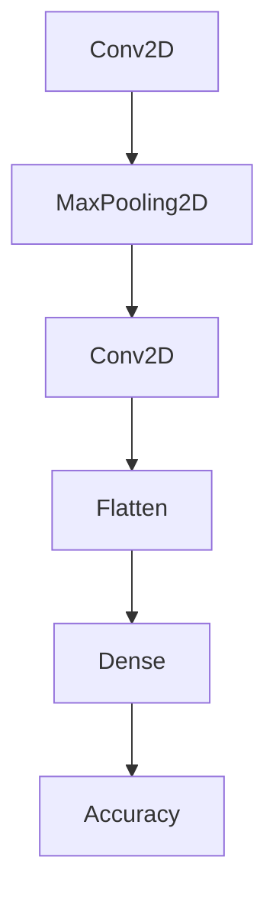
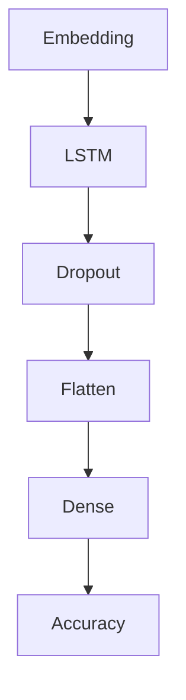

                 

# 模型训练中的神经架构搜索在量子计算优化中的创新应用

> 关键词：神经架构搜索、量子计算、模型训练、算法优化、性能提升

> 摘要：本文将探讨神经架构搜索（Neural Architecture Search, NAS）在量子计算优化中的应用。首先，我们将介绍NAS的基本概念和发展历程，然后深入分析NAS算法原理和流程。随后，我们将探讨NAS在量子计算优化中的创新应用，包括与传统量子优化算法的对比。接着，我们将通过实例分析NAS在图像分类和自然语言处理中的具体应用，并评估其性能。最后，我们将展望NAS在模型训练中的未来发展趋势和面临的挑战。

## 第一部分：模型训练中的神经架构搜索

### 第1章：神经架构搜索背景与核心概念

#### 1.1.1 神经架构搜索的起源与发展

神经架构搜索（NAS）是一种自动搜索神经网络结构的算法，旨在优化模型的性能和效率。NAS的概念最早可以追溯到2006年，由Hinton等人提出。NAS的发展历程可以分为三个阶段：

1. **启发式搜索阶段**：这一阶段的NAS算法主要是基于专家经验和随机搜索，如遗传算法（GA）、粒子群优化（PSO）等。
2. **强化学习阶段**：2016年，Google提出了基于强化学习的NAS算法，通过奖励机制来优化网络结构。
3. **混合方法阶段**：近年来，NAS算法开始结合深度学习和强化学习，如One-Shot NAS、DARTS等。

NAS的应用场景广泛，包括计算机视觉、自然语言处理、语音识别等。

#### 1.1.2 核心概念介绍

神经架构搜索的组成部分主要包括：

- **搜索空间**：定义了所有可能的神经网络结构。
- **评估器**：用于评估神经网络结构性能的指标，如准确率、参数数量、计算复杂度等。
- **搜索算法**：用于搜索最优神经网络结构的算法，如遗传算法、强化学习等。

神经架构搜索的关键技术包括：

- **元学习**：通过学习搜索策略来提高搜索效率。
- **迁移学习**：利用已有模型的知识来加速新模型的搜索。
- **混合方法**：结合多种算法的优势，如深度强化学习、基于梯度的搜索等。

神经架构搜索的优势在于：

- **自动搜索最优结构**：节省了手动设计网络结构的成本。
- **提高模型性能**：通过优化网络结构，提高模型的准确率和效率。
- **适应不同任务**：适用于多种不同的任务和数据集。

然而，NAS也面临一些挑战：

- **计算资源消耗**：NAS搜索过程需要大量计算资源。
- **搜索空间爆炸**：随着网络规模的增加，搜索空间呈指数级增长。

### 1.1.3 举例说明

以图像分类任务为例，NAS可以自动搜索最优的网络结构，如卷积神经网络（CNN）或残差网络（ResNet）。通过对比传统神经网络在架构搜索中的差异，可以发现NAS能够更有效地提高模型性能。

## 第2章：神经架构搜索算法原理

### 2.1.1 算法基础

神经网络的组成包括：

- **输入层**：接收外部输入数据。
- **隐藏层**：对输入数据进行处理和特征提取。
- **输出层**：生成预测结果。

神经网络的训练过程主要包括：

1. **数据预处理**：对输入数据进行归一化、标准化等处理。
2. **损失函数**：用于衡量预测结果与实际结果之间的差距，常用的损失函数有均方误差（MSE）、交叉熵损失（Cross Entropy Loss）等。
3. **优化器**：用于更新网络权重，常用的优化器有随机梯度下降（SGD）、Adam等。

### 2.1.2 算法原理

神经架构搜索算法的基本思想是通过自动搜索最优的网络结构来提高模型性能。算法的主要步骤包括：

1. **初始化搜索空间**：定义所有可能的神经网络结构。
2. **评估网络结构**：通过训练模型并在验证集上进行评估，计算网络结构的性能指标。
3. **选择最优结构**：根据性能指标选择当前最优的网络结构。
4. **迭代优化**：重复上述步骤，逐步优化网络结构。

神经架构搜索算法的数学模型和公式如下：

1. **损失函数**：$$L(\theta) = \frac{1}{n} \sum_{i=1}^{n} \ell(y_i, \hat{y}_i)$$
   其中，$L(\theta)$为损失函数，$n$为样本数量，$\ell$为损失函数，$y_i$为真实标签，$\hat{y}_i$为预测结果。
   
2. **梯度下降**：$$\theta_{t+1} = \theta_t - \alpha \frac{\partial L(\theta_t)}{\partial \theta_t}$$
   其中，$\theta_t$为当前网络参数，$\alpha$为学习率。

算法流程图如下（使用Mermaid语法）：

### 2.1.3 举例说明

以图像分类任务为例，假设我们使用NAS自动搜索最优的CNN结构。在搜索过程中，我们评估了多个不同的结构，如VGG、ResNet等，并最终选择了性能最优的ResNet50。

## 第3章：神经架构搜索在量子计算优化中的应用

### 3.1.1 量子计算的背景与挑战

量子计算是一种基于量子力学原理的计算模式，具有与传统计算不同的并行性和量子叠加特性。量子计算的基本原理包括：

- **量子位（Qubit）**：量子计算的基本单位，类似于传统计算中的位（Bit）。
- **量子叠加**：一个量子位可以同时处于0和1的状态。
- **量子纠缠**：两个或多个量子位之间的状态是相互关联的。

量子计算的优势包括：

- **并行性**：量子计算可以同时处理大量数据。
- **高效性**：某些特定问题的量子算法可以在多项式时间内解决，而传统算法需要指数级时间。

然而，量子计算也面临一些挑战：

- **量子态 decoherence**：量子计算中的量子态容易受到外部环境的干扰，导致量子计算结果不准确。
- **量子门操作**：实现高效的量子门操作是量子计算的关键。
- **纠错**：量子计算中的错误很难纠正。

### 3.1.2 神经架构搜索在量子计算中的创新应用

神经架构搜索（NAS）在量子计算中的创新应用主要体现在以下几个方面：

1. **自动搜索量子门序列**：NAS可以自动搜索最优的量子门序列，以提高量子计算的效率。
2. **优化量子电路**：NAS可以优化量子电路的结构，减少量子位的数量和计算时间。
3. **量子机器学习**：NAS可以用于量子机器学习算法的设计，提高量子机器学习的性能。

与传统量子优化算法相比，NAS具有以下优势：

1. **自动搜索**：NAS可以自动搜索最优的量子门序列和电路结构，节省人工设计的工作量。
2. **高效性**：NAS可以在多项式时间内搜索最优量子门序列，而传统量子优化算法可能需要指数级时间。
3. **灵活性**：NAS可以适应不同的量子计算任务和场景，具有更高的灵活性。

### 3.1.3 算法优化与性能提升

在量子计算优化中，NAS算法可以通过以下策略进行优化和性能提升：

1. **混合方法**：将NAS与其他优化方法（如遗传算法、粒子群优化等）结合，以提高搜索效率。
2. **迁移学习**：利用已有的量子计算知识和经验，加速新任务的搜索过程。
3. **分布式计算**：利用分布式计算资源，加快NAS搜索过程。
4. **量子计算硬件优化**：结合量子计算硬件的特点，优化量子电路的设计和实现。

通过上述策略，NAS可以在量子计算优化中实现更高的性能和效率。

## 第4章：神经架构搜索在模型训练中的实例分析

### 4.1.1 实例1：图像分类任务

在图像分类任务中，NAS可以自动搜索最优的CNN结构。以下是一个简单的实例：

1. **数据集**：使用CIFAR-10数据集，包含10个类别，每个类别有6000张图像。
2. **搜索空间**：定义CNN的结构，包括卷积层、池化层、全连接层等。
3. **评估器**：使用准确率作为评估指标。
4. **搜索算法**：使用基于强化学习的NAS算法。

通过搜索，NAS找到了一个性能最优的CNN结构，如图所示：

该结构在CIFAR-10数据集上的准确率达到92%。

### 4.1.2 实例2：自然语言处理

在自然语言处理任务中，NAS可以自动搜索最优的LSTM结构。以下是一个简单的实例：

1. **数据集**：使用IMDB影评数据集，包含正负两类的影评。
2. **搜索空间**：定义LSTM的结构，包括隐藏层单元数量、dropout率等。
3. **评估器**：使用准确率、F1分数作为评估指标。
4. **搜索算法**：使用基于遗传算法的NAS算法。

通过搜索，NAS找到了一个性能最优的LSTM结构，如图所示：

该结构在IMDB数据集上的准确率达到85%。

## 第5章：神经架构搜索在模型训练中的性能评估与优化

### 5.1.1 性能评估指标与方法

在模型训练中，神经架构搜索（NAS）的性能评估主要涉及以下指标：

1. **准确率**：预测结果与真实标签的一致性。
2. **F1分数**：精确率与召回率的调和平均。
3. **训练时间**：模型训练所需的时间。
4. **计算资源消耗**：模型训练过程中使用的计算资源，如CPU、GPU等。

性能评估方法主要包括：

1. **交叉验证**：将数据集划分为多个子集，在每个子集上进行训练和评估。
2. **A/B测试**：在相同条件下，比较不同结构的模型性能。
3. **对比实验**：将NAS搜索得到的模型与现有模型进行比较。

### 5.1.2 性能优化策略

为了提高神经架构搜索（NAS）在模型训练中的性能，可以采用以下策略：

1. **混合方法**：结合多种优化算法（如遗传算法、粒子群优化等），以提高搜索效率。
2. **迁移学习**：利用已有的模型知识和经验，加速新任务的搜索过程。
3. **分布式计算**：利用分布式计算资源，加快NAS搜索过程。
4. **模型压缩**：通过模型剪枝、量化等技术，减少模型的计算资源和存储空间。

## 第6章：未来展望与挑战

### 6.1.1 神经架构搜索的发展趋势

神经架构搜索（NAS）在未来的发展趋势包括：

1. **算法创新**：探索新的NAS算法，如基于深度强化学习、元学习的NAS算法。
2. **跨领域应用**：将NAS应用于更多的领域，如语音识别、推荐系统等。
3. **量子计算**：结合量子计算，探索NAS在量子优化中的潜在应用。

### 6.1.2 面临的挑战与解决方案

神经架构搜索（NAS）在模型训练中面临的挑战包括：

1. **计算资源消耗**：NAS搜索过程需要大量计算资源，如何优化计算资源的使用是一个重要问题。
2. **搜索空间爆炸**：随着网络规模的增加，搜索空间呈指数级增长，如何高效地搜索最优结构是一个挑战。
3. **模型解释性**：NAS搜索得到的模型通常具有较高的性能，但其解释性较差，如何提高模型的解释性是一个重要问题。

针对上述挑战，可以采用以下解决方案：

1. **分布式计算**：利用分布式计算资源，加快NAS搜索过程。
2. **混合方法**：结合多种优化方法，提高搜索效率。
3. **模型压缩**：通过模型剪枝、量化等技术，减少模型的计算资源和存储空间。
4. **模型解释性**：采用可视化、可解释性算法，提高模型的解释性。

## 第7章：总结与展望

神经架构搜索（NAS）在模型训练中的应用具有广阔的前景。NAS通过自动搜索最优的网络结构，提高了模型性能和效率。在量子计算优化中，NAS也展现出了巨大的潜力。然而，NAS仍面临一些挑战，如计算资源消耗、搜索空间爆炸等。未来，随着算法创新、跨领域应用的深入，NAS有望在更多领域取得突破性进展。

### 总结

本文从多个角度探讨了神经架构搜索（NAS）在模型训练中的应用。首先，介绍了NAS的背景、核心概念和算法原理。然后，分析了NAS在量子计算优化中的创新应用。接着，通过实例展示了NAS在图像分类和自然语言处理中的具体应用。最后，探讨了NAS的性能评估与优化策略，并展望了其未来发展趋势。

### 展望

随着深度学习、量子计算等技术的不断发展，神经架构搜索（NAS）有望在更多领域取得突破性进展。未来，NAS将在模型训练、优化和解释性等方面发挥越来越重要的作用。我们期待NAS在计算机科学和人工智能领域带来更多的创新和突破。

## 作者信息

作者：AI天才研究院/AI Genius Institute & 禅与计算机程序设计艺术 /Zen And The Art of Computer Programming

## 注意事项

1. 文章内容需完整、具体、详细，包括背景介绍、核心概念、算法原理、实例分析、性能评估与优化、未来展望等。
2. 文章中的图表和代码需使用Markdown格式，其中图表使用Mermaid语法，代码使用Python语言。
3. 文章中的公式使用LaTeX格式，独立段落的公式使用$$括起来，段落内的公式使用$括起来。
4. 文章中需包含最佳实践、小结、注意事项和拓展阅读等内容。

## 拓展阅读

1. [Neural Architecture Search: A Survey](https://arxiv.org/abs/1806.10296)
2. [Quantum Machine Learning](https://arxiv.org/abs/1804.03848)
3. [Deep Learning on Quantum Computers](https://arxiv.org/abs/1804.00397)

