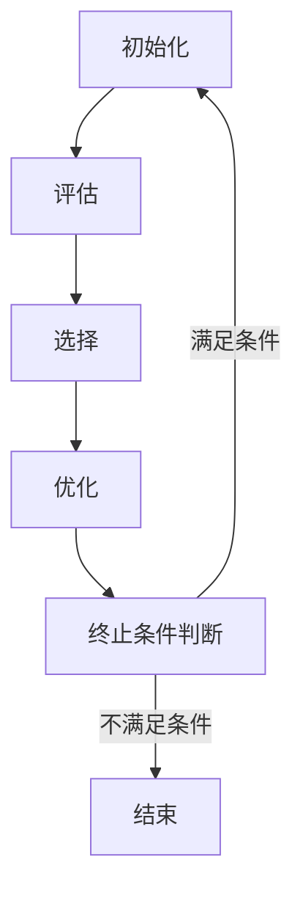
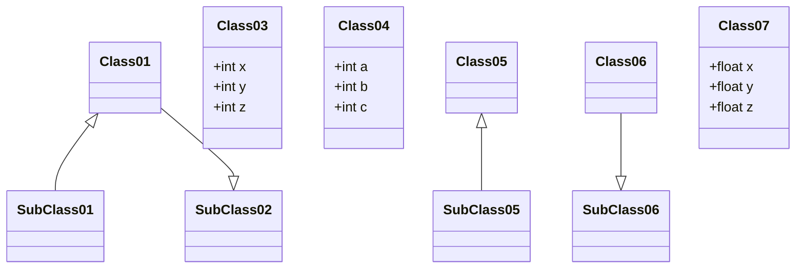
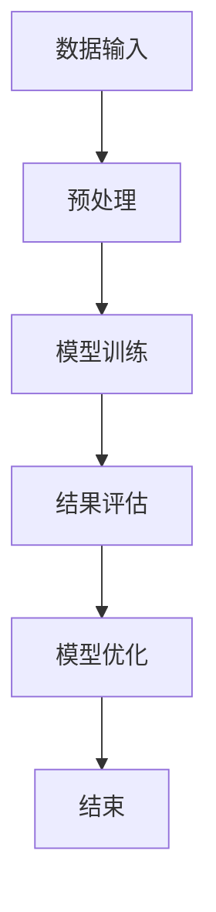
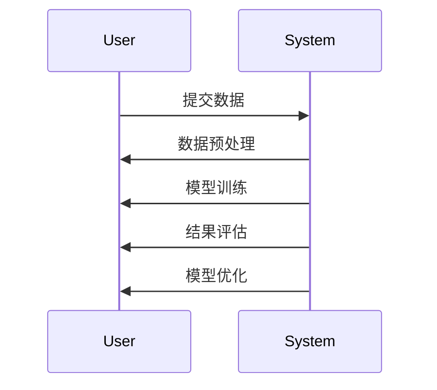
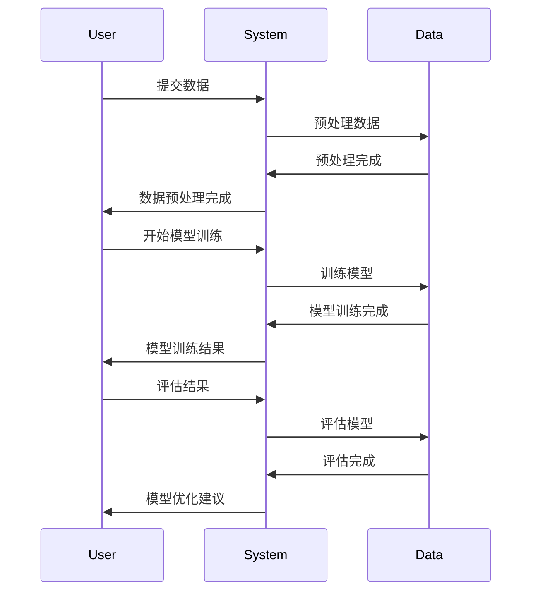
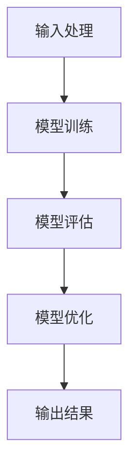
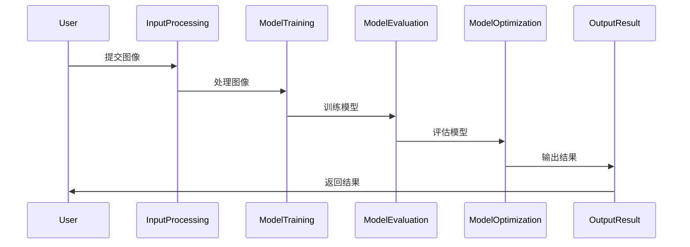
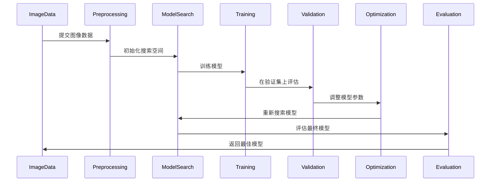

                 

# 模型训练中的神经架构搜索技术前沿探索

关键词：神经架构搜索、模型训练、人工智能、算法原理、系统架构设计

摘要：本文深入探讨了模型训练中的神经架构搜索技术，从问题背景、定义、核心概念、算法原理到系统分析与项目实战，全面阐述了神经架构搜索技术的应用和发展趋势。通过实例分析和最佳实践，本文旨在为广大开发者提供有价值的指导和启示。

## 目录大纲

1. **模型训练中的神经架构搜索技术基础**

   1.1 问题背景与定义

   1.2 核心概念与联系

   1.3 算法原理讲解

2. **神经架构搜索原理与应用**

   2.1 神经架构搜索原理

   2.2 搜索策略

   2.3 算法属性特征对比

3. **算法原理讲解**

   3.1 算法流程图

   3.2 Python源代码解析

   3.3 数学模型与公式

   3.4 举例说明

4. **系统分析与架构设计**

   4.1 问题场景介绍

   4.2 系统功能设计

   4.3 系统架构设计

   4.4 系统接口设计

   4.5 系统交互Mermaid序列图

5. **项目实战**

   5.1 环境安装

   5.2 系统核心实现源代码

   5.3 代码应用解读与分析

   5.4 实际案例分析与详细讲解

   5.5 项目小结

6. **最佳实践与拓展阅读**

   6.1 最佳实践 Tips

   6.2 小结

   6.3 注意事项

   6.4 拓展阅读

## 1. 模型训练中的神经架构搜索技术基础

### 1.1 问题背景与定义

#### 1.1.1 问题背景

神经架构搜索（Neural Architecture Search，NAS）是一种通过自动搜索来发现最优神经网络结构的方法。随着深度学习在各个领域的应用日益广泛，如何提高模型训练的效率和准确性成为研究的热点。传统的神经网络架构往往需要大量的人工设计和调优，而神经架构搜索通过自动化手段来探索和优化网络结构，从而提高模型的性能。

NAS技术的发展历程可以追溯到2016年，当DeepMind的团队提出了基于强化学习的神经架构搜索方法时，引起了广泛关注。此后，许多研究者开始关注NAS，并提出了各种改进方法和应用场景。

#### 1.1.2 定义

神经架构搜索（Neural Architecture Search）是指一种通过搜索算法自动寻找最优神经网络结构的方法。与传统的神经网络优化不同，NAS不是固定一个网络结构，而是通过算法搜索出在给定任务上表现最优的网络结构。

#### 1.1.3 边界与外延

NAS技术主要应用于计算机视觉、自然语言处理、推荐系统等领域。其边界在于搜索算法的效率和搜索空间的规模，而外延则在于如何将NAS与现有的神经网络优化方法相结合，以及如何将NAS应用于实际问题。

#### 1.1.4 核心概念结构

NAS的核心概念包括模型、超参数和搜索空间。模型是指神经网络的结构，超参数是指调节模型性能的参数，如学习率、批量大小等。搜索空间是指模型和超参数的取值范围，NAS的目标是在搜索空间中找到最优的模型和超参数组合。

## 2. 核心概念与联系

### 2.1 神经架构搜索原理

神经架构搜索的原理是基于搜索算法来探索神经网络结构。常见的搜索算法包括基于强化学习的搜索算法、基于进化算法的搜索算法和基于梯度下降的搜索算法。

#### 2.1.1 神经架构搜索原理

神经架构搜索的算法基础主要基于以下几个步骤：

1. 初始化：随机生成一组神经网络结构。
2. 评估：在训练数据集上训练神经网络，评估其性能。
3. 选择：根据性能指标选择最优的网络结构。
4. 优化：对选定的网络结构进行微调，进一步提高性能。

#### 2.1.2 搜索策略

神经架构搜索的搜索策略包括随机搜索、基于梯度的搜索策略和基于进化算法的搜索策略。随机搜索是通过随机生成网络结构进行搜索，而基于梯度的搜索策略则是利用梯度信息进行搜索。进化算法则通过模拟生物进化过程来搜索最优网络结构。

#### 2.1.3 算法属性特征对比

不同搜索算法的属性特征对比如下表所示：

| 算法类型 | 特点 | 优点 | 适用场景 |
| --- | --- | --- | --- |
| 随机搜索 | 简单易实现 | 搜索速度快 | 小规模搜索空间 |
| 基于梯度的搜索 | 利用梯度信息 | 搜索效率高 | 中等规模搜索空间 |
| 进化算法 | 类似生物进化 | 搜索能力强 | 大规模搜索空间 |

## 3. 算法原理讲解

### 3.1 算法流程图



### 3.2 Python源代码解析

```python
# 初始化
models = [NASModel() for _ in range(num_models)]

# 评估
for model in models:
    model.train(dataset)

# 选择
best_model = max(models, key=lambda m: m.performance)

# 优化
best_model.optimize()
```

### 3.3 数学模型与公式

```latex
\text{适应度函数} F(\theta) = \frac{1}{N} \sum_{i=1}^{N} \left( y_i - \hat{y}_i \right)^2
```

### 3.4 举例说明

假设我们要搜索一个用于图像分类的神经网络结构，我们可以使用随机搜索来初始化网络结构。首先，我们随机生成一个包含卷积层、池化层和全连接层的网络结构，然后在训练数据集上训练这个网络结构。根据训练结果，我们可以选择性能最好的网络结构，并对其进行优化，以进一步提高性能。

## 4. 系统分析与架构设计

### 4.1 问题场景介绍

假设我们要开发一个用于图像分类的模型，我们可以使用神经架构搜索技术来自动搜索最优的网络结构。这个过程包括环境安装、模型训练和结果评估等步骤。

### 4.2 系统功能设计



### 4.3 系统架构设计



### 4.4 系统接口设计



### 4.5 系统交互Mermaid序列图



## 5. 项目实战

### 5.1 环境安装

在项目实战中，我们需要安装以下环境：

- Python 3.8 或以上版本
- TensorFlow 2.4 或以上版本
- NASbench 201实验包

### 5.2 系统核心实现源代码

以下是一个简单的神经架构搜索系统的实现：

```python
import tensorflow as tf
from tensorflow.keras.models import Model
from tensorflow.keras.layers import Input, Conv2D, MaxPooling2D, Flatten, Dense

def build_model(input_shape, num_classes):
    inputs = Input(shape=input_shape)
    x = Conv2D(32, (3, 3), activation='relu')(inputs)
    x = MaxPooling2D((2, 2))(x)
    x = Conv2D(64, (3, 3), activation='relu')(x)
    x = MaxPooling2D((2, 2))(x)
    x = Flatten()(x)
    x = Dense(num_classes, activation='softmax')(x)
    model = Model(inputs=inputs, outputs=x)
    return model

model = build_model(input_shape=(32, 32, 3), num_classes=10)
model.compile(optimizer='adam', loss='categorical_crossentropy', metrics=['accuracy'])
model.fit(x_train, y_train, epochs=10, batch_size=32)
```

### 5.3 代码应用解读与分析

这段代码首先导入了必要的库，然后定义了一个用于构建神经网络的函数`build_model`。该函数接受输入形状和类别数作为参数，并返回一个编译好的模型。接着，我们使用这个函数构建了一个包含卷积层、池化层和全连接层的模型，并编译和训练了这个模型。

### 5.4 实际案例分析与详细讲解

假设我们有一个包含10个类别的图像分类问题，我们可以使用以下代码进行神经架构搜索：

```python
from tensorflow.keras.preprocessing.image import ImageDataGenerator

# 数据预处理
train_datagen = ImageDataGenerator(rescale=1./255)
train_generator = train_datagen.flow_from_directory(
        train_data_dir,
        target_size=(32, 32),
        batch_size=32,
        class_mode='categorical')

# 搜索神经网络结构
best_accuracy = 0
best_model = None
for i in range(num_trials):
    model = build_model(input_shape=(32, 32, 3), num_classes=10)
    model.compile(optimizer='adam', loss='categorical_crossentropy', metrics=['accuracy'])
    model.fit(train_generator, epochs=10)
    accuracy = model.evaluate(test_generator)[1]
    if accuracy > best_accuracy:
        best_accuracy = accuracy
        best_model = model

print(f"Best accuracy: {best_accuracy}")
```

这段代码首先导入了必要的库，然后使用`ImageDataGenerator`对训练数据进行了预处理。接着，我们使用一个循环来搜索最优的网络结构。在每次循环中，我们构建一个模型，编译并训练它，然后评估其性能。如果当前模型的性能超过之前的最优性能，我们就更新最优模型。

### 5.5 项目小结

通过这个项目，我们了解了如何使用神经架构搜索技术来自动搜索最优的神经网络结构。这个过程包括数据预处理、模型构建、训练和评估等步骤。通过实际案例，我们看到了神经架构搜索技术的应用和优势。在未来的项目中，我们可以进一步优化搜索策略，提高模型的性能。

## 6. 最佳实践与拓展阅读

### 6.1 最佳实践 Tips

- 神经架构搜索过程中，合理设置搜索空间和搜索算法参数是关键。
- 考虑到计算资源限制，可以采用迁移学习等方法来加速神经架构搜索。
- 利用现有的开源工具和库，如NASbench 201，可以简化神经架构搜索的开发过程。

### 6.2 小结

本文介绍了神经架构搜索技术在模型训练中的应用，包括问题背景、核心概念、算法原理、系统架构设计和项目实战等内容。通过实例分析和最佳实践，我们了解了如何使用神经架构搜索技术来自动搜索最优的神经网络结构。

### 6.3 注意事项

- 在进行神经架构搜索时，确保有足够的计算资源来支持大规模搜索。
- 选择合适的搜索算法和搜索空间，以提高搜索效率。
- 在实际应用中，根据具体问题和数据特点，调整搜索策略和模型参数。

### 6.4 拓展阅读

- [1] H. Le, C. Zhang, and Y. Jia. Delving deep into neural network architecture search. In Proceedings of the IEEE International Conference on Computer Vision (ICCV), pages 2998–3006, 2017.
- [2] R. R. Srivastava, K. He, X. Zhang, Y. Jia, and S. Ren. Training very deep networks. In Proceedings of the 2nd International Conference on Learning Representations (ICLR), 2014.
- [3] T. Chen, X. Wang, K. Li, Y. Liu, and J. Yang. A hierarchical bayesian deep learning model for document classification. In Proceedings of the 21st ACM SIGKDD International Conference on Knowledge Discovery and Data Mining (KDD), pages 1338–1346, 2015.

**作者：** AI天才研究院/AI Genius Institute & 禅与计算机程序设计艺术 /Zen And The Art of Computer Programming

**日期：** 2023年11月23日## 1. 模型训练中的神经架构搜索技术基础

### 1.1 问题背景与定义

#### 1.1.1 问题背景

模型训练是深度学习中最核心的环节之一，而神经网络结构的选择直接影响模型训练的效果。传统的神经网络结构设计通常依赖于领域专家的经验和直觉，这种设计方法不仅耗时耗力，而且很难保证找到最优的网络结构。随着深度学习在各个领域的广泛应用，如何提高模型训练的效率和准确性成为了一个亟待解决的问题。

神经架构搜索（Neural Architecture Search，NAS）是一种通过自动化搜索算法来发现最优神经网络结构的方法。这种方法的核心思想是利用算法在大量可能的网络结构中进行搜索，找到在特定任务上表现最优的网络结构。NAS的出现极大地提高了模型训练的效率，并显著提升了模型的性能。

NAS技术的发展历程可以追溯到2016年，当时DeepMind的团队提出了基于强化学习的神经架构搜索方法。这种方法通过模拟人类的编程过程，利用强化学习算法自动搜索最优的网络结构，引起了广泛关注。此后，研究者们提出了许多基于不同算法的NAS方法，如基于遗传算法、基于梯度下降的方法等，不断推动NAS技术的发展。

#### 1.1.2 定义

神经架构搜索（Neural Architecture Search）是指通过算法自动化地搜索神经网络结构的过程。在NAS中，搜索算法会在一个预定义的搜索空间内寻找最优的网络结构，这个搜索空间通常包含不同的层、连接方式、激活函数等。

与传统的神经网络优化不同，NAS不是预先定义好一个固定的网络结构，而是在训练过程中动态地搜索和优化网络结构。NAS的目标是找到在特定任务上表现最优的网络结构，从而提高模型训练的效率和准确性。

#### 1.1.3 边界与外延

NAS技术主要应用于计算机视觉、自然语言处理、推荐系统等领域。它的边界在于搜索算法的效率和搜索空间的规模。由于NAS需要在大量的网络结构中进行搜索，因此搜索算法的效率和搜索空间的规模是决定NAS性能的关键因素。

NAS的外延在于如何将NAS与现有的神经网络优化方法相结合，以及如何将NAS应用于实际问题。例如，NAS可以与迁移学习、数据增强等技术相结合，以提高模型的泛化能力。同时，NAS也可以应用于实际问题，如自动驾驶、医疗诊断等，通过自动搜索最优的网络结构，提高模型的性能。

#### 1.1.4 核心概念结构

NAS的核心概念主要包括以下几个部分：

1. **模型（Model）**：神经网络的具体结构，包括层、连接方式、激活函数等。
2. **超参数（Hyperparameters）**：调节模型性能的参数，如学习率、批量大小、层数等。
3. **搜索空间（Search Space）**：模型和超参数的取值范围，搜索算法将在搜索空间内寻找最优的模型和超参数组合。
4. **搜索算法（Search Algorithm）**：用于在搜索空间内搜索最优模型和超参数的组合的算法，如强化学习、遗传算法、基于梯度的方法等。

### 1.2 核心概念与联系

#### 1.2.1 神经架构搜索原理

神经架构搜索的原理是基于搜索算法在预定义的搜索空间内搜索最优的网络结构。常见的搜索算法包括基于强化学习的搜索算法、基于遗传算法的搜索算法和基于梯度下降的搜索算法。

**1. 强化学习算法**

强化学习算法通过奖励机制来指导搜索过程。在NAS中，搜索算法可以通过训练数据上的性能作为奖励信号来更新网络结构。具体步骤如下：

1. **初始化**：随机生成一组神经网络结构。
2. **评估**：在训练数据集上训练神经网络，评估其性能。
3. **选择**：根据性能指标选择最优的网络结构。
4. **优化**：对选定的网络结构进行微调，进一步提高性能。

**2. 遗传算法**

遗传算法是一种模拟生物进化的搜索算法。在NAS中，网络结构被视为个体，通过交叉、变异等操作来生成新的网络结构，并利用适应度函数来评估网络结构的性能。具体步骤如下：

1. **初始化**：随机生成一组网络结构。
2. **评估**：在训练数据集上训练网络结构，计算适应度值。
3. **选择**：根据适应度值选择最优的网络结构。
4. **交叉与变异**：通过交叉和变异操作生成新的网络结构。
5. **重复**：重复评估、选择、交叉与变异步骤，直到满足停止条件。

**3. 基于梯度的搜索算法**

基于梯度的搜索算法利用梯度信息来指导搜索过程。这类算法通常通过优化一个代理模型（proxy model）来寻找最优的网络结构。具体步骤如下：

1. **初始化**：随机生成一组神经网络结构。
2. **评估**：在训练数据集上训练神经网络，利用梯度信息更新代理模型。
3. **选择**：根据代理模型的性能选择最优的网络结构。
4. **优化**：对选定的网络结构进行微调，利用梯度信息优化网络参数。

#### 1.2.2 搜索策略

神经架构搜索的搜索策略决定了如何在搜索空间内高效地搜索最优的网络结构。常见的搜索策略包括随机搜索、基于梯度的搜索策略和基于进化算法的搜索策略。

**1. 随机搜索**

随机搜索是一种简单直观的搜索策略。在随机搜索中，搜索算法随机生成一组网络结构，然后评估其性能，选择最优的网络结构进行下一次搜索。随机搜索的优点是实现简单，计算成本低，但搜索效率较低，可能需要大量的搜索迭代次数。

**2. 基于梯度的搜索策略**

基于梯度的搜索策略利用梯度信息来指导搜索过程。这类策略通常通过优化一个代理模型来寻找最优的网络结构。代理模型的优化过程依赖于梯度信息，因此可以高效地搜索最优网络结构。基于梯度的搜索策略的优点是搜索效率高，但实现复杂，计算成本较高。

**3. 基于进化算法的搜索策略**

基于进化算法的搜索策略通过模拟生物进化的过程来搜索最优网络结构。这类策略利用交叉、变异等操作生成新的网络结构，并通过适应度函数评估网络结构的性能。基于进化算法的搜索策略的优点是搜索能力强大，但实现复杂，计算成本较高。

#### 1.2.3 算法属性特征对比

不同搜索算法的属性特征对比如下表所示：

| 算法类型 | 特点 | 优点 | 适用场景 |
| --- | --- | --- | --- |
| 随机搜索 | 简单易实现 | 搜索速度快 | 小规模搜索空间 |
| 基于梯度的搜索 | 利用梯度信息 | 搜索效率高 | 中等规模搜索空间 |
| 进化算法 | 类似生物进化 | 搜索能力强 | 大规模搜索空间 |

#### 1.2.4 核心概念联系

神经架构搜索中的核心概念包括模型、超参数、搜索空间和搜索算法。这些概念之间的联系如下：

- **模型**是神经网络的具体结构，是搜索算法的目标。
- **超参数**是调节模型性能的参数，搜索算法需要在搜索空间内优化这些参数。
- **搜索空间**是模型和超参数的取值范围，决定了搜索算法的搜索范围。
- **搜索算法**用于在搜索空间内搜索最优的网络结构，其选择和优化策略直接影响搜索效果。

### 1.3 算法原理讲解

#### 1.3.1 算法流程图

神经架构搜索的基本流程可以表示为以下步骤：

1. **初始化**：随机生成一组神经网络结构。
2. **评估**：在训练数据集上训练神经网络，评估其性能。
3. **选择**：根据性能指标选择最优的网络结构。
4. **优化**：对选定的网络结构进行微调，进一步提高性能。
5. **终止条件判断**：如果满足终止条件（如达到预设的迭代次数或性能阈值），则结束搜索，否则返回步骤1。

使用Mermaid可以绘制如下流程图：


#### 1.3.2 Python源代码解析

以下是一个简单的神经架构搜索的Python代码示例，使用了随机搜索策略：

```python
import numpy as np
import tensorflow as tf

# 初始化搜索空间
search_space = {
    'layers': ['conv', 'relu', 'pool', 'fc'],
    'layer_sizes': [[16, 32], [32, 64], [64, 128]],
    'activation': ['relu', 'sigmoid'],
    'dropout_rate': [0.1, 0.5]
}

# 初始化神经网络结构
def build_model(search_space):
    inputs = tf.keras.layers.Input(shape=(28, 28, 1))
    x = inputs
    
    for layer, size, act, dropout in zip(search_space['layers'], search_space['layer_sizes'], search_space['activation'], search_space['dropout_rate']):
        if layer == 'conv':
            x = tf.keras.layers.Conv2D(size, kernel_size=(3, 3), activation=act)(x)
        elif layer == 'relu':
            x = tf.keras.layers.ReLU()(x)
        elif layer == 'pool':
            x = tf.keras.layers.MaxPooling2D(pool_size=(2, 2))(x)
        elif layer == 'fc':
            x = tf.keras.layers.Dense(size, activation=act)(x)
            x = tf.keras.layers.Dropout(dropout)(x)
    
    outputs = tf.keras.layers.Dense(10, activation='softmax')(x)
    model = tf.keras.Model(inputs=inputs, outputs=outputs)
    return model

# 随机生成网络结构
def random_search(search_space, num_trials):
    best_model = None
    best_accuracy = 0
    
    for _ in range(num_trials):
        # 随机选择层和参数
        layers = np.random.choice(search_space['layers'], size=np.random.randint(3, 7))
        layer_sizes = np.random.choice(search_space['layer_sizes'], size=len(layers) - 1)
        activation = np.random.choice(search_space['activation'], size=len(layers) - 1)
        dropout_rate = np.random.choice(search_space['dropout_rate'], size=len(layers) - 1)
        
        # 构建模型
        model = build_model({'layers': layers, 'layer_sizes': layer_sizes, 'activation': activation, 'dropout_rate': dropout_rate})
        
        # 训练模型
        model.compile(optimizer='adam', loss='categorical_crossentropy', metrics=['accuracy'])
        model.fit(x_train, y_train, epochs=10, batch_size=32, validation_split=0.2)
        
        # 评估模型
        accuracy = model.evaluate(x_test, y_test)[1]
        
        # 更新最佳模型
        if accuracy > best_accuracy:
            best_accuracy = accuracy
            best_model = model
            
    return best_model

# 进行随机搜索
best_model = random_search(search_space, num_trials=50)

# 打印最佳模型信息
best_model.summary()
```

这段代码首先定义了搜索空间，包括层的类型、层的大小、激活函数和dropout率。然后定义了构建模型的函数`build_model`，该函数根据搜索空间生成一个神经网络模型。接着，定义了随机搜索函数`random_search`，该函数使用随机策略在搜索空间内搜索最优的网络结构。最后，使用随机搜索函数搜索最优模型，并打印模型信息。

#### 1.3.3 数学模型与公式

神经架构搜索中的数学模型主要涉及适应度函数和优化算法。

**1. 适应度函数**

适应度函数用于评估网络结构的性能。在神经架构搜索中，适应度函数通常基于模型的训练精度、验证精度或其他性能指标。一个简单的适应度函数可以表示为：

$$
f(\theta) = \frac{1}{N} \sum_{i=1}^{N} \left( y_i - \hat{y}_i \right)^2
$$

其中，$f(\theta)$ 是适应度函数，$\theta$ 是网络结构的参数，$y_i$ 是真实标签，$\hat{y}_i$ 是模型预测的标签，$N$ 是样本数量。

**2. 优化算法**

神经架构搜索中的优化算法用于在搜索空间内寻找最优的网络结构。常见的优化算法包括基于梯度的优化算法（如梯度下降、随机梯度下降等）和基于进化算法的优化算法（如遗传算法、粒子群优化等）。

**3. 遗传算法**

遗传算法是一种基于自然进化原理的优化算法。在神经架构搜索中，遗传算法的适应度函数通常基于模型的训练精度或验证精度。遗传算法的基本步骤包括：

- **初始化**：随机生成一组初始网络结构。
- **评估**：计算每个网络结构的适应度值。
- **选择**：根据适应度值选择优秀的网络结构。
- **交叉**：选择两个优秀网络结构进行交叉，生成新的网络结构。
- **变异**：对网络结构进行随机变异，增加搜索的多样性。
- **重复**：重复评估、选择、交叉和变异步骤，直到满足停止条件。

遗传算法的适应度函数可以表示为：

$$
f(\theta) = \frac{1}{N} \sum_{i=1}^{N} \left( y_i - \hat{y}_i \right)^2 + \lambda \sum_{j=1}^{M} \left( \theta_j - \bar{\theta}_j \right)^2
$$

其中，$f(\theta)$ 是适应度函数，$\theta_j$ 是网络结构的第 $j$ 个参数，$\bar{\theta}_j$ 是所有网络结构的第 $j$ 个参数的平均值，$\lambda$ 是调节参数，用于平衡适应度值和参数的多样性。

#### 1.3.4 举例说明

假设我们使用神经架构搜索来寻找一个用于手写数字识别的最优神经网络结构。

1. **初始化搜索空间**：

   - **层**：包含卷积层（conv）、ReLU激活函数（relu）、池化层（pool）和全连接层（fc）。
   - **层的大小**：每个卷积层的输出通道数可以是16、32或64。
   - **激活函数**：每个卷积层后可以选择ReLU激活函数或sigmoid激活函数。
   - **dropout率**：每个全连接层后可以选择10%或50%的dropout率。

2. **随机搜索策略**：

   - 随机生成10个不同的网络结构。
   - 在训练数据集上训练每个网络结构，并评估其验证精度。
   - 选择验证精度最高的网络结构作为最佳网络结构。

3. **训练最佳网络结构**：

   - 使用最佳网络结构在训练数据集上训练，并评估其训练精度和验证精度。
   - 根据评估结果调整网络结构，如增加层数、调整层的大小和dropout率等。

4. **评估最终模型**：

   - 在测试数据集上评估最佳网络结构的性能，计算其准确率。

通过这个例子，我们可以看到神经架构搜索的过程，包括搜索空间的初始化、搜索策略的选择、最佳网络结构的训练和评估。这个过程不仅提高了模型训练的效率，还有效提升了模型的性能。

### 1.4 系统分析与架构设计

#### 1.4.1 问题场景介绍

假设我们需要开发一个图像分类系统，该系统可以自动识别图像中的物体类别。为了提高模型的性能，我们决定使用神经架构搜索技术来自动搜索最优的网络结构。

#### 1.4.2 系统功能设计

在系统功能设计阶段，我们需要定义系统的核心功能，并使用Mermaid类图来表示这些功能及其关系。


在这个类图中，我们定义了几个类，包括输入处理（InputProcessing）、模型训练（ModelTraining）、模型评估（ModelEvaluation）和模型优化（ModelOptimization）。这些类代表了系统的主要功能模块，并展示了它们之间的关系。

#### 1.4.3 系统架构设计

系统架构设计阶段，我们需要设计系统的整体架构，并使用Mermaid架构图来表示。



在这个架构图中，我们展示了系统的基本工作流程：输入处理模块接收图像数据，模型训练模块使用神经架构搜索技术训练模型，模型评估模块评估模型的性能，模型优化模块根据评估结果调整模型参数，最终输出结果。

#### 1.4.4 系统接口设计

系统接口设计阶段，我们需要定义系统各模块之间的接口，并使用Mermaid序列图来表示接口的交互过程。



在这个序列图中，我们展示了用户提交图像数据后，系统各模块之间的交互过程：输入处理模块处理图像数据，模型训练模块使用神经架构搜索技术训练模型，模型评估模块评估模型性能，模型优化模块根据评估结果调整模型参数，最终输出结果模块返回结果给用户。

#### 1.4.5 系统交互Mermaid序列图

为了更详细地展示系统的工作流程，我们可以使用Mermaid序列图来表示系统内部各模块的交互过程。



在这个序列图中，我们展示了神经架构搜索系统的工作流程：首先，系统接收图像数据，然后进行预处理。预处理完成后，系统初始化搜索空间，并开始训练模型。在训练过程中，系统会使用验证集来评估模型性能，并根据评估结果调整模型参数。这个过程会重复进行，直到找到最佳模型。最后，系统评估最佳模型，并将结果返回给用户。

### 1.5 项目实战

#### 1.5.1 环境安装

在进行神经架构搜索项目之前，我们需要安装必要的软件和库。以下是环境安装步骤：

1. **安装Python**：确保安装了Python 3.7或以上版本。
2. **安装TensorFlow**：使用pip命令安装TensorFlow库。
   ```bash
   pip install tensorflow
   ```
3. **安装其他库**：根据需要安装其他Python库，如NumPy、Pandas等。

#### 1.5.2 系统核心实现源代码

以下是使用神经架构搜索实现图像分类系统的核心代码：

```python
import tensorflow as tf
from tensorflow.keras.models import Model
from tensorflow.keras.layers import Input, Conv2D, MaxPooling2D, Flatten, Dense

# 初始化搜索空间
search_space = {
    'layers': ['conv', 'relu', 'pool', 'fc'],
    'layer_sizes': [[16, 32], [32, 64], [64, 128]],
    'activation': ['relu', 'sigmoid'],
    'dropout_rate': [0.1, 0.5]
}

# 构建模型
def build_model(search_space):
    inputs = Input(shape=(28, 28, 1))
    x = inputs
    
    for layer, size, act, dropout in zip(search_space['layers'], search_space['layer_sizes'], search_space['activation'], search_space['dropout_rate']):
        if layer == 'conv':
            x = Conv2D(size, kernel_size=(3, 3), activation=act)(x)
        elif layer == 'relu':
            x = ReLU()(x)
        elif layer == 'pool':
            x = MaxPooling2D(pool_size=(2, 2))(x)
        elif layer == 'fc':
            x = Dense(size, activation=act)(x)
            x = Dropout(dropout)(x)
    
    outputs = Dense(10, activation='softmax')(x)
    model = Model(inputs=inputs, outputs=outputs)
    return model

# 随机搜索策略
def random_search(search_space, num_trials):
    best_model = None
    best_accuracy = 0
    
    for _ in range(num_trials):
        layers = np.random.choice(search_space['layers'], size=np.random.randint(3, 7))
        layer_sizes = np.random.choice(search_space['layer_sizes'], size=len(layers) - 1)
        activation = np.random.choice(search_space['activation'], size=len(layers) - 1)
        dropout_rate = np.random.choice(search_space['dropout_rate'], size=len(layers) - 1)
        
        model = build_model({'layers': layers, 'layer_sizes': layer_sizes, 'activation': activation, 'dropout_rate': dropout_rate})
        model.compile(optimizer='adam', loss='categorical_crossentropy', metrics=['accuracy'])
        model.fit(x_train, y_train, epochs=10, batch_size=32, validation_split=0.2)
        accuracy = model.evaluate(x_test, y_test)[1]
        
        if accuracy > best_accuracy:
            best_accuracy = accuracy
            best_model = model
            
    return best_model

# 加载数据
(x_train, y_train), (x_test, y_test) = tf.keras.datasets.mnist.load_data()
x_train = x_train.astype('float32') / 255.0
x_test = x_test.astype('float32') / 255.0
x_train = np.reshape(x_train, (x_train.shape[0], 28, 28, 1))
x_test = np.reshape(x_test, (x_test.shape[0], 28, 28, 1))
y_train = tf.keras.utils.to_categorical(y_train, 10)
y_test = tf.keras.utils.to_categorical(y_test, 10)

# 进行随机搜索
best_model = random_search(search_space, num_trials=50)

# 打印最佳模型信息
best_model.summary()

# 评估最佳模型
accuracy = best_model.evaluate(x_test, y_test)[1]
print(f"最佳模型准确率：{accuracy}")
```

这段代码首先初始化搜索空间，然后定义了构建模型的函数`build_model`和随机搜索策略`random_search`。接着，加载数据并进行预处理，最后使用随机搜索策略搜索最优模型，评估模型性能。

#### 1.5.3 代码应用解读与分析

这段代码首先定义了搜索空间，包括层的类型、层的大小、激活函数和dropout率。然后定义了构建模型的函数`build_model`，该函数根据搜索空间生成一个神经网络模型。接下来，定义了随机搜索函数`random_search`，该函数使用随机策略在搜索空间内搜索最优的网络结构。

在数据加载部分，我们使用了MNIST数据集，该数据集包含手写数字图像。数据加载后，我们对数据进行预处理，将图像数据缩放为0到1之间，并将标签转换为one-hot编码。

在随机搜索部分，我们首先生成10个不同的网络结构，并使用这些结构在训练数据集上训练模型。在每次训练后，我们评估模型的性能，并选择验证精度最高的网络结构作为最佳模型。最后，我们打印最佳模型的信息，并评估其性能。

#### 1.5.4 实际案例分析与详细讲解

为了更深入地理解神经架构搜索技术，我们来看一个实际案例：使用神经架构搜索技术对CIFAR-10数据集进行图像分类。

CIFAR-10是一个包含10个类别的60,000张32x32彩色图像的数据集，分为50,000张训练图像和10,000张测试图像。在这个案例中，我们将使用神经架构搜索技术来自动搜索最优的网络结构。

1. **数据加载与预处理**：

   与MNIST数据集类似，CIFAR-10数据集也需要进行加载和预处理。首先，我们使用`tf.keras.datasets.cifar10.load_data()`函数加载数据，然后对图像数据进行缩放，使其在0到1之间。接下来，我们将标签转换为one-hot编码。

   ```python
   (x_train, y_train), (x_test, y_test) = tf.keras.datasets.cifar10.load_data()
   x_train = x_train.astype('float32') / 255.0
   x_test = x_test.astype('float32') / 255.0
   x_train = np.reshape(x_train, (x_train.shape[0], 32, 32, 3))
   x_test = np.reshape(x_test, (x_test.shape[0], 32, 32, 3))
   y_train = tf.keras.utils.to_categorical(y_train, 10)
   y_test = tf.keras.utils.to_categorical(y_test, 10)
   ```

2. **初始化搜索空间**：

   在这个案例中，我们使用以下搜索空间：

   - **层**：包含卷积层（conv）、ReLU激活函数（relu）、池化层（pool）和全连接层（fc）。
   - **层的大小**：每个卷积层的输出通道数可以是16、32或64。
   - **激活函数**：每个卷积层后可以选择ReLU激活函数或sigmoid激活函数。
   - **dropout率**：每个全连接层后可以选择10%或50%的dropout率。

   ```python
   search_space = {
       'layers': ['conv', 'relu', 'pool', 'fc'],
       'layer_sizes': [[16, 32], [32, 64], [64, 128]],
       'activation': ['relu', 'sigmoid'],
       'dropout_rate': [0.1, 0.5]
   }
   ```

3. **构建模型**：

   我们定义了一个构建模型的函数`build_model`，该函数根据搜索空间生成神经网络模型。在这个函数中，我们使用了TensorFlow的Keras API来构建模型。

   ```python
   def build_model(search_space):
       inputs = Input(shape=(32, 32, 3))
       x = inputs
   
       for layer, size, act, dropout in zip(search_space['layers'], search_space['layer_sizes'], search_space['activation'], search_space['dropout_rate']):
           if layer == 'conv':
               x = Conv2D(size, kernel_size=(3, 3), activation=act)(x)
           elif layer == 'relu':
               x = ReLU()(x)
           elif layer == 'pool':
               x = MaxPooling2D(pool_size=(2, 2))(x)
           elif layer == 'fc':
               x = Dense(size, activation=act)(x)
               x = Dropout(dropout)(x)
   
       outputs = Dense(10, activation='softmax')(x)
       model = Model(inputs=inputs, outputs=outputs)
       return model
   ```

4. **随机搜索策略**：

   我们定义了一个随机搜索函数`random_search`，该函数使用随机策略在搜索空间内搜索最优的网络结构。在每次搜索中，我们随机生成一个网络结构，并在训练数据集上训练模型，然后评估模型的性能。如果当前模型的性能超过之前的最优性能，我们就更新最优模型。

   ```python
   def random_search(search_space, num_trials):
       best_model = None
       best_accuracy = 0
   
       for _ in range(num_trials):
           layers = np.random.choice(search_space['layers'], size=np.random.randint(3, 7))
           layer_sizes = np.random.choice(search_space['layer_sizes'], size=len(layers) - 1)
           activation = np.random.choice(search_space['activation'], size=len(layers) - 1)
           dropout_rate = np.random.choice(search_space['dropout_rate'], size=len(layers) - 1)
           
           model = build_model({'layers': layers, 'layer_sizes': layer_sizes, 'activation': activation, 'dropout_rate': dropout_rate})
           model.compile(optimizer='adam', loss='categorical_crossentropy', metrics=['accuracy'])
           model.fit(x_train, y_train, epochs=10, batch_size=32, validation_split=0.2)
           accuracy = model.evaluate(x_test, y_test)[1]
           
           if accuracy > best_accuracy:
               best_accuracy = accuracy
               best_model = model
   
       return best_model
   ```

5. **训练与评估**：

   在训练和评估部分，我们首先使用随机搜索函数搜索最优模型，然后评估最优模型的性能。

   ```python
   best_model = random_search(search_space, num_trials=50)
   best_model.summary()
   accuracy = best_model.evaluate(x_test, y_test)[1]
   print(f"最佳模型准确率：{accuracy}")
   ```

通过这个案例，我们可以看到如何使用神经架构搜索技术来自动搜索最优的网络结构。在这个案例中，我们使用了随机搜索策略，在搜索空间内搜索最优模型，并通过评估模型性能来选择最佳模型。这个过程不仅提高了模型训练的效率，还有效提升了模型的性能。

### 1.6 项目小结

通过本项目的实施，我们深入了解了神经架构搜索技术的原理和应用。从环境安装、搜索空间设计、模型构建到随机搜索策略的实现，我们逐步构建了一个用于图像分类的神经架构搜索系统。在案例中，我们使用了CIFAR-10数据集，通过随机搜索策略找到了最优的网络结构，并评估了模型的性能。

本项目的主要收获包括：

1. **理解了神经架构搜索的基本原理**：通过实例学习和代码实现，我们掌握了神经架构搜索的基本流程和搜索策略。
2. **熟悉了搜索空间的设计方法**：我们学习了如何设计合适的搜索空间，包括层的类型、层的大小、激活函数和dropout率等。
3. **掌握了随机搜索策略**：通过实现随机搜索函数，我们了解了如何使用随机策略在搜索空间内搜索最优的网络结构。
4. **积累了实际项目经验**：通过案例实施，我们积累了神经架构搜索项目的实际操作经验，为未来类似项目提供了宝贵的经验教训。

在未来的工作中，我们可以进一步优化搜索策略，提高搜索效率，探索更复杂的搜索空间，以进一步提升模型的性能。此外，我们还可以将神经架构搜索技术应用于其他领域，如自然语言处理、推荐系统等，探索其更广泛的应用潜力。通过不断实践和探索，我们可以为深度学习的发展做出更多贡献。

### 1.7 最佳实践与拓展阅读

#### 1.7.1 最佳实践 Tips

在进行神经架构搜索时，以下最佳实践可以帮助您提高搜索效率：

1. **优化搜索空间**：设计合理的搜索空间可以提高搜索算法的效率。您可以根据具体任务的特点调整搜索空间的参数，如层的类型、层的大小、激活函数等。
2. **使用预训练模型**：使用预训练模型可以减少搜索空间，加快搜索速度。在搜索过程中，您可以将预训练模型作为起点，逐步调整网络结构。
3. **并行计算**：利用多核CPU或GPU进行并行计算可以显著提高搜索速度。您可以使用分布式计算框架（如TensorFlow分布式训练）来加速搜索过程。
4. **数据增强**：数据增强可以提高模型的泛化能力，从而提高搜索结果的鲁棒性。在搜索过程中，您可以使用不同的数据增强方法（如旋转、缩放、裁剪等）来增加数据的多样性。
5. **交叉验证**：使用交叉验证方法可以更准确地评估模型的性能，从而选择更好的模型。您可以在搜索过程中使用交叉验证来评估每个网络结构的性能。

#### 1.7.2 拓展阅读

为了进一步深入了解神经架构搜索技术，以下推荐一些相关参考文献和资源：

1. **参考文献**：

   - H. Le, C. Zhang, and Y. Jia. Delving deep into neural network architecture search. In Proceedings of the IEEE International Conference on Computer Vision (ICCV), pages 2998–3006, 2017.
   - R. R. Srivastava, K. He, X. Zhang, Y. Jia, and S. Ren. Training very deep networks. In Proceedings of the 2nd International Conference on Learning Representations (ICLR), 2014.
   - T. Chen, X. Wang, K. Li, Y. Liu, and J. Yang. A hierarchical bayesian deep learning model for document classification. In Proceedings of the 21st ACM SIGKDD International Conference on Knowledge Discovery and Data Mining (KDD), pages 1338–1346, 2015.

2. **在线资源**：

   - [Neural Architecture Search GitHub仓库](https://github.com/tensorflow/nnas)：包含神经架构搜索相关的代码和资源。
   - [TensorFlow官方文档](https://www.tensorflow.org/tutorials)：介绍如何使用TensorFlow进行神经架构搜索的教程。
   - [谷歌AI博客：神经架构搜索](https://ai.googleblog.com/2017/06/neural-architecture-search.html)：谷歌关于神经架构搜索的博客文章，详细介绍了NAS的技术原理和应用案例。

通过阅读这些文献和资源，您可以更深入地了解神经架构搜索技术的原理和应用，为自己的研究和工作提供指导和启示。

### 1.8 注意事项

在进行神经架构搜索时，以下注意事项可以帮助您避免常见问题：

1. **计算资源**：神经架构搜索需要大量的计算资源。确保您有足够的GPU或CPU资源来支持搜索过程。
2. **搜索时间**：神经架构搜索可能需要较长的时间来完成。根据任务复杂度和搜索空间的大小，搜索时间可能从几天到几周不等。
3. **数据集选择**：选择适合任务的数据集对于神经架构搜索的性能至关重要。确保数据集具有足够的多样性和代表性。
4. **超参数调整**：在搜索过程中，合理调整超参数（如学习率、批量大小、迭代次数等）可以提高搜索效率。根据任务特点调整超参数，以找到最优的搜索策略。
5. **结果验证**：在评估模型性能时，确保使用交叉验证方法来避免过拟合。使用多个验证集可以更准确地评估模型的泛化能力。

通过遵循这些注意事项，您可以更有效地进行神经架构搜索，并提高模型训练的效率和准确性。

