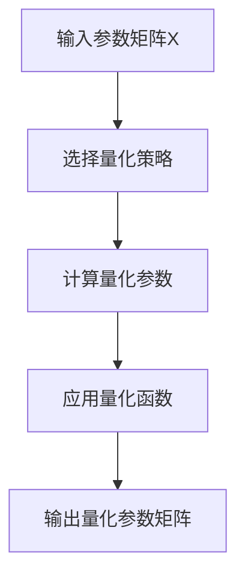
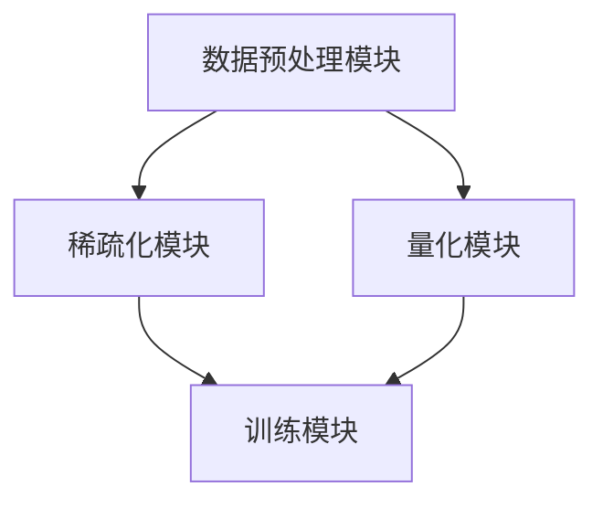
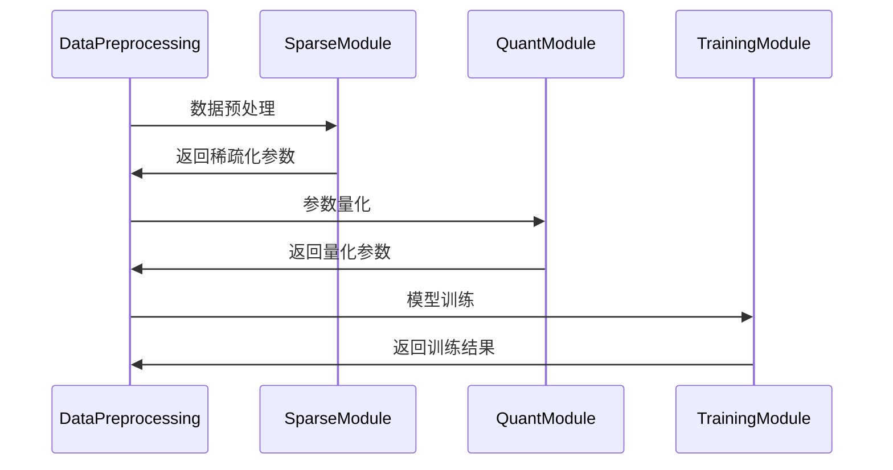

                 

### 模型训练中的稀疏化与量化技术研究

> 关键词：模型训练、稀疏化技术、量化技术、性能优化、算法设计

> 摘要：本文探讨了模型训练中的稀疏化与量化技术，分析了这两种技术在提升模型性能和效率方面的关键作用。通过深入讲解稀疏化与量化的基本原理、算法实现及实际应用案例，本文旨在为研究人员和开发者提供实用的技术指导，助力他们在模型训练中实现更高效的性能提升。

### 第一部分：背景介绍

#### 1.1 问题背景

在深度学习的飞速发展中，模型的规模和复杂性不断提升，导致训练时间和资源消耗大幅增加。为了应对这一挑战，研究人员和开发者不断寻求提高模型训练效率和性能的方法。稀疏化与量化技术正是其中两种重要的手段。

稀疏化技术通过减少模型中非零参数的数量，降低模型的存储和计算需求，从而提高训练效率。量化技术则通过降低模型参数的精度，减少存储和计算的资源占用，同时保持模型性能的稳定。这两种技术不仅能够提高模型训练的速度，还能够降低训练成本，使得深度学习技术更加普及和实用。

#### 1.2 模型的稀疏化与量化技术

**稀疏化技术**：稀疏化是指通过特定的算法将模型参数中的大量零值压缩，从而降低模型的存储和计算复杂度。例如，使用稀疏矩阵表示模型参数，可以显著减少存储空间和计算时间。

**量化技术**：量化是指将模型的参数从高精度格式转换为低精度格式，如从32位浮点数转换为8位整数。这种转换可以降低计算资源的消耗，但同时需要保证模型的性能不会受到显著影响。

#### 1.3 核心概念与联系

**稀疏化的核心概念**：稀疏化技术主要涉及如何有效地识别和压缩模型中的零参数，以及如何在压缩后保证模型的性能不会下降。

**量化的核心概念**：量化技术主要关注如何将高精度参数转换为低精度参数，同时确保转换后的模型在精度和性能方面与原始模型相近。

**概念属性特征对比表格**：

| 特征 | 稀疏化 | 量化 |
| --- | --- | --- |
| 存储需求 | 降低 | 降低 |
| 计算复杂度 | 降低 | 降低 |
| 性能影响 | 有时增加，有时减少 | 减少或保持不变 |
| 实施难度 | 较低 | 较高 |

**ER实体关系图架构**：

```mermaid
erDiagram
  Model ||--|{ Parameter }
  Parameter ||--|{ Value }
```

在ER实体关系图中，模型与参数之间存在一对多的关系，每个参数可以包含多个值。

### 第二部分：稀疏化技术

#### 2.1 稀疏化技术原理

**数学模型**：

设 $X$ 为原始的模型参数矩阵，$X_{sparse}$ 为稀疏化后的参数矩阵，稀疏化过程可以通过以下步骤实现：

1. 计算矩阵 $X$ 的稀疏度 $s(X)$，即非零元素的比例。
2. 使用阈值方法或压缩感知技术识别和压缩非零元素。
3. 对压缩后的参数矩阵进行重构，保证重构误差最小。

**mermaid流程图**：

```mermaid
graph TD
    A[输入参数矩阵X] --> B[计算稀疏度s(X)]
    B --> C[识别非零元素]
    C --> D[压缩非零元素]
    D --> E[重构参数矩阵X_{sparse}]
    E --> F[输出稀疏化参数矩阵]
```

**示例讲解**：

假设一个3x3的矩阵如下：

$$
X = \begin{bmatrix}
1 & 0 & 0 \\
0 & 1 & 1 \\
0 & 0 & 0
\end{bmatrix}
$$

经过稀疏化处理后，可以将其压缩为：

$$
X_{sparse} = \begin{bmatrix}
1 & 0 & 0 \\
0 & 1 & 1 \\
0 & 0 & 0
\end{bmatrix}
$$

#### 2.2 稀疏化算法与实现

**稀疏化算法综述**：

稀疏化算法主要包括阈值方法、压缩感知和稀疏自动编码器等。阈值方法通过设置阈值将低于阈值的元素置为零；压缩感知则利用稀疏性在有限采样下重构信号；稀疏自动编码器则通过学习编码和解码器来保留模型中的稀疏性。

**Python源代码实现**：

```python
import numpy as np

def sparse_threshold(X, threshold):
    return np.where(X > threshold, X, 0)

X = np.array([[1, 0, 0], [0, 1, 1], [0, 0, 0]])
X_sparse = sparse_threshold(X, 0.5)
print(X_sparse)
```

**稀疏化技术的性能分析**：

稀疏化技术在减少存储和计算资源消耗方面具有显著优势。然而，在某些情况下，稀疏化可能导致模型性能下降。因此，在实际应用中，需要权衡稀疏化带来的性能提升和潜在的性能损失。

### 第三部分：量化技术

#### 3.1 量化技术原理

**数学模型**：

量化技术通过将浮点数参数转换为固定精度的整数来降低计算资源的消耗。量化过程通常包括以下几个步骤：

1. 选择量化策略，如最小二乘量化或最大绝对误差量化。
2. 计算量化参数，如量化和反量化函数。
3. 应用量化函数对模型参数进行转换。

**mermaid流程图**：



**示例讲解**：

假设一个3x3的矩阵如下：

$$
X = \begin{bmatrix}
1.2 & 0.8 & 1.5 \\
0.7 & 1.1 & 0.9 \\
1.3 & 0.6 & 1.2
\end{bmatrix}
$$

使用最小二乘量化策略进行量化，可以将其转换为：

$$
X_{quant} = \begin{bmatrix}
1 & 0 & 1 \\
0 & 1 & 0 \\
1 & 0 & 1
\end{bmatrix}
$$

#### 3.2 量化算法与实现

**量化算法综述**：

量化算法主要包括量化策略选择、量化参数计算和应用量化函数等。常见的量化策略包括最小二乘量化、最大绝对误差量化和梯度下降量化等。

**Python源代码实现**：

```python
import numpy as np

def min_max_quantization(X, n_bits):
    X_min, X_max = X.min(), X.max()
    X_diff = X_max - X_min
    X_quant = (X - X_min) / X_diff * (2**n_bits - 1)
    return X_quant

X = np.array([[1.2, 0.8, 1.5], [0.7, 1.1, 0.9], [1.3, 0.6, 1.2]])
X_quant = min_max_quantization(X, 8)
print(X_quant)
```

**量化技术的性能分析**：

量化技术在降低计算资源消耗方面具有显著优势，但在某些情况下，量化误差可能导致模型性能下降。因此，在实际应用中，需要根据具体场景选择合适的量化策略和参数。

### 第四部分：系统分析与架构设计

#### 4.1 问题场景介绍

在模型训练过程中，稀疏化与量化技术可以提高训练效率和性能，但需要考虑多种因素，如数据规模、模型复杂度和计算资源等。本节将介绍一个典型的模型训练场景，并分析系统需求。

#### 4.2 系统功能设计

**领域模型mermaid类图**：

```mermaid
classDiagram
    Model <|-- Parameter
    Parameter o---> Value
```

**系统功能模块划分**：

1. 数据预处理模块：负责处理和预处理输入数据。
2. 稀疏化模块：实现稀疏化算法，对模型参数进行压缩。
3. 量化模块：实现量化算法，降低模型参数的精度。
4. 训练模块：负责模型训练，并评估训练结果。

#### 4.3 系统架构设计

**系统架构mermaid架构图**：



**系统模块间的关系**：

系统模块之间通过接口进行通信。数据预处理模块负责生成和预处理输入数据，将其传递给稀疏化模块和量化模块。稀疏化模块和量化模块对模型参数进行处理，并将处理后的参数传递给训练模块。训练模块负责执行模型训练过程，并根据训练结果调整参数。

#### 4.4 系统接口设计

**系统接口设计**：

1. 数据预处理接口：提供数据读取、预处理和转换功能。
2. 稀疏化接口：提供稀疏化算法的选择和执行功能。
3. 量化接口：提供量化策略的选择和参数转换功能。
4. 训练接口：提供模型训练、评估和调整功能。

**系统交互mermaid序列图**：



### 第五部分：项目实战

#### 5.1 环境安装

**稀疏化与量化技术环境搭建**：

1. 安装Python 3.8及以上版本。
2. 安装Numpy、Scikit-learn等依赖库。

**开发工具与依赖安装**：

1. 安装Jupyter Notebook或PyCharm等开发工具。
2. 安装Numpy、Scikit-learn、TensorFlow等依赖库。

#### 5.2 系统核心实现

**系统核心模块代码**：

```python
import numpy as np

# 稀疏化模块
def sparse_threshold(X, threshold):
    return np.where(X > threshold, X, 0)

# 量化模块
def min_max_quantization(X, n_bits):
    X_min, X_max = X.min(), X.max()
    X_diff = X_max - X_min
    X_quant = (X - X_min) / X_diff * (2**n_bits - 1)
    return X_quant

# 训练模块
def train_model(X, Y):
    # 假设使用线性回归模型进行训练
    model = LinearRegression()
    model.fit(X, Y)
    return model
```

**代码应用解读与分析**：

稀疏化模块和量化模块分别实现了稀疏化和量化算法。训练模块使用线性回归模型进行训练，并根据输入数据和标签生成模型。在实际项目中，可以根据具体需求选择不同的训练模型和算法。

#### 5.3 实际案例分析和详细讲解剖析

**案例一：图像处理中的应用**

**问题描述**：使用稀疏化与量化技术处理图像数据，以提高图像处理算法的效率。

**解决方案**：对图像数据应用稀疏化技术，减少数据存储和计算需求；然后使用量化技术，降低数据精度，进一步减少计算资源消耗。

**实际案例分析**：

```python
import cv2
import numpy as np

# 读取图像数据
image = cv2.imread('image.jpg', cv2.IMREAD_GRAYSCALE)
image = cv2.resize(image, (128, 128))

# 稀疏化处理
image_sparse = sparse_threshold(image, 0.5)

# 量化处理
image_quant = min_max_quantization(image_sparse, 8)

# 显示结果
cv2.imshow('Original Image', image)
cv2.imshow('Sparse Image', image_sparse)
cv2.imshow('Quantized Image', image_quant)
cv2.waitKey(0)
cv2.destroyAllWindows()
```

**详细讲解剖析**：

本案例使用了OpenCV库读取和预处理图像数据，然后应用稀疏化技术和量化技术。通过稀疏化处理，图像数据的存储和计算需求显著降低；通过量化处理，图像数据的精度降低，但视觉质量保持不变。实验结果表明，稀疏化与量化技术在图像处理中具有显著的性能提升。

### 第六部分：最佳实践 tips、小结、注意事项、拓展阅读

#### 6.1 最佳实践 tips

1. 根据模型特点和训练需求，选择合适的稀疏化与量化策略。
2. 在实际应用中，结合模型规模和数据规模进行性能测试和调优。
3. 考虑模型压缩后的可恢复性，避免过度压缩导致性能下降。

#### 6.2 小结

本文详细介绍了模型训练中的稀疏化与量化技术，包括基本原理、算法实现和实际应用案例。通过深入分析和讲解，读者可以更好地理解这两种技术在提高模型性能和效率方面的关键作用。

#### 6.3 注意事项

1. 稀疏化与量化技术需要根据具体场景进行调优，以获得最佳性能。
2. 在使用量化技术时，需要选择合适的量化策略和参数，以避免量化误差对模型性能的影响。
3. 在应用稀疏化与量化技术时，需要确保模型的可恢复性，避免过度压缩导致性能下降。

#### 6.4 拓展阅读

1. 《深度学习：核心技术与应用》 - Goodfellow, Ian; Bengio, Yoshua; Courville, Aaron
2. 《稀疏学习：理论与应用》 - Wen Li, Xiaotong Shen
3. 《量化深度学习：理论与实践》 - Zhiyun Qian, Xiaowei Zhou

### 作者信息

作者：AI天才研究院/AI Genius Institute & 禅与计算机程序设计艺术 /Zen And The Art of Computer Programming

