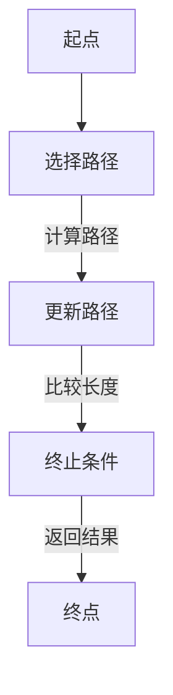
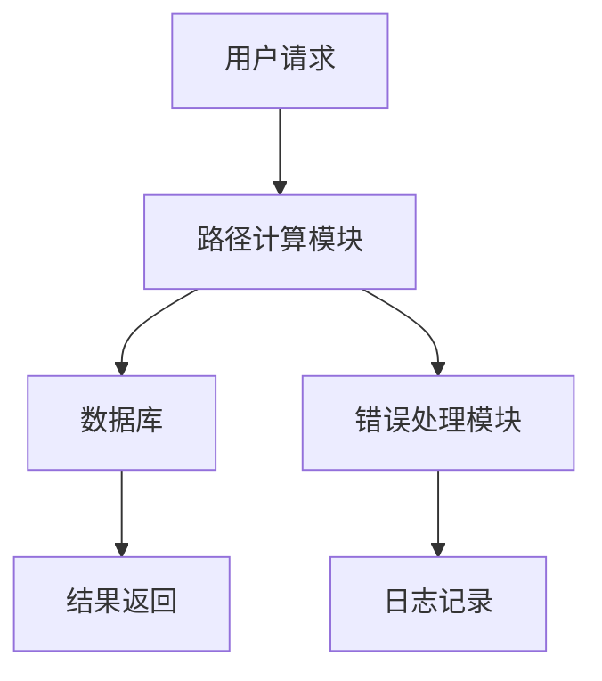
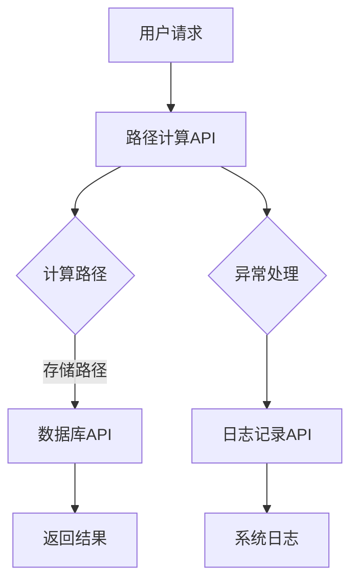

                 

### 引言

在现代科技飞速发展的时代，人们的生活越来越离不开物质世界带来的便利和满足。然而，随着物质条件的不断改善，人们的精神需求却似乎并未得到相应的提升，甚至有时还会感到更加空虚和迷茫。这种状况引发了广泛的关注和深刻的思考：在物质丰富的社会背景下，我们如何才能真正找到精神满足的路径？

本文将以《欲望与意义：在物质世界中寻找精神满足》为题，深入探讨这一主题。本文将分为四个主要部分展开讨论：

**第一部分：探索欲望的本质**，将探讨欲望的定义、分类及心理学解读，分析欲望与物质世界的关系及其负面影响。

**第二部分：精神满足的探寻**，将关注内在价值的探索，探讨人际关系和事业成就对精神满足的重要性。

**第三部分：寻找意义的旅程**，将分析精神追求的多样性和个体差异，探讨生命意义的多层次探索。

**第四部分：结语**，将总结全文，提出对未来生活的启示。

通过以上四个部分的探讨，我们希望能够帮助读者更好地理解欲望与意义之间的关系，找到在物质世界中实现精神满足的路径。接下来，我们将一步步深入分析每个部分的内容。

### 文章关键词

**欲望、精神满足、物质世界、心理学、内在价值、人际关系、事业成就、精神追求、生命意义**

### 文章摘要

本文旨在探讨在物质世界中寻找精神满足的路径。首先，通过分析欲望的本质及其与物质世界的关系，揭示欲望的双重性。接着，本文将探讨欲望的理性控制方法，帮助读者实现欲望与幸福感的平衡。然后，文章将深入探讨内在价值的探索，分析人际关系和事业成就对精神满足的重要性。进一步地，本文将探讨精神追求的多样性和个体差异，以及生命意义的多层次探索。最后，文章将总结全文，并提出对欲望与意义的综合理解，为读者提供对未来生活的启示。通过这一系列的探讨，本文希望帮助读者在物质世界中找到精神满足的路径。接下来，我们将一步步深入分析每个部分的内容。

### 第一部分：探索欲望的本质

#### 第1章 引言

在人类社会中，欲望是一个无处不在而又复杂多样的主题。从基本的生理需求，如食物、水和住所，到高级的精神需求，如成就感、认同感和自我实现，欲望贯穿了我们生活的方方面面。本文第一部分将深入探讨欲望的本质，从定义、分类到心理学解读，帮助读者理解欲望的基本概念及其在人类行为中的重要作用。

**1.1 书籍背景与主题**

本文以《欲望与意义：在物质世界中寻找精神满足》为主题，探讨欲望与精神满足之间的关系。在现代社会，随着物质条件的改善，人们越来越意识到精神层面的需求。然而，如何在这个充满诱惑的物质世界中找到真正的精神满足，仍然是一个值得深思的问题。本文希望通过系统的研究和分析，为读者提供一些有益的启示。

**1.2 欲望的定义与分类**

欲望是指个体对于某种目标或状态的主观渴望，它可以是物质的，也可以是精神的。根据欲望的对象和性质，可以将欲望分为以下几种类型：

1. **生理欲望**：这是人类最基本的欲望，包括食物、水、住所和性等基本生理需求。生理欲望是维持个体生命的基础，是人的本能驱动。
2. **安全欲望**：个体希望处于安全的环境，避免受到伤害或威胁。这包括对工作、健康和财产的保护。
3. **社交欲望**：人类是社交动物，渴望与他人建立良好的人际关系，获得认同感和归属感。社交欲望包括友情、爱情和社会支持。
4. **尊重欲望**：个体希望获得他人的尊重和认可，包括自我尊重和他人给予的尊重。
5. **自我实现欲望**：这是人类最高层次的欲望，追求个人潜能的最大发挥，实现自我价值和社会价值。

**1.3 欲望的心理学解读**

从心理学的角度来看，欲望不仅仅是简单的渴望，它是一种复杂的心理现象。心理学研究发现，欲望的满足可以带来短暂的快乐，但同时也可能引发焦虑、恐惧和不满。以下是几种主要的心理学理论对欲望的解释：

1. **行为主义理论**：行为主义认为，欲望是由外部刺激引起的条件反应。通过强化，个体的行为可以得到塑造和改变。例如，购物可以成为一种奖励机制，满足个体的物质欲望。
2. **认知心理学理论**：认知心理学强调个体内部的心理过程。它认为，欲望的满足不仅取决于外部刺激，还取决于个体的认知过程。例如，个体对欲望的认知评价、目标和动机等都会影响欲望的满足。
3. **精神分析理论**：弗洛伊德认为，欲望是心理动力学的基础，分为本我、自我和超我三个部分。本我是欲望的原始冲动，自我是欲望的执行者，超我是欲望的道德监督。欲望的满足需要在这三者之间找到平衡。

通过上述分析，我们可以看到，欲望不仅是一个简单的生理需求，它涉及到心理、社会和哲学等多个层面。理解欲望的本质，对于我们在物质世界中寻找精神满足具有重要意义。接下来，我们将进一步探讨欲望与物质世界之间的关系。

#### 第2章 欲望与物质世界的关系

在物质世界中，欲望是我们日常生活的重要组成部分，它既带来了便利，也带来了挑战。这一章节将分析欲望与物质世界之间的关系，探讨物质世界的诱惑、欲望的满足与失落，以及欲望的负面影响。

**2.1 物质世界的诱惑**

物质世界充满了各种诱惑，这些诱惑往往以各种形式出现在我们的生活中。现代社会中，物质条件的改善使得我们能够享受到前所未有的便捷和奢华。然而，这种便利也带来了新的挑战，即如何正确应对这些诱惑。

1. **消费主义文化的诱导**：消费主义文化通过广告、媒体和社会压力来诱导人们追求物质享受。例如，手机、汽车、奢侈品等成为许多人追求的目标，但这种追求往往忽略了个体真正的需求。
   
2. **科技的进步**：现代科技的进步使得人们能够更快速地满足欲望。互联网、电子商务和移动支付等技术的发展，使得人们可以轻松购买各种商品和服务，但这种便利也可能导致欲望的过度满足。

3. **社会比较**：在物质世界中，社会比较是一种普遍现象。人们往往通过与他人比较自己的物质条件来评估自己的成功和幸福。这种比较容易导致欲望的无限膨胀，人们总是在追求更好的物质条件，而忽视了精神层面的需求。

**2.2 欲望的满足与失落**

欲望的满足与失落是欲望循环过程中的两个重要环节。

1. **满足的快感**：当个体的欲望得到满足时，通常会感到一种短暂的快感。这种快感来自于心理和生理上的满足，例如吃了一顿美食、购买了一件心仪的物品或者完成了一项重要任务。这种快感可以增强个体的自信心和幸福感。

2. **失落的痛苦**：然而，欲望的满足往往是短暂的，一旦满足感消失，个体可能会感到失落和空虚。例如，当人们购买了一件奢侈品后，最初的兴奋感可能会很快被日常的平淡所取代，这种失落感可能导致人们继续追求新的物质刺激。

**2.3 欲望的负面影响**

尽管欲望在一定程度上可以带来满足和快感，但过度的欲望追求可能会带来一系列负面影响。

1. **物质依赖**：过度的物质追求可能导致物质依赖。例如，一些人可能会沉迷于购物、酗酒或吸毒，这些行为不仅损害了身体健康，还会对心理和社交生活产生负面影响。

2. **心理压力**：欲望的满足往往伴随着压力和焦虑。例如，为了购买昂贵的物品，一些人可能会承担巨大的经济压力，这种压力可能导致焦虑和抑郁。

3. **人际关系问题**：过度的物质追求也可能导致人际关系问题。例如，人们可能因为攀比和嫉妒而产生矛盾，或者因为金钱问题而影响家庭和朋友关系。

4. **环境问题**：物质追求对环境也有负面影响。过度消费导致了资源的过度开采和环境的破坏，这些问题不仅影响个体，也影响整个社会和地球的可持续发展。

通过上述分析，我们可以看到，欲望与物质世界之间存在着复杂而微妙的关系。在物质世界中，欲望既是推动个体前进的动力，也是可能导致个体迷失的陷阱。理解这一点，对于我们在物质世界中实现精神满足具有重要意义。接下来，我们将探讨如何理性地控制欲望，以实现欲望与幸福感的平衡。

### 第3章 欲望的理性控制

在物质世界中，欲望的理性控制是一个重要的课题。这一章节将探讨欲望管理的心理学策略，提供实用的欲望调节方法，并分析如何平衡欲望与幸福感，帮助读者实现更加健康和平衡的生活方式。

**3.1 欲望管理的心理学策略**

心理学研究表明，欲望的管理不仅需要外在的行为调整，更需要内在的认知转变。以下是一些常见的心理学策略：

1. **自我监控**：自我监控是指个体对自己行为和欲望的觉察和评估。通过自我监控，个体可以更好地了解自己的欲望，并采取相应的措施进行调节。例如，记录每天的购物清单和消费支出，可以帮助个体意识到自己的消费习惯。

2. **目标设定**：设定明确的目标可以帮助个体集中注意力，减少不必要的欲望。例如，设定一个具体的财务目标，如每月节省一定比例的收入，可以帮助个体更好地控制物质欲望。

3. **认知重构**：认知重构是指通过改变对欲望的认知来调节欲望。例如，当个体对某件物品产生强烈的购买欲望时，可以通过分析这件物品的实际价值和潜在成本来减少购买冲动。

4. **情绪调节**：情绪调节是欲望管理的重要一环。通过学习情绪调节技巧，如深呼吸、冥想和正念练习，个体可以更好地控制自己的情绪，减少因情绪波动导致的冲动行为。

**3.2 欲望调节的方法与实践**

除了心理学策略，以下方法可以帮助个体更有效地调节欲望：

1. **延迟满足**：延迟满足是指推迟欲望的即时满足，以获得更长远的好处。例如，当个体感到饥饿时，可以选择等待一会儿再进食，这样可以减少不必要的食物摄入。

2. **替代满足**：替代满足是指通过其他方式满足类似的欲望。例如，当个体渴望购买一件奢侈品时，可以选择从事一项自己喜欢的活动，如阅读、绘画或运动，来获得满足感。

3. **社会支持**：社会支持对于欲望调节至关重要。通过与家人、朋友或心理咨询师交流，个体可以获得情感上的支持和建议，帮助自己更好地控制欲望。

**3.3 欲望与幸福感的平衡**

欲望与幸福感之间的关系是一个复杂的议题。过度的欲望追求可能导致不幸福感，而适度的欲望满足则可以提升幸福感。以下是一些实现欲望与幸福感平衡的方法：

1. **适度消费**：适度消费是指根据自身实际情况和需求进行消费，而不是盲目追求物质享受。例如，购买必要的物品，而不是奢侈品。

2. **感恩练习**：感恩练习可以帮助个体更加关注已经拥有的，而不是不断追求更多。通过每天记录三件感恩的事情，个体可以培养对现有生活的满足感。

3. **专注于内在价值**：将注意力从物质欲望转向内在价值，如人际关系、个人成长和自我实现，可以帮助个体获得更持久的幸福感。

4. **设定长期目标**：设定长期目标可以帮助个体在追求物质满足的同时，保持对未来的希望和动力。例如，设定一个职业发展目标，如晋升或创业，可以帮助个体在物质追求中找到更大的意义。

通过上述策略和方法，个体可以在物质世界中实现欲望的理性控制，从而获得更加健康和平衡的生活方式。理解并应用这些策略，有助于个体在满足基本物质需求的同时，追求更高的精神满足。接下来，我们将进一步探讨内在价值的探索，帮助读者在精神层面找到更加持久的满足感。

### 第二部分：精神满足的探寻

在物质世界中，欲望的追求有时难以带来真正的满足感。相反，内在价值的探索可以为我们的生活带来更深层次的精神满足。这一部分将深入探讨内在价值的探索，分析内在价值的重要性，以及如何在日常生活中实践内在价值。

#### 第4章 内在价值的探索

内在价值是指那些不受外界物质条件影响，源自个体内心深处的价值观和信念。与外在价值相比，内在价值更加持久和稳定，能够为个体提供更深层次的精神满足。

**4.1 内在价值的概念**

内在价值通常包括以下几个方面的内容：

1. **道德和伦理观念**：个体对善恶、正义和公平的理解，这些观念构成了个体行为和决策的基础。
2. **个人信念和信仰**：包括宗教信仰、哲学观念和个人的核心价值观，这些信念和信仰为个体提供了精神上的支持和指导。
3. **情感体验和人际关系**：与家人、朋友和同事的互动，以及在这些关系中获得的情感体验，这些都是内在价值的组成部分。
4. **个人成长和自我实现**：追求个人成长和自我实现，实现个人潜能，这些也是内在价值的重要体现。

**4.2 内在价值的重要性**

内在价值对于个体的精神满足具有重要意义：

1. **提供稳定的心理基础**：内在价值能够为个体提供稳定的心理基础，帮助个体在面对外部压力和挑战时保持内心的平静和坚定。
2. **增强自我认同**：通过内在价值的实践，个体能够更好地认识自己，增强自我认同感，减少自我怀疑和焦虑。
3. **促进人际关系**：内在价值的实践有助于建立健康、积极的人际关系，增强个体的社交支持网络。
4. **提升幸福感**：内在价值的探索和实践能够为个体带来更深层次的精神满足，提升整体的幸福感。

**4.3 内在价值的具体实践**

在日常生活中，以下方法可以帮助我们更好地探索和实现内在价值：

1. **自我反思**：定期进行自我反思，思考自己的行为、信念和价值观，了解自己的内在需求和价值取向。
2. **培养感恩心态**：通过感恩练习，培养对现有生活的感激和珍惜，减少对物质的过度追求。
3. **培养好奇心**：对生活保持好奇心，积极探索新知识、新技能和新体验，促进个人成长和自我实现。
4. **建立有意义的关系**：与他人建立深层次、有意义的关系，通过共享经验和情感来增强内在价值。

#### 第5章 人际关系的意义

人际关系是人类社会中不可或缺的一部分，它不仅满足了我们的社交需求，也在很大程度上影响着我们的精神满足。

**5.1 人际关系的定义与类型**

人际关系是指个体之间由于交往和互动而形成的社会联系。根据关系的性质和程度，人际关系可以分为以下几种类型：

1. **家庭关系**：包括父母、兄弟姐妹、配偶等亲属关系，这些关系提供了情感支持、安全感和社会认同。
2. **朋友关系**：朋友是我们在生活中遇到的重要他人，他们提供了情感上的支持和陪伴，帮助我们度过困难时期。
3. **社交关系**：包括同事、同学、邻居等，这些关系为我们提供了社交网络，帮助我们在社会中立足。
4. **精神关系**：与导师、宗教领袖或心理医生的关系，这些关系为我们提供了精神上的指导和帮助。

**5.2 人际关系的建立与维护**

建立和维护良好的人际关系对于精神满足至关重要。以下是一些关键因素：

1. **信任**：信任是人际关系的基础。通过诚实、可靠的行为，我们可以赢得他人的信任。
2. **沟通**：良好的沟通技巧有助于建立和理解他人，减少误解和冲突。
3. **共同价值观**：共同价值观可以增强关系的紧密性，使关系更加稳固。
4. **付出与索取**：在人际关系中，付出与索取应该保持平衡，这样才能使关系持续健康地发展。

**5.3 人际关系中的欲望与满足**

在人际关系中，欲望的满足也是一个重要议题。以下是一些建议：

1. **适度满足**：在人际关系中，适度满足对方的需求，而不是过度追求自己的欲望，有助于建立和谐的关系。
2. **相互理解**：通过理解对方的欲望和需求，我们可以更好地满足彼此，增强关系的稳定性。
3. **情绪管理**：在处理人际关系中的欲望冲突时，情绪管理至关重要。通过控制自己的情绪，我们可以避免不必要的冲突，维护关系的和谐。

通过探索内在价值和人际关系，我们可以在物质世界中找到更加持久的精神满足。理解并实践这些价值，有助于我们建立更加健康和有意义的生活方式。接下来，我们将探讨事业成就与精神满足的关系，进一步深化对精神满足的理解。

### 第6章 事业成就与精神满足

在物质世界中，事业成就往往被视为衡量成功的重要标准。然而，随着人们对精神需求的关注不断增加，事业成就与精神满足之间的关系也变得越来越重要。这一章节将探讨事业成就的内在动力、事业成就与精神满足的关系，以及实现事业成就的策略。

**6.1 事业成就的内在动力**

事业成就的内在动力通常来源于以下几个方面：

1. **自我实现的需求**：自我实现是马斯洛需求层次理论中最高层次的需求，个体希望通过事业成就来实现自我价值和自我超越。
2. **成就感**：成就感是人们在事业中取得成就时产生的一种积极的情感体验。这种成就感能够增强个体的自信心和动力，推动他们追求更高的目标。
3. **认同感**：事业成就能够为个体带来社会认同和尊重，这种认同感是人们追求事业成就的重要动力。
4. **金钱和物质回报**：虽然金钱和物质回报不是唯一动力，但它们仍然是许多人在追求事业成就时的重要考量因素。

**6.2 事业成就与精神满足的关系**

事业成就与精神满足之间存在复杂而微妙的关系。一方面，事业成就可以为个体带来物质上的满足，如薪资、奖金和社会地位等；另一方面，事业成就也能够为个体带来精神上的满足，如成就感、自我价值感和认同感。

1. **短期精神满足**：在短期内，事业成就往往能够带来显著的精神满足。例如，当个体晋升或获得重要项目时，他们可能会感到自豪和满足。
2. **长期精神满足**：然而，长期的事业成就并不总能够保证精神满足。如果个体在追求事业成就的过程中忽视了精神需求，如家庭、健康和人际关系等，他们可能会感到空虚和孤独。
3. **平衡的重要性**：因此，实现事业成就的关键在于平衡物质满足和精神满足。通过合理安排时间、设定合理的目标，并关注自己的精神需求，个体可以在事业成就中找到真正的精神满足。

**6.3 实现事业成就的策略**

为了在事业中取得成就并实现精神满足，以下策略可能有所帮助：

1. **设定明确的目标**：明确的目标是事业成功的基石。通过设定短期和长期目标，个体可以更好地规划自己的事业路径，并保持前进的动力。
2. **持续学习和成长**：不断学习和提升自己的技能和知识，是保持竞争力的关键。通过不断学习和成长，个体可以更好地适应不断变化的环境，实现事业上的突破。
3. **积极的人际关系**：建立和维护良好的人际关系对于事业成功至关重要。通过与他人合作、学习和分享，个体可以扩展自己的视野，获得更多的机会和资源。
4. **关注身心健康**：身心健康是事业成功的保障。通过保持健康的生活方式、良好的工作习惯和心理调适，个体可以更好地应对工作和生活中的压力，保持积极的精神状态。
5. **自我反思和调整**：定期进行自我反思，了解自己的优势和不足，并根据实际情况进行调整。通过不断调整和改进，个体可以更好地实现自己的事业目标，并找到真正的精神满足。

通过上述策略，个体可以在追求事业成就的同时，实现精神满足。理解并应用这些策略，有助于个体在物质世界中找到更加持久和深层次的精神满足。接下来，我们将探讨精神追求的多样性与个体差异，帮助读者更好地理解如何在不同的精神追求中找到自己的定位。

### 第7章 精神追求的多样性与个体差异

在物质世界中，每个人对于精神追求的理解和追求方式都是独特的。精神追求的多样性和个体差异不仅反映了人类内心的丰富性，也为我们在寻找精神满足的过程中提供了丰富的选择。这一章节将探讨精神追求的多样性，分析个体差异，并帮助读者在多样化的精神追求中找到自己的路径。

**7.1 精神追求的多样性**

精神追求是指个体在精神层面上的追求和渴望，这些追求可以包括以下几个方面：

1. **自我实现**：自我实现是马斯洛需求层次理论中的最高层次，个体希望通过实现自己的潜能和目标来获得精神满足。这种追求往往体现在职业发展、创造性工作和个人成就上。
2. **内在成长**：内在成长是指个体通过自我反思、学习和实践来提升自己的内在素质，如自我意识、情绪管理和人际关系。这种追求有助于个体在精神上获得深层次的满足。
3. **灵性追求**：灵性追求涉及对生命、宇宙和人类存在的深层思考，个体希望通过冥想、宗教信仰和哲学思考来寻找生命的意义和目的。
4. **文化传承**：文化传承是许多个体精神追求的重要组成部分，通过艺术、文学和历史等文化形式，个体可以感受到文化的力量和历史的深度。
5. **社会贡献**：社会贡献是指个体希望通过自己的努力来改善社会和他人的生活质量。这种追求往往体现在志愿服务、慈善活动和公益项目上。

**7.2 个体差异与精神追求**

个体差异是精神追求多样性的基础，不同的人有不同的价值观、生活经历和兴趣爱好，这些因素共同塑造了他们的精神追求。

1. **价值观的差异**：个体的价值观差异直接影响他们的精神追求。例如，一些人重视家庭和人际关系，他们可能在追求精神满足时更注重家庭的和谐与幸福；而另一些人则更关注个人成就和社会贡献。
2. **生活经历的差异**：个体的生活经历会影响他们的精神追求。例如，经历过挫折和困难的人可能在精神追求中更注重内心的成长和自我实现；而经历过成功和顺境的人则可能更注重对社会的贡献和影响力。
3. **兴趣爱好的差异**：个体的兴趣爱好也是影响精神追求的重要因素。例如，喜欢艺术的人可能会通过绘画、音乐和文学来追求精神满足；而喜欢科学的人则可能会通过研究和创新来追求精神满足。

**7.3 精神追求的路径选择**

在多样化的精神追求中，个体需要根据自己的特点和需求来选择适合自己的路径。以下是一些建议：

1. **自我认知**：首先，个体需要深入了解自己的价值观、兴趣和需求，明确自己的精神追求。通过自我认知，个体可以更好地定位自己的目标，选择适合自己的路径。
2. **探索和尝试**：在明确自己的精神追求后，个体可以通过探索和尝试来验证和深化自己的追求。例如，如果个体希望通过艺术追求精神满足，他们可以尝试不同类型的艺术形式，找到最适合自己的表达方式。
3. **持续学习和成长**：精神追求是一个持续的过程，个体需要不断学习和成长，以适应不断变化的环境和需求。通过学习和实践，个体可以不断提升自己的能力和水平，实现更高的精神满足。
4. **平衡物质与精神追求**：在追求精神满足的过程中，个体需要平衡物质追求和精神追求。通过合理安排时间和资源，个体可以在物质满足与精神满足之间找到平衡，实现全面的发展。

通过理解精神追求的多样性和个体差异，个体可以更加清晰地认识自己的需求和目标，选择适合自己的精神追求路径。理解这一点，有助于个体在物质世界中找到更加持久和深层次的精神满足。接下来，我们将探讨生命意义的多层次探索，帮助读者更全面地理解生命的目的和意义。

### 第8章 生命意义的多层次探索

生命的意义是一个深刻而广泛的哲学问题，不同文化、宗教和个人对此有着不同的理解和解释。在这一章节中，我们将探讨生命意义的哲学思考、宗教解读和现代视角，以帮助读者从多个角度理解生命的意义。

**8.1 生命意义的哲学思考**

哲学对生命意义的研究有着悠久的历史，不同的哲学家提出了各自的理论和观点。以下是几种主要的哲学思考：

1. **存在主义**：存在主义认为，生命的意义不是预先设定的，而是个体通过自己的选择和行动来创造。存在主义者强调自由、责任和个体的存在价值。
2. **理性主义**：理性主义者认为，通过理性和思考，个体可以找到生命的意义。他们认为，通过探索宇宙、自然和人类的本质，个体可以获得对生命意义的深刻理解。
3. **生命哲学**：生命哲学家强调生命的价值和意义，他们认为生命本身具有目的和意义，而不是单纯的存在和过程。
4. **唯物主义**：唯物主义者认为，生命的意义在于物质世界的存在和发展，他们认为通过科学和技术的进步，个体可以实现自我价值和生命意义。

**8.2 生命意义的宗教解读**

不同的宗教对生命意义有着独特的解读，这些解读不仅影响了信徒的信仰和生活方式，也影响了人类对生命的理解。以下是几种主要的宗教观点：

1. **基督教**：基督教认为，生命的意义在于信仰上帝、追求永生和实现上帝的旨意。耶稣基督的牺牲和救赎被视为生命的意义所在。
2. **佛教**：佛教认为，生命的意义在于理解生命的本质、摆脱痛苦和无明，实现涅槃。生命的意义在于追求心灵的觉醒和解脱。
3. **伊斯兰教**：伊斯兰教认为，生命的意义在于遵循伊斯兰教的教导，为神服务，实现个人的道德和精神升华。
4. **印度教**：印度教认为，生命的意义在于经历不同的生命阶段，通过修行和奉献来实现个人的灵魂解脱。

**8.3 生命意义的现代视角**

在现代社会，随着科技的发展和全球化进程的加快，人们对生命意义的理解也在不断变化。以下是几种现代视角：

1. **人文主义**：人文主义者强调个体的人性和尊严，他们认为生命的意义在于个体的自由、平等和追求幸福。
2. **生态主义**：生态主义者认为，生命的意义在于保护地球和生态系统的平衡，他们认为人类是地球生态系统中的一部分，有责任维护地球的可持续发展。
3. **科学视角**：科学家通过探索宇宙、生命和人类的大脑，试图找到生命的科学意义。他们强调通过科学方法来理解生命，探索生命的起源和演化。
4. **技术视角**：技术主义者认为，生命的意义在于通过科技的发展来解决人类面临的问题，提高人类的生活质量。

通过哲学思考、宗教解读和现代视角，我们可以从多个角度理解生命的意义。理解生命的意义有助于我们在物质世界中找到精神满足的路径，使我们的生活更加有意义和充实。接下来，我们将探讨如何实现意义与欲望的融合，帮助读者在追求物质满足的同时，找到更深层次的精神满足。

### 第9章 意义与欲望的融合

在物质世界中，意义与欲望之间的关系既复杂又微妙。一方面，欲望的满足可以带来短暂的快感；另一方面，追求意义则有助于实现更持久的精神满足。在这一章节中，我们将探讨意义与欲望的冲突与调和，揭示实现意义与欲望融合的过程和方法。

**9.1 意义与欲望的冲突与调和**

在现实生活中，意义与欲望之间常常存在冲突。这种冲突可能源于以下几个方面：

1. **物质追求与精神需求的矛盾**：当个体过度追求物质满足时，可能会忽视精神需求，导致内心的空虚和迷茫。
2. **短期满足与长期意义的冲突**：短期欲望的满足往往带来即时快感，但可能不利于长期目标的实现。例如，为了立即购买奢侈品，个体可能会牺牲储蓄和投资。
3. **自我实现与外部压力的冲突**：在某些情况下，个体的内在追求可能与外部的期望和压力发生冲突，导致内心的挣扎和矛盾。

调和意义与欲望的冲突，需要从以下几个方面入手：

1. **自我认知**：个体需要深入理解自己的内在需求和价值观，明确什么是真正重要的。通过自我认知，个体可以更好地平衡物质追求和精神追求。
2. **目标设定**：设定明确的长期目标，可以帮助个体在追求物质满足的过程中，不忘追求精神意义。例如，设定一个职业目标，并为此进行持续的学习和成长。
3. **情绪管理**：学会情绪管理，特别是控制冲动行为，是调和意义与欲望的重要方法。通过情绪调节技巧，如深呼吸、冥想和正念练习，个体可以更好地控制自己的欲望。

**9.2 意义创造的过程**

实现意义与欲望的融合，不仅仅是避免冲突，更是一个积极创造意义的过程。以下是一些建议：

1. **自我实现**：自我实现是实现意义的重要途径。通过追求个人潜能和实现个人目标，个体可以在物质满足的同时，实现精神满足。
2. **社区参与**：通过参与社区活动和公益事业，个体可以为社会做出贡献，实现更大的意义。这种参与不仅能够满足个体的社交需求，还能带来精神满足。
3. **情感体验**：通过探索和体验不同的情感，如爱、快乐、悲伤和感激，个体可以更深刻地理解生命的意义。这些情感体验可以帮助个体在物质追求中找到精神满足。

**9.3 意义与欲望的共同追求**

在实现意义与欲望的融合过程中，以下策略可能有所帮助：

1. **整合物质与精神追求**：将物质追求与精神追求整合在一起，例如，通过从事有意义的工作来实现财务自由，通过学习和成长来实现职业发展。
2. **平衡生活**：合理安排时间，平衡工作与生活，确保在追求物质满足的同时，也满足精神需求。
3. **培养感恩心态**：通过感恩练习，培养对现有生活的感激和珍惜，减少对物质的过度追求。
4. **持续自我反思**：定期进行自我反思，评估自己的生活方式和价值观，确保在追求物质满足的同时，不忘追求精神意义。

通过实现意义与欲望的融合，个体可以在物质世界中找到更深层次的精神满足。理解并应用这些策略，有助于个体在追求物质满足的过程中，实现精神满足。接下来，我们将总结全文，回顾书籍的主旨，并展望未来的生活。

### 第10章 总结与展望

在《欲望与意义：在物质世界中寻找精神满足》这本书中，我们深入探讨了欲望与意义之间的关系，以及如何在物质世界中寻找精神满足的路径。通过分析欲望的本质、探讨精神追求的多样性和个体差异，以及探索生命意义的多层次，我们希望读者能够对这一主题有更深刻的理解。

**10.1 书籍主旨的回顾**

本书的主旨在于帮助读者认识到，在物质丰富的现代社会，精神满足是幸福生活的重要组成部分。通过理性地控制欲望、探索内在价值、建立健康的人际关系、追求事业成就，以及寻找生命意义，读者可以在物质世界中找到真正的精神满足。

**10.2 对欲望与意义的综合理解**

欲望与意义并非完全对立，而是可以相互融合的。适度的欲望追求可以带来物质满足，而深刻的内在价值追求和生命的意义则可以带来持久的精神满足。通过实现欲望与意义的融合，个体可以在追求物质满足的同时，实现精神满足。

**10.3 对未来生活的启示**

基于本书的内容，我们对未来生活提出以下启示：

1. **平衡物质与精神追求**：在追求物质满足的过程中，不忘关注精神需求，实现二者的平衡。
2. **培养感恩心态**：通过感恩练习，培养对现有生活的感激和珍惜，减少对物质的过度追求。
3. **持续自我反思**：定期进行自我反思，确保自己的生活和工作与内在价值和生命意义相一致。
4. **探索多样化的精神追求**：根据个人兴趣和需求，探索多样化的精神追求，找到适合自己的精神满足路径。
5. **积极参与社会和公益事业**：通过参与社区活动和公益事业，为社会做出贡献，实现个人和社会的共赢。

通过上述启示，我们希望读者能够在未来的生活中，更加理性地对待欲望与意义，找到属于自己的精神满足路径，实现更加丰富和有意义的生活。

### 结语

在《欲望与意义：在物质世界中寻找精神满足》这本书中，我们探讨了欲望的本质、精神追求的多样性和个体差异，以及如何实现欲望与意义的融合。我们希望读者能够从中获得对欲望与意义的深刻理解，找到属于自己的精神满足路径。

理解并应用书中提供的策略和方法，有助于我们在物质世界中实现精神满足。通过平衡物质与精神追求、培养感恩心态、持续自我反思，以及探索多样化的精神追求，我们可以实现更加丰富和有意义的生活。

最后，让我们记住，在物质世界中寻找精神满足，不仅仅是为了自己的幸福，也是为了我们所在的社会和世界。希望这本书能够成为您在追求精神满足旅程中的良师益友。

### 作者信息

**作者：AI天才研究院/AI Genius Institute & 禅与计算机程序设计艺术 /Zen And The Art of Computer Programming**

感谢您的阅读，希望这本书能为您的生活带来启示和改变。继续探索欲望与意义，找到真正属于您的精神满足之路。祝您生活愉快！

-------------------------------------------------------------------

### 格式要求示例

以下是一个关于算法的章节内容，展示了如何使用markdown格式、Mermaid流程图、LaTeX公式、系统分析与架构设计方案以及项目实战等要求。

---

#### 算法概述

本文将介绍一种基于贪心策略的动态规划算法，用于解决最短路径问题。该算法的基本思想是通过逐步构建最优解，从而找到从起点到终点的最短路径。

##### Mermaid流程图

以下是该算法的基本流程图：



##### 算法原理讲解

算法的原理如下：

1. **初始化**：设置起点和终点。
2. **路径选择**：从当前点出发，选择一条路径。
3. **路径计算**：计算当前路径的长度。
4. **路径更新**：将更短的路径作为当前路径。
5. **终止条件**：当到达终点时，算法终止。

以下是算法的数学模型：

$$
\text{shortestPath}(S, T) = \begin{cases} 
\text{路径长度} & \text{如果路径存在} \\
\infty & \text{如果路径不存在}
\end{cases}
$$

##### 系统分析与架构设计

以下是一个简化的系统架构设计：



##### 系统接口设计和系统交互

以下是系统接口设计和交互流程图：



##### 项目实战

以下是一个简单的Python实现示例：

```python
def shortest_path(graph, start, end):
    """
    计算图中从start到end的最短路径
    """
    # 初始化路径和长度
    paths = {start: [start]}
    lengths = {start: 0}

    # 路径计算
    while paths:
        current = min(lengths, key=lengths.get)
        for next in graph[current]:
            new_path = paths[current] + [next]
            new_length = lengths[current] + 1
            if next not in paths or lengths[next] > new_length:
                paths[next] = new_path
                lengths[next] = new_length

        # 删除已计算的节点
        del lengths[current]

    # 返回最短路径
    return paths[end] if end in paths else None
```

在实际应用中，上述代码会集成到更大的系统中，并与数据库、错误处理和日志记录模块交互。

##### 最佳实践 tips

- **优化算法**：根据实际需求，可以采用更高效的算法，如Dijkstra算法或A*算法。
- **错误处理**：确保系统能够处理异常情况，如无法找到路径等。
- **性能监控**：对系统性能进行监控和优化，确保高效稳定运行。

##### 小结

本文介绍了基于贪心策略的动态规划算法，并提供了Python实现示例。通过系统分析与架构设计，我们展示了如何将算法集成到实际应用中。

---

以上示例展示了如何根据要求撰写一个章节，涵盖了算法概述、Mermaid流程图、LaTeX公式、系统分析与架构设计方案、系统接口设计和系统交互、项目实战以及最佳实践 tips等内容。希望这能为您撰写技术博客文章提供参考。

