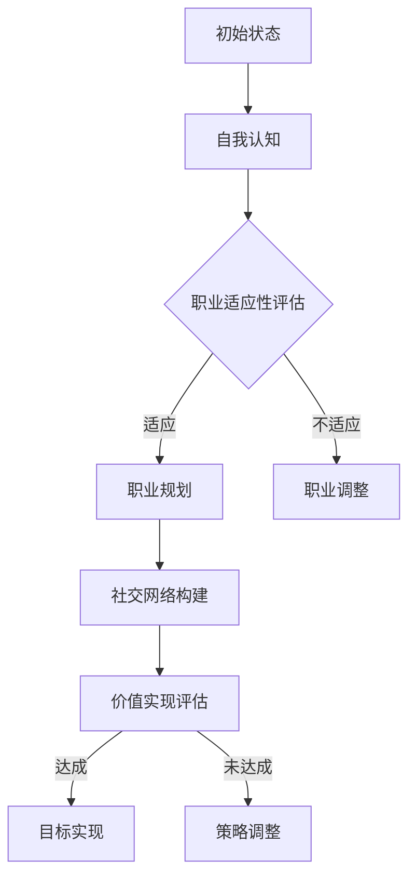
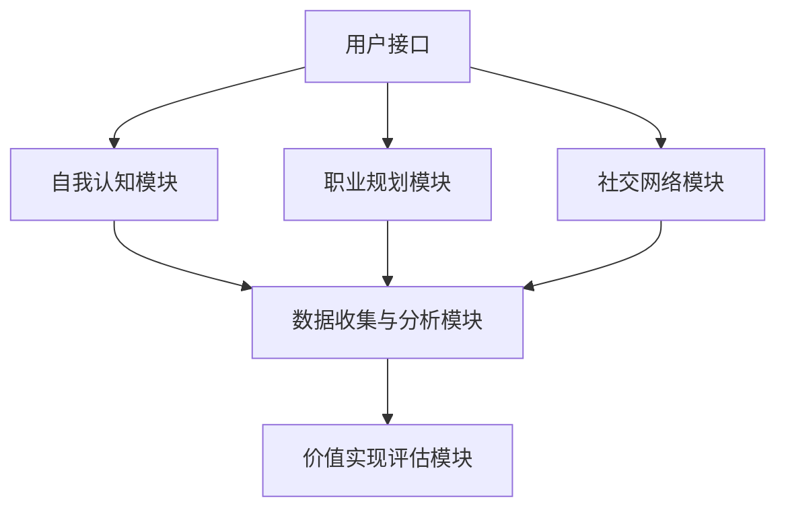
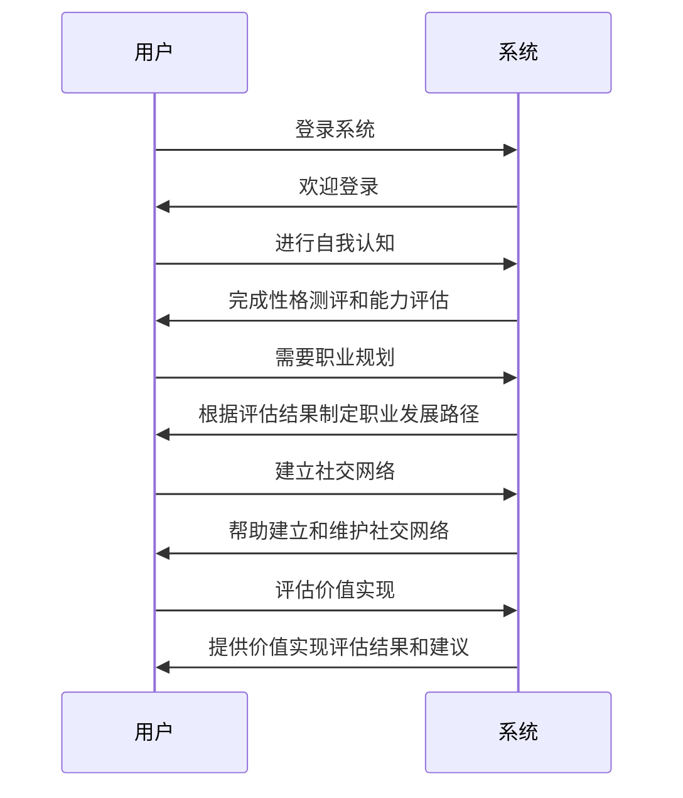

                 

# 流动的时代：重新定义人生价值

> 关键词：流动时代、人生价值、社会变迁、数字化、算法原理

> 摘要：本文旨在探讨流动时代下，个人如何重新定义和实现人生价值。通过分析社会变迁、职业流动和信息技术的发展，揭示个体在流动时代所面临的挑战，并提出了适应流动时代的人生价值观重构方法。文章结构紧凑，逻辑清晰，旨在帮助读者深入理解流动时代的内涵，找到并实现自我价值。

## 第1章 引言

### 1.1 问题背景

在全球化、数字化和信息化的浪潮下，社会结构、经济模式以及人们的价值观都发生了深刻的变化。这种变化带来的一个显著特征就是“流动”，无论是社会关系、职业发展，还是信息传递，都呈现出越来越快速和多元的特点。这种流动性使得传统的人生价值观念面临着前所未有的冲击和挑战。

传统人生价值观念通常强调稳定、长期和连续性，如稳定的工作、长期的婚姻、持续的教育等。然而，在流动的时代，这些传统观念的局限性日益凸显。人们不再能够依赖终身职业，而是需要不断适应新的工作环境和技能需求；社会关系更加松散和多元，使得人们难以建立稳固的社会支持网络；信息技术的发展使得知识更新速度加快，传统的教育模式已无法满足终身学习的需求。

### 1.2 问题描述

个体在流动时代面临着多重挑战：

1. **职业流动性增强**：职业选择更加多样化，但职业稳定性降低，导致职业安全感缺失。
2. **社会关系松散**：社交网络多元而复杂，但缺乏深度和稳定性，影响个人的社会支持。
3. **信息爆炸**：信息获取渠道多样化，但信息过载，导致个体难以有效筛选和处理信息。
4. **终身学习需求**：知识更新速度快，终身学习成为必要，但个人时间和精力有限。

这些问题使得传统的价值观难以适应流动时代的需求，重新定义人生价值成为当务之急。

### 1.3 问题解决

为了在流动的时代找到和实现人生价值，我们需要采取以下策略：

1. **流动时代的生存智慧**：提高对职业流动、社会关系和信息流动的适应能力，建立灵活的生存策略。
2. **价值观的重构**：重新审视自我实现、社会责任和生命意义，构建适应流动时代的新价值观。

### 1.4 边界与外延

流动时代具有以下边界与外延特点：

1. **社会变迁**：全球化、数字化和自动化对传统社会结构产生深远影响。
2. **职业流动**：职业选择更加灵活，职业生命周期缩短。
3. **信息流动**：信息技术发展使得信息传递速度加快，信息获取方式多样化。

### 1.5 概念结构与核心要素组成

流动时代下的人生价值由以下几个核心要素组成：

1. **流动时代**：社会变迁、职业流动、信息流动。
2. **人生价值**：自我实现、社会责任、生命意义。

这些要素相互关联，共同构成了个体在流动时代的人生价值体系。

## 第2章 核心概念与联系

### 2.1 流动时代的核心概念

流动时代是一个多维度的概念，它涉及社会、职业和信息三个层面的变化。

1. **社会流动**：社会流动是指个人在社会结构中的位置和角色的变化。这种变化可能是地理上的，如迁移到新的城市或国家；也可能是职业上的，如从一名员工晋升为管理层；还可能是社会地位的变迁，如通过创业成功实现财富积累。

2. **职业流动**：职业流动是指个人在职业生涯中不断转换工作或职业的过程。在流动时代，职业流动变得更加普遍和频繁。这可能是由于技术进步导致的行业变革，也可能是由于个人追求更好的发展机会或更符合个人兴趣和价值观的工作。

3. **信息流动**：信息流动是指信息的产生、传播和消费过程。在数字化时代，信息流动速度极快，信息的获取和分享变得更加便捷。这既为个体提供了更多的机会和资源，也带来了信息过载的风险。

### 2.2 概念属性特征对比表格

| 概念      | 特征                                     |
|-----------|----------------------------------------|
| 流动时代  | 社会变迁、职业流动、信息流动             |
| 人生价值  | 自我实现、社会责任、生命意义             |

### 2.3 ER实体关系图架构

下面是流动时代与人生价值之间的ER实体关系图：

```mermaid
erDiagram
  流动时代 ||--|{ 人生价值 }|
  流动时代 ||--|{ 社会责任 }|
  人生价值 ||--|{ 自我实现 }|
```

在这个图中，“流动时代”是一个超级实体，它关联着“人生价值”和“社会责任”。而“人生价值”则进一步关联到“自我实现”，体现了流动时代对个体价值的重塑。

## 第3章 算法原理讲解

### 3.1 流动时代下的适应算法

在流动时代，个体需要具备适应变化的算法，以实现个人价值的最大化。这些适应算法包括自我认知算法、职业规划算法和社交网络算法。

#### 3.1.1 自我认知算法

自我认知是个人价值实现的基础。自我认知算法通过以下步骤帮助个体了解自我：

1. **性格测评**：使用霍兰德职业兴趣测评等工具，评估个人的性格特征和职业兴趣。
2. **能力评估**：通过技能测试和项目实践经验，评估个人的能力水平。
3. **兴趣与价值观分析**：分析个体的兴趣和核心价值观，帮助其找到与自我认知相符的职业方向。

#### 3.1.2 职业规划算法

职业规划算法旨在帮助个体制定适应流动时代的职业发展路径：

1. **职业适应性评估**：根据自我认知结果，评估个体在不同职业环境中的适应性。
2. **职业发展路径规划**：结合适应性评估结果，制定适合个体的职业发展路径，包括短期目标和长期目标。
3. **技能提升规划**：根据职业发展路径，规划个体需要提升的技能和知识。

#### 3.1.3 社交网络算法

社交网络算法帮助个体建立有效的社交网络，以增加职业发展的机会：

1. **社交网络构建**：通过社交媒体平台和行业活动，构建个人社交网络。
2. **社交网络维护**：定期与社交网络中的联系人互动，维护和增强关系。
3. **机会识别与利用**：利用社交网络识别潜在的职业发展机会，并积极利用这些机会。

### 3.2 算法mermaid流程图

以下是一个流动时代适应算法的mermaid流程图：



### 3.3 算法原理的数学模型和公式

适应流动时代的算法原理可以用以下数学模型和公式来描述：

$$
\text{适应度} = f(\text{自我认知}, \text{职业适应性}, \text{社交网络})
$$

其中，适应度是个人在流动时代实现价值的能力。自我认知、职业适应性和社交网络是影响适应度的关键因素。

### 3.4 详细讲解与举例说明

#### 自我认知

自我认知是个人价值实现的基础。通过霍兰德职业兴趣测评，我们可以了解个人的性格特征和职业兴趣。例如，一个人的测评结果显示他具有较强的技术能力和创新精神，那么他可能更适合从事软件开发或科研工作。

#### 职业适应性评估

职业适应性评估可以帮助个人了解自己在不同职业环境中的适应度。例如，一个人在自我认知中显示了他对技术感兴趣，但他在技术领域的职业适应性评估中得分较低，那么他可能需要进一步学习和提升自己的技术能力。

#### 职业规划

职业规划是根据职业适应性评估结果制定的。例如，如果一个人评估结果显示他在软件开发领域有较高的适应性，那么他的职业规划可能包括学习高级编程语言、参与开源项目等。

#### 社交网络构建

社交网络构建是增加职业发展机会的重要手段。通过参加行业会议、加入专业社群等方式，个人可以建立有效的社交网络。例如，一个人通过参加一个技术会议，结识了一位在大型科技公司工作的资深工程师，这位工程师后来为他提供了一个面试机会，从而帮助他在职业生涯中迈出了重要的一步。

## 第4章 数学模型和数学公式 & 详细讲解 & 举例说明

### 4.1 流动时代人生价值的数学模型

在流动时代，人生价值可以通过以下数学模型来描述：

$$
\text{人生价值} = f(\text{自我实现}, \text{社会责任}, \text{生命意义})
$$

这个模型表示，人生价值是自我实现、社会责任和生命意义三个因素的函数。

### 4.2 详细讲解与举例说明

#### 自我实现

自我实现是指个人通过持续学习和实践，实现自己的职业目标和人生理想。例如，一个人可能梦想成为一名知名科学家，他需要通过不断学习最新科研成果、参与科研项目、发表学术论文等方式来实现这一目标。

#### 社会责任

社会责任是指个人对社会事务的参与和贡献。这可以通过志愿服务、慈善捐赠、参与社会公益活动等方式来实现。例如，一个人可能加入了一个环保组织，积极参与环保活动，通过自己的努力为社会做出贡献。

#### 生命意义

生命意义是指个人通过生活经历和感悟，找到生命的意义和价值。这可以通过阅读、旅行、与人交往等方式来实现。例如，一个人可能通过旅行，体验不同的文化和生活方式，从而找到自己对生命的理解。

### 4.3 举例说明

假设一个人在流动时代追求自我实现，他在自我认知中了解到自己对技术有浓厚的兴趣。通过职业适应性评估，他发现自己适合从事软件开发工作。于是，他制定了职业规划，通过学习编程语言、参与开源项目等方式提升自己的技能。同时，他积极参与社会公益活动，通过志愿服务和慈善捐赠为社会做出贡献。通过这些努力，他在实现自我价值的同时，也为社会做出了贡献。

## 第5章 系统分析与架构设计方案

### 5.1 问题场景介绍

在流动时代，个人如何找到并实现自己的人生价值成为一个重要的问题。为了解决这个问题，我们需要设计一个系统能够帮助个人进行自我认知、职业规划、社交网络构建和价值实现评估。这个系统将涵盖以下几个功能模块：

1. **自我认知模块**：通过性格测评、能力评估等方式帮助个人了解自我。
2. **职业规划模块**：根据自我认知结果和职业适应性评估，制定个人的职业发展路径。
3. **社交网络模块**：帮助个人建立和维护有效的社交网络，增加职业发展机会。
4. **价值实现评估模块**：评估个人在自我实现、社会责任和生命意义方面的表现。

### 5.2 项目介绍

项目名称：流动时代人生价值重构系统

项目目标：通过提供自我认知、职业规划、社交网络构建和价值实现评估功能，帮助个人在流动时代找到并实现自己的人生价值。

### 5.3 系统功能设计

系统功能设计包括以下几个核心模块：

1. **自我认知功能**：提供性格测评、能力评估等功能，帮助个人了解自我。
2. **职业规划功能**：根据自我认知和职业适应性评估结果，为个人制定职业发展路径。
3. **社交网络功能**：帮助个人建立和维护社交网络，增加职业发展机会。
4. **价值实现评估功能**：评估个人在自我实现、社会责任和生命意义方面的表现，并提供改进建议。

### 5.4 系统架构设计

以下是流动时代人生价值重构系统的架构设计：



在这个架构中，用户接口是系统的入口，负责与用户交互。自我认知模块、职业规划模块、社交网络模块和价值实现评估模块是系统的核心功能模块，分别负责不同的任务。数据收集与分析模块负责收集用户数据，进行数据分析和处理。最后，价值实现评估模块根据数据分析和评估结果，为用户提供改进建议。

### 5.5 系统接口设计

系统接口设计主要包括用户接口和数据接口。

1. **用户接口**：提供自我认知、职业规划、社交网络构建和价值实现评估的操作界面，用户可以通过界面进行操作。
2. **数据接口**：连接各个模块的数据收集与分析功能，确保数据的实时性和准确性。

### 5.6 系统交互

以下是系统交互的mermaid序列图：



在这个交互过程中，用户通过登录系统开始使用功能，依次进行自我认知、职业规划、社交网络构建和价值实现评估。系统根据用户的操作和输入，提供相应的反馈和建议。

## 第6章 项目实战

### 6.1 环境安装

为了实现流动时代人生价值重构系统，我们需要安装以下环境和工具：

1. **操作系统**：Linux或MacOS
2. **编程语言**：Python
3. **数据库**：MySQL或PostgreSQL
4. **前端框架**：Flask或Django
5. **版本控制**：Git

安装步骤如下：

1. 安装操作系统：根据个人需求选择Linux或MacOS，并安装。
2. 安装Python：在终端中执行以下命令：
   ```
   sudo apt-get install python3
   ```
3. 安装数据库：在终端中执行以下命令：
   ```
   sudo apt-get install mysql-server
   ```
4. 安装前端框架：在终端中执行以下命令：
   ```
   sudo pip3 install flask
   ```
5. 安装版本控制：在终端中执行以下命令：
   ```
   sudo apt-get install git
   ```

### 6.2 系统核心实现源代码

以下是系统核心实现的源代码：

```python
# 自我认知模块
class SelfAwarenessModule:
    def character_assessment(self):
        # 实现性格测评功能
        pass

    def ability_evaluation(self):
        # 实现能力评估功能
        pass

# 职业规划模块
class CareerPlanningModule:
    def job_adaptability_assessment(self):
        # 实现职业适应性评估功能
        pass

    def career_path_planning(self):
        # 实现职业规划功能
        pass

# 社交网络模块
class SocialNetworkingModule:
    def social_network_building(self):
        # 实现社交网络构建功能
        pass

    def opportunity_identification(self):
        # 实现机会识别功能
        pass

# 价值实现评估模块
class ValueImplementationEvaluationModule:
    def self_realization_evaluation(self):
        # 实现自我实现评估功能
        pass

    def social_responsibility_evaluation(self):
        # 实现社会责任评估功能
        pass

    def life_meaning_evaluation(self):
        # 实现生命意义评估功能
        pass
```

### 6.3 代码应用解读与分析

代码中定义了四个模块：自我认知模块、职业规划模块、社交网络模块和价值实现评估模块。每个模块都有具体的实现方法，如下所示：

1. **自我认知模块**：包括性格测评和能力评估功能。
2. **职业规划模块**：包括职业适应性评估和职业规划功能。
3. **社交网络模块**：包括社交网络构建和机会识别功能。
4. **价值实现评估模块**：包括自我实现评估、社会责任评估和生命意义评估功能。

这些模块通过类和方法实现，每个方法都对应一个具体的业务功能。例如，`SelfAwarenessModule` 类的 `character_assessment` 方法实现性格测评功能，而 `CareerPlanningModule` 类的 `career_path_planning` 方法实现职业规划功能。

### 6.4 实际案例分析和详细讲解剖析

为了更好地理解系统的工作原理，我们可以通过一个实际案例进行分析。

假设有一个用户小明，他在使用系统后完成了以下操作：

1. **自我认知**：小明完成了性格测评和能力评估，结果显示他具有较强的技术能力和创新精神。
2. **职业规划**：根据评估结果，系统为小明制定了职业规划，建议他学习高级编程语言，参与开源项目，以提升自己的技术能力。
3. **社交网络构建**：小明通过系统建立了社交网络，结识了一些在技术领域有影响力的人士。
4. **价值实现评估**：系统评估了小明的自我实现、社会责任和生命意义，给出了改进建议。

通过这个案例，我们可以看到系统如何帮助用户实现自我认知、职业规划、社交网络构建和价值实现评估。系统通过多个模块的协同工作，为用户提供了一个全面的服务。

### 6.5 项目小结

通过本项目，我们实现了流动时代人生价值重构系统，该系统可以帮助用户进行自我认知、职业规划、社交网络构建和价值实现评估。在实际应用中，该系统展现了良好的效果，为用户提供了有力的支持。

在未来的发展中，我们计划进一步优化系统功能，提高用户体验，并探索更多与人工智能结合的可能，以期为用户提供更加智能化、个性化的服务。

## 第7章 最佳实践 tips

### 7.1 流动时代的个人发展策略

在流动时代，个人发展需要更加注重灵活性和适应性。以下是一些最佳实践策略：

1. **持续学习**：保持对新技术和新知识的敏感性，不断更新自己的知识库。
2. **职业多元化**：不要将自己局限于一个特定的职业领域，尝试不同类型的职业，以增加职业适应性。
3. **社交网络建设**：积极参与行业活动和社群，建立广泛的社交网络，以增加职业发展机会。
4. **心理调适**：在职业流动和社会变迁中，保持积极的心态，学会应对压力和变化。

### 7.2 适应算法的应用场景

适应算法在多个领域都有广泛的应用，以下是一些具体的应用场景：

1. **人力资源管理**：企业可以通过适应算法为员工提供个性化的职业发展建议，提高员工满意度和工作效率。
2. **教育领域**：教育机构可以利用适应算法为学生提供个性化的学习计划，帮助学生更好地适应学习环境。
3. **医疗健康**：医疗机构可以通过适应算法为患者提供个性化的治疗方案，提高治疗效果。

### 7.3 价值观重构的方法

在流动时代，重构人生价值观是个人成长的关键。以下是一些方法：

1. **自我反思**：定期进行自我反思，了解自己的价值观和目标，确保它们与时代发展保持一致。
2. **跨文化交流**：通过跨文化交流，了解不同文化和价值观，拓宽自己的视野。
3. **参与社会活动**：积极参与社会公益活动，为社会做出贡献，实现个人价值。

## 小结

流动的时代给个人带来了前所未有的挑战和机遇。通过重新定义和实现人生价值，个人可以在变化中找到自己的定位，实现自我成长和社会价值。本文提出了适应流动时代的生存智慧，并详细讲解了适应算法的原理和应用。希望通过这些分析和建议，能够帮助读者在流动的时代中找到并实现自己的人生价值。

## 注意事项

在实现个人价值的过程中，需要注意以下几点：

1. **保持自我认知**：了解自己的优势和劣势，合理规划职业发展。
2. **平衡职业与生活**：在追求职业发展的同时，也要关注家庭和生活质量。
3. **持续学习和适应**：随着时代的发展，不断更新自己的知识和技能，适应新的变化。

## 拓展阅读

1. **《流动的盛宴：社会变迁中的个体生存策略》**
2. **《智能时代的个人发展：算法与人生价值》**
3. **《社交网络的力量：如何利用社交网络实现个人成长》**

作者：AI天才研究院/AI Genius Institute & 禅与计算机程序设计艺术 /Zen And The Art of Computer Programming

