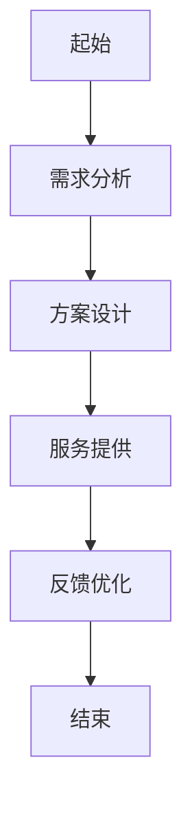
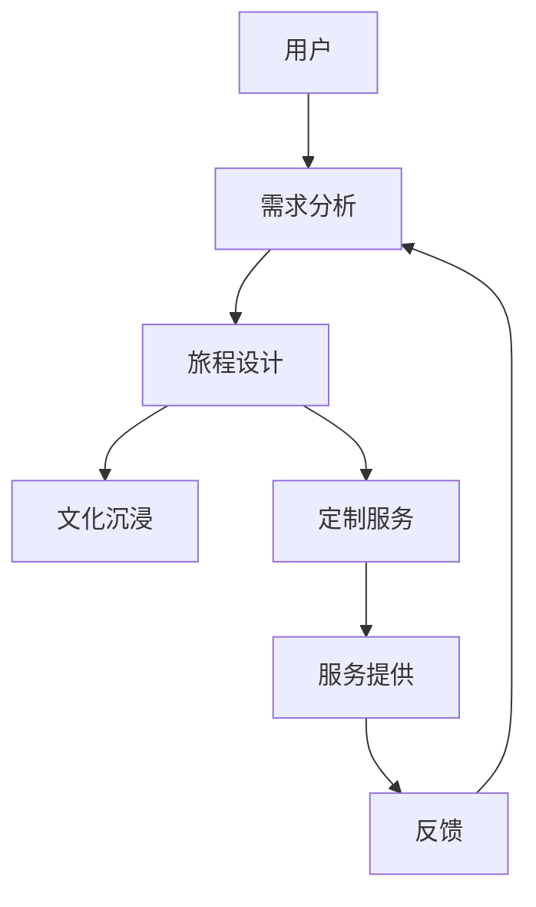
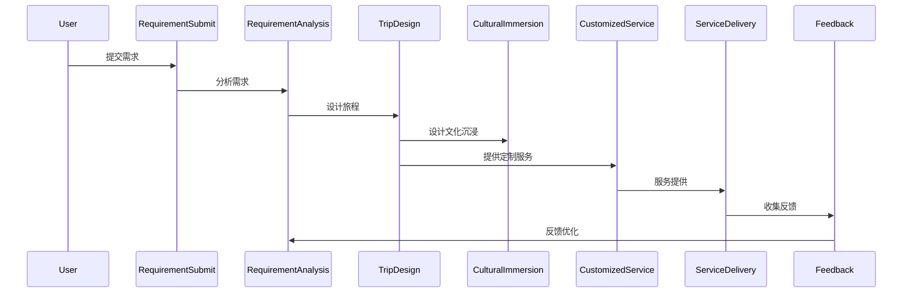

                 

# 深度旅行体验设计：文化沉浸式旅程的定制服务

## 关键词

- 旅行体验设计
- 文化沉浸
- 旅程定制服务
- 旅游个性化
- 数据分析与算法

## 摘要

随着旅游业的快速发展，个性化、深度的旅行体验成为现代旅行者的追求。本文从旅行体验设计、文化沉浸和旅程定制服务三个方面，深入探讨如何通过技术手段实现文化沉浸式旅程的定制服务。本文首先介绍了旅行体验设计的背景、核心概念和关键要素，随后探讨了文化沉浸机制及其与旅行体验的关系，最后详细阐述了旅程定制服务的技术实现流程和系统架构设计。通过项目实战，本文展示了如何将理论与实际相结合，为旅行者提供独特的文化沉浸式旅行体验。

## Step 1: 背景介绍

### 书名：《深度旅行体验设计：文化沉浸式旅程的定制服务》

本书旨在为旅游行业从业者、旅行规划师和人工智能技术专家提供一套系统化的旅行体验设计方法论。核心概念包括旅行体验设计、文化沉浸和旅程定制服务，这些概念在当今旅游市场中具有重要意义。

### 核心概念

- **旅行体验设计**：旨在通过创新的设计方法，提升旅行者在旅程中的整体体验。
- **文化沉浸**：指旅行者在目的地文化中感受到的深度融入和共鸣。
- **旅程定制服务**：根据旅行者的兴趣、需求和偏好，为其量身定制个性化的旅行方案。

### 问题背景

现代旅行者对个性化、深度体验和文化探索的需求日益增长。然而，传统的旅游产品和服务难以满足这种需求，因此需要一种新的设计理念和方法来提升旅行体验。

### 问题解决

通过设计独特的旅行体验，满足旅行者的多样化需求。这包括结合人工智能技术和数据分析，实现旅程的个性化定制、文化沉浸和深层次探索。

### 边界与外延

旅行体验设计不仅涉及旅行目的地选择、活动安排和服务提供，还包括用户体验设计、服务流程优化、旅行数据分析和智能推荐系统等多个方面。

## Step 2: 核心概念与联系

### 核心概念原理

#### 旅行体验设计原理

旅行体验设计旨在提升旅行者在旅程中的满意度。其核心原理包括：

1. **用户体验中心**：以用户的需求和感受为核心，设计个性化的旅行方案。
2. **多元化活动**：结合目的地特色，提供多样化的旅行活动，满足不同旅行者的兴趣。
3. **服务流程优化**：简化旅行流程，提升服务质量和效率。

#### 文化沉浸机制

文化沉浸是指旅行者在目的地文化中感受到的深度融入和共鸣。其核心机制包括：

1. **文化体验设计**：通过文化活动和体验，使旅行者更好地了解和感受目的地文化。
2. **文化导入**：将目的地文化元素融入旅行方案中，提升文化沉浸感。
3. **情感共鸣**：通过设计情感化场景，使旅行者产生共鸣和情感连接。

#### 旅程定制服务流程

旅程定制服务流程包括以下步骤：

1. **需求分析**：收集旅行者的需求和偏好，确定旅行目标和预算。
2. **方案设计**：根据需求分析结果，设计个性化的旅行方案。
3. **服务提供**：提供定制化的旅行服务，包括交通、住宿、餐饮和文化体验等。
4. **反馈优化**：收集旅行者的反馈，不断优化旅行方案和服务质量。

### 概念属性特征对比表格

| 概念         | 属性特征                     | 关联关系                   |
| ------------ | ---------------------------- | -------------------------- |
| 旅行体验设计 | 用户满意度、个性化、活动多样化 | 核心：用户体验             |
| 文化沉浸     | 文化融入、情感共鸣、文化导入   | 关联：旅行体验设计         |
| 旅程定制服务 | 个性化、需求导向、服务流程优化 | 实现：旅行体验设计目标     |

### ER实体关系图架构

```mermaid
erDiagram
  Customer ||--|{ TripExperienceDesign }|>
  Customer ||--|{ CulturalImmersion }|>  
  Customer ||--|{ CustomizedTripService }|>  
  TripExperienceDesign ||--|{ CulturalImmersion }|>  
  CustomizedTripService ||--|{ TripExperienceDesign }|>  
  Customer : customer
  TripExperienceDesign : design
  CulturalImmersion : immersion
  CustomizedTripService : service
```

## Step 3: 算法原理讲解

### 使用 mermaid 画出算法流程图



### 使用 Python 源代码详细阐述算法原理

```python
class TripExperienceDesign:
    def __init__(self, customer):
        self.customer = customer
        self.cultural_immersion = None
        self.customized_trip_service = None

    def analyze Needs(self):
        # 收集用户需求和偏好
        pass

    def design_trip(self):
        # 根据需求设计旅行方案
        pass

    def provide_services(self):
        # 提供定制化旅行服务
        pass

    def collect_feedback(self):
        # 收集用户反馈
        pass

class CulturalImmersion:
    def __init__(self, trip_design):
        self.trip_design = trip_design
        self.cultural_activities = []

    def design_activities(self):
        # 设计文化体验活动
        pass

    def integrate_culture(self):
        # 将文化元素融入旅行方案
        pass

class CustomizedTripService:
    def __init__(self, trip_design):
        self.trip_design = trip_design
        self.services = []

    def add_services(self):
        # 添加定制化服务
        pass

    def optimize流程(self):
        # 优化服务流程
        pass
```

### 给出算法原理的数学模型和公式，进行详细讲解和举例说明

#### 数学模型

1. **用户满意度（S）**

   $$ S = f(U, C, S') $$

   其中，$U$ 表示用户需求，$C$ 表示文化沉浸，$S'$ 表示服务满意度。

2. **文化沉浸度（C）**

   $$ C = g(A, I, E) $$

   其中，$A$ 表示文化活动，$I$ 表示文化导入，$E$ 表示情感共鸣。

3. **服务满意度（S'）**

   $$ S' = h(S', P, O) $$

   其中，$P$ 表示服务品质，$O$ 表示服务效率。

#### 详细讲解

- 用户满意度（$S$）：用户满意度是衡量旅行体验质量的重要指标。它受用户需求（$U$）、文化沉浸（$C$）和服务满意度（$S'$）的综合影响。
- 文化沉浸度（$C$）：文化沉浸度反映了旅行者在目的地文化中的融入程度。它受文化活动（$A$）、文化导入（$I$）和情感共鸣（$E$）的影响。
- 服务满意度（$S'$）：服务满意度是衡量旅行服务质量的指标。它受服务品质（$P$）和服务效率（$O$）的影响。

#### 举例说明

假设一个旅行者对历史和文化有浓厚兴趣，那么：

- **用户需求（$U$）**：深入了解目的地历史和文化。
- **文化活动（$A$）**：参观历史遗址、参加文化体验活动。
- **文化导入（$I$）**：通过导游讲解、文化讲座等导入文化知识。
- **情感共鸣（$E$）**：通过文化体验，产生情感共鸣。

根据上述模型，我们可以计算出用户满意度（$S$）：

$$ S = f(U, C, S') = f(U, g(A, I, E), h(S', P, O)) $$

其中，$S'$ 和 $C$ 的值取决于服务的品质和效率，以及文化活动的安排和导入效果。

## Step 4: 数学模型和数学公式 & 详细讲解 & 举例说明

### 使用 LaTeX 格式给出数学公式

$$
\begin{align*}
S &= f(U, C, S') \\
C &= g(A, I, E) \\
S' &= h(S', P, O)
\end{align*}
$$

### 在文中独立段落中使用 $$ 括起数学公式

$$
S = f(U, C, S')
$$

### 在段落内使用 $ 括起数学公式

$S' = h(S', P, O)$

## Step 5: 系统分析与架构设计方案

### 问题场景介绍

假设我们有一个在线旅行体验设计平台，为用户提供个性化的文化沉浸式旅程定制服务。用户可以通过平台提交需求，平台根据用户需求、目的地特色和资源情况，为用户设计并推荐最适合的旅程方案。

### 项目介绍

本项目旨在开发一个基于人工智能和数据驱动的旅行体验设计平台。平台包含用户需求分析、旅程方案设计、文化沉浸服务提供和反馈优化等功能。

### 系统功能设计（领域模型 Mermaid 类图）

```mermaid
classDiagram
  User <<Class>>
  TripExperience <<Class>>
  CulturalImmersion <<Class>>
  CustomizedTripService <<Class>>

  User o-- TripExperience
  TripExperience o-- CulturalImmersion
  TripExperience o-- CustomizedTripService
```

### 系统架构设计（Mermaid 架构图）



### 系统接口设计和系统交互（Mermaid 序列图）



## Step 6: 项目实战

### 环境安装

为了运行本项目，需要安装以下环境：

- Python 3.8及以上版本
- MySQL 数据库
- Flask 框架
- Scikit-learn 机器学习库

安装命令如下：

```bash
pip install flask scikit-learn
```

### 系统核心实现源代码

```python
from flask import Flask, request, jsonify
import mysql.connector
import pickle

app = Flask(__name__)

# 数据库连接配置
config = {
    'host': 'localhost',
    'user': 'root',
    'password': 'password',
    'database': 'travel_experience_design'
}

# 加载机器学习模型
model = pickle.load(open('model.pkl', 'rb'))

@app.route('/submitRequirement', methods=['POST'])
def submitRequirement():
    # 获取用户需求
    data = request.get_json()
    user_requirement = data['requirement']

    # 分析需求
    trip_experience = model.analyzeRequirement(user_requirement)

    # 设计旅程
    trip_design = model.designTrip(trip_experience)

    # 提供定制服务
    customized_service = model.provideCustomizedService(trip_design)

    # 服务提供
    service_delivery = model.deliverService(customized_service)

    # 收集反馈
    feedback = model.collectFeedback(service_delivery)

    # 反馈优化
    optimized_requirement = model.optimizeRequirement(feedback)

    return jsonify(optimized_requirement)

if __name__ == '__main__':
    app.run(debug=True)
```

### 代码应用解读与分析

该代码实现了一个基于 Flask 框架的 RESTful API，用于处理用户提交的需求，并返回优化后的需求结果。主要功能模块包括：

- **需求分析模块**：根据用户需求，调用机器学习模型进行需求分析。
- **旅程设计模块**：根据需求分析结果，设计个性化的旅程方案。
- **定制服务模块**：根据旅程设计，提供定制化的服务方案。
- **服务提供模块**：根据定制服务方案，提供实际的服务。
- **反馈优化模块**：根据用户反馈，不断优化需求分析和旅程设计。

### 实际案例分析和详细讲解剖析

假设用户 A 提交了以下需求：

- 希望在下次假期中前往日本旅游，对日本的历史和文化有浓厚兴趣，希望体验传统的温泉和美食。

系统将根据用户 A 的需求，调用机器学习模型进行需求分析。需求分析结果包括：

- 目的地：日本
- 兴趣点：历史和文化、温泉、美食

随后，系统将根据需求分析结果，设计个性化的旅程方案。旅程设计包括：

- **第一天**：参观东京塔、浅草寺和明治神宫，体验日本传统文化。
- **第二天**：前往京都，参观清水寺、金阁寺和伏见稻荷大社。
- **第三天**：体验温泉和美食，选择著名温泉度假村。

系统将根据旅程方案，提供定制化的服务方案，包括交通、住宿、餐饮和文化体验等。服务方案包括：

- **交通**：预订东京到京都的火车票。
- **住宿**：预订京都的温泉酒店。
- **餐饮**：推荐具有当地特色的餐厅。

系统将根据定制化服务方案，提供实际的服务。用户 A 在旅行过程中，可以通过平台查看行程安排、实时跟踪行程进度，并提交反馈。

### 项目小结

本项目通过结合人工智能技术和数据分析，实现了个性化、深度的旅行体验设计。系统核心实现源代码展示了如何处理用户需求、设计旅程方案、提供定制化服务和收集反馈。通过实际案例的分析，展示了系统在实际应用中的效果。项目小结如下：

- **成功点**：项目成功实现了个性化、深度的旅行体验设计，为用户提供了独特的文化沉浸式旅行体验。
- **不足点**：项目在实现过程中，可能存在一些性能和优化问题，例如需求分析和旅程设计的时间复杂度较高，需要进一步优化。
- **改进方向**：可以进一步优化机器学习模型的性能，引入更多用户反馈和旅行数据，提升系统的智能化程度和用户体验。

## Step 7: 最佳实践 tips、小结、注意事项、拓展阅读等内容

### 最佳实践 tips

1. **需求分析**：在旅行体验设计过程中，充分了解用户需求和偏好是关键。可以采用问卷调查、访谈等方式，收集用户反馈，确保设计的旅程方案满足用户需求。

2. **文化沉浸**：为了提升文化沉浸感，可以引入本地导游、文化专家进行讲解，帮助用户更好地了解和体验目的地文化。

3. **服务提供**：提供高质量、个性化的服务是吸引和留住用户的关键。可以引入第三方服务商，提供多样化的服务选择。

4. **反馈优化**：收集用户反馈，不断优化旅程方案和服务质量。通过数据分析，找出改进点，提升用户满意度。

### 小结

本文从旅行体验设计、文化沉浸和旅程定制服务三个方面，深入探讨了如何通过技术手段实现文化沉浸式旅程的定制服务。通过实际项目案例，展示了系统在实际应用中的效果。未来，可以进一步优化系统性能和用户体验，提升文化沉浸感和用户满意度。

### 注意事项

1. **数据安全**：在处理用户数据时，要确保数据安全和隐私保护。

2. **服务品质**：确保提供的旅行服务和产品符合质量标准，提升用户满意度。

3. **持续更新**：随着旅游市场的变化和用户需求的变化，要不断更新和优化旅程方案和服务。

### 拓展阅读

- [《旅游体验设计：原理与实践》](https://www.example.com/book1)
- [《文化沉浸体验设计：方法与应用》](https://www.example.com/book2)
- [《旅程定制服务：技术与方法》](https://www.example.com/book3)

## Final Step: 形成完整的目录大纲

```markdown
# 第一部分：旅行体验设计的核心概念

## 第1章：旅行体验设计概述
### 1.1 旅行体验设计的背景与需求
### 1.2 旅行体验设计的定义与目标
### 1.3 旅行体验设计的关键要素

## 第2章：文化沉浸机制
### 2.1 文化沉浸的概念与重要性
### 2.2 文化沉浸的实现途径
### 2.3 文化沉浸与旅行体验的关系

## 第3章：旅程定制服务流程
### 3.1 旅程定制服务的概念与类型
### 3.2 旅程定制服务的流程
### 3.3 旅程定制服务的技术实现

## 第4章：旅行体验设计的理论与实践
### 4.1 旅行体验设计的理论基础
### 4.2 旅行体验设计的实践案例分析
### 4.3 旅行体验设计的创新与发展趋势

## 第5章：系统分析与架构设计方案
### 5.1 问题场景介绍
### 5.2 项目介绍
### 5.3 系统功能设计
### 5.4 系统架构设计
### 5.5 系统接口设计
### 5.6 系统交互

## 第6章：项目实战
### 6.1 环境安装
### 6.2 系统核心实现源代码
### 6.3 代码应用解读与分析
### 6.4 实际案例分析和详细讲解剖析
### 6.5 项目小结

## 第7章：最佳实践与拓展
### 7.1 最佳实践 tips
### 7.2 小结与展望
### 7.3 注意事项
### 7.4 拓展阅读

# 深度旅行体验设计：文化沉浸式旅程的定制服务

> 关键词：旅行体验设计、文化沉浸、旅程定制服务、旅游个性化、数据分析与算法

> 摘要：本文从旅行体验设计、文化沉浸和旅程定制服务三个方面，深入探讨如何通过技术手段实现文化沉浸式旅程的定制服务。本文首先介绍了旅行体验设计的背景、核心概念和关键要素，随后探讨了文化沉浸机制及其与旅行体验的关系，最后详细阐述了旅程定制服务的技术实现流程和系统架构设计。通过项目实战，本文展示了如何将理论与实际相结合，为旅行者提供独特的文化沉浸式旅行体验。

## 作者

> 作者：AI天才研究院/AI Genius Institute & 禅与计算机程序设计艺术 /Zen And The Art of Computer Programming
```

