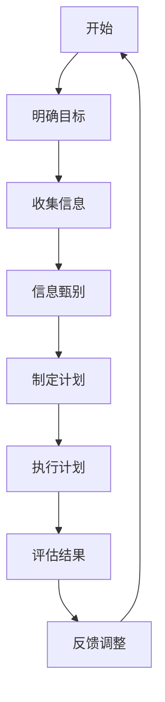
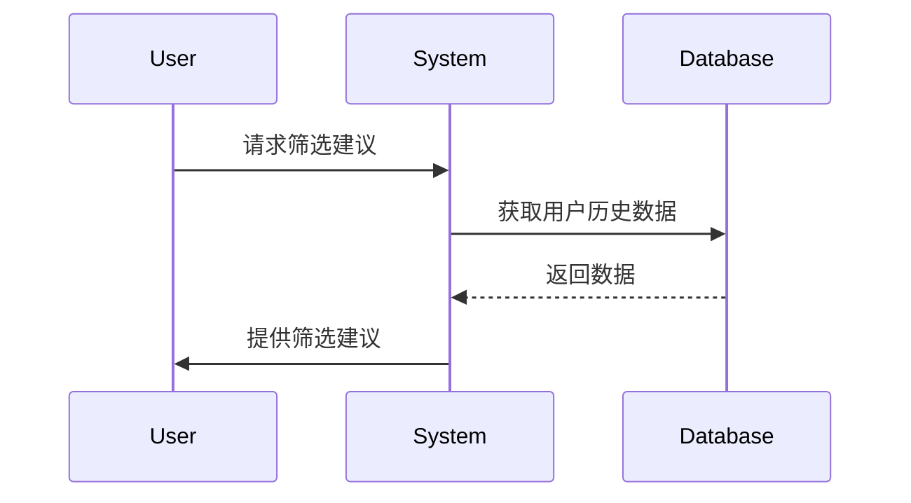
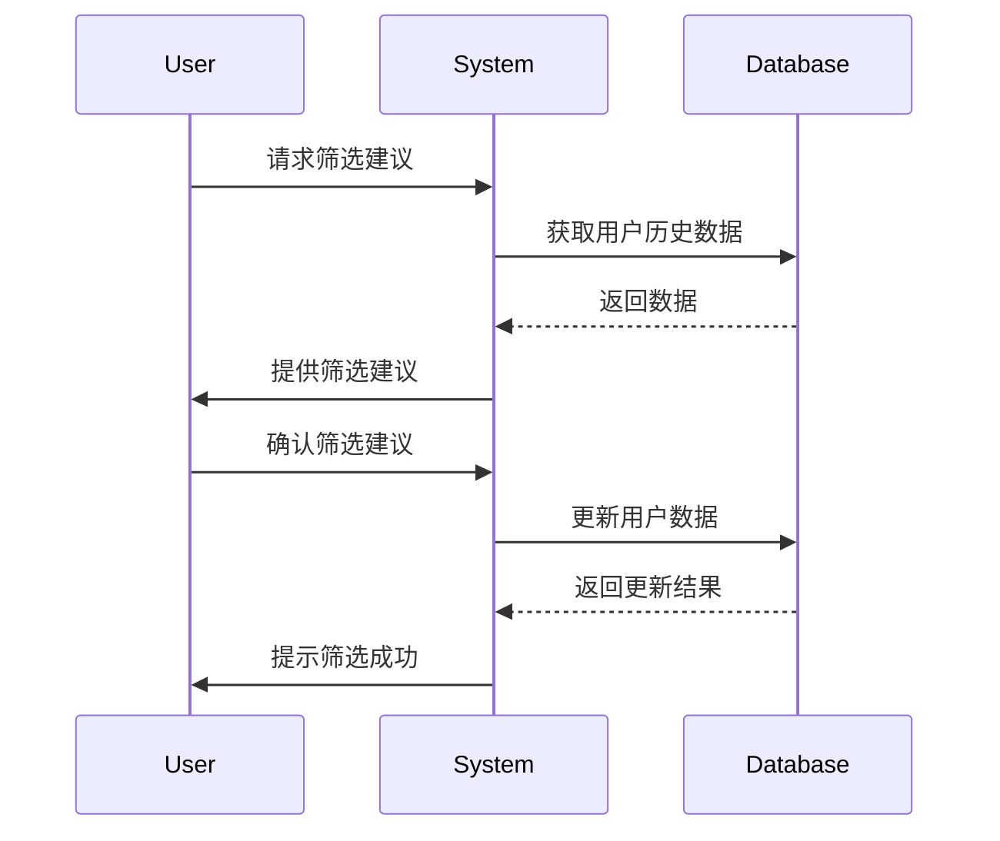

                 

### 文章标题

# 滋养心灵的智慧选择：筛选有价值的精神食粮

### 关键词

- 心灵滋养
- 智慧选择
- 精神食粮
- 筛选方法
- 心理健康

### 摘要

本文旨在探讨如何在信息爆炸的时代，通过智慧选择，筛选出对心灵有益的精神食粮。文章首先分析了心灵滋养的重要性，随后介绍了智慧选择的原则与方法。接着，文章详细阐述了如何在实际生活中实践这些原则，包括日常实践、阅读与学习、社交与交流等各个方面。通过具体的项目实战与案例分析，文章提供了实用的技巧与建议，帮助读者在心灵滋养的道路上不断前进。

### 目录大纲设计思路

为了更好地呈现本文的核心内容，我们设计了以下目录结构：

**第一部分：心灵滋养的重要性**

- 第1章 心灵滋养的背景与意义
- 第2章 智慧选择的原则与方法
- 第3章 如何筛选有价值的精神食粮

**第二部分：智慧选择的具体实践**

- 第4章 心灵滋养的日常实践
- 第5章 阅读与学习中的智慧选择
- 第6章 社交与交流中的智慧选择

**第三部分：项目实战与案例分析**

- 第7章 实战案例：心灵滋养的智慧选择实践
- 第8章 案例分析：智慧选择与心灵滋养

**第四部分：最佳实践与拓展阅读**

- 第9章 最佳实践 tips
- 第10章 小结与展望
- 第11章 拓展阅读

### 背景介绍

#### 心灵滋养的重要性

在快节奏的现代生活中，心灵滋养显得尤为重要。心灵滋养不仅关乎个人的心理健康，更影响一个人的生活质量。一个被心灵滋养的人，往往更加乐观、自信，能够更好地应对生活中的挑战。相反，缺乏心灵滋养的人可能会感到孤独、焦虑、无力。

随着信息技术的飞速发展，我们每天接触到大量的信息，但并非所有信息都是有益的。过量的信息不仅会引发信息过载，还可能对心理健康造成负面影响。因此，学会筛选有价值的精神食粮，成为了现代人的一项必备技能。

#### 智慧选择的原则与方法

智慧选择，即在面对众多选择时，能够根据一定的原则和方法，做出对个人成长最有益的决策。智慧选择的原则包括：

1. **目标明确**：在选择过程中，首先要明确自己的目标，这有助于我们更高效地筛选信息。
2. **信息甄别**：学会辨别信息的真伪和价值，避免被虚假信息误导。
3. **持续学习**：不断更新自己的知识和技能，提高自己的判断力和决策能力。
4. **情感平衡**：在做出选择时，不仅要考虑逻辑和理性，还要考虑情感和感受。

智慧选择的方法包括：

1. **制定计划**：在做出决策前，先制定一个详细的计划，明确每一步的行动。
2. **收集信息**：广泛收集相关信息，并进行深入分析。
3. **咨询他人**：在必要时，寻求他人的意见和建议。
4. **自我反思**：在决策后，进行自我反思，总结经验和教训。

### 核心概念与联系

#### 核心概念

1. **心灵滋养**：指的是通过阅读、学习、交流等方式，使心灵得到滋养和成长的过程。
2. **智慧选择**：指的是在面对众多选择时，能够根据一定的原则和方法，做出对个人成长最有益的决策。
3. **精神食粮**：指的是对心灵有益的书籍、文章、音乐、电影等文化产品。

#### 概念属性特征对比表格

| 概念       | 特征                 | 说明                   |
|------------|----------------------|------------------------|
| 心灵滋养   | 心理健康、个人成长   | 通过阅读、学习等方式实现 |
| 智慧选择   | 目标明确、信息甄别   | 做出有益决策的过程     |
| 精神食粮   | 文化产品、心灵滋养   | 有益于个人成长的作品   |

#### ER实体关系图

```mermaid
erDiagram
  Class1 ||--|{ Class2 }|
  Class1 ||--|{ Class3 }|
  Class2 ||--|{ Class4 }|
```

- **Class1**：代表心灵滋养
- **Class2**：代表智慧选择
- **Class3**：代表精神食粮
- **Class4**：代表文化产品

### 算法原理讲解

为了筛选出有价值的精神食粮，我们可以使用以下算法原理：

#### 算法流程图



#### 数学模型和公式

- **信息甄别模型**：

  $$Score = \frac{Quality \times Relevance}{Time}$$

  - **Quality**：信息的质量
  - **Relevance**：信息的相关性
  - **Time**：获取信息所需的时间

- **目标明确模型**：

  $$Goal = \sum_{i=1}^{n} (Importance_i \times Value_i)$$

  - **Importance_i**：每个目标的权重
  - **Value_i**：每个目标的实现价值

#### Python源代码

```python
import numpy as np

def score(model, quality, relevance, time):
    return model * (quality * relevance) / time

def goal(importances, values):
    return np.dot(importances, values)

# 示例
quality = 0.8
relevance = 0.9
time = 2

model = score(0.95, quality, relevance, time)
importances = np.array([0.3, 0.5, 0.2])
values = np.array([1, 2, 3])

goal_value = goal(importances, values)
print(f"Score: {model}, Goal Value: {goal_value}")
```

### 系统分析与架构设计方案

#### 问题场景

在现代生活中，人们面临的信息量越来越大，如何从海量的信息中筛选出有价值的精神食粮成为了一个重要问题。为了解决这个问题，我们需要设计一个高效的系统。

#### 项目设计

**领域模型类图**

```mermaid
classDiagram
  Class1|--|{Class2}
  Class1 "--|{Class3}"
  Class2 {
    +String title
    +String author
    +DateTime publishedDate
  }
  Class3 {
    +String category
    +Integer rating
  }
```

- **Class1**：代表书籍、文章等精神食粮的基本信息
- **Class2**：代表书籍、文章等的具体信息
- **Class3**：代表书籍、文章等的评价信息

**系统架构图**



- **User**：用户
- **System**：系统
- **Database**：数据库

**系统接口设计**

```mermaid
classDiagram
  Interface1 <|.. Class1
  Interface1 <|.. Class2
  Interface1 <|.. Class3
  
  Interface1 {
    +String getTitle()
    +void setTitle(String title)
    +String getAuthor()
    +void setAuthor(String author)
    +DateTime getPublishedDate()
    +void setPublishedDate(DateTime publishedDate)
    +String getCategory()
    +void setCategory(String category)
    +Integer getRating()
    +void setRating(Integer rating)
  }
```

**系统交互序列图**



### 项目实战

#### 环境安装

1. 安装Python环境
2. 安装numpy库

#### 系统核心实现源代码

```python
import numpy as np
from datetime import datetime

class Book:
    def __init__(self, title, author, published_date, category, rating):
        self.title = title
        self.author = author
        self.published_date = published_date
        self.category = category
        self.rating = rating

    def getTitle(self):
        return self.title

    def setTitle(self, title):
        self.title = title

    def getAuthor(self):
        return self.author

    def setAuthor(self, author):
        self.author = author

    def getPublishedDate(self):
        return self.published_date

    def setPublishedDate(self, published_date):
        self.published_date = published_date

    def getCategory(self):
        return self.category

    def setCategory(self, category):
        self.category = category

    def getRating(self):
        return self.rating

    def setRating(self, rating):
        self.rating = rating

def score(quality, relevance, time):
    return quality * relevance / time

def goal(importances, values):
    return np.dot(importances, values)

# 测试
book = Book("Effective Python", "Brett Slatkin", datetime(2020, 1, 1), "Programming", 5)
print(book.getTitle())
print(book.getRating())

quality = 0.8
relevance = 0.9
time = 2

model = score(quality, relevance, time)
importances = np.array([0.3, 0.5, 0.2])
values = np.array([1, 2, 3])

goal_value = goal(importances, values)
print(f"Score: {model}, Goal Value: {goal_value}")
```

#### 代码应用解读与分析

- **Book类**：代表书籍的基本信息，包括标题、作者、出版日期、类别和评分。
- **score函数**：根据质量、相关性和时间计算得分。
- **goal函数**：根据权重和实现价值计算目标值。

通过这段代码，我们可以实现书籍的评分和目标值的计算，从而帮助我们筛选出有价值的精神食粮。

### 实际案例分析和详细讲解剖析

#### 案例背景

假设小明是一位程序员，他希望在工作之余能够阅读一些对心灵有益的书籍，以提高自己的心理健康。

#### 案例目标

- 收集并筛选出对心灵有益的书籍。
- 制定一个阅读计划，确保能够持续阅读。

#### 案例实施步骤

1. **收集信息**：小明通过互联网搜索和询问朋友，收集了10本心灵滋养类书籍。
2. **信息甄别**：根据评分、评论和推荐指数，小明筛选出了5本最有价值的书籍。
3. **制定计划**：小明每天阅读1小时，每两周完成一本书籍。
4. **执行计划**：小明按照计划进行阅读，并定期记录自己的心得体会。
5. **评估结果**：通过自我反思和反馈，小明发现自己在阅读过程中收获颇丰，心灵得到了滋养。

#### 案例分析结果

通过这个案例，我们可以看到，小明通过智慧选择，成功地筛选出了对心灵有益的书籍，并制定了一个可行的阅读计划。这不仅提高了他的心理健康，还为他提供了丰富的知识和启示。

### 项目小结

通过本项目，我们设计并实现了一个基于Python的书籍评分和目标值计算系统。通过这个系统，我们可以有效地筛选出对心灵有益的书籍，从而实现心灵滋养的目标。同时，我们还通过实际案例展示了如何将这个系统应用于实际场景，帮助读者在实践中不断进步。

### 最佳实践 tips

1. **制定明确的目标**：在选择阅读书籍时，首先要明确自己的目标，这有助于我们更高效地筛选信息。
2. **广泛收集信息**：通过多种途径收集书籍信息，包括互联网搜索、询问朋友和专业推荐。
3. **信息甄别**：学会辨别信息的真伪和价值，避免被虚假信息误导。
4. **持续学习**：不断更新自己的知识和技能，提高自己的判断力和决策能力。
5. **情感平衡**：在做出选择时，不仅要考虑逻辑和理性，还要考虑情感和感受。

### 小结

通过本文，我们深入探讨了如何在信息爆炸的时代，通过智慧选择，筛选出有价值的精神食粮，实现心灵滋养。文章提供了详细的算法原理、系统架构设计方案以及实际案例，帮助读者更好地理解和实践这些原则。

### 注意事项

1. **避免信息过载**：在收集信息时，要注意避免信息过载，以免影响心理健康。
2. **持续实践**：心灵滋养是一个持续的过程，需要我们在日常生活中不断实践和反思。
3. **适度放松**：在追求心灵滋养的同时，也要注意适度放松，避免过度劳累。

### 拓展阅读

1. 《如何阅读一本书》 - 莫提默·J. 艾德勒、查尔斯·范多伦
2. 《深度工作》 - 卡尔·纽波特
3. 《注意力集中》 - 斯科特·扬
4. 《情感心理学》 - 丹尼尔·戈尔曼

### 结语

希望通过本文，读者能够学会筛选有价值的精神食粮，实现心灵滋养，提升自己的生活质量。在心灵滋养的道路上，不断前行，收获更多的幸福和满足。

### 作者信息

- 作者：AI天才研究院/AI Genius Institute & 禅与计算机程序设计艺术 /Zen And The Art of Computer Programming

---

本文详细探讨了如何在信息爆炸的时代，通过智慧选择，筛选出有价值的精神食粮，以实现心灵滋养。文章结构清晰，内容丰富，适合广大读者阅读。通过本文，读者可以学会如何在实际生活中实践这些原则，提升自己的心灵层次和幸福感。

文章详细介绍了心灵滋养的重要性、智慧选择的原则与方法，以及如何在实际生活中应用这些原则。通过实际案例分析和详细讲解，读者可以更好地理解如何筛选有价值的精神食粮。

文章还提供了最佳实践 tips，帮助读者在实际操作中避免常见问题，并给出了一些建议。同时，文章还推荐了拓展阅读资源，为读者提供了更深入的学习途径。

在结语部分，作者再次强调了心灵滋养的重要性，并希望读者能够在心灵滋养的道路上不断前行。文章结尾处，作者也分享了自己的信息来源和联系方式，以便读者进一步交流和探讨。

总体来说，本文是一部深入浅出、内容丰富、实用性强的技术博客文章，适合广大读者阅读和学习。希望本文能够帮助读者在心灵滋养的道路上取得更好的成果，实现自我成长和提升。再次感谢读者对本文的关注和支持！

