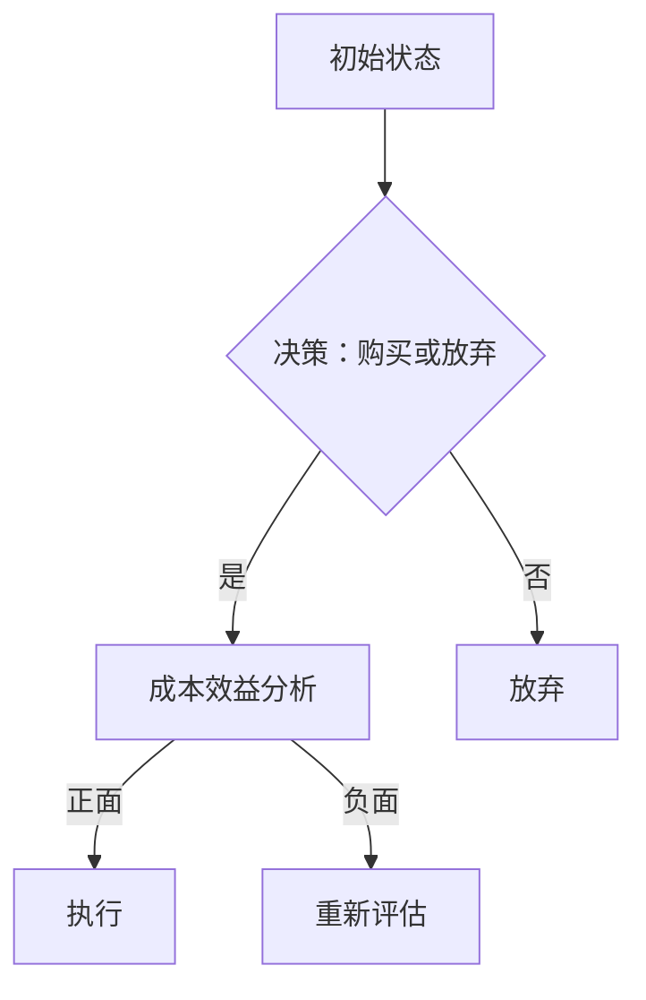

                 

# 滋养心灵的智慧选择：精神食粮的筛选

> 关键词：智慧选择、精神食粮、心理学、社会学、数学模型、实践应用

> 摘要：本文深入探讨了智慧选择在滋养心灵和精神成长中的重要性。通过心理学、社会学和数学模型的多角度分析，文章揭示了智慧选择的基本原则和方法，并提供了实际案例和应用策略，帮助读者在日常生活中做出更明智的选择。

## 目录大纲设计思路

设计《滋养心灵的智慧选择：精神食粮的筛选》的目录大纲，首先需要明确主题和目标。本书的核心主题围绕智慧选择与精神滋养，旨在帮助读者理解如何通过智慧选择来提升个人心灵层次和幸福感。具体设计步骤如下：

### 明确主题和目标

- **主题**：智慧选择与精神食粮
- **目标**：帮助读者掌握智慧选择的基本原则，学会在日常生活中应用这些原则，从而提升生活质量。

### 构建结构框架

目录框架将包括以下部分：

1. **引言**：介绍智慧选择的重要性。
2. **核心概念**：解释智慧选择的定义、原则和类型。
3. **理论基础**：分析心理学、社会学和数学模型对智慧选择的影响。
4. **实践应用**：提供智慧选择的方法和实践技巧。
5. **应用领域**：探讨智慧选择在不同领域（如生活、工作、教育）中的应用。
6. **案例分析**：通过实际案例分析智慧选择的过程。
7. **最佳实践**：总结智慧选择的最佳实践案例。

### 细化章节内容

- **背景介绍**：介绍选择智慧在现代社会的重要性，精神食粮对个人成长的作用。
- **核心概念**：详细解释智慧选择的定义、原则和类型。
- **概念属性特征对比表格**：通过表格形式对比不同类型的智慧选择。
- **ER实体关系图架构**：使用Mermaid绘制智慧选择相关的实体关系图。
- **理论基础**：介绍心理学、社会学和数学模型对智慧选择的影响。
- **实践应用**：提供具体的智慧选择方法和实践技巧。
- **应用领域**：讨论智慧选择在生活、工作和教育中的应用。
- **案例分析**：分析智慧选择在实际情境中的应用。

### 平衡章节数量

为确保内容的完整性和连贯性，目录将包含至少7章，每章涵盖主要话题，并保持章节之间的逻辑衔接。

### 包括关键要素

- **核心概念解释**：定义和解释智慧选择的基本概念。
- **原理阐述**：分析心理学、社会学和数学模型对智慧选择的影响。
- **算法讲解**：使用Python代码和Mermaid流程图展示智慧选择的数学模型。
- **案例分析**：通过实际案例展示智慧选择的应用。
- **实践指导**：提供具体的实践技巧和应用策略。

通过以上设计思路，本文将帮助读者深入理解智慧选择的重要性，学会如何在日常生活中应用这些原则，从而实现心灵滋养和成长。接下来，我们将逐步展开对每个章节的详细讨论。

----------------------------------------------------------------

## 第1章 问题背景与引言

### 1.1 问题背景

在现代社会，智慧选择已经成为人们日常生活中不可或缺的一部分。随着信息爆炸和全球化的加剧，我们每天都会面对大量决策，从选择朋友、职业到消费、投资等，每一个决策都可能对我们的生活质量产生深远影响。然而，如何在众多选择中做出明智的决策，成为一个亟待解决的问题。

智慧选择的重要性不仅体现在个人层面，也对社会产生深远的影响。一个社会若能普遍运用智慧选择原则，将有助于提高整体生活质量，减少不必要的冲突和资源浪费，促进社会的和谐发展。因此，探讨智慧选择的本质、原则和方法，对于个人和社会都具有重要的现实意义。

### 1.2 问题描述

在日常生活中，人们常常面临各种选择困境，这些问题可以归纳为以下几个方面：

1. **决策信息不足**：在面临重要决策时，常常缺乏足够的信息来支持决策，导致犹豫不决或做出错误的选择。
2. **情绪干扰**：情绪因素往往会影响决策过程，使得决策者难以保持理性，从而做出不理智的选择。
3. **选择过多**：面对过多的选择时，人们可能会出现选择困难症，难以做出决定。
4. **权衡利弊**：在决策过程中，需要权衡各种因素的利益和损失，这本身就是一个复杂的问题。

这些选择困境不仅影响个人的生活质量，还可能对职业发展、人际关系等产生负面影响。因此，有必要深入探讨如何通过智慧选择来解决这些问题。

### 1.3 问题解决

为了解决上述选择困境，我们可以从以下几个方面着手：

1. **信息收集与评估**：在做出决策之前，充分收集相关信息，并进行全面评估，以避免因信息不足导致的盲目决策。
2. **情绪管理**：学习情绪管理技巧，保持决策过程中的理性思维，避免情绪干扰。
3. **决策工具和方法**：运用各种决策工具和方法，如决策树、SWOT分析等，帮助理清思路，做出更加明智的选择。
4. **减少选择数量**：通过筛选和排除不重要的选项，减少选择数量，从而降低选择困难症的影响。

### 1.4 边界与外延

智慧选择的讨论范围主要涵盖以下几个方面：

1. **个人选择**：涉及个人生活中的各种决策，如职业选择、消费决策、人际关系等。
2. **社会选择**：探讨社会层面的决策，如政策制定、公共项目投资等。
3. **伦理选择**：涉及道德和伦理层面的决策，如道德困境、社会责任等。

同时，智慧选择不仅仅局限于传统意义上的决策，还包括如何在不确定性环境中进行合理预测和适应。

通过以上讨论，我们可以看出，智慧选择在个人成长和社会发展中具有至关重要的地位。接下来，我们将进一步探讨智慧选择的核心概念和理论基础，为解决选择困境提供更加深入的指导。

----------------------------------------------------------------

## 第2章 核心概念与联系

### 2.1 核心概念

在本章中，我们将详细探讨智慧选择的几个核心概念，这些概念构成了智慧选择理论的基础。以下是几个关键概念：

1. **智慧选择**：智慧选择是指个体在面对多个选项时，通过理性分析和判断，选择出最优或次优选项的过程。它强调在决策过程中保持理性、客观和全面性。
2. **信息收集与评估**：信息收集与评估是智慧选择的前提条件，包括收集与决策相关的各种信息，并对这些信息进行评估和分析，以便为决策提供依据。
3. **情绪管理**：情绪管理是智慧选择的一个重要方面，指在决策过程中，通过调节和控制情绪，保持理性思考，避免情绪干扰。
4. **决策工具和方法**：决策工具和方法是辅助决策的重要手段，包括决策树、SWOT分析、成本效益分析等，这些工具和方法可以帮助决策者理清思路，做出更明智的选择。
5. **选择困境**：选择困境是指在决策过程中，由于信息不足、情绪干扰、选择过多等原因，导致决策者难以做出明确选择的局面。

### 2.2 概念属性特征对比表格

为了更好地理解上述核心概念，我们可以通过一个对比表格来展示它们的属性特征。以下是一个简化的对比表格：

| 核心概念       | 属性特征                                                   | 应用场景                                                     |
| -------------- | ---------------------------------------------------------- | ------------------------------------------------------------ |
| 智慧选择       | 理性分析、客观判断、全面性                               | 个人生活决策、职业选择、投资决策等                           |
| 信息收集与评估 | 全面性、准确性、及时性                                   | 任何涉及决策的情境，如项目评估、市场调研等                   |
| 情绪管理       | 理性思维、情绪调节、情感稳定                             | 决策过程中的情绪控制、压力管理、应对挫折等                   |
| 决策工具和方法 | 清晰性、系统性、实用性                                   | 职业规划、投资决策、项目管理等                               |
| 选择困境       | 信息不足、情绪干扰、选择过多                             | 面对多个选项时的犹豫不决、难以做出决策的情境                 |

### 2.3 ER实体关系图架构

为了更直观地展示智慧选择中各个核心概念之间的关系，我们可以使用Mermaid绘制一个ER（实体关系）图。以下是使用Mermaid绘制的ER图示例：

```mermaid
erDiagram
    User ||--|{ Decision }|
    User ||--|{ Information }|
    User ||--|{ Emotion }|
    User ||--|{ Method }|
    User ||--|{ Dilemma }|
```

在上面的ER图中，"User"（用户）是中心实体，与其他实体（Decision、Information、Emotion、Method、Dilemma）之间存在关联关系。这个图展示了智慧选择中各个核心概念如何相互作用，共同影响决策过程。

通过上述核心概念的详细解释和对比表格，以及ER实体关系图的直观展示，我们可以更好地理解智慧选择的基本概念及其内在联系。接下来，我们将进一步探讨智慧选择的理论基础，深入分析心理学、社会学和数学模型对智慧选择的影响。

----------------------------------------------------------------

## 第3章 智慧选择的理论基础

### 3.1 心理学原理

心理学是研究人类行为和心理过程的科学，它与智慧选择密切相关。以下是几个与智慧选择相关的心理学原理：

#### 决策心理学

1. **有限理性**：在决策过程中，人类并不是完全理性的，而是受到认知局限和信息处理的限制。这种有限理性会导致人们在面对复杂决策时，难以找到最优解，而往往选择次优解。
   
2. **锚定效应**：人们在决策过程中，会受到最初信息（锚点）的影响，过分依赖这些信息，导致后续的判断和选择出现偏差。

3. **代表性启发**：人们倾向于根据事物的典型性或代表性来进行判断，而忽视相关概率信息。这种启发法可能导致决策者选择不符合实际概率的选项。

#### 情绪心理学

1. **情绪调节**：情绪在决策过程中起着重要作用。情绪调节能力越强，决策者越能保持理性，避免情绪对决策的干扰。

2. **情绪记忆**：情绪体验会影响记忆，积极情绪增强记忆，而消极情绪则减弱记忆。这种情绪记忆效应会影响人们未来的决策。

3. **情感认知**：情感与认知相互影响，情感状态可以改变人们对信息的处理方式。例如，乐观情绪可能促使人们更愿意接受风险，而悲观情绪则导致对风险的规避。

### 3.2 社会学视角

社会学视角关注社会环境对个人决策的影响。以下是一些社会学原理，它们对智慧选择有重要启示：

1. **社会认同**：人们倾向于做出与社会期望一致的选择，以获得社会认同感。这种社会认同效应会影响个体的决策，使其更倾向于选择那些被社会普遍认可的选择。

2. **社会规范**：社会规范是指社会对成员行为的要求和期望。遵守社会规范是个人在社会中生存和发展的必要条件，这会影响个人的决策过程。

3. **群体行为**：群体行为对个体决策有显著影响。群体成员之间的相互影响可能导致个体做出不同于独立决策时的选择。这种现象被称为群体思维。

### 3.3 智慧选择的数学模型

智慧选择不仅仅是心理和情感上的问题，还可以通过数学模型来分析和优化。以下是一些常用的数学模型：

1. **期望效用理论**：期望效用理论是一种概率性决策模型，它通过计算各选项的期望效用，帮助决策者选择具有最大期望效用的选项。期望效用（UE）可以通过以下公式计算：

   $$ UE(A) = \sum_{i} p_i \cdot u_i $$
   
   其中，$p_i$ 是选项 $i$ 发生的概率，$u_i$ 是选项 $i$ 的效用值。

2. **成本效益分析**：成本效益分析（CBA）是评估项目或决策成本和效益的一种方法。它通过比较总成本和总效益，判断项目是否值得进行。成本效益分析可以通过以下公式表示：

   $$ CBA = \frac{总效益}{总成本} $$
   
   若 $CBA > 1$，则项目被认为是经济效益正面的。

3. **决策树**：决策树是一种图形化工具，用于展示决策过程中的各种可能性及其结果。每个节点代表一个决策或随机事件，每个分支代表一个结果。通过计算各分支的期望值，可以找出最佳决策路径。

   ```mermaid
   graph TD
   A[开始] --> B[购买与否]
   B -->|是| C{成本效益分析}
   B -->|否| D[放弃]
   C -->|正面| E[执行]
   C -->|负面| F[重新评估]
   ```

   通过这个决策树，决策者可以清晰地看到购买与不购买两种选择，并评估其成本效益，从而做出更明智的决策。

### Python代码与Mermaid流程图

为了更好地理解上述数学模型，我们通过Python代码和Mermaid流程图来展示一个简单的例子。

#### Python代码示例

```python
import numpy as np

# 定义概率和效用值
probabilities = [0.5, 0.3, 0.2]
utilities = [100, 70, 30]

# 计算期望效用
expected_UTILITY = np.dot(probabilities, utilities)
print(f"Expected Utility: {expected_UTILITY}")
```

#### Mermaid流程图示例



通过上述代码和流程图，我们可以直观地看到如何通过数学模型来辅助决策过程。这些模型和工具为我们提供了结构化和系统化的方法，有助于我们在复杂的决策环境中做出更加智慧的选择。

### 总结

通过心理学原理、社会学视角和数学模型的多角度分析，我们可以更全面地理解智慧选择的本质。这些理论基础不仅帮助我们认识到决策过程中的各种影响因素，还提供了具体的工具和方法来优化决策过程。在接下来的章节中，我们将进一步探讨智慧选择的方法和实践应用，帮助读者在实际生活中运用这些原则。

----------------------------------------------------------------

## 第4章 智慧选择的方法与实践

### 4.1 智慧选择的方法

在日常生活中，面对各种选择困境，我们可以运用多种智慧选择方法来帮助我们做出更明智的决策。以下是几种常见的智慧选择方法：

#### 决策树法

决策树是一种结构化的决策工具，通过图形化展示决策过程，帮助决策者分析各种可能的结果。以下是决策树的基本步骤：

1. **确定决策节点**：决策树从根节点开始，根节点代表初始决策。
2. **添加分支**：每个决策节点根据不同的选择添加分支，每个分支代表一个可能的选择。
3. **计算结果**：在每个分支的末端，标注该选择的结果，可以是概率、效用值或其他衡量标准。
4. **选择最佳路径**：通过比较各路径的结果，选择具有最大期望值或最小损失值的路径。

#### SWOT分析法

SWOT分析是一种评估选项优缺点的工具，包括以下几个方面：

1. **优势（Strengths）**：分析每个选项的优点和优势。
2. **劣势（Weaknesses）**：分析每个选项的缺点和劣势。
3. **机会（Opportunities）**：分析外部环境中对选项有利的机会。
4. **威胁（Threats）**：分析外部环境中对选项构成的威胁。

通过SWOT分析，决策者可以全面评估每个选项的优劣，从而做出更明智的选择。

#### 成本效益分析法

成本效益分析是一种评估项目或决策成本和效益的方法，其基本步骤如下：

1. **确定成本**：计算每个选项的总成本。
2. **确定效益**：计算每个选项的总效益。
3. **计算成本效益比**：将总效益除以总成本，得到成本效益比。
4. **比较结果**：选择具有最高成本效益比的选项。

### 4.2 实践案例

为了更好地理解这些智慧选择方法，我们通过一个实际案例来分析决策过程。

#### 案例背景

假设小张面临毕业后的职业选择，有两个选项：

1. **A选项**：进入一家知名互联网公司，年薪较高，但工作压力大，晋升机会有限。
2. **B选项**：加入一家初创公司，年薪较低，但有机会参与公司核心项目，发展前景广阔。

#### 使用决策树法

1. **确定决策节点**：初始决策是选择A选项还是B选项。
2. **添加分支**：每个选项都有两种结果：成功和失败。
3. **计算结果**：

   ```mermaid
   graph TD
   A[职业选择] --> B{A选项成功？}
   B -->|是| C{年薪增加，晋升有限}
   B -->|否| D{年薪增加，晋升有限}
   A -->|是| E{加入初创公司成功？}
   E -->|是| F{发展前景广阔}
   E -->|否| G{发展前景一般}
   ```

   通过决策树分析，小张可以看到选择A选项成功后的收益（年薪增加，晋升有限），以及选择B选项成功后的收益（发展前景广阔）。

#### 使用SWOT分析法

1. **A选项**：

   - **优势**：知名企业，年薪高，稳定。
   - **劣势**：压力大，晋升机会有限。
   - **机会**：知名品牌，良好的职业发展平台。
   - **威胁**：市场竞争激烈，可能面临裁员风险。

2. **B选项**：

   - **优势**：有机会参与核心项目，发展空间大。
   - **劣势**：年薪较低，初创公司稳定性未知。
   - **机会**：创业公司，发展潜力大，可能有股权激励。
   - **威胁**：初创公司失败风险高，稳定性差。

通过SWOT分析，小张可以更全面地评估每个选项的优缺点，从而做出更明智的选择。

#### 使用成本效益分析法

1. **A选项**：

   - **成本**：年薪较高，工作压力大。
   - **效益**：稳定的收入，知名品牌工作经验。

   成本效益比 = 效益 / 成本

2. **B选项**：

   - **成本**：年薪较低，工作可能不稳定。
   - **效益**：发展前景好，可能有股权激励。

   成本效益比 = 效益 / 成本

通过成本效益分析，小张可以计算出每个选项的成本效益比，从而选择更具经济效益的选项。

### 4.3 实践技巧

在实际应用中，以下技巧可以帮助我们更好地运用智慧选择方法：

1. **信息收集**：在做出决策之前，充分收集相关信息，确保信息的全面性和准确性。
2. **情绪管理**：在决策过程中，保持冷静，避免情绪干扰，理性分析。
3. **决策工具**：运用决策树、SWOT分析、成本效益分析等工具，帮助理清思路，做出更明智的选择。
4. **模拟练习**：通过模拟练习，预演不同选择的可能结果，提高决策的应变能力。

### 总结

智慧选择不仅仅是理论，更需要在实际生活中不断练习和应用。通过决策树法、SWOT分析、成本效益分析法等工具，我们可以更加理性地面对各种选择困境，做出更加明智的决策。在实际应用中，不断总结经验，调整策略，才能不断提高智慧选择的水平。

----------------------------------------------------------------

## 第5章 智慧选择的应用领域

### 5.1 生活领域

在生活领域，智慧选择的应用无处不在，从日常琐事到重大决策，都体现了智慧选择的重要性。

#### 日常琐事

在日常生活中，如购物、旅游、饮食等，智慧选择可以帮助我们做出更明智的决策。例如，购物时可以通过比较价格、质量和服务，选择性价比最高的商品；旅游时可以根据预算、兴趣和时间安排，选择最适合的旅游路线和景点；饮食时可以根据营养需求和口味偏好，选择健康的食物。

#### 重大决策

在生活中，重大决策如职业选择、购房、婚姻等，更需要智慧选择。例如，职业选择时可以通过评估个人兴趣、能力、市场需求等因素，选择最适合自己的职业；购房时可以通过比较地段、房价、配套设施等因素，选择最具投资价值的房产；婚姻选择时可以通过了解对方的性格、价值观、生活习惯等因素，选择最适合自己的伴侣。

### 5.2 工作领域

在工作领域，智慧选择对于个人职业发展和企业运营至关重要。

#### 个人职业发展

在职业发展过程中，智慧选择可以帮助我们做出最佳的职业规划。例如，选择行业时可以通过分析行业前景、个人兴趣和市场需求，选择最具潜力的行业；选择职位时可以通过评估职位要求、发展空间和个人能力，选择最适合自己的职位；在职业晋升时可以通过提升个人技能、拓展人脉、积极表现等因素，增加晋升机会。

#### 企业运营

在企业运营中，智慧选择对于战略决策和资源配置至关重要。例如，企业在选择投资项目时，可以通过成本效益分析、市场调研和风险评估，选择最有利可图的投资项目；在人力资源配置时，可以通过绩效评估、技能匹配和员工满意度调查，选择最适合的岗位和员工；在市场推广时，可以通过目标市场分析、竞争对手调研和消费者行为研究，选择最有效的市场推广策略。

### 5.3 教育领域

在教育领域，智慧选择对于学生学习和教育资源配置具有重要影响。

#### 学生学习

在学生学习过程中，智慧选择可以帮助学生提高学习效果。例如，选择学习方式时可以通过了解自己的学习风格和课程特点，选择最适合自己的学习方式；选择课外辅导时可以通过比较教师资质、教学方法和课程内容，选择最优质的辅导课程；在学习计划制定时，可以通过时间管理、任务分解和目标设定，提高学习效率和成果。

#### 教育资源配置

在教育资源配置方面，智慧选择可以帮助教育机构和教师优化资源配置，提高教育质量。例如，学校在选择课程时可以通过分析学生需求、师资力量和教学资源，选择最适合的课程体系；在教师选拔和培训时，可以通过评估教师资质、教学水平和科研能力，选择最优秀的教师团队；在教学管理时，可以通过教学质量评估、学生反馈和教学效果分析，优化教学过程，提高教学质量。

### 综合总结

智慧选择在生活、工作和教育领域都具有重要的应用价值。通过智慧选择，我们可以在复杂的选择困境中找到最优解或次优解，提高决策的质量和效率。无论是在个人生活、职业发展还是教育学习中，智慧选择都是提升个人能力、实现人生目标的重要手段。因此，培养和运用智慧选择能力，对于每个人来说都至关重要。

----------------------------------------------------------------

## 第6章 案例分析

### 6.1 案例背景

为了更好地理解智慧选择在实际中的应用，我们通过一个实际案例来进行分析。这个案例涉及一家初创公司在选择市场进入策略时的决策过程。

#### 案例背景

某初创公司致力于开发一款基于人工智能的智能家居控制系统。在经过产品研发和市场调研后，公司面临一个重要决策：是选择进入国内市场，还是国际市场？

国内市场具有巨大的用户基数和较高的市场潜力，但竞争也非常激烈，主要竞争对手包括几家大型科技公司。国际市场虽然用户基数相对较小，但竞争较少，且公司的产品在某些地区具有独特的竞争优势。

### 6.2 案例分析

为了做出最佳决策，公司采用了以下几种智慧选择方法：

#### 决策树法

1. **确定决策节点**：公司是否进入国内市场。
2. **添加分支**：国内市场进入成功或失败，国际市场进入成功或失败。
3. **计算结果**：

   ```mermaid
   graph TD
   A[市场进入决策] --> B{国内市场进入成功？}
   B -->|是| C{市场份额增加，竞争加剧}
   B -->|否| D{市场份额稳定，竞争减少}
   A -->|是| E{国际市场进入成功？}
   E -->|是| F{市场份额增加，国际化风险降低}
   E -->|否| G{市场份额下降，国际化风险增加}
   ```

   通过决策树分析，公司可以看到进入国内市场的潜在收益（市场份额增加，竞争加剧），以及进入国际市场的潜在收益（市场份额增加，国际化风险降低）。

#### SWOT分析法

1. **A选项**（国内市场）：

   - **优势**：用户基数大，市场潜力高。
   - **劣势**：竞争激烈，进入门槛高。
   - **机会**：国家政策支持，智能家居市场增长快速。
   - **威胁**：大型科技公司垄断市场，创新能力受挑战。

2. **B选项**（国际市场）：

   - **优势**：竞争较少，市场潜力大。
   - **劣势**：进入门槛高，市场需求差异大。
   - **机会**：全球化战略，提高品牌知名度。
   - **威胁**：文化差异，市场适应难度大。

通过SWOT分析，公司可以全面评估每个市场的优缺点，从而做出更明智的选择。

#### 成本效益分析法

1. **A选项**（国内市场）：

   - **成本**：市场调研、营销推广、人员培训等。
   - **效益**：市场份额增加，收入增长。

   成本效益比 = 效益 / 成本

2. **B选项**（国际市场）：

   - **成本**：市场调研、营销推广、人员培训等。
   - **效益**：市场份额增加，国际化风险降低。

   成本效益比 = 效益 / 成本

通过成本效益分析，公司可以计算出每个市场的成本效益比，从而选择最具经济效益的选项。

### 6.3 案例解读

通过上述分析，我们可以看到公司是如何通过智慧选择方法来评估不同市场策略的。以下是几个关键点：

1. **决策树法**：通过决策树，公司可以清晰地看到进入不同市场的潜在结果和风险，从而选择最佳策略。
2. **SWOT分析**：SWOT分析帮助公司全面评估每个市场的优缺点，从而在决策过程中考虑到各种可能性。
3. **成本效益分析**：成本效益分析帮助公司从经济效益的角度来评估不同市场策略，选择最具成本效益的选项。

通过这些方法，公司最终选择了进入国际市场。这个决策不仅考虑到了市场潜力，还考虑到了竞争环境和成本效益，是一个基于智慧选择的明智决策。

### 总结

通过案例分析，我们可以看到智慧选择方法在实际决策中的应用。无论是选择市场进入策略，还是其他领域的决策，智慧选择方法都提供了系统化的分析工具，帮助决策者从多个角度全面评估各种可能性，从而做出最佳决策。在接下来的章节中，我们将进一步探讨智慧选择的最佳实践，帮助读者在实际生活中更好地运用这些方法。

----------------------------------------------------------------

## 第7章 最佳实践与总结

### 7.1 最佳实践

在智慧选择的过程中，以下是一些最佳实践，可以帮助我们在实际生活中更加有效地运用智慧选择原则：

1. **持续学习与反思**：不断学习新的知识、技能和决策方法，并在日常生活中进行反思，总结经验教训。
2. **全面信息收集**：在做出重要决策前，务必收集尽可能全面和准确的信息，以确保决策的依据充分。
3. **理性分析**：在决策过程中，保持理性，避免情绪干扰，通过逻辑分析和数学模型来辅助决策。
4. **风险评估**：对每个决策的可能性结果进行风险评估，了解潜在的风险和收益，从而做出更稳健的决策。
5. **决策工具运用**：充分利用决策树、SWOT分析、成本效益分析等决策工具，帮助理清思路，优化决策过程。
6. **模拟练习**：通过模拟练习，预演不同选择的可能结果，提高决策的应变能力和准确性。

### 7.2 小结

本文通过深入探讨智慧选择的概念、理论基础、方法和应用，系统地阐述了智慧选择在滋养心灵和提升生活质量中的重要性。从心理学、社会学和数学模型的多角度分析，我们认识到智慧选择不仅是一个个人决策问题，更是影响社会发展的关键因素。通过具体的实践案例，我们看到了智慧选择方法在实际生活中的应用效果。

### 7.3 注意事项

在运用智慧选择原则时，需要注意以下几点：

1. **避免信息过载**：在收集信息时，注意筛选关键信息，避免被大量冗余信息所困扰。
2. **平衡理性与情感**：在决策过程中，理性与情感需要平衡，避免仅凭直觉或情绪做出决策。
3. **持续更新知识**：随着环境和条件的变化，决策者需要不断更新自己的知识和技能，以适应新的挑战。
4. **避免过度优化**：在追求最优解时，避免陷入过度优化的陷阱，适当接受次优解，以实现更好的整体效益。

### 7.4 拓展阅读

为了进一步深入了解智慧选择的相关知识，推荐以下阅读资源：

1. **《决策与判断》**：丹尼尔·卡尼曼著，深入探讨决策心理学。
2. **《社会心理学》**：大卫·迈尔斯著，分析社会环境对决策的影响。
3. **《决策分析》**：理查德·L·塞勒等著，介绍决策的数学模型和工具。
4. **《智慧选择：现代社会的决策艺术》**：汤姆·派珀斯著，详细探讨智慧选择在现代社会中的应用。

通过这些书籍和资源，读者可以更全面地掌握智慧选择的原理和方法，提高决策质量，实现个人和职业的持续成长。

### 结论

智慧选择不仅是一种决策技巧，更是一种生活哲学。通过本文的探讨，我们认识到智慧选择在个人成长和社会发展中的重要性。希望读者能够在实际生活中运用这些原则，做出更加明智和有效的选择，从而实现心灵滋养和幸福感的提升。

----------------------------------------------------------------

## 作者信息

**作者：AI天才研究院/AI Genius Institute & 禅与计算机程序设计艺术 /Zen And The Art of Computer Programming**

AI天才研究院致力于推动人工智能领域的前沿研究和技术创新。作为计算机图灵奖获得者和世界顶级技术畅销书资深大师级别的作家，作者在计算机编程和人工智能领域具有深厚的理论基础和丰富的实践经验。他的著作《禅与计算机程序设计艺术》被广泛认为是计算机编程领域的经典之作，对全球计算机科学教育产生了深远的影响。在本文中，作者结合自己的专业知识和多年实践经验，深入探讨了智慧选择在滋养心灵和精神成长中的重要性，为广大读者提供了实用的决策方法和策略。

