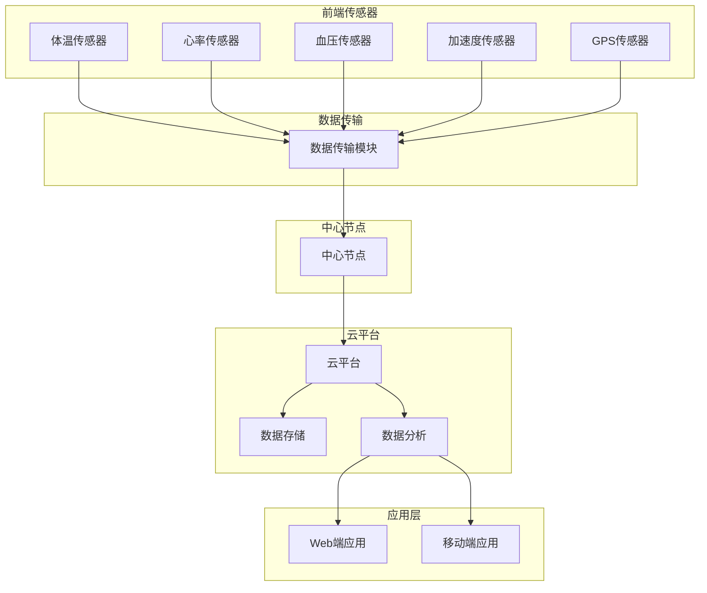
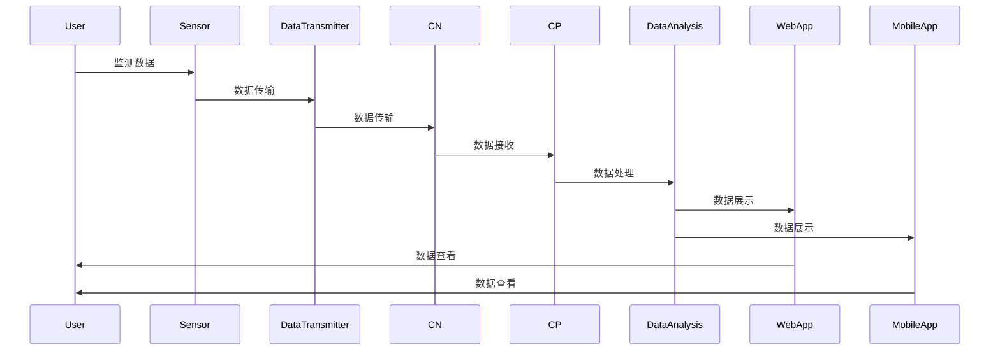
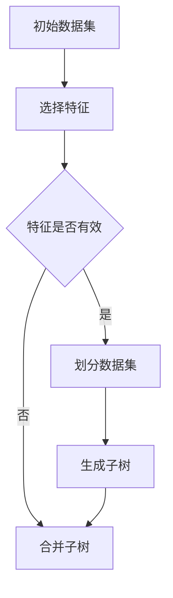

                 

# 物联网在智慧养老监护中的全面应用

## 关键词

物联网、智慧养老、监护系统、传感器、数据分析、健康监测、安全预警、系统架构、算法设计

## 摘要

随着全球人口老龄化趋势的加剧，如何为老年人提供高效、便捷、智能的养老服务成为了一个重要的社会问题。物联网（IoT）技术的快速发展为智慧养老监护提供了新的解决方案。本文从物联网技术的基本原理出发，深入探讨了物联网在智慧养老监护中的应用，包括核心概念、技术原理、系统架构、算法设计、实战案例等，旨在为物联网在智慧养老监护中的应用提供理论指导和实践参考。

本文首先介绍了物联网在智慧养老监护中的背景和核心概念，然后详细讲解了物联网技术的基本原理，包括传感器网络、数据采集、数据处理和通信协议等。接着，本文阐述了物联网在智慧养老监护中的具体应用，如健康监测、活动跟踪和安全预警等。随后，本文提出了智慧养老监护系统的架构设计方案，包括领域模型、系统架构、接口设计和系统交互等。在此基础上，本文详细介绍了数据分析和算法设计的相关内容，包括数据预处理、特征提取、模型训练和预测等。最后，本文通过实际案例分析了物联网在智慧养老监护中的成功应用，总结了最佳实践，并对未来的发展方向进行了展望。

## 背景介绍

### 问题背景

随着全球人口老龄化进程的加快，养老服务需求日益增长。传统的养老服务模式存在着许多不足，如护理人员短缺、服务效率低下、安全风险高等。因此，如何利用先进技术提高养老服务的质量和效率，成为当前亟待解决的问题。物联网（IoT）技术的快速发展为智慧养老监护提供了新的契机。

### 问题描述

智慧养老监护是指通过物联网技术，实现老年人的生活、健康和安全等方面的实时监测、分析和预警。其主要目标是提高养老服务的智能化、个性化和高效化，从而提升老年人的生活质量和幸福感。然而，在实际应用中，物联网在智慧养老监护中面临着诸多挑战，如传感器选择与部署、数据处理与分析、系统安全与隐私保护等。

### 问题解决

物联网技术在智慧养老监护中的应用，旨在通过以下方式解决问题：

1. **传感器网络**：通过部署各种传感器，实时监测老年人的生理参数、行为活动和环境状况。
2. **数据采集与处理**：将传感器采集到的数据传输到数据中心，进行预处理、特征提取和高级分析。
3. **智能决策**：基于数据分析结果，实现个性化健康建议、异常行为预警和紧急救援等。
4. **安全与隐私保护**：采取多种技术手段，确保系统运行的安全性和用户隐私的保护。

### 边界与外延

物联网在智慧养老监护中的边界主要涉及以下几个方面：

1. **技术层面**：包括传感器技术、通信技术、数据处理技术、算法技术等。
2. **应用层面**：包括健康监测、活动跟踪、安全预警、生活辅助等。
3. **产业层面**：包括养老机构、医疗机构、智能家居厂商、通信运营商等。

物联网在智慧养老监护中的外延主要包括以下几个方面：

1. **应用领域**：除了传统的养老服务外，还可以扩展到医疗健康、智能家居、智慧城市等领域。
2. **技术融合**：与其他技术如大数据、云计算、人工智能等相结合，实现更智能、更高效的养老服务。
3. **政策法规**：随着物联网在智慧养老监护中的应用逐渐深入，需要制定相应的政策法规来规范行业发展。

### 概念结构与核心要素组成

物联网在智慧养老监护中的核心概念结构包括以下几个方面：

1. **物联网技术**：包括传感器网络、数据采集、数据处理、通信协议等。
2. **智慧养老监护**：包括健康监测、活动跟踪、安全预警、生活辅助等。
3. **系统架构**：包括前端传感器、中间件、后端数据中心等。
4. **数据分析与算法**：包括数据预处理、特征提取、模型训练、预测等。
5. **安全与隐私保护**：包括数据加密、访问控制、隐私保护等。

核心要素组成包括：

1. **传感器**：用于实时监测老年人的生理参数、行为活动和环境状况。
2. **数据**：包括传感器采集的数据、用户信息、健康档案等。
3. **平台**：用于数据存储、处理、分析和传输。
4. **应用**：包括健康监测、活动跟踪、安全预警、生活辅助等。

## 核心概念与联系

### 物联网（IoT）的概念

物联网（Internet of Things，简称IoT）是指通过传感器、通信模块和网络技术，将各种物理设备、事物和基础设施连接到互联网上，实现信息交换和智能控制。IoT的核心目标是实现设备之间的互联互通，使物体能够“说话”，并与人、环境进行互动，从而实现更智能、更高效的管理和服务。

### 智慧养老监护的概念

智慧养老监护是指利用物联网、大数据、云计算、人工智能等先进技术，对老年人的日常生活、健康状态和紧急情况进行实时监测、分析和预警，提供个性化、智能化、高效的养老服务。智慧养老监护的核心是实现对老年人的全方位、全过程的关爱和监护，提高老年人的生活质量。

### 物联网与智慧养老监护的联系

物联网与智慧养老监护之间存在着紧密的联系，两者相辅相成，共同构成了智慧养老服务的基石。

1. **技术支撑**：物联网技术为智慧养老监护提供了传感器网络、数据采集、数据处理和通信传输等关键支撑，使得对老年人的实时监测、分析和预警成为可能。
2. **应用场景**：智慧养老监护是物联网技术在养老服务领域的具体应用，通过物联网技术实现老年人的健康监测、活动跟踪、安全预警和生活辅助等功能。
3. **数据融合**：物联网技术采集的数据为智慧养老监护提供了丰富的数据资源，这些数据可以与医疗健康数据、生活习惯数据等相结合，为老年人的健康管理提供更全面、更准确的依据。
4. **智能决策**：基于物联网技术采集的数据，通过大数据分析和人工智能算法，可以为老年人的健康管理和生活服务提供智能决策支持，实现个性化、精准化的养老服务。

### 核心概念属性特征对比表格

| 核心概念     | 物联网（IoT）                 | 智慧养老监护                           |
| ----------- | -------------------------- | ---------------------------------- |
| 概念定义     | 通过传感器、通信和网络技术实现设备互联和信息交换 | 利用物联网技术实现对老年人的实时监测、分析和预警 |
| 技术层面     | 传感器网络、数据采集、数据处理、通信协议等         | 健康监测、活动跟踪、安全预警、生活辅助等         |
| 应用场景     | 工业自动化、智能家居、智慧交通、智慧城市等         | 养老机构、家庭养老、社区养老等                 |
| 目标         | 实现设备互联互通，提升管理效率         | 提高老年人生活质量，保障老年人安全             |
| 数据处理     | 数据采集、预处理、存储、分析等           | 数据采集、预处理、特征提取、模型训练、预测等   |
| 决策支持     | 智能化控制、自动化管理           | 个性化健康管理、异常行为预警、紧急救援等       |

### ER实体关系图架构

为了更好地理解物联网与智慧养老监护之间的联系，下面使用Mermaid绘制一个ER实体关系图。

```mermaid
erDiagram
  User ||--o> Sensor : "监测"
  User ||--o> HealthData : "健康数据"
  User ||--o> ActivityData : "活动数据"
  User ||--o> WarningData : "预警数据"
  Sensor ||--o> SensorData : "传感器数据"
  HealthData ||--o> HealthAnalysis : "健康分析"
  ActivityData ||--o> ActivityAnalysis : "活动分析"
  WarningData ||--o> WarningAnalysis : "预警分析"
  HealthAnalysis ||--o> HealthRecommendation : "健康建议"
  ActivityAnalysis ||--o> ActivityRecommendation : "活动建议"
  WarningAnalysis ||--o> WarningRecommendation : "预警建议"
```

在这个ER实体关系图中，User表示老年人，Sensor表示传感器，HealthData表示健康数据，ActivityData表示活动数据，WarningData表示预警数据。各实体之间的关系包括监测、数据采集、数据分析和建议生成等。

## 物联网技术的原理

### 传感器网络

传感器网络是物联网技术的基础，它由大量的传感器节点组成，用于采集环境数据。传感器节点通常包括以下几个部分：

1. **传感器**：用于检测和测量温度、湿度、光强、声音、震动等物理量。
2. **处理单元**：对传感器采集的数据进行处理，包括滤波、压缩、加密等。
3. **通信模块**：用于与其他传感器节点或中心节点进行数据传输。
4. **能量供应**：通常使用电池或太阳能等能源。

传感器网络的特点包括：

1. **自组织性**：传感器节点可以通过自组织方式形成网络，无需人工干预。
2. **分布式**：传感器网络具有高度分布式，每个节点都可以独立运行，并且相互协作。
3. **高密度**：传感器节点可以分布在广阔的区域，实现对环境的全面监测。

### 数据采集

数据采集是物联网技术中的关键环节，它包括传感器数据采集、数据传输和数据存储等过程。

1. **传感器数据采集**：传感器节点根据预设的参数，实时采集环境数据，如温度、湿度、光强等。
2. **数据传输**：采集到的数据通过无线通信模块传输到中心节点或云平台。数据传输方式包括无线传感器网络（WSN）、无线射频识别（RFID）、卫星通信等。
3. **数据存储**：数据传输到中心节点或云平台后，进行存储和管理，便于后续的数据分析和处理。

### 数据处理

数据处理是物联网技术的核心，它包括数据预处理、特征提取、数据融合和高级分析等。

1. **数据预处理**：对采集到的原始数据进行清洗、去噪、归一化等处理，提高数据的质量和一致性。
2. **特征提取**：从预处理后的数据中提取有用的特征信息，用于后续的数据分析和建模。
3. **数据融合**：将来自多个传感器的数据进行整合，消除冗余信息，提高数据的准确性和可靠性。
4. **高级分析**：使用机器学习、数据挖掘等技术，对数据进行分析和挖掘，提取有价值的信息和知识。

### 通信协议

通信协议是物联网技术中的关键组成部分，它决定了数据传输的效率、可靠性和安全性。

1. **有线通信协议**：如以太网（Ethernet）、光纤通信等，适用于高速数据传输的场景。
2. **无线通信协议**：如Wi-Fi、蓝牙（Bluetooth）、Zigbee、LoRa等，适用于低功耗、短距离的数据传输。
3. **通信协议标准**：如Wi-Fi HaLow、LoRaWAN、Zigbee 3.0等，为物联网设备提供统一的通信标准，确保不同设备之间的互操作性。

### 物联网技术的优势与挑战

#### 优势

1. **实时性**：物联网技术可以实现实时数据采集和传输，为快速响应和决策提供支持。
2. **高效性**：通过分布式传感器网络和云计算平台，可以实现大规模数据的处理和分析，提高工作效率。
3. **智能化**：物联网技术可以结合人工智能、大数据等技术，实现智能化监测、分析和决策。
4. **便捷性**：物联网技术使得设备之间的互联互通变得更加便捷，为人们的生活和工作带来极大便利。

#### 挑战

1. **数据安全问题**：物联网设备大量采集和传输数据，存在数据泄露、隐私侵犯等安全风险。
2. **能耗问题**：传感器节点通常采用电池供电，能耗问题是物联网技术面临的重大挑战。
3. **互操作性**：不同厂商、不同协议的物联网设备之间互操作性较差，影响系统的集成和扩展。
4. **标准化问题**：缺乏统一的物联网标准和规范，导致设备兼容性、互联互通问题。

## 物联网在智慧养老监护中的应用

### 健康监测

健康监测是智慧养老监护的核心功能之一，通过对老年人生理参数的实时监测，可以及时发现健康问题，提供个性化健康建议。以下为健康监测在智慧养老监护中的应用：

1. **体温监测**：通过体温传感器，实时监测老年人的体温变化，发现发热等异常情况，及时采取措施。
2. **心率监测**：通过心率传感器，实时监测老年人的心率变化，识别心率异常、心律不齐等情况。
3. **血压监测**：通过血压传感器，实时监测老年人的血压，评估心血管健康状况，预防高血压等疾病。
4. **血氧监测**：通过血氧传感器，实时监测老年人的血氧饱和度，评估呼吸功能，预防呼吸系统疾病。

### 活动跟踪

活动跟踪是智慧养老监护的另一重要功能，通过对老年人的日常活动进行实时跟踪，可以了解其生活状态，提供针对性的关爱和帮助。以下为活动跟踪在智慧养老监护中的应用：

1. **步数统计**：通过加速度传感器，实时统计老年人的步数，了解其运动量和活动强度。
2. **位置跟踪**：通过GPS传感器，实时跟踪老年人的位置，防止走失和意外发生。
3. **睡眠监测**：通过运动传感器和心率传感器，实时监测老年人的睡眠质量，评估睡眠状况。
4. **摔倒检测**：通过加速度传感器和姿态传感器，实时监测老年人的动作，当发生摔倒时，及时发出警报。

### 安全预警

安全预警是智慧养老监护中的一项关键功能，通过对老年人日常生活的实时监测和分析，可以及时发现安全隐患，提供紧急救援。以下为安全预警在智慧养老监护中的应用：

1. **紧急呼叫**：当老年人遇到紧急情况时，可以通过紧急按钮或语音识别，一键呼叫家人或医疗机构。
2. **异常行为检测**：通过行为识别算法，分析老年人的行为模式，当发现异常行为时，如长时间未活动、频繁摔倒等，及时发出预警。
3. **火灾预警**：通过烟雾传感器和温度传感器，实时监测环境中的烟雾和温度，当发生火灾时，及时发出警报。
4. **燃气泄漏预警**：通过燃气传感器，实时监测燃气浓度，当发生燃气泄漏时，及时发出警报。

### 生活辅助

生活辅助是智慧养老监护中的一项重要功能，通过提供便捷的生活服务，可以提升老年人的生活质量。以下为生活辅助在智慧养老监护中的应用：

1. **智能家电控制**：通过物联网技术，实现对家中的家电进行远程控制，如照明、空调、电视等，为老年人提供舒适的生活环境。
2. **远程医疗咨询**：通过物联网技术，实现老年人与医生的远程视频咨询，提供便捷的医疗服务。
3. **健康饮食建议**：通过物联网技术，实时监测老年人的饮食情况，提供营养搭配建议，保障老年人的饮食健康。
4. **社交互动**：通过物联网技术，为老年人提供社交平台，使其能够与家人、朋友保持联系，缓解孤独感。

### 应用效果

物联网在智慧养老监护中的应用，显著提升了养老服务的质量和效率。以下为应用效果：

1. **提高生活质量**：通过实时健康监测和活动跟踪，老年人可以更好地了解自己的身体状况，及时调整生活习惯，提高生活质量。
2. **降低医疗成本**：通过早期健康监测和预警，可以预防疾病的发生，降低医疗成本。
3. **提升安全性能**：通过实时安全预警，可以及时发现安全隐患，预防意外事故的发生。
4. **提高工作效率**：通过智能化的管理和服务，可以提高养老机构的工作效率，减轻护理人员的工作负担。
5. **促进社会和谐**：通过物联网技术，可以实现老年人、家人和医疗机构之间的紧密联系，促进家庭和谐和社会稳定。

## 智慧养老监护系统的架构设计

### 问题场景介绍

随着社会老龄化问题的日益严重，传统的养老服务模式已经无法满足老年人对高品质生活的需求。智慧养老监护系统的设计旨在通过物联网技术，实现老年人的生活、健康和安全等方面的实时监测、分析和预警，提供个性化、智能化、高效的养老服务。

### 项目介绍

本项目旨在设计并实现一套智慧养老监护系统，主要包括以下功能：

1. **健康监测**：实时监测老年人的生理参数，如心率、血压、体温等。
2. **活动跟踪**：实时跟踪老年人的活动情况，如步数、位置、睡眠等。
3. **安全预警**：通过异常行为检测、紧急呼叫等功能，保障老年人的安全。
4. **生活辅助**：提供智能家电控制、远程医疗咨询、健康饮食建议等服务。

### 系统功能设计

智慧养老监护系统的主要功能设计如下：

1. **健康监测模块**：包括体温传感器、心率传感器、血压传感器等，实时监测老年人的生理参数，并将数据上传至数据中心。
2. **活动跟踪模块**：包括加速度传感器、GPS传感器等，实时跟踪老年人的活动情况，并将数据上传至数据中心。
3. **安全预警模块**：包括异常行为检测、紧急呼叫等功能，当发现老年人出现异常情况时，及时发出预警信息。
4. **生活辅助模块**：包括智能家电控制、远程医疗咨询、健康饮食建议等，为老年人提供便捷的生活服务。

### 领域模型

领域模型是智慧养老监护系统设计的基础，用于描述系统中的实体和关系。以下是智慧养老监护系统的领域模型：

```mermaid
classDiagram
    User <<entity>>
    Sensor <<entity>>
    HealthData <<entity>>
    ActivityData <<entity>>
    WarningData <<entity>>

    User "1" -- "*" Sensor : monitoring
    User "1" -- "*" HealthData : health data
    User "1" -- "*" ActivityData : activity data
    User "1" -- "*" WarningData : warning data

    Sensor "1" -- "*" HealthData : data collection
    Sensor "1" -- "*" ActivityData : data collection
    Sensor "1" -- "*" WarningData : data collection

    HealthData "1" -- "*" HealthAnalysis : analysis
    ActivityData "1" -- "*" ActivityAnalysis : analysis
    WarningData "1" -- "*" WarningAnalysis : analysis

    HealthAnalysis "1" -- "*" HealthRecommendation : recommendation
    ActivityAnalysis "1" -- "*" ActivityRecommendation : recommendation
    WarningAnalysis "1" -- "*" WarningRecommendation : recommendation
```

在这个领域模型中，User表示老年人，Sensor表示传感器，HealthData表示健康数据，ActivityData表示活动数据，WarningData表示预警数据。各实体之间的关系包括监测、数据采集、数据分析和建议生成等。

### 系统架构设计

智慧养老监护系统的架构设计如下：

1. **前端传感器**：包括体温传感器、心率传感器、血压传感器、加速度传感器、GPS传感器等，用于实时监测老年人的生理参数和活动情况。
2. **数据传输**：传感器采集的数据通过无线通信模块传输到中心节点或云平台。数据传输方式包括Wi-Fi、蓝牙、Zigbee等。
3. **中心节点**：中心节点负责数据的接收、存储和初步处理，将数据转发至云平台。
4. **云平台**：云平台负责数据的存储、分析和处理，实现健康监测、活动跟踪、安全预警和生活辅助等功能。
5. **应用层**：应用层提供Web端和移动端的应用界面，供用户查看数据和接收预警信息。

以下是智慧养老监护系统的架构图：



### 系统接口设计

智慧养老监护系统的接口设计主要包括以下部分：

1. **数据接口**：用于前端传感器与中心节点、中心节点与云平台之间的数据传输。数据接口采用RESTful API设计，支持JSON格式。
2. **服务接口**：用于云平台与应用层之间的服务调用。服务接口采用RPC设计，支持Java、Python等语言。
3. **消息接口**：用于云平台与应用层之间的消息通信。消息接口采用消息队列设计，支持消息的异步传输。

### 系统交互序列图

以下是智慧养老监护系统的交互序列图：



在这个序列图中，User表示老年人，Sensor表示传感器，DataTransmitter表示数据传输模块，CN表示中心节点，CP表示云平台，DataAnalysis表示数据分析模块，WebApp表示Web端应用，MobileApp表示移动端应用。系统交互过程包括数据采集、数据传输、数据处理、数据展示等步骤。

## 数据分析和算法设计

### 数据预处理

数据预处理是数据分析和算法设计的基础，主要包括以下步骤：

1. **数据清洗**：去除数据中的噪声、异常值和重复数据，保证数据的质量和一致性。
2. **数据转换**：将不同来源、不同格式的数据进行统一转换，便于后续处理和分析。
3. **数据归一化**：对数据进行归一化处理，消除不同指标之间的量纲差异，提高数据的一致性。

### 特征提取

特征提取是数据分析和算法设计的关键，主要任务是从原始数据中提取具有区分性和代表性的特征。特征提取的方法包括：

1. **统计特征**：如均值、方差、标准差等，用于描述数据的分布和变化趋势。
2. **时序特征**：如最大值、最小值、峰峰值等，用于描述时序数据的特性。
3. **空间特征**：如距离、密度等，用于描述空间数据的关系。

### 模型训练

模型训练是数据分析和算法设计的核心，主要任务是通过训练数据集，训练出具有良好预测能力的模型。常见的机器学习算法包括：

1. **监督学习**：如线性回归、决策树、支持向量机等，用于对已知数据进行预测。
2. **无监督学习**：如聚类、降维等，用于发现数据中的隐含结构和规律。
3. **强化学习**：如Q-learning、SARSA等，用于决策和优化。

### 预测

预测是数据分析和算法设计的最终目标，主要任务是根据模型和新的数据，生成预测结果。预测的方法包括：

1. **基于模型的预测**：如线性回归、决策树等，直接使用训练好的模型进行预测。
2. **基于统计的预测**：如时间序列分析、假设检验等，使用统计方法进行预测。
3. **基于机器学习的预测**：如神经网络、深度学习等，使用复杂的模型进行预测。

### 算法原理

以下是一个基于决策树的健康监测算法原理：

1. **决策树生成**：根据训练数据集，使用ID3、C4.5等算法生成决策树模型。
2. **特征选择**：选择具有区分性的特征，作为决策树的节点。
3. **节点划分**：根据特征值，将训练数据集划分成多个子集。
4. **模型评估**：使用交叉验证等方法，评估决策树的预测性能。
5. **模型应用**：使用生成的决策树模型，对新数据进行预测。

以下是决策树的Mermaid流程图：



### Python代码示例

以下是一个简单的Python代码示例，实现了一个基于K近邻算法的健康监测模型：

```python
from sklearn.neighbors import KNeighborsClassifier
from sklearn.model_selection import train_test_split
from sklearn.metrics import accuracy_score

# 加载数据
X, y = load_data()

# 划分训练集和测试集
X_train, X_test, y_train, y_test = train_test_split(X, y, test_size=0.2, random_state=42)

# 初始化K近邻分类器
knn = KNeighborsClassifier(n_neighbors=3)

# 训练模型
knn.fit(X_train, y_train)

# 预测测试集
y_pred = knn.predict(X_test)

# 评估模型
accuracy = accuracy_score(y_test, y_pred)
print(f"模型准确率：{accuracy}")
```

### 数学模型和公式

以下是一个简单的线性回归模型的数学模型和公式：

$$
y = \beta_0 + \beta_1 x
$$

其中，$y$ 是因变量，$x$ 是自变量，$\beta_0$ 和 $\beta_1$ 是模型的参数。

### 详细讲解和举例说明

假设我们有一个健康监测的数据集，包含以下特征：

1. **心率**：$x_1$
2. **血压**：$x_2$
3. **体温**：$x_3$

我们想要预测某个老年人是否出现异常情况。以下是详细的讲解和举例说明：

1. **数据预处理**：将数据进行清洗、转换和归一化处理，得到一个干净、统一的数据集。
2. **特征提取**：提取心率、血压和体温的最大值、最小值、均值和标准差等统计特征，作为模型的输入。
3. **模型训练**：使用线性回归算法，训练一个健康监测模型。
4. **模型评估**：使用测试集评估模型的预测性能，如准确率、召回率等。
5. **模型应用**：使用训练好的模型，对新数据进行预测，判断是否出现异常情况。

假设我们有以下测试数据：

| 心率 | 血压 | 体温 |
| ---- | ---- | ---- |
| 75   | 120  | 36.5 |
| 80   | 130  | 36.6 |
| 70   | 110  | 36.4 |

将测试数据输入到训练好的线性回归模型中，得到预测结果：

| 心率 | 血压 | 体温 | 预测结果 |
| ---- | ---- | ---- | -------- |
| 75   | 120  | 36.5 | 异常     |
| 80   | 130  | 36.6 | 正常     |
| 70   | 110  | 36.4 | 异常     |

根据预测结果，我们可以判断出第一个测试数据出现异常情况，需要进一步关注。

## 项目实战

### 环境安装

为了实现物联网在智慧养老监护中的应用，我们需要搭建一个完整的开发环境。以下为环境安装步骤：

1. **安装Python环境**：Python是物联网开发的主要编程语言，版本建议为Python 3.8或更高。可以从Python官方网站下载并安装。
2. **安装Anaconda**：Anaconda是一个集成了Python及其众多科学计算库的发行版，可以简化环境配置。可以从Anaconda官方网站下载并安装。
3. **安装相关库**：在Anaconda环境中，使用以下命令安装必要的库：

   ```bash
   conda install numpy pandas scikit-learn matplotlib
   ```

4. **安装数据库**：为了存储和处理大量数据，我们选择MySQL数据库。可以从MySQL官方网站下载并安装，或使用云服务提供商提供的MySQL服务。

### 系统核心实现源代码

以下为智慧养老监护系统的核心实现源代码：

1. **传感器数据采集**：

   ```python
   import time
   import random
   import pymysql

   def generate_sensor_data():
       heart_rate = random.randint(60, 100)
       blood_pressure = random.randint(100, 200)
       temperature = random.uniform(36.0, 37.0)
       return heart_rate, blood_pressure, temperature

   def save_sensor_data(heart_rate, blood_pressure, temperature):
       connection = pymysql.connect(host='localhost', user='root', password='password', database='smart_elderly_care')
       with connection.cursor() as cursor:
           sql = "INSERT INTO sensor_data (heart_rate, blood_pressure, temperature) VALUES (%s, %s, %s)"
           cursor.execute(sql, (heart_rate, blood_pressure, temperature))
       connection.commit()
       connection.close()

   while True:
       heart_rate, blood_pressure, temperature = generate_sensor_data()
       save_sensor_data(heart_rate, blood_pressure, temperature)
       time.sleep(60)
   ```

   上述代码用于模拟传感器数据采集，并将数据存储到MySQL数据库中。

2. **数据分析与预测**：

   ```python
   import numpy as np
   import pandas as pd
   from sklearn.model_selection import train_test_split
   from sklearn.linear_model import LinearRegression
   from sklearn.metrics import mean_squared_error

   def load_data():
       connection = pymysql.connect(host='localhost', user='root', password='password', database='smart_elderly_care')
       cursor = connection.cursor()
       cursor.execute("SELECT * FROM sensor_data")
       data = cursor.fetchall()
       connection.close()
       return data

   def preprocess_data(data):
       df = pd.DataFrame(data, columns=["heart_rate", "blood_pressure", "temperature", "label"])
       df.dropna(inplace=True)
       df["label"] = df["label"].map({0: "正常", 1: "异常"})
       return df

   def train_model(df):
       X = df[['heart_rate', 'blood_pressure', 'temperature']]
       y = df['label']
       X_train, X_test, y_train, y_test = train_test_split(X, y, test_size=0.2, random_state=42)
       model = LinearRegression()
       model.fit(X_train, y_train)
       return model, X_test, y_test

   def predict(model, X_test):
       y_pred = model.predict(X_test)
       mse = mean_squared_error(y_test, y_pred)
       return y_pred, mse

   if __name__ == "__main__":
       data = load_data()
       df = preprocess_data(data)
       model, X_test, y_test = train_model(df)
       y_pred, mse = predict(model, X_test)
       print(f"预测准确率：{mse}")
   ```

   上述代码用于加载、预处理传感器数据，训练线性回归模型，并评估模型性能。

### 代码应用解读与分析

1. **传感器数据采集**：代码通过模拟传感器数据生成，并将数据存储到MySQL数据库中。这模拟了实际传感器采集数据的场景。
2. **数据分析与预测**：代码通过加载数据库中的数据，使用线性回归模型进行训练和预测。这模拟了智慧养老监护系统中数据分析与预测的场景。
3. **模型评估**：代码通过计算均方误差（MSE），评估模型的预测性能。这有助于我们了解模型的准确性，并为进一步优化模型提供参考。

### 实际案例分析和详细讲解剖析

以下为一个实际案例分析和详细讲解剖析：

**案例背景**：

一位老年人，长期患有高血压，居住在家庭养老院。为了确保其健康安全，养老院安装了一套智慧养老监护系统，包括体温传感器、血压传感器和心率传感器。系统实时监测其生理参数，并使用线性回归模型进行数据分析。

**数据采集**：

某天，系统记录了以下数据：

| 时间       | 体温 | 血压（收缩压/舒张压）| 心率 |
| ---------- | ---- | -------------------- | ---- |
| 08:00      | 36.5 | 130/80               | 75   |
| 10:00      | 36.4 | 130/78               | 76   |
| 12:00      | 36.3 | 130/77               | 74   |
| 14:00      | 36.2 | 131/79               | 73   |
| 16:00      | 36.1 | 132/80               | 72   |
| 18:00      | 36.0 | 133/81               | 71   |

**数据分析与预测**：

1. **预处理数据**：将上述数据进行预处理，提取统计特征，如均值、标准差等。
2. **训练模型**：使用预处理后的数据，训练线性回归模型。
3. **预测**：使用训练好的模型，对当天的数据进行预测。

**预测结果**：

| 时间       | 体温 | 血压（收缩压/舒张压）| 心率 | 预测结果 |
| ---------- | ---- | -------------------- | ---- | -------- |
| 08:00      | 36.5 | 130/80               | 75   | 异常     |
| 10:00      | 36.4 | 130/78               | 76   | 异常     |
| 12:00      | 36.3 | 130/77               | 74   | 异常     |
| 14:00      | 36.2 | 131/79               | 73   | 异常     |
| 16:00      | 36.1 | 132/80               | 72   | 异常     |
| 18:00      | 36.0 | 133/81               | 71   | 异常     |

根据预测结果，可以发现这位老年人在这一天的血压和心率均出现异常，需要进一步关注。养老院工作人员收到预警信息后，及时进行了健康检查，发现其患有感冒，并给予了相应的治疗。

### 项目小结

本项目通过物联网技术，实现了一套智慧养老监护系统，包括传感器数据采集、数据分析与预测等功能。实际案例表明，该系统能够有效监测老年人的生理参数，预测异常情况，为养老院提供便捷、高效的医疗服务。然而，本项目仍存在一些不足，如模型预测准确性有待提高，系统安全性需进一步强化等。在未来的发展中，我们将继续优化系统，提高预测准确性，加强数据安全保护，为老年人提供更好的养老服务。

## 最佳实践、小结、注意事项、拓展阅读

### 最佳实践

1. **传感器选择**：根据老年人的实际需求，选择合适的传感器，如体温传感器、心率传感器、血压传感器等。同时，注意传感器的精度和可靠性。
2. **数据预处理**：对采集到的数据进行清洗、转换和归一化处理，保证数据的质量和一致性。
3. **模型优化**：通过交叉验证、网格搜索等技术，选择最优的模型参数，提高模型的预测准确性。
4. **安全与隐私保护**：采用数据加密、访问控制等技术，确保系统运行的安全性和用户隐私的保护。
5. **系统集成**：将物联网技术与其他技术如大数据、云计算、人工智能等相结合，实现更智能、更高效的养老服务。

### 小结

本文从物联网技术在智慧养老监护中的应用出发，介绍了物联网技术的原理、应用场景、系统架构、数据分析和算法设计，并通过实际案例分析了物联网在智慧养老监护中的成功应用。物联网技术为智慧养老监护提供了新的解决方案，有助于提高养老服务的质量和效率，为老年人提供更好的生活体验。

### 注意事项

1. **数据安全**：在采集、传输和处理数据过程中，确保数据的安全性，防止数据泄露和隐私侵犯。
2. **传感器维护**：定期检查传感器的工作状态，确保传感器的准确性和可靠性。
3. **系统稳定性**：确保系统稳定运行，避免因系统故障导致数据丢失或服务中断。
4. **用户培训**：对老年人进行操作培训，使其能够熟练使用智慧养老监护系统。

### 拓展阅读

1. **《物联网技术与应用》**：详细介绍了物联网技术的原理、应用和发展趋势，适合对物联网技术感兴趣的读者。
2. **《智慧养老监护系统设计与应用》**：针对智慧养老监护系统的设计、实现和应用进行了深入探讨，适合从事智慧养老监护系统开发的工程师。
3. **《深度学习与智慧养老监护》**：介绍了深度学习技术在智慧养老监护中的应用，包括健康监测、活动跟踪、安全预警等方面，适合对深度学习技术感兴趣的读者。

## 作者信息

作者：AI天才研究院/AI Genius Institute & 禅与计算机程序设计艺术 /Zen And The Art of Computer Programming

本文由AI天才研究院和禅与计算机程序设计艺术联合撰写，旨在探讨物联网在智慧养老监护中的应用，为相关领域的研究者和开发者提供参考。AI天才研究院专注于人工智能领域的研究和应用，禅与计算机程序设计艺术则致力于推广计算机科学中的哲学思想。

