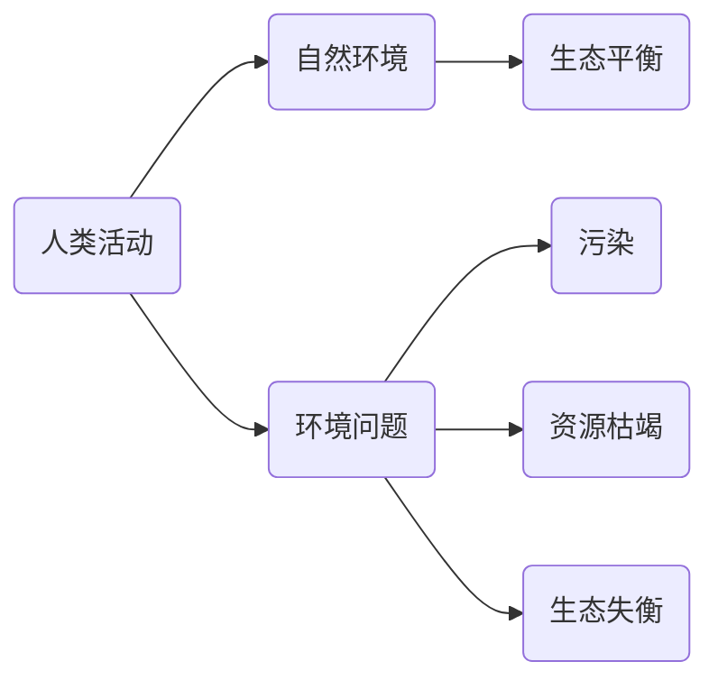
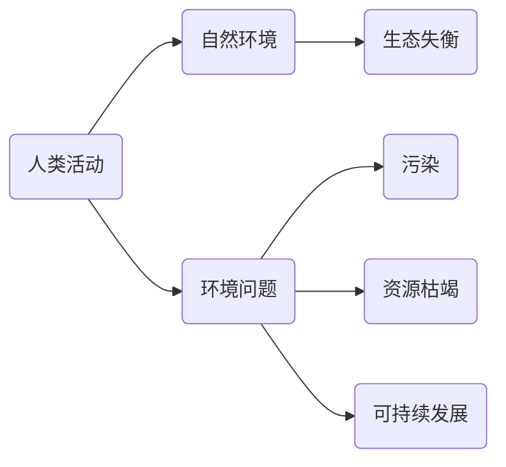
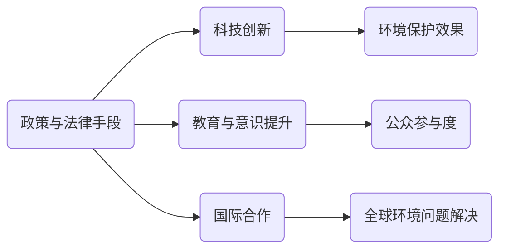
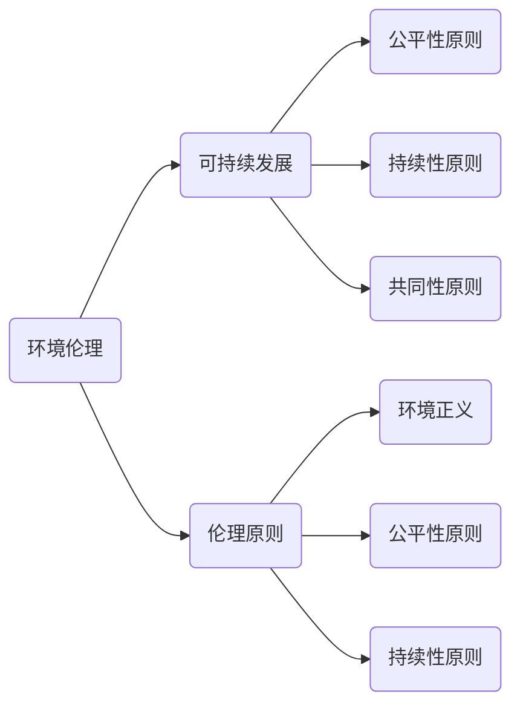
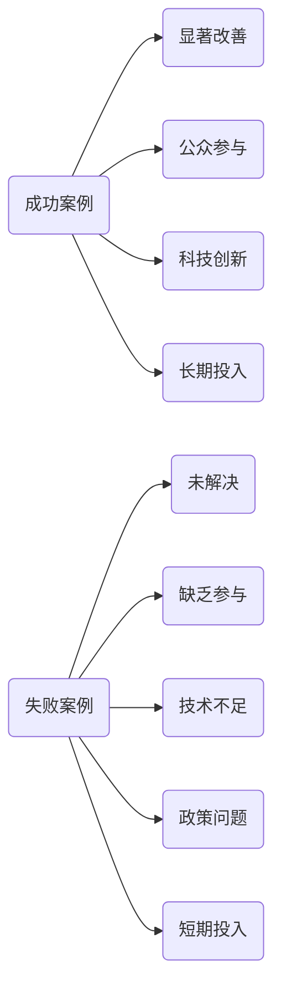
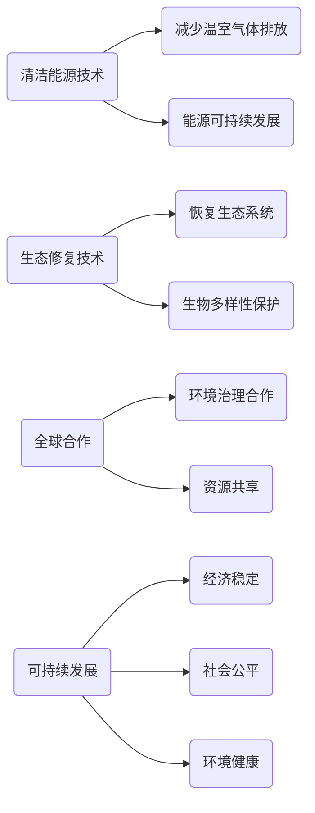
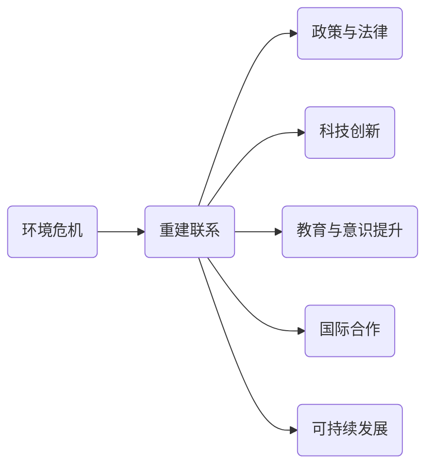

                 

### 引言

### 环境危机的现状与影响

#### 环境危机的概述

环境危机是指由于人类活动对自然环境的过度开发、污染和破坏，导致生态环境失衡，进而引发的一系列全球性环境问题。这些问题包括气候变化、生物多样性丧失、污染、水资源短缺、土地退化等，严重威胁着人类的生存和发展。

#### 人类活动对环境的影响

人类活动对环境的影响主要包括以下几个方面：

1. **工业化和城市化**：工业化带来了大量的废气、废水和固体废物，严重污染了大气、水源和土壤。城市化则导致了大量的森林砍伐和土地侵占。

2. **能源消耗**：人类对化石能源的过度依赖，导致了大量温室气体的排放，是气候变化的主要原因之一。

3. **农业生产**：农业活动中大量使用化肥和农药，导致土壤和水源污染，同时也导致了生物多样性丧失。

4. **交通出行**：交通工具的广泛使用，尤其是汽车，增加了空气污染和交通拥堵。

#### 危机对人类生存的威胁

环境危机对人类生存的威胁主要体现在以下几个方面：

1. **气候变化**：全球气候变暖导致极端天气事件频繁发生，如暴雨、干旱、台风等，对农业生产、水资源管理和人类健康产生严重影响。

2. **生物多样性丧失**：生物多样性丧失导致生态系统功能受损，影响到人类的食物链和生态服务。

3. **污染**：空气、水和土壤污染直接威胁到人类的健康，导致各种疾病的发生。

4. **资源短缺**：水资源和土地资源的短缺将加剧人类的生存压力。

### 自然与人类的联系

#### 历史视角

从远古时代到现代社会，人类与自然的关系经历了巨大的变迁。在远古时代，人类主要依靠狩猎和采集为生，对自然环境的依赖性较大。随着农业的出现，人类开始定居，对自然环境的改造也逐渐增多。工业革命以来，人类的活动对自然环境的影响达到了前所未有的程度。

#### 哲学视角

哲学上，人类与自然的关系可以从两个方面来理解：

1. **人类中心主义**：认为人类是宇宙的中心，自然是为人类服务的。这种观点在人类文明发展的早期占主导地位。

2. **生态中心主义**：认为自然是一个有机整体，所有生物都有其存在的价值。这种观点在现代社会逐渐受到重视。

### 自然的价值和人类的责任

#### 自然的价值

自然为人类提供了丰富的资源和服务，包括食物、水源、氧气、气候调节、土壤保持等。同时，自然景观和生物多样性也具有重要的文化价值和审美价值。

#### 人类的责任

人类有责任保护和维护自然环境，以确保生态系统的健康和稳定。这包括：

1. **减少污染**：通过减少废气、废水和固体废物的排放，减少对大气的、水源和土壤的污染。

2. **节约资源**：通过提高资源利用效率，减少对自然资源的消耗。

3. **保护生物多样性**：通过建立自然保护区，保护濒危物种和生态系统。

4. **可持续发展**：在满足当前人类需求的同时，不损害后代满足其需求的能力。

### 总结

环境危机已经成为全球性的问题，对人类的生存和发展构成了严重威胁。在当前的背景下，重新与自然建立联系，寻找生存的意义，具有重要的现实意义。本文将深入探讨人类与自然的关系，分析环境危机的根源，并提出重建联系的方法和策略。通过这样的探讨，我们希望能够为解决环境危机提供一些有益的思路和方案。

---

关键词：环境危机、人类与自然、生态重建、可持续发展、环境保护

摘要：本文探讨了环境危机的现状和影响，分析了人类与自然的历史联系和哲学视角，讨论了自然的价值观和人类的责任，并提出了一系列重建人类与自然联系的方法和策略。通过这样的探讨，旨在为应对环境危机提供一些有益的思考和解决方案。

## 第一章：自然与人类的联系

### 历史视角

#### 从远古时代到现代社会

人类的历史与自然环境紧密相连。在远古时代，人类主要以狩猎和采集为生，依赖自然资源维持生存。随着工具的发明和农业的出现，人类逐渐定居，开始对自然环境进行改造。例如，农业的发展导致了森林的砍伐和土地的开垦，人类的活动对自然环境产生了深远的影响。

进入工业革命时期，人类对自然环境的改造达到了一个前所未有的高度。工业化带来了大量的能源消耗和废弃物排放，严重污染了大气、水源和土壤。城市化进程的加快，导致了大量自然景观的消失和生物多样性的丧失。

#### 人类活动对自然环境的影响

人类活动对自然环境的影响主要体现在以下几个方面：

1. **土地变化**：农业和城市化导致了大量土地的改造成耕地、城市用地和工业用地。这不仅改变了地表的形态，也破坏了原有的生态系统。

2. **水资源污染**：工业废水、农药和化肥的排放，导致了水体污染，影响了水资源的质量和可用性。

3. **大气污染**：工业废气、汽车尾气和燃烧化石燃料产生的污染物，导致空气质量下降，危害人类健康。

4. **生物多样性丧失**：森林砍伐、湿地填埋和海洋污染等，导致了大量物种的灭绝和生态系统的破坏。

### 哲学视角

#### 自然的价值

在哲学上，自然的价值可以从多个角度来理解：

1. **工具价值**：自然为人类提供了生存所需的资源，如食物、水源、空气和能源。从这个角度来看，自然的价值主要体现在其工具性作用上。

2. **内在价值**：自然不仅仅是人类生存的工具，还具有自身的内在价值。每个物种、每个生态系统都有其存在的意义，不仅仅是作为人类的附属品。生态中心主义认为，自然应当被尊重和保护，因为其本身就是有价值的。

3. **伦理价值**：自然保护不仅仅是为了人类自身的利益，还涉及到道德和伦理问题。人类有责任保护和维护自然环境，以确保生态系统的健康和稳定。

#### 人类的责任

人类对自然的责任主要体现在以下几个方面：

1. **可持续利用资源**：人类应当合理利用自然资源，避免过度开发和浪费。例如，通过循环经济和可再生能源的使用，减少对自然资源的依赖。

2. **减少污染**：人类应当采取措施，减少污染物排放，保护大气、水源和土壤。例如，通过实施环保法规和采用清洁生产技术，减少工业污染。

3. **保护生物多样性**：人类应当采取措施，保护濒危物种和生态系统。例如，通过建立自然保护区和实施生态修复项目，恢复和维持生物多样性。

4. **教育和意识提升**：人类应当通过教育和意识提升，提高公众对环境保护的认识和参与度。例如，通过环境教育和公众宣传活动，增强公众的环保意识。

### 自然与人类的联系总结

从历史和哲学的角度来看，人类与自然的关系是复杂而紧密的。在历史上，人类的活动对自然环境产生了深远的影响，而哲学上对自然的认识和评价也在不断演变。在现代社会，面对日益严重的环境危机，人类有责任重新审视与自然的关系，采取行动保护和恢复自然环境。这不仅是为了人类的生存和发展，也是为了维护生态系统的平衡和稳定。

---

核心概念与联系：

### 自然与人类的联系

**核心概念**：
1. **人类活动**：指人类在历史上和现代社会中的生产、生活、科技发展等活动。
2. **自然环境**：指地球上所有生物和物理环境的总和，包括大气、水、土壤、森林、草原等。
3. **环境问题**：由人类活动引发的对自然环境的不良影响，如污染、资源枯竭、生态失衡等。
4. **生态平衡**：指自然环境中生物和非生物要素之间的动态平衡和相互依存关系。

**概念属性特征对比表格**：

| 特征       | 人类活动                    | 自然环境                |
| ---------- | -------------------------- | ---------------------- |
| 目的       | 为了满足人类的生产和生活需求 | 自我维持和演化          |
| 影响范围   | 局部到全球                 | 地球生态系统            |
| 动力来源   | 社会经济活动               | 自然的内在动力          |
| 变化速度   | 较快，尤其是工业革命后      | 较慢，但长期影响深远    |
| 稳定性     | 不稳定，受技术和政策影响   | 稳定，但可被破坏        |

**ER实体关系图架构**：

通过上述表格和ER图，我们可以清晰地看到人类活动与自然环境之间的互动关系，以及环境问题对生态平衡的威胁。人类活动不仅影响自然环境，同时也引发了一系列环境问题，这些问题又反过来影响生态平衡，从而影响人类的生存和发展。

### 环境危机的根源分析

#### 人类活动的历史回顾

环境危机的根源可以追溯到人类历史的早期阶段。在旧石器时代，人类开始学会使用火，通过狩猎和采集维持生存。这一时期，人类活动对环境的影响相对较小，主要表现为对局部生态系统的扰动。然而，随着农业的出现，人类活动对环境的影响开始逐渐加剧。

在农业社会，人类通过开垦土地、种植作物和养殖动物来满足日益增长的人口需求。这一过程中，森林被大量砍伐，草原被开垦为农田，导致土地的退化和生态系统的破坏。例如，中国古代的黄河流域曾是世界上最为富饶的农业区之一，但由于长期的过度开发，导致土地荒漠化，生态环境严重恶化。

进入工业革命时期，人类对环境的影响达到了前所未有的程度。工业生产需要大量的能源和原材料，导致了大量化石燃料的燃烧和矿产资源的开采。这不仅导致空气和水源的污染，还引发了气候变化和生物多样性丧失。例如，19世纪的伦敦烟雾事件和美国的洛杉矶光化学烟雾事件，都是工业污染的典型案例。

#### 环境问题的具体表现

1. **气候变化**：人类活动导致的大气中温室气体浓度增加，是导致全球气候变暖的主要原因。气候变化引发了一系列极端天气事件，如暴雨、干旱、台风和热浪，对农业生产、水资源管理和人类健康产生了严重影响。

2. **生物多样性丧失**：人类活动导致的栖息地破坏、污染和过度捕捞，使全球生物多样性面临严重威胁。例如，热带雨林的砍伐和珊瑚礁的破坏，导致了许多物种的灭绝。

3. **污染**：工业化和城市化带来的污染物排放，导致大气、水源和土壤的严重污染。空气污染和水质污染直接威胁到人类的健康，导致各种呼吸系统和消化系统疾病的发生。

4. **水资源短缺**：人类活动导致的水资源污染和过度使用，使得全球许多地区面临水资源短缺的危机。水资源短缺不仅影响农业和工业生产，还威胁到人类的饮用水供应。

5. **土地退化**：农业活动中的过度施肥和灌溉，导致土壤盐碱化和贫瘠化。同时，森林砍伐和草原退化，使得土地的生态功能减弱，加剧了土地退化问题。

#### 环境危机的复杂性和全球性

环境危机的复杂性和全球性使其成为全球性的挑战。环境问题不仅涉及一个国家或地区，而是具有跨国界的影响。例如，气候变化是一个全球性问题，任何一个国家的气候变化都会影响到全球的气候平衡。大气污染物可以通过大气扩散和降水，影响其他地区的空气质量。

环境危机的复杂性还体现在其成因和解决方式的多样性。环境问题往往是多因素、多层次的，需要多学科、多领域的合作来共同解决。例如，气候变化问题不仅涉及气象学、地质学，还涉及能源、农业、交通等多个领域。

### 总结

环境危机的根源在于人类活动对自然环境的过度开发和破坏。从农业社会到工业革命，人类活动对环境的影响逐渐加剧，导致了一系列环境问题。这些问题的复杂性和全球性使得环境危机成为全球性的挑战。为了应对环境危机，人类需要从根本上改变对自然的态度和行为，采取全面的措施，保护自然环境，实现可持续发展。

---

关键词：环境危机、历史回顾、环境问题、生物多样性、污染

核心概念与联系：

### 环境危机的根源

**核心概念**：
1. **人类活动**：指人类在历史上和现代社会中的生产、生活、科技发展等活动。
2. **自然环境**：指地球上所有生物和物理环境的总和，包括大气、水、土壤、森林、草原等。
3. **环境问题**：由人类活动引发的对自然环境的不良影响，如污染、资源枯竭、生态失衡等。
4. **可持续发展**：满足当前人类需求的同时，不损害后代满足其需求的能力。

**概念属性特征对比表格**：

| 特征       | 人类活动                    | 自然环境                |
| ---------- | -------------------------- | ---------------------- |
| 影响范围   | 局部到全球                 | 地球生态系统            |
| 动力来源   | 社会经济活动               | 自然的内在动力          |
| 变化速度   | 较快，尤其是工业革命后      | 较慢，但长期影响深远    |
| 稳定性     | 不稳定，受技术和政策影响   | 稳定，但可被破坏        |

**ER实体关系图架构**：

通过上述表格和ER图，我们可以清晰地看到人类活动与自然环境之间的互动关系，以及环境问题对生态平衡和可持续发展的威胁。人类活动不仅影响自然环境，同时也引发了一系列环境问题，这些问题又反过来影响生态平衡，从而影响人类的生存和发展。

### 人类与自然重建联系的方法

#### 政策与法律手段

政府通过制定和实施环境保护政策、法律法规，可以有效地规范人类活动，减少对自然环境的破坏。以下是一些具体的政策与法律手段：

1. **环境保护政策**：政府可以制定一系列环境保护政策，如空气质量标准、水质标准、土地使用规划等，以规范人类的生产和生活行为。

2. **环境保护法律法规**：政府可以制定和实施环境保护法律法规，如《环境保护法》、《水污染防治法》、《大气污染防治法》等，对违法行为进行处罚。

3. **环境监测与评估**：政府可以建立环境监测网络，定期对空气质量、水质、土壤质量等进行监测，并公布监测结果，以透明化环境信息，提高公众的环境意识。

#### 科技创新

科技创新在解决环境问题、实现可持续发展方面发挥着关键作用。以下是一些科技创新的例子：

1. **清洁能源技术**：通过研发和推广太阳能、风能、水能等清洁能源技术，减少对化石燃料的依赖，降低温室气体排放。

2. **生态修复技术**：通过植被恢复、湿地修复、土壤修复等技术手段，恢复和重建受损的生态系统。

3. **节能减排技术**：通过研发和应用高效节能技术，降低能源消耗和污染物排放。

4. **环境监测技术**：通过使用遥感技术、传感器网络等技术，实时监测环境质量，提高环境管理的科学性和精准性。

#### 教育与意识提升

教育和意识提升是改变人类行为、推动环境保护的关键因素。以下是一些教育与意识提升的措施：

1. **环境教育**：在学校教育中增加环境教育的比重，培养学生的环保意识和可持续发展的观念。

2. **公众参与**：通过组织环保志愿者活动、环保知识竞赛等，鼓励公众参与环境保护行动。

3. **生态文化建设**：通过宣传和弘扬生态文化，提高公众对自然价值和生态保护的认识。

#### 国际合作

环境问题具有全球性，需要国际合作才能有效地解决。以下是一些国际合作的形式：

1. **国际公约和协议**：通过签订国际公约和协议，如《巴黎协定》、《生物多样性公约》等，共同应对全球性环境问题。

2. **技术转移与共享**：发达国家和发展中国家之间可以合作，通过技术转移和共享，帮助发展中国家提高环保技术水平和环境管理水平。

3. **资金支持**：国际社会可以通过提供资金支持，帮助发展中国家应对环境问题，实现可持续发展。

#### 成功案例

全球范围内，有许多成功的环境保护案例，展示了人类与自然重建联系的成果。以下是一些具体的成功案例：

1. **哥斯达黎加**：哥斯达黎加通过实施严格的森林保护政策和生态旅游，恢复了大量的森林和生物多样性，成为全球生态保护的典范。

2. **荷兰**：荷兰通过建立大面积的湿地保护区，有效地减少了洪水灾害，同时保护了湿地生态系统。

3. **中国**：中国通过实施大规模的生态修复项目，如三北防护林工程、退耕还林还草工程等，显著改善了生态环境，提高了森林覆盖率。

#### 结论

人类与自然重建联系的方法是多方面的，包括政策与法律手段、科技创新、教育与意识提升、国际合作等。通过这些方法，我们可以有效地减少环境破坏，恢复和重建生态系统，实现可持续发展。在全球环境危机的背景下，这些方法的重要性更加凸显，需要全社会的共同努力。

---

关键词：政策与法律、科技创新、教育与意识提升、国际合作、生态保护

核心概念与联系：

### 人类与自然重建联系的方法

**核心概念**：
1. **政策与法律手段**：指政府通过制定和实施环境保护政策、法律法规，规范人类活动，保护自然环境。
2. **科技创新**：指通过研发和应用新技术、新产品，减少环境破坏，实现可持续发展。
3. **教育与意识提升**：指通过教育和社会活动，提高公众的环境意识和可持续发展的观念。
4. **国际合作**：指国际社会通过合作和协调，共同应对全球性环境问题。

**概念属性特征对比表格**：

| 特征       | 政策与法律手段              | 科技创新                     | 教育与意识提升               | 国际合作                     |
| ---------- | -------------------------- | --------------------------- | --------------------------- | --------------------------- |
| 影响范围   | 国家层面                   | 全社会层面                  | 个人和社会层面              | 全球层面                    |
| 实施主体   | 政府、立法机构             | 企业、科研机构              | 学校、社会组织、媒体        | 国家、国际组织、非政府组织  |
| 实施效果   | 立法规范、强制执行         | 技术进步、效率提升          | 意识转变、行为改变          | 协调合作、共同发展          |
| 实施周期   | 较长，需要长期执行         | 较短，可快速见效           | 长期培养、潜移默化          | 需要长期合作和协调          |

**ER实体关系图架构**：

通过上述表格和ER图，我们可以清晰地看到政策与法律手段、科技创新、教育与意识提升、国际合作等不同方法在人类与自然重建联系中的作用和相互关系。这些方法共同构成了一个综合性的环境保护体系，为实现可持续发展提供了多方面的支持。

### 环境伦理与可持续发展

#### 环境伦理的理论基础

环境伦理学是探讨人类与自然关系的道德哲学分支。其理论基础主要包括以下几个方面：

1. **人类中心主义**：认为人类是宇宙的中心，自然是为了人类服务的。这种观点在人类文明发展的早期占主导地位，但受到现代环境伦理学的批判。

2. **生态中心主义**：认为自然是一个有机整体，所有生物都有其存在的价值。这种观点强调自然权利和环境正义，主张保护整个生态系统。

3. **深生态学**：由挪威哲学家阿恩·内斯提出，认为人类与自然应该建立平等的关系，而不是控制与被控制的关系。深生态学主张生态和谐和可持续发展。

4. **环境正义**：强调环境权利的公平分配，认为所有人都有权享受清洁的环境，不应受到环境破坏的不公平影响。

#### 可持续发展的原则与实践

可持续发展是指在满足当前人类需求的同时，不损害后代满足其需求的能力。其原则包括：

1. **公平性原则**：强调代际公平和代内公平。代际公平要求当代人不应损害后代的环境；代内公平要求所有人享受公平的环境权利。

2. **持续性原则**：要求人类的经济活动和社会发展保持在自然生态系统的承载力范围内，不破坏生态平衡。

3. **共同性原则**：环境问题没有国界，需要全球合作共同解决。

可持续发展的实践案例包括：

1. **生态农业**：通过有机种植、轮作、生物多样性保护等手段，减少对环境的破坏，提高农业的可持续性。

2. **循环经济**：通过资源回收、再利用和废弃物处理，实现资源的闭环利用，减少环境污染。

3. **清洁能源**：推广太阳能、风能、水能等清洁能源，减少对化石燃料的依赖，降低温室气体排放。

4. **城市可持续发展**：通过绿色建筑、公共交通、垃圾分类和循环利用等措施，实现城市的可持续发展。

#### 个人与集体的环境责任

1. **个人环境责任**：每个人都是环境保护的参与者，可以从以下几个方面履行个人环境责任：

   - 减少能源消耗：节约用电、用水，使用节能产品。
   - 减少废物产生：垃圾分类、减少使用一次性产品、回收利用。
   - 环保出行：多使用公共交通、骑自行车、步行。
   - 环保消费：购买环保认证产品，支持绿色企业。

2. **集体环境责任**：企业和政府等集体组织在环境保护中也扮演着重要角色，可以从以下几个方面履行集体环境责任：

   - 企业：实施环保管理，减少污染排放，采用绿色生产技术。
   - 政府：制定和执行环境保护政策、法律法规，提供环境教育和意识提升活动。
   - 社会组织：开展环保宣传和志愿者活动，促进公众参与环保行动。

#### 结论

环境伦理与可持续发展是解决环境危机的关键。环境伦理提供了道德基础，引导人类正确对待自然；可持续发展则提出了具体的原则和实践路径，指导人类实现与自然的和谐共生。通过加强环境伦理教育，提高公众的环境意识，同时通过政策、法律、科技创新和集体行动，我们可以共同推动环境保护和可持续发展，为子孙后代创造一个更美好的家园。

---

关键词：环境伦理、可持续发展、公平性原则、持续性原则、共同性原则、个人环境责任、集体环境责任

核心概念与联系：

### 环境伦理与可持续发展

**核心概念**：
1. **环境伦理**：探讨人类与自然关系的道德哲学，涉及人类中心主义、生态中心主义、深生态学等不同观点。
2. **可持续发展**：满足当前人类需求的同时，不损害后代满足其需求的能力，包括公平性、持续性和共同性等原则。
3. **伦理原则**：指导人类行为的价值观念，如环境正义、公平性、持续性等。

**概念属性特征对比表格**：

| 特征       | 环境伦理                    | 可持续发展                | 伦理原则                   |
| ---------- | -------------------------- | ------------------------ | -------------------------- |
| 内容       | 人类与自然关系的道德探讨   | 经济、社会、环境协调发展的模式 | 指导人类行为的价值观      |
| 影响范围   | 个人、社会、文化           | 全球、区域、地方           | 个人行为到政策制定        |
| 目的       | 保护自然、实现道德目标     | 实现长期稳定发展         | 引导正确行为，促进伦理进步 |
| 实施主体   | 个人、社会组织、政府       | 政府、企业、公众          | 社会成员、道德机构        |

**ER实体关系图架构**：

通过上述表格和ER图，我们可以清晰地看到环境伦理与可持续发展之间的紧密联系，以及伦理原则在其中的指导作用。环境伦理为可持续发展提供了道德基础，伦理原则则指导人类在行动中实现可持续发展，从而构建一个和谐的自然环境和社会环境。

### 实例分析：成功案例与失败教训

#### 国内外成功案例

1. **哥斯达黎加**：哥斯达黎加通过实施生态旅游政策和森林保护计划，成功实现了森林覆盖率的显著提升。政府将大片森林保护起来，并大力发展生态旅游，使森林保护与经济发展相得益彰。这一成功案例表明，合理的政策制定和有效的执行是环境修复的重要保障。

2. **瑞士**：瑞士在环境保护方面采取了严格的法律法规，并积极推动循环经济和可持续发展。例如，瑞士实施了一项成功的废物处理政策，将废物分类回收率提高到近90%。这一案例展示了法律手段在环境保护中的重要作用。

3. **中国**：中国在近年来通过实施一系列生态修复工程，如三北防护林工程、退耕还林还草工程等，显著改善了生态环境。特别是三北防护林工程，通过大规模植树造林，有效防止了沙漠化，提高了森林覆盖率。这一案例说明，大规模的生态修复项目对于改善生态环境具有重要意义。

#### 失败案例

1. **俄罗斯**：在20世纪80年代，苏联时期的俄罗斯进行了大规模的森林砍伐，以满足工业发展的需求。然而，由于缺乏有效的管理和保护，这些森林未能得到恢复，导致大面积的森林退化。这一案例揭示了环境修复的复杂性，仅靠政策制定和资金投入是不够的，还需要有效的管理和长期的维护。

2. **美国**：美国在20世纪五六十年代经历了严重的空气污染和水资源污染问题。尽管政府采取了一系列治理措施，但由于执行不力和监管不足，这些问题并未得到彻底解决。例如，洛杉矶的光化学烟雾事件就是一个典型的失败案例。这一案例表明，环境治理需要严格的监管和执行，不能仅依赖政策，还需要有效的监督机制。

#### 成功与失败的经验教训

1. **政策制定与执行**：成功案例表明，科学合理的政策制定和严格的执行是环境修复的关键。政府需要制定有效的环境保护政策，并确保这些政策的执行。

2. **公众参与**：成功的环境修复项目往往得到了公众的广泛支持和参与。通过提高公众的环境意识，可以形成全社会共同参与环境保护的局面。

3. **科技创新**：科技创新在环境修复中发挥着重要作用。通过应用新技术，可以更有效地解决环境问题，如生态修复技术和清洁能源技术的应用。

4. **长期投入**：环境修复是一个长期的过程，需要持续的资金投入和管理。成功的案例表明，只有长期的坚持和投入，才能实现真正的环境改善。

5. **监管机制**：有效的监管机制是确保环境治理政策得到执行的重要保障。政府需要建立严格的监管体系，确保环境保护措施得到有效落实。

### 总结

通过分析成功案例与失败教训，我们可以得出以下结论：环境修复是一项复杂而艰巨的任务，需要政府、企业、公众和科技等多方面的共同努力。成功的环境修复项目往往具有科学合理的政策、广泛的公众参与、有效的科技创新和长期的坚持。相反，失败的环境治理项目往往由于监管不足、执行不力和资金投入不足等原因导致。因此，在未来的环境修复工作中，我们需要吸取成功的经验，避免失败的教训，推动环境保护和可持续发展。

---

关键词：成功案例、失败教训、政策制定、公众参与、科技创新、长期投入、监管机制

核心概念与联系：

### 成功与失败案例

**核心概念**：
1. **成功案例**：指在环境保护和修复过程中取得显著成效的案例，通常具备科学合理的政策、广泛的公众参与、有效的科技创新和长期的坚持。
2. **失败案例**：指在环境保护和修复过程中未能达到预期效果的案例，通常由于政策执行不力、监管不足、资金投入不足等原因导致。

**概念属性特征对比表格**：

| 特征       | 成功案例                         | 失败案例                         |
| ---------- | -------------------------------- | -------------------------------- |
| 成效       | 显著的环境改善                   | 环境问题未得到有效解决           |
| 公众参与   | 广泛的社会支持和参与             | 缺乏公众参与，社会支持不足       |
| 科技创新   | 应用新技术、新方法提高效率       | 科技投入不足，技术方案不合理     |
| 政策与执行 | 科学合理的政策制定和有效执行     | 政策制定不合理，执行不力         |
| 长期投入   | 持续的资金投入和管理             | 缺乏长期投入和持续管理           |

**ER实体关系图架构**：

通过上述表格和ER图，我们可以清晰地看到成功案例与失败案例之间的区别和联系。成功案例通常具备多方面的优势，而失败案例则由于各种原因导致环境问题未得到有效解决。这些概念和特征有助于我们理解和分析环境保护和修复工作的成效，为未来的环境治理提供参考。

### 未来展望：技术进步与人类生存

#### 新技术对环境保护的影响

随着科技的快速发展，新技术在环境保护中的应用越来越广泛，为解决环境问题提供了新的途径。以下是一些关键的新技术：

1. **清洁能源技术**：太阳能、风能、水能等清洁能源技术的发展，为减少对化石燃料的依赖、降低温室气体排放提供了有效手段。

2. **环境监测技术**：遥感技术、物联网、大数据分析等技术的应用，使环境监测更加精准、实时，为环境管理提供了科学依据。

3. **生态修复技术**：基因工程、生物技术等在生态修复中的应用，使受损生态系统的恢复速度和质量得到显著提升。

4. **智能垃圾分类与回收技术**：智能垃圾分类设备、回收系统等，提高了资源回收率，减少了废弃物对环境的污染。

#### 人类与自然重建联系的长期前景

在技术进步的推动下，人类与自然重建联系具有广阔的前景：

1. **可持续生活方式**：随着环保意识的提高和技术的进步，越来越多的国家和地区开始推广可持续生活方式，如绿色建筑、低碳交通等，减少对自然资源的消耗。

2. **生态城市的建设**：通过应用环保技术和智能管理，生态城市建设将成为未来城市发展的趋势，实现人与自然的和谐共生。

3. **全球环境治理**：国际合作和技术共享将进一步加强，全球环境治理体系将更加完善，共同应对全球性环境问题。

4. **生物多样性的保护**：通过技术创新，将更好地保护和恢复生物多样性，确保生态系统的健康和稳定。

#### 未来展望

1. **技术驱动的发展**：未来，技术将继续成为推动环境保护和可持续发展的核心力量，通过技术创新，人类将找到更多解决环境问题的有效途径。

2. **人类意识的觉醒**：随着环境问题的日益严重，公众的环境意识将不断提高，更多的人将参与到环境保护的行动中来。

3. **全球合作**：全球环境问题需要全球合作才能解决，未来国际社会将在环境保护领域开展更紧密的合作，共同应对挑战。

4. **可持续的未来**：通过技术创新和全球合作，人类有望实现与自然的和谐共生，构建一个可持续发展的未来。

### 总结

技术进步为人类与自然重建联系提供了新的机遇和可能。未来，通过科技创新和全球合作，人类将能够更好地解决环境问题，实现可持续发展。这既是我们的目标，也是我们共同的责任。让我们携手努力，共同创造一个更加美好的未来。

---

关键词：清洁能源、环境监测、生态修复、可持续生活方式、生态城市、全球合作、可持续发展

核心概念与联系：

### 未来展望

**核心概念**：
1. **清洁能源技术**：指通过利用太阳能、风能、水能等清洁能源，减少对化石燃料的依赖，降低温室气体排放。
2. **生态修复技术**：指通过应用生物技术、基因工程等手段，恢复和重建受损的生态系统。
3. **全球合作**：指国际社会在环境保护和可持续发展方面的合作，共同应对全球性环境问题。
4. **可持续发展**：满足当前人类需求的同时，不损害后代满足其需求的能力。

**概念属性特征对比表格**：

| 特征       | 清洁能源技术                | 生态修复技术                | 全球合作                     | 可持续发展                   |
| ---------- | -------------------------- | -------------------------- | --------------------------- | --------------------------- |
| 目的       | 减少温室气体排放           | 恢复生态系统功能           | 共同应对全球性环境问题       | 满足当前需求，不损害未来需求 |
| 技术特点   | 高效、环保、可再生         | 创新性、生态友好           | 多国合作、资源共享           | 经济、社会、环境协调发展    |
| 影响范围   | 全球                     | 地方性生态系统             | 国际层面                    | 全球性、区域性               |
| 实施主体   | 企业、政府、科研机构     | 政府机构、非政府组织、科研机构 | 国际组织、政府、非政府组织  | 政府、企业、公众             |

**ER实体关系图架构**：

通过上述表格和ER图，我们可以清晰地看到清洁能源技术、生态修复技术、全球合作和可持续发展之间的互动关系。这些概念共同构成了一个综合性的环境保护和可持续发展体系，为人类与自然重建联系提供了多方面的支持和保障。

### 结论

#### 环境危机的紧迫性

环境危机已经成为全球性的挑战，其对人类生存和发展的威胁日益加剧。气候变化、生物多样性丧失、污染和资源短缺等问题不仅影响当代人的生活质量，更危及后代的生存环境。在当前的背景下，重新与自然建立联系，寻找生存的意义，具有极其重要的现实意义。

#### 重建联系的方法与策略

为了应对环境危机，人类需要采取多方面的措施，重建与自然的联系。这些措施包括：

1. **政策与法律手段**：政府应制定和实施更加严格的环境保护政策和法律法规，规范人类活动，减少对自然环境的破坏。

2. **科技创新**：通过研发和应用新技术，如清洁能源、生态修复技术等，提高环境保护的效率和效果。

3. **教育与意识提升**：通过加强环境教育，提高公众的环境意识，培养可持续发展的观念。

4. **国际合作**：加强国际社会在环境保护和可持续发展方面的合作，共同应对全球性环境问题。

#### 建设性建议

1. **政策层面**：政府应加大对环境保护的投入，制定长期的环境保护规划，并确保政策的有效执行。

2. **科技创新**：企业和科研机构应加大在清洁能源、生态修复等领域的研发投入，推动技术进步。

3. **公众参与**：鼓励公众参与环境保护行动，提高社会整体的环保意识。

4. **国际合作**：积极参与国际环境治理，推动全球环境治理体系的完善。

#### 结语

环境危机是人类面临的最大挑战之一，重建与自然的联系是解决这一问题的关键。只有通过全社会的共同努力，采取切实有效的措施，我们才能战胜环境危机，实现人与自然的和谐共生。让我们携手共建一个可持续发展的未来，为子孙后代留下一个美好的家园。

---

关键词：环境危机、政策与法律、科技创新、教育与意识提升、国际合作、可持续发展

核心概念与联系：

### 结论

**核心概念**：
1. **环境危机**：指由于人类活动对自然环境的过度开发和污染，导致全球生态环境失衡的一系列问题。
2. **重建联系**：指通过政策、科技、教育和国际合作等手段，恢复人类与自然之间的和谐关系。
3. **可持续发展**：在满足当前需求的同时，不损害后代满足其需求的能力，实现经济、社会和环境的协调发展。

**概念属性特征对比表格**：

| 特征       | 环境危机                          | 重建联系                           | 可持续发展                        |
| ---------- | -------------------------------- | ---------------------------------- | --------------------------------- |
| 影响范围   | 全球范围，涉及多个领域           | 需要全社会共同努力                 | 涵盖经济、社会和环境各个方面     |
| 目的       | 解决环境问题，保护生态系统       | 恢复人类与自然的和谐关系           | 实现长期稳定的发展                |
| 实施主体   | 政府、企业、公众、国际组织      | 政府、企业、科研机构、公众、国际组织 | 政府、企业、社会组织、公众        |
| 实施效果   | 缓解环境问题，改善生态环境       | 增强人类与自然的联系               | 经济增长、社会进步、环境保护     |

**ER实体关系图架构**：

通过上述表格和ER图，我们可以清晰地看到环境危机、重建联系和可持续发展之间的互动关系。环境危机是当前面临的主要挑战，重建联系是实现可持续发展的关键途径，而可持续发展则是重建联系的最终目标。这一体系展示了人类在应对环境危机过程中，各个要素之间的相互依存和协同作用。

