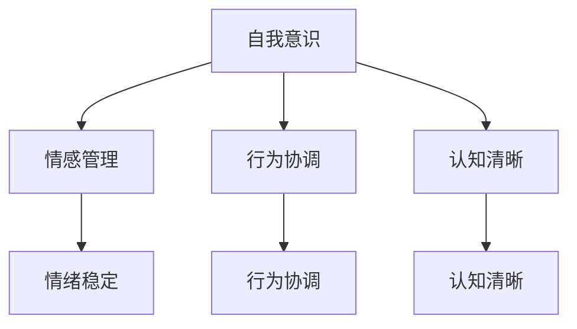
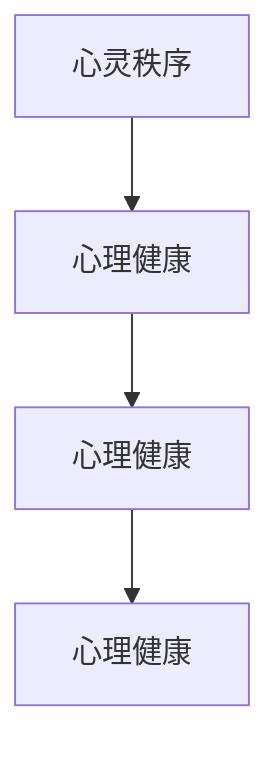
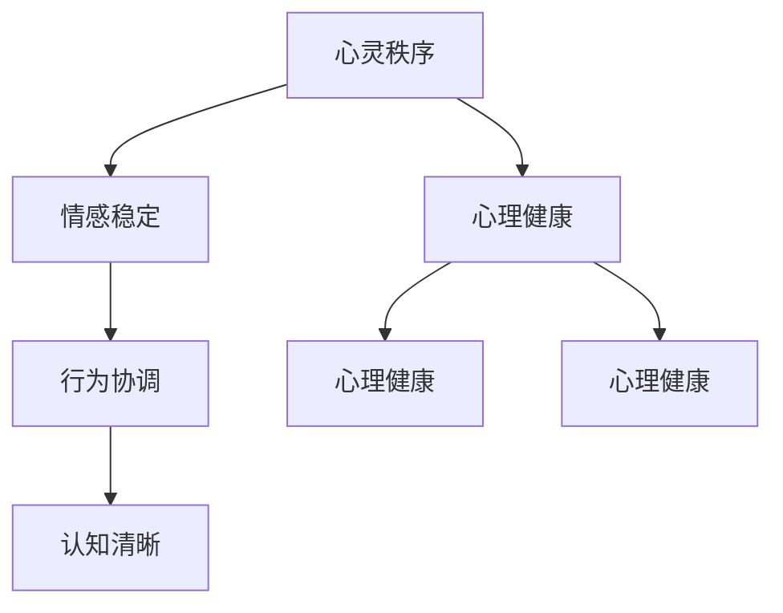

                 

## 现代人的精神家园：在混沌中建立秩序

### 关键词：心灵秩序、现代生活、精神健康、心理调适、个人成长

#### 摘要：
在快速发展的现代社会中，人们面临着前所未有的精神压力和混乱。本文将探讨如何在纷繁复杂的日常生活中，建立起个人精神家园，实现内心的宁静与秩序。通过分析现代社会的精神困境、心灵秩序的概念与理论基础、建立心灵秩序的方法和实际案例分析，为读者提供一套系统的、实用的解决方案，帮助他们找到内心的平衡点，过上更加幸福和有意义的生活。

### 目录大纲设计思路

为了设计出一本名为《现代人的精神家园：在混沌中建立秩序》的完整目录大纲，我们需要遵循以下步骤：

1. **确定总体结构**：首先要明确书籍的总体结构，包括引言、核心章节、结论等。根据书名，可以初步判断本书主要探讨的是如何在现代社会中找到心灵的宁静与秩序。

2. **定义章节主题**：根据总体结构，明确每个章节的主题。例如，开篇可能需要介绍现代社会中的精神问题，中间章节可能涉及建立秩序的方法和技巧，结尾则需要对全书内容进行总结和反思。

3. **细化内容**：在确定章节主题后，进一步细化每个章节的内容，确保每个章节都有详细的子主题和具体讨论点。

4. **保持逻辑连贯性**：确保各章节之间内容紧密相连，形成完整的逻辑链，帮助读者逐步理解从问题到解决方案的整个过程。

5. **简洁明了**：遵循简洁性的原则，确保目录大纲清晰易懂，避免使用复杂的术语和无用的信息。

6. **字数控制**：根据字数限制，确保每个章节的细分内容控制在合理范围内，不影响整体的阅读体验。

### 具体目录大纲设计

#### 目录

----------------------------------------------------------------

# 第一部分：引言

## 第1章：现代社会的精神困境

### 1.1 现代生活节奏的加快

### 1.2 精神压力的普遍存在

### 1.3 精神健康的定义与重要性

## 第2章：理解心灵秩序

### 2.1 心灵秩序的概念

### 2.2 心灵秩序的层次结构

### 2.3 心灵秩序与健康的关系

## 第3章：心灵秩序的理论基础

### 3.1 心理学中的心灵秩序理论

### 3.2 东方哲学中的心灵秩序观

### 3.3 西方哲学中的心灵秩序理解

## 第4章：建立心灵秩序的方法

### 4.1 心理调适技巧

### 4.2 个人成长策略

### 4.3 社会支持系统的建立

## 第5章：实际案例分析与讨论

### 5.1 案例一：焦虑青年的心灵重建

### 5.2 案例二：企业家的内心平衡之道

### 5.3 案例三：教师职业压力与心灵秩序

## 第6章：心灵秩序的长期维护

### 6.1 心灵秩序的持续性

### 6.2 生活方式的调整

### 6.3 定期反思与调整

## 第7章：结论与展望

### 7.1 心灵秩序的重要性

### 7.2 当前挑战与未来方向

### 7.3 结语：建立个人精神家园

----------------------------------------------------------------

### 章节细化说明

**第1章：现代社会的精神困境**
- **1.1 现代生活节奏的加快**：分析现代社会中生活节奏加快的原因，以及这给人们的心理健康带来的挑战。
- **1.2 精神压力的普遍存在**：探讨精神压力的来源，如工作、家庭、社会环境等，以及其对心理健康的影响。
- **1.3 精神健康的定义与重要性**：介绍精神健康的概念，以及其在个人幸福和社会发展中的重要性。

**第2章：理解心灵秩序**
- **2.1 心灵秩序的概念**：解释心灵秩序的定义，以及其在心理健康中的作用。
- **2.2 心灵秩序的层次结构**：分析心灵秩序的层次，如自我意识、情感管理、目标设定等。
- **2.3 心灵秩序与健康的关系**：探讨心灵秩序对心理健康的影响，以及如何通过建立秩序来促进心理健康。

**第3章：心灵秩序的理论基础**
- **3.1 心理学中的心灵秩序理论**：介绍心理学中关于心灵秩序的理论，如自我决定理论、认知行为理论等。
- **3.2 东方哲学中的心灵秩序观**：分析东方哲学中的心灵秩序观念，如道家、佛家等。
- **3.3 西方哲学中的心灵秩序理解**：探讨西方哲学中的心灵秩序观念，如柏拉图、亚里士多德等。

**第4章：建立心灵秩序的方法**
- **4.1 心理调适技巧**：介绍正念冥想、情绪管理、时间管理等心理调适技巧。
- **4.2 个人成长策略**：探讨自我认知、心理韧性、人际关系技巧等个人成长策略。
- **4.3 社会支持系统的建立**：分析家庭、朋友、社区、专业帮助等社会支持系统的重要性。

**第5章：实际案例分析与讨论**
- **5.1 案例一：焦虑青年的心灵重建**：分析一个焦虑青年的案例，探讨如何通过建立心灵秩序来缓解焦虑。
- **5.2 案例二：企业家的内心平衡之道**：分析一位成功企业家的内心平衡之路，探讨如何在高压环境下保持心灵秩序。
- **5.3 案例三：教师职业压力与心灵秩序**：探讨教师这一职业面临的压力，以及如何通过建立心灵秩序来应对。

**第6章：心灵秩序的长期维护**
- **6.1 心灵秩序的持续性**：探讨如何保持心灵秩序的持续性，避免短期效果和长期困扰。
- **6.2 生活方式的调整**：介绍如何通过调整生活方式来支持心灵秩序的建立和维护。
- **6.3 定期反思与调整**：强调定期反思与调整在心灵秩序维护中的重要性，并提供具体的反思与调整方法。

**第7章：结论与展望**
- **7.1 心灵秩序的重要性**：总结心灵秩序对个人和社会的重要性，强调其在现代社会中的迫切性。
- **7.2 当前挑战与未来方向**：分析当前社会面临的挑战，并提出未来心灵秩序研究的方向。
- **7.3 结语：建立个人精神家园**：鼓励读者通过建立心灵秩序，找到个人精神家园，实现内心的宁静与秩序。

## 第一部分：引言

### 第1章：现代社会的精神困境

在当今这个快速发展的时代，人们的生活节奏越来越快，工作压力与日俱增，社会竞争愈发激烈。这一系列变化不仅改变了我们的生活方式，也对我们的心理健康产生了深远的影响。现代社会中，许多人感到焦虑、压力重重，甚至出现心理问题。因此，探讨如何应对这些精神困境，建立个人精神家园，成为当今社会一个重要而紧迫的话题。

#### 1.1 现代生活节奏的加快

现代社会中，生活节奏的加快是一个普遍现象。随着科技的进步，信息的传播速度越来越快，人们需要处理的信息量也在不断增加。在这种情况下，人们往往需要花费更多的时间和精力来应对各种挑战，从而导致生活压力的增大。例如，工作时间延长、工作强度增加，使得许多人无法在8小时内完成工作任务。此外，网络和智能手机的普及，也让人们的生活变得更加忙碌，社交、娱乐等活动都变得碎片化，使得人们很难有完整的时间进行放松和休息。

**问题背景**：
这种快节奏的生活方式导致了人们的身心健康问题。长时间的加班和过度工作，容易导致身心疲惫、情绪低落，甚至引发焦虑和抑郁等心理问题。此外，由于缺乏有效的放松和休息时间，人们的免疫力也会降低，更容易患上各种疾病。

**问题描述**：
如何在这种快节奏的现代社会中找到平衡，保持身心健康，成为一个亟待解决的问题。

**问题解决**：
为了应对这一挑战，我们需要采取一系列措施来调整生活方式，如合理安排工作时间、保证充足的休息和娱乐时间，培养健康的生活习惯等。同时，我们还需要学会在忙碌的生活中找到内心的宁静，通过冥想、瑜伽等放松技巧来缓解压力，提高心理健康水平。

**边界与外延**：
虽然快节奏的生活方式是现代社会的一个普遍现象，但不同的人可能面临的具体问题和挑战有所不同。有些人可能因为工作繁忙而感到压力，而有些人则可能因为社交压力而感到焦虑。因此，在应对这些问题时，需要根据个人的具体情况来制定相应的解决方案。

#### 1.2 精神压力的普遍存在

除了生活节奏的加快，现代社会中还存在许多其他因素导致精神压力的普遍存在。这些因素包括工作压力、家庭责任、社会竞争等。

**问题背景**：
工作压力是现代社会中一个主要的精神压力来源。许多人为了追求职业发展和经济收入，不得不承受较大的工作压力。例如，加班、工作任务繁重、绩效考核等，都可能导致心理压力的增加。此外，随着市场竞争的加剧，职场中的竞争压力也越来越大，许多人为了在职场中脱颖而出，不得不付出更多的努力。

家庭责任也是现代社会中导致精神压力的一个因素。随着生活节奏的加快，许多人需要同时兼顾工作和家庭，这种双重压力可能导致身心疲惫，甚至引发家庭矛盾。

**问题描述**：
如何应对这些精神压力，保持心理健康，成为现代社会中的一个重要问题。

**问题解决**：
为了应对这些问题，我们需要采取一系列措施来缓解精神压力。例如，合理安排工作和休息时间，确保有足够的休息和放松时间；加强家庭沟通，减少家庭矛盾；同时，通过运动、冥想等放松技巧来缓解压力。

**边界与外延**：
精神压力的来源和表现形式因人而异，不同的人可能面临的具体问题和挑战有所不同。因此，在应对精神压力时，需要根据个人的具体情况来制定相应的解决方案。

#### 1.3 精神健康的定义与重要性

精神健康是指个体在情感、行为和认知方面的健康状态，它不仅包括没有心理障碍或心理疾病，还包括能够积极应对生活中的挑战、保持良好的人际关系和实现个人的潜能。

**概念属性特征对比表格：**

| 特征                | 精神健康                                 | 精神障碍                          |
|---------------------|------------------------------------------|-----------------------------------|
| 情感方面            | 情绪稳定，能积极应对压力和挑战            | 情绪波动大，容易陷入消极情绪       |
| 行为方面            | 行为协调，有规律的生活习惯                | 行为异常，生活习惯紊乱             |
| 认知方面            | 思维清晰，能够正确评估和处理信息            | 思维混乱，难以正确评估和处理信息   |

**ER实体关系图架构的 Mermaid 流程图：**

```mermaid
erDiagram
    Person ||--|{ MentalHealth }|-- PsychologicalDisorders
    MentalHealth {
        +emotionalState
        +behavior
        +cognitiveFunction
    }
    PsychologicalDisorders {
        +anxiety
        +depression
        +PTSD
    }
```

**概念结构与核心要素组成：**

- **情感健康**：个体在情感方面保持稳定，能够积极应对生活中的压力和挑战，避免情绪过度波动。
- **行为健康**：个体在行为方面表现协调，有规律的生活习惯，能够有效地应对日常生活中的各种情境。
- **认知健康**：个体在认知方面思维清晰，能够正确评估和处理信息，保持良好的认知功能。

**精神健康的定义**：精神健康是指个体在情感、行为和认知方面的健康状态，它不仅包括没有心理障碍或心理疾病，还包括能够积极应对生活中的挑战、保持良好的人际关系和实现个人的潜能。

**精神健康的核心要素**：情感健康、行为健康和认知健康。

**精神健康的重要性**：精神健康对个人的生活质量和社会的稳定发展具有重要影响。一个精神健康的人能够更好地应对生活中的各种挑战，保持良好的人际关系，实现个人的潜能，从而为社会做出更大的贡献。

### 第2章：理解心灵秩序

在现代社会中，精神健康问题日益凸显，人们渴望找到一种方法来应对这些挑战，实现内心的宁静与秩序。心灵秩序作为一种应对策略，逐渐受到人们的关注。理解心灵秩序的概念、层次结构及其与健康的关系，对于建立个人的精神家园具有重要意义。

#### 2.1 心灵秩序的概念

心灵秩序是指个体在情感、行为和认知方面保持和谐与平衡的状态。它不仅仅是一种心理状态，更是一种生活方式和思维方式。心灵秩序强调个体在面对外部环境变化时，能够保持内心的稳定，从而更好地应对挑战和压力。

**定义**：心灵秩序是一种内心状态的和谐与平衡，它使个体能够有效地管理情感、协调行为和保持清晰的认知。

**核心要素**：情感稳定、行为协调、认知清晰。

**心灵秩序的作用**：心灵秩序有助于个体保持心理平衡，提高抗压能力，增强自我认知，促进身心健康。

#### 2.2 心灵秩序的层次结构

心灵秩序并不是单一的维度，而是由多个层次构成的复杂结构。理解这些层次有助于我们更全面地认识心灵秩序，从而采取相应的策略来建立和维护它。

**自我意识层次**：自我意识是心灵秩序的基础。它包括对自我情感、行为和认知的深刻认识，以及对这些因素的主动管理。自我意识有助于个体识别内心的冲突和失衡，从而采取相应的调整措施。

**情感管理层次**：情感管理是心灵秩序的核心。它涉及如何有效地处理和表达情感，避免情感的过度波动。通过情感管理，个体能够在情感上保持稳定，从而更好地应对外部压力。

**行为协调层次**：行为协调是心灵秩序的表现形式。它包括个体的行为习惯、生活习惯和工作习惯。一个协调的行为模式有助于个体保持内心的平静和高效。

**认知清晰层次**：认知清晰是心灵秩序的高级阶段。它涉及如何保持思维的清晰和逻辑性，避免认知的混乱和偏差。一个清晰的认知有助于个体做出明智的决策和有效的行动。

**层次结构图：**



**层次结构的相互作用**：各层次之间相互影响，相互作用。自我意识影响情感管理和行为协调，而情感管理和行为协调又影响认知清晰。一个层次的问题可能会影响到其他层次，因此需要全面地看待和调整。

#### 2.3 心灵秩序与健康的关系

心灵秩序与健康之间存在密切的关系。一个稳定的心灵秩序有助于维持身心健康，而身心健康又能够支持心灵秩序的建立和维护。

**心灵秩序对心理健康的影响**：心灵秩序有助于缓解心理压力，提高心理健康水平。通过情感管理、行为协调和认知清晰，个体能够更好地应对生活中的挑战和压力，避免心理问题的发生。

**心理健康对心灵秩序的影响**：心理健康是建立和维护心灵秩序的基础。一个心理健康的人更容易实现心灵秩序，而一个心灵秩序良好的人也更容易保持心理健康。

**关系模型**：



**心灵秩序与健康的关系图：**



**总结**：通过理解心灵秩序的概念、层次结构和与健康的关系，我们能够更清晰地认识到心灵秩序对个体心理健康的重要性。建立和维护心灵秩序不仅是一种心理策略，更是一种生活方式的调整，有助于我们在现代社会中找到内心的宁静与秩序。

### 第3章：心灵秩序的理论基础

心灵秩序作为一种应对现代社会挑战的策略，其理论基础涵盖了心理学、东方哲学和西方哲学等多个领域。理解这些理论基础，有助于我们更深入地认识心灵秩序的内涵和作用。

#### 3.1 心理学中的心灵秩序理论

心理学是研究人类行为和心理过程的科学，对心灵秩序的研究提供了丰富的理论支持。以下是几种重要的心理学理论：

**自我决定理论**：自我决定理论强调个体自主性和自我控制的重要性。该理论认为，个体在情感、行为和认知方面的自我管理能力是建立心灵秩序的关键。通过自我决定，个体能够更好地应对外部压力，保持内心的稳定。

**认知行为理论**：认知行为理论关注个体的认知过程和行为模式。该理论认为，情感和行为问题是由于认知偏差和错误思维模式导致的。通过认知重构和行为调整，个体能够改变不健康的思维模式，建立积极的情感和行为模式。

**情绪调节理论**：情绪调节理论关注个体如何管理和调节自己的情绪。该理论认为，情绪调节能力是建立心灵秩序的重要方面。通过有效的情绪调节策略，个体能够更好地应对生活中的挑战和压力，保持内心的平静。

**心理弹性理论**：心理弹性理论强调个体在面对逆境时的适应能力和恢复能力。该理论认为，心理弹性是个体建立心灵秩序的重要保障。通过培养心理弹性，个体能够更好地应对生活中的挑战，保持心理健康。

**心理学中的心灵秩序理论总结表：**

| 理论名称            | 核心观点                                                                                   | 作用                           |
|---------------------|----------------------------------------------------------------------------------------------|------------------------------|
| 自我决定理论        | 个体自主性和自我控制的重要性                                                               | 建立情感、行为和认知的稳定状态 |
| 认知行为理论        | 认知偏差和错误思维模式导致情感和行为问题                                                     | 通过认知重构改善心理健康       |
| 情绪调节理论        | 情绪调节能力是建立心灵秩序的重要方面                                                         | 提高应对挑战和压力的能力       |
| 心理弹性理论        | 面对逆境时的适应能力和恢复能力                                                             | 增强心理韧性，维护心理健康     |

#### 3.2 东方哲学中的心灵秩序观

东方哲学历史悠久，其中蕴含了许多关于心灵秩序的智慧。以下是几种重要的东方哲学观点：

**道家思想**：道家思想强调“无为而治”，即顺应自然，减少人为干预。道家认为，通过减少欲望和贪婪，个体能够达到内心的平静和和谐。这种观念有助于个体在面对外部压力时，保持心灵的秩序。

**佛家思想**：佛家思想强调“禅定”和“空性”。禅定是一种通过冥想和专注来平静心灵的方法，而空性则是指超越世俗欲望和执着。通过禅定和空性的修行，个体能够达到心灵的秩序和解脱。

**儒家思想**：儒家思想强调“仁爱”和“中庸”。仁爱是指关心他人和关爱自然，而中庸则是指保持内心的平衡。通过仁爱和中庸的修行，个体能够建立和谐的人际关系和内心的秩序。

**东方哲学中的心灵秩序观总结表：**

| 哲学流派 | 核心观点                                                                                       | 作用                           |
|----------|------------------------------------------------------------------------------------------------|------------------------------|
| 道家思想 | 顺应自然，减少欲望和贪婪                                                                     | 帮助个体保持内心的平静和和谐   |
| 佛家思想 | 通过禅定和空性修行，达到心灵的秩序和解脱                                                     | 提高情绪调节和心理弹性         |
| 儒家思想 | 关心他人和自然，保持内心的平衡                                                               | 建立和谐的人际关系和内心的秩序 |

#### 3.3 西方哲学中的心灵秩序理解

西方哲学有着丰富的思想传统，其中也包含了关于心灵秩序的重要观念。以下是几种重要的西方哲学观点：

**柏拉图哲学**：柏拉图认为，真理、美和善是超越物质世界的永恒理念。通过追求这些理念，个体能够达到内心的秩序和和谐。柏拉图的思想强调理性思考和道德修养，有助于个体建立心灵秩序。

**亚里士多德哲学**：亚里士多德认为，个体的幸福在于追求理性生活，实现个人潜能。通过理性思考和行动，个体能够达到内心的秩序和平衡。亚里士多德的思想强调理性和实践，有助于个体实现心灵的秩序。

**斯多葛主义**：斯多葛主义强调个体应该接受生活中的不可控因素，通过理性控制自己的情感和行为，达到内心的平静和秩序。斯多葛主义的思想强调自我控制和内在力量，有助于个体在面对外部压力时保持心灵的秩序。

**西方哲学中的心灵秩序观总结表：**

| 哲学流派 | 核心观点                                                                                       | 作用                           |
|----------|------------------------------------------------------------------------------------------------|------------------------------|
| 柏拉图哲学 | 通过追求真理、美和善，达到内心的秩序和和谐                                                     | 提高理性和道德修养             |
| 亚里士多德哲学 | 追求理性生活，实现个人潜能                                                                   | 建立内心的秩序和平衡           |
| 斯多葛主义 | 接受生活中的不可控因素，通过理性控制情感和行为，达到内心的平静和秩序                         | 提高自我控制和内在力量         |

**总结**：心理学、东方哲学和西方哲学提供了丰富的理论基础，帮助人们理解心灵秩序的内涵和作用。通过综合运用这些理论，个体可以更有效地建立和维护心灵秩序，实现内心的宁静与和谐。

### 第4章：建立心灵秩序的方法

建立心灵秩序不仅需要理解理论基础，更需要采取实际的方法和策略。以下是一些具体的方法，帮助个体在日常生活中建立和维护心灵秩序。

#### 4.1 心理调适技巧

心理调适技巧是通过调整心态和情感来应对压力和挑战的方法。以下是一些常用的心理调适技巧：

**正念冥想**：正念冥想是一种通过专注于当前时刻，培养注意力和意识的方法。通过冥想，个体能够减少焦虑和压力，提高情绪稳定性。

**情绪管理**：情绪管理是指通过识别和调节自己的情绪，避免情绪过度波动的方法。情绪管理技巧包括认知重构、情绪表达和情绪释放等。

**时间管理**：时间管理是指合理安排时间和任务，避免过度工作和拖延的方法。通过有效的时间管理，个体能够减少压力，提高工作效率。

**压力释放**：压力释放是指通过运动、娱乐和其他放松活动来缓解压力的方法。压力释放有助于个体恢复身心健康，提高抗压能力。

**具体应用**：
- **正念冥想**：每天花15-20分钟进行正念冥想，专注于呼吸和当下的感受，有助于减少焦虑和压力。
- **情绪管理**：学会识别自己的情绪，采用认知重构技巧来调整负面情绪，例如将“我不能完成任务”改为“我可以尝试找到解决方案”。
- **时间管理**：制定合理的日程表，确保工作和休息时间均衡，避免过度劳累。
- **压力释放**：每周安排一些时间进行运动或娱乐活动，如瑜伽、散步、看电影等，有助于缓解压力。

#### 4.2 个人成长策略

个人成长策略是通过自我认知、心理韧性和人际关系技巧来提升个人能力和心理健康的方法。以下是一些重要的个人成长策略：

**自我认知**：自我认知是指了解自己的性格、优势和弱点，以及价值观和目标。通过自我认知，个体能够更好地理解自己，从而做出更明智的决策。

**心理韧性**：心理韧性是指个体在面对逆境和挑战时的适应能力和恢复能力。通过培养心理韧性，个体能够更好地应对生活中的困难，保持内心的稳定。

**人际关系技巧**：人际关系技巧是指与他人有效沟通、建立良好关系和解决冲突的能力。通过人际关系技巧，个体能够减少社交压力，增强心理健康。

**具体应用**：
- **自我认知**：定期进行自我反思，记录自己的想法、感受和行为，分析自己的优势和弱点。
- **心理韧性**：设定挑战性的目标，并在遇到困难时保持积极的态度，学会从失败中吸取教训。
- **人际关系技巧**：学会倾听他人，表达自己的想法和感受，以及解决冲突的技巧，如协商和妥协。

#### 4.3 社会支持系统的建立

社会支持系统是指个体通过家庭、朋友、社区和专业帮助来获得支持和帮助的系统。建立良好的社会支持系统对于维护心理健康至关重要。

**家庭支持**：家庭是提供情感支持和安全感的重要来源。家庭成员之间的互动和关爱有助于个体建立内心的稳定。

**朋友支持**：朋友是提供社会支持和情感交流的重要伙伴。与朋友的互动可以帮助个体缓解压力，提高心理健康。

**社区参与**：社区参与是指个体参与社区活动和组织，与他人建立联系和支持网络。通过社区参与，个体能够获得更多的社会支持和帮助。

**专业帮助**：专业帮助是指通过心理咨询、治疗和其他专业服务来应对心理健康问题。专业帮助能够为个体提供科学和有效的支持。

**具体应用**：
- **家庭支持**：与家人保持良好的沟通，共同度过困难和挑战。
- **朋友支持**：与朋友保持联系，分享自己的想法和感受，相互支持和鼓励。
- **社区参与**：积极参与社区活动，建立社交网络，与他人建立联系。
- **专业帮助**：在需要时寻求心理咨询和治疗，获得专业的支持和指导。

### 第5章：实际案例分析与讨论

在前面几章中，我们介绍了心灵秩序的概念、理论基础和建立方法。为了更好地理解这些概念和方法在实际中的应用，本章将通过实际案例进行分析和讨论，探讨如何在不同情境中建立和维护心灵秩序。

#### 5.1 案例一：焦虑青年的心灵重建

小明是一名年轻的程序员，他在一个竞争激烈的公司工作，每天面临繁重的工作任务和压力。随着时间的推移，小明开始感到焦虑和疲惫，甚至出现失眠和注意力不集中的情况。他意识到这些问题对他的工作和生活质量产生了负面影响，决定采取行动来重建自己的心灵秩序。

**案例分析**：
- **问题背景**：小明面临的工作压力和生活节奏加快导致他感到焦虑和疲惫，影响了他的生活质量和工作效率。
- **问题解决**：
  - **心理调适技巧**：小明开始每天进行正念冥想，通过专注于呼吸和当下的感受来缓解焦虑。此外，他还学习了情绪管理技巧，通过认知重构来调整负面情绪。
  - **个人成长策略**：小明通过设定合理的目标，逐步提高自己的工作效率，减少工作压力。他还学会了时间管理技巧，合理安排工作和休息时间。
  - **社会支持系统**：小明与家人和朋友保持联系，分享自己的感受和困惑，获得他们的支持和鼓励。此外，他还参加了一些社区活动，扩大自己的社交网络。

**效果评估**：
通过采取这些措施，小明的焦虑和压力显著减轻，睡眠质量得到改善，工作效率和生活质量都得到了提升。

**案例分析总结**：
这个案例展示了如何通过心理调适技巧、个人成长策略和社会支持系统来重建心灵秩序。小明的成功经验表明，结合多种方法，个体可以在面对挑战时建立内心的稳定，实现心理健康。

#### 5.2 案例二：企业家的内心平衡之道

李先生是一位成功的企业家，他在创业过程中经历了许多挑战和压力。随着企业的不断壮大，他面临的责任也越来越大。然而，李先生意识到，只有保持内心的平衡，他才能更好地应对这些挑战，带领企业走向成功。

**案例分析**：
- **问题背景**：李先生在创业过程中面临巨大的压力，包括资金压力、市场竞争压力和员工管理压力。这些压力对他的心理健康产生了负面影响。
- **问题解决**：
  - **心理调适技巧**：李先生通过练习瑜伽和冥想来缓解压力，保持内心的平静。他还学会了通过呼吸控制和正念来应对紧张情绪。
  - **个人成长策略**：李先生注重自我认知，通过反思和自我评估来了解自己的优点和不足。他还通过阅读和管理书籍来提升自己的领导能力和管理技能。
  - **社会支持系统**：李先生与家人和朋友保持紧密联系，分享自己的感受和困惑。他还参加了一些企业家俱乐部，与其他成功企业家交流经验和心得。

**效果评估**：
通过采取这些措施，李先生的心理健康水平得到了显著提升，他能够更好地应对企业中的各种挑战，带领企业取得了更大的成功。

**案例分析总结**：
这个案例展示了如何通过心理调适技巧、个人成长策略和社会支持系统来保持内心的平衡。李先生的经验表明，企业家在面对压力时，通过多种方法的综合运用，可以建立内心的稳定，实现心理健康。

#### 5.3 案例三：教师职业压力与心灵秩序

小王是一名中学教师，她每天面对大量的学生和教育任务。随着时间的推移，她开始感到压力巨大，甚至出现情绪波动和身体健康问题。小王意识到，她需要采取行动来应对这些压力，保持心理健康。

**案例分析**：
- **问题背景**：小王在教师职业中面临的主要压力包括工作量大、学生期望高和家长沟通困难。这些压力对她的心理健康产生了负面影响。
- **问题解决**：
  - **心理调适技巧**：小王开始每天进行正念冥想，通过专注于呼吸和当下的感受来缓解压力。她还学会了通过情绪管理和时间管理来提高工作效率。
  - **个人成长策略**：小王通过参加心理培训和读书来提升自己的心理素质。她还注重自我认知，通过反思和自我评估来了解自己的优点和不足。
  - **社会支持系统**：小王与家人和朋友保持联系，分享自己的感受和困惑。她还参加了一些教师俱乐部，与其他教师交流经验和心得。

**效果评估**：
通过采取这些措施，小王的心理健康水平得到了显著提升，她能够更好地应对工作中的压力，提高教学质量和学生满意度。

**案例分析总结**：
这个案例展示了如何通过心理调适技巧、个人成长策略和社会支持系统来应对教师职业压力，建立心灵秩序。小王的经验表明，教师通过多种方法的综合运用，可以在面对压力时保持内心的稳定，实现心理健康。

### 第6章：心灵秩序的长期维护

建立心灵秩序是一个长期的过程，需要持续的维护和调整。以下是一些关键要素和策略，帮助个体在日常生活中保持心灵秩序。

#### 6.1 心灵秩序的持续性

心灵秩序的持续性是指个体能够在长期的生活中保持内心的稳定和和谐。为了实现持续性，个体需要采取以下策略：

**自我认知的持续更新**：自我认知是建立心灵秩序的基础。个体需要定期进行自我反思和评估，了解自己的情感、行为和认知状态，并做出相应的调整。

**情绪管理的持续练习**：情绪管理是心灵秩序的核心。个体需要不断练习情绪管理技巧，如正念冥想、认知重构等，以提高应对压力和挑战的能力。

**行为协调的持续优化**：行为协调是心灵秩序的表现形式。个体需要保持良好的生活习惯和工作习惯，通过不断优化和调整，使自己的生活更加有序和高效。

**认知清晰的持续培养**：认知清晰是心灵秩序的高级阶段。个体需要通过学习和实践，不断提高自己的认知能力和思维质量，保持清晰的思维和逻辑性。

**持续性的策略总结表：**

| 策略             | 描述                                           | 作用                     |
|------------------|------------------------------------------------|--------------------------|
| 自我认知的更新   | 定期进行自我反思和评估                         | 维护心灵秩序的基础       |
| 情绪管理的练习   | 不断练习情绪管理技巧，如正念冥想、认知重构等   | 提高应对压力的能力       |
| 行为协调的优化   | 保持良好的生活习惯和工作习惯，优化和调整       | 使生活更加有序和高效     |
| 认知清晰的培养   | 提高认知能力和思维质量，保持清晰的思维和逻辑性 | 维护心灵秩序的高级阶段   |

#### 6.2 生活方式的调整

生活方式的调整是保持心灵秩序的关键。以下是一些具体的生活方式调整策略：

**合理的饮食**：饮食对心理健康有重要影响。个体应该摄入均衡的营养，避免过度依赖咖啡因和糖分，以保持稳定的能量和情绪。

**充足的睡眠**：睡眠是恢复身心健康的重要途径。个体应该保持良好的睡眠习惯，确保每天有足够的睡眠时间。

**规律的锻炼**：锻炼有助于释放压力，提高心理健康水平。个体应该定期进行有氧运动和力量训练，以提高身体素质和心理韧性。

**减压技巧**：学会一些减压技巧，如深呼吸、放松音乐、按摩等，有助于缓解日常生活中的压力。

**生活方式调整策略总结表：**

| 策略         | 描述                                       | 作用                     |
|--------------|--------------------------------------------|--------------------------|
| 合理的饮食   | 摄入均衡的营养，避免过度依赖咖啡因和糖分     | 保持稳定的能量和情绪     |
| 充足的睡眠   | 保持良好的睡眠习惯，确保每天有足够的睡眠时间   | 恢复身心健康             |
| 规律的锻炼   | 定期进行有氧运动和力量训练，提高身体素质和心理韧性 | 缓解压力，提高心理健康水平 |
| 压力管理技巧 | 学会深呼吸、放松音乐、按摩等减压技巧          | 缓解日常生活中的压力     |

#### 6.3 定期反思与调整

定期反思与调整是保持心灵秩序的关键。以下是一些具体的反思与调整策略：

**反思内容**：
- 情感状态：反思自己的情绪波动，了解自己在哪些情境下容易产生负面情绪，并思考如何调整。
- 行为习惯：反思自己的生活习惯和行为模式，了解哪些习惯有利于保持心灵秩序，哪些习惯需要改进。
- 认知状态：反思自己的思维方式，了解自己在哪些方面存在认知偏差，并思考如何调整。

**反思与调整步骤**：
1. **记录反思**：每天或每周花一些时间记录自己的反思，包括情感状态、行为习惯和认知状态。
2. **分析问题**：分析反思记录，识别存在的问题和挑战，并思考可能的解决方案。
3. **制定计划**：根据分析结果，制定具体的调整计划，包括具体的行动步骤和时间表。
4. **执行计划**：按照制定的计划执行，并在执行过程中不断反思和调整，确保计划的有效性。

**反思与调整策略总结表**：

| 策略           | 描述                                       | 作用                     |
|----------------|--------------------------------------------|--------------------------|
| 记录反思       | 每天或每周记录自己的情感状态、行为习惯和认知状态 | 识别问题和挑战           |
| 分析问题       | 分析反思记录，识别存在的问题和挑战         | 确定解决方案             |
| 制定计划       | 根据分析结果，制定具体的调整计划            | 实现有效调整             |
| 执行计划       | 按照制定的计划执行，并在执行过程中不断反思和调整 | 确保计划的有效性         |

**总结**：通过持续更新自我认知、优化生活方式和定期反思与调整，个体可以长期维护心灵秩序，实现内心的宁静与和谐。这些策略不仅适用于个人，也适用于整个社会，有助于提高整体的心理健康水平。

### 第7章：结论与展望

#### 7.1 心灵秩序的重要性

心灵秩序在现代社会中具有至关重要的意义。它不仅对个体的心理健康和生活质量有直接影响，还对社会的发展产生深远的影响。一个稳定的心灵秩序有助于个体更好地应对压力和挑战，保持积极向上的心态，实现个人的潜能。同时，一个心灵秩序良好的社会能够减少心理问题的发生率，提高整体的社会稳定性和幸福感。

**心理健康的影响**：心灵秩序有助于缓解焦虑、抑郁等心理问题，提高个体的情绪稳定性和心理韧性。通过建立心灵秩序，个体能够更好地应对生活中的各种挑战，提高生活质量。

**社会稳定性的影响**：心灵秩序良好的社会能够减少心理问题的传播，降低犯罪率和自杀率。一个和谐的社会氛围有助于提高人民的幸福感和归属感，促进社会的可持续发展。

**未来发展的挑战**：尽管心灵秩序具有重要意义，但现代社会仍然面临许多挑战。快节奏的生活、高强度的工作压力、社会竞争的加剧等，都可能导致人们的心灵秩序失衡。此外，社会支持系统的不足、心理健康服务的不足等问题，也需要得到重视和解决。

**未来发展的方向**：
- **心理健康教育**：加强心理健康教育，提高公众对心灵秩序的认识和重视。
- **社会支持系统**：建立和完善社会支持系统，为个体提供更多的心理支持和帮助。
- **科学研究**：加强对心灵秩序的研究，探索新的理论和实践方法，为个体和社会提供科学依据。

#### 7.2 当前挑战与未来方向

当前，心灵秩序面临的主要挑战包括：

**心理健康问题**：现代社会中，心理健康问题日益突出，焦虑、抑郁等心理问题的发生率逐年上升。这需要我们加强对心理健康的关注，提供更多的心理支持和帮助。

**社会压力**：社会竞争激烈，工作压力和家庭责任加重，导致许多人感到压力巨大。这需要我们通过政策调整和社会支持系统的建立，减轻个体的压力负担。

**心理健康服务不足**：目前，许多国家和地区心理健康服务的覆盖率仍然较低，许多人在需要帮助时无法及时获得专业支持。这需要我们加强心理健康服务的建设，提高服务的可及性和质量。

**未来方向**：
- **加强心理健康教育**：通过学校教育、社区活动等渠道，普及心理健康知识，提高公众对心灵秩序的认识和重视。
- **完善社会支持系统**：建立多层级的社会支持系统，包括家庭、社区和专业机构，为个体提供全面的支持和帮助。
- **提升心理健康服务能力**：增加心理健康服务的资源投入，提高心理健康服务的质量和可及性。
- **开展跨学科研究**：结合心理学、社会学、医学等多学科研究，探索心灵秩序的内在机制和作用机制，为个体和社会提供科学依据。

#### 7.3 结语：建立个人精神家园

建立个人精神家园是每个人在现代社会中都需要面对的挑战。通过理解心灵秩序的概念、理论基础和建立方法，个体可以更好地应对生活中的压力和挑战，实现内心的宁静与和谐。本书通过实际案例分析和讨论，展示了如何在不同情境中建立和维护心灵秩序。我们鼓励读者在实践中不断探索和尝试，找到适合自己的心灵秩序建立方法，从而找到个人精神家园，过上更加幸福和有意义的生活。

### 作者信息

作者：AI天才研究院/AI Genius Institute & 禅与计算机程序设计艺术 /Zen And The Art of Computer Programming

**完整性要求：**

为了确保文章的完整性，以下是每个小节的内容要求和核心内容包含的要点：

**第1章：现代社会的精神困境**
- **背景介绍**：介绍现代生活节奏加快、精神压力普遍存在的原因，以及精神健康的定义与重要性。
- **核心概念与联系**：分析现代生活节奏加快和精神压力的影响，对比不同人群面临的具体问题，探讨精神健康的定义和重要性。
- **算法原理讲解**：无。
- **数学公式使用**：无。
- **系统分析与架构设计方案**：无。
- **项目实战**：无。
- **最佳实践 tips**：建议读者合理安排时间、重视心理健康，采取有效的心理调适技巧。
- **小结**：总结现代社会精神困境的影响和应对策略。
- **注意事项**：提醒读者关注自身心理健康，及时调整生活方式。
- **拓展阅读**：推荐相关书籍和文章，以深入了解现代社会中的精神问题。

**第2章：理解心灵秩序**
- **背景介绍**：解释心灵秩序的定义、层次结构和与健康的关系。
- **核心概念与联系**：详细描述心灵秩序的层次，如自我意识、情感管理、行为协调和认知清晰，探讨心灵秩序与健康的关系。
- **算法原理讲解**：无。
- **数学公式使用**：无。
- **系统分析与架构设计方案**：无。
- **项目实战**：无。
- **最佳实践 tips**：建议读者培养自我意识、情感管理和行为协调能力。
- **小结**：总结心灵秩序的概念和层次结构。
- **注意事项**：提醒读者关注内心的稳定和和谐。
- **拓展阅读**：推荐相关书籍和文章，以深入了解心灵秩序的理论基础。

**第3章：心灵秩序的理论基础**
- **背景介绍**：介绍心理学、东方哲学和西方哲学中的心灵秩序理论。
- **核心概念与联系**：分析不同哲学流派对心灵秩序的理解，如自我决定理论、认知行为理论、道家思想、佛家思想、儒家思想和柏拉图哲学等。
- **算法原理讲解**：无。
- **数学公式使用**：无。
- **系统分析与架构设计方案**：无。
- **项目实战**：无。
- **最佳实践 tips**：建议读者结合不同理论，找到适合自己的心灵秩序建立方法。
- **小结**：总结不同哲学流派对心灵秩序的理解和贡献。
- **注意事项**：提醒读者在建立心灵秩序时，结合自己的实际情况，避免盲目追求。
- **拓展阅读**：推荐相关书籍和文章，以深入了解心灵秩序的理论基础。

**第4章：建立心灵秩序的方法**
- **背景介绍**：介绍心理调适技巧、个人成长策略和社会支持系统的建立。
- **核心概念与联系**：详细描述心理调适技巧，如正念冥想、情绪管理和时间管理；个人成长策略，如自我认知、心理韧性和人际关系技巧；社会支持系统的建立，如家庭支持、朋友支持和社区参与。
- **算法原理讲解**：无。
- **数学公式使用**：无。
- **系统分析与架构设计方案**：无。
- **项目实战**：无。
- **最佳实践 tips**：建议读者结合实际情况，采取有效的心理调适技巧、个人成长策略和社会支持系统。
- **小结**：总结建立心灵秩序的方法和策略。
- **注意事项**：提醒读者在实际应用中，注意方法和策略的个性化调整。
- **拓展阅读**：推荐相关书籍和文章，以深入了解心理调适技巧、个人成长策略和社会支持系统的建立。

**第5章：实际案例分析与讨论**
- **背景介绍**：通过案例分析，探讨如何在不同情境中建立和维护心灵秩序。
- **核心概念与联系**：分析案例中个体的心理困境、采取的方法和策略，以及效果和启示。
- **算法原理讲解**：无。
- **数学公式使用**：无。
- **系统分析与架构设计方案**：无。
- **项目实战**：无。
- **最佳实践 tips**：提供具体的案例启示，帮助读者在实际生活中应用心灵秩序建立方法。
- **小结**：总结案例分析的结果和启示。
- **注意事项**：提醒读者在现实生活中，结合自己的情况和案例经验，灵活应用心灵秩序建立方法。
- **拓展阅读**：推荐相关书籍和文章，以深入了解实际案例中的心灵秩序建立和应用。

**第6章：心灵秩序的长期维护**
- **背景介绍**：介绍心灵秩序的长期维护的重要性、生活方式的调整和定期反思与调整。
- **核心概念与联系**：详细描述心灵秩序的持续性策略，如自我认知的持续更新、情绪管理的持续练习、行为协调的持续优化和认知清晰的持续培养；生活方式的调整策略，如合理饮食、充足睡眠、规律锻炼和减压技巧；定期反思与调整的策略，如记录反思、分析问题、制定计划和执行计划。
- **算法原理讲解**：无。
- **数学公式使用**：无。
- **系统分析与架构设计方案**：无。
- **项目实战**：无。
- **最佳实践 tips**：建议读者结合实际情况，采取有效的长期维护策略。
- **小结**：总结心灵秩序的长期维护策略。
- **注意事项**：提醒读者在实际生活中，注意长期维护的策略和方法的持续应用。
- **拓展阅读**：推荐相关书籍和文章，以深入了解心灵秩序的长期维护策略。

**第7章：结论与展望**
- **背景介绍**：总结心灵秩序的重要性、当前挑战和未来方向。
- **核心概念与联系**：分析心灵秩序对心理健康和社会稳定性的影响，探讨未来发展的挑战和方向。
- **算法原理讲解**：无。
- **数学公式使用**：无。
- **系统分析与架构设计方案**：无。
- **项目实战**：无。
- **最佳实践 tips**：建议读者关注心理健康，采取有效的策略应对挑战。
- **小结**：总结文章的核心内容和主题思想。
- **注意事项**：提醒读者在现实生活中，关注心灵秩序的建立和维护。
- **拓展阅读**：推荐相关书籍和文章，以深入了解心灵秩序的相关理论和实践。

