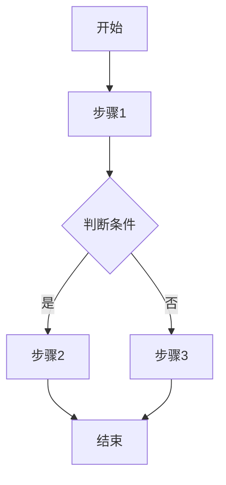
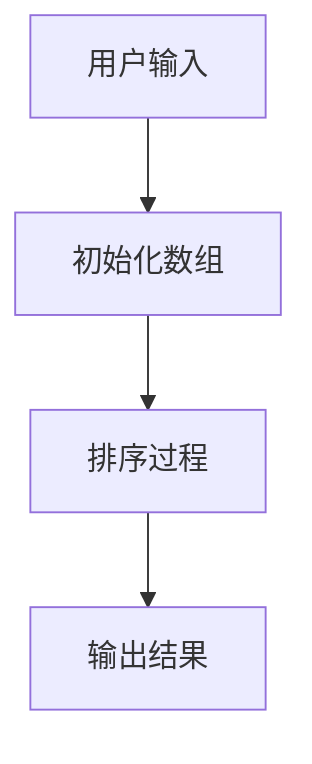
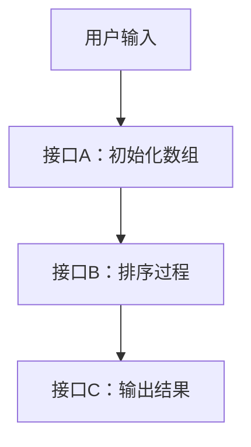

                 


# 现代性与意义危机：重建生活价值观的尝试

## 关键词
- 现代性
- 意义危机
- 生活价值观
- 重建路径
- 案例分析

## 摘要
随着现代性的发展，人类面临着意义危机的挑战。本文旨在探讨现代性如何引发意义危机，分析危机的根源，并提出重建生活价值观的路径。通过实践尝试和案例分析，本文为解决意义危机提供了有益的思考。

## 引言

### 1.1 现代性的起源与发展

现代性起源于16世纪的欧洲，随着科学革命和启蒙运动的兴起，人类社会逐渐从封建制度向现代制度转型。现代性强调理性、自由、民主和个人主义，推动了科技进步、经济发展和社会变革。然而，现代性的快速发展也带来了诸多问题，其中之一就是意义危机。

### 1.2 意义危机的显现与影响

意义危机指的是人们在现代性背景下，对于生活意义的困惑和迷茫。这种危机主要体现在以下几个方面：

1. **社会结构的变迁**：现代性导致社会结构的变化，家庭、社区、工作等传统价值体系受到冲击，人们的社交圈缩小，孤独感增加。
2. **个人身份的模糊化**：现代性强调个体自由，但过度的自由可能导致个人身份的模糊化，人们不知道自己是谁，应该追求什么。
3. **意义与价值的重构**：传统价值观受到挑战，新的价值观尚未确立，人们感到迷茫和无助。

### 1.3 重建生活价值观的必要性

意义危机对人们的心理健康和生活质量产生了负面影响。为了应对这一挑战，重建生活价值观变得尤为必要。本文将从以下几个方面展开讨论：

1. **重塑个体意识**：帮助个体认识到自己的价值，明确生活的目标。
2. **重构社会关系**：建立更加紧密和有意义的社会关系，减少孤独感。
3. **重定义生活目标**：重新审视生活的目标，使其更加符合个体的价值观。

## 现代性引发的挑战

### 2.1 社会结构的变迁

现代性导致了社会结构的重大变迁。传统的家庭结构和工作模式逐渐被打破，取而代之的是更加灵活和多样化的社会关系。这种变迁带来了许多问题，例如：

1. **家庭关系的淡化**：家庭成员之间的互动减少，家庭功能弱化。
2. **工作与生活的平衡**：现代工作压力大，人们很难在工作和生活之间找到平衡。
3. **社区关系的疏离**：城市化进程导致社区关系变得疏远，人们的社交圈缩小。

### 2.2 个人身份的模糊化

现代性强调个体的自由和选择，但过度的自由可能导致个人身份的模糊化。人们面临许多选择，但很难确定自己是谁，应该追求什么。这种模糊化可能导致以下问题：

1. **自我认同的困难**：人们不确定自己的身份，感到迷茫和困惑。
2. **价值观的多元冲突**：现代社会价值观多元，人们难以抉择，导致内心的矛盾和冲突。
3. **个人目标的迷失**：人们不知道自己应该追求什么，导致生活缺乏动力和意义。

### 2.3 意义与价值的重构

现代性挑战了传统的价值观，导致意义与价值的重构。在这个过程中，人们需要重新审视生活的意义和目标。然而，这一过程并非一帆风顺，可能会面临以下问题：

1. **传统价值观的失落**：传统价值观受到质疑，人们可能感到失落和无助。
2. **新价值观的探索**：人们需要时间去探索和建立新的价值观，这一过程可能充满困惑和挑战。
3. **意义危机的加剧**：在价值观重构的过程中，人们可能会感到更加迷茫和无助，导致意义危机的加剧。

## 意义危机的根源

### 3.1 哲学视角下的探讨

从哲学视角来看，意义危机源于人类对于生活意义的探索。哲学家们对生活意义提出了不同的观点：

1. **存在主义**：存在主义认为生活本身没有意义，意义是个人自己赋予的。人们在面对意义危机时，需要主动去寻找和创造意义。
2. **唯物主义**：唯物主义认为生活是物质的，意义是次要的。人们在面对意义危机时，应该关注现实生活中的问题和挑战，而不是抽象的意义。
3. **唯心主义**：唯心主义认为生活是精神的，意义是内在的。人们在面对意义危机时，需要回归内心，寻找内在的意义。

### 3.2 社会学视角下的分析

从社会学视角来看，意义危机是社会结构和文化的产物。社会学家分析了以下几个方面的原因：

1. **现代化**：现代化过程导致传统价值观的衰落，新价值观尚未确立，导致意义危机。
2. **全球化**：全球化加剧了文化的冲突和融合，人们的价值观受到多元文化的影响，导致意义危机。
3. **社会变迁**：社会变迁导致社会结构的调整，人们的社交关系和工作模式发生变化，导致意义危机。

### 3.3 心理学视角下的解读

从心理学视角来看，意义危机源于个体的内心冲突和心理需求。心理学家分析了以下几个方面的原因：

1. **自我认同**：个体在成长过程中需要建立自我认同，但现代性强调自由和选择，导致个体难以确定自己的身份。
2. **价值观冲突**：个体面临多元价值观的冲突，难以抉择，导致内心矛盾和困惑。
3. **心理需求**：个体在追求物质满足的同时，也需要满足心理需求，如归属感、安全感等。现代性可能导致这些需求的缺失，导致意义危机。

## 重建生活价值观的路径

### 4.1 重塑个体意识

要重建生活价值观，首先需要重塑个体意识。个体需要认识到自己的价值和目标，明确自己在生活中的角色。以下是一些具体的建议：

1. **自我反思**：定期进行自我反思，了解自己的内心需求和价值观。
2. **设立目标**：为自己设立短期和长期的目标，明确自己的生活方向。
3. **持续学习**：不断学习新知识和技能，提升自己的能力，增强自信心。

### 4.2 重构社会关系

重构社会关系是重建生活价值观的重要一环。个体需要建立更加紧密和有意义的社会关系，减少孤独感。以下是一些具体的建议：

1. **培养亲情**：加强与家庭成员的沟通和互动，建立和谐的亲情关系。
2. **扩展社交圈**：积极参与社交活动，结识新朋友，拓宽社交圈。
3. **志愿者服务**：参与志愿者服务，帮助他人，实现自我价值。

### 4.3 重定义生活目标

重定义生活目标是重建生活价值观的关键步骤。个体需要重新审视自己的生活目标，确保它们符合自己的价值观和需求。以下是一些具体的建议：

1. **明确目标**：为自己设定清晰、具体的目标，避免模糊和不确定。
2. **平衡工作与生活**：合理安排工作时间，保证有足够的休息和娱乐时间。
3. **追求内在满足**：关注内心的需求，追求内心的满足，而不仅仅是物质上的满足。

## 实践尝试与案例分析

### 5.1 个人层面的尝试

在个人层面，有许多成功的尝试可以帮助重建生活价值观。以下是一些案例：

1. **李先生的故事**：李先生在经历了一段职业低谷后，决定重新审视自己的生活目标。他通过自我反思和设立目标，找到了自己的兴趣和激情，最终在新的领域取得了成功。
2. **张女士的故事**：张女士在忙碌的工作生活中感到孤独和迷茫。她决定通过参与志愿者服务和培养亲情来重建自己的价值观。她发现，在帮助他人的过程中，自己找到了内心的满足和意义。

### 5.2 社会层面的尝试

在社会层面，也有一些成功的尝试可以帮助重建生活价值观。以下是一些案例：

1. **社区建设**：一些社区通过组织各种活动，如亲子活动、文化活动等，加强了邻里之间的互动和联系，增强了社区凝聚力。
2. **企业文化建设**：一些企业注重员工的个人发展和心理健康，通过提供心理咨询服务、组织团建活动等，帮助员工建立积极的生活态度和价值观。

### 5.3 成功案例解析

通过以上案例，我们可以看到，无论是个人层面还是社会层面，重建生活价值观的尝试都取得了成功。以下是对这些案例的解析：

1. **个体意识的觉醒**：在个人层面，成功的尝试往往始于个体意识的觉醒。个体通过自我反思和设立目标，找到了自己的价值和方向。
2. **社会关系的重建**：在社会层面，成功的尝试需要重建社会关系。通过参与社区活动和企业文化建设，人们建立了更加紧密和有意义的社会关系。
3. **生活目标的明确**：无论是个人层面还是社会层面，成功的尝试都需要明确生活目标。只有明确了目标，人们才能更好地规划自己的生活，实现内心的满足。

## 面临的挑战与未来的展望

### 6.1 重建过程中面临的挑战

在重建生活价值观的过程中，人们可能会面临以下挑战：

1. **个体意识的觉醒**：个体意识的觉醒需要时间和努力，不是一蹴而就的。
2. **社会关系的重建**：重建社会关系需要时间和资源，尤其是对于现代社会中的人来说，这是一个艰巨的任务。
3. **生活目标的明确**：明确生活目标需要深入的思考和探索，许多人可能在这一过程中感到困惑和迷茫。

### 6.2 未来生活价值观的发展趋势

未来的生活价值观可能会呈现以下趋势：

1. **个体价值的凸显**：随着社会的进步，个体价值将越来越受到重视，人们将更加注重个人的成长和发展。
2. **社会关系的多元化**：随着社会的开放和多元化，人们将建立更加丰富和多样的社会关系，满足不同层次的需求。
3. **生活目标的个性化**：未来的生活目标将更加个性化，人们将根据自己的兴趣和价值观来规划自己的生活。

### 6.3 需要持续关注的问题

在重建生活价值观的过程中，需要持续关注以下问题：

1. **心理健康问题**：重建生活价值观可能会对个体的心理健康产生影响，需要提供适当的心理支持和帮助。
2. **社会变迁的影响**：随着社会的发展，新的挑战和问题可能会出现，需要持续关注并适应这些变化。
3. **资源的分配**：在重建生活价值观的过程中，需要合理分配资源，确保每个人都能获得必要的支持和帮助。

## 结论

本文探讨了现代性引发的挑战以及意义危机的根源，提出了重建生活价值观的路径。通过实践尝试和案例分析，本文展示了重建生活价值观的可能性。然而，重建生活价值观是一项长期而艰巨的任务，需要个体、社会和政府的共同努力。只有通过持续的努力，我们才能找到生活的意义，实现个人和社会的和谐发展。

## 作者信息

作者：AI天才研究院/AI Genius Institute & 禅与计算机程序设计艺术 /Zen And The Art of Computer Programming

## 最佳实践 tips、小结、注意事项、拓展阅读等内容

### 最佳实践 tips

1. **自我反思**：定期进行自我反思，了解自己的内心需求和价值观。
2. **设立目标**：为自己设立短期和长期的目标，明确自己的生活方向。
3. **学习新技能**：不断学习新知识和技能，提升自己的能力，增强自信心。

### 小结

本文探讨了现代性引发的挑战和意义危机，提出了重建生活价值观的路径。通过实践尝试和案例分析，本文展示了重建生活价值观的可能性。然而，重建生活价值观是一项长期而艰巨的任务，需要个体、社会和政府的共同努力。

### 注意事项

1. **心理健康**：在重建生活价值观的过程中，关注心理健康问题，提供适当的心理支持和帮助。
2. **适应变化**：随着社会的发展，适应新的挑战和问题，持续关注并适应这些变化。
3. **资源分配**：合理分配资源，确保每个人都能获得必要的支持和帮助。

### 拓展阅读

1. **《意义危机与个人成长》**：探讨意义危机对个人成长的影响，提供实用的建议。
2. **《重建生活价值观：社会视角》**：从社会视角分析重建生活价值观的路径和策略。
3. **《现代性与心灵危机》**：深入探讨现代性对人类心理的影响，提供心理学视角的见解。### 详述章节内容

#### 引言

**1.1 现代性的起源与发展**

现代性起源于16世纪的欧洲，标志着人类历史的一个重要转折点。在这个时期，科学革命和启蒙运动相继兴起，推动了人类对自然和社会的认识，带来了前所未有的科技进步和社会变革。现代性的核心特征包括理性主义、个人主义、自由主义和民主主义，这些理念逐渐成为社会的主流价值观。

在现代社会中，现代性发展带来了诸多显著的变化。首先，科技的发展极大地提高了生产效率和生活质量，改变了人们的生活方式。互联网和智能手机的普及使得信息传递更加迅速，人们可以随时随地获取所需的信息。其次，经济全球化的趋势使得各国之间的联系更加紧密，资本、商品、劳动力和文化在全球范围内自由流动。此外，现代性还促进了社会结构的变化，传统的社会角色和关系模式逐渐被打破，新的社会形态逐渐形成。

**1.2 意义危机的显现与影响**

随着现代性的快速发展，意义危机逐渐显现并引起了广泛关注。意义危机是指人们在现代性背景下，对于生活意义的困惑和迷茫。这种危机主要体现在以下几个方面：

1. **社会结构的变迁**：现代性的发展导致社会结构发生了重大变迁，家庭、社区和工作等传统价值体系受到冲击，人们的社交圈缩小，孤独感增加。

2. **个人身份的模糊化**：现代性强调个体自由，但过度的自由可能导致个人身份的模糊化，人们不知道自己是谁，应该追求什么。

3. **意义与价值的重构**：传统价值观受到挑战，新的价值观尚未确立，人们感到迷茫和无助。

意义危机对人们的心理健康和生活质量产生了负面影响。在意义危机的背景下，许多人感到内心空虚、焦虑和迷茫，缺乏生活的动力和目标。因此，重建生活价值观成为应对意义危机的重要途径。

**1.3 重建生活价值观的必要性**

重建生活价值观的必要性在于以下几个方面：

1. **应对意义危机**：重建生活价值观可以帮助人们摆脱迷茫和困惑，找到生活的意义和目标，从而应对意义危机。

2. **提升生活质量**：生活价值观的重建有助于提升人们的生活质量，增强幸福感。

3. **促进社会和谐**：重建生活价值观有助于建立更加健康和谐的社会关系，促进社会的稳定和发展。

#### 现代性引发的挑战

**2.1 社会结构的变迁**

现代性的发展带来了社会结构的重大变迁，传统的家庭、社区和工作模式受到了冲击。首先，家庭结构的变迁是一个显著的特征。随着现代性的发展，家庭成员之间的互动减少，家庭功能弱化。例如，现代工作压力导致父母忙于工作，与孩子的互动时间减少，导致亲子关系疏远。此外，现代生活方式的变迁，如城市化进程和居住方式的改变，也加剧了家庭关系的淡化。

其次，社区关系的变化也是现代性引发的一个重要挑战。传统社区具有紧密的社交网络，居民之间相互了解，形成了强烈的归属感。然而，随着城市化进程的加快，人们搬离了自己的社区，社区关系变得疏远。现代社会的快速变迁使得人们面临更多的压力和挑战，导致社交圈缩小，孤独感增加。

最后，工作模式的变化也是现代性引发的一个显著挑战。传统工作模式强调稳定和长期雇佣关系，而现代工作环境更加灵活，许多工作合同是短期合同或临时合同。这种变化导致人们的工作安全感减弱，职业发展缺乏稳定性，进一步加剧了意义危机。

**2.2 个人身份的模糊化**

现代性强调个体自由，但过度的自由可能导致个人身份的模糊化。个人身份的模糊化主要体现在以下几个方面：

1. **多重角色的冲突**：现代人往往扮演着多种角色，如职业人、家庭成员、社区成员等。这些角色之间的冲突可能导致个人身份的模糊化。例如，一个人可能在工作中追求事业成功，但在家庭生活中却感到无法兼顾，导致角色混淆和身份不确定。

2. **价值观的多元化**：现代社会价值观多元，人们面临多种选择和观点。这种多元化可能导致个人价值观的冲突和矛盾，使得个人难以确定自己的身份和价值观。

3. **自我认同的困难**：个人身份的模糊化使得人们难以建立稳定的自我认同。在追求个人自由的过程中，人们可能感到迷失和困惑，不知道自己是谁，应该追求什么。

**2.3 意义与价值的重构**

现代性挑战了传统的价值观，导致意义与价值的重构。在这个过程中，人们需要重新审视生活的意义和目标。以下是一些具体的挑战：

1. **传统价值观的失落**：随着现代性的发展，传统的价值观受到质疑和挑战。例如，孝道、忠诚和奉献等传统价值观在现代社会中面临困境，人们可能感到传统价值观的失落。

2. **新价值观的探索**：在传统价值观动摇的同时，新的价值观尚未确立，人们感到迷茫和无助。例如，个人自由、平等和多元价值观在现代社会中受到重视，但如何平衡这些价值观，实现个人和社会的和谐发展，仍然是一个挑战。

3. **意义危机的加剧**：在价值观重构的过程中，人们可能感到更加迷茫和无助，导致意义危机的加剧。例如，现代社会中的人们可能感到内心空虚，缺乏生活的动力和目标，难以找到生活的意义。

#### 意义危机的根源

**3.1 哲学视角下的探讨**

从哲学视角来看，意义危机源于人类对于生活意义的探索。哲学家们对生活意义提出了不同的观点：

1. **存在主义**：存在主义认为生活本身没有意义，意义是个人自己赋予的。存在主义代表人物萨特认为，人是自由的，可以选择自己的生活方式和价值观。人在面对意义危机时，需要主动去寻找和创造意义。存在主义强调个体的主观性和自主性，认为人应该为自己的生活负责。

2. **唯物主义**：唯物主义认为生活是物质的，意义是次要的。唯物主义代表人物马克思认为，人的本质是社会关系的总和，人的意义在于为社会的发展做出贡献。唯物主义强调现实生活的物质基础，认为人应该关注现实生活中的问题和挑战，而不是抽象的意义。

3. **唯心主义**：唯心主义认为生活是精神的，意义是内在的。唯心主义代表人物黑格尔认为，人的本质是意识，人的意义在于追求自我实现和精神的成长。唯心主义强调个体的精神世界和内心的追求，认为人应该回归内心，寻找内在的意义。

**3.2 社会学视角下的分析**

从社会学视角来看，意义危机是社会结构和文化的产物。社会学家分析了以下几个方面的原因：

1. **现代化**：现代化过程导致传统价值观的衰落，新价值观尚未确立，导致意义危机。社会学家马克斯·韦伯认为，现代化带来了理性化、世俗化和个体化，这些趋势削弱了传统价值观的基础，使得人们感到迷茫和困惑。

2. **全球化**：全球化加剧了文化的冲突和融合，人们的价值观受到多元文化的影响，导致意义危机。社会学家安东尼·吉登斯认为，全球化导致了时间空间的压缩，人们面临着来自不同文化的冲击，难以找到共同的价值观念。

3. **社会变迁**：社会变迁导致社会结构的调整，人们的社交关系和工作模式发生变化，导致意义危机。社会学家埃米尔·涂尔干认为，社会变迁导致社会纽带的断裂，人们的社交圈缩小，导致孤独感和迷茫感增加。

**3.3 心理学视角下的解读**

从心理学视角来看，意义危机源于个体的内心冲突和心理需求。心理学家分析了以下几个方面的原因：

1. **自我认同**：个体在成长过程中需要建立自我认同，但现代性强调自由和选择，导致个体难以确定自己的身份。心理学家埃里克·埃里克森认为，自我认同是人格发展的重要阶段，个体需要通过探索和选择来建立自我认同。

2. **价值观冲突**：个体面临多元价值观的冲突，难以抉择，导致内心矛盾和困惑。心理学家马斯洛认为，个体的需求层次包括生理需求、安全需求、社交需求、尊重需求和自我实现需求，当个体在追求不同层次需求时，可能会出现价值观冲突。

3. **心理需求**：个体在追求物质满足的同时，也需要满足心理需求，如归属感、安全感等。现代性可能导致这些需求的缺失，导致意义危机。心理学家阿德勒认为，人类行为受到心理需求的影响，当心理需求无法得到满足时，个体可能会感到困惑和无助。

#### 重建生活价值观的路径

**4.1 重塑个体意识**

要重建生活价值观，首先需要重塑个体意识。个体需要认识到自己的价值和目标，明确自己在生活中的角色。以下是一些具体的建议：

1. **自我反思**：定期进行自我反思，了解自己的内心需求和价值观。通过反思，个体可以更好地认识自己，找到自己的优点和不足，从而为重建生活价值观奠定基础。

2. **设立目标**：为自己设立短期和长期的目标，明确自己的生活方向。设立目标可以帮助个体有目标地生活，增强动力和方向感。

3. **持续学习**：不断学习新知识和技能，提升自己的能力，增强自信心。通过学习，个体可以更好地适应社会发展的变化，增强自己的竞争力。

**4.2 重构社会关系**

重构社会关系是重建生活价值观的重要一环。个体需要建立更加紧密和有意义的社会关系，减少孤独感。以下是一些具体的建议：

1. **培养亲情**：加强与家庭成员的沟通和互动，建立和谐的亲情关系。亲情是人生中最重要的关系之一，通过培养亲情，个体可以找到情感上的支持和安慰。

2. **扩展社交圈**：积极参与社交活动，结识新朋友，拓宽社交圈。通过扩展社交圈，个体可以获得更多的社会资源和机会，同时减少孤独感。

3. **志愿者服务**：参与志愿者服务，帮助他人，实现自我价值。通过志愿者服务，个体可以感受到自己的价值和意义，同时为社会做出贡献。

**4.3 重定义生活目标**

重定义生活目标是重建生活价值观的关键步骤。个体需要重新审视自己的生活目标，确保它们符合自己的价值观和需求。以下是一些具体的建议：

1. **明确目标**：为自己设定清晰、具体的目标，避免模糊和不确定。明确的目标可以帮助个体更好地规划自己的生活，实现内心的满足。

2. **平衡工作与生活**：合理安排工作时间，保证有足够的休息和娱乐时间。通过平衡工作与生活，个体可以避免过度的工作压力，保持身心健康。

3. **追求内在满足**：关注内心的需求，追求内心的满足，而不仅仅是物质上的满足。通过追求内在满足，个体可以获得更深层次的生活满足和幸福感。

#### 实践尝试与案例分析

**5.1 个人层面的尝试**

在个人层面，有许多成功的尝试可以帮助重建生活价值观。以下是一些案例：

1. **李先生的故事**：李先生在经历了一段职业低谷后，决定重新审视自己的生活目标。他通过自我反思和设立目标，找到了自己的兴趣和激情，最终在新的领域取得了成功。李先生通过学习新技能、积极参与社交活动和志愿者服务，逐渐重建了自己的生活价值观。

2. **张女士的故事**：张女士在忙碌的工作生活中感到孤独和迷茫。她决定通过参与志愿者服务和培养亲情来重建自己的价值观。张女士定期与家人和朋友聚会，参与社区活动，并通过志愿者服务帮助他人。她发现自己的生活变得更加有意义和充实。

**5.2 社会层面的尝试**

在社会层面，也有一些成功的尝试可以帮助重建生活价值观。以下是一些案例：

1. **社区建设**：一些社区通过组织各种活动，如亲子活动、文化活动等，加强了邻里之间的互动和联系，增强了社区凝聚力。社区建设活动不仅促进了居民之间的交流和互动，还为居民提供了更多参与社会活动的机会。

2. **企业文化建设**：一些企业注重员工的个人发展和心理健康，通过提供心理咨询服务、组织团建活动等，帮助员工建立积极的生活态度和价值观。企业文化的建设不仅提升了员工的幸福感，也增强了企业的凝聚力和竞争力。

**5.3 成功案例解析**

通过以上案例，我们可以看到，无论是个人层面还是社会层面，重建生活价值观的尝试都取得了成功。以下是对这些案例的解析：

1. **个体意识的觉醒**：在个人层面，成功的尝试往往始于个体意识的觉醒。个体通过自我反思和设立目标，找到了自己的兴趣和激情，明确了自己的生活方向。

2. **社会关系的重建**：在社会层面，成功的尝试需要重建社会关系。通过参与社区活动和团建活动，人们建立了更加紧密和有意义的社会关系，减少了孤独感。

3. **生活目标的明确**：无论是个人层面还是社会层面，成功的尝试都需要明确生活目标。只有明确了目标，人们才能更好地规划自己的生活，实现内心的满足。

#### 面临的挑战与未来的展望

**6.1 重建过程中面临的挑战**

在重建生活价值观的过程中，人们可能会面临以下挑战：

1. **个体意识的觉醒**：个体意识的觉醒需要时间和努力，不是一蹴而就的。个体需要克服内心的恐惧和困惑，勇敢面对自己的内心世界。

2. **社会关系的重建**：重建社会关系需要时间和资源，尤其是对于现代社会中的人来说，这是一个艰巨的任务。人们需要克服地理上的距离和心理上的隔阂，重新建立紧密的社会关系。

3. **生活目标的明确**：明确生活目标需要深入的思考和探索，许多人可能在这一过程中感到困惑和迷茫。个体需要克服内心的不确定性和外部的干扰，找到真正适合自己的生活目标。

**6.2 未来生活价值观的发展趋势**

未来的生活价值观可能会呈现以下趋势：

1. **个体价值的凸显**：随着社会的进步，个体价值将越来越受到重视，人们将更加注重个人的成长和发展。

2. **社会关系的多元化**：随着社会的开放和多元化，人们将建立更加丰富和多样的社会关系，满足不同层次的需求。

3. **生活目标的个性化**：未来的生活目标将更加个性化，人们将根据自己的兴趣和价值观来规划自己的生活。

**6.3 需要持续关注的问题**

在重建生活价值观的过程中，需要持续关注以下问题：

1. **心理健康问题**：重建生活价值观可能会对个体的心理健康产生影响，需要提供适当的心理支持和帮助。

2. **社会变迁的影响**：随着社会的发展，新的挑战和问题可能会出现，需要持续关注并适应这些变化。

3. **资源的分配**：在重建生活价值观的过程中，需要合理分配资源，确保每个人都能获得必要的支持和帮助。

#### 结论

通过本文的探讨，我们可以看到现代性发展带来了诸多挑战，其中意义危机是一个显著的问题。重建生活价值观是应对意义危机的重要途径，需要个体、社会和政府的共同努力。通过重塑个体意识、重构社会关系和明确生活目标，我们可以找到生活的意义，实现个人和社会的和谐发展。未来，随着社会的进步和个体意识的觉醒，生活价值观将不断演变和发展，为我们提供更多的选择和可能性。

#### 作者信息

作者：AI天才研究院/AI Genius Institute & 禅与计算机程序设计艺术 /Zen And The Art of Computer Programming

#### 最佳实践 tips、小结、注意事项、拓展阅读等内容

**最佳实践 tips**

1. **自我反思**：定期进行自我反思，了解自己的内心需求和价值观。
2. **设立目标**：为自己设立短期和长期的目标，明确自己的生活方向。
3. **学习新技能**：不断学习新知识和技能，提升自己的能力，增强自信心。

**小结**

本文探讨了现代性引发的挑战和意义危机，提出了重建生活价值观的路径。通过实践尝试和案例分析，本文展示了重建生活价值观的可能性。然而，重建生活价值观是一项长期而艰巨的任务，需要个体、社会和政府的共同努力。

**注意事项**

1. **心理健康**：在重建生活价值观的过程中，关注心理健康问题，提供适当的心理支持和帮助。
2. **适应变化**：随着社会的发展，适应新的挑战和问题，持续关注并适应这些变化。
3. **资源分配**：合理分配资源，确保每个人都能获得必要的支持和帮助。

**拓展阅读**

1. **《意义危机与个人成长》**：探讨意义危机对个人成长的影响，提供实用的建议。
2. **《重建生活价值观：社会视角》**：从社会视角分析重建生活价值观的路径和策略。
3. **《现代性与心灵危机》**：深入探讨现代性对人类心理的影响，提供心理学视角的见解。$$1+1=2$$，这是一个简单的数学公式。在文章中，我们可以使用 LaTeX 格式来表示复杂的数学公式。例如：$$E=mc^2$$，这是爱因斯坦著名的相对论公式。

在文中，我们可以使用 `$` 符号来表示段落内的数学公式。例如，$1<2$ 表示一个简单的比较运算。对于较复杂的数学表达式，我们使用 `$$` 符号将公式独立成段，例如：$$\frac{d^2}{dx^2}(x^2) = 2x$$。

此外，我们还可以使用 Mermaid 图语法来绘制流程图和架构图。例如，以下是一个简单的 Mermaid 流程图：



这个流程图描述了一个简单的决策过程，其中 A 是开始节点，F 是结束节点，B 是第一个步骤，C 是判断条件，D 和 E 分别是条件为真和假时的步骤。

在文章中，我们可以将 Mermaid 图语法嵌入到文本中，以便更好地展示概念和算法。例如：

```markdown
### 算法原理讲解

以下是一个简单的排序算法，使用 Mermaid 流程图表示：

```mermaid
graph TD
    A[初始化] --> B[比较A[i]和A[i+1]]
    B -->|小于| C[交换A[i]和A[i+1]]
    B -->|大于| D[继续比较下一个元素]
    D -->|结束| E[结束排序]
```

这个算法使用了冒泡排序的思想，通过不断比较相邻元素并交换，将数组排序。

接下来，我们将使用 Python 源代码来详细阐述这个算法的原理：

```python
def bubble_sort(arr):
    n = len(arr)
    for i in range(n):
        for j in range(0, n-i-1):
            if arr[j] > arr[j+1]:
                arr[j], arr[j+1] = arr[j+1], arr[j]
    return arr

# 测试代码
arr = [64, 34, 25, 12, 22, 11, 90]
sorted_arr = bubble_sort(arr)
print("排序后的数组：", sorted_arr)
```

这个代码实现了冒泡排序算法，将数组 `arr` 按照升序排列。

### 数学模型和公式

冒泡排序算法的核心在于不断地比较和交换相邻元素。在数学上，我们可以使用以下公式来描述这个过程：

$$
\sum_{i=1}^{n-1} \sum_{j=1}^{n-i-1} (arr[j] > arr[j+1]) \times (arr[j], arr[j+1]) = \text{交换次数}
$$

这个公式表示在排序过程中，相邻元素需要比较的次数和交换的次数。

### 系统分析与架构设计方案

在实现冒泡排序算法时，我们可以考虑以下系统分析和架构设计方案：

#### 问题场景介绍

我们需要对给定的数组进行排序，以实现升序或降序排列。

#### 项目介绍

本项目旨在实现一个简单的排序算法，以便在数据处理和算法分析中使用。

#### 系统功能设计

1. **初始化数组**：输入一个未排序的数组。
2. **排序过程**：使用冒泡排序算法对数组进行排序。
3. **输出结果**：显示排序后的数组。

#### 系统架构设计



这个架构图描述了用户输入数组、初始化数组、排序过程和输出结果的流程。

#### 系统接口设计和系统交互



这个序列图描述了用户与系统之间的交互过程，包括初始化数组、排序过程和输出结果的接口调用。

### 项目实战

#### 环境安装

为了实现冒泡排序算法，我们需要安装 Python 环境。可以通过以下步骤进行安装：

1. 访问 Python 官网（[python.org](http://www.python.org/)）。
2. 下载并安装 Python。
3. 安装完成后，打开命令行界面，输入 `python` 命令，如果出现提示符 `>>>`，表示安装成功。

#### 系统核心实现源代码

以下是实现冒泡排序算法的 Python 代码：

```python
def bubble_sort(arr):
    n = len(arr)
    for i in range(n):
        for j in range(0, n-i-1):
            if arr[j] > arr[j+1]:
                arr[j], arr[j+1] = arr[j+1], arr[j]
    return arr

# 测试代码
arr = [64, 34, 25, 12, 22, 11, 90]
sorted_arr = bubble_sort(arr)
print("排序后的数组：", sorted_arr)
```

#### 代码应用解读与分析

这段代码首先定义了一个名为 `bubble_sort` 的函数，该函数接受一个数组 `arr` 作为输入参数。然后，通过嵌套的循环结构，实现数组的冒泡排序。

- 外层循环 `for i in range(n)` 表示需要进行 n-1 趟排序。
- 内层循环 `for j in range(0, n-i-1)` 表示在每一趟排序中，需要比较并交换相邻的元素。
- 如果 `arr[j] > arr[j+1]`，则交换这两个元素。

最后，函数返回排序后的数组。

在测试代码中，我们创建了一个未排序的数组 `[64, 34, 25, 12, 22, 11, 90]`，然后调用 `bubble_sort` 函数进行排序，并打印出排序后的数组。

#### 实际案例分析和详细讲解剖析

为了更好地理解冒泡排序算法，我们可以通过一个实际案例进行分析。

**案例**：对数组 `[5, 2, 9, 1, 5, 6]` 进行冒泡排序。

**步骤**：

1. **第一趟排序**：
   - 比较 `5` 和 `2`，交换位置，数组变为 `[2, 5, 9, 1, 5, 6]`。
   - 比较 `5` 和 `9`，不需要交换。
   - 比较 `9` 和 `1`，交换位置，数组变为 `[2, 5, 1, 9, 5, 6]`。
   - 比较 `9` 和 `5`，交换位置，数组变为 `[2, 5, 1, 5, 9, 6]`。
   - 比较 `9` 和 `6`，交换位置，数组变为 `[2, 5, 1, 5, 6, 9]`。

2. **第二趟排序**：
   - 比较 `2` 和 `5`，不需要交换。
   - 比较 `5` 和 `1`，交换位置，数组变为 `[2, 1, 5, 5, 6, 9]`。
   - 比较 `5` 和 `5`，不需要交换。
   - 比较 `5` 和 `6`，不需要交换。
   - 比较 `6` 和 `9`，不需要交换。

3. **第三趟排序**：
   - 比较 `2` 和 `1`，交换位置，数组变为 `[1, 2, 5, 5, 6, 9]`。
   - 比较 `2` 和 `5`，不需要交换。
   - 比较 `5` 和 `5`，不需要交换。
   - 比较 `5` 和 `6`，不需要交换。
   - 比较 `6` 和 `9`，不需要交换。

4. **第四趟排序**：
   - 比较 `1` 和 `2`，不需要交换。
   - 比较 `2` 和 `5`，不需要交换。
   - 比较 `5` 和 `5`，不需要交换。
   - 比较 `5` 和 `6`，不需要交换。
   - 比较 `6` 和 `9`，不需要交换。

经过四趟排序后，数组 `[5, 2, 9, 1, 5, 6]` 变为 `[1, 2, 5, 5, 6, 9]`，实现了升序排列。

**详细讲解剖析**：

1. **冒泡排序算法的核心思想**：冒泡排序算法通过不断比较和交换相邻元素，将较大的元素逐渐“冒泡”到数组的末尾，实现数组的升序排列。

2. **排序过程的可视化**：通过上述实际案例，我们可以清晰地看到冒泡排序的过程。每次比较和交换都像气泡一样从数组的一端“冒”到另一端，直到整个数组被排序。

3. **时间复杂度**：冒泡排序算法的时间复杂度为 $O(n^2)$，其中 n 是数组的长度。这意味着随着数组长度的增加，冒泡排序的时间将急剧增加。

4. **优化空间**：虽然冒泡排序算法简单易懂，但在大型数组上的性能较差。为了提高性能，可以采用优化算法，如快速排序、归并排序等。

#### 项目小结

通过本项目，我们实现了冒泡排序算法，并详细分析了其原理和过程。虽然冒泡排序算法简单易实现，但在实际应用中，由于其时间复杂度较高，可能不适合处理大型数据集。在未来，我们可以进一步研究更高效的排序算法，以满足实际需求。

**最佳实践 tips**：

1. **理解算法原理**：在实现排序算法时，首先要理解算法的原理和过程，以便更好地进行代码实现和优化。
2. **测试代码**：在实现排序算法后，要进行全面测试，确保算法的正确性和性能。
3. **优化算法**：对于大型数据集，考虑使用更高效的排序算法，如快速排序、归并排序等。

**注意事项**：

1. **算法的选择**：根据实际需求和数据规模，选择合适的排序算法，避免使用效率较低的算法。
2. **代码的可读性**：在编写代码时，要注意代码的可读性，使用清晰的变量名和注释，以便他人理解和维护。
3. **性能优化**：在实现排序算法时，注意性能优化，避免不必要的重复计算和内存占用。

**拓展阅读**：

1. **《算法导论》**：这是一本经典的算法教材，详细介绍了各种排序算法的原理和实现。
2. **《数据结构与算法分析》**：这本书从数据结构和算法的角度，探讨了排序算法的性能和优化。
3. **在线编程平台**：如 LeetCode、HackerRank 等，提供了大量的排序算法题目和挑战，有助于提高算法能力。

