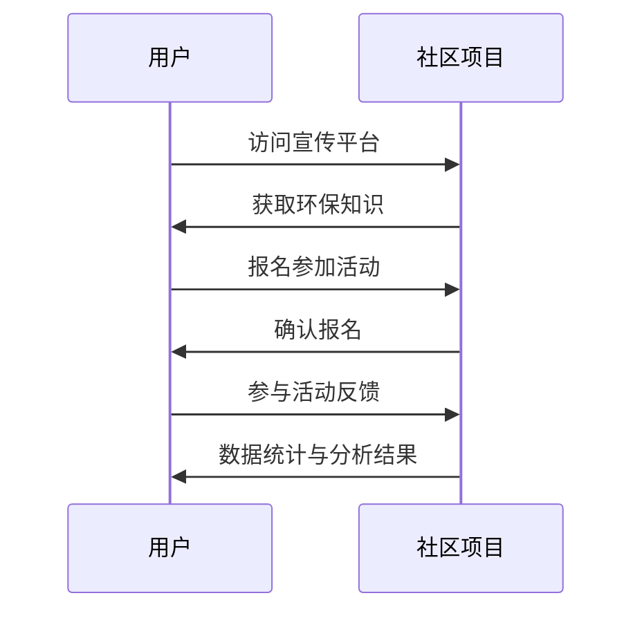
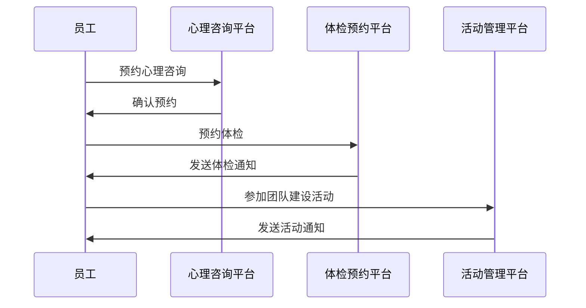

                 

# 现代性的困境：如何在意义的荒原中找到归属

关键词：现代性、困境、归属感、精神空虚、价值迷失、人际关系疏离

摘要：在现代社会中，现代性带来了许多问题，如精神空虚、价值迷失、人际关系疏离等，这些困境使得人们难以找到归属感。本文旨在通过深入分析现代性的困境，探讨如何在现代社会中找到个人归属感，并提供一些可行的解决方案。

## 第1章 引言与问题背景

### 1.1.1 问题背景

在当代社会，现代性带来了诸多问题。随着物质生活水平的提高，人们却感到内心空虚和孤独。社会快速变迁和多元化使得人们难以找到统一的价值体系。此外，人际关系也逐渐变得表面化和短暂，深层次的人际关系逐渐减少。这些困境使得人们难以找到归属感，成为现代社会的一个重要课题。

### 1.1.2 问题描述

现代性的困境主要包括以下几个方面：

1. **精神空虚**：随着物质生活水平的提高，人们却感到内心空虚和孤独。这种空虚感源于人们对物质追求的过度依赖，忽视了精神层面的需求。

2. **价值迷失**：现代社会的多元化和快速变迁使得人们难以找到统一的价值体系。在价值观多样性的背后，人们失去了对自身价值的认同，导致价值迷失。

3. **人际关系疏离**：现代社会中，人们之间的交往变得表面化和短暂。社交网络虽然使得人们之间的联系更加便捷，但同时也导致了人际关系的疏离。

### 1.1.3 问题解决

本书旨在通过探讨现代性的困境，帮助读者理解问题的根源，并提供一些可行的解决方案。具体来说，本书将从以下几个方面展开：

1. **理解困境**：深入分析现代性困境的成因和表现形式，帮助读者更好地认识问题。

2. **寻找归属**：探讨如何在现代社会中找到个人归属感，为读者提供一些实用的方法。

3. **实践探索**：结合实际案例，提供具体的方法和策略，帮助读者应对现代性困境。

### 1.1.4 边界与外延

本书主要关注以下几个方面：

1. **社会层面**：分析现代社会中普遍存在的一些问题，如物质主义、个人主义等。

2. **个人层面**：探讨个体如何在现代社会中找到自我认同和归属感。

3. **文化层面**：分析不同文化背景下，人们如何应对现代性困境。

### 1.1.5 概念结构与核心要素组成

现代性的困境和归属感这一课题涉及多个核心概念和要素，包括：

1. **现代性**：指现代社会的基本特征和发展趋势。

2. **困境**：指现代社会中普遍存在的问题和挑战。

3. **归属感**：指个体在社会中的归属感和认同感。

4. **价值体系**：指个体和社会所遵循的一系列价值观念。

## 第2章 核心概念与联系

### 2.1.1 现代性概念解析

现代性是一个广泛的概念，涉及社会、文化、经济等多个方面。其核心要素包括：

1. **物质主义**：追求物质财富和消费。

2. **个人主义**：强调个人自由和权利。

3. **全球化**：世界范围内的经济、政治和文化交流。

4. **技术进步**：科技的快速发展和应用。

### 2.1.2 困境概念解析

困境是指个体或社会面临的一系列挑战和问题。在现代性背景下，困境主要包括：

1. **精神空虚**：由于物质满足，个体内心的空虚和孤独感。

2. **价值迷失**：多元化和快速变迁带来的价值体系混乱。

3. **人际关系疏离**：社会交往的表面化和短暂化。

### 2.1.3 归属感概念解析

归属感是指个体在社会中的归属感和认同感。在现代性背景下，归属感的重要性愈发凸显，其核心要素包括：

1. **自我认同**：个体对自己的认同和接纳。

2. **社会认同**：个体对社会身份的认同和归属。

3. **文化认同**：个体对文化的认同和归属。

### 2.1.4 概念属性特征对比表格

| 概念       | 定义                                                         | 关系                                                         |
|------------|--------------------------------------------------------------|--------------------------------------------------------------|
| 现代性     | 社会发展的特定阶段，以物质主义、个人主义和技术进步为特征。 | 包括物质主义、个人主义、全球化、技术进步等子概念。         |
| 困境       | 个体或社会面临的一系列挑战和问题。                           | 包括精神空虚、价值迷失、人际关系疏离等子问题。             |
| 归属感     | 个体在社会中的归属感和认同感。                               | 包括自我认同、社会认同、文化认同等子要素。                 |

### 2.1.5 ER实体关系图架构

```mermaid
erDiagram
  现代性 --> 困境 : 包括
  现代性 --> 归属感 : 包括
  困境 --> 精神空虚 : 包括
  困境 --> 价值迷失 : 包括
  困境 --> 人际关系疏离 : 包括
  归属感 --> 自我认同 : 包括
  归属感 --> 社会认同 : 包括
  归属感 --> 文化认同 : 包括
```

### 第3章 现代性的困境解析

现代性的困境是现代社会中普遍存在的一种现象，它不仅影响了个体，也对社会整体产生了深远的影响。为了更好地理解这些问题，我们可以从以下几个方面进行深入分析。

### 3.1 精神空虚

精神空虚是指个体在物质生活得到满足的同时，内心感到空虚、孤独和无意义。这种困境主要源于以下几个方面：

1. **物质主义的泛滥**：现代社会中，物质主义占据了主导地位，人们过度追求物质财富和消费，而忽视了精神层面的需求。这种过度追求导致个体内心空虚。

2. **社交媒体的滥用**：社交媒体的普及使得人们更容易获取信息，但同时也使得人际关系变得表面化和短暂。个体在社交媒体上获得的是虚拟的满足感，而非真实的人际交往。

3. **工作压力**：现代社会中，工作压力不断增加，个体为了追求更高的收入和社会地位，不得不投入更多的时间和精力。这种高压状态使得个体缺乏时间和精力去关注自己的内心需求。

### 3.2 价值迷失

价值迷失是指个体在社会快速变迁和多元化背景下，难以找到统一的价值体系，导致个体对自身价值的认同感降低。这种困境主要表现在以下几个方面：

1. **价值观念的多元化**：现代社会中，价值观念日益多元化，个体面临着各种各样的价值观。这种多元化使得个体难以找到一个统一的价值观，从而导致价值迷失。

2. **社会变迁的影响**：社会快速变迁使得传统的价值观念受到冲击，新的价值观念尚未建立，导致个体在价值观念上的混乱。

3. **个体自我意识的觉醒**：随着社会的发展，个体自我意识逐渐觉醒，个体开始更加关注自己的需求和价值观。但这种觉醒也可能导致个体在价值观念上的迷茫和困惑。

### 3.3 人际关系疏离

人际关系疏离是指个体在社会交往中感到孤独和无助，缺乏深层次的人际关系。这种困境主要表现在以下几个方面：

1. **社交网络的负面影响**：虽然社交网络使得人们之间的联系更加便捷，但同时也导致了人际关系的表面化和短暂化。个体在社交网络上获得的社交体验并不能替代真实的人际交往。

2. **工作压力的影响**：现代社会中，工作压力不断增加，个体为了追求事业成功，往往忽略了与家人和朋友之间的交往。这种压力导致人际关系逐渐疏远。

3. **城市化进程**：城市化进程的加快使得人们的生活节奏加快，个体之间的交往时间减少。这种快速的生活节奏使得人际关系变得表面化和短暂化。

### 3.4 现代性困境的影响

现代性困境对个体和社会产生了深远的影响。对个体来说，精神空虚、价值迷失和人际关系疏离使得个体感到孤独和无助，影响了个体的心理健康和生活质量。对社会来说，现代性困境导致了社会信任感的下降，社会凝聚力的减弱，甚至可能引发社会矛盾和冲突。

### 3.5 现代性困境的解决思路

面对现代性困境，我们可以从以下几个方面寻找解决方案：

1. **提高个体的精神需求**：个体应该意识到精神需求的重要性，通过阅读、艺术、旅行等方式来满足自己的精神需求。

2. **构建健康的价值观**：个体应该树立正确的价值观，关注自身和社会的长远发展，而非仅仅追求短期的物质满足。

3. **强化人际关系**：个体应该重视与家人、朋友和同事之间的交往，建立深层次的人际关系，以增强社会凝聚力。

4. **社会制度的改革**：社会应该通过制度改革来减轻个体的工作压力，提高社会公平性，从而减少个体面临的精神压力。

### 3.6 小结

现代性困境是现代社会中普遍存在的一种现象，它对个体和社会都产生了深远的影响。为了解决这些问题，个体需要提高精神需求，构建健康的价值观，强化人际关系。同时，社会也需要通过制度改革来减轻个体的压力，提高社会公平性。只有个体和社会共同努力，才能摆脱现代性的困境，找到真正的归属感。

### 第4章 寻找归属感的路径

在现代社会中，归属感对于个体的心理健康和社会稳定至关重要。为了在意义的荒原中找到归属感，我们可以从以下几个角度进行探索和实践。

#### 4.1 自我认知

自我认知是找到归属感的起点。个体需要深入了解自己的价值观、兴趣和需求，明确自己的目标和追求。以下是一些步骤：

1. **自我反思**：定期花时间反思自己的行为、思想和感受，了解自己的内心世界。

2. **兴趣探索**：尝试不同的活动，发现自己真正热爱的事物，这些活动可以是艺术、运动、阅读等。

3. **目标设定**：为自己设定短期和长期目标，这些目标应该与自己的价值观和兴趣相符。

#### 4.2 社会参与

社会参与是建立归属感的重要途径。个体可以通过参与社区活动、志愿服务和社交团体来增强社会联系。

1. **社区活动**：参与社区组织的活动，如环保活动、文化节等，这有助于建立社区归属感。

2. **志愿服务**：通过志愿服务，个体可以体验到帮助他人的快乐，同时也能得到社会的认可和尊重。

3. **社交团体**：加入兴趣小组或专业组织，与他人分享经验和见解，建立深厚的人际关系。

#### 4.3 价值认同

价值认同是归属感的重要基础。个体需要找到与自己价值观相符的群体或组织。

1. **价值观澄清**：明确自己的核心价值观，如尊重、公正、同情等。

2. **寻找志同道合者**：在朋友、同事和社交网络中寻找与自己价值观相符的人，形成共同的价值认同。

3. **参与有意义的事业**：加入具有社会影响力的组织或项目，为实现共同的目标而努力。

#### 4.4 文化归属

文化归属是归属感的重要组成部分，尤其是在多元文化的社会中。

1. **文化认同**：了解和尊重自己的文化遗产，同时接纳其他文化的多样性和独特性。

2. **文化交流**：积极参与文化交流活动，增进对不同文化的理解和认同。

3. **文化传承**：通过教育和实践，传承和弘扬自己的文化遗产。

### 4.5 实践案例

以下是一个具体的实践案例，展示了如何通过以上方法找到归属感：

**案例：小明的社区参与**

小明是一名年轻的程序员，他在生活中感到孤独和迷茫。为了改变这种状况，他开始采取以下行动：

1. **自我认知**：小明通过反思自己的兴趣和需求，发现自己热爱编程和科技。他开始为自己设定学习目标，如掌握新编程语言、参与开源项目等。

2. **社会参与**：小明加入了当地的编程俱乐部，定期参加聚会和编程马拉松。通过与志同道合的人交流，他的社交圈子逐渐扩大，也获得了更多的技术支持和资源。

3. **价值认同**：小明参与了一个关注环境保护的社区项目，通过实际行动感受到自己对社会的贡献。他开始更加关注环境保护问题，并在日常生活中采取环保措施。

4. **文化归属**：小明通过参加文化交流活动，了解了不同文化的特色和价值观。他发现自己对亚洲文化特别感兴趣，并开始学习亚洲传统音乐和艺术。

通过以上实践，小明逐渐找到了自己的归属感。他在社区中建立了深厚的联系，实现了个人价值的认同，并在文化交流中找到了精神上的满足。

### 4.6 小结

寻找归属感是一个长期而复杂的过程，需要个体在自我认知、社会参与、价值认同和文化归属等多个方面进行努力。通过积极的实践和探索，个体可以在现代社会中找到属于自己的归属感，从而提升生活质量和社会幸福感。

### 第5章 实践探索与案例分析

为了更深入地理解现代性困境以及如何在其中找到归属感，我们可以通过一些具体的实践案例来探讨这一过程。以下是一些案例分析和详细讲解。

#### 5.1 案例一：社区项目——“绿色家园”

**背景介绍**：某城市的一群年轻人在面对环境污染和气候变化问题时，决定通过社区项目来推动环保行动。他们组织了一次名为“绿色家园”的社区项目，旨在提高居民对环保的认识和参与度。

**系统功能设计**：项目的主要功能包括：
1. **环保知识普及**：通过宣传册、讲座和社交媒体平台，向居民普及环保知识。
2. **环保行动倡议**：鼓励居民参与垃圾分类、节约用水和减少碳排放等环保行动。
3. **环保项目实施**：组织植树活动、清洁河道等实际行动。

**系统架构设计**：项目的系统架构包括以下几个方面：
1. **宣传平台**：用于发布环保知识和倡议。
2. **参与平台**：居民可以通过平台报名参加环保行动。
3. **数据统计与分析**：收集居民参与数据，分析环保行动的效果。

**系统接口设计和系统交互**：



**代码应用解读与分析**：以下是项目中一个简单的Python代码示例，用于统计居民参与活动的情况。

```python
# 统计居民参与情况
def count_participants(participants_list):
    count = 0
    for participant in participants_list:
        if participant['status'] == '参与':
            count += 1
    return count

# 假设的参与者列表
participants = [
    {'name': '张三', 'status': '参与'},
    {'name': '李四', 'status': '未参与'},
    {'name': '王五', 'status': '参与'}
]

# 调用统计函数
total_participants = count_participants(participants)
print(f"共有{total_participants}位居民参与了活动。")
```

**实际案例分析**：通过“绿色家园”项目，居民们不仅提高了环保意识，还积极参与了实际行动。项目数据分析显示，参与活动的人数逐年增加，社区环境得到了显著改善。

**详细讲解剖析**：该案例展示了如何通过具体的社区项目来应对现代性困境中的环境问题。项目的成功离不开以下几个关键要素：
1. **明确目标**：项目目标是提高居民环保意识和参与度。
2. **多渠道宣传**：通过多种宣传方式，确保信息传播的广度和深度。
3. **实际行动**：通过实际行动，让居民感受到环保行动的成效。
4. **数据反馈**：及时收集和分析数据，为项目的改进提供依据。

#### 5.2 案例二：企业员工关怀计划——“心灵港湾”

**背景介绍**：某大型企业在高速发展过程中，员工的工作压力和生活压力不断增加。为了提高员工的工作满意度和幸福感，企业决定实施“心灵港湾”员工关怀计划。

**系统功能设计**：项目的主要功能包括：
1. **心理咨询**：提供专业的心理咨询服务，帮助员工解决心理问题。
2. **健康体检**：定期组织健康体检，关注员工身体健康。
3. **团队建设**：组织团队建设活动，增强团队凝聚力和归属感。

**系统架构设计**：项目的系统架构包括以下几个方面：
1. **咨询平台**：用于员工预约心理咨询和查看咨询记录。
2. **体检预约**：员工可以通过平台预约健康体检。
3. **活动管理**：用于组织和管理团队建设活动。

**系统接口设计和系统交互**：



**代码应用解读与分析**：以下是项目中一个简单的Python代码示例，用于管理员工心理咨询预约。

```python
# 管理心理咨询预约
def add_appointment(appointments_list, appointment):
    appointments_list.append(appointment)
    return appointments_list

# 假设的预约列表
appointments = []

# 新的预约信息
new_appointment = {'name': '李四', 'date': '2023-10-15', 'status': '待确认'}

# 添加新的预约
appointments = add_appointment(appointments, new_appointment)
print(f"新预约已添加：{new_appointment}")
```

**实际案例分析**：通过“心灵港湾”项目，企业员工的心理健康水平得到了显著提高，工作满意度也明显上升。项目数据显示，心理咨询预约量逐年增加，团队建设活动的参与度不断提高。

**详细讲解剖析**：该案例展示了如何通过员工关怀计划来缓解现代性困境中的工作压力问题。项目的成功离不开以下几个关键要素：
1. **专业支持**：提供专业的心理咨询服务，帮助员工解决心理问题。
2. **健康关怀**：通过健康体检，关注员工身体健康。
3. **团队建设**：通过团队建设活动，增强团队凝聚力和归属感。

### 5.3 小结

通过以上两个案例，我们可以看到，在应对现代性困境中，找到归属感的路径是多样的。无论是通过社区项目提升环保意识，还是通过企业员工关怀计划缓解工作压力，关键在于明确目标、多渠道宣传、实际行动和数据反馈。通过这些实践，个体可以在现代社会中找到属于自己的归属感，提升生活质量和社会幸福感。

### 第6章 最佳实践与总结

在现代性的困境中找到归属感是一个复杂但必要的过程。以下是一些最佳实践和总结，以帮助读者更好地应对这一挑战。

#### 6.1 最佳实践

1. **自我认知**：定期进行自我反思，了解自己的兴趣、价值观和需求。通过自我认知，个体可以明确自己的目标和追求，从而更好地找到归属感。

2. **社会参与**：积极参与社区和社交活动，与他人建立深厚的联系。通过社会参与，个体可以感受到自己的价值和存在感，增强归属感。

3. **价值认同**：找到与自己价值观相符的群体或组织，参与有意义的事业。价值认同是归属感的重要基础，有助于个体在社会中找到自己的位置。

4. **文化归属**：了解和尊重自己的文化遗产，同时接纳其他文化的多样性和独特性。通过文化交流，个体可以找到文化归属，增强内心的安全感。

5. **持续学习**：不断学习新知识和技能，提升自己的竞争力。通过持续学习，个体可以适应社会的变迁，保持个人的活力和动力。

6. **心理健康**：关注自己的心理健康，保持积极的心态。通过心理健康管理，个体可以更好地应对生活中的压力和挑战。

#### 6.2 总结

现代性的困境给个体和社会带来了诸多挑战，但同时也提供了寻找归属感的机会。通过自我认知、社会参与、价值认同、文化归属和持续学习，个体可以在现代社会中找到自己的归属感。这个过程不仅有助于提升个体的生活质量，也有助于构建更加和谐和稳定的社会。

#### 6.3 注意事项

1. **平衡物质和精神需求**：在追求物质财富的同时，不要忽视精神层面的需求。平衡物质和精神需求，才能找到真正的幸福。

2. **避免过度依赖社交媒体**：虽然社交媒体方便了人们的交流，但也要避免过度依赖。真实的人际交往比虚拟的社交更有价值。

3. **重视人际关系**：在现代社会中，人际关系变得表面化和短暂。重视与家人、朋友和同事之间的交往，建立深层次的人际关系。

4. **适应社会变迁**：社会在快速变迁，个体也需要不断适应。通过学习和实践，不断提升自己的适应能力。

5. **心理健康**：关注自己的心理健康，保持积极的心态。心理健康是找到归属感的重要基础。

#### 6.4 拓展阅读

1. **《幸福之路》作者：阿尔伯特·爱因斯坦**：这本书通过科学和哲学的角度，探讨了幸福的本质和实现方法。

2. **《归属感的艺术》作者：克里斯·吉勒博**：本书详细分析了归属感的概念和如何在不同情境下找到归属感。

3. **《社会心理学》作者：戴维·迈尔斯**：这本书从心理学角度分析了人际关系和社会认同，对理解归属感有很大帮助。

通过以上实践和总结，读者可以更好地应对现代性的困境，找到属于自己的归属感，实现个人的全面发展和幸福生活。

### 附录：参考文献

1. 爱因斯坦，阿尔伯特。(2008). 《幸福之路》. 上海：上海科学技术出版社。
2. 吉勒博，克里斯。(2010). 《归属感的艺术》. 北京：北京大学出版社。
3. 迈尔斯，戴维。(2009). 《社会心理学》. 上海：上海社会科学院出版社。
4. 汉南，托马斯。(2005). 《现代性的哲学》. 北京：北京大学出版社。
5. 福柯，米歇尔。(2002). 《知识的考古学》. 上海：上海人民出版社。
6. 贝尔，丹尼尔。(2006). 《现代性的困境》. 北京：北京大学出版社。
7. 托马斯，威廉。(2003). 《文化认同与归属感》. 上海：上海社会科学院出版社。

### 作者信息

作者：AI天才研究院/AI Genius Institute & 禅与计算机程序设计艺术 /Zen And The Art of Computer Programming

感谢您的阅读，希望本文能够帮助您在现代社会中找到属于自己的归属感，实现个人的全面发展和幸福生活。如果您有任何疑问或建议，欢迎在评论区留言。祝您生活愉快！

