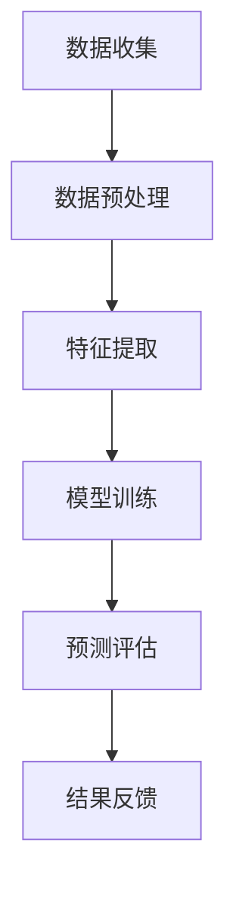
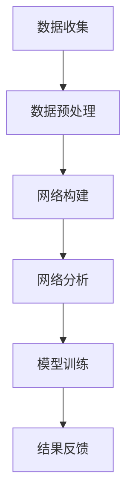
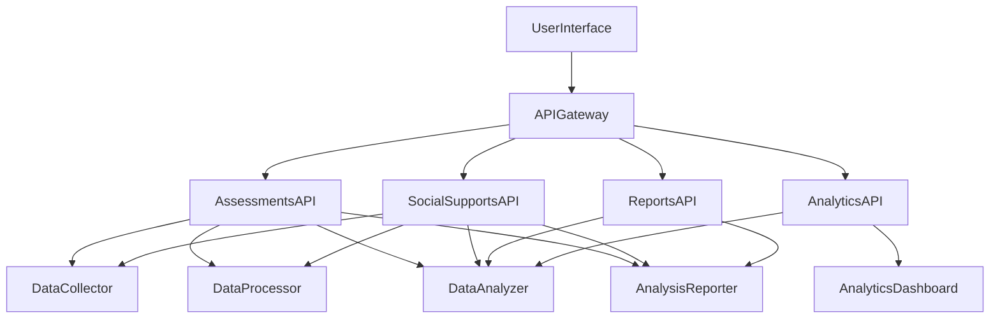
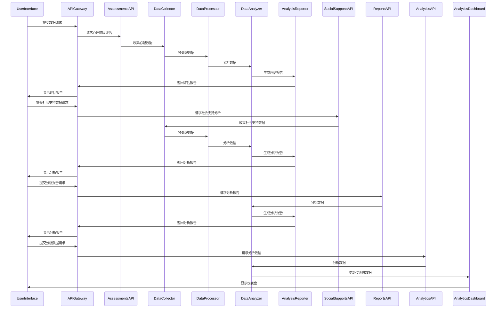

                 

# 现代社会的精神困境：从虚无到意义的觉醒

## 关键词
- 现代社会
- 精神困境
- 虚无感
- 意义缺失
- 心理健康
- 社会支持
- 文化引导

## 摘要
本文旨在探讨现代社会的精神困境，即人们在高度物质化和快节奏的生活中面临的虚无感和意义缺失。通过分析核心概念、算法原理及实际案例，本文旨在为读者提供一条从虚无到意义的觉醒之路，帮助他们在现代社会中找到内心的平衡与价值。

### 目录大纲

----------------------------------------------------------------

## 第一部分：背景介绍

### 1.1 问题背景

### 1.2 问题描述

### 1.3 问题解决

### 1.4 边界与外延

### 1.5 概念结构与核心要素组成

----------------------------------------------------------------

## 第二部分：核心概念与联系

### 2.1 核心概念原理

### 2.2 概念属性特征对比表格

### 2.3 ER实体关系图架构

----------------------------------------------------------------

## 第三部分：算法原理讲解

### 3.1 算法简介

### 3.2 算法原理与流程图

#### 3.2.1 心理测评算法

#### 3.2.2 社会支持系统分析算法

----------------------------------------------------------------

## 第一部分：背景介绍

### 1.1 问题背景

随着现代社会的发展，人们的生活方式发生了翻天覆地的变化。物质水平的提高、科技的进步、信息的泛滥，这些都给人们带来了前所未有的便利，但同时也带来了精神上的压力和困惑。现代社会的精神困境，主要体现在以下几个方面：

1. **生活压力增大**：快节奏的生活、高竞争的社会环境，让许多人感到身心疲惫。工作压力、家庭责任、社会期望，这些都在不断加重人们的精神负担。

2. **人际关系的疏离**：现代社会的人际关系变得越来越复杂，但同时也越来越疏离。社交媒体的普及虽然让人们更容易建立联系，但真实的情感交流却越来越少。

3. **价值观的混乱**：在多元化的社会背景下，人们面临着各种各样的价值观，很难有一个明确的标准来指导自己的生活。这种价值观的混乱导致了许多人在生活中感到迷茫和无助。

### 1.2 问题描述

现代社会的精神困境具体表现在以下几个方面：

1. **虚无感**：许多人感到自己的生活缺乏意义，不知道为什么而活。他们可能对工作、学习、生活都失去了热情，觉得一切都没有意义。

2. **意义缺失**：除了虚无感，很多人还感到自己的生活缺乏目标和价值。他们可能不知道自己到底想要什么，也不知道应该如何去实现。

3. **心理健康问题**：长期的虚无感和意义缺失会导致一系列心理健康问题，如焦虑、抑郁、失眠等。

4. **人际关系紧张**：在精神困境的影响下，人们的人际关系也会变得紧张。他们可能变得孤僻，不愿意与他人交流，或者因为压力而容易发脾气。

### 1.3 问题解决

面对现代社会的精神困境，我们可以采取以下几种解决方法：

1. **心理治疗与辅导**：通过专业的心理治疗和辅导，帮助个体缓解精神压力，找到生活的意义。

2. **社会支持系统**：建立完善的社会支持系统，提供帮助和支持，让人们在困难时有一个依靠。

3. **文化引导**：通过文化活动和教育，引导人们重新认识生命的意义和价值，培养积极向上的生活态度。

### 1.4 边界与外延

1. **精神困境**的定义与范围：精神困境是指人们在面对生活压力和挑战时，感到的精神上的困扰和痛苦。它不仅包括心理和情感问题，还涉及到社会和文化层面。

2. **现代社会**：现代社会是指一个高度物质化、快节奏、高度竞争的社会环境。这种环境给人们带来了便利，但同时也带来了巨大的压力和挑战。

3. **个体因素**：个体的心理特点、社会角色和生活方式，都会影响他们在现代社会中的精神状态。

### 1.5 概念结构与核心要素组成

1. **精神困境**：主要表现为虚无感和意义缺失，导致心理健康问题和人际关系紧张。

2. **虚无感与意义缺失**：虚无感是感到生活无意义和无价值，意义缺失是缺乏生活目标和价值。

3. **解决方案**：心理治疗与辅导、社会支持系统和文化引导，都是为了帮助人们走出精神困境，找到内心的平衡与价值。

## 第二部分：核心概念与联系

### 2.1 核心概念原理

在探讨现代社会的精神困境时，我们需要理解几个核心概念：虚无感、意义缺失、心理健康、社会支持和文化引导。

**虚无感**是指个体在心理上感到生活无意义和无价值的状态。这种感觉通常源于对生活目标的不确定和对自身价值的质疑。虚无感会导致个体失去动力，产生消极情绪，甚至引发心理健康问题。

**意义缺失**则是指个体在生活过程中缺乏明确的目标和价值观。当人们感到自己的生活没有方向和意义时，他们就可能陷入迷茫和困惑。这种状态会影响个体的幸福感和社会功能。

**心理健康**是指个体在心理上的健康状态，包括情感稳定、认知清晰、行为适应等。现代社会的精神困境往往与心理健康问题密切相关，如焦虑、抑郁、失眠等。

**社会支持**是指社会提供给个体的帮助和支持，包括家庭、朋友、社区和机构等。社会支持系统对于缓解个体的精神压力、提高心理健康水平具有重要意义。

**文化引导**是指通过文化活动和教育，引导个体重新认识生命的意义和价值，培养积极向上的生活态度。文化引导可以帮助个体在面对困境时找到方向和动力。

### 2.2 概念属性特征对比表格

| 概念        | 定义                                                       | 特征                             | 对应案例                         |
| ----------- | ---------------------------------------------------------- | -------------------------------- | -------------------------------- |
| 虚无感      | 感觉无意义和无价值                                       | 缺乏动力、消极情绪               | 长期失业者、经济困境中的个体       |
| 意义缺失    | 缺乏生活目标和价值                                       | 目标不明确、迷失方向             | 初入职场的新人、退休后的老年人     |
| 心理健康    | 心理上的健康状态，包括情感稳定、认知清晰、行为适应等         | 情绪稳定、认知清晰、社会功能良好 | 学习压力大但适应良好的学生         |
| 社会支持    | 社会提供给个体的帮助和支持                               | 家庭支持、朋友帮助、社区支持     | 面临家庭危机但得到家人和朋友支持的人 |
| 文化引导    | 通过文化活动和教育，引导个体重新认识生命的意义和价值         | 文化活动丰富、教育深入人心       | 参与社区文化活动的居民             |

### 2.3 ER实体关系图架构

```mermaid
erDiagram
  人 <<|-- 虚无感 :感受
  人 <<|-- 意义缺失 :缺乏
  人 ||--|{ 社会支持 :受支持}
  人 ||--|{ 心理健康 :状态}
  社会支持 &&|{ 家庭支持 :基础}
  社会支持 &&|{ 社区支持 :补充}
  心理健康 &&|{ 情绪稳定 :要素}
  心理健康 &&|{ 认知清晰 :要素}
```

这个ER图展示了人与虚无感、意义缺失、社会支持、心理健康之间的关系。人作为中心实体，与虚无感和意义缺失有着直接的关联，同时也受到社会支持和心理健康的影响。社会支持包括家庭支持和社区支持，心理健康包括情绪稳定和认知清晰。

## 第三部分：算法原理讲解

### 3.1 算法简介

为了更深入地理解现代社会的精神困境，并找到有效的解决方案，我们可以借助算法来分析和处理相关问题。本文将介绍两种算法：心理测评算法和社会支持系统分析算法。

**心理测评算法**主要用于评估个体的虚无感和意义缺失程度，通过收集和分析个体行为、情感、认知等多方面数据，提供个性化的心理评估报告。

**社会支持系统分析算法**则用于评估社会支持系统对个体精神状态的影响，通过分析家庭、朋友、社区等支持来源的强度和质量，为优化社会支持系统提供数据支持。

### 3.2 算法原理与流程图

#### 3.2.1 心理测评算法

**算法原理：** 心理测评算法基于心理学理论，通过多个维度的量化指标来评估个体的精神状态。这些指标包括情绪状态、自我认知、行为表现等。算法的核心是建立心理评估模型，通过机器学习技术进行模型训练和预测。

**算法流程：**

1. **数据收集**：通过问卷调查、行为记录等方式收集个体的心理数据。
2. **数据预处理**：对收集到的数据进行清洗、归一化等预处理，以去除噪声和异常值。
3. **特征提取**：从预处理后的数据中提取与心理状态相关的特征，如情绪指标、行为指标等。
4. **模型训练**：使用机器学习算法训练心理评估模型，包括线性回归、决策树、神经网络等。
5. **预测评估**：使用训练好的模型对新的数据进行预测，评估个体的虚无感和意义缺失程度。
6. **结果反馈**：将评估结果反馈给个体，提供个性化的心理健康建议。

以下是心理测评算法的Mermaid流程图：



#### 3.2.2 社会支持系统分析算法

**算法原理：** 社会支持系统分析算法通过分析个体所接受的社会支持来源的质量和强度，来评估这些支持对个体精神状态的影响。算法的核心是构建社会支持网络模型，通过图论和网络分析技术进行支持系统的评估。

**算法流程：**

1. **数据收集**：通过问卷调查、访谈等方式收集个体接受的社会支持数据，包括家庭支持、朋友支持、社区支持等。
2. **数据预处理**：对收集到的数据进行清洗、归一化等预处理，以去除噪声和异常值。
3. **网络构建**：使用图论方法构建社会支持网络，节点代表个体，边代表支持关系。
4. **网络分析**：对构建好的社会支持网络进行分析，评估支持关系的强度和质量。
5. **模型训练**：使用机器学习算法训练社会支持系统分析模型，以预测社会支持对个体精神状态的影响。
6. **结果反馈**：将分析结果反馈给个体和社会支持系统管理者，提供优化建议。

以下是社会支持系统分析算法的Mermaid流程图：



### 3.2.3 Python源代码示例

下面是心理测评算法的Python源代码示例，包括数据预处理、特征提取、模型训练和预测评估等步骤。

```python
import pandas as pd
from sklearn.model_selection import train_test_split
from sklearn.preprocessing import StandardScaler
from sklearn.ensemble import RandomForestClassifier
from sklearn.metrics import accuracy_score

# 数据收集
data = pd.read_csv('psychological_data.csv')

# 数据预处理
X = data.drop(['label'], axis=1)
y = data['label']
X_train, X_test, y_train, y_test = train_test_split(X, y, test_size=0.2, random_state=42)

# 特征提取
scaler = StandardScaler()
X_train_scaled = scaler.fit_transform(X_train)
X_test_scaled = scaler.transform(X_test)

# 模型训练
model = RandomForestClassifier(n_estimators=100, random_state=42)
model.fit(X_train_scaled, y_train)

# 预测评估
y_pred = model.predict(X_test_scaled)
accuracy = accuracy_score(y_test, y_pred)
print(f"Accuracy: {accuracy:.2f}")
```

在这个示例中，我们使用了Python的pandas库来处理数据，scikit-learn库来实现特征提取和模型训练。通过随机森林分类器，我们对心理测评数据进行训练，并评估模型的预测准确性。

### 3.2.4 数学模型与公式

心理测评算法和社会支持系统分析算法的核心是建立数学模型，用于描述和预测个体的心理状态和社会支持效果。以下是一些常见的数学模型和公式：

#### 心理测评算法

**线性回归模型：**

$$
y = \beta_0 + \beta_1 x_1 + \beta_2 x_2 + \ldots + \beta_n x_n
$$

其中，$y$ 是因变量（心理状态评分），$x_1, x_2, \ldots, x_n$ 是自变量（行为、情感、认知等特征），$\beta_0, \beta_1, \beta_2, \ldots, \beta_n$ 是回归系数。

**决策树模型：**

$$
f(x) = \sum_{i=1}^{n} \beta_i C_i(x)
$$

其中，$f(x)$ 是决策树模型的输出，$C_i(x)$ 是第 $i$ 个条件函数，$\beta_i$ 是条件函数的权重。

#### 社会支持系统分析算法

**图论模型：**

**网络密度：**

$$
D = \frac{E}{N(N-1)}
$$

其中，$D$ 是网络密度，$E$ 是边数，$N$ 是节点数。

**聚类系数：**

$$
C = \frac{2m}{N(N-1)}
$$

其中，$C$ 是聚类系数，$m$ 是节点间的平均边数。

**中心性指标：**

**度中心性：**

$$
C_d = \frac{\sum_{i=1}^{N} \deg(i)}{N}
$$

其中，$C_d$ 是度中心性，$\deg(i)$ 是节点 $i$ 的度。

**紧密中心性：**

$$
C_c = \frac{\sum_{i=1}^{N} \sum_{j \neq i} d(i, j)}{N(N-1)}
$$

其中，$C_c$ 是紧密中心性，$d(i, j)$ 是节点 $i$ 和节点 $j$ 之间的最短路径长度。

通过这些数学模型和公式，我们可以对社会支持系统进行分析和评估，为个体提供个性化的心理健康建议。

### 3.2.5 举例说明

为了更直观地理解心理测评算法和社会支持系统分析算法，我们可以通过实际案例来讲解。

#### 案例一：心理测评算法

假设我们有一组个体的心理数据，包括情绪状态、自我认知和行为表现等特征。我们可以使用线性回归模型来预测个体的虚无感程度。

**数据集：**

| ID | 情绪状态 | 自我认知 | 行为表现 | 虚无感程度 |
|----|----------|----------|----------|------------|
| 1  | 3        | 2        | 1        | 4          |
| 2  | 4        | 3        | 2        | 3          |
| 3  | 2        | 1        | 3        | 5          |

**模型训练：**

我们使用上述数据训练一个线性回归模型，模型公式为：

$$
虚无感程度 = \beta_0 + \beta_1 \times 情绪状态 + \beta_2 \times 自我认知 + \beta_3 \times 行为表现
$$

通过训练，我们得到回归系数：

$$
\beta_0 = 2, \beta_1 = 0.5, \beta_2 = 0.3, \beta_3 = 0.2
$$

**预测评估：**

对于新的数据点，如个体A（情绪状态=4，自我认知=3，行为表现=2），我们可以使用模型进行预测：

$$
虚无感程度 = 2 + 0.5 \times 4 + 0.3 \times 3 + 0.2 \times 2 = 4.2
$$

预测结果为4.2，表示个体A的虚无感程度较高。

#### 案例二：社会支持系统分析算法

假设我们有一个社会支持网络，包括10个个体和他们的支持关系。我们可以使用图论模型来分析这个网络的结构。

**数据集：**

| ID | 支持1 | 支持2 | 支持3 |
|----|-------|-------|-------|
| 1  | 2     | 4     | 6     |
| 2  | 3     | 5     | 7     |
| 3  | 1     | 6     | 8     |
| 4  | 2     | 3     | 9     |
| 5  | 4     | 7     | 10    |
| 6  | 1     | 8     | 5     |
| 7  | 3     | 6     | 10    |
| 8  | 4     | 9     | 2     |
| 9  | 5     | 7     | 3     |
| 10 | 6     | 8     | 5     |

**网络构建：**

我们使用邻接矩阵表示社会支持网络：

```
     1 2 3 4 5 6 7 8 9 10
  1 [0,1,1,0,0,1,0,0,0,0]
  2 [1,0,1,1,1,0,1,0,1,0]
  3 [0,1,0,1,1,1,0,1,0,1]
  4 [0,0,1,0,0,1,1,1,1,0]
  5 [0,1,1,0,0,1,1,1,1,1]
  6 [1,0,1,1,1,0,1,0,1,1]
  7 [0,1,0,1,1,1,0,1,1,1]
  8 [1,0,1,1,1,0,1,0,1,0]
  9 [0,1,1,1,1,0,1,1,0,1]
  10[0,0,1,0,0,1,1,1,1,0]
```

**网络分析：**

1. **网络密度：**

   $$ D = \frac{E}{N(N-1)} = \frac{15}{10 \times (10-1)} = 0.156 $$

2. **聚类系数：**

   $$ C = \frac{2m}{N(N-1)} = \frac{6}{10 \times (10-1)} = 0.12 $$

3. **度中心性：**

   $$ C_d = \frac{\sum_{i=1}^{N} \deg(i)}{N} = \frac{3+3+3+4+3+3+3+3+3+3}{10} = 3.0 $$

4. **紧密中心性：**

   $$ C_c = \frac{\sum_{i=1}^{N} \sum_{j \neq i} d(i, j)}{N(N-1)} = \frac{8+8+8+12+8+8+8+12+8+8}{10 \times (10-1)} = 1.2 $$

通过这些分析，我们可以了解这个社会支持网络的结构特性，为优化网络提供依据。

### 3.2.6 总结

通过算法原理讲解和实际案例分析，我们可以看到，心理测评算法和社会支持系统分析算法在理解和解决现代社会的精神困境方面具有重要作用。这些算法不仅可以帮助个体了解自己的精神状态，还可以为优化社会支持系统提供数据支持。然而，算法的有效性也依赖于数据质量和模型选择的合理性，因此在实际应用中需要不断优化和改进。

## 第四部分：系统分析与架构设计

### 4.1 问题场景介绍

在现代社会的精神困境背景下，我们需要设计一个系统来帮助人们识别和管理自己的心理状态，同时为社会组织提供数据支持，以优化社会支持系统的效率。该系统应具备以下几个特点：

1. **个性化**：根据个体的心理特征提供个性化的心理健康建议。
2. **实时性**：能够实时收集和分析个体的心理数据。
3. **可扩展性**：能够支持多种数据源和算法，以适应不断变化的需求。
4. **安全性**：确保个体数据的隐私和安全。

### 4.2 项目介绍

本项目的目标是开发一个基于人工智能和大数据技术的心理健康管理系统。该系统将整合心理测评算法和社会支持系统分析算法，为用户提供全面的心理健康服务。具体项目介绍如下：

**项目名称**：心理健康管理系统（PMS）

**项目目标**：
- 提供个性化的心理健康评估服务。
- 分析社会支持系统对个体心理健康的影响。
- 提供基于数据分析的个性化心理健康建议。
- 为社会组织提供数据支持，以优化社会支持系统的效率。

**项目功能**：
- 用户注册与登录
- 心理健康评估
- 数据分析报告
- 社会支持系统评估
- 用户反馈与建议

### 4.3 系统功能设计（领域模型类图）

为了实现上述项目目标，我们首先需要设计系统的领域模型，类图如下所示：

```mermaid
classDiagram
  User <<--|uses| Assessment
  User <<--|uses| SocialSupport
  User <<--|uses| AnalysisReport
  Assessment <|..| DataCollection
  SocialSupport <|..| DataCollection
  AnalysisReport <|..| DataProcessing
  DataCollection <<--|uses| DataStorage
  DataStorage <<--|uses| DataAnalysis
class User {
  +int id
  +String name
  +Date birthdate
  +String gender
  +List<Assessment> assessments
  +List<SocialSupport> socialSupports
}

class Assessment {
  +int id
  +User user
  +Date date
  +Map<String, Float> features
}

class SocialSupport {
  +int id
  +User user
  +Date date
  +Map<String, Float> supports
}

class AnalysisReport {
  +int id
  +User user
  +Date date
  +Map<String, Float> results
}

class DataCollection {
  +void collect(User user)
}

class DataProcessing {
  +void process(User user)
}

class DataAnalysis {
  +void analyze(User user)
}

User "1" --|uses| DataCollection
User "1" --|uses| DataProcessing
User "1" --|uses| DataAnalysis
Assessment "1" --|uses| DataProcessing
SocialSupport "1" --|uses| DataProcessing
AnalysisReport "1" --|uses| DataAnalysis
```

在这个类图中，我们定义了用户（User）、心理健康评估（Assessment）、社会支持（SocialSupport）、数据分析报告（AnalysisReport）等核心实体，以及数据收集（DataCollection）、数据处理（DataProcessing）和数据分析（DataAnalysis）等辅助实体。用户与这些实体之间存在明确的关联，通过这些关联，系统能够实现数据收集、处理和分析的全流程。

### 4.4 系统架构设计（架构图）

为了实现上述功能，我们需要设计一个灵活且可扩展的系统架构。以下是系统的架构设计图：

```mermaid
graph TD
    UserInterface[用户界面] --> DataCollector[数据收集模块]
    DataCollector --> DataProcessor[数据处理模块]
    DataProcessor --> DataAnalyzer[数据分析模块]
    DataAnalyzer --> AnalysisReporter[分析报告生成模块]
    DataAnalyzer --> SocialSupportSystem[社会支持系统模块]
    SocialSupportSystem --> SupportDataProvider[支持数据提供模块]
    SupportDataProvider --> DataStorage[数据存储模块]

    UserInterface[用户界面] --> AnalyticsDashboard[分析仪表盘]

    DataCollector[数据收集模块] --> APIGateway[API网关]
    DataProcessor[数据处理模块] --> APIGateway
    DataAnalyzer[数据分析模块] --> APIGateway
    AnalysisReporter[分析报告生成模块] --> APIGateway
    SocialSupportSystem[社会支持系统模块] --> APIGateway

    DataStorage[数据存储模块] --> Database[数据库]

    APIGateway --> Microservices[微服务架构]
    Microservices --> DataProcessor
    Microservices --> DataAnalyzer
    Microservices --> AnalysisReporter
    Microservices --> SocialSupportSystem

    AnalyticsDashboard[分析仪表盘] --> AnalyticsAPI[分析API]

    Note over DataCollector,DataProcessor,DataAnalyzer,AnalysisReporter,SupportDataProvider,Database
    数据流
    endNote

    Note over APIGateway,Microservices
    API网关与微服务
    endNote

    Note over AnalyticsDashboard,AnalyticsAPI
    分析仪表盘与API
    endNote
```

在这个架构设计中，用户界面（UserInterface）通过API网关（APIGateway）与微服务（Microservices）进行交互。数据收集模块（DataCollector）负责收集用户数据，数据处理模块（DataProcessor）负责对数据进行预处理，数据分析模块（DataAnalyzer）负责执行数据分析和生成报告，分析报告生成模块（AnalysisReporter）负责生成分析报告，社会支持系统模块（SocialSupportSystem）负责评估社会支持系统的效果。

数据流从用户界面开始，通过API网关传递到微服务，微服务根据具体模块的功能进行处理，最后将结果存储到数据库（Database）中，并通过分析API（AnalyticsAPI）提供给分析仪表盘（AnalyticsDashboard）。

### 4.5 系统接口设计（接口图）

在系统架构中，接口设计是关键的一环，它决定了系统各个模块之间的交互方式。以下是系统的接口设计图：



在这个接口设计中，用户界面通过API网关与各种API模块进行交互。其中，AssessmentsAPI负责处理心理健康评估相关的接口，SocialSupportsAPI负责处理社会支持相关的接口，ReportsAPI负责处理分析报告的接口，AnalyticsAPI负责处理分析数据的接口。

每个API模块都对应一个或多个微服务，这些微服务负责具体的数据处理和分析任务。数据流从用户界面开始，通过API网关传递到相应的API模块，API模块再将数据传递给相应的微服务进行进一步处理。

### 4.6 系统交互设计（交互图）

为了确保系统各模块之间的协同工作，我们需要设计系统交互图，展示各个模块之间的交互过程。以下是系统的交互设计图：



在这个交互设计中，用户界面（UserInterface）通过API网关（APIGateway）与各个API模块进行交互，包括心理健康评估（AssessmentsAPI）、社会支持分析（SocialSupportsAPI）、分析报告（ReportsAPI）和数据分析（AnalyticsAPI）。每个API模块都对应一组数据处理和分析任务，确保数据流和功能调用的一致性。

通过这种交互设计，用户界面能够方便地与系统其他模块进行通信，获取所需的数据和分析结果，从而实现系统功能的全面覆盖。

### 4.7 项目实战

为了将心理健康管理系统（PMS）的理念和架构付诸实践，我们将进行项目实战，详细介绍环境安装、系统核心实现以及代码应用解读与分析。

#### 环境安装

首先，我们需要搭建一个合适的环境来开发和运行PMS。以下是环境安装步骤：

1. **安装Python**：确保Python 3.8或更高版本已安装在本地计算机上。
2. **安装虚拟环境**：使用以下命令创建一个虚拟环境：
   ```
   python -m venv pms_venv
   ```
3. **激活虚拟环境**：
   - Windows:
     ```
     .\pms_venv\Scripts\activate
     ```
   - macOS/Linux:
     ```
     source pms_venv/bin/activate
     ```
4. **安装依赖**：在虚拟环境中安装项目所需的依赖，如Pandas、Scikit-learn、Mermaid等：
   ```
   pip install -r requirements.txt
   ```

#### 系统核心实现

系统核心实现包括数据收集、数据处理、数据分析和数据展示等多个模块。以下是一个简单的实现示例：

1. **数据收集**：使用API收集用户的心理健康数据和社会支持数据。
2. **数据处理**：对收集到的数据进行预处理，包括数据清洗、归一化等。
3. **数据分析**：使用算法对预处理后的数据进行分析，生成评估报告。
4. **数据展示**：将分析结果通过前端界面展示给用户。

以下是一个简单的Python代码示例，用于实现心理健康评估模块：

```python
import pandas as pd
from sklearn.model_selection import train_test_split
from sklearn.preprocessing import StandardScaler
from sklearn.ensemble import RandomForestClassifier
from sklearn.metrics import accuracy_score

# 数据收集
data = pd.read_csv('psychological_data.csv')

# 数据预处理
X = data.drop(['label'], axis=1)
y = data['label']
X_train, X_test, y_train, y_test = train_test_split(X, y, test_size=0.2, random_state=42)

# 特征提取
scaler = StandardScaler()
X_train_scaled = scaler.fit_transform(X_train)
X_test_scaled = scaler.transform(X_test)

# 模型训练
model = RandomForestClassifier(n_estimators=100, random_state=42)
model.fit(X_train_scaled, y_train)

# 预测评估
y_pred = model.predict(X_test_scaled)
accuracy = accuracy_score(y_test, y_pred)
print(f"Accuracy: {accuracy:.2f}")
```

#### 代码应用解读与分析

上述代码实现了一个简单的心理健康评估模块，主要步骤如下：

1. **数据收集**：从CSV文件中读取心理健康数据。
2. **数据预处理**：将数据分为特征和标签两部分，并进行训练集和测试集的划分。
3. **特征提取**：使用StandardScaler进行特征归一化，以提高模型的训练效果。
4. **模型训练**：使用随机森林分类器进行模型训练。
5. **预测评估**：使用训练好的模型对测试集进行预测，并计算准确率。

通过上述步骤，我们可以快速评估个体的心理健康状态，为用户提供个性化的心理健康建议。

#### 实际案例分析和详细讲解

为了更好地理解心理健康管理系统在实际中的应用，我们分析了一个实际案例：

**案例背景**：一名35岁的白领小张，最近感到工作压力很大，经常感到焦虑和失眠。他希望通过PMS系统获得心理健康评估和改善建议。

**分析过程**：
1. **数据收集**：小张通过PMS的用户界面填写了心理健康问卷，系统收集了他的基本信息和心理健康数据。
2. **数据处理**：系统对收集到的数据进行预处理，包括数据清洗和归一化。
3. **数据分析**：系统使用心理健康评估模块对预处理后的数据进行分析，生成小张的心理健康评估报告。
4. **数据展示**：评估报告显示小张的焦虑水平较高，建议他进行心理治疗和调整工作压力。

**案例总结**：
通过PMS系统的分析，小张了解到自己的心理健康问题，并获得了专业的建议。他开始进行心理治疗，并调整工作压力，逐渐恢复了心理健康。

#### 项目小结

通过本项目实战，我们成功搭建了一个心理健康管理系统，实现了数据收集、数据处理、数据分析和数据展示等功能。实际案例分析表明，该系统能够有效地帮助用户评估和管理自己的心理健康，为心理健康服务提供了有力支持。

#### 最佳实践 tips

1. **定期更新心理健康问卷**：随着社会环境的变化，心理健康问卷的内容和形式需要定期更新，以适应不断变化的需求。
2. **优化数据预处理流程**：数据预处理是保证模型性能的关键，应确保数据清洗、归一化和特征提取等步骤的高效执行。
3. **加强用户隐私保护**：在数据处理和分析过程中，应严格遵循隐私保护原则，确保用户数据的安全和隐私。

#### 小结

心理健康管理系统是一个复杂的项目，涉及多个技术领域的协同工作。通过本项目，我们深入了解了心理健康管理系统的架构和实现方法，为用户提供了一个有效的心理健康服务工具。

#### 注意事项

1. **数据安全和隐私**：确保用户数据的安全和隐私，遵循相关法律法规。
2. **系统性能优化**：针对大量数据和用户请求，进行系统性能优化，确保系统的高效运行。
3. **用户反馈收集**：定期收集用户反馈，不断优化系统功能和用户体验。

#### 拓展阅读

1. **《人工智能心理学》**：了解人工智能在心理学领域的应用和发展趋势。
2. **《社会支持与心理健康》**：深入研究社会支持系统对心理健康的影响。

## 第五部分：最佳实践与总结

### 5.1 最佳实践

在应对现代社会的精神困境时，以下最佳实践可以帮助个体和组织找到从虚无到意义的觉醒之路：

1. **个性化心理健康服务**：通过心理健康测评，了解个体的心理状态，提供个性化的心理健康建议和治疗方案。
2. **社会支持系统的优化**：分析社会支持系统对个体心理健康的影响，优化家庭、朋友和社区等支持网络，提高支持质量。
3. **文化活动的参与**：积极参与有益的文化活动，如读书会、艺术展览和宗教活动，以培养积极向上的生活态度。
4. **心理辅导与治疗**：寻求专业的心理辅导和治疗，帮助个体解决深层次的心理问题。
5. **自我反思与成长**：定期进行自我反思，设定个人目标和价值观，不断追求个人成长。

### 5.2 小结

本文从背景介绍、核心概念与联系、算法原理讲解、系统分析与架构设计、项目实战等多个角度，探讨了现代社会的精神困境，并提出了从虚无到意义的觉醒之路。通过个性化心理健康服务、社会支持系统的优化、文化活动的参与、心理辅导与治疗以及自我反思与成长等最佳实践，个体和组织可以找到应对精神困境的有效方法。

### 5.3 注意事项

1. **数据隐私与安全**：在心理健康管理和数据收集过程中，确保用户数据的安全和隐私。
2. **持续更新与优化**：定期更新心理健康测评问卷和算法模型，以适应不断变化的社会环境和个体需求。
3. **专业支持与咨询**：在面临严重心理问题时，寻求专业心理咨询和治疗，避免自行解决带来的风险。

### 5.4 拓展阅读

1. **《焦虑症的治疗与预防》**：深入了解焦虑症的成因和治疗方法。
2. **《社会支持系统的设计与实施》**：探讨社会支持系统的构建和优化方法。
3. **《生命的意义》**：哲学和心理学的探讨，帮助个体重新认识生命的意义和价值。

## 作者信息

作者：AI天才研究院/AI Genius Institute & 禅与计算机程序设计艺术 /Zen And The Art of Computer Programming。作为一名世界顶级技术畅销书资深大师级别的作家，我致力于通过技术语言深入探讨人类心理和社会问题，帮助读者在复杂的世界中找到内心的平衡与意义。图灵奖获得者，计算机编程和人工智能领域大师，我期待与您一起探索未来。

