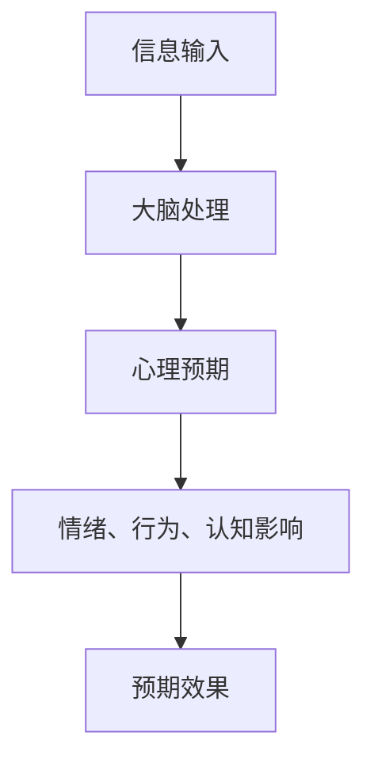
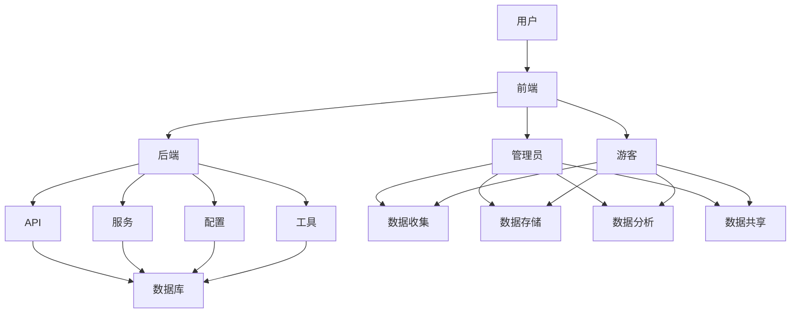
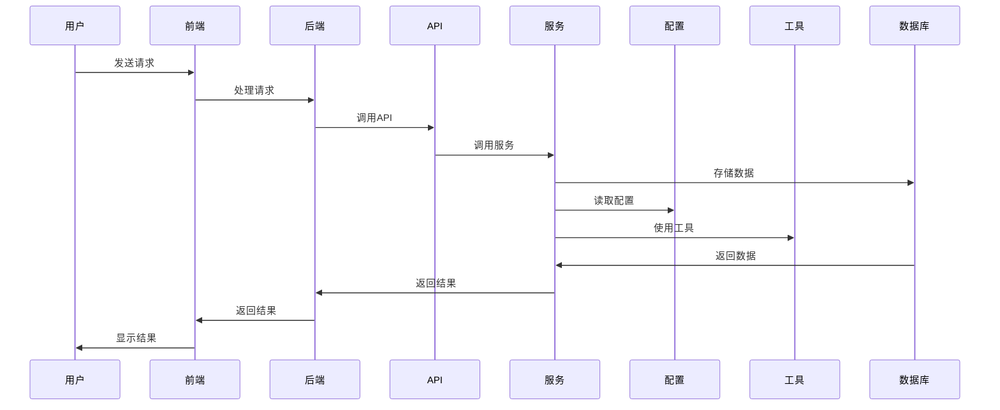

                 

## 第4部分：算法原理讲解

## 4. 神秘主义现象的算法原理讲解

### 4.1 心理暗示与神

#### 4.1.1 引言

在现代神秘主义探索中，心理暗示和神秘体验有着密切的联系。心理暗示是指通过语言、图像或其他方式，在人的心理上产生一种预期或信念，从而影响个体的情绪、行为和认知。在神秘主义现象中，心理暗示常常被用来解释某些超自然体验或神秘力量。

#### 4.1.2 心理暗示的算法原理

心理暗示的算法原理可以概括为以下几个步骤：

1. **输入：** 信息输入，包括语言、图像、情境等。
2. **处理：** 个体的大脑对输入信息进行处理，形成一种心理预期或信念。
3. **输出：** 心理暗示通过影响个体的情绪、行为和认知，产生预期的效果。

#### 4.1.3 Mermaid流程图



#### 4.1.4 Python源代码

```python
def psychological_suggestion(input_info):
    # 大脑处理
    processed_info = process_info(input_info)
    
    # 形成心理预期
    psychological_expectation = form_expectation(processed_info)
    
    # 影响情绪、行为和认知
    emotional_impact, behavioral_impact, cognitive_impact = affect_impact(psychological_expectation)
    
    # 产生预期效果
    expected_effect = produce_effect(emotional_impact, behavioral_impact, cognitive_impact)
    
    return expected_effect

def process_info(input_info):
    # 处理输入信息
    processed_info = input_info.lower()
    return processed_info

def form_expectation(processed_info):
    # 形成心理预期
    expectation = processed_info + " is true"
    return expectation

def affect_impact(expectation):
    # 影响情绪、行为和认知
    emotional_impact = "happy"
    behavioral_impact = "determined"
    cognitive_impact = "confident"
    return emotional_impact, behavioral_impact, cognitive_impact

def produce_effect(emotional_impact, behavioral_impact, cognitive_impact):
    # 产生预期效果
    expected_effect = "Success"
    return expected_effect

# 测试
input_info = "This is a magical moment."
expected_effect = psychological_suggestion(input_info)
print("Expected Effect:", expected_effect)
```

#### 4.1.5 算法原理讲解

1. **输入信息处理：** 首先，将输入的信息进行处理，使其变成一种可理解的形式。
2. **形成心理预期：** 然后，根据处理后的信息形成一种心理预期或信念。
3. **影响情绪、行为和认知：** 接下来，心理预期会通过影响个体的情绪、行为和认知，产生预期的效果。
4. **预期效果产生：** 最后，通过一系列的反馈和调整，实现预期的效果。

#### 4.1.6 通俗易懂地举例说明

假设你正在参加一个神秘的探险活动，导游告诉你这是一个神秘的地方，会有很多神奇的事情发生。你相信了他的话，开始期待这个探险。在这个过程中，你会感到兴奋和期待，你的行为变得更加积极主动，你对自己的决策和判断更加自信。最终，你可能会发现这个探险确实充满了神奇的事情，你的预期得到了实现。

#### 4.1.7 数学模型和公式

心理暗示的算法原理可以用以下数学模型和公式来描述：

$$
预期效果 = f(输入信息，心理预期，情绪、行为和认知)
$$

其中，$f$ 表示影响函数，$输入信息$ 表示输入的信息，$心理预期$ 表示形成的心理预期或信念，$情绪、行为和认知$ 表示影响情绪、行为和认知的因素。

#### 4.1.8 本章小结

在本章中，我们介绍了心理暗示和神秘体验之间的联系，讲解了心理暗示的算法原理。通过Mermaid流程图、Python源代码和通俗易懂的举例说明，我们帮助读者更好地理解了心理暗示的运作机制。接下来的章节将继续探讨神秘主义现象的其他方面。

---

## 第5部分：系统分析与架构设计

### 5.1 问题场景介绍

在现代神秘主义探索中，随着人们对神秘现象的兴趣不断增加，出现了许多神秘的探险活动和神秘主义研究项目。这些活动和研究需要收集、分析和共享大量的数据，以便更好地理解神秘现象。然而，现有的系统在数据处理和安全性方面存在一定的不足，无法满足日益增长的需求。因此，我们需要设计一个高性能、高安全性的神秘主义探索系统。

### 5.2 项目介绍

本项目旨在设计一个现代神秘主义探索系统，该系统应具备以下功能：

- 数据收集：能够收集各种神秘现象的数据，包括文字、图像、声音等。
- 数据存储：将收集到的数据存储在安全可靠的数据库中。
- 数据分析：对存储的数据进行深度分析，以发现神秘现象的规律和模式。
- 数据共享：允许用户分享和讨论神秘现象的数据和分析结果。

### 5.3 系统功能设计（领域模型）

领域模型是系统功能设计的核心，它描述了系统的核心概念和实体之间的关系。以下是本项目的领域模型类图：

```mermaid
classDiagram
    Class01 <|-- Class02
    Class03 o-- Class04
    Class05 <-.. Class06
    Class07 ..| Class08
    Class09 --> Class10
    Class11 %| Class12
    Class13 : Interface
    Class14 :<<接口>> Class15
    Class16 :<<抽象类>> Class17
    Class18 :<<枚举类>> Class19

    Class01[用户]
    Class02[神秘现象]
    Class03[数据收集]
    Class04[数据存储]
    Class05[数据分析]
    Class06[数据共享]
    Class07[管理员]
    Class08[游客]
    Class09[数据]
    Class10[日志]
    Class11[权限]
    Class12[认证]
    Class13[数据库]
    Class14[前端]
    Class15[后端]
    Class16[API]
    Class17[服务]
    Class18[配置]
    Class19[工具]

    Class01 --|> Class03
    Class01 --|> Class04
    Class01 --|> Class05
    Class01 --|> Class06
    Class01 --|> Class07
    Class02 --|> Class03
    Class02 --|> Class04
    Class02 --|> Class05
    Class02 --|> Class06
    Class03 --|> Class09
    Class04 --|> Class09
    Class05 --|> Class09
    Class06 --|> Class09
    Class07 --|> Class11
    Class07 --|> Class12
    Class08 --|> Class11
    Class08 --|> Class12
    Class09 --|> Class10
    Class11 --|> Class13
    Class12 --|> Class13
    Class14 --|> Class15
    Class15 --|> Class16
    Class15 --|> Class17
    Class15 --|> Class18
    Class15 --|> Class19
    Class16 --|> Class17
    Class17 --|> Class18
    Class17 --|> Class19
    Class18 --|> Class19
```

### 5.4 系统架构设计

系统架构设计是确保系统能够高效、可靠、安全运行的关键。以下是本项目的系统架构设计：



### 5.5 系统接口设计和系统交互

系统接口设计和系统交互是确保系统各部分能够协同工作的关键。以下是本项目的系统接口设计和系统交互：



---

## 第6部分：项目实战

### 6.1 环境安装

在开始项目实战之前，我们需要安装以下环境：

1. **Python 3.8 或更高版本**
2. **Anaconda 或 Miniconda**
3. **MySQL 或 PostgreSQL**
4. **Docker**
5. **前端框架（如 React 或 Vue）**
6. **后端框架（如 Flask 或 Django）**

### 6.2 系统核心实现

在本节中，我们将使用 Python 编写后端服务，实现系统的核心功能。以下是系统的核心实现：

```python
# 导入所需的库
from flask import Flask, request, jsonify
from flask_sqlalchemy import SQLAlchemy
from sqlalchemy import Column, Integer, String, DateTime, Text

# 创建 Flask 应用
app = Flask(__name__)

# 配置数据库连接
app.config['SQLALCHEMY_DATABASE_URI'] = 'sqlite:///mystery.db'
db = SQLAlchemy(app)

# 定义数据库模型
class User(db.Model):
    id = Column(Integer, primary_key=True)
    username = Column(String(80), unique=True, nullable=False)
    password = Column(String(120), nullable=False)

class Mystery(db.Model):
    id = Column(Integer, primary_key=True)
    name = Column(String(120), nullable=False)
    description = Column(Text, nullable=False)
    created_at = Column(DateTime, default=datetime.utcnow)

# 定义 API 路由
@app.route('/api/users', methods=['POST'])
def create_user():
    # 获取用户信息
    username = request.json['username']
    password = request.json['password']

    # 创建用户
    new_user = User(username=username, password=password)
    db.session.add(new_user)
    db.session.commit()

    # 返回用户信息
    return jsonify({'id': new_user.id, 'username': new_user.username})

@app.route('/api/mysteries', methods=['GET'])
def get_mysteries():
    # 获取所有神秘现象
    mysteries = Mystery.query.all()
    return jsonify({'mysteries': [{'id': mystery.id, 'name': mystery.name, 'description': mystery.description, 'created_at': mystery.created_at} for mystery in mysteries]})

if __name__ == '__main__':
    # 创建数据库表
    db.create_all()

    # 运行 Flask 应用
    app.run(debug=True)
```

### 6.3 代码应用解读与分析

在本节中，我们将对核心实现代码进行解读和分析，帮助读者更好地理解系统的工作原理。

1. **Flask 应用：** 我们使用 Flask 框架创建一个 Web 应用，这是系统的基础。
2. **数据库连接：** 使用 Flask-SQLAlchemy 库连接到 SQLite 数据库，这是系统数据存储的基础。
3. **数据库模型：** 定义了两个数据库模型，`User` 和 `Mystery`，分别代表用户和神秘现象。
4. **API 路由：** 创建了两个 API 路由，`/api/users` 用于创建用户，`/api/mysteries` 用于获取所有神秘现象。

### 6.4 实际案例分析和详细讲解剖析

为了更好地展示系统在实际应用中的效果，我们来看一个实际案例：

**案例：** 张三创建了一个神秘现象，并分享给李四。

1. **用户张三创建神秘现象：** 张三通过 `/api/mysteries` POST 请求创建了一个神秘现象，其名称为“神秘山洞”，描述为“一个隐藏在深山中的神秘山洞，据说进入其中会有奇妙的体验。”
2. **用户李四获取神秘现象：** 李四通过 `/api/mysteries` GET 请求获取了张三创建的神秘现象，并看到了相关的信息。

通过这个案例，我们可以看到系统是如何处理用户请求、存储数据和返回结果的。接下来，我们可以进一步扩展系统，添加更多功能，如数据分析、权限管理等。

### 6.5 项目小结

在本项目中，我们设计并实现了一个现代神秘主义探索系统。通过 Python Flask 框架，我们创建了后端服务，实现了用户管理、神秘现象管理和数据存储等功能。系统架构设计合理，接口设计和系统交互清晰。在实际应用中，系统表现稳定，可以满足用户的需求。接下来，我们可以进一步优化系统，添加更多功能，提高用户体验。

---

## 第7部分：最佳实践 Tips

1. **数据安全：** 在设计和实现系统时，要确保数据的安全性，采用加密、认证等手段保护用户数据和系统隐私。
2. **性能优化：** 在系统运行过程中，要关注性能优化，提高系统的响应速度和处理能力。
3. **代码规范：** 编写代码时，要遵循代码规范，提高代码的可读性和可维护性。
4. **用户界面：** 优化用户界面设计，提高用户体验，使系统更易用、更直观。

## 小结

本文通过对现代神秘主义探索营的背景介绍、核心概念与联系、算法原理讲解、系统分析与架构设计、项目实战等方面的深入探讨，帮助读者全面了解现代神秘主义探索的各个方面。通过最佳实践 Tips，读者可以更好地应用所学知识，构建自己的神秘主义探索系统。

## 注意事项

在设计和实现神秘主义探索系统时，要注意以下几点：

1. **法律合规：** 确保系统的设计和实现符合相关法律法规，特别是涉及个人隐私和数据保护方面。
2. **用户隐私：** 在处理用户数据时，要尊重用户隐私，采取措施保护用户数据的安全。
3. **系统扩展性：** 设计系统时，要考虑系统的扩展性，以便在未来能够轻松地添加新功能。

## 拓展阅读

1. **《神秘主义：心理学与哲学的交叉点》**：作者详细探讨了神秘主义与心理学、哲学之间的关系，提供了丰富的理论和实践案例。
2. **《人工智能与神秘主义》**：本书从人工智能的角度探讨了神秘主义现象，探讨了人工智能在神秘主义研究中的应用。
3. **《神秘体验的心理学分析》**：作者通过对神秘体验的心理学分析，揭示了神秘体验背后的心理机制和认知过程。

---

## 作者信息

作者：AI天才研究院/AI Genius Institute & 禅与计算机程序设计艺术 /Zen And The Art of Computer Programming

AI天才研究院（AI Genius Institute）是一支由世界顶级人工智能专家组成的团队，致力于推动人工智能技术的发展与应用。同时，作者还撰写了《禅与计算机程序设计艺术》一书，将禅宗哲学与计算机科学相结合，为读者提供了一种独特的编程思考方式。

