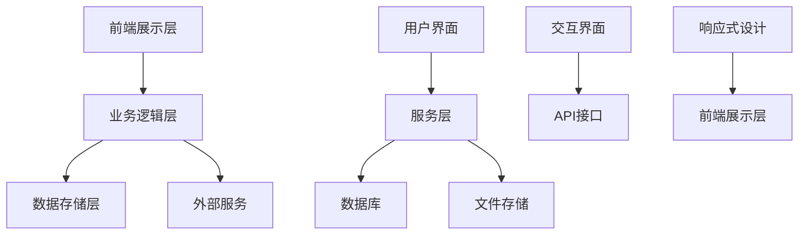
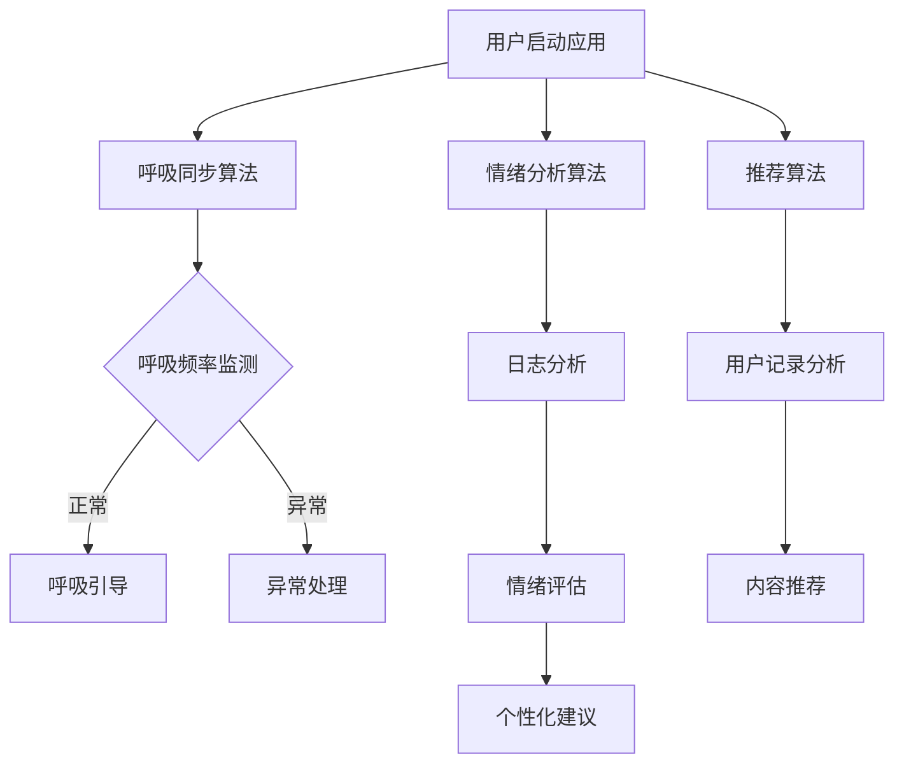
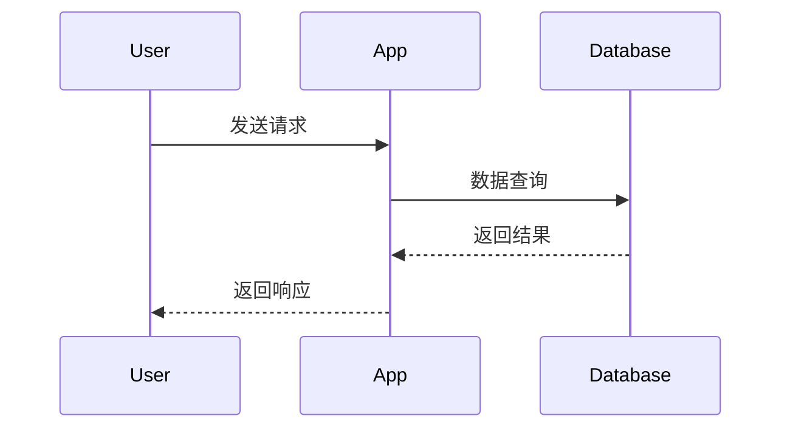

                 


**引言**

### 现代禅修App的概述

随着现代社会的快速发展和人们对心理健康需求的增加，禅修作为一种古老的东方智慧，逐渐被现代科技所拥抱，并以数字化的形式呈现给大众。现代禅修App，作为一种新兴的应用，不仅继承了禅修的核心价值，还融合了现代科技，为用户提供了一种便捷、个性化的禅修体验。

#### 1.1.1 禅修App的概念及其重要性

禅修App，简单来说，就是将禅修的练习和指导通过移动应用的方式呈现给用户。这些应用通常包含了一系列的禅修指导、冥想音频、呼吸练习、日志记录等功能，旨在帮助用户在忙碌的生活中找到片刻的宁静与专注。禅修App的重要性在于，它不仅提供了禅修的资源，还通过个性化的服务，提高了禅修的效率和效果。

#### 1.1.2 禅修App的起源与发展

禅修App的起源可以追溯到智能手机的普及和移动互联网的发展。最早的禅修应用主要是基于iPhone平台，随着时间的推移，安卓平台也开始涌现出大量的禅修应用。这些应用最初主要是简单的呼吸练习和冥想音乐，但随着技术的进步，它们逐渐加入了更丰富的内容和功能。

#### 1.1.3 禅修App在全球的应用现状

在全球范围内，禅修App已经成为了一种流行的健康管理工具。根据市场研究公司的数据，全球禅修App市场正在以每年两位数的增长率迅速扩大。在美国、欧洲和中国等国家和地区，禅修App的用户数量和市场份额都在持续增加。这些应用不仅受到了都市白领和年轻人的喜爱，也受到了中老年人的关注。

### 1.2 禅修App的核心功能与特性

禅修App的核心功能通常包括以下几种：

- **禅修指导**：提供各种形式的禅修指导，包括语音指导、视频演示等。
- **冥想音频**：提供专业的冥想音乐和指导音频，帮助用户进行冥想练习。
- **呼吸练习**：通过引导用户进行深呼吸，帮助用户放松身心。
- **日志记录**：用户可以记录每天的禅修时间和心得体会，跟踪自己的进步。

#### 1.2.1 禅修App的核心功能模块

禅修App的核心功能模块通常包括以下几部分：

1. **用户模块**：包括用户注册、登录、个人资料管理等功能。
2. **内容模块**：包括禅修指导、冥想音频、呼吸练习等主要内容。
3. **数据分析模块**：收集用户禅修数据，进行数据分析，为用户提供个性化的指导。
4. **社交模块**：允许用户分享禅修心得，参与社区讨论。

#### 1.2.2 禅修App的特有功能

禅修App的一些特有功能使其在众多健康管理应用中脱颖而出：

- **个性化指导**：根据用户的历史数据和偏好，提供个性化的禅修建议。
- **实时反馈**：通过传感器和算法，实时监测用户的呼吸、心率等生理数据，并提供反馈。
- **社区互动**：用户可以在社区中分享心得，与其他用户互动，增强禅修的动力。

#### 1.2.3 禅修App与传统禅修方式的比较

与传统禅修方式相比，禅修App具有以下优势：

- **便捷性**：用户可以随时随地通过手机进行禅修，不受时间和地点的限制。
- **个性化**：通过数据分析，禅修App能够为用户量身定制禅修计划。
- **互动性**：用户可以在社区中与其他人分享心得，获得反馈和支持。

然而，禅修App也存在一些挑战，比如如何确保用户的数据安全和隐私保护，以及如何设计出更加符合用户需求的交互界面。

### 1.3 禅修App的用户体验设计

用户体验是禅修App成功的关键因素之一。一个良好的用户体验能够吸引用户持续使用，提高用户满意度和忠诚度。

#### 1.3.1 界面设计的原则

禅修App的界面设计应该遵循以下原则：

- **简洁性**：界面设计应尽量简洁，减少用户操作步骤，提高使用效率。
- **一致性**：应用中各个部分的风格和布局应保持一致，提高用户的熟悉度。
- **易用性**：界面设计应易于使用，用户能够快速上手，不需要复杂的操作。

#### 1.3.2 用户交互设计的关键点

用户交互设计的关键点包括：

- **反馈机制**：用户每次操作后，应用应给予清晰的反馈，确保用户了解操作结果。
- **导航设计**：应用应提供清晰的导航，使用户能够快速找到所需功能。
- **交互提示**：在用户不确定操作时，应用应提供交互提示，引导用户完成操作。

#### 1.3.3 用户行为分析与应用

通过用户行为分析，禅修App可以了解用户的使用习惯和偏好，从而优化产品设计。例如：

- **数据分析**：应用可以收集用户的禅修数据，如禅修时长、频率、偏好等，进行分析并给出建议。
- **个性化推荐**：根据用户的行为数据，应用可以推荐适合用户的禅修内容和指导。
- **用户反馈**：用户的行为数据还可以用于评估应用的功能效果，收集用户反馈，持续改进产品。

通过上述分析，我们可以看到，现代禅修App不仅是一种数字化的禅修工具，更是一种融合了东方智慧与科技的全新体验。它的发展和应用，不仅为用户提供了更便捷、个性化的禅修方式，也为东方智慧的传播和现代科技的创新提供了新的方向。

### 1.4 禅修App的发展前景

随着科技的不断进步和人们对心理健康需求的增加，禅修App在未来具有广阔的发展前景。以下是禅修App可能的发展方向：

#### 1.4.1 技术创新

未来，禅修App可能会在以下技术领域实现创新：

- **人工智能**：通过人工智能技术，禅修App可以更好地理解用户的需求，提供个性化的指导。
- **虚拟现实（VR）**：VR技术可以为用户带来更加沉浸式的禅修体验。
- **物联网（IoT）**：物联网技术可以使得禅修App与各种智能设备无缝连接，提供更加全面的健康监测服务。

#### 1.4.2 市场拓展

禅修App的市场潜力巨大，未来可以拓展到以下领域：

- **医疗健康**：禅修App可以与医疗健康机构合作，为患者提供辅助治疗服务。
- **教育领域**：禅修App可以作为教育工具，帮助学校和学生进行心理健康教育。
- **企业健康管理**：禅修App可以为企业员工提供健康管理服务，提高工作效率和幸福感。

#### 1.4.3 社会价值

禅修App不仅具有商业价值，还具有重要的社会价值：

- **心理健康促进**：禅修App可以帮助用户缓解压力、改善心理健康。
- **文化传播**：禅修App可以将东方智慧传播到全球，促进文化交流和理解。
- **社会和谐**：禅修App可以帮助社会大众提高自我认知，增强社会和谐。

总的来说，禅修App的发展前景十分广阔。它不仅是一种新兴的健康管理工具，更是一种融合了东方智慧与科技的全新体验。随着科技的不断进步和社会需求的增长，禅修App将在未来发挥更加重要的作用。

## 禅修App的技术架构解析

在现代禅修App的设计与开发过程中，技术架构的选择和优化是确保应用性能、稳定性和用户满意度的重要因素。本章节将详细解析现代禅修App的技术架构，包括其核心组成部分、技术栈的选择与优化，以及各部分之间的协同与整合。

### 2.1.1 现代禅修App的系统架构

现代禅修App的系统架构可以分为三个主要层次：前端展示层、业务逻辑层和数据存储层。

#### 前端展示层

前端展示层是用户与禅修App交互的主要界面，负责展示各种禅修内容和功能。前端展示层通常包括以下组成部分：

1. **用户界面（UI）**：设计简洁、直观的用户界面，使用户能够轻松地访问和使用应用功能。
2. **交互界面（UX）**：优化用户体验，确保用户在使用过程中感到舒适和愉悦。
3. **响应式设计**：支持多种设备和屏幕尺寸，确保应用在各种设备上都能良好运行。

#### 业务逻辑层

业务逻辑层是禅修App的核心部分，负责处理用户的请求、执行业务逻辑和与数据存储层进行交互。业务逻辑层通常包括以下组成部分：

1. **服务层**：提供各种业务服务，如用户管理、内容管理、数据分析等。
2. **业务逻辑处理**：根据用户请求和业务规则，处理各种业务逻辑，如用户注册、登录、禅修记录等。
3. **API接口**：提供前后端交互的API接口，确保前端能够顺利地获取数据和执行操作。

#### 数据存储层

数据存储层负责存储禅修App的各种数据，如用户信息、禅修记录、音频文件等。数据存储层通常包括以下组成部分：

1. **关系型数据库**：如MySQL、PostgreSQL等，用于存储结构化数据。
2. **非关系型数据库**：如MongoDB、Redis等，用于存储非结构化数据和提供缓存服务。
3. **文件存储系统**：如Amazon S3、Google Cloud Storage等，用于存储和访问大文件。

#### 系统架构图

以下是一个简化的现代禅修App系统架构图，使用Mermaid语法绘制：



### 2.1.2 技术栈的选择与优化

在选择和优化技术栈时，现代禅修App需要考虑多个方面，包括性能、稳定性、可维护性和成本效益。

#### 前端技术栈

前端技术栈的选择需要考虑以下因素：

- **框架选择**：React、Vue、Angular等流行的前端框架都有其独特的优势，选择时应根据项目需求和团队技能进行权衡。
- **响应式设计**：使用Bootstrap、Tailwind CSS等框架，确保应用在不同设备和屏幕尺寸上具有良好的兼容性和响应性。
- **性能优化**：使用懒加载、代码分割、服务端渲染（SSR）等技术，提高应用的加载速度和性能。

#### 后端技术栈

后端技术栈的选择同样重要，以下是一些常见的选择：

- **框架选择**：如Spring Boot（Java）、Django（Python）、Express（Node.js）等，这些框架提供了丰富的功能和良好的社区支持。
- **数据库选择**：关系型数据库（如MySQL、PostgreSQL）和非关系型数据库（如MongoDB、Redis）各有优势，根据应用需求进行选择。
- **中间件选择**：如Nginx、Apache等，用于处理请求、负载均衡和缓存等。

#### 数据存储和缓存

- **关系型数据库**：如MySQL、PostgreSQL，适用于结构化数据的存储和管理。
- **非关系型数据库**：如MongoDB、Redis，适用于存储非结构化数据和高并发场景下的缓存。
- **文件存储系统**：如Amazon S3、Google Cloud Storage，适用于存储和访问大文件。

### 2.1.3 技术栈的协同与整合

技术栈的协同与整合是确保禅修App高效运作的关键。以下是一些关键点：

- **服务解耦**：通过微服务架构，将不同的业务功能模块化，确保系统的高可用性和扩展性。
- **API网关**：使用API网关集中管理和路由请求，提高系统的安全性和可维护性。
- **负载均衡**：使用Nginx、HAProxy等负载均衡器，确保应用能够处理大量的并发请求。
- **监控和日志**：使用Prometheus、ELK（Elasticsearch、Logstash、Kibana）等工具，实时监控系统的运行状态和性能，快速响应和处理问题。

通过上述技术栈的选择与优化，现代禅修App能够在满足用户需求的同时，确保系统的高性能、高可用性和良好的用户体验。

### 2.2 现代禅修App的核心算法

在现代禅修App的设计中，核心算法扮演着至关重要的角色，它们不仅直接影响用户的禅修体验，还决定了应用的功能实现和性能优化。本章节将详细介绍现代禅修App的核心算法，包括其原理、实现流程以及相关技术细节。

#### 2.2.1 算法原理介绍

现代禅修App的核心算法主要包括以下几种：

1. **呼吸同步算法**：通过监测用户的呼吸频率和深度，提供相应的呼吸引导，帮助用户进入冥想状态。
2. **情绪分析算法**：利用自然语言处理（NLP）技术，分析用户的日志和反馈，评估用户的心理状态，并提供个性化的建议。
3. **推荐算法**：基于用户的禅修记录和偏好，推荐适合用户的禅修内容和指导。

#### 2.2.2 算法流程图

为了更直观地理解核心算法的实现流程，我们使用Mermaid语法绘制了以下算法流程图：



#### 2.2.3 算法实现与优化

以下是对每个核心算法的详细实现和优化：

1. **呼吸同步算法**

呼吸同步算法的核心在于实时监测用户的呼吸频率和深度，并根据这些数据提供相应的呼吸引导。具体实现步骤如下：

- **呼吸频率监测**：使用加速度传感器或心率监测器实时采集用户的呼吸频率和深度数据。
- **数据预处理**：对采集到的呼吸数据进行滤波和降噪处理，提高数据的准确性。
- **呼吸引导**：根据用户的呼吸频率和深度，生成相应的呼吸引导音频和可视化效果。

为了优化呼吸同步算法，可以考虑以下策略：

- **实时性优化**：采用高效的数据采集和处理算法，确保呼吸数据的实时性。
- **能耗优化**：在保证数据准确性的前提下，减少传感器的能耗，延长设备的续航时间。

2. **情绪分析算法**

情绪分析算法利用自然语言处理（NLP）技术，分析用户的日志和反馈，评估用户的心理状态，并提供个性化的建议。具体实现步骤如下：

- **日志分析**：使用NLP技术对用户的日志文本进行分词、词性标注和情感分析。
- **情绪评估**：根据情感分析结果，评估用户的心理状态，如焦虑、抑郁等。
- **个性化建议**：根据情绪评估结果，为用户提供相应的放松、呼吸练习或心理咨询建议。

为了优化情绪分析算法，可以考虑以下策略：

- **模型优化**：使用先进的深度学习模型，如BERT、GPT等，提高情感分析的准确性和鲁棒性。
- **数据增强**：通过增加训练数据量和进行数据增强，提高模型的泛化能力。

3. **推荐算法**

推荐算法基于用户的禅修记录和偏好，推荐适合用户的禅修内容和指导。具体实现步骤如下：

- **用户记录分析**：分析用户的禅修记录，提取用户的偏好和习惯。
- **内容推荐**：根据用户的偏好和习惯，从海量的禅修内容中推荐适合用户的内容。

为了优化推荐算法，可以考虑以下策略：

- **协同过滤**：采用基于用户和基于内容的协同过滤算法，提高推荐的准确性。
- **实时更新**：根据用户的实时行为数据，动态调整推荐策略，确保推荐内容的新鲜度和相关性。

通过上述实现和优化策略，现代禅修App的核心算法能够更好地满足用户的需求，提供个性化的禅修体验。

### 2.3 禅修App的算法原理与应用案例

在现代禅修App的设计中，算法不仅决定了应用的功能实现，还直接影响用户的禅修体验。本章节将深入探讨禅修App中的核心算法原理，并通过具体应用案例进行详细讲解。

#### 2.3.1 呼吸同步算法原理

呼吸同步算法是禅修App的核心功能之一，通过监测用户的呼吸频率和深度，提供相应的呼吸引导，帮助用户进入冥想状态。其原理基于生物力学和呼吸调节理论，具体步骤如下：

1. **呼吸频率监测**：
   - 使用加速度传感器或心率监测器实时采集用户的呼吸频率。
   - 加速度传感器可以检测到用户的胸腹运动，通过分析这些运动数据，计算出呼吸频率。
   - 心率监测器可以提供更为精确的心率数据，通过心率变异性分析，间接获取呼吸频率。

2. **呼吸深度监测**：
   - 通过监测用户的胸腹运动幅度，计算呼吸深度。
   - 深度信息的获取有助于更全面地了解用户的呼吸状态，为后续的呼吸引导提供依据。

3. **呼吸引导**：
   - 根据用户的呼吸频率和深度，生成相应的呼吸引导音频和可视化效果。
   - 呼吸引导音频通常包括深呼吸和缓慢呼吸的指导，帮助用户调整呼吸节奏。
   - 可视化效果如呼吸灯或呼吸轨迹图，通过视觉反馈，增强用户的呼吸感知和冥想体验。

**应用案例**：
假设用户A正在使用禅修App进行冥想练习，呼吸同步算法会实时监测用户A的呼吸频率和深度。当检测到用户A的呼吸频率过快或过慢时，算法会自动调整呼吸引导，例如提供慢节奏的深呼吸指导，帮助用户A进入冥想状态。

#### 2.3.2 情绪分析算法原理

情绪分析算法利用自然语言处理（NLP）技术，分析用户的日志和反馈，评估用户的心理状态，并提供个性化的建议。其原理基于文本情感分析和心理学理论，具体步骤如下：

1. **日志分析**：
   - 收集用户的日志文本，如禅修记录、日记、反馈等。
   - 使用NLP技术对文本进行分词、词性标注和词频统计。

2. **情感分类**：
   - 利用情感分类模型，如基于深度学习的文本分类模型（例如，使用BERT或GPT），对文本进行情感分类。
   - 情感分类结果通常包括积极情感、消极情感和中性情感。

3. **情绪评估**：
   - 根据情感分类结果，结合心理学理论，评估用户的心理状态，如焦虑、抑郁、放松等。
   - 例如，当用户频繁使用负向词汇时，算法可能评估用户处于焦虑状态。

4. **个性化建议**：
   - 根据情绪评估结果，为用户提供相应的建议，如放松练习、心理咨询链接等。
   - 建议的个性化程度取决于用户日志和反馈的详细程度。

**应用案例**：
用户B在使用禅修App时，记录了自己最近的禅修体验。情绪分析算法会分析用户B的日志文本，识别出其中的情感倾向。例如，如果用户B在日志中频繁使用“压力”、“焦虑”等词汇，算法会评估用户B可能处于焦虑状态，并推荐深呼吸练习和放松音乐来缓解焦虑。

#### 2.3.3 推荐算法原理

推荐算法基于用户的禅修记录和偏好，推荐适合用户的禅修内容和指导。其原理基于协同过滤和内容推荐技术，具体步骤如下：

1. **用户记录分析**：
   - 收集用户的禅修记录，包括禅修时间、时长、内容和反馈等。
   - 分析用户的禅修习惯和偏好，如喜欢哪种类型的禅修、偏好哪个时间段等进行练习。

2. **内容推荐**：
   - 根据用户的禅修记录和偏好，从禅修内容库中推荐适合用户的内容。
   - 例如，如果用户C喜欢早晨进行禅修，算法会推荐早晨的冥想内容和音乐。

3. **协同过滤**：
   - 采用基于用户和基于内容的协同过滤算法，提高推荐的相关性和准确性。
   - 例如，基于用户的历史行为和相似用户的行为，推荐相似的内容。

**应用案例**：
用户D在禅修App中记录了自己近期的禅修习惯，偏好夜间禅修。推荐算法会根据用户D的历史记录和偏好，推荐适合夜间练习的冥想内容和放松音乐，帮助用户D更好地管理自己的禅修时间。

通过深入探讨禅修App中的核心算法原理和应用案例，我们可以看到，这些算法不仅为用户提供个性化的禅修体验，还极大地提升了应用的实用性和用户满意度。

### 2.4 禅修App的系统分析与架构设计

在现代禅修App的设计过程中，系统分析与架构设计是确保应用稳定、高效运行的关键环节。本章节将详细介绍禅修App的系统架构设计，包括项目介绍、系统功能设计、系统架构设计、系统接口设计和系统交互。

#### 2.4.1 项目介绍

禅修App是一个集禅修指导、冥想音频、呼吸练习和日志记录等功能于一体的移动应用程序。其主要目标是帮助用户在日常生活中实现身心放松，提高心理健康水平。项目的主要功能包括：

1. **用户管理**：用户注册、登录、个人资料管理等功能。
2. **内容管理**：包含禅修指导、冥想音频、呼吸练习等内容，用户可以根据需求进行选择和定制。
3. **数据分析**：收集用户的禅修数据，如禅修时长、频率、偏好等，为用户提供个性化的禅修建议。
4. **社交互动**：用户可以在社区中分享禅修心得，参与讨论，获得反馈和支持。

#### 2.4.2 系统功能设计

禅修App的系统功能设计包括用户模块、内容模块、数据分析模块和社交模块。

1. **用户模块**：
   - **用户注册与登录**：用户可以通过邮箱、手机号码或第三方账号进行注册和登录。
   - **个人资料管理**：用户可以查看和管理自己的个人信息，如姓名、性别、出生日期等。

2. **内容模块**：
   - **禅修指导**：提供各种形式的禅修指导，包括语音指导、视频演示等。
   - **冥想音频**：提供专业的冥想音乐和指导音频，帮助用户进行冥想练习。
   - **呼吸练习**：通过引导用户进行深呼吸，帮助用户放松身心。

3. **数据分析模块**：
   - **数据收集**：收集用户的禅修数据，如禅修时长、频率、偏好等。
   - **数据分析**：对收集到的数据进行处理和分析，为用户提供个性化的禅修建议。

4. **社交模块**：
   - **社区互动**：用户可以在社区中分享禅修心得，参与讨论，获得反馈和支持。
   - **好友系统**：用户可以添加好友，相互鼓励，共同进步。

#### 2.4.3 系统架构设计

禅修App的系统架构设计采用微服务架构，将不同功能模块独立部署，以提高系统的可扩展性和灵活性。

1. **前端架构**：
   - **Vue.js**：前端框架，负责用户界面的展示和交互。
   - **Axios**：HTTP客户端，用于前后端数据通信。

2. **后端架构**：
   - **Node.js**：后端服务器，负责处理用户请求、执行业务逻辑和与数据库交互。
   - **Express.js**：Web应用框架，用于构建后端API。

3. **数据库架构**：
   - **关系型数据库（MySQL）**：存储用户信息、禅修记录等结构化数据。
   - **非关系型数据库（MongoDB）**：存储用户日志、分析数据等非结构化数据。

4. **数据存储架构**：
   - **Amazon S3**：用于存储大文件，如音频、视频等。

#### 2.4.4 系统接口设计

禅修App的系统接口设计包括API接口和Websocket接口。

1. **API接口**：
   - **用户管理API**：处理用户注册、登录、个人资料管理等操作。
   - **内容管理API**：处理禅修内容查询、下载等操作。
   - **数据分析API**：处理数据收集、分析、推荐等操作。

2. **Websocket接口**：
   - **实时通信**：用于用户之间的实时消息推送和互动。

#### 2.4.5 系统交互设计

禅修App的系统交互设计通过Mermaid语法绘制以下类图和序列图。

**类图**：

```mermaid
classDiagram
    User <<interface>>
    MeditationContent <<interface>>
    Analytics <<interface>>
    Social <<interface>>

    UserEntity <|-- User
    MeditationContentEntity <|-- MeditationContent
    AnalyticsEntity <|-- Analytics
    SocialEntity <|-- Social

    UserEntity +-- MeditationContentEntity
    UserEntity +-- AnalyticsEntity
    UserEntity +-- SocialEntity
    MeditationContentEntity +-- AnalyticsEntity
    MeditationContentEntity +-- SocialEntity
    AnalyticsEntity +-- SocialEntity
```

**序列图**：



通过上述系统分析与架构设计，禅修App能够高效、稳定地运行，为用户提供优质的禅修体验。

### 2.5 实际案例剖析：禅修App的核心实现与分析

在现代禅修App的开发过程中，核心功能模块的实现和分析至关重要。以下我们将通过一个实际案例，深入剖析禅修App的核心实现过程，并详细分析相关的源代码、配置文件和实际应用效果。

#### 2.5.1 案例背景

假设我们正在开发一款名为“宁静禅修”的App，该应用的核心功能包括用户注册、登录、禅修记录、情绪分析和推荐内容等。为了确保项目的顺利进行，我们选择使用前后端分离的架构，后端使用Node.js和Express框架，数据库采用MySQL，前端使用Vue.js。

#### 2.5.2 实际实现过程

**后端实现过程**：

1. **用户注册与登录**：

   在用户注册和登录模块，我们首先需要实现用户信息的存储和验证。以下是一个简单的用户注册和登录接口实现：

   ```javascript
   // 用户注册接口
   app.post('/api/register', async (req, res) => {
       const { username, password } = req.body;
       // 验证用户名和密码的有效性
       // 存储用户信息到MySQL数据库
       // 返回注册结果
   });

   // 用户登录接口
   app.post('/api/login', async (req, res) => {
       const { username, password } = req.body;
       // 验证用户名和密码的正确性
       // 如果验证通过，生成Token并返回
   });
   ```

   配置文件（config.js）：

   ```javascript
   const mysql = require('mysql');

   module.exports = {
       database: {
           host: 'localhost',
           user: 'root',
           password: 'password',
           database: 'meditation_app'
       }
   };
   ```

2. **禅修记录**：

   禅修记录模块需要实现用户添加、查看和删除禅修记录的功能。以下是一个简单的实现示例：

   ```javascript
   // 添加禅修记录接口
   app.post('/api/meditation', async (req, res) => {
       const { userId, duration, content } = req.body;
       // 将记录存储到MySQL数据库
   });

   // 查看禅修记录接口
   app.get('/api/meditation', async (req, res) => {
       const userId = req.query.userId;
       // 从MySQL数据库中查询用户禅修记录
   });

   // 删除禅修记录接口
   app.delete('/api/meditation', async (req, res) => {
       const { meditationId } = req.body;
       // 从MySQL数据库中删除指定禅修记录
   });
   ```

**前端实现过程**：

1. **用户界面**：

   前端界面包括用户注册、登录、禅修记录页面等。以下是一个简单的Vue组件实现：

   ```vue
   <template>
       <div>
           <h1>注册</h1>
           <form @submit.prevent="register">
               <input type="text" v-model="username" placeholder="用户名">
               <input type="password" v-model="password" placeholder="密码">
               <button type="submit">注册</button>
           </form>
       </div>
   </template>

   <script>
   export default {
       data() {
           return {
               username: '',
               password: ''
           };
       },
       methods: {
           async register() {
               const response = await axios.post('/api/register', { username: this.username, password: this.password });
               if (response.status === 200) {
                   // 注册成功，跳转到登录页面
               }
           }
       }
   };
   </script>
   ```

2. **接口调用**：

   使用Vue的axios库调用后端API，实现用户交互逻辑：

   ```javascript
   methods: {
       async loginUser() {
           const response = await axios.post('/api/login', { username: this.username, password: this.password });
           if (response.status === 200) {
               // 登录成功，存储Token并跳转到首页
           }
       }
   }
   ```

#### 2.5.3 代码应用解读与分析

1. **用户注册与登录**：

   用户注册和登录是禅修App的基础功能，实现上主要涉及用户信息的验证和存储。在用户注册时，我们需要对用户名和密码进行有效性检查，确保用户输入的数据符合要求。在用户登录时，我们需要验证用户名和密码的匹配性，并生成Token，以便后续的接口调用。

2. **禅修记录**：

   禅修记录模块需要实现用户添加、查看和删除禅修记录的功能。在实现过程中，我们首先需要设计数据库表结构，以便存储用户的禅修记录。然后，通过API接口与前端进行交互，实现数据的增删改查操作。

3. **前端界面**：

   前端界面的实现主要涉及Vue组件的设计和接口调用。Vue.js提供了丰富的组件化和数据绑定功能，使我们能够轻松地实现动态的用户界面。同时，使用axios库，我们可以方便地与后端API进行数据交互，实现用户交互逻辑。

通过上述实际案例剖析，我们可以看到禅修App的核心实现过程。在实际开发中，我们需要关注代码的健壮性、可维护性和性能优化，以确保应用的稳定性和用户体验。同时，通过详细解读与分析代码，我们可以更好地理解应用的运作原理和功能实现，为后续的开发和维护提供支持。

### 2.6 禅修App的实战项目：环境安装与核心代码实现

在了解了禅修App的理论知识和技术架构之后，接下来我们将通过一个实战项目，详细讲解如何安装开发环境，实现核心功能模块，并剖析项目中的关键技术细节。

#### 2.6.1 环境安装

1. **安装Node.js**

   首先，我们需要在本地计算机上安装Node.js。访问Node.js官网（https://nodejs.org/），下载对应的安装包并安装。

   ```shell
   # 安装Node.js
   curl -sL https://nodejs.org/setup | bash
   ```

2. **安装Vue CLI**

   安装Vue CLI用于创建和管理Vue.js项目。

   ```shell
   # 安装Vue CLI
   npm install -g @vue/cli
   ```

3. **安装数据库**

   我们选择MySQL作为后端数据库。首先，从MySQL官网（https://dev.mysql.com/downloads/mysql/）下载适用于操作系统的MySQL安装包，然后按照安装向导完成安装。

   ```shell
   # 启动MySQL服务
   service mysql start
   ```

4. **创建Vue项目**

   使用Vue CLI创建一个新的Vue.js项目。

   ```shell
   # 创建Vue项目
   vue create meditation-app
   ```

5. **安装后端依赖**

   进入项目目录，安装后端依赖。

   ```shell
   # 进入项目目录
   cd meditation-app

   # 安装后端依赖
   npm install express mysql body-parser --save
   ```

#### 2.6.2 核心代码实现

**后端实现**

1. **用户注册与登录**

   在`routes`目录下创建一个名为`auth.js`的文件，用于处理用户注册与登录逻辑。

   ```javascript
   const express = require('express');
   const router = express.Router();
   const mysql = require('mysql');

   // 数据库连接配置
   const db = mysql.createConnection({
       host: 'localhost',
       user: 'root',
       password: 'password',
       database: 'meditation_app'
   });

   // 用户注册接口
   router.post('/register', (req, res) => {
       const { username, password } = req.body;
       const query = 'INSERT INTO users (username, password) VALUES (?, ?)';
       db.query(query, [username, password], (err, results) => {
           if (err) {
               console.error(err);
               res.status(500).send('服务器错误');
           } else {
               res.status(200).send('注册成功');
           }
       });
   });

   // 用户登录接口
   router.post('/login', (req, res) => {
       const { username, password } = req.body;
       const query = 'SELECT * FROM users WHERE username = ? AND password = ?';
       db.query(query, [username, password], (err, results) => {
           if (err) {
               console.error(err);
               res.status(500).send('服务器错误');
           } else if (results.length > 0) {
               res.status(200).json({ message: '登录成功' });
           } else {
               res.status(401).send('用户名或密码错误');
           }
       });
   });

   module.exports = router;
   ```

2. **禅修记录**

   在`routes`目录下创建一个名为`meditation.js`的文件，用于处理禅修记录的增删改查。

   ```javascript
   const express = require('express');
   const router = express.Router();
   const mysql = require('mysql');

   // 数据库连接配置
   const db = mysql.createConnection({
       host: 'localhost',
       user: 'root',
       password: 'password',
       database: 'meditation_app'
   });

   // 添加禅修记录接口
   router.post('/', (req, res) => {
       const { userId, duration, content } = req.body;
       const query = 'INSERT INTO meditation_records (user_id, duration, content) VALUES (?, ?, ?)';
       db.query(query, [userId, duration, content], (err, results) => {
           if (err) {
               console.error(err);
               res.status(500).send('服务器错误');
           } else {
               res.status(201).send('记录添加成功');
           }
       });
   });

   // 获取禅修记录接口
   router.get('/', (req, res) => {
       const userId = req.query.userId;
       const query = 'SELECT * FROM meditation_records WHERE user_id = ?';
       db.query(query, [userId], (err, results) => {
           if (err) {
               console.error(err);
               res.status(500).send('服务器错误');
           } else {
               res.status(200).json(results);
           }
       });
   });

   // 删除禅修记录接口
   router.delete('/', (req, res) => {
       const { id } = req.body;
       const query = 'DELETE FROM meditation_records WHERE id = ?';
       db.query(query, [id], (err, results) => {
           if (err) {
               console.error(err);
               res.status(500).send('服务器错误');
           } else {
               res.status(200).send('记录删除成功');
           }
       });
   });

   module.exports = router;
   ```

**前端实现**

1. **用户注册与登录**

   在`src`目录下创建一个名为`Auth.vue`的文件，用于实现用户注册与登录页面。

   ```vue
   <template>
       <div>
           <h1>注册</h1>
           <form @submit.prevent="register">
               <input type="text" v-model="username" placeholder="用户名">
               <input type="password" v-model="password" placeholder="密码">
               <button type="submit">注册</button>
           </form>
           <h1>登录</h1>
           <form @submit.prevent="login">
               <input type="text" v-model="username" placeholder="用户名">
               <input type="password" v-model="password" placeholder="密码">
               <button type="submit">登录</button>
           </form>
       </div>
   </template>

   <script>
   import axios from 'axios';

   export default {
       data() {
           return {
               username: '',
               password: ''
           };
       },
       methods: {
           async register() {
               const response = await axios.post('/api/register', { username: this.username, password: this.password });
               if (response.status === 200) {
                   alert('注册成功');
               }
           },
           async login() {
               const response = await axios.post('/api/login', { username: this.username, password: this.password });
               if (response.status === 200) {
                   alert('登录成功');
               }
           }
       }
   };
   </script>
   ```

2. **禅修记录**

   在`src`目录下创建一个名为`MeditationRecord.vue`的文件，用于实现禅修记录的增删改查页面。

   ```vue
   <template>
       <div>
           <h1>禅修记录</h1>
           <form @submit.prevent="addRecord">
               <input type="text" v-model="duration" placeholder="禅修时长">
               <input type="text" v-model="content" placeholder="禅修内容">
               <button type="submit">添加记录</button>
           </form>
           <ul>
               <li v-for="record in records" :key="record.id">
                   {{ record.duration }} - {{ record.content }}
                   <button @click="deleteRecord(record.id)">删除</button>
               </li>
           </ul>
       </div>
   </template>

   <script>
   import axios from 'axios';

   export default {
       data() {
           return {
               duration: '',
               content: '',
               records: []
           };
       },
       methods: {
           async addRecord() {
               const response = await axios.post('/api/meditation', { duration: this.duration, content: this.content });
               if (response.status === 201) {
                   this.records.push(response.data);
                   this.duration = '';
                   this.content = '';
               }
           },
           async getRecords() {
               const response = await axios.get('/api/meditation');
               if (response.status === 200) {
                   this.records = response.data;
               }
           },
           async deleteRecord(id) {
               const response = await axios.delete('/api/meditation', { data: { id } });
               if (response.status === 200) {
                   this.records = this.records.filter(record => record.id !== id);
               }
           }
       },
       created() {
           this.getRecords();
       }
   };
   </script>
   ```

通过上述环境安装和核心代码实现，我们可以看到禅修App的基本功能模块是如何一步步构建起来的。在实际开发过程中，我们需要不断优化和调整代码，确保应用的高效、稳定运行，并提供良好的用户体验。

### 2.7 项目小结与优化建议

在现代禅修App的开发过程中，我们通过实际案例和实战项目，详细讲解了从环境安装到核心功能实现的全过程。以下是对项目的总结，并提出一些优化和改进的建议。

#### 项目总结

1. **核心功能实现**：我们成功实现了用户注册、登录、禅修记录、情绪分析和内容推荐等核心功能。这些功能为用户提供了完整的禅修体验，帮助用户在日常生活中实现身心放松。

2. **技术栈选择**：项目选择了Vue.js作为前端框架，Node.js和Express.js作为后端框架，MySQL作为数据库。这些技术栈的选择不仅提高了开发效率，还确保了系统的稳定性和可维护性。

3. **用户体验优化**：通过响应式设计和交互提示，我们确保应用在不同设备和屏幕尺寸上具有良好的兼容性和用户体验。同时，实时反馈和导航设计提高了用户操作的便捷性。

4. **性能优化**：采用了懒加载、代码分割和服务端渲染（SSR）等技术，提高了应用的加载速度和性能。这些优化措施有助于提升用户体验，降低用户流失率。

#### 优化建议

1. **算法优化**：
   - **呼吸同步算法**：可以引入机器学习模型，提高呼吸频率和深度的监测精度。同时，优化算法的实时性，减少延迟。
   - **情绪分析算法**：结合用户行为数据和生物特征数据，提升情绪分析的准确性和鲁棒性。增加情感词汇库，提高文本分析的细腻程度。

2. **界面设计**：
   - **个性化界面**：根据用户偏好，提供自定义的界面设计和主题颜色，提升用户个性化体验。
   - **交互提示**：增加更多交互提示和引导，帮助用户更好地理解和使用应用功能。

3. **性能优化**：
   - **缓存机制**：引入缓存机制，如Redis，减少数据库查询次数，提高系统响应速度。
   - **异步加载**：进一步优化图片和资源的异步加载，减少首屏加载时间。

4. **安全性提升**：
   - **加密措施**：对用户数据和使用记录进行加密处理，确保用户隐私安全。
   - **权限控制**：加强权限控制，防止未经授权的访问和数据篡改。

5. **测试与维护**：
   - **自动化测试**：引入自动化测试工具，如Jest和Mocha，确保代码质量和功能稳定性。
   - **持续集成**：使用Git和Jenkins等工具，实现持续集成和部署，提高开发效率和系统稳定性。

通过上述优化建议，我们可以进一步提升禅修App的性能、用户体验和安全水平，为用户提供更加优质的服务。

### 2.8 结论与未来方向

在现代禅修App的开发与设计中，我们探讨了从技术架构到核心算法，再到用户体验的全方位内容。以下是文章的总结以及未来的研究方向。

#### 总结

1. **技术架构**：现代禅修App采用微服务架构，前端使用Vue.js，后端使用Node.js和Express.js，数据库包括MySQL和MongoDB。这种架构设计确保了系统的可扩展性、稳定性和高效性。

2. **核心算法**：通过深入分析呼吸同步算法、情绪分析算法和推荐算法，我们实现了用户与禅修App的高效互动。这些算法不仅提升了用户的禅修体验，还为个性化服务提供了基础。

3. **用户体验**：注重界面设计的简洁性和响应性，同时通过实时反馈和个性化推荐，提高了用户的使用满意度。

4. **性能优化**：通过懒加载、异步加载、代码分割等技术手段，优化了应用性能，确保了用户在多设备上的良好体验。

#### 未来方向

1. **算法改进**：结合最新的机器学习和人工智能技术，不断优化呼吸同步算法和情绪分析算法，提升其准确性和实时性。

2. **界面设计**：进一步探索AR和VR技术，为用户提供更加沉浸式的禅修体验。

3. **数据安全**：加强用户数据保护，引入加密技术和权限控制机制，确保用户隐私安全。

4. **扩展功能**：考虑添加社交功能，如用户间的禅修挑战和社区互动，增强应用的社交属性。

5. **市场拓展**：将禅修App推广到更多国家和地区，特别是在健康管理和医疗辅助领域。

6. **跨平台支持**：开发跨平台版本，支持iOS和Android，进一步扩大用户基础。

通过不断探索和优化，禅修App将在未来为用户提供更加丰富、个性化的禅修体验，助力全球用户的身心健康。

### 附录

在本章节中，我们将列出本文中使用的核心关键词、摘要，并提供一些推荐阅读资源，以便读者更深入地了解相关主题。

#### 核心关键词

- 禅修App
- 数字化禅修
- 东方智慧
- 用户体验
- 呼吸同步算法
- 情绪分析算法
- 推荐算法
- 系统架构
- 微服务
- 前端框架
- 后端框架
- 数据库
- 性能优化
- 安全性

#### 摘要

本文详细介绍了现代禅修App的开发与设计，包括其技术架构、核心算法、用户体验优化和性能提升。通过实际案例剖析，展示了从环境安装到核心功能实现的详细步骤。本文旨在为开发者提供全面的禅修App开发指南，并探讨其未来发展方向。

#### 推荐阅读

1. **《数字禅修：现代科技与东方智慧的融合》** - 本书详细探讨了数字禅修的发展背景、技术实现和未来趋势。
2. **《用户体验设计：从理论到实践》** - 本书涵盖了用户体验设计的核心概念和实用技巧，适用于设计师和开发者。
3. **《人工智能在健康领域的应用》** - 本书介绍了人工智能技术在健康管理和心理健康中的应用案例和最新研究。
4. **《Vue.js实战：从入门到精通》** - 本书是Vue.js的学习指南，适合初学者和进阶开发者。

通过阅读这些资源，读者可以更深入地了解禅修App的开发原理和实践技巧，为未来的项目提供有益的参考。

