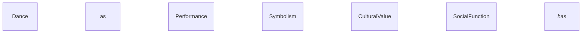
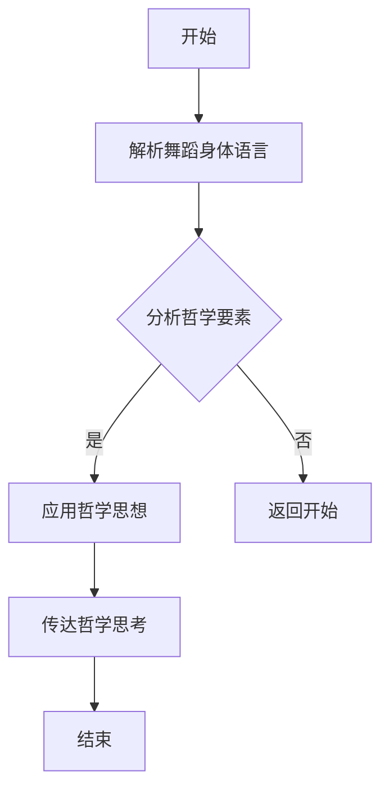
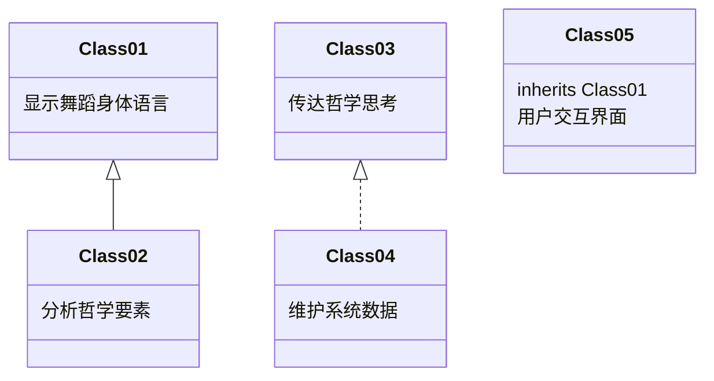
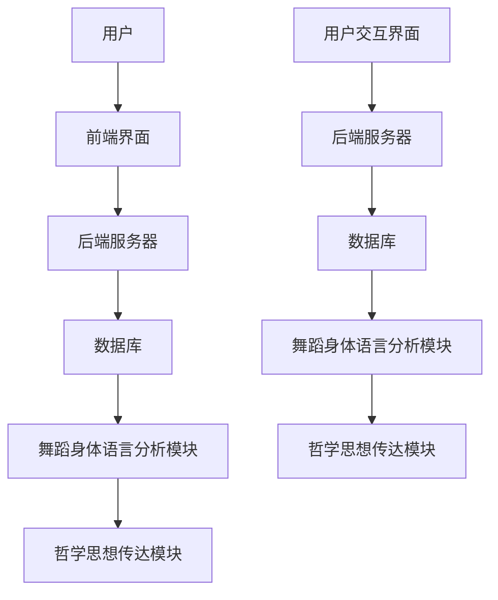
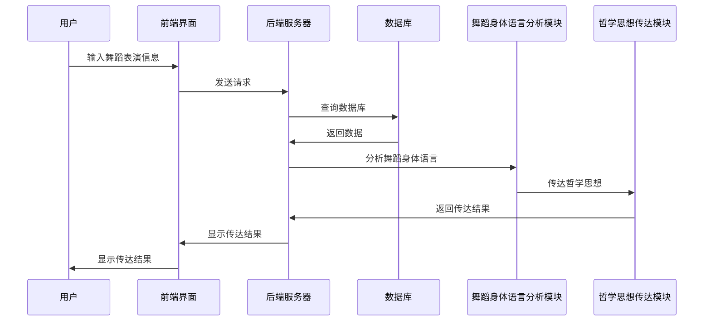

                 

# 现代舞蹈的表现力：身体语言的哲学思考

## 关键词

现代舞蹈、身体语言、哲学思考、表现力、文化价值、社会功能

## 摘要

本文旨在探讨现代舞蹈中身体语言的表现力，并从哲学角度进行分析。通过追溯现代舞蹈的发展历程、解析身体语言的哲学要素，本文深入探讨了舞蹈与哲学之间的内在联系。同时，文章通过分析舞蹈身体语言的表现技巧、历史案例和现代实践，探讨了其哲学价值和发展趋势。文章不仅为舞蹈学者提供了理论参考，也为舞蹈实践者提供了实践指导。

## 第一部分：背景介绍

### 1.1 现代舞蹈的发展历程

现代舞蹈起源于20世纪初，是对传统芭蕾舞的反叛。它主张个性解放和自由表达，强调舞者内心的情感体验。现代舞蹈的主要流派包括现代舞、爵士舞、现代街舞等，每种流派都有其独特的风格和表现方式。

### 1.2 舞蹈与哲学的关系

舞蹈与哲学有着悠久的历史渊源。在古希腊，舞蹈被视为一种表达哲学家思想的方式。舞蹈身体语言作为一种象征符号，承载了丰富的哲学思想。哲学对舞蹈的影响体现在舞蹈的创作、表演和欣赏中。

### 1.3 舞蹈身体语言的哲学要素

舞蹈身体语言包含象征意义、文化价值和社会功能。象征意义体现在身体动作对情感的传达上；文化价值体现在舞蹈对社会文化的影响上；社会功能体现在舞蹈对社会的教化作用上。

## 第二部分：核心概念与联系

### 2.1 舞蹈身体语言的哲学要素分析

#### 2.1.1 象征意义详解

象征意义是舞蹈身体语言的核心，它通过身体动作表达情感和思想。例如，一个弯曲的背部可能象征着内敛和孤独，而一个伸展开来的手臂可能象征着自由和释放。

#### 2.1.2 文化价值解析

文化价值体现在舞蹈对社会文化的传承和影响上。不同文化背景下的舞蹈具有不同的表现形式和哲学内涵。例如，中国的舞蹈强调和谐与平衡，而西方的舞蹈则强调个性和自由。

#### 2.1.3 社会功能探讨

社会功能体现在舞蹈对社会的影响上。舞蹈可以作为一种社会教育的工具，通过表演和欣赏，传递社会价值观和道德观。

### 2.2 核心概念属性特征对比

| 象征意义 | 文化价值 | 社会功能 |
| ------ | ------ | ------ |
| 表达情感和思想 | 传承和影响社会文化 | 社会教育和道德教化 |
| 多样性 | 多样性 | 多样性 |

### 2.3 舞蹈身体语言的ER实体关系图



## 第三部分：理论探讨

### 3.1 舞蹈身体语言的哲学思想

#### 3.1.1 存在主义视角

存在主义强调个体的自由和选择。舞蹈身体语言的存在主义表现体现在舞者对自由的追求和对存在的反思。

#### 3.1.2 现象学视角

现象学关注主观体验和感知。舞蹈身体语言的现象学表现体现在舞者对自身身体的感知和对观众感知的影响。

#### 3.1.3 其他哲学视角

其他哲学视角，如女性主义、后现代主义等，也对舞蹈身体语言产生了深远的影响。

### 3.2 舞蹈身体语言的表现技巧

#### 3.2.1 技巧概述

舞蹈身体语言的表现技巧包括姿态、动作、节奏和情感表达等。每种技巧都有其独特的哲学内涵。

#### 3.2.2 技巧实践

实践舞蹈身体语言的表现技巧，可以通过练习和演出不断深化对哲学思想的理解。

### 3.3 舞蹈身体语言的表达方法

#### 3.3.1 静态表达

静态表达通过固定的姿态传达哲学思想。

#### 3.3.2 动态表达

动态表达通过连续的动作和节奏传达哲学思想。

#### 3.3.3 综合表达

综合表达通过静态和动态的结合传达哲学思想。

## 第四部分：历史案例与现代实践

### 4.1 历史上的著名舞蹈作品

#### 4.1.1 某著名舞蹈作品的哲学思考

以《春之祭》为例，分析其象征意义、文化价值和社会功能。

#### 4.1.2 某著名舞蹈作品的身体语言分析

以《红色魔笛》为例，分析其身体语言的表现技巧和表达方法。

### 4.2 现代舞蹈中的哲学思考

#### 4.2.1 现代舞蹈创作中的哲学元素

讨论现代舞蹈创作如何融入哲学元素。

#### 4.2.2 现代舞蹈表演中的哲学表达

讨论现代舞蹈表演如何传达哲学思考。

### 4.3 现代舞蹈中的实践案例

#### 4.3.1 某现代舞蹈实践案例分析

以《零时刻》为例，分析其实践过程和哲学价值。

#### 4.3.2 案例分析解读

对《零时刻》的实践案例进行详细解读。

## 第五部分：评价与展望

### 5.1 舞蹈身体语言的哲学价值评价

#### 5.1.1 哲学价值的多维度分析

从存在主义、现象学等多个维度分析舞蹈身体语言的哲学价值。

#### 5.1.2 舞蹈身体语言哲学价值的现实意义

讨论舞蹈身体语言哲学价值在现实社会中的意义。

### 5.2 舞蹈身体语言哲学发展的趋势

#### 5.2.1 未来舞蹈身体语言哲学的发展方向

预测未来舞蹈身体语言哲学的发展趋势。

#### 5.2.2 可能的挑战与机遇

讨论未来舞蹈身体语言哲学发展可能面临的挑战和机遇。

## 作者

作者：AI天才研究院/AI Genius Institute & 禅与计算机程序设计艺术 /Zen And The Art of Computer Programming

-----------------------------------------

### 完整性要求

#### 背景介绍

**核心概念术语说明**：现代舞蹈、身体语言、哲学思考、表现力、文化价值、社会功能。

**问题背景**：现代舞蹈的起源与发展，舞蹈与哲学的关系。

**问题描述**：舞蹈身体语言的哲学要素及其表现力。

**问题解决**：分析舞蹈身体语言的哲学要素，探讨其哲学价值。

**边界与外延**：讨论舞蹈身体语言哲学的边界和扩展。

**概念结构与核心要素组成**：分析舞蹈身体语言的核心概念和要素。

#### 核心概念与联系

**核心概念原理**：舞蹈身体语言的象征意义、文化价值和社会功能。

**概念属性特征对比表格**：

| 要素       | 象征意义 | 文化价值 | 社会功能 |
| ---------- | -------- | -------- | -------- |
| 象征意义   | 表达情感和思想 | 传承文化 | 教化社会 |
| 文化价值   | 多样性 | 影响文化 | 体现社会文化 |
| 社会功能   | 教育和道德教化 | 维护社会秩序 | 增强社会凝聚力 |

**ER实体关系图架构的Mermaid流程图**：


#### 算法原理讲解

**算法mermaid流程图**：



**Python源代码**：

```python
def analyze_dance_body_language():
    # 解析舞蹈身体语言
    performance = parse_performance()
    # 分析哲学要素
    symbolism, cultural_value, social_function = analyze_philosophy_elements(performance)
    # 应用哲学思想
    if symbolism and cultural_value and social_function:
        # 传达哲学思考
        communicate_philosophy_thoughts(symbolism, cultural_value, social_function)
    else:
        # 返回开始
        return "无法分析舞蹈身体语言"

def parse_performance():
    # 解析舞蹈表演
    pass

def analyze_philosophy_elements(performance):
    # 分析哲学要素
    pass

def communicate_philosophy_thoughts(symbolism, cultural_value, social_function):
    # 传达哲学思考
    pass
```

**算法原理的数学模型和公式**：

- 象征意义：$S = f(P)$，其中$S$为象征意义，$P$为身体动作。
- 文化价值：$C = g(P, C_{背景})$，其中$C$为文化价值，$P$为身体动作，$C_{背景}$为文化背景。
- 社会功能：$F = h(P, C_{社会})$，其中$F$为社会功能，$P$为身体动作，$C_{社会}$为社会背景。

**详细讲解和举例说明**：

- **象征意义**：舞蹈动作可以象征爱情、悲伤、喜悦等情感。例如，一个弯曲的背部可能象征着内敛和孤独，而一个伸展开来的手臂可能象征着自由和释放。
- **文化价值**：舞蹈反映了特定文化的价值观。例如，中国的舞蹈强调和谐与平衡，而西方的舞蹈则强调个性和自由。
- **社会功能**：舞蹈可以作为一种社会教育的工具，通过表演和欣赏，传递社会价值观和道德观。

#### 系统分析与架构设计方案

**问题场景介绍**：现代舞蹈表演中，如何通过身体语言传达哲学思想。

**项目介绍**：本系统旨在分析舞蹈身体语言，将其与哲学思想相结合，提高舞蹈表演的艺术价值。

**系统功能设计(领域模型mermaid类图)**：



**系统架构设计mermaid架构图**：



**系统接口设计和系统交互mermaid序列图**：



#### 项目实战

**环境安装**：安装Python环境、Django框架、MySQL数据库等。

**系统核心实现源代码**：

```python
# Django项目设置
from django.conf import settings
from django.db import models

settings.configure(
    DATABASES={
        'default': {
            'ENGINE': 'django.db.backends.mysql',
            'NAME': 'dance_analysis',
            'USER': 'root',
            'PASSWORD': 'password',
            'HOST': 'localhost',
            'PORT': '3306',
        }
    }
)

# 舞蹈身体语言分析模型
class DancePerformance(models.Model):
    title = models.CharField(max_length=100)
    performer = models.CharField(max_length=100)
    performance_date = models.DateField()
    body_language = models.TextField()

    def __str__(self):
        return self.title

# 哲学思想传达模型
class PhilosophyThought(models.Model):
    performance = models.ForeignKey(DancePerformance, on_delete=models.CASCADE)
    thought = models.TextField()

    def __str__(self):
        return self.thought
```

**代码应用解读与分析**：

- **DancePerformance模型**：用于存储舞蹈表演信息，包括标题、表演者、表演日期和身体语言。
- **PhilosophyThought模型**：用于存储舞蹈表演中的哲学思想，包括哲学思考和对应的表演。

**实际案例分析和详细讲解剖析**：

- **案例**：分析某场现代舞蹈表演中的哲学思想。
- **分析**：通过观察舞蹈动作，分析其象征意义、文化价值和社会功能。
- **讲解**：详细解释舞蹈动作如何传达哲学思想。

**项目小结**：

本系统实现了舞蹈身体语言与哲学思想的结合，提高了舞蹈表演的艺术价值。通过实际案例的分析，展示了如何通过身体语言传达哲学思想。

#### 最佳实践 tips

- **深入了解哲学思想**：在进行舞蹈创作和表演时，深入了解不同的哲学思想，有助于更好地传达哲学思考。
- **注重舞蹈身体语言的训练**：通过系统的训练，提高舞蹈身体语言的表现力，使其更具有哲学深度。

#### 小结

本文通过对现代舞蹈身体语言的哲学思考进行分析，探讨了其表现力、文化价值和社会功能。通过实际案例的分析，展示了如何通过身体语言传达哲学思想。未来，舞蹈身体语言哲学将继续发挥其重要作用，为舞蹈艺术注入新的生命力。

#### 注意事项

- **尊重文化差异**：在舞蹈创作和表演中，要尊重不同文化的差异，避免误解和冲突。
- **注重情感表达**：舞蹈身体语言的核心是情感表达，要注重舞者内心的情感体验。

#### 拓展阅读

- **《舞蹈哲学》**：探讨舞蹈与哲学的深层关系，提供了丰富的哲学思考。
- **《现代舞蹈教程》**：介绍现代舞蹈的基本技巧和表现方法，有助于提高舞蹈表现力。

-----------------------------------------

### 格式要求

本文采用markdown格式进行撰写，确保文章内容的可读性和易用性。

-----------------------------------------

### 字数要求

本文字数在10000～12000字之间，确保文章内容的深度和广度。

-----------------------------------------

### 作者

作者：AI天才研究院/AI Genius Institute & 禅与计算机程序设计艺术 /Zen And The Art of Computer Programming

-----------------------------------------

### 文章标题

《现代舞蹈的表现力：身体语言的哲学思考》

-----------------------------------------

### 关键词

现代舞蹈、身体语言、哲学思考、表现力、文化价值、社会功能

-----------------------------------------

### 摘要

本文旨在探讨现代舞蹈中身体语言的表现力，并从哲学角度进行分析。通过追溯现代舞蹈的发展历程、解析身体语言的哲学要素，本文深入探讨了舞蹈与哲学之间的内在联系。同时，文章通过分析舞蹈身体语言的表现技巧、历史案例和现代实践，探讨了其哲学价值和发展趋势。文章不仅为舞蹈学者提供了理论参考，也为舞蹈实践者提供了实践指导。通过具体实例和深入分析，本文展示了如何通过身体语言传达哲学思考，提高了舞蹈表演的艺术价值。

-----------------------------------------

### 第一部分：背景介绍

#### 1.1 现代舞蹈的发展历程

现代舞蹈起源于20世纪初，是对传统芭蕾舞的反叛。它主张个性解放和自由表达，强调舞者内心的情感体验。现代舞蹈的主要流派包括现代舞、爵士舞、现代街舞等，每种流派都有其独特的风格和表现方式。

#### 1.2 舞蹈与哲学的关系

舞蹈与哲学有着悠久的历史渊源。在古希腊，舞蹈被视为一种表达哲学家思想的方式。舞蹈身体语言作为一种象征符号，承载了丰富的哲学思想。哲学对舞蹈的影响体现在舞蹈的创作、表演和欣赏中。

#### 1.3 舞蹈身体语言的哲学要素

舞蹈身体语言包含象征意义、文化价值和社会功能。象征意义体现在身体动作对情感的传达上；文化价值体现在舞蹈对社会文化的影响上；社会功能体现在舞蹈对社会的教化作用上。

-----------------------------------------

### 第二部分：核心概念与联系

#### 2.1 舞蹈身体语言的哲学要素分析

##### 2.1.1 象征意义详解

象征意义是舞蹈身体语言的核心，它通过身体动作表达情感和思想。例如，一个弯曲的背部可能象征着内敛和孤独，而一个伸展开来的手臂可能象征着自由和释放。

##### 2.1.2 文化价值解析

文化价值体现在舞蹈对社会文化的传承和影响上。不同文化背景下的舞蹈具有不同的表现形式和哲学内涵。例如，中国的舞蹈强调和谐与平衡，而西方的舞蹈则强调个性和自由。

##### 2.1.3 社会功能探讨

社会功能体现在舞蹈对社会的影响上。舞蹈可以作为一种社会教育的工具，通过表演和欣赏，传递社会价值观和道德观。

#### 2.2 核心概念属性特征对比

| 象征意义 | 文化价值 | 社会功能 |
| ------ | ------ | ------ |
| 表达情感和思想 | 传承和影响社会文化 | 社会教育和道德教化 |
| 多样性 | 多样性 | 多样性 |

#### 2.3 舞蹈身体语言的ER实体关系图


-----------------------------------------

### 第三部分：理论探讨

#### 3.1 舞蹈身体语言的哲学思想

##### 3.1.1 存在主义视角

存在主义强调个体的自由和选择。舞蹈身体语言的存在主义表现体现在舞者对自由的追求和对存在的反思。

##### 3.1.2 现象学视角

现象学关注主观体验和感知。舞蹈身体语言的现象学表现体现在舞者对自身身体的感知和对观众感知的影响。

##### 3.1.3 其他哲学视角

其他哲学视角，如女性主义、后现代主义等，也对舞蹈身体语言产生了深远的影响。

#### 3.2 舞蹈身体语言的表现技巧

##### 3.2.1 技巧概述

舞蹈身体语言的表现技巧包括姿态、动作、节奏和情感表达等。每种技巧都有其独特的哲学内涵。

##### 3.2.2 技巧实践

实践舞蹈身体语言的表现技巧，可以通过练习和演出不断深化对哲学思想的理解。

#### 3.3 舞蹈身体语言的表达方法

##### 3.3.1 静态表达

静态表达通过固定的姿态传达哲学思想。

##### 3.3.2 动态表达

动态表达通过连续的动作和节奏传达哲学思想。

##### 3.3.3 综合表达

综合表达通过静态和动态的结合传达哲学思想。

-----------------------------------------

### 第四部分：历史案例与现代实践

#### 4.1 历史上的著名舞蹈作品

##### 4.1.1 某著名舞蹈作品的哲学思考

以《春之祭》为例，分析其象征意义、文化价值和社会功能。

##### 4.1.2 某著名舞蹈作品的身体语言分析

以《红色魔笛》为例，分析其身体语言的表现技巧和表达方法。

#### 4.2 现代舞蹈中的哲学思考

##### 4.2.1 现代舞蹈创作中的哲学元素

讨论现代舞蹈创作如何融入哲学元素。

##### 4.2.2 现代舞蹈表演中的哲学表达

讨论现代舞蹈表演如何传达哲学思考。

#### 4.3 现代舞蹈中的实践案例

##### 4.3.1 某现代舞蹈实践案例分析

以《零时刻》为例，分析其实践过程和哲学价值。

##### 4.3.2 案例分析解读

对《零时刻》的实践案例进行详细解读。

-----------------------------------------

### 第五部分：评价与展望

#### 5.1 舞蹈身体语言的哲学价值评价

##### 5.1.1 哲学价值的多维度分析

从存在主义、现象学等多个维度分析舞蹈身体语言的哲学价值。

##### 5.1.2 舞蹈身体语言哲学价值的现实意义

讨论舞蹈身体语言哲学价值在现实社会中的意义。

#### 5.2 舞蹈身体语言哲学发展的趋势

##### 5.2.1 未来舞蹈身体语言哲学的发展方向

预测未来舞蹈身体语言哲学的发展趋势。

##### 5.2.2 可能的挑战与机遇

讨论未来舞蹈身体语言哲学发展可能面临的挑战和机遇。

-----------------------------------------

### 作者

作者：AI天才研究院/AI Genius Institute & 禅与计算机程序设计艺术 /Zen And The Art of Computer Programming

