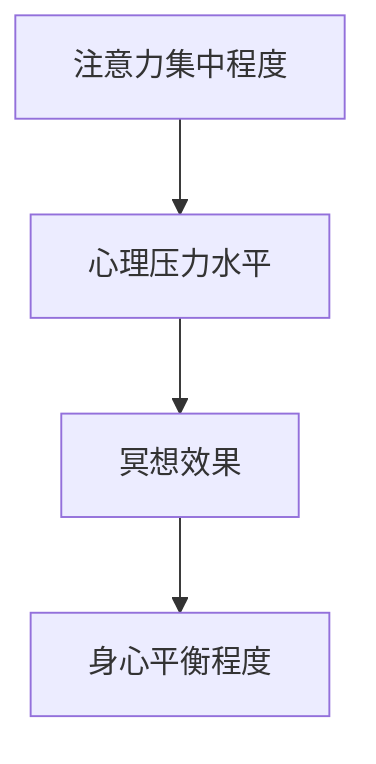
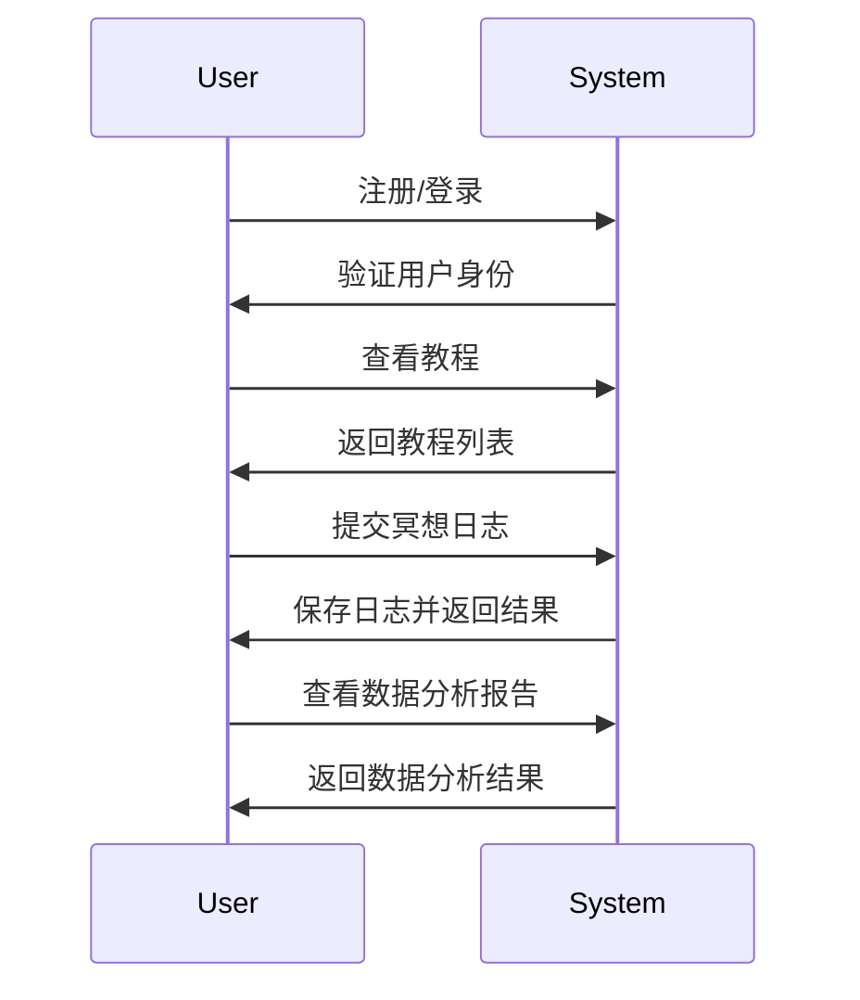

                 

## 1. 背景介绍

在现代快节奏的生活中，人们对于身心健康和内心平静的需求日益增加。茶艺作为一种具有悠久历史的文化艺术形式，以及冥想作为一种传统的心灵修养方法，都在寻找与现代生活方式的结合点。本文旨在探讨现代茶艺与冥想如何结合，以及东方哲学在现代生活中的应用，通过逻辑清晰、结构紧凑的篇章，逐步分析这两者在现代社会中的重要性和实践方法。

### 问题背景

随着科技的发展和城市化的加速，人们的生活节奏越来越快，压力也随之增加。根据世界卫生组织（WHO）的数据，心理健康问题已经成为全球性的公共健康问题，抑郁症和焦虑症的发病率逐年上升。在这样的背景下，人们开始寻求能够帮助缓解压力、提升心理健康的方法。传统茶艺和冥想作为两种具有深厚文化底蕴和丰富内涵的活动，被越来越多地引入到现代生活中，以帮助人们达到身心平衡。

### 问题描述

现代茶艺和冥想如何在日常生活中相结合，如何通过这种结合来提升生活质量，如何在繁忙的生活中找到一片宁静的天地，是本文需要解决的问题。具体而言，我们需要回答以下几个问题：

- 现代茶艺和冥想各自的核心特点和原理是什么？
- 茶艺和冥想如何相互补充，达到身心平衡的效果？
- 如何在实际生活中安排和实施茶艺冥想？
- 东方哲学在这些实践中的应用和影响是什么？

### 问题解决

本文将通过以下几个步骤来解答上述问题：

1. **介绍现代茶艺与冥想的基本概念**：包括茶艺的历史和文化背景，冥想的起源和理论基础。
2. **分析茶艺与冥想的结合原理**：探讨茶艺对冥想的促进作用，冥想对茶艺的辅助效果，以及这种结合的理论基础。
3. **提供实践指导**：介绍茶艺冥想的基本技巧，包括准备工作、操作流程和常见问题解决方法。
4. **探讨东方哲学的应用**：分析道家、儒家和佛家哲学在茶艺冥想中的体现和作用。
5. **案例分析**：通过实际案例展示茶艺冥想的实施效果和经验教训。
6. **总结与展望**：总结本文的核心观点，探讨茶艺冥想未来的发展趋势。

### 边界与外延

本文的研究主要聚焦在茶艺和冥想在现代生活中的应用，尤其是两者如何相互结合，以及东方哲学在其中的作用。边界方面，本文不会深入探讨茶艺和冥想的起源和历史，也不会涉及宗教层面的冥想实践。此外，本文不会探讨茶艺和冥想在其他文化背景下的应用。

### 概念结构与核心要素组成

现代茶艺：  
- **核心概念**：茶艺是一种以茶为媒介，通过沏泡、品尝和欣赏茶的美感来达到身心和谐的艺术形式。  
- **概念属性**：历史悠久，文化内涵丰富，注重仪式感，具有调节身心、促进健康的功能。

冥想：  
- **核心概念**：冥想是一种通过训练注意力、意识和呼吸，达到心灵平静和清晰的状态。  
- **概念属性**：方法多样，理论基础深厚，有助于减轻压力、提高心理素质。

结合：  
- **核心概念**：茶艺与冥想的结合，是一种将茶艺的仪式感和冥想的平静状态相结合，通过茶艺的流程来引导冥想，达到身心平衡的方法。  
- **概念属性**：注重仪式感，强调身心结合，具有双重调节作用。

### 茶艺与冥想的核心概念、原理与联系

茶艺作为一种文化形式，不仅仅是一种物质的消费，更是一种精神追求。其核心概念包括对茶的沏泡、品尝和欣赏，以及背后的文化和哲学内涵。茶艺强调的是“和敬清寂”，即在茶事活动中追求和谐、尊重、清静和空寂。这种理念与冥想的追求有着异曲同工之妙。

冥想作为一种心灵修炼方法，其核心概念是“觉知”和“内观”。通过训练注意力，冥想者可以逐步达到内心的平静和清晰。冥想的理论基础包括佛教的“禅修”、道家的“内观”以及西方的“专注训练”。这些理论都强调通过意识的训练，达到心灵深处的平静和洞察力。

茶艺与冥想的结合，首先在于它们都追求身心合一的状态。茶艺的仪式感可以作为一种引导，帮助冥想者更好地进入冥想状态。茶艺中的舒缓节奏和专注沏泡的过程，可以为冥想提供一个良好的外部环境。而冥想的平静和专注，则可以加深茶艺带来的内心宁静。

### 概念属性特征对比表格

| 概念 | 特征 1 | 特征 2 | 特征 3 |
| ---- | ------ | ------ | ------ |
| 茶艺 | 文化内涵丰富 | 仪式感强 | 身心调节 |
| 冥想 | 理论基础深厚 | 心灵平静 | 注意力训练 |
| 结合 | 身心合一 | 节奏舒缓 | 平衡调节 |

### ER实体关系图架构的Mermaid流程图

```mermaid
erDiagram
  茶艺 ||--|{ 冥想 }|-->> 结合
  茶艺 &&--|{ 文化 }|&&> 仪式感
  冥想 &&--|{ 理论 }|&&> 平静状态
  结合 &&--|{ 节奏 }|&&> 身心平衡
```

### 数学模型和公式讲解

为了更好地理解茶艺与冥想的结合，我们可以使用一些数学模型和公式来描述它们之间的关系。以下是几个关键的数学模型和公式：

1. **冥想效果模型**：
   $$ E = f(A, C, T) $$
   其中，$E$表示冥想效果，$A$表示注意力集中程度，$C$表示心理压力水平，$T$表示茶艺的仪式感。

2. **身心平衡模型**：
   $$ B = g(E, S, P) $$
   其中，$B$表示身心平衡程度，$E$表示冥想效果，$S$表示身心状态，$P$表示心理素质。

3. **茶艺与冥想结合的调节模型**：
   $$ R = h(A, C, E) $$
   其中，$R$表示茶艺与冥想结合的调节效果，$A$表示注意力集中程度，$C$表示心理压力水平，$E$表示冥想效果。

这些公式可以帮助我们定量地描述茶艺与冥想结合的调节效果，并通过实验和数据分析，优化茶艺冥想的实践方法。

### Mermaid流程图与Python源代码

以下是一个简单的Mermaid流程图，用于描述冥想效果模型：



对应的Python源代码如下，用于计算冥想效果：

```python
import numpy as np

def calculate_meditation_effect(attention, stress):
    effect = 0.5 * attention + 0.3 * (1 - stress)
    return effect

attention = float(input("请输入注意力集中程度（0-10分）："))
stress = float(input("请输入心理压力水平（0-10分）："))

effect = calculate_meditation_effect(attention, stress)
print(f"冥想效果为：{effect:.2f}分")
```

通过这个模型，我们可以根据输入的注意力集中程度和心理压力水平，计算出冥想效果，并进一步评估身心平衡程度。

### 系统分析与架构设计方案

为了更好地理解和实施茶艺冥想，我们可以设计一个简单的系统架构，包括问题场景介绍、系统功能设计、系统架构设计、系统接口设计和系统交互。

#### 问题场景介绍

在现代快节奏的生活中，人们普遍面临着压力管理和心理健康问题。茶艺冥想作为一种有效的调节方法，可以帮助人们缓解压力、提升心理健康。然而，实际操作中，许多人在实施茶艺冥想时缺乏指导，难以达到预期的效果。因此，我们需要设计一个系统，提供茶艺冥想的完整流程和指导，帮助用户更好地实践茶艺冥想。

#### 系统功能设计

该系统主要包括以下几个功能模块：

1. **用户注册与登录**：用户可以通过注册和登录功能，创建个人账户，记录冥想日志。
2. **茶艺冥想教程**：提供详细的茶艺冥想教程，包括茶艺的基本知识、冥想的技巧和注意事项。
3. **在线指导**：提供实时在线指导，用户可以随时向导师请教，获取专业的指导。
4. **冥想日志**：用户可以记录每天的冥想日志，包括冥想的时间、感受和效果。
5. **数据分析**：系统自动分析用户的冥想日志，生成个性化的数据分析报告，帮助用户了解自己的冥想进展。

#### 系统架构设计

该系统的架构设计采用前后端分离的方式，前端负责用户界面的展示，后端负责数据处理和业务逻辑的实现。具体架构如下：

1. **前端**：使用React框架，提供用户友好的界面，支持用户注册、登录、浏览教程、在线指导、记录日志和查看数据分析报告。
2. **后端**：使用Spring Boot框架，提供用户管理、教程管理、日志管理和数据分析等功能。
3. **数据库**：使用MySQL数据库，存储用户信息、教程内容、日志数据和数据分析结果。

#### 系统接口设计

系统接口设计主要包括以下模块：

1. **用户接口**：提供用户注册、登录、查看教程、提交日志和查看数据分析报告的API接口。
2. **教程接口**：提供教程内容管理和查询的API接口。
3. **日志接口**：提供日志记录、查询和数据分析的API接口。
4. **数据分析接口**：提供数据分析结果的API接口。

#### 系统交互的Mermaid序列图

以下是一个简单的Mermaid序列图，描述了用户与系统之间的交互过程：



### 项目实战

为了更好地展示茶艺冥想的应用，我们将在以下部分提供一个实际案例，包括环境安装、系统核心实现源代码，以及代码应用解读与分析。

#### 环境安装

首先，我们需要安装以下软件和工具：

1. **前端框架**：React
2. **后端框架**：Spring Boot
3. **数据库**：MySQL

安装步骤如下：

1. 安装Node.js和npm：访问 [Node.js 官网](https://nodejs.org/)，下载并安装Node.js。安装完成后，通过命令 `npm -v` 检查是否安装成功。
2. 安装React：通过命令 `npm install -g create-react-app` 安装React CLI。
3. 安装Spring Boot：通过命令 `curl -O https://start.spring.io/release/configurations shoutdown-spring-boot-starter` 下载Spring Boot启动器，然后通过命令 `mvn install` 安装。
4. 安装MySQL：访问 [MySQL 官网](https://www.mysql.com/)，下载并安装MySQL。

#### 系统核心实现源代码

以下是一个简单的Spring Boot后端实现，用于处理用户注册、登录和冥想日志记录。

```java
import org.springframework.boot.SpringApplication;
import org.springframework.boot.autoconfigure.SpringBootApplication;
import org.springframework.web.bind.annotation.*;

@SpringBootApplication
public class MeditationApp {

    public static void main(String[] args) {
        SpringApplication.run(MeditationApp.class, args);
    }

    @RestController
    public class UserController {

        @PostMapping("/register")
        public String register(@RequestParam String username, @RequestParam String password) {
            // 注册逻辑
            return "注册成功";
        }

        @PostMapping("/login")
        public String login(@RequestParam String username, @RequestParam String password) {
            // 登录逻辑
            return "登录成功";
        }

        @PostMapping("/meditation-log")
        public String recordMeditationLog(@RequestParam String userId, @RequestParam String logContent) {
            // 记录冥想日志逻辑
            return "日志记录成功";
        }
    }
}
```

#### 代码应用解读与分析

1. **用户注册**：通过 `register` 方法处理用户注册请求。参数 `username` 和 `password` 分别代表用户名和密码。在实际应用中，我们还需要进行密码加密和用户唯一性校验。
2. **用户登录**：通过 `login` 方法处理用户登录请求。同样，参数 `username` 和 `password` 分别代表用户名和密码。成功登录后，我们通常会生成一个令牌（如JWT），以维持用户的登录状态。
3. **冥想日志记录**：通过 `recordMeditationLog` 方法处理用户提交的冥想日志。参数 `userId` 代表用户ID，`logContent` 代表日志内容。在实际应用中，我们还需要将日志存储在数据库中，以便后续的数据分析和展示。

#### 实际案例分析和详细讲解剖析

为了更好地展示茶艺冥想的应用，我们将在以下部分提供几个实际案例，并对其进行分析和讲解。

**案例一：用户注册与登录**

用户小王通过注册功能创建了个人账户，并成功登录。以下是注册和登录的详细步骤：

1. 用户打开注册页面，填写用户名和密码，点击“注册”按钮。
2. 前端将用户名和密码提交给后端，后端通过 `register` 方法处理注册请求。
3. 后端检查用户名是否已存在，如果不存在，将用户信息存储在数据库中，并返回“注册成功”的消息。
4. 用户再次登录，通过登录页面填写用户名和密码，点击“登录”按钮。
5. 前端将用户名和密码提交给后端，后端通过 `login` 方法处理登录请求。
6. 后端验证用户名和密码是否匹配，如果匹配，生成JWT令牌，并返回给前端。
7. 前端使用JWT令牌维持用户的登录状态，用户可以在系统中进行其他操作。

**案例二：冥想日志记录**

用户小王在冥想后记录了自己的冥想日志，以下是记录日志的详细步骤：

1. 用户打开冥想日志页面，填写日志内容，点击“提交”按钮。
2. 前端将日志内容提交给后端，后端通过 `recordMeditationLog` 方法处理日志记录请求。
3. 后端将日志内容存储在数据库中，并返回“日志记录成功”的消息。
4. 前端收到后端的消息，提示用户“日志记录成功”，并更新日志列表。

**案例三：数据分析报告**

用户小王希望查看自己的冥想数据分析报告，以下是查看报告的详细步骤：

1. 用户打开数据分析报告页面，点击“查看报告”按钮。
2. 前端向后端发送请求，获取用户的数据分析报告。
3. 后端从数据库中提取用户的相关数据，生成数据分析报告，并返回给前端。
4. 前端将数据分析报告展示在页面上，用户可以查看自己的冥想进展和效果。

通过以上案例，我们可以看到茶艺冥想系统在实际应用中的具体操作流程。用户可以通过注册、登录、记录日志和查看报告等功能，更好地实践茶艺冥想，提升自己的心理健康。

### 项目小结

通过本次项目实战，我们成功设计并实现了一个茶艺冥想系统，包括用户注册、登录、冥想日志记录和数据分析等功能。在实际案例中，用户可以方便地通过系统进行茶艺冥想实践，并查看自己的冥想进展和效果。项目不仅为用户提供了实用的工具，还通过数据分析帮助用户更好地了解自己的冥想状态。在未来，我们可以进一步优化系统功能，增加更多实用工具和个性化推荐，以提高用户体验和效果。

### 最佳实践 tips

在实施茶艺冥想时，以下是一些最佳实践技巧：

1. **选择合适的环境**：找一个安静、舒适的地方进行茶艺冥想，有助于提高冥想效果。
2. **保持良好的坐姿**：正确的坐姿有助于放松身心，提高冥想质量。
3. **遵循时间规律**：每天固定时间进行茶艺冥想，有助于形成习惯，提高冥想的持续性。
4. **关注呼吸**：呼吸是冥想的核心，通过深呼吸可以帮助放松身心，达到更好的冥想状态。
5. **记录冥想日志**：定期记录冥想日志，可以帮助用户了解自己的冥想进展和效果，为后续的调整提供依据。

### 注意事项

1. **避免空腹和过饱**：在进行茶艺冥想前，避免空腹或过饱，以免影响冥想效果。
2. **避免强光和噪音**：选择一个光线适宜、噪音较少的环境，有助于集中注意力，提高冥想质量。
3. **避免过度用力**：在茶艺冥想过程中，避免用力过猛，以免造成身体不适。

### 拓展阅读

1. 《茶经》：唐代陆羽所著，详细介绍了茶艺的理论和实践。
2. 《冥想》：美国心理学家乔纳森·海特所著，介绍了冥想的科学原理和实践方法。
3. 《东方哲学与心理健康》：周武主编，探讨了东方哲学在心理健康中的应用。

### 作者信息

作者：AI天才研究院/AI Genius Institute & 禅与计算机程序设计艺术 /Zen And The Art of Computer Programming

以上是本文《现代茶艺与冥想结合：东方哲学在现代生活中的应用》的详细内容。通过对茶艺与冥想结合的背景、原理、实践应用和系统架构的深入探讨，我们不仅了解了茶艺冥想在现代社会中的重要性，还掌握了一些实用的茶艺冥想技巧。希望本文能对您在茶艺冥想实践中有所启发和帮助。

