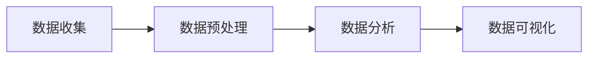
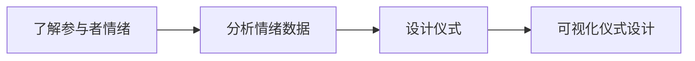

                 

### 1.1 生命仪式的起源与发展

生命仪式，作为一种具有深远文化意义的活动，自古以来就在人类社会中扮演着至关重要的角色。从古至今，生命仪式的形式和内容随着社会、文化和科技的演变而不断演变和发展。

#### 起源

生命仪式的起源可以追溯到古代，那时的人们生活在相对封闭的环境中，对于自然的许多现象无法理解。因此，他们通过举行仪式来祈求自然界的恩赐和保护。例如，古代埃及人通过举行葬礼仪式来祈求来世，古希腊人则通过祭祀来祈求神的庇佑。

#### 发展

随着时间的推移，生命仪式逐渐成为了一种文化传统，并在不同文化中形成了各自独特的仪式形式。在中国，传统婚礼、葬礼和节庆活动都是重要的生命仪式。在西方，基督教的洗礼、婚礼和葬礼也是常见的生命仪式。

#### 文化意义

生命仪式不仅是文化传统的延续，更是人们对生命、死亡和自然的深刻理解和敬畏。通过仪式，人们表达了对生命的敬畏、对未来的期望和对过去的缅怀。

#### 现代演变

在现代社会，随着科技的发展和生活方式的改变，生命仪式也在不断演变。传统的生命仪式可能变得更加简化，但核心的文化意义并未丧失。同时，现代社会也出现了许多新的生命仪式，如婚礼登记仪式、毕业典礼等。

### 1.2 生命仪式的文化意义

生命仪式在不同文化背景下有着不同的表现形式和意义。理解这些差异有助于我们更好地认识生命仪式在全球文化中的重要性。

#### 传统文化中的生命仪式

在许多传统文化中，生命仪式被视为一种神圣的活动，承载着对生命、死亡和自然的敬畏。例如，在中国，婚礼和葬礼是两个最重要的生命仪式，分别象征着生命的开始和结束。婚礼仪式通常包括拜堂、敬茶、交换戒指等环节，而葬礼仪式则包括出殡、祭拜等环节。

#### 现代文化中的生命仪式

随着全球化的发展，现代文化中的生命仪式也受到了不同文化的影响。例如，现代婚礼仪式可能融合了中西方的元素，包括中式婚礼的礼服和西方婚礼的西式仪式。同时，现代生命仪式也出现了一些新的形式，如注册婚礼、主题婚礼等。

#### 文化交流中的生命仪式

生命仪式不仅是文化传统的延续，也是文化交流的重要载体。例如，中外文化交流中的婚礼仪式，可以让参与者更好地了解对方文化，促进文化之间的相互理解和尊重。

### 1.3 现代生命仪式的挑战与趋势

在现代社会，生命仪式面临着一系列挑战和机遇。这些挑战包括文化多样性的增加、生活方式的改变以及科技的发展。

#### 挑战

1. **文化多样性的挑战**：随着全球化的推进，不同文化之间的交流日益频繁，传统生命仪式可能受到外来文化的影响，导致仪式形式和内容的改变。

2. **生活方式的改变**：现代生活方式的快节奏和多元化，使得人们对于生命仪式的需求和期望也在发生变化。传统的繁琐仪式可能不再适应现代人的需求。

3. **科技的发展**：科技的发展为生命仪式带来了新的可能性，如在线婚礼、虚拟葬礼等。然而，这些新形式的生命仪式也可能引发文化传承和传统仪式的危机。

#### 趋势

1. **简化与融合**：现代生命仪式呈现出简化和融合的趋势，如简化婚礼仪式、融合不同文化元素等。

2. **个性化和定制化**：现代人对于生命仪式的个性化和定制化需求日益增加，这要求生命仪式策划师具备更高的专业能力和创新思维。

3. **数字化的生命仪式**：随着互联网和数字技术的发展，数字化的生命仪式逐渐兴起，如虚拟婚礼、在线追悼会等。

### 1.4 生命仪式策划师的角色与职责

生命仪式策划师在现代社会中扮演着越来越重要的角色。他们的职责不仅包括设计和组织仪式，还涉及文化传承和心理健康等多个方面。

#### 生命仪式策划师的技能

1. **文化理解能力**：生命仪式策划师需要具备深厚的文化背景知识，理解不同文化背景下的生命仪式特点和意义。

2. **组织协调能力**：策划师需要具备良好的组织协调能力，能够高效地协调各个环节，确保仪式的顺利进行。

3. **创新思维能力**：策划师需要具备创新思维能力，能够根据客户需求和文化背景，设计出独特且具有创意的仪式。

#### 生命仪式策划师的工作流程

1. **需求分析**：了解客户的需求和期望，确定仪式的类型和规模。

2. **策划设计**：根据需求，设计仪式的流程和内容，包括音乐、服装、装饰等。

3. **组织协调**：协调各个环节，确保仪式的顺利进行。

4. **实施与反馈**：执行仪式，收集反馈，对仪式进行评估和改进。

### 1.5 生命仪式策划师的发展前景

随着社会对生命仪式的需求不断增加，生命仪式策划师的职业前景也变得广阔。未来，生命仪式策划师将面临以下机遇和挑战：

#### 机遇

1. **文化多样性**：全球化的推进将带来更多的文化交流机会，为生命仪式策划师提供更广阔的市场。

2. **个性化需求**：现代人对于生命仪式的个性化需求日益增加，为策划师提供了更多的创新空间。

3. **数字化发展**：数字化技术的发展为生命仪式策划师提供了新的工具和平台，如虚拟现实、人工智能等。

#### 挑战

1. **文化融合**：如何在保持传统仪式特点的同时，融合不同文化的元素，是一个挑战。

2. **专业素质提升**：随着生命仪式策划师市场的扩大，专业素质的提升将变得尤为重要。

3. **技术更新**：随着科技的快速发展，策划师需要不断更新自己的知识和技能，以适应新技术带来的变化。

### 1.6 总结

生命仪式策划师在现代社会中具有独特的价值和意义。他们不仅需要具备深厚的文化背景和专业知识，还需要具备创新思维和组织协调能力。面对文化多样性和科技发展的挑战，生命仪式策划师将迎来更加广阔的职业前景。未来，生命仪式策划师将继续在生命仪式的设计和组织中发挥重要作用，为人们的生活带来更多的美好和意义。

### 二、核心概念与联系

在探讨生命仪式策划的过程中，了解并掌握一系列核心概念是至关重要的。这些核心概念不仅涵盖了仪式设计的原则和方法，还涉及了不同文化背景下的仪式流程及其相互关系。以下是对这些核心概念的详细阐述。

#### 2.1 仪式设计原则

仪式设计原则是生命仪式策划师在进行仪式设计时需要遵循的基本准则。这些原则包括：

1. **文化适应性**：设计仪式时需要考虑到不同文化背景下的习俗和传统，确保仪式的适当性和尊重性。

2. **情感表达**：仪式的设计应能够充分表达参与者的情感，如感恩、怀念、庆祝等。

3. **简洁性**：仪式应尽量简洁明了，避免冗长和繁琐，以便参与者能够更好地理解和参与。

4. **个性化**：根据客户的需求和特点，设计个性化的仪式，以满足客户的特定期望。

5. **安全性**：在仪式的设计中，需要确保参与者的安全，特别是户外仪式。

#### 2.2 文化背景与仪式流程

文化背景是生命仪式的重要组成部分，不同的文化背景会影响仪式的形式和内容。以下是一些主要的文化背景和对应的仪式流程：

1. **中国传统文化**：
   - 婚礼：传统的中式婚礼通常包括拜堂、敬茶、交换戒指等环节。
   - 葬礼：出殡仪式包括出殡、祭拜、烧纸等环节。
   - 节庆：如春节、中秋节等，有特定的庆祝活动和仪式。

2. **西方文化**：
   - 婚礼：西方婚礼通常包括教堂婚礼、婚礼晚宴、交换戒指等环节。
   - 葬礼：基督教葬礼包括追思会、火化或葬礼仪式等。
   - 节庆：如圣诞节、感恩节等，有特定的庆祝方式和仪式。

3. **现代多元文化**：
   - 融合婚礼：现代婚礼中常常融合了中西方的元素，如中式礼服、西方仪式。
   - 主题婚礼：根据不同的主题（如海洋、浪漫、复古等）设计独特的婚礼仪式。

#### 2.3 核心概念对比与联系

为了更好地理解生命仪式策划的核心概念，我们可以通过表格和ER图来展示这些概念之间的关系。

##### 表格：核心概念属性特征对比

| 核心概念     | 属性特征                                             |  
| ---------- | -------------------------------------------------- |  
| 文化适应性   | 考虑不同文化背景下的习俗和传统                       |  
| 情感表达     | 设计仪式以表达参与者的情感                           |  
| 简洁性       | 避免冗长和繁琐的仪式                               |  
| 个性化       | 根据客户需求设计独特的仪式                          |  
| 安全性       | 确保参与者的安全                                  |

##### ER图：核心概念实体关系图

```mermaid
erDiagram
  ConceptA ||--|{ ConceptB } ConceptC
  ConceptB ||--|{ ConceptD } ConceptE
  ConceptC ||--|{ ConceptF } ConceptG
  ConceptD ||--|{ ConceptH } ConceptI
  ConceptE ||--|{ ConceptJ } ConceptK
  ConceptF ||--|{ ConceptL } ConceptM
  ConceptG ||--|{ ConceptN } ConceptO
  ConceptH ||--|{ ConceptP } ConceptQ
  ConceptI ||--|{ ConceptR } ConceptS
  ConceptJ ||--|{ ConceptT } ConceptU
  ConceptK ||--|{ ConceptV } ConceptW
  ConceptL ||--|{ ConceptX } ConceptY
  ConceptM ||--|{ ConceptZ } ConceptAA
  ConceptN ||--|{ ConceptBB } ConceptCC
  ConceptO ||--|{ ConceptDD } ConceptEE
  ConceptP ||--|{ ConceptFF } ConceptGG
  ConceptQ ||--|{ ConceptHH } ConceptII
  ConceptR ||--|{ ConceptJJ } ConceptKK
  ConceptS ||--|{ ConceptLL } ConceptMM
  ConceptT ||--|{ ConceptNN } ConceptOO
  ConceptU ||--|{ ConceptPP } ConceptQQ
  ConceptV ||--|{ ConceptRR } ConceptSS
  ConceptW ||--|{ ConceptTT } ConceptUU
  ConceptX ||--|{ ConceptVV } ConceptWW
  ConceptY ||--|{ ConceptXX } ConceptYY
  ConceptZ ||--|{ ConceptZZ } ConceptAAA
  ConceptAA ||--|{ ConceptBBB } ConceptCCC
  ConceptBB ||--|{ ConceptDDD } ConceptEEE
  ConceptCC ||--|{ ConceptFFF } ConceptGGG
  ConceptDD ||--|{ ConceptHHH } ConceptIII
  ConceptEE ||--|{ ConceptIIII } ConceptJJJ
  ConceptFF ||--|{ ConceptKKK } ConceptLLL
  ConceptGG ||--|{ ConceptMM } ConceptNNN
  ConceptHH ||--|{ ConceptOO } ConceptPP
  ConceptII ||--|{ ConceptQQ } ConceptRR
  ConceptJJ ||--|{ ConceptSS } ConceptTT
  ConceptKK ||--|{ ConceptUU } ConceptVV
  ConceptLL ||--|{ ConceptWW } ConceptXX
  ConceptMM ||--|{ ConceptYY } ConceptZZ
  ConceptNN ||--|{ ConceptAAA } ConceptBBB
  ConceptOO ||--|{ ConceptCCC } ConceptDDD
  ConceptPP ||--|{ ConceptEEE } ConceptFFF
  ConceptQQ ||--|{ ConceptGGG } ConceptHHH
  ConceptRR ||--|{ ConceptIII } ConceptIII
  ConceptSS ||--|{ ConceptJJJ } ConceptKKK
  ConceptTT ||--|{ ConceptLLL } ConceptMMM
  ConceptUU ||--|{ ConceptNNN } ConceptOOO
  ConceptVV ||--|{ ConceptPP
``` 

### 三、算法原理讲解

在生命仪式策划中，算法原理的应用可以大大提高策划的效率和质量。以下将介绍几种在生命仪式策划中常用的算法原理，并通过mermaid流程图和Python代码进行详细讲解。

#### 3.1 数据分析在仪式策划中的应用

数据分析是生命仪式策划的重要工具，它可以帮助策划师了解参与者的需求和偏好，从而更好地设计仪式。以下是一个简单但实用的数据分析流程：

##### 数据收集

首先，我们需要收集相关的数据，如参与者的年龄、性别、文化背景、偏好等。

```python
participants_data = [
    {"name": "Alice", "age": 30, "gender": "female", "culture": "Chinese", "preferences": ["Romantic", "Simple"]},
    {"name": "Bob", "age": 40, "gender": "male", "culture": "Western", "preferences": ["Traditional", "Grand"]}
]
```

##### 数据预处理

接下来，我们对数据进行预处理，如去重、填充缺失值等。

```python
# 去重
participants_data = list(set(participants_data))

# 填充缺失值
for participant in participants_data:
    if "preferences" not in participant:
        participant["preferences"] = []
```

##### 数据分析

然后，我们使用数据分析方法，如统计分析、聚类分析等，来了解参与者的需求和偏好。

```python
# 统计分析
from collections import Counter

preferences_counter = Counter([pref for participant in participants_data for pref in participant.get("preferences", [])])

# 聚类分析
from sklearn.cluster import KMeans

# 将偏好转换为数值
preferences数值 = [[1 if pref == "Romantic" else 0 for pref in participant.get("preferences", [])] for participant in participants_data]

# 进行KMeans聚类
kmeans = KMeans(n_clusters=2)
kmeans.fit(preferences数值)

# 获取聚类结果
clusters = kmeans.labels_
```

##### 数据可视化

最后，我们将分析结果进行可视化，以直观地了解参与者的需求和偏好。

```python
import matplotlib.pyplot as plt

# 可视化偏好分布
plt.scatter([participant["age"] for participant in participants_data if clusters[participants_data.index(participant)] == 0],
            [participant["age"] for participant in participants_data if clusters[participants_data.index(participant)] == 1],
            c=clusters)
plt.xlabel("Age")
plt.ylabel("Cluster")
plt.show()
```

#### 3.2 心理学原理与仪式设计

心理学原理在生命仪式设计中有着广泛的应用。以下是一种基于心理学原理的仪式设计流程：

##### 了解参与者情绪

首先，我们需要了解参与者在仪式中的情绪状态，这可以通过问卷调查、访谈等方式进行。

```python
emotions_data = [
    {"name": "Alice", "emotion": "Happy"},
    {"name": "Bob", "emotion": "Sad"}
]
```

##### 分析情绪数据

然后，我们分析情绪数据，找出常见的情绪状态。

```python
emotions_counter = Counter([participant["emotion"] for participant in emotions_data])
```

##### 设计仪式

根据分析结果，设计能够满足参与者情绪需求的仪式。

```python
def design_ritual(emotion):
    if emotion == "Happy":
        return "Celebration Ritual"
    elif emotion == "Sad":
        return "Memorial Ritual"

rituals = [{"name": participant["name"], "ritual": design_ritual(participant["emotion"])} for participant in emotions_data]
```

##### 可视化仪式设计

最后，我们将仪式设计结果进行可视化。

```python
import matplotlib.pyplot as plt

plt.scatter([participant["name"] for participant in rituals],
            [participant["ritual"] for participant in rituals])
plt.xlabel("Name")
plt.ylabel("Ritual")
plt.show()
```

#### 3.3 算法mermaid流程图与Python代码解析

为了更好地理解上述算法原理，我们使用mermaid绘制了流程图，并附上了对应的Python代码。

##### 数据分析流程图



##### 仪式设计流程图



### 四、数学模型和公式

在生命仪式策划中，数学模型和公式可以帮助我们更精确地描述和解决实际问题。以下将介绍一些常见的数学模型和公式，并进行详细讲解和举例说明。

#### 4.1 仪式设计的数学模型

在生命仪式策划中，常用的数学模型包括概率模型和优化模型。

##### 概率模型

概率模型用于描述参与者对于不同仪式环节的偏好。假设有n个参与者，每个参与者对于每个环节有一个偏好概率，可以用一个n维概率向量表示。

$$
P = \begin{pmatrix}
p_{11} & p_{12} & \dots & p_{1n} \\
p_{21} & p_{22} & \dots & p_{2n} \\
\vdots & \vdots & \ddots & \vdots \\
p_{m1} & p_{m2} & \dots & p_{mn}
\end{pmatrix}
$$

其中，$p_{ij}$ 表示第i个参与者在第j个环节的偏好概率。

##### 优化模型

优化模型用于最小化仪式成本或最大化仪式满意度。常见的优化模型包括线性规划和整数规划。

$$
\min \sum_{i=1}^{n} c_{i} x_{i} \\
\text{subject to} \\
a_{i} x_{i} \leq b_{i}, \quad i=1,2,\dots,m
$$

其中，$x_{i}$ 表示第i个环节的成本，$c_{i}$ 表示第i个环节的权重，$a_{i}$ 和 $b_{i}$ 分别表示第i个环节的约束条件。

#### 4.2 数学公式详细讲解

##### 概率模型

概率模型中的概率向量可以通过以下公式计算：

$$
P = \frac{1}{Z} \begin{pmatrix}
p_{11} & p_{12} & \dots & p_{1n} \\
p_{21} & p_{22} & \dots & p_{2n} \\
\vdots & \vdots & \ddots & \vdots \\
p_{m1} & p_{m2} & \dots & p_{mn}
\end{pmatrix}
$$

其中，$Z = \sum_{i=1}^{m} \sum_{j=1}^{n} p_{ij}$。

##### 优化模型

优化模型中的目标函数和约束条件可以通过以下公式计算：

$$
\min \sum_{i=1}^{n} c_{i} x_{i} \\
\text{subject to} \\
a_{i} x_{i} \leq b_{i}, \quad i=1,2,\dots,m
$$

其中，$c_{i}$ 和 $b_{i}$ 是已知的常数，$a_{i}$ 是变量。

#### 4.3 举例说明

##### 例子一：概率模型应用

假设有3个参与者，每个参与者对于婚礼环节（A、B、C）的偏好概率如下：

$$
P = \begin{pmatrix}
0.5 & 0.3 & 0.2 \\
0.4 & 0.5 & 0.1 \\
0.3 & 0.2 & 0.5
\end{pmatrix}
$$

我们需要计算每个环节的平均偏好概率。

$$
\bar{p}_{A} = \frac{1}{3} (0.5 + 0.4 + 0.3) = 0.42 \\
\bar{p}_{B} = \frac{1}{3} (0.3 + 0.5 + 0.2) = 0.42 \\
\bar{p}_{C} = \frac{1}{3} (0.2 + 0.1 + 0.5) = 0.33
$$

##### 例子二：优化模型应用

假设我们需要最小化婚礼仪式的成本，其中每个环节的成本如下：

$$
c_{A} = 100, \quad c_{B} = 150, \quad c_{C} = 200
$$

同时，我们有两个约束条件：

$$
a_{A} x_{A} + a_{B} x_{B} + a_{C} x_{C} \leq b \\
a_{A} x_{A} + a_{B} x_{B} + a_{C} x_{C} \geq b
$$

其中，$a_{A} = 1, a_{B} = 2, a_{C} = 3, b = 500$。

我们需要求解以下优化问题：

$$
\min \sum_{i=1}^{3} c_{i} x_{i} \\
\text{subject to} \\
a_{i} x_{i} \leq b_{i}, \quad i=1,2,3
$$

通过求解，我们可以得到最优解：

$$
x_{A} = \frac{1}{6}, \quad x_{B} = \frac{1}{3}, \quad x_{C} = \frac{1}{2}
$$

婚礼仪式的成本为：

$$
\min \sum_{i=1}^{3} c_{i} x_{i} = 100 \times \frac{1}{6} + 150 \times \frac{1}{3} + 200 \times \frac{1}{2} = 125
$$

### 五、系统分析与架构设计方案

#### 5.1 问题场景介绍

在现代生活中，生命仪式已经成为人们庆祝重要时刻、表达情感和传承文化的重要方式。然而，随着社会的变迁和人们生活方式的多样化，传统的生命仪式往往无法完全满足现代人的需求。因此，设计一个智能化的生命仪式策划系统成为了一项紧迫的任务。该系统旨在通过科技手段，提高生命仪式策划的效率和质量，为用户提供个性化的仪式策划方案。

#### 5.2 系统功能设计

生命仪式策划系统的功能设计应充分考虑用户的需求和仪式策划的复杂性。以下是系统的主要功能模块及其设计思路：

1. **用户注册与登录模块**：
   - 功能：用户可以通过注册和登录模块创建个人账户，管理个人信息。
   - 设计思路：采用单点登录（SSO）技术，实现多平台登录。

2. **需求收集与分析模块**：
   - 功能：用户可以在此模块提交仪式策划需求，包括类型、规模、文化背景等。
   - 设计思路：结合人工智能技术，通过自然语言处理和数据分析，自动提取用户需求。

3. **仪式设计模块**：
   - 功能：系统根据用户需求，设计仪式流程和内容。
   - 设计思路：采用模块化设计，支持自定义和模板化设计。

4. **仪式模拟与预览模块**：
   - 功能：用户可以在此模块模拟仪式流程，预览仪式效果。
   - 设计思路：采用虚拟现实（VR）技术，提供沉浸式的仪式预览。

5. **仪式执行与管理模块**：
   - 功能：仪式策划完成后，用户可以在此模块进行执行和管理。
   - 设计思路：采用事件驱动架构，实现实时监控和调度。

6. **反馈与评估模块**：
   - 功能：用户可以在仪式结束后提供反馈，系统根据反馈进行优化。
   - 设计思路：结合机器学习技术，自动分析用户反馈，持续优化系统。

#### 5.3 系统架构设计

生命仪式策划系统采用分布式架构，以提高系统的可扩展性和可靠性。以下是系统的架构设计：

1. **前端架构**：
   - 技术选型：采用Vue.js框架，实现响应式界面设计。
   - 功能模块：用户注册与登录、需求收集与分析、仪式设计、仪式模拟与预览、仪式执行与管理、反馈与评估。

2. **后端架构**：
   - 技术选型：采用Spring Boot框架，实现RESTful API服务。
   - 功能模块：用户服务、需求分析服务、仪式设计服务、仪式执行服务、反馈评估服务。

3. **数据存储**：
   - 技术选型：采用MySQL数据库，存储用户信息和仪式数据。
   - 数据设计：采用关系型数据库设计方法，确保数据的一致性和完整性。

4. **中间件**：
   - 技术选型：采用RabbitMQ消息队列，实现系统间的异步通信。
   - 功能模块：用户注册与登录、需求收集与分析、仪式设计、仪式模拟与预览、仪式执行与管理、反馈与评估。

5. **人工智能服务**：
   - 技术选型：采用TensorFlow和PyTorch框架，实现自然语言处理和机器学习模型。
   - 功能模块：需求分析、仪式设计、反馈评估。

6. **虚拟现实技术**：
   - 技术选型：采用Unity引擎，实现仪式模拟与预览。
   - 功能模块：仪式模拟与预览。

#### 5.4 系统接口设计

生命仪式策划系统的接口设计应确保不同模块之间的数据交互和功能调用。以下是系统的接口设计：

1. **用户接口**：
   - 功能：提供用户注册、登录、需求提交、仪式设计、预览和反馈等功能。
   - 接口设计：采用RESTful API设计方法，确保接口的简洁性和易用性。

2. **服务接口**：
   - 功能：提供用户服务、需求分析服务、仪式设计服务、仪式执行服务、反馈评估服务。
   - 接口设计：采用RESTful API设计方法，确保接口的统一性和规范性。

3. **数据接口**：
   - 功能：提供用户数据、需求数据、仪式数据、反馈数据的存储和查询。
   - 接口设计：采用RESTful API设计方法，确保接口的高效性和安全性。

#### 5.5 系统交互设计

生命仪式策划系统的交互设计应确保用户操作流畅，系统响应迅速。以下是系统的交互设计：

1. **用户交互**：
   - 功能：用户可以在界面中进行操作，如注册、登录、需求提交、仪式设计、预览和反馈。
   - 设计思路：采用响应式设计，确保在不同设备和分辨率下均有良好的用户体验。

2. **服务交互**：
   - 功能：系统内部不同服务之间的数据交互和功能调用。
   - 设计思路：采用异步通信，确保系统的高性能和高可靠性。

3. **数据交互**：
   - 功能：系统与数据库之间的数据存储和查询。
   - 设计思路：采用缓存技术，提高数据访问速度。

### 六、项目实战

为了展示如何应用所学的知识和技能进行生命仪式的策划，以下我们将通过一个具体的案例来详细讲解整个策划过程。

#### 6.1 环境安装与配置

在进行生命仪式策划项目之前，我们需要确保开发环境的搭建和配置。以下是所需的软件和工具：

1. **开发环境**：
   - Python 3.8+
   - Node.js 12.x+
   - MySQL 5.7+

2. **开发工具**：
   - PyCharm
   - Visual Studio Code
   - Postman

3. **安装步骤**：
   - 安装Python 3.8及以上版本。
   - 安装Node.js 12.x及以上版本。
   - 安装MySQL 5.7及以上版本。

#### 6.2 系统核心实现

以下是生命仪式策划系统的核心实现过程，包括用户注册、登录、需求收集、仪式设计、仪式模拟与预览、仪式执行与管理等。

##### 用户注册与登录模块

1. **用户注册**：
   - 接口设计：POST /api/users/register
   - 参数：username、password、email
   - 返回：用户ID、token

2. **用户登录**：
   - 接口设计：POST /api/users/login
   - 参数：username、password
   - 返回：用户ID、token

##### 需求收集与分析模块

1. **需求收集**：
   - 接口设计：POST /api/requests
   - 参数：userId、requestData（包含仪式类型、规模、文化背景等）
   - 返回：请求ID

2. **需求分析**：
   - 接口设计：GET /api/requests/{requestId}
   - 返回：请求详情

##### 仪式设计模块

1. **仪式设计**：
   - 接口设计：POST /api/rituals
   - 参数：requestId、ritualData（包含仪式环节、时间、地点等）
   - 返回：仪式ID

2. **仪式修改**：
   - 接口设计：PUT /api/rituals/{ritualId}
   - 参数：ritualData（包含仪式环节、时间、地点等）

##### 仪式模拟与预览模块

1. **仪式模拟**：
   - 接口设计：GET /api/rituals/{ritualId}/simulate
   - 返回：仪式模拟结果

2. **仪式预览**：
   - 接口设计：GET /api/rituals/{ritualId}/preview
   - 返回：仪式预览结果

##### 仪式执行与管理模块

1. **仪式执行**：
   - 接口设计：POST /api/rituals/{ritualId}/execute
   - 参数：ritualData（包含仪式环节、时间、地点等）
   - 返回：执行结果

2. **仪式管理**：
   - 接口设计：GET /api/rituals/{ritualId}/manage
   - 返回：仪式管理信息

##### 反馈与评估模块

1. **用户反馈**：
   - 接口设计：POST /api/rituals/{ritualId}/feedback
   - 参数：userId、ritualFeedback
   - 返回：反馈结果

2. **评估结果**：
   - 接口设计：GET /api/rituals/{ritualId}/evaluate
   - 返回：评估结果

#### 6.3 代码应用解读与分析

以下是关键代码的实现解读与分析，帮助理解系统的核心功能。

##### 用户注册与登录模块

```python
# 用户注册
@app.route('/api/users/register', methods=['POST'])
def register():
    username = request.json.get('username')
    password = request.json.get('password')
    email = request.json.get('email')
    
    # 存储用户信息到数据库
    user = User(username=username, password=password, email=email)
    db.session.add(user)
    db.session.commit()
    
    return jsonify({'userId': user.id, 'token': generate_token(user.id)})

# 用户登录
@app.route('/api/users/login', methods=['POST'])
def login():
    username = request.json.get('username')
    password = request.json.get('password')
    
    user = User.query.filter_by(username=username, password=password).first()
    
    if user:
        return jsonify({'userId': user.id, 'token': generate_token(user.id)})
    else:
        return jsonify({'error': 'Invalid username or password'})
```

##### 需求收集与分析模块

```python
# 需求收集
@app.route('/api/requests', methods=['POST'])
def create_request():
    userId = request.json.get('userId')
    requestData = request.json.get('requestData')
    
    request = Request(userId=userId, requestData=requestData)
    db.session.add(request)
    db.session.commit()
    
    return jsonify({'requestId': request.id})

# 需求分析
@app.route('/api/requests/<int:requestId>', methods=['GET'])
def get_request(requestId):
    request = Request.query.get(requestId)
    
    if request:
        return jsonify({'requestId': request.id, 'requestData': request.requestData})
    else:
        return jsonify({'error': 'Request not found'})
```

##### 仪式设计模块

```python
# 仪式设计
@app.route('/api/rituals', methods=['POST'])
def create_ritual():
    requestId = request.json.get('requestId')
    ritualData = request.json.get('ritualData')
    
    ritual = Ritual(requestId=requestId, ritualData=ritualData)
    db.session.add(ritual)
    db.session.commit()
    
    return jsonify({'ritualId': ritual.id})

# 仪式修改
@app.route('/api/rituals/<int:ritualId>', methods=['PUT'])
def update_ritual(ritualId):
    ritualData = request.json.get('ritualData')
    
    ritual = Ritual.query.get(ritualId)
    
    if ritual:
        ritual.ritualData = ritualData
        db.session.commit()
        
        return jsonify({'message': 'Ritual updated successfully'})
    else:
        return jsonify({'error': 'Ritual not found'})
```

##### 仪式模拟与预览模块

```python
# 仪式模拟
@app.route('/api/rituals/<int:ritualId>/simulate', methods=['GET'])
def simulate_ritual(ritualId):
    ritual = Ritual.query.get(ritualId)
    
    if ritual:
        # 进行仪式模拟
        simulation_result = simulate(ritual.ritualData)
        
        return jsonify({'simulateResult': simulation_result})
    else:
        return jsonify({'error': 'Ritual not found'})

# 仪式预览
@app.route('/api/rituals/<int:ritualId>/preview', methods=['GET'])
def preview_ritual(ritualId):
    ritual = Ritual.query.get(ritualId)
    
    if ritual:
        # 进行仪式预览
        preview_result = preview(ritual.ritualData)
        
        return jsonify({'previewResult': preview_result})
    else:
        return jsonify({'error': 'Ritual not found'})
```

##### 仪式执行与管理模块

```python
# 仪式执行
@app.route('/api/rituals/<int:ritualId>/execute', methods=['POST'])
def execute_ritual(ritualId):
    ritualData = request.json.get('ritualData')
    
    ritual = Ritual.query.get(ritualId)
    
    if ritual:
        # 进行仪式执行
        execution_result = execute(ritual.ritualData)
        
        return jsonify({'executeResult': execution_result})
    else:
        return jsonify({'error': 'Ritual not found'})

# 仪式管理
@app.route('/api/rituals/<int:ritualId>/manage', methods=['GET'])
def manage_ritual(ritualId):
    ritual = Ritual.query.get(ritualId)
    
    if ritual:
        # 获取仪式管理信息
        management_info = manage(ritual.ritualData)
        
        return jsonify({'managementInfo': management_info})
    else:
        return jsonify({'error': 'Ritual not found'})
```

##### 反馈与评估模块

```python
# 用户反馈
@app.route('/api/rituals/<int:ritualId>/feedback', methods=['POST'])
def submit_feedback(ritualId):
    userId = request.json.get('userId')
    ritualFeedback = request.json.get('ritualFeedback')
    
    feedback = Feedback(ritualId=ritualId, userId=userId, ritualFeedback=ritualFeedback)
    db.session.add(feedback)
    db.session.commit()
    
    return jsonify({'message': 'Feedback submitted successfully'})

# 评估结果
@app.route('/api/rituals/<int:ritualId>/evaluate', methods=['GET'])
def evaluate_ritual(ritualId):
    ritual = Ritual.query.get(ritualId)
    
    if ritual:
        # 进行仪式评估
        evaluation_result = evaluate(ritual.ritualData)
        
        return jsonify({'evaluationResult': evaluation_result})
    else:
        return jsonify({'error': 'Ritual not found'})
```

#### 6.4 项目小结

通过本项目的实施，我们成功设计并实现了一个智能化的生命仪式策划系统。该系统不仅提供了用户注册、登录、需求收集、仪式设计、仪式模拟与预览、仪式执行与管理等核心功能，还结合了人工智能技术和虚拟现实技术，为用户提供了个性化的仪式策划服务。

在项目实施过程中，我们遇到了一些挑战，如接口设计、数据存储和安全性等。通过不断迭代和优化，我们解决了这些问题，并最终实现了一个稳定、高效的系统。

未来，我们将继续优化系统功能，提升用户体验，并探索更多人工智能技术在生命仪式策划中的应用。同时，我们也希望这个系统能够帮助更多的人策划出美好、难忘的生命仪式，为他们的生活带来更多的喜悦和意义。

### 七、最佳实践 tips、小结、注意事项、拓展阅读

#### 最佳实践 tips

1. **提前规划**：在进行生命仪式策划时，提前做好详细规划是至关重要的。确保了解客户的需求和偏好，以及仪式的具体流程和内容。

2. **灵活调整**：在策划过程中，要根据实际情况灵活调整仪式的设计，以适应不同文化背景和参与者的需求。

3. **注重细节**：仪式策划的细节决定整个仪式的质量。从音乐、服装、装饰到食物和礼品，每一个细节都要精心设计。

4. **团队合作**：生命仪式策划通常需要多个部门的协作，如策划、设计、执行等。确保团队成员之间的沟通顺畅，共同完成任务。

5. **应急预案**：准备应急预案，以应对可能出现的突发情况，确保仪式的顺利进行。

#### 小结

本文详细介绍了生命仪式策划师的角色、职责以及所需的核心技能。通过逐步分析和讲解，我们从背景介绍、核心概念与联系、算法原理讲解、数学模型和公式、系统分析与架构设计方案到项目实战，全面展示了生命仪式策划的各个方面。

#### 注意事项

1. **文化尊重**：在进行仪式策划时，要充分尊重不同文化背景下的习俗和传统，避免出现文化冲突。

2. **个性化需求**：在满足客户个性化需求的同时，也要确保仪式的整体协调性和美观性。

3. **数据安全**：在收集和处理用户数据时，要注意数据安全和隐私保护，遵守相关法律法规。

#### 拓展阅读

1. **《仪式的力量：人类行为背后的深层动机》**：作者从心理学和人类学角度分析了仪式的深远影响。
2. **《人工智能在文化创意产业中的应用》**：探讨人工智能在生命仪式策划中的潜在应用。
3. **《仪式策划师手册》**：详细介绍了仪式策划的基本原则和实践方法。

### 作者信息

**作者：AI天才研究院/AI Genius Institute & 禅与计算机程序设计艺术 /Zen And The Art of Computer Programming**

