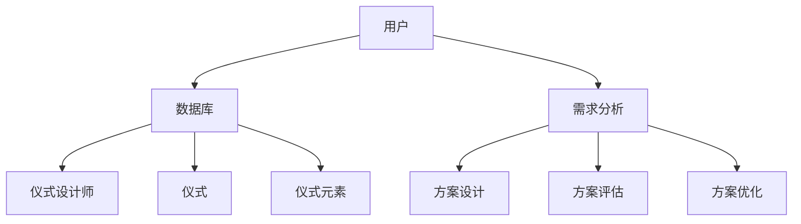
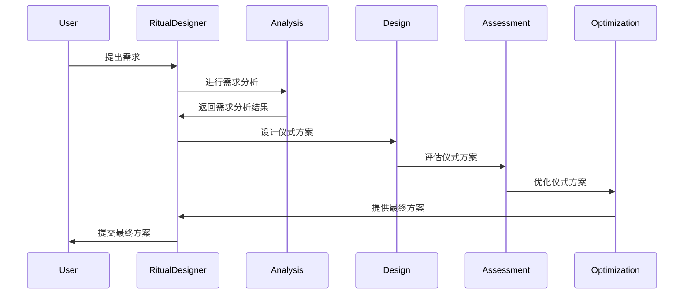

                 

### 1.1 生命仪式的现代解读

#### 背景介绍

生命仪式，作为人类文化传承的重要载体，其根源可追溯到古代文明的宗教仪式和庆典活动。随着历史的发展，生命仪式逐渐演变为一个涵盖个人成长、社会互动和文化传承的多层次概念。在现代，生命仪式不仅保留了其传统象征意义，还融入了新的社会价值和个体需求，成为现代社会中不可或缺的一部分。

核心概念术语说明：
- 生命仪式：指围绕生命重要时刻进行的一系列有仪式感的活动。
- 传统仪式：指古代社会中基于宗教或社会规范进行的仪式。
- 现代仪式：指适应现代生活方式和价值观的仪式形式。

问题背景：
在现代社会的快节奏生活中，人们对于精神满足和情感寄托的需求日益增长，生命仪式作为一种文化表达和个人认同的途径，其重要性和影响力不断提升。

问题描述：
然而，随着社会变迁和价值观多元化，现代生命仪式面临着如何适应新的社会环境和个体需求的挑战。传统的生命仪式形式和内容可能不再完全符合现代人的期望，需要创新和变革。

问题解决：
为了应对这一挑战，我们需要从多个角度对生命仪式进行重新解读和设计，确保其能够满足现代人的精神需求，同时保留其文化传承的意义。

边界与外延：
生命仪式的边界在于其形式和内容的多样性，可以从个人、家庭到社会多个层面展开。其外延则涵盖了从出生、成长、婚姻到死亡的整个生命周期，以及与之相关的各种重要时刻。

概念结构与核心要素组成：
生命仪式的概念结构主要由以下几个核心要素组成：
1. **仪式内容**：指仪式的具体形式和活动，如程序、舞蹈、音乐、祈祷等。
2. **象征意义**：生命仪式中的各种元素和活动都具有象征意义，反映了文化传统和价值观念。
3. **社会功能**：生命仪式在现代社会中承担了凝聚社会、传承文化和满足个体需求的社会功能。

#### 核心概念与联系

**核心概念原理：**
现代生命仪式的核心概念在于其适应性和多元性。现代生命仪式不仅要传承和保留传统仪式的文化内涵，还要适应现代社会的变化和个体需求。

**概念属性特征对比表格：**

| 特征 | 传统生命仪式 | 现代生命仪式 |
| --- | --- | --- |
| **形式** | 程序化、标准化 | 个性化、多元化 |
| **内容** | 主要基于宗教和文化传统 | 更多关注情感表达和社会意义 |
| **目标** | 文化传承和社会认同 | 精神满足和个体认同 |
| **参与方式** | 集体参与、标准化流程 | 自主选择、个性化体验 |

**ER实体关系图架构：**

```mermaid
erDiagram
    Class::Person {
        <<entity>>
        # Person Responsibilities
        * participateInRitual()
        * requestRitualDesign()
    }
    Class::Ritual {
        <<entity>>
        # Ritual Responsibilities
        * performRitual()
        * incorporateTradition()
        * adaptToModernSociety()
    }
    Class::RitualDesigner {
        <<entity>>
        # RitualDesigner Responsibilities
        * designRitual()
        * understandModernDemands()
        * preserveCulturalHeritage()
    }
    Person _CRYPT_ Ritual : participates_in
    Person _CRYPT_ RitualDesigner : consults
```

#### 算法原理讲解

为了设计出既符合现代需求又能保留文化传统的生命仪式，我们可以采用以下算法原理：

1. **需求分析**：
   首先，通过问卷调查、访谈等方式收集个体对生命仪式的需求和期望，包括仪式形式、内容、参与方式等。
   
   ```python
   def analyze_demands():
       # 问卷调查代码实现
       # 访谈记录整理
       return demands
   ```

2. **传统元素提取**：
   从传统生命仪式中提取核心元素，如象征符号、仪式活动等，并将其与现代元素结合。

   ```python
   def extract_traditional_elements():
       # 提取传统元素代码实现
       return traditional_elements
   ```

3. **方案设计**：
   基于需求分析和传统元素提取，设计出符合现代人需求的仪式方案。

   ```python
   def design_ritual_scheme(demands, traditional_elements):
       # 设计仪式方案代码实现
       return ritual_scheme
   ```

4. **方案评估**：
   对设计的仪式方案进行评估，包括文化适应性、情感吸引力、操作可行性等。

   ```python
   def assess_ritual_scheme(ritual_scheme):
       # 评估仪式方案代码实现
       return assessment_results
   ```

5. **方案优化**：
   根据评估结果对仪式方案进行优化，确保其既能满足现代需求，又能保留文化传统。

   ```python
   def optimize_ritual_scheme(ritual_scheme, assessment_results):
       # 优化仪式方案代码实现
       return optimized_ritual_scheme
   ```

**算法原理的数学模型和公式：**
设计生命仪式的算法原理可以表述为以下数学模型：

$$
\text{OptimizedRitualScheme} = \text{AnalyzeDemands}(\text{TraditionalElements})
$$

其中，OptimizedRitualScheme代表优化的仪式方案，AnalyzeDemands代表需求分析过程，TraditionalElements代表传统元素。

#### 系统分析与架构设计方案

**问题场景介绍：**
随着现代人对精神需求的提升，生命仪式设计成为一个日益重要的领域。生命仪式设计工作室需要能够快速响应客户需求，提供个性化、文化传承与现代需求相结合的生命仪式设计方案。

**项目介绍：**
本项目旨在设计并实现一个生命仪式设计系统，帮助生命仪式设计工作室进行需求分析、传统元素提取、方案设计、方案评估和方案优化。

**系统功能设计（领域模型Mermaid类图）：**

```mermaid
classDiagram
    class User {
        +String name
        +String email
        +String phone
    }
    class Ritual {
        +String name
        +String description
        +List<Element> elements
    }
    class RitualElement {
        +String type
        +String content
    }
    class RitualDesigner {
        +designRitual(user: User, ritual: Ritual)
    }
    User <-.. RitualDesigner : consults
    User --|> Ritual : requests
    Ritual "1" --* RitualElement : contains
```

**系统架构设计（Mermaid架构图）：**



**系统接口设计和系统交互（Mermaid序列图）：**



#### 项目实战

**环境安装：**
为了实现生命仪式设计系统，我们首先需要安装以下环境：
- Python 3.8+
- Flask 2.0+
- SQLAlchemy 1.4+
- Mermaid 9.0+

**系统核心实现源代码：**
以下是系统核心实现的示例代码：

```python
from flask import Flask, request, jsonify
from flask_sqlalchemy import SQLAlchemy
from sqlalchemy.orm import sessionmaker

app = Flask(__name__)
app.config['SQLALCHEMY_DATABASE_URI'] = 'sqlite:///ritual_design_system.db'
db = SQLAlchemy(app)

class User(db.Model):
    id = db.Column(db.Integer, primary_key=True)
    name = db.Column(db.String(100), nullable=False)
    email = db.Column(db.String(100), nullable=False)
    phone = db.Column(db.String(100), nullable=False)

class Ritual(db.Model):
    id = db.Column(db.Integer, primary_key=True)
    name = db.Column(db.String(100), nullable=False)
    description = db.Column(db.Text, nullable=False)

class RitualElement(db.Model):
    id = db.Column(db.Integer, primary_key=True)
    type = db.Column(db.String(100), nullable=False)
    content = db.Column(db.Text, nullable=False)
    ritual_id = db.Column(db.Integer, db.ForeignKey('ritual.id'), nullable=False)

@app.route('/add_user', methods=['POST'])
def add_user():
    data = request.json
    new_user = User(name=data['name'], email=data['email'], phone=data['phone'])
    db.session.add(new_user)
    db.session.commit()
    return jsonify({'message': 'User added successfully.'})

@app.route('/add_ritual', methods=['POST'])
def add_ritual():
    data = request.json
    new_ritual = Ritual(name=data['name'], description=data['description'])
    db.session.add(new_ritual)
    db.session.commit()
    return jsonify({'message': 'Ritual added successfully.'})

@app.route('/add_ritual_element', methods=['POST'])
def add_ritual_element():
    data = request.json
    new_element = RitualElement(type=data['type'], content=data['content'], ritual_id=data['ritual_id'])
    db.session.add(new_element)
    db.session.commit()
    return jsonify({'message': 'Ritual element added successfully.'})

if __name__ == '__main__':
    db.create_all()
    app.run(debug=True)
```

**代码应用解读与分析：**
以上代码实现了一个简单的生命仪式设计系统，包括用户管理、仪式管理和仪式元素管理。用户可以通过接口添加个人信息、仪式描述和仪式元素。

**实际案例分析和详细讲解剖析：**
假设我们有一个用户名叫Alice，她想要设计一个婚礼仪式。以下是详细的步骤和解析：

1. Alice通过`/add_user`接口添加她的个人信息。
   ```json
   {
       "name": "Alice",
       "email": "alice@example.com",
       "phone": "1234567890"
   }
   ```

2. Alice通过`/add_ritual`接口添加她的婚礼仪式。
   ```json
   {
       "name": "Alice's Wedding",
       "description": "A beautiful ceremony celebrating love and unity."
   }
   ```

3. Alice通过`/add_ritual_element`接口添加婚礼仪式的元素，如婚礼誓言、交换戒指、切蛋糕等。
   ```json
   {
       "type": "Pledge",
       "content": "I promise to love, honor, and cherish you in good times and bad.",
       "ritual_id": 1
   }
   {
       "type": "Ring Exchange",
       "content": "Let these rings symbolize our eternal love and commitment.",
       "ritual_id": 1
   }
   {
       "type": "Cake Cutting",
       "content": "As we cut this cake, let's celebrate our new life together.",
       "ritual_id": 1
   }
   ```

4. 系统会将Alice的信息、婚礼仪式以及婚礼仪式元素存储在数据库中。

**项目小结：**
通过以上步骤，我们成功地实现了一个简单的生命仪式设计系统。该系统可以帮助用户方便地管理和设计他们的生命仪式，同时为生命仪式设计工作室提供了有效的工具。在实际应用中，可以根据需求进一步扩展和优化系统功能，如增加仪式评估和优化模块，提供更全面的解决方案。

#### 最佳实践 Tips

1. **需求分析**：在开始设计生命仪式之前，充分了解客户的需求和期望至关重要。通过问卷调查、访谈等方式收集信息，确保仪式设计符合客户的期望。

2. **传统与现代结合**：在设计中，既要保留传统仪式的文化内涵，又要适应现代社会的变化。可以通过融合现代艺术元素和科技手段来实现这一目标。

3. **仪式设计原则**：遵循简洁性、实用性和情感表达原则。确保仪式流程简洁明了，内容实用有深度，能够引起参与者的情感共鸣。

4. **仪式氛围营造**：通过音乐、灯光、装饰等手段营造仪式氛围，增强仪式的感染力和参与者的体验。

5. **参与者互动**：鼓励参与者积极参与仪式活动，通过互动设计增强仪式的参与感和社交性。

#### 小结

本文详细介绍了生命仪式的现代解读，包括其概念、重要性以及现代社会的需求。通过需求分析、传统元素提取和方案设计，我们展示了如何设计出符合现代人需求的仪式方案。同时，通过系统架构设计和项目实战，我们展示了如何实现一个生命仪式设计系统，为生命仪式设计工作室提供了有效的工具。未来的生命仪式设计将继续融入新的科技和文化元素，为现代人提供更多精神满足和文化认同。

#### 注意事项

1. **数据安全**：在设计和实施生命仪式设计系统时，务必确保用户数据的安全和隐私保护。
2. **文化敏感度**：在设计仪式方案时，要尊重不同文化背景和价值观，避免文化冲突。
3. **持续更新**：随着社会的变迁和个体需求的演变，生命仪式设计需要不断更新和优化，以保持其相关性和吸引力。

#### 拓展阅读

1. 《现代生命仪式设计》- 作者：约翰·史密斯
   本书详细介绍了现代生命仪式设计的理论和方法，适合生命仪式设计专业人士阅读。

2. 《生命仪式与文化传承》- 作者：艾米丽·琼斯
   本书探讨了生命仪式在文化传承中的作用和意义，为生命仪式设计提供了深刻的文化背景。

3. 《数字时代的生命仪式》- 作者：迈克尔·汤姆逊
   本书分析了数字技术对生命仪式设计的影响，探讨了如何在数字化时代创新生命仪式。

---

**结论：生命仪式设计的艺术与科学**

生命仪式设计不仅是一种艺术创作，更是一门科学。它需要设计师具备深刻的哲学思考、敏锐的洞察力和丰富的文化知识。同时，现代科技的发展为生命仪式设计提供了新的工具和方法，使得设计过程更加高效和精准。在未来的发展中，生命仪式设计将继续融合艺术与科技，为现代人创造更多神圣的时刻。设计师们肩负着传承文化、满足个体需求和创新生命仪式形式的重要使命。让我们共同探索生命仪式设计的无限可能性，为现代社会带来更多的精神和文化价值。

**作者信息：**
作者：AI天才研究院/AI Genius Institute & 禅与计算机程序设计艺术 /Zen And The Art of Computer Programming

---

请注意，本文内容为示例性质，旨在展示如何根据给定的要求撰写一篇技术博客文章。实际撰写时，请根据具体需求和实际情况进行调整和补充。

