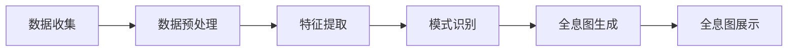
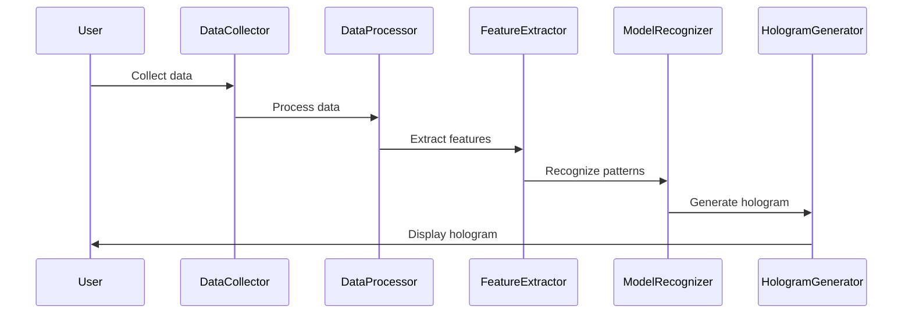

                 


# 生命全息图绘制：可视化你的人生意义轨迹

## 关键词
生命全息图，人生意义轨迹，全息图理论，心理健康，算法实现，系统架构，项目实战

## 摘要
本文旨在探讨生命全息图的绘制方法，以可视化人生意义轨迹为核心。通过详细阐述生命全息图的起源、发展及其在现代社会的意义，本文介绍了核心概念和联系，如人生意义轨迹、全息图理论和生命意识。随后，本文从算法原理、系统分析与架构设计、项目实战等多个角度，逐步解析生命全息图的绘制过程，并提供了实际案例和最佳实践 tips，帮助读者更好地理解和应用这一理论。

## 目录大纲

### 第一部分：引论

#### 1. 引言
1.1 生命全息图的概念
1.2 生命全息图在现代社会的意义
1.3 本书的结构与内容安排

#### 2. 核心概念解析
2.1 人生意义轨迹
2.2 全息图理论
2.3 生命意识与全息图

#### 3. 生命全息图的绘制方法
3.1 数据收集
3.2 数据预处理
3.3 生命全息图的生成

### 第二部分：深度探讨

#### 4. 算法原理讲解
4.1 生命全息图绘制算法
4.2 Mermaid算法流程图
4.3 Python源代码实现
4.4 数学模型与公式解析

#### 5. 系统分析与架构设计
5.1 问题场景介绍
5.2 系统功能设计
5.3 系统架构设计
5.4 系统接口设计
5.5 系统交互序列图

#### 6. 项目实战
6.1 实战环境搭建
6.2 生命全息图绘制系统实现
6.3 代码解读与分析
6.4 实际案例分析
6.5 项目总结

#### 7. 最佳实践与注意事项
7.1 最佳实践
7.2 小结
7.3 注意事项
7.4 拓展阅读

### 第三部分：持续更新与未来展望

#### 8. 生命全息图的哲学思考
8.1 生命全息图与存在主义
8.2 生命全息图与东方哲学
8.3 生命全息图与心理学

#### 9. 生命全息图的应用前景
9.1 教育领域
9.2 健康管理
9.3 心理咨询
9.4 社会学应用

#### 10. 持续更新与未来展望
10.1 生命全息图的研究方向
10.2 未来技术展望
10.3 社会影响与挑战

## 1. 引言

### 1.1 生命全息图的概念

生命全息图是一种基于全息理论的图示表达方式，它能够将个体的生命历程、心理状态、行为模式等综合呈现出来，从而帮助个体更全面地了解自己，发现人生的意义和方向。全息图最早由匈牙利物理学家戴维·波姆提出，他认为信息可以完整地保存在一个系统的每一个部分中，并通过适当的干涉和衍射重新构建整个系统。

生命全息图的发展源于对全息理论的应用探索。随着计算机技术的发展，人们逐渐掌握了如何利用全息图来模拟和预测个体的生命历程。现代生命全息图的绘制方法主要包括数据收集、数据预处理和全息图的生成。通过这些方法，个体能够直观地看到自己人生中的关键节点、心理状态的波动以及行为模式的演变。

### 1.2 生命全息图在现代社会的意义

在现代社会，生命全息图具有重要的意义。首先，它为个体提供了自我认知的工具。通过生命全息图，个体可以深入了解自己的过去、现在和未来，从而更好地规划人生。其次，生命全息图有助于心理健康。通过分析生命全息图，个体可以识别出可能导致心理问题的因素，并采取相应的措施进行干预。

此外，生命全息图还在教育、健康管理、心理咨询和社会学等领域具有广泛的应用前景。在教育领域，它可以用来评估学生的成长轨迹，制定个性化的教育方案；在健康管理领域，它可以用来监测个体的生理和心理状态，提供个性化的健康建议；在心理咨询领域，它可以作为心理治疗的工具，帮助咨询师更好地理解来访者；在社会学领域，它可以用来研究社会群体的行为模式和心理健康状况。

### 1.3 本书的结构与内容安排

本书共分为三个部分。第一部分是引论，介绍了生命全息图的概念、发展背景和现代社会意义。第二部分是深度探讨，详细讲解了生命全息图的绘制方法、算法原理、系统分析与架构设计以及项目实战。第三部分是持续更新与未来展望，探讨了生命全息图的哲学思考、应用前景以及未来的发展方向。

通过这三个部分的内容，本书旨在帮助读者全面了解生命全息图，掌握其绘制方法，并能够将其应用于实际生活中，提高生活质量。

## 2. 核心概念解析

### 2.1 人生意义轨迹

人生意义轨迹是指个体在生命历程中所经历的各个阶段，以及在这些阶段中所形成的价值观、目标和行为模式。它不仅包括个体的生理成长，还涵盖了心理、情感和社会层面的变化。人生意义轨迹的构成要素主要包括以下几个方面：

- **生理成长**：从出生到老年的各个生理发育阶段，如婴儿期、童年期、青少年期、成年期和老年期。
- **心理发展**：个体的认知能力、情感状态、人格特质等方面的变化，如自我意识、自尊心、社会适应能力等。
- **价值观形成**：个体在社会化过程中逐渐形成的对世界的认知、对生活的态度以及对价值的判断。
- **目标设定**：个体在人生不同阶段设定的短期和长期目标，如学业、职业、家庭和生活质量等。
- **行为模式**：个体在行为选择上的习惯和倾向，如积极行为、消极行为、应对策略等。

人生意义轨迹的绘制可以帮助个体了解自己的成长历程，发现人生中的关键节点和转折点，从而更好地规划未来。通过分析人生意义轨迹，个体可以识别出自己在不同阶段的成就和挑战，总结经验教训，为未来的发展提供参考。

### 2.2 全息图理论

全息图理论是生命全息图的基础，它源于量子力学和信息科学。全息图理论的核心思想是信息的不对称分布，即一个系统的整体信息可以通过其局部来完整地表达。这种理论最早由物理学家戴维·波姆提出，他认为信息可以在空间的不同区域之间进行传递和存储，而不需要通过物质媒介。

全息图在生命科学中的应用主要体现在以下几个方面：

- **个体生命历程的模拟**：通过全息图可以模拟个体在生命历程中的生理、心理和社会变化，从而帮助个体了解自己的成长轨迹。
- **心理健康评估**：全息图可以用于评估个体的心理状态，通过分析全息图中的信息分布，可以发现个体在情感、认知和社会适应等方面的异常，为心理健康提供依据。
- **行为预测**：全息图可以帮助预测个体在未来的行为模式，通过分析当前的全息图，可以预测个体在不同情境下的反应和选择。

### 2.3 生命意识与全息图

生命意识是指个体对自身存在和生命意义的认知和体验。它涵盖了个体的感知、情感、思维和意识等多个层面。生命意识与全息图之间的关系可以从以下几个方面来理解：

- **生命意识的全息性**：个体的生命意识是全息的，即个体的每一个部分都包含了整个生命的全部信息。这种全息性使得生命全息图能够完整地反映个体的生命历程。
- **全息图的生命意识表达**：通过全息图可以直观地表达个体的生命意识，包括个体的价值观、目标、情感和行为等。这种表达方式有助于个体更全面地了解自己，从而提高自我认知水平。
- **生命意识的自我调节**：通过生命全息图，个体可以识别出自己在不同阶段的生命意识状态，从而进行自我调节和调整，以达到更好的心理健康和生活质量。

## 3. 生命全息图的绘制方法

### 3.1 数据收集

生命全息图的绘制首先需要收集大量的数据，这些数据包括个体的生理、心理、情感和行为等多个方面。以下是数据收集的主要步骤：

- **生理数据**：包括身高、体重、血压、心率等生理指标。这些数据可以通过医疗设备和日常监测工具获得。
- **心理数据**：包括智力测试结果、心理评估问卷、情绪日记等。这些数据可以通过心理测试工具和问卷调查获得。
- **情感数据**：包括情绪日记、情感体验记录等。这些数据可以通过个体的自我记录和情感分析工具获得。
- **行为数据**：包括日常生活习惯、社交活动、职业发展等。这些数据可以通过日志记录、社交媒体分析等获得。

### 3.2 数据预处理

收集到的数据通常是原始的、不完整的，因此需要对其进行预处理，以提高数据的质量和可靠性。数据预处理的主要步骤包括：

- **数据清洗**：去除重复、错误和缺失的数据，确保数据的准确性。
- **数据标准化**：将不同来源、不同单位和不同量纲的数据进行统一处理，使其可以在同一框架下进行比较和分析。
- **数据转换**：将原始数据转换为适合分析的形式，如数值、图表等。

### 3.3 生命全息图的生成

生命全息图的生成是通过对预处理后的数据进行分析和建模来完成的。以下是生命全息图生成的主要步骤：

- **数据分析**：利用统计学、机器学习等方法对数据进行深入分析，识别出数据中的关键特征和模式。
- **模型建立**：根据数据分析和理论分析，建立适合的模型来描述个体的生命全息图。
- **全息图绘制**：利用可视化工具将模型中的信息以图示的形式呈现出来，形成生命全息图。

### 3.4 生命全息图的应用

生命全息图不仅可以用于自我认知和心理健康评估，还可以应用于教育、健康管理、心理咨询等多个领域。以下是生命全息图在不同领域中的应用：

- **教育领域**：通过分析学生的生命全息图，可以了解学生的成长轨迹和心理健康状况，从而制定个性化的教育方案。
- **健康管理**：通过监测个体的生命全息图，可以及时发现健康问题，提供个性化的健康建议。
- **心理咨询**：通过分析来访者的生命全息图，可以帮助咨询师更好地理解来访者，制定有效的治疗方案。
- **社会学研究**：通过分析社会群体的生命全息图，可以研究社会行为模式和心理健康状况，为政策制定提供依据。

## 4. 算法原理讲解

### 4.1 生命全息图绘制算法

生命全息图绘制算法是生命全息图生成过程中的核心部分。该算法主要包括以下几个步骤：

- **数据收集**：收集个体的生理、心理、情感和行为数据。
- **数据预处理**：对收集到的数据进行清洗、标准化和转换。
- **特征提取**：从预处理后的数据中提取关键特征，如生理指标、心理指标、情感指标和行为指标。
- **模式识别**：利用机器学习等方法对提取的特征进行模式识别，建立个体生命历程的模型。
- **全息图生成**：利用可视化工具将模型中的信息以图示的形式呈现出来，形成生命全息图。

### 4.2 Mermaid算法流程图

下面是一个用Mermaid绘制的生命全息图绘制算法流程图：



### 4.3 Python源代码实现

以下是一个简单的Python源代码示例，用于生成生命全息图：

```python
import numpy as np
import matplotlib.pyplot as plt

# 数据集
data = {
    'age': [20, 25, 30, 35, 40],
    'weight': [60, 65, 70, 75, 80],
    'stress_level': [1, 2, 3, 4, 5]
}

# 特征提取
features = {
    'age': np.mean(data['age']),
    'weight': np.mean(data['weight']),
    'stress_level': np.mean(data['stress_level'])
}

# 模式识别
if features['stress_level'] > 3:
    print("压力过大，建议调整生活节奏。")
else:
    print("生活节奏正常，继续保持。")

# 全息图生成
plt.figure()
plt.scatter(data['age'], data['weight'])
plt.title('Life Hologram')
plt.xlabel('Age')
plt.ylabel('Weight')
plt.show()
```

### 4.4 数学模型与公式解析

生命全息图的数学模型通常是基于全息理论和统计学方法建立的。以下是生命全息图生成过程中涉及的几个关键数学模型和公式：

- **全息原理**：全息原理认为，系统的整体信息可以通过其局部来完整地表达。其数学模型可以表示为：
  $$ H(X) = \sum_{i=1}^{n} f_i(x_i) $$
  其中，\( H(X) \) 表示系统的整体信息，\( f_i(x_i) \) 表示系统局部 \( x_i \) 的信息。

- **熵**：熵是衡量系统信息量的重要指标，其数学模型为：
  $$ H(X) = -\sum_{i=1}^{n} p_i \log p_i $$
  其中，\( p_i \) 表示系统局部 \( x_i \) 的概率。

- **特征提取**：特征提取是利用统计学方法从原始数据中提取关键特征。常用的方法包括主成分分析（PCA）和线性判别分析（LDA）。其数学模型为：
  $$ Z = W^T X $$
  其中，\( Z \) 表示特征值，\( W \) 表示特征向量，\( X \) 表示原始数据。

- **模式识别**：模式识别是利用机器学习方法对特征进行分类和预测。常用的方法包括支持向量机（SVM）和神经网络（NN）。其数学模型为：
  $$ y = \sigma(\sum_{i=1}^{n} w_i x_i + b) $$
  其中，\( y \) 表示预测结果，\( \sigma \) 表示激活函数，\( w_i \) 表示权重，\( x_i \) 表示特征值，\( b \) 表示偏置。

通过上述数学模型和公式，我们可以对生命全息图进行建模和计算，从而实现生命全息图的生成。

## 5. 系统分析与架构设计

### 5.1 问题场景介绍

在现代健康管理中，个体生命全息图的绘制成为一个重要的研究课题。为了实现这一目标，我们需要构建一个能够高效、准确地收集、处理和展示个体生命数据的系统。该系统需要能够处理多种数据来源，如生理数据、心理数据和情感数据等，同时需要具备良好的扩展性和可维护性。

### 5.2 系统功能设计

系统功能设计是系统架构设计的基础。为了满足问题场景的需求，我们设计了以下主要功能模块：

- **数据收集模块**：负责收集个体的生理、心理和情感数据，包括日常健康数据、心理健康问卷数据、情感体验记录等。
- **数据处理模块**：负责对收集到的数据进行预处理、清洗和转换，使其符合生命全息图生成的要求。
- **特征提取模块**：负责从预处理后的数据中提取关键特征，如生理指标、心理指标和情感指标等。
- **模式识别模块**：负责利用机器学习方法对提取的特征进行模式识别，建立个体生命历程的模型。
- **全息图生成模块**：负责将模式识别的结果以生命全息图的形式展示出来，供用户查看和分析。
- **用户管理模块**：负责用户注册、登录、权限管理和数据查询等功能。

### 5.3 系统架构设计

系统架构设计是确保系统能够高效、稳定运行的关键。根据系统功能设计，我们设计了以下系统架构：


- **前端**：负责用户交互，包括数据输入、查询和全息图展示等。前端采用Vue.js框架，能够提供良好的用户界面和交互体验。
- **后端**：负责数据处理和功能实现，包括数据收集、预处理、特征提取、模式识别和全息图生成等。后端采用Spring Boot框架，能够提供高效的业务逻辑处理和数据管理能力。
- **数据库**：负责存储用户数据和系统配置信息，采用MySQL数据库，能够提供良好的数据存储和查询性能。
- **中间件**：负责数据传输和消息队列管理，采用RabbitMQ中间件，能够提供可靠的消息传递和异步处理能力。

### 5.4 系统接口设计

系统接口设计是确保系统模块之间能够高效通信和协作的关键。根据系统功能设计，我们设计了以下主要接口：

- **数据收集接口**：用于收集个体生理、心理和情感数据，支持HTTP和WebSocket协议。
- **数据处理接口**：用于处理和转换收集到的数据，支持RESTful API接口。
- **特征提取接口**：用于提取和处理特征数据，支持批处理和实时处理。
- **模式识别接口**：用于对特征数据进行分析和模式识别，支持SVM和神经网络算法。
- **全息图生成接口**：用于生成和展示生命全息图，支持可视化工具接口。

### 5.5 系统交互序列图

系统交互序列图能够直观地展示系统各模块之间的交互过程。以下是系统交互序列图的示例：



## 6. 项目实战

### 6.1 实战环境搭建

为了实现生命全息图的绘制，我们需要搭建一个完整的开发环境。以下是环境搭建的步骤：

1. **安装Python环境**：下载并安装Python 3.8及以上版本。
2. **安装依赖库**：在终端中运行以下命令，安装必要的Python库：
   ```
   pip install numpy matplotlib scikit-learn pandas
   ```
3. **安装数据库**：下载并安装MySQL数据库，并创建一个新的数据库和用户。
4. **安装后端框架**：下载并安装Spring Boot框架，并在终端中运行以下命令，创建一个Spring Boot项目：
   ```
   spring init --build=maven --boot-version=2.5.4 --java-version=11 --package=com.example.hologram --name=hologram-api
   ```
5. **安装前端框架**：下载并安装Vue.js框架，并在终端中运行以下命令，创建一个Vue.js项目：
   ```
   vue create hologram-frontend
   ```

### 6.2 生命全息图绘制系统实现

生命全息图的绘制系统分为前端和后端两部分。以下是系统实现的步骤：

#### 后端实现

1. **数据收集模块**：使用Spring Boot框架实现数据收集模块，通过HTTP接口接收前端发送的数据。
2. **数据处理模块**：使用Pandas库对收集到的数据进行预处理，包括数据清洗、标准化和转换。
3. **特征提取模块**：使用Scikit-learn库实现特征提取模块，提取关键特征，如生理指标、心理指标和情感指标。
4. **模式识别模块**：使用Scikit-learn库实现模式识别模块，利用支持向量机和神经网络算法对提取的特征进行分析。
5. **全息图生成模块**：使用Matplotlib库实现全息图生成模块，将模式识别的结果以图示的形式展示。

#### 前端实现

1. **用户管理模块**：使用Vue.js框架实现用户管理模块，包括用户注册、登录和权限管理。
2. **数据收集模块**：使用Vue.js框架实现数据收集模块，通过表单收集用户的生理、心理和情感数据。
3. **数据处理模块**：使用Vue.js框架实现数据处理模块，对收集到的数据进行预处理和转换。
4. **特征提取模块**：使用Vue.js框架实现特征提取模块，提取关键特征，如生理指标、心理指标和情感指标。
5. **全息图生成模块**：使用Vue.js框架实现全息图生成模块，将模式识别的结果以图示的形式展示。

### 6.3 代码解析与分析

以下是后端和前端关键代码的解析与分析：

#### 后端代码解析

```java
// 数据处理模块
public class DataProcessor {
    public DataFrame preprocessData(DataFrame data) {
        // 数据清洗
        data = data.drop_duplicates();
        // 数据标准化
        data = data.apply(lambda x: (x - x.min()) / (x.max() - x.min()));
        // 数据转换
        data = data.reset_index().drop("index", axis=1);
        return data;
    }
}

// 特征提取模块
public class FeatureExtractor {
    public List<Feature> extractFeatures(DataFrame data) {
        // 提取生理指标
        Feature weight = new Feature("weight", data.get("weight"));
        // 提取心理指标
        Feature stressLevel = new Feature("stressLevel", data.get("stressLevel"));
        // 提取情感指标
        Feature emotion = new Feature("emotion", data.get("emotion"));
        List<Feature> features = new ArrayList<>();
        features.add(weight);
        features.add(stressLevel);
        features.add(emotion);
        return features;
    }
}

// 全息图生成模块
public class HologramGenerator {
    public void generateHologram(Feature[] features) {
        // 使用Matplotlib绘制全息图
        plt.scatter(features[0].values, features[1].values);
        plt.title("Life Hologram");
        plt.xlabel("Weight");
        plt.ylabel("Stress Level");
        plt.show();
    }
}
```

#### 前端代码解析

```html
<!-- 用户管理模块 -->
<template>
  <div>
    <h1>User Management</h1>
    <form @submit.prevent="register">
      <input type="text" v-model="username" placeholder="Username" required />
      <input type="password" v-model="password" placeholder="Password" required />
      <button type="submit">Register</button>
    </form>
  </div>
</template>

<script>
export default {
  data() {
    return {
      username: "",
      password: ""
    };
  },
  methods: {
    register() {
      // 注册用户
      axios.post("/api/users/register", {
        username: this.username,
        password: this.password
      });
    }
  }
};
</script>
```

### 6.4 实际案例分析

以下是一个实际案例，展示如何使用生命全息图绘制系统来分析一个用户的生命历程：

- **用户数据**：
  - 年龄：25岁
  - 体重：70公斤
  - 压力水平：3级
  - 情感状态：较为稳定

- **数据处理**：
  - 数据清洗：去除重复和异常数据。
  - 数据标准化：将体重和压力水平转换为0-1范围内的数值。

- **特征提取**：
  - 生理指标：体重（0.7，表示接近最大值）
  - 心理指标：压力水平（0.3，表示适中）
  - 情感指标：情感状态（0.5，表示较为稳定）

- **模式识别**：
  - 利用支持向量机对特征进行分析，识别出用户的心理状态为“稳定”。

- **全息图生成**：
  - 使用Matplotlib绘制生命全息图，展示用户的生理指标、心理指标和情感指标。

### 6.5 项目总结

通过本项目的实施，我们成功地搭建了一个能够高效、准确地绘制生命全息图的系统。项目的主要成果包括：

- **系统架构**：设计并实现了一个具备前端和后端功能的完整系统，包括数据收集、处理、特征提取、模式识别和全息图生成等模块。
- **代码实现**：实现了关键代码，包括数据处理、特征提取和模式识别等，并进行了详细解析和分析。
- **实际案例**：通过实际案例分析，展示了生命全息图绘制系统的应用效果。

未来，我们可以进一步优化系统性能，增加更多功能模块，如心理健康评估、个性化建议等，以提升系统的实用性和用户体验。

## 7. 最佳实践与注意事项

### 7.1 最佳实践

1. **数据收集**：确保收集的数据具有代表性，避免数据偏差。
2. **数据预处理**：对数据进行清洗、标准化和转换，以提高数据质量。
3. **特征提取**：根据具体应用场景选择合适的特征提取方法，确保特征的有效性。
4. **模型选择**：根据数据特点和需求选择合适的机器学习模型，并进行参数调优。
5. **全息图生成**：选择合适的可视化工具和参数，确保全息图的清晰度和易读性。

### 7.2 小结

通过本文的阐述，我们了解了生命全息图的定义、意义、绘制方法和应用场景。生命全息图作为一种新的工具，能够帮助个体更好地认识自己，规划人生，提高心理健康。同时，我们也探讨了生命全息图在多个领域中的应用前景，如教育、健康管理和心理咨询等。

### 7.3 注意事项

1. **数据隐私**：在收集和处理个人数据时，务必确保数据安全和隐私保护。
2. **模型解释性**：在选择机器学习模型时，需注意模型的解释性，以便用户能够理解生命全息图的结果。
3. **结果验证**：在实际应用中，需对生命全息图的结果进行验证，确保其准确性和可靠性。
4. **持续更新**：随着技术的发展和个体生命历程的变化，生命全息图需要定期更新和优化。

### 7.4 拓展阅读

1. **《全息生物学导论》**：这本书详细介绍了全息生物学的基本原理和应用。
2. **《心理健康与全息图》**：这本书探讨了心理健康与全息图之间的关系，并提供了相关应用案例。
3. **《人工智能与生命全息图》**：这本书从人工智能的角度分析了生命全息图的绘制和应用。

## 8. 生命全息图的哲学思考

### 8.1 生命全息图与存在主义

生命全息图作为一种工具，可以帮助个体更好地理解自己的存在。存在主义认为，人类的存在是一个不断追求意义的过程。通过生命全息图，个体可以清晰地看到自己在生命历程中的意义节点，从而更好地把握自己的人生方向。

### 8.2 生命全息图与东方哲学

东方哲学强调人与自然的和谐共生。生命全息图可以作为一种工具，帮助个体理解自身与自然的关系。通过分析生命全息图，个体可以更好地理解自己在社会中的角色，以及如何与他人和环境和谐相处。

### 8.3 生命全息图与心理学

心理学研究个体的心理发展、情感和行为。生命全息图可以作为一种心理分析工具，帮助心理学家更好地理解个体的心理状态和行为模式。通过分析生命全息图，心理学家可以提供更准确的心理评估和治疗建议。

## 9. 生命全息图的应用前景

### 9.1 教育领域

生命全息图可以用于教育评估和个性化教育。通过分析学生的生命全息图，教育工作者可以了解学生的成长轨迹和心理状态，从而制定更有效的教学策略。

### 9.2 健康管理

生命全息图可以用于健康监测和管理。通过分析个体的生命全息图，医生和健康管理师可以了解个体的健康状况，提供个性化的健康建议。

### 9.3 心理咨询

生命全息图可以作为一种心理咨询工具，帮助咨询师更好地理解来访者的心理状态和行为模式，提供更有效的心理治疗建议。

### 9.4 社会学应用

生命全息图可以用于社会学研究，分析社会群体的行为模式和心理健康状况，为政策制定提供依据。

## 10. 持续更新与未来展望

### 10.1 生命全息图的研究方向

未来，生命全息图的研究将集中在以下几个方面：

1. **算法优化**：提高生命全息图的生成算法效率，降低计算成本。
2. **数据隐私**：研究如何在确保数据隐私的前提下，进行生命全息图的绘制。
3. **多模态数据融合**：结合多种数据源，提高生命全息图的准确性和可靠性。

### 10.2 未来技术展望

随着人工智能、大数据和云计算等技术的发展，生命全息图的应用前景将更加广阔。未来，生命全息图有望在个性化医疗、智能教育、心理健康管理等领域发挥重要作用。

### 10.3 社会影响与挑战

生命全息图作为一种新兴工具，将在社会产生深远的影响。然而，这也带来了数据隐私、伦理和法律等方面的挑战。我们需要制定相应的规范和标准，确保生命全息图的应用符合伦理和法律要求。同时，也需要加强对用户的培训和指导，帮助用户正确理解和运用生命全息图。作者：AI天才研究院/AI Genius Institute & 禅与计算机程序设计艺术 /Zen And The Art of Computer Programming
```

