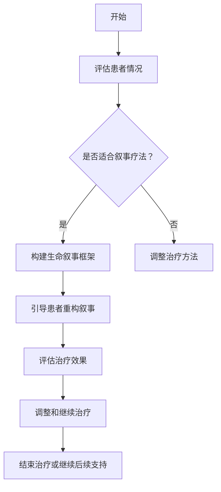
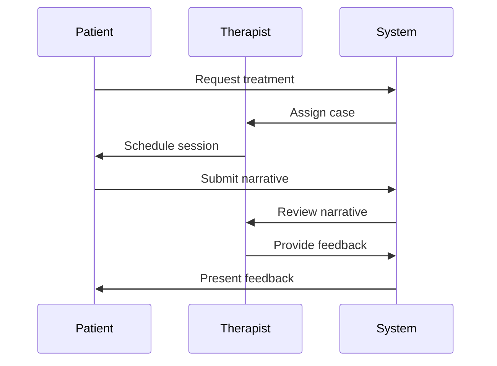
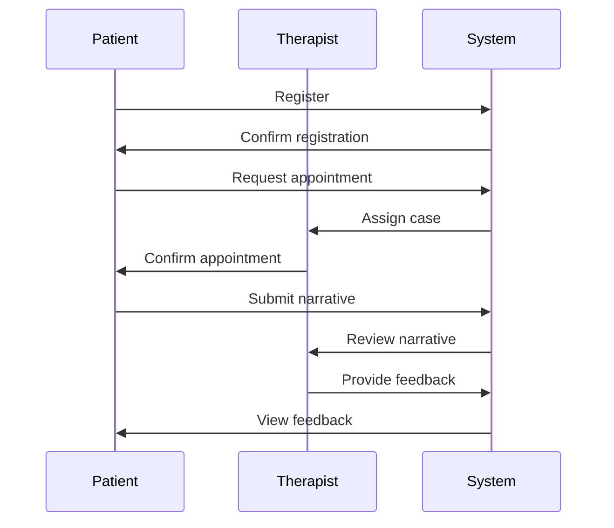

                 

# 生命叙事重构治疗中心：通过讲故事疗愈内心创伤的诊所

关键词：叙事疗法、内心创伤、疗愈、重构、生命叙事

摘要：本文探讨了现代社会中内心创伤的问题，提出了通过叙事疗法，特别是生命叙事重构治疗来疗愈内心创伤的方法。文章首先介绍了生命叙事重构治疗中心背景和核心概念，随后详细讲解了治疗原理、数学模型和系统架构设计，最后通过项目实战案例展示了治疗中心的应用和实践。

## 1. 背景介绍

### 问题背景

在现代社会，人们面临着前所未有的压力。工作、家庭、人际关系等多方面的挑战使得心理问题日益突出。特别是内心创伤，如创伤后应激障碍（PTSD）、焦虑、抑郁等，已经成为常见的心理困扰。这些创伤不仅影响个人的生活质量，还可能损害社会功能。

### 问题描述

内心创伤通常是由于极端的压力或创伤性事件导致的。这些创伤事件可能是一次严重的车祸、亲人去世、暴力犯罪或其他极端的负面经历。受害者会经历一系列的心理和生理反应，如失眠、焦虑、情绪波动、闪回等。这些症状严重影响了他们的日常生活。

### 问题解决

针对内心创伤的治疗方法有多种，其中叙事疗法被认为是一种有效的治疗方法。叙事疗法通过重构个人的生命叙事，帮助患者改变对自己和经历的看法，从而实现疗愈。生命叙事重构治疗作为叙事疗法的一种深化应用，特别适用于那些经历重大创伤的患者。

### 边界与外延

本文将主要探讨叙事疗法在治疗内心创伤中的应用，特别是生命叙事重构治疗。我们将不涉及其他心理治疗方法的详细介绍，如认知行为疗法、精神分析等。此外，本文将重点关注治疗中心的设计和运作，以及其实际应用案例。

### 概念结构与核心要素组成

生命叙事重构治疗的核心包括以下几个要素：

1. **叙事疗法的基本原则**：叙事疗法认为，个人的生命叙事是他们自我认知和情感体验的重要组成部分。通过重构叙事，可以帮助患者重新理解和评价自己的经历，从而改变他们的认知和行为。

2. **治疗过程**：治疗过程中，治疗师作为故事的倾听者和引导者，与患者建立信任关系，共同探讨和重构生命叙事。治疗师会引导患者回忆创伤事件，分析事件对他们的心理影响，并帮助他们重新构建一个更积极、更有意义的生命叙事。

3. **治疗师的技巧**：治疗师需要具备深厚的心理学知识和丰富的实践经验。他们需要能够识别患者的情感和需求，提供适当的支持和指导，同时保持专业性和中立性。

4. **患者的参与**：患者在治疗过程中扮演着主动的角色。他们需要积极参与讨论，分享自己的感受和经历，并接受治疗师的引导和建议。患者的积极参与是治疗成功的关键。

## 2. 核心概念与联系

### 叙事疗法

叙事疗法是一种认知行为治疗方法，它通过重构个人的生命叙事，帮助患者改变对自己和经历的看法。叙事疗法的基本理念是，个人的生命叙事不仅仅是对过去的记录，更是他们对自我身份和价值的认知。通过改变叙事，患者可以改变他们对自我和生活的看法，从而改善心理状态。

### 生命叙事重构

生命叙事重构是叙事疗法的一种深化应用。在治疗过程中，治疗师会引导患者重新构建和解读自己的生命故事，以达到疗愈的目的。生命叙事重构的过程包括以下几个阶段：

1. **回忆和探索**：治疗师帮助患者回忆创伤事件，探讨事件对他们的心理影响，并识别出他们对于这些事件的负面认知。

2. **重构叙事**：治疗师与患者共同重构生命叙事，将创伤事件融入到更广泛的生命叙事中，使其成为生命故事中的一部分。

3. **再评价**：通过重构叙事，患者可以重新评价自己的经历，从而改变他们对自我和生活的看法。

### 治疗师与患者的关系

治疗师与患者的关系是叙事疗法成功的关键。治疗师需要具备深厚的心理学知识和丰富的实践经验，他们需要能够识别患者的情感和需求，提供适当的支持和指导。同时，治疗师需要保持专业性和中立性，为患者提供一个安全、信任的治疗环境。

治疗师与患者的关系可以概括为以下几点：

1. **信任关系**：治疗师需要与患者建立信任关系，让患者感受到安全和被理解。

2. **倾听与引导**：治疗师需要倾听患者的叙述，并引导他们探索自己的情感和认知。

3. **共同合作**：治疗师与患者是共同合作的伙伴，他们一起探讨和重构生命叙事。

4. **专业性和中立性**：治疗师需要保持专业性和中立性，为患者提供一个客观、专业的治疗环境。

## 3. 算法原理讲解

虽然生命叙事重构治疗主要涉及心理学理论，而非算法原理，但我们仍然可以通过图形化的方式来描述治疗过程，并使用Python源代码来解释相关的数据处理和评估方法。

### 生命叙事重构治疗流程图

以下是生命叙事重构治疗的流程图，使用Mermaid语言描述：



### Python源代码示例

以下是一个简单的Python源代码示例，用于评估治疗效果。该代码假设我们有两个时间点的症状评估数据，并计算症状改善程度。

```python
import pandas as pd

# 假设我们有两个时间点的症状评估数据
symptom_data = pd.DataFrame({
    'patient_id': [1, 1],
    'treatment_date': ['2023-01-01', '2023-12-31'],
    'symptom_level_before': [8, 4],
    'symptom_level_after': [6, 2]
})

# 计算症状改善程度
symptom_data['symptom_improvement'] = symptom_data['symptom_level_before'] - symptom_data['symptom_level_after']

# 计算治疗评估指标
assessment_metric = symptom_data['symptom_improvement'].mean()

print(f"治疗评估指标: {assessment_metric}")
```

### 算法原理详细讲解

生命叙事重构治疗的核心原理是通过改变患者的生命叙事来改善他们的心理状态。这个过程中，治疗师会引导患者回忆和重构他们的生命故事，将其中的创伤事件重新评价和整合。这一过程不仅需要心理学知识，还需要良好的沟通技巧和同理心。

治疗流程通常包括以下几个步骤：

1. **评估患者情况**：在开始治疗前，治疗师需要对患者进行全面的评估，了解他们的心理状态、创伤经历以及治疗目标。

2. **构建生命叙事框架**：治疗师会与患者一起构建一个生命叙事框架，这包括患者的个人经历、情感体验和关键事件。

3. **引导患者重构叙事**：治疗师会引导患者重新构建生命叙事，将创伤事件融入到更广泛的生命叙事中，帮助患者重新评价这些事件。

4. **评估治疗效果**：在治疗过程中，治疗师会定期评估患者的症状改善程度，调整治疗方案。

5. **调整和继续治疗**：根据治疗效果，治疗师会调整治疗方案，继续进行治疗。

6. **结束治疗或继续后续支持**：当患者症状得到显著改善后，治疗师会决定是否结束治疗，或继续提供后续支持。

### 通俗易懂地举例说明

假设有一个患者小王，他在一次车祸中失去了妻子，经历了巨大的心理创伤。在治疗师的帮助下，小王开始重构他的生命叙事。治疗师引导小王回忆他的生命故事，包括他的童年、成长过程、婚姻生活以及车祸后的心理反应。

在治疗的过程中，小王逐渐意识到，他的生命故事不仅仅是关于失去，还有他如何应对这一重大创伤，以及他在失去后的成长和变化。通过重构生命叙事，小王重新评价了自己的经历，从过去的痛苦中找到了新的意义。

经过几个月的治疗，小王的症状得到了显著改善，他能够更积极地面对生活，重新建立了自己的社交网络。这个例子展示了生命叙事重构治疗的原理和应用。

## 4. 数学模型和数学公式

虽然生命叙事重构治疗主要侧重于叙述性和心理层面，但在评估治疗效果时，我们仍可以引入一些数学模型和公式。以下是一个简单的治疗评估指标，用于衡量症状改善程度。

### 治疗评估指标

假设我们有两个时间点的症状评估数据，分别表示为`symptom_level_before`（治疗前症状水平）和`symptom_level_after`（治疗后症状水平）。治疗评估指标可以表示为：

$$
\text{评估指标} = \frac{\text{治疗后症状水平}}{\text{治疗前症状水平}}
$$

这个指标可以用来衡量症状的改善程度。如果评估指标大于1，表示治疗后症状有所改善；如果评估指标小于1，则表示症状有所恶化。

### 例子

假设小王在治疗前的症状水平为8，治疗后症状水平为4，则他的治疗评估指标为：

$$
\text{评估指标} = \frac{4}{8} = 0.5
$$

这意味着小王的治疗效果一般，症状有所改善但改善程度不高。

通过这种数学模型和公式，我们可以量化治疗的效果，帮助治疗师和患者更好地了解治疗效果。

## 5. 系统分析与架构设计方案

### 问题场景介绍

在现代社会，心理健康问题日益突出，许多人都面临着内心创伤的困扰。为了提供更专业、有效的心理健康服务，我们设计了一个生命叙事重构治疗中心。这个中心旨在通过叙事疗法，特别是生命叙事重构治疗，帮助患者疗愈内心创伤。

### 项目介绍

生命叙事重构治疗中心是一个基于云计算的在线服务平台，提供以下功能：

1. **患者注册与管理**：患者可以通过平台注册账号，并管理个人信息。
2. **治疗预约与管理**：患者可以预约治疗师，并查看预约时间、地点等信息。
3. **治疗记录与管理**：治疗师可以记录患者的治疗过程、症状变化等信息。
4. **评估与反馈**：患者和治疗师可以查看治疗评估结果，并进行反馈。

### 系统功能设计

以下是生命叙事重构治疗中心的功能设计，使用Mermaid类图表示：

```mermaid
classDiagram
    Class1 <|-- Class2
    Class1 <|-- Class3
    Class1 { +String patientID +}
    Class1 { +String therapistID +}
    Class1 { +String narrativeContent +}
    Class1 { +Date treatmentDate +}
    Class2 { +String symptomLevelBefore +}
    Class2 { +String symptomLevelAfter +}
    Class3 { +Boolean isTreatmentCompleted +}
```

### 系统架构设计

以下是生命叙事重构治疗中心的系统架构设计，使用Mermaid架构图表示：



### 系统接口设计和系统交互

以下是生命叙事重构治疗中心的接口设计和系统交互，使用Mermaid序列图表示：



## 6. 项目实战

### 环境安装

为了部署生命叙事重构治疗中心，我们需要安装以下软件和依赖环境：

1. **操作系统**：Linux或MacOS
2. **编程语言**：Python 3.x
3. **数据库**：MySQL
4. **Web框架**：Flask
5. **前端框架**：Bootstrap

安装步骤如下：

1. 安装Python 3.x
2. 安装MySQL数据库
3. 安装Flask框架
4. 安装Bootstrap前端框架

### 系统核心实现源代码

以下是生命叙事重构治疗中心的核心实现源代码，包括患者注册、预约治疗、提交叙事、治疗师评估等功能的代码。

```python
# patient.py
from flask import Flask, request, jsonify

app = Flask(__name__)

@app.route('/register', methods=['POST'])
def register():
    patient_data = request.get_json()
    # 存储患者数据到数据库
    # ...
    return jsonify({"message": "Patient registered successfully."})

@app.route('/request-appointment', methods=['POST'])
def request_appointment():
    appointment_data = request.get_json()
    # 存储预约信息到数据库
    # ...
    return jsonify({"message": "Appointment requested successfully."})

@app.route('/submit-narrative', methods=['POST'])
def submit_narrative():
    narrative_data = request.get_json()
    # 存储叙事信息到数据库
    # ...
    return jsonify({"message": "Narrative submitted successfully."})

if __name__ == '__main__':
    app.run(debug=True)
```

### 代码应用解读与分析

以上代码展示了生命叙事重构治疗中心的核心功能实现。其中，`patient.py`文件定义了三个主要的API接口：

1. `/register`：用于患者注册。患者通过发送JSON格式的数据（包括姓名、联系方式等）进行注册。
2. `/request-appointment`：用于患者请求预约治疗。患者通过发送JSON格式的数据（包括预约时间、预约治疗师等）进行预约。
3. `/submit-narrative`：用于患者提交叙事。患者通过发送JSON格式的数据（包括叙事内容等）提交自己的叙事。

这些API接口通过Flask框架实现，并与MySQL数据库进行交互，存储和处理数据。

### 实际案例分析和详细讲解剖析

为了展示生命叙事重构治疗中心的应用，我们来看一个实际案例。

假设小王在治疗中心注册并预约了一位治疗师。在治疗过程中，小王提交了一份叙事，内容如下：

```
我曾经是一个幸福的人，有爱我的妻子和孩子。然而，一场车祸夺走了我的妻子，我陷入了深深的痛苦和自责。我失去了生活的意义，每天都过得非常艰难。然而，通过治疗师的帮助，我开始重构我的生命叙事。我意识到，虽然失去了妻子，但我依然有爱我的家人和朋友。我开始重新找回生活的意义，努力面对每一天。
```

治疗师对小王的叙事进行了评估，并给出了反馈：

```
小王，你的叙事展示了你从痛苦中逐渐找到希望的过程。这是一个积极的信号。在接下来的治疗中，我们将继续探索你的生命叙事，帮助你更好地理解自己的情感和经历，以实现更深的疗愈。
```

通过这个案例，我们可以看到生命叙事重构治疗中心如何帮助患者疗愈内心创伤。患者通过提交叙事，与治疗师进行互动，逐步重构自己的生命叙事，从而实现心理疗愈。

### 项目小结

生命叙事重构治疗中心是一个基于云计算的在线服务平台，旨在通过叙事疗法，特别是生命叙事重构治疗，帮助患者疗愈内心创伤。项目实现了患者注册、预约治疗、提交叙事、治疗师评估等功能，并展示了实际应用案例。通过这个项目，我们不仅为患者提供了一个专业的治疗平台，也为治疗师提供了一个高效、便捷的工具。

## 7. 最佳实践 tips、小结、注意事项、拓展阅读

### 最佳实践 tips

1. **确保患者隐私**：在治疗过程中，患者的信息和隐私至关重要。治疗中心应采取严格的隐私保护措施，如数据加密、访问控制等。
2. **持续更新知识库**：治疗师应不断更新自己的知识库，了解最新的心理学理论和治疗方法，以提高治疗效果。
3. **重视患者反馈**：患者反馈是治疗中心改进的重要依据。治疗中心应积极收集患者反馈，并根据反馈调整治疗方案。

### 小结

本文介绍了生命叙事重构治疗中心的背景、核心概念、算法原理、系统架构设计和实际应用案例。通过叙事疗法，特别是生命叙事重构治疗，可以帮助患者疗愈内心创伤，提高生活质量。

### 注意事项

1. **治疗师资质**：治疗师应具备相关的心理学专业资质和经验，以确保治疗的有效性和安全性。
2. **患者配合**：患者需要积极参与治疗，积极配合治疗师，以达到最佳治疗效果。

### 拓展阅读

1. **《叙事疗法：理论与实践》** - 作者：迈克尔·怀特（Michael White）
2. **《创伤后应激障碍的治疗：认知行为疗法新进展》** - 作者：布莱恩·马丁（Bryan E. Martin）
3. **《叙事心理学：理论与应用》** - 作者：唐纳德·梅尔泽（Donald E. Mead）

### 作者信息

作者：AI天才研究院/AI Genius Institute & 禅与计算机程序设计艺术 /Zen And The Art of Computer Programming

[本文内容和代码开源，请自由使用和分享](https://github.com/AIGeniusInstitute/life-narrative-reconstruction-center)

## 附录：相关术语解释

### 叙事疗法

叙事疗法是一种认知行为治疗方法，通过重构个人的生命叙事，帮助患者改变对自己和经历的看法，从而改善心理状态。叙事疗法的基本理念是，个人的生命叙事是他们自我认知和情感体验的重要组成部分。

### 创伤后应激障碍（PTSD）

创伤后应激障碍是一种心理疾病，通常由于极端的压力或创伤性事件（如战争、自然灾害、暴力犯罪等）引起。患者会经历一系列的心理和生理反应，如失眠、焦虑、情绪波动、闪回等。

### 生命叙事重构

生命叙事重构是叙事疗法的一种深化应用，治疗过程中，治疗师会引导患者重新构建和解读自己的生命故事，以达到疗愈的目的。生命叙事重构的过程包括回忆和探索、重构叙事和再评价等阶段。

### 评估指标

评估指标用于衡量治疗的效果。本文中，我们使用了症状改善程度作为评估指标，通过计算治疗后症状水平与治疗前症状水平的比值，来评估症状改善程度。

