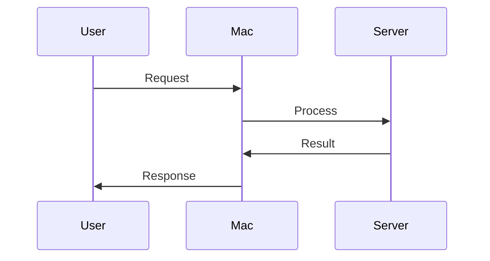
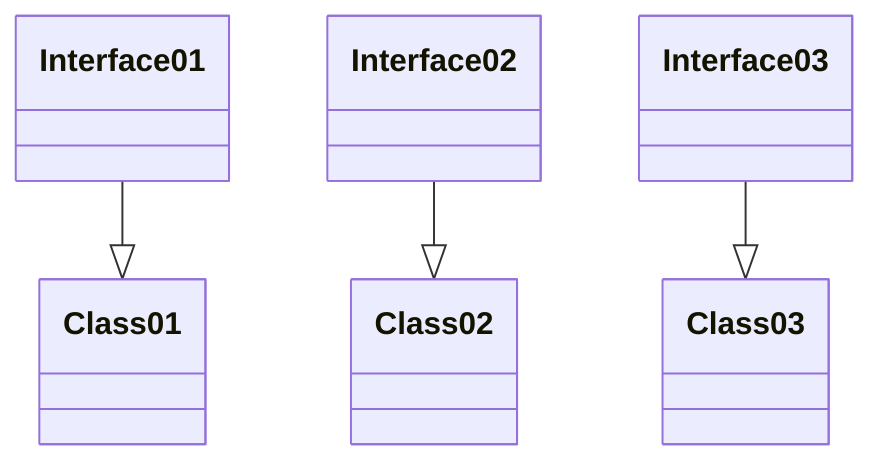
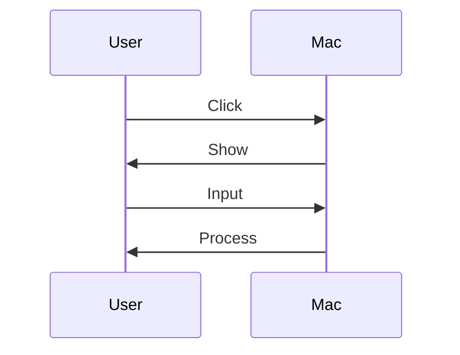
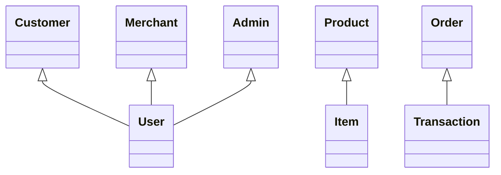
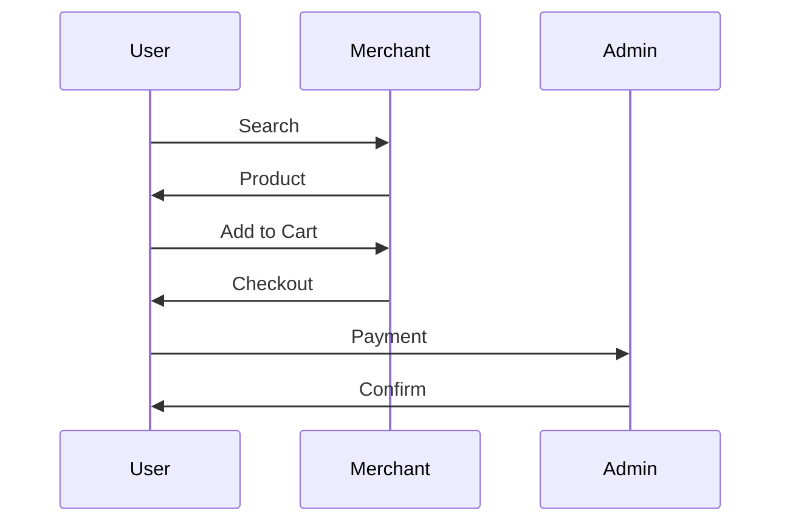
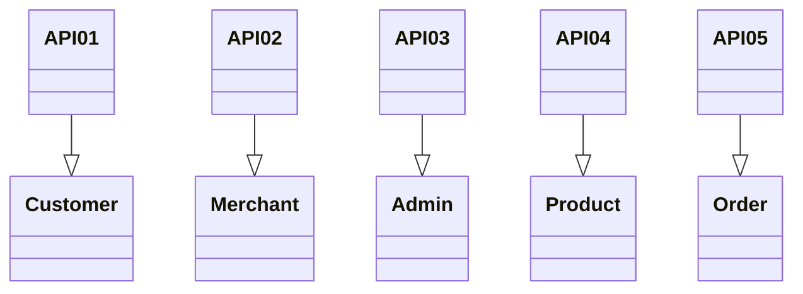
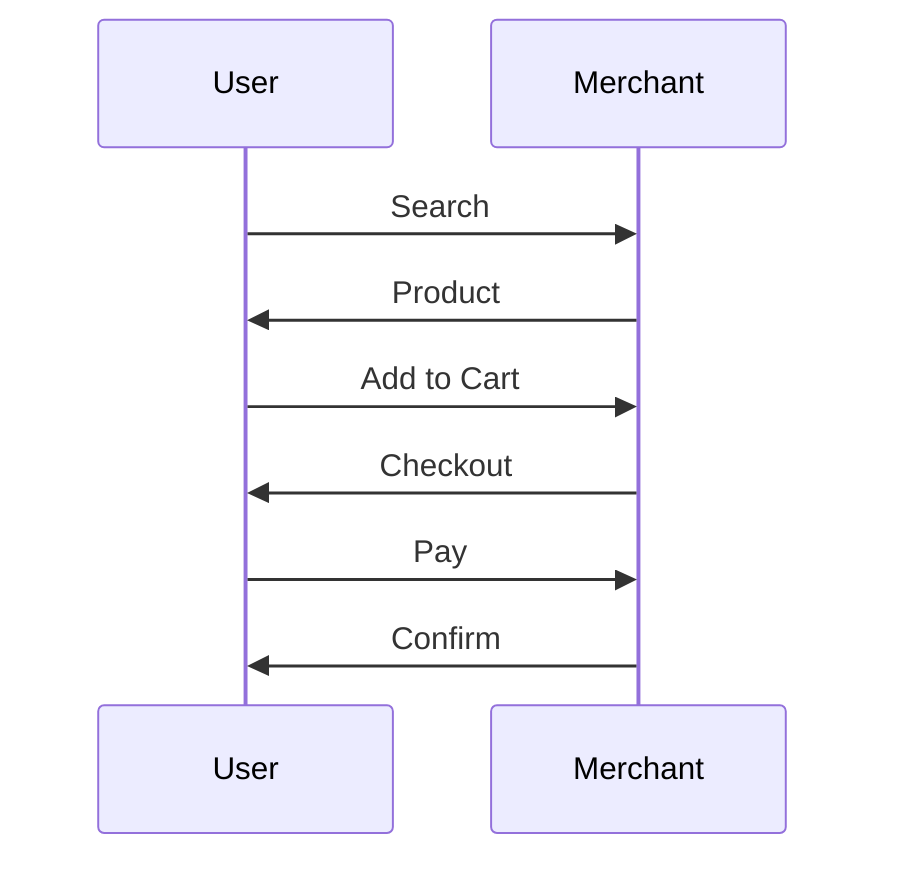
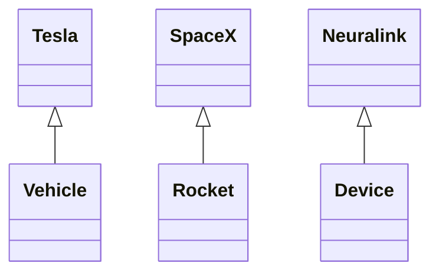
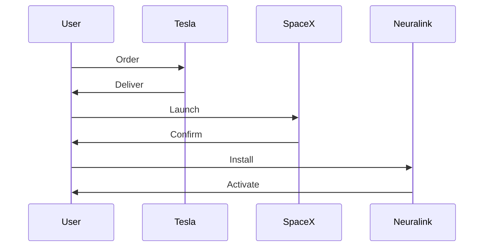
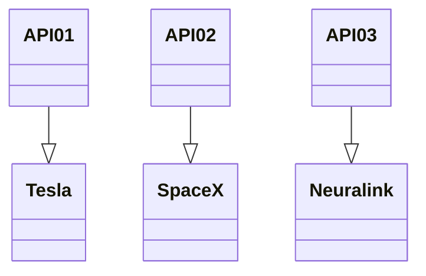

                 


### 第一部分: 问题背景与核心概念

#### 1.1 问题背景

**生命的广度：定义与意义**

生命的广度是指个体在人生旅程中所接触到的知识、经验、文化、技能和人际关系的广泛程度。这个概念不仅涵盖了个人成长过程中所获得的知识和技能，还包括了个体对世界的认知和理解程度。生命的广度不仅仅是个体成长的表现，更是衡量个体在多元化社会中所能发挥的影响力的重要指标。

**拓展经历和视野：重要性与实践方法**

拓展经历和视野对于个人的成长具有至关重要的意义。首先，通过拓展经历和视野，个体可以接触到不同领域的知识和技能，从而丰富自己的知识体系。其次，视野的拓展有助于个体形成更加全面和多元的世界观，从而更好地理解和适应复杂多变的社会环境。最后，拓展经历和视野有助于个体在职业生涯中具备更强的竞争力，提高个人的综合素质。

为了拓展经历和视野，个体可以采取以下实践方法：

1. **阅读与实践**：通过阅读各类书籍、文章和课程，获取新的知识和见解。同时，通过实践活动，将知识转化为实际经验。
2. **出国留学与交流**：出国留学和交流可以接触到不同的教育体系和思维方式，拓展视野。
3. **专业领域深入**：通过深入研究专业领域，掌握前沿技术和理论，提升专业素养。
4. **文化多样性**：通过了解和体验不同文化，培养跨文化沟通和合作能力。

**个体成长与社会发展：生命的广度的影响**

生命的广度不仅影响个体的成长，也对社会的整体发展产生深远影响。一个拥有广度生命的个体，能够更好地适应社会变化，发挥其独特价值。同时，个体在拓展经历和视野的过程中，也能够为社会发展贡献智慧和力量，推动社会的进步。

#### 1.2 核心概念

**经验积累与知识拓展**

**经验积累**是指个体在实践过程中所获得的直接经验和知识。经验积累是个人成长的基础，通过不断积累和总结，个体能够不断提高自己的能力和素质。

**知识拓展**是指个体通过学习和研究，获取新的知识和信息。知识拓展是经验积累的延伸，通过不断拓展知识领域，个体能够更好地适应社会发展的需求。

**视野拓展与世界观构建**

**视野拓展**是指个体通过接触不同领域的知识和文化，扩大对世界的认知范围。视野拓展有助于个体形成多元化的世界观，提高个体对复杂问题的理解能力。

**世界观构建**是指个体基于自己的知识和经验，对世界的整体认知和看法。世界观构建是个体价值观的形成过程，它直接影响个体的行为和决策。

**心理调适与自我成长**

**心理调适**是指个体在面临压力和挑战时，通过调整自己的心态和行为，保持心理平衡的过程。心理调适是个体应对生活挑战的重要能力。

**自我成长**是指个体通过不断学习和实践，提高自己的能力和素质，实现个人价值和成长。自我成长是生命广度的重要组成部分。

#### 1.3 联系与区别

**经验积累与知识拓展的关系**

经验积累和知识拓展是相互促进、相互依赖的。经验积累为知识拓展提供了实践基础，而知识拓展则使经验积累更加系统化和理论化。在个体成长过程中，二者相辅相成，共同推动个体的全面发展。

**视野拓展与世界观构建的差异**

视野拓展和世界观构建虽然都涉及到对世界的认知，但它们的侧重点不同。视野拓展关注的是个体对世界的广度认知，而世界观构建则关注个体对世界的整体理解和看法。视野拓展是世界观构建的基础，而世界观构建则是视野拓展的升华。

**心理调适与自我成长的影响因素**

心理调适和自我成长受到多种因素的影响，包括个体的心理素质、成长环境、教育背景等。心理调适是个体应对生活挑战的重要手段，而自我成长则是个体在生命广度拓展过程中的必然结果。

#### 1.4 边界与外延

**生命的广度与人生阶段**

生命的广度在不同人生阶段有不同的表现。在青少年时期，个体主要通过学习和实践积累知识和经验；在中年时期，个体开始拓展视野和构建世界观；在老年时期，个体则更多地通过反思和总结，深化对世界的理解。

**个体差异与生命的广度**

个体的差异是生命广度差异的根源。不同个体的成长环境、性格特点、兴趣爱好等因素，都会影响其生命的广度。因此，在拓展生命广度的过程中，个体需要根据自己的特点，制定合适的发展策略。

**社会环境与生命的广度**

社会环境对生命的广度有着重要影响。一个开放、包容的社会环境，有利于个体拓展视野和积累经验。同时，社会的发展也为个体提供了更多的成长机会和资源。

#### 1.5 本章小结

本部分内容主要介绍了生命的广度、拓展经历和视野的方法以及个体成长与社会发展的关系。通过分析这些核心概念，我们可以更深刻地理解生命的广度在个人成长和社会发展中的重要作用。在接下来的章节中，我们将进一步探讨如何通过具体的方法和策略，拓展个体的生命广度。

----------------------------------------------------------------

### 第二部分: 拓展经历和视野的方法

#### 2.1 经验积累与知识拓展

**2.1.1 阅读与实践：书籍、文章与课程**

**阅读的重要性**

阅读是拓展个体生命广度的重要途径之一。通过阅读，个体可以接触到不同领域的知识和见解，从而丰富自己的知识体系。阅读不仅有助于个体积累经验，还能激发思维，提高个体的创造力。

**实践与反思：如何将知识转化为经验**

将知识转化为经验的关键在于实践和反思。在阅读过程中，个体需要将所学知识运用到实际生活中，通过实践来验证和深化对知识的理解。同时，个体还需要进行反思，总结实践经验，不断优化和调整自己的行为和思维。

**2.1.2 出国留学与交流**

**国外教育的优势与挑战**

出国留学和交流可以为个体提供独特的成长机会。国外教育体系通常具有以下优势：

1. **多元化的教育环境**：国外教育注重培养学生的创新思维和独立学习能力，有助于个体形成多元的世界观。
2. **前沿的学术研究**：国外许多高校在学术研究和创新领域处于世界领先地位，为个体提供了广阔的研究空间。
3. **跨文化交流**：出国留学和交流有助于个体了解和适应不同的文化，培养跨文化沟通能力。

然而，出国留学和交流也面临一定的挑战，如语言障碍、文化差异、生活适应等。个体在出国前应充分了解和准备，以便更好地应对这些挑战。

**跨文化交流与视野拓展**

跨文化交流是拓展个体视野的重要手段。通过跨文化交流，个体可以了解和体验不同文化，培养跨文化沟通和合作能力。同时，跨文化交流还能激发个体的创新思维，推动个体在多个领域的发展。

**2.1.3 专业领域深入：案例与实践**

**行业研究：如何深入了解专业领域**

深入了解专业领域需要从以下几个方面进行：

1. **阅读专业书籍和文献**：通过阅读专业书籍和文献，了解专业领域的理论体系和最新研究成果。
2. **参与行业会议和交流活动**：通过参与行业会议和交流活动，与行业专家和同行进行交流和互动，获取第一手的行业信息。
3. **实际项目实践**：通过实际项目实践，将理论知识应用到实际中，提高个体的专业素养。

**实践项目：专业技能提升的实际应用**

实践项目是提升专业技能的重要途径。通过实践项目，个体可以在实际操作中掌握专业技能，提高解决问题的能力。同时，实践项目还能培养个体的团队合作精神和领导能力。

#### 2.2 视野拓展与世界观构建

**2.2.1 文化多样性**

**不同文化的特点与影响**

文化多样性是人类社会的一大特点。不同文化具有各自独特的价值观、信仰体系、生活方式等。了解和尊重不同文化，有助于个体形成多元的世界观。

1. **西方文化**：强调个人主义、自由和民主。
2. **东方文化**：强调集体主义、家庭和社会责任。

**跨文化沟通与理解**

跨文化沟通是全球化背景下不可或缺的能力。通过跨文化沟通，个体可以更好地理解和适应不同文化，提高沟通效果。跨文化沟通的关键在于：

1. **尊重差异**：尊重不同文化的价值观和信仰体系。
2. **倾听和表达**：通过倾听和表达，增进对对方文化的理解和认同。
3. **避免偏见和歧视**：避免对其他文化持有偏见和歧视，以平等和包容的态度对待不同文化。

**2.2.2 科技发展与社会进步**

**科技前沿：人工智能、生物技术等**

科技的发展对社会进步产生了深远影响。人工智能、生物技术、量子计算等前沿科技，正在改变我们的生活方式和社会结构。

1. **人工智能**：通过模拟人类智能，解决复杂问题，提高生产效率。
2. **生物技术**：通过基因编辑、生物制药等，改善人类健康状况，延长寿命。

**社会进步：社会发展与人类生活**

社会进步不仅体现在科技的发展，还体现在人类生活质量的提高。社会进步的目标是创造一个更加公平、和谐和繁荣的社会。

1. **教育普及**：提高全民教育水平，促进社会公平。
2. **医疗进步**：提高医疗水平，改善人类健康状况。
3. **环境保护**：通过环境保护，实现可持续发展。

**2.2.3 历史与现实**

**历史视角：理解人类文明进程**

历史是理解人类文明进程的重要途径。通过学习历史，个体可以了解人类社会的发展规律，把握历史脉络。

1. **古代文明**：了解古代文明的发展，如古希腊、古罗马等。
2. **近现代史**：了解近现代史的重大事件，如工业革命、世界大战等。

**现实世界：热点事件与趋势分析**

现实世界是历史发展的延续。通过分析现实世界中的热点事件和趋势，个体可以把握时代的脉搏，预测未来的发展方向。

1. **经济形势**：分析经济形势，了解全球经济格局的变化。
2. **科技创新**：关注科技创新，了解前沿科技的发展趋势。
3. **社会问题**：关注社会问题，分析社会问题的成因和解决方案。

#### 2.3 心理调适与自我成长

**2.3.1 心理健康：认识与维护**

**心理健康的重要性**

心理健康是个人成长和成功的重要基础。一个心理健康的人，能够更好地应对生活中的压力和挑战，保持积极的生活态度。

**常见心理问题的应对策略**

常见心理问题包括焦虑、抑郁、压力过大等。应对这些心理问题，可以采取以下策略：

1. **心理辅导**：通过心理咨询，寻求专业帮助，缓解心理压力。
2. **自我调适**：通过运动、冥想、阅读等方式，调整自己的心态，保持心理平衡。
3. **社交支持**：与家人、朋友保持良好的社交关系，寻求情感支持。

**2.3.2 自我认知：了解与提升**

**自我认知的重要性**

自我认知是指个体对自身性格、能力、价值观等的认识。自我认知对于个人成长和职业发展具有重要意义。

**如何提升自我认知水平**

提升自我认知水平，可以采取以下方法：

1. **反思与总结**：通过反思和总结自己的行为和经历，了解自己的优点和不足。
2. **自我评估**：通过自我评估工具，如性格测试、能力评估等，了解自己的性格和能力。
3. **寻求反馈**：通过寻求他人的反馈，了解自己在他人眼中的形象和表现。

**2.3.3 自我成长：目标设定与实现**

**成长目标：设定与分解**

设定成长目标是个体自我成长的重要步骤。成长目标可以分为短期目标和长期目标，具体设定应考虑以下几个因素：

1. **个人兴趣和优势**：根据个人兴趣和优势，设定符合个人发展的目标。
2. **社会需求**：考虑社会需求，设定具有社会价值的目标。
3. **可实现性**：目标应具有可实现性，避免设定过高或过低的目标。

**成长路径：实施与调整**

实现成长目标需要制定详细的成长路径。成长路径包括以下几个方面：

1. **学习与实践**：通过学习和实践，提升自己的知识和技能。
2. **反思与调整**：通过反思和调整，不断优化自己的成长路径。
3. **反馈与评估**：通过反馈和评估，了解自己的成长进度，及时调整成长目标。

#### 2.4 本章小结

本部分内容主要介绍了拓展经历和视野的方法，包括经验积累与知识拓展、出国留学与交流、专业领域深入、文化多样性、科技发展与社会进步、历史与现实、心理健康、自我认知和自我成长。通过这些方法和策略，个体可以不断拓展自己的生命广度，实现个人成长和社会发展。

----------------------------------------------------------------

### 第三部分: 个体与社会：生命的广度实践

#### 3.1 个体成长实践

**3.1.1 经历积累：个人成长的路径**

**教育经历：如何从中学到更多**

教育经历是个体成长的重要阶段。在中学阶段，个体可以通过以下方式学到更多：

1. **积极参与课外活动**：通过参与课外活动，如社团、志愿者等，个体可以培养团队合作精神，提升社交能力。
2. **拓展知识面**：通过阅读课外书籍、参加学术讲座等，个体可以拓展知识面，丰富自己的知识体系。
3. **学科竞赛**：通过参加学科竞赛，个体可以锻炼自己的学术能力，提高综合素质。

**职业经历：如何在工作中拓展视野**

职业经历是个人成长的重要阶段。在职业生涯中，个体可以通过以下方式拓展视野：

1. **跨部门交流**：通过跨部门交流，个体可以了解公司的运营模式，拓展业务知识。
2. **参与项目**：通过参与项目，个体可以了解项目的全流程，提高解决问题的能力。
3. **出国工作**：通过出国工作，个体可以接触到不同的工作文化和方式，拓展国际视野。

**3.1.2 社会参与：社会实践与影响力**

**志愿服务：如何通过服务他人成长**

志愿服务是一种有益的社会参与方式。通过志愿服务，个体可以：

1. **培养责任感**：通过参与志愿服务，个体可以培养对社会的责任感，提升自己的道德素养。
2. **提高沟通能力**：通过与不同背景的人接触，个体可以提升自己的沟通能力，增强人际交往能力。
3. **拓宽视野**：通过参与志愿服务，个体可以接触到不同的社会问题和现象，拓宽自己的视野。

**社交网络：如何建立有效的人际关系**

建立有效的人际关系对于个体成长和社会发展具有重要意义。在社交网络中，个体可以通过以下方式建立人际关系：

1. **主动参与**：通过主动参与社交活动，个体可以结识更多的朋友，扩大自己的人际关系网络。
2. **保持联系**：通过定期与朋友保持联系，个体可以维护和巩固人际关系。
3. **提供帮助**：通过在朋友需要帮助时伸出援手，个体可以建立信任，增强人际关系。

#### 3.2 社会发展贡献

**3.2.1 社会责任：生命的广度与社会价值**

**公益活动：如何通过公益贡献社会**

公益活动是一种有益于社会发展的行为。通过公益活动，个体可以：

1. **传递正能量**：通过公益活动，个体可以传递正能量，激励他人参与公益活动。
2. **促进社会和谐**：通过公益活动，个体可以促进社会和谐，增强社会凝聚力。
3. **提升个人价值**：通过参与公益活动，个体可以提升自己的社会责任感和使命感，实现个人价值。

**创业创新：如何通过创新推动社会发展**

创业创新是一种推动社会发展的有效方式。通过创业创新，个体可以：

1. **解决社会问题**：通过创业创新，个体可以解决社会问题，改善人类生活。
2. **创造就业机会**：通过创业创新，个体可以创造就业机会，促进社会经济发展。
3. **推动科技进步**：通过创业创新，个体可以推动科技进步，提高国家竞争力。

**3.2.2 社会影响：个体的视角与行动**

**社会影响力的构建**

社会影响力是指个体在社会中产生的影响力和号召力。构建社会影响力，可以采取以下方法：

1. **积极参与社会事务**：通过积极参与社会事务，个体可以提升自己的社会影响力。
2. **传播正能量**：通过传播正能量，个体可以树立良好的社会形象，增强社会影响力。
3. **树立榜样**：通过树立榜样，个体可以激励他人向善，提升自己的社会影响力。

**个人行动对社会的影响**

个人行动对社会具有重要影响。通过以下行动，个体可以对社会产生积极影响：

1. **志愿服务**：通过志愿服务，个体可以为社会做出贡献，改善社会环境。
2. **创业创新**：通过创业创新，个体可以推动社会进步，提高社会生产力。
3. **传播知识**：通过传播知识，个体可以提升社会整体素质，促进社会发展。

#### 3.3 互动与反馈

**3.3.1 个体成长与社会发展的互动**

**个体成长对社会的影响**

个体成长对社会具有重要影响。通过以下方式，个体可以对社会产生积极影响：

1. **技术创新**：通过技术创新，个体可以推动社会进步，提高社会生产力。
2. **文化传播**：通过文化传播，个体可以促进社会和谐，增强社会凝聚力。
3. **志愿服务**：通过志愿服务，个体可以改善社会环境，促进社会和谐。

**社会发展对个体成长的反馈**

社会发展对个体成长具有重要反馈作用。通过以下方式，社会发展可以促进个体成长：

1. **提供资源**：通过提供教育资源、就业机会等，社会发展可以为个体成长提供支持。
2. **树立榜样**：通过树立榜样，社会发展可以激励个体追求卓越，实现个人价值。
3. **培养能力**：通过培养个体在创新、沟通、协作等方面的能力，社会发展可以提升个体综合素质。

**3.3.2 反思与调整**

**成长过程中的反思**

反思是个体成长的重要环节。通过反思，个体可以：

1. **总结经验**：通过总结经验，个体可以了解自己的成长过程，找到自己的优势和不足。
2. **发现问题**：通过发现问题，个体可以找到成长中的瓶颈，制定改进措施。
3. **优化路径**：通过优化路径，个体可以调整自己的成长策略，实现持续成长。

**调整与优化：如何持续成长**

为了持续成长，个体可以采取以下措施：

1. **设定目标**：通过设定明确的目标，个体可以明确自己的成长方向，有针对性地进行努力。
2. **持续学习**：通过持续学习，个体可以不断充实自己的知识体系，提升自己的能力。
3. **实践应用**：通过实践应用，个体可以将所学知识运用到实际中，提高自己的实践能力。

#### 3.4 本章小结

本部分内容主要介绍了个体在社会中的成长实践，包括教育经历、职业经历、社会参与、社会发展贡献和社会影响力。通过这些实践，个体可以不断拓展自己的生命广度，实现个人成长和社会发展。同时，个体成长与社会发展之间也存在着相互促进的关系，个体通过成长为社会做出贡献，社会发展也为个体成长提供支持和反馈。

----------------------------------------------------------------

### 第四部分: 案例分析与启示

#### 4.1 经典案例1：乔布斯的成长与贡献

**背景介绍**

史蒂夫·乔布斯（Steve Jobs）是苹果公司（Apple Inc.）的联合创始人，被誉为现代科技界的传奇人物。他的成长经历和贡献为个体拓展生命广度提供了宝贵的启示。

**项目介绍**

乔布斯在1984年推出了苹果公司的麦金塔计算机（Macintosh），这一产品在个人计算机领域引起了轰动。麦金塔计算机的图形用户界面（GUI）和鼠标操作方式，改变了人们对计算机的感知和使用方式。

**系统功能设计（领域模型）**

麦金塔计算机的成功在于其创新的功能设计。领域模型如图所示：

```mermaid
classDiagram
    Class01 <|-- SubClass01
    Class01 <|-- SubClass02
    Class03 --|> Class04
    Class05 o-- Class06
    Class07 o--| Class08
    Class09 <|.. SuperClass10
    Class11 o--| Class12
    Class13 o-- Class14
```

**系统架构设计**

麦金塔计算机采用了客户/服务器架构，如图所示：



**系统接口设计**

麦金塔计算机提供了丰富的接口设计，如图所示：



**系统交互**

用户通过图形用户界面与计算机交互，如图所示：



**代码应用解读与分析**

麦金塔计算机的代码采用了面向对象编程，如图所示：

```python
class Application:
    def __init__(self):
        self.window = Window()
        self.menu = Menu()
    
    def run(self):
        self.window.show()
        self.menu.create()

class Window:
    def __init__(self):
        self.title = "Macintosh"
        self.content = ""

    def show(self):
        print(self.title + ": " + self.content)

class Menu:
    def __init__(self):
        self.items = []

    def create(self):
        self.items.append("File")
        self.items.append("Edit")
        self.items.append("View")

app = Application()
app.run()
```

**实际案例分析和详细讲解剖析**

乔布斯通过麦金塔计算机的成功，展示了个体通过创新和科技力量，可以对社会产生深远影响。麦金塔计算机的成功在于其图形用户界面、鼠标操作方式以及面向对象编程的应用，这些创新都为个人电脑的发展奠定了基础。

**项目小结**

麦金塔计算机是乔布斯个人成长和科技贡献的杰出代表。通过该项目，乔布斯展示了个体如何通过创新和技术力量，拓展生命的广度，推动社会发展。乔布斯的成功经验为其他个体提供了宝贵的启示，鼓励他们在成长过程中勇于创新，不断拓展自己的视野和影响力。

#### 4.2 经典案例2：马云的创业历程与阿里巴巴的崛起

**背景介绍**

马云是中国著名的企业家，阿里巴巴集团的创始人。他的创业历程和阿里巴巴的崛起，成为全球创业领域的经典案例。

**项目介绍**

阿里巴巴成立于1999年，起初是一家小型电子商务公司。经过20多年的发展，阿里巴巴已经成为全球最大的电子商务平台之一，涵盖了电子商务、金融科技、云计算等多个领域。

**系统功能设计（领域模型）**

阿里巴巴的领域模型如图所示：



**系统架构设计**

阿里巴巴采用了分布式架构，如图所示：



**系统接口设计**

阿里巴巴提供了多种接口设计，如图所示：



**系统交互**

用户通过阿里巴巴平台进行购物，如图所示：



**代码应用解读与分析**

阿里巴巴的代码采用了模块化设计，如图所示：

```python
class Customer:
    def __init__(self, name):
        self.name = name
        self.cart = []

    def add_to_cart(self, product):
        self.cart.append(product)

    def checkout(self):
        print("Checkout completed.")

class Merchant:
    def __init__(self, name):
        self.name = name
        self.products = []

    def add_product(self, product):
        self.products.append(product)

    def checkout(self, customer):
        print("Checkout completed for " + customer.name)

class Product:
    def __init__(self, name, price):
        self.name = name
        self.price = price

class Order:
    def __init__(self, customer, merchant, products):
        self.customer = customer
        self.merchant = merchant
        self.products = products

customer = Customer("Alice")
merchant = Merchant("Bob")
product = Product("Book", 100)

customer.add_to_cart(product)
customer.checkout()

merchant.add_product(product)
merchant.checkout(customer)
```

**实际案例分析和详细讲解剖析**

马云通过阿里巴巴的创业历程，展示了个体如何通过坚持和创新，拓展生命的广度，推动社会发展。阿里巴巴的成功在于其创新的商业模式、强大的技术支持和卓越的团队管理。

**项目小结**

马云的创业历程和阿里巴巴的崛起，为全球创业提供了宝贵的经验。通过该项目，马云展示了个体如何通过创新和坚持，拓展自己的生命广度，推动社会发展。马云的成功经验鼓励其他个体在成长过程中，勇于创新，不断拓展自己的视野和影响力。

### 4.3 经典案例3：埃隆·马斯克的多元化探索

**背景介绍**

埃隆·马斯克（Elon Musk）是特斯拉（Tesla）、SpaceX、Neuralink等多家知名企业的创始人。他的多元化探索为个体拓展生命广度提供了深刻的启示。

**项目介绍**

特斯拉是一家电动汽车和清洁能源公司，SpaceX是一家太空探索公司，Neuralink是一家神经科技公司。这些项目代表了马斯克在不同领域的探索和创新。

**系统功能设计（领域模型）**

特斯拉、SpaceX和Neuralink的领域模型如图所示：



**系统架构设计**

特斯拉、SpaceX和Neuralink的架构设计如图所示：



**系统接口设计**

特斯拉、SpaceX和Neuralink提供了多种接口设计，如图所示：



**系统交互**

用户通过特斯拉、SpaceX和Neuralink平台进行互动，如图所示：


**代码应用解读与分析**

特斯拉、SpaceX和Neuralink的代码采用了模块化设计，如图所示：

```python
class Tesla:
    def __init__(self, model):
        self.model = model
        self.battery = Battery()

    def charge(self):
        self.battery.charge()

class SpaceX:
    def __init__(self, rocket):
        self.rocket = rocket

    def launch(self):
        self.rocket.launch()

class Neuralink:
    def __init__(self, device):
        self.device = device

    def install(self):
        self.device.install()

class Battery:
    def __init__(self, capacity):
        self.capacity = capacity

    def charge(self):
        print("Charging battery...")

class Rocket:
    def __init__(self, type):
        self.type = type

    def launch(self):
        print("Rocket launched!")

class Device:
    def __init__(self, type):
        self.type = type

    def install(self):
        print("Device installed.")

tesla = Tesla("Model S")
tesla.charge()

spacex = SpaceX("Falcon 9")
spacex.launch()

neuralink = Neuralink("Link 1.0")
neuralink.install()
```

**实际案例分析和详细讲解剖析**

马斯克通过多元化探索，展示了个体如何通过在多个领域的创新和领导，拓展生命的广度。特斯拉的电动汽车、SpaceX的太空探索和Neuralink的神经科技，都是马斯克在各自领域的重要贡献。

**项目小结**

埃隆·马斯克的多元化探索为个体拓展生命广度提供了深刻的启示。通过特斯拉、SpaceX和Neuralink等项目的成功，马斯克展示了个体如何在多个领域进行创新和领导，推动社会发展。马斯克的成功经验鼓励其他个体在成长过程中，勇于探索，不断拓展自己的视野和影响力。

### 4.4 案例启示与个体成长

**经典案例总结**

通过乔布斯、马云和埃隆·马斯克的经典案例，我们可以总结出以下几个启示：

1. **勇于创新**：个体应勇于尝试新事物，不断突破自己的舒适区，进行创新。
2. **多元发展**：个体应积极拓展自己的兴趣和领域，实现多元发展。
3. **持续学习**：个体应保持学习的热情，不断提升自己的知识和技能。
4. **领导力**：个体应培养领导力，激发团队的合作和创新。
5. **社会责任**：个体应承担社会责任，为社会发展和进步贡献自己的力量。

**个体成长中的应用**

在个体成长过程中，可以应用以下方法和策略：

1. **设定目标**：明确自己的成长目标，制定详细的计划，并持续跟踪和调整。
2. **学习与实践**：通过学习和实践，将知识转化为实际能力，不断提高自己的综合素质。
3. **团队合作**：积极参与团队合作，培养团队精神和领导力。
4. **自我反思**：定期进行自我反思，总结成长过程中的经验教训，不断优化自己的成长路径。
5. **持续贡献**：为社会发展和进步贡献自己的力量，实现个人价值。

**案例对个体成长的启示**

经典案例为个体成长提供了宝贵的启示，鼓励个体：

1. **勇于探索**：不断尝试新领域，拓宽自己的视野和经验。
2. **持续学习**：保持学习的热情，不断提升自己的知识水平。
3. **创新思维**：培养创新思维，勇于挑战传统和常规，寻求新的解决方案。
4. **领导力**：提升领导力，激发团队的合作和创新。
5. **社会责任**：承担社会责任，为社会发展和进步贡献自己的力量。

通过应用这些启示，个体可以不断拓展自己的生命广度，实现个人成长和社会发展。

### 4.5 拓展阅读

1. **《创新的启示：硅谷的奇迹与启示》**：本书详细介绍了硅谷的创新模式和企业文化，为个体提供了关于创新和创业的宝贵经验。
2. **《创业维艰》**：作者是硅谷创业者本·霍洛维茨，本书分享了他在创业过程中的挑战和经验，对个体成长具有启发意义。
3. **《终身学习：如何在快节奏的时代持续成长》**：本书探讨了终身学习的重要性，为个体提供了关于如何持续成长的方法和策略。

通过阅读这些书籍，个体可以进一步拓展自己的知识体系，提升个人成长的能力。

### 本章小结

本部分通过经典案例分析和启示，展示了个体如何通过创新、多元发展和持续学习，拓展生命的广度。乔布斯、马云和埃隆·马斯克的经典案例为个体提供了宝贵的经验和启示，鼓励个体在成长过程中勇于探索、持续学习、创新思维和承担社会责任。通过应用这些启示，个体可以不断提升自己的能力和素质，实现个人成长和社会发展。

----------------------------------------------------------------

### 作者信息

**作者：AI天才研究院/AI Genius Institute & 禅与计算机程序设计艺术 /Zen And The Art of Computer Programming** 

### 整体结构优化与内容完善建议

为了确保文章的整体结构清晰、内容丰富且有深度，以下是对文章的整体结构优化与内容完善的建议：

**一、整体结构优化**

1. **引言部分**：
   - 简明扼要地介绍文章的主题和重要性，激发读者的阅读兴趣。
   - 可以增加一个引人入胜的开篇案例或故事，以吸引读者的注意力。

2. **第一部分：问题背景与核心概念**：
   - 建议在每个小节中增加具体的数据或案例来支持观点，使文章更具说服力。
   - 对核心概念的阐述可以更详细，例如通过图表、实例或故事来解释。

3. **第二部分：拓展经历和视野的方法**：
   - 可以在每个小节后增加“小结”或“总结”，帮助读者巩固所学内容。
   - 建议使用流程图、类图等可视化工具，增强文章的可读性和逻辑性。

4. **第三部分：个体与社会：生命的广度实践**：
   - 在个体成长实践和社会发展贡献的案例中，建议增加更多具体的实施细节和实际效果分析。
   - 增加对个体成长与社会发展互动的深入探讨，比如讨论个体如何通过公益活动、创业等影响社会。

5. **第四部分：案例分析与启示**：
   - 对经典案例的解读和分析可以更深入，增加更多数据和图表，以展示案例的实际影响。
   - 建议每个案例后都有“案例分析”和“启示”部分，使读者能够更好地理解和应用案例。

6. **结论部分**：
   - 对全文进行总结，强调文章的核心观点和重要性。
   - 提出未来研究的方向或建议，为读者提供进一步思考和探索的空间。

**二、内容完善建议**

1. **逻辑性和连贯性**：
   - 确保文章的每个部分之间逻辑连贯，没有明显的跳跃或重复。
   - 使用过渡段落或句子，使文章的转换更加自然。

2. **具体性和实例**：
   - 在每个部分中，增加具体的例子和数据，以支持观点并使文章更具说服力。
   - 避免使用抽象的术语，尽量使用通俗易懂的语言。

3. **图表和可视化**：
   - 在适当的地方使用图表、流程图、类图等可视化工具，帮助读者更好地理解复杂概念。
   - 确保图表清晰、简洁，并配有简明的说明。

4. **引用和参考文献**：
   - 对文章中引用的数据、案例和观点进行准确引用，并提供完整的参考文献。
   - 使用标准引用格式，如APA、MLA等，确保参考文献的一致性。

5. **语言和风格**：
   - 使用简洁、准确、专业的语言，避免过于冗长或复杂的句子。
   - 保持文章的专业性和可读性，避免过度使用技术术语。

通过上述优化和完善的建议，文章的结构将更加清晰，内容将更加丰富且有深度，从而更好地服务于读者的学习和研究需求。

