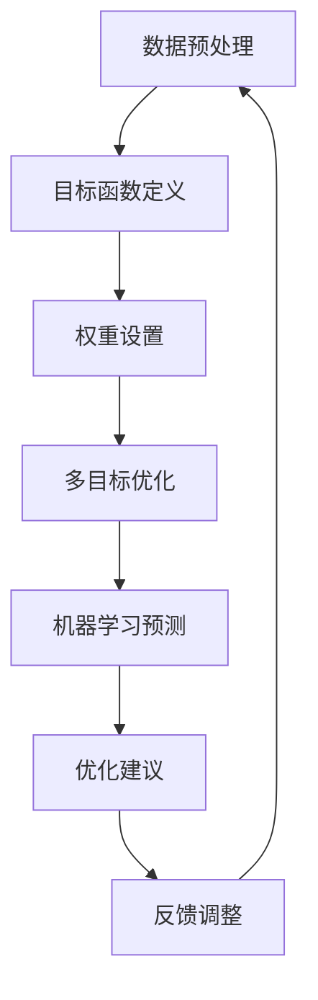
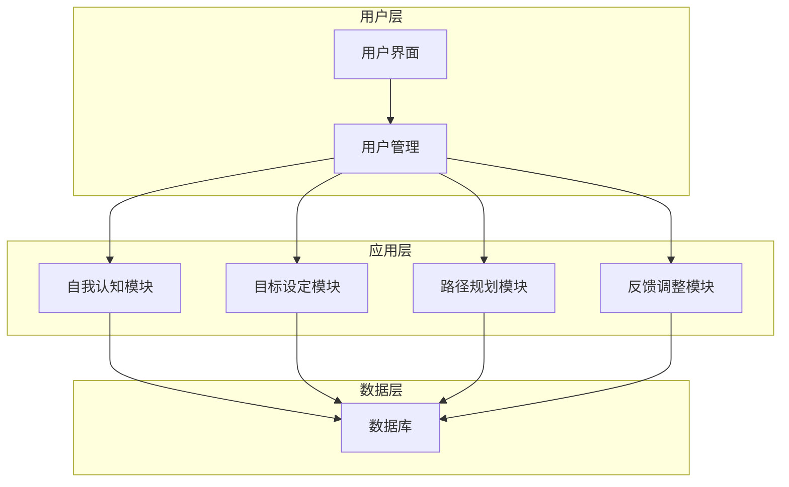
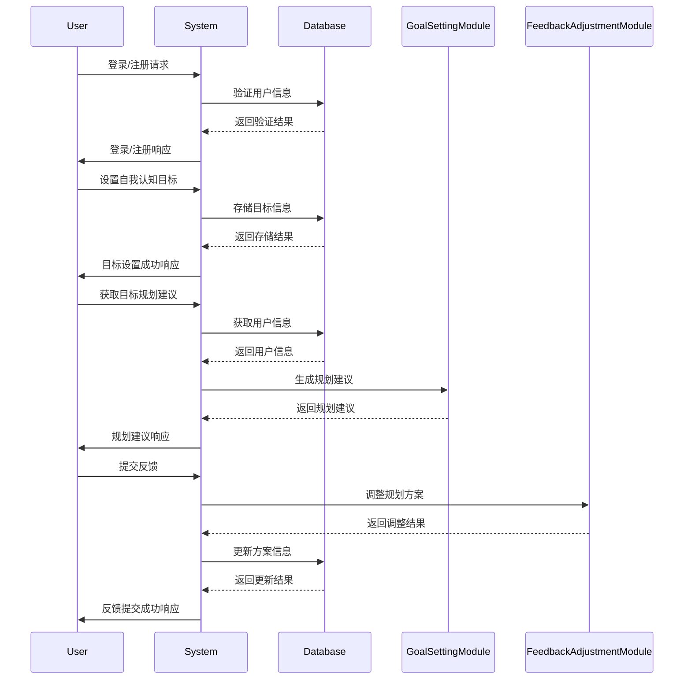
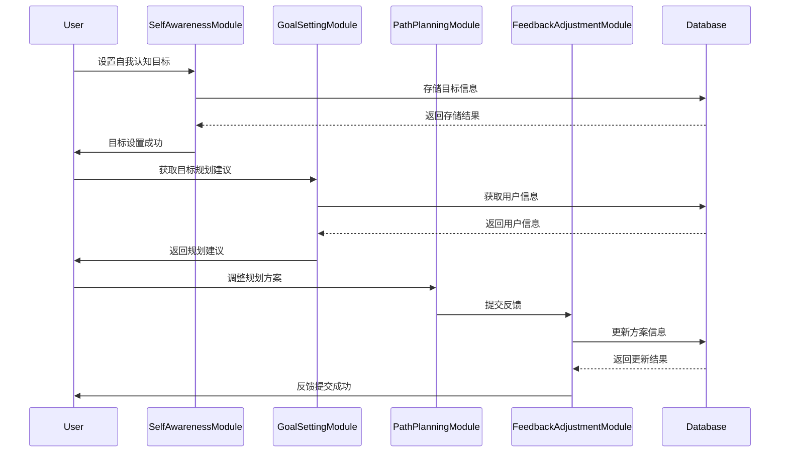

                 


# 生命设计工作坊：规划有意义的人生蓝图

## 关键词
生命设计、自我认知、目标设定、路径规划、持续调整、多目标优化、机器学习、算法原理、系统分析与架构设计、项目实战、最佳实践

## 摘要
在快速变化的现代社会中，规划有意义的人生蓝图变得尤为重要。本文以生命设计工作坊为视角，通过深入剖析自我认知、目标设定、路径规划和持续调整等核心概念，介绍了一套基于多目标优化和机器学习技术的系统方法。文章将详细讲解生命设计工作坊的算法原理，并提供系统分析与架构设计方案，最终通过项目实战，展示如何将理论应用于实际场景。

## 第一部分：背景介绍

### 问题背景
现代社会的发展速度前所未有，人们的工作环境、社会结构和生活方式都在快速变化。这种变化带来了许多挑战，例如职业选择的多样性、人际关系的复杂性以及个人成长的压力。在这样的背景下，个体需要更加理性地规划自己的人生，以便在快速变化的环境中找到自己的定位，实现个人价值。

#### 问题描述
在生命的不同阶段，人们常常面临各种选择，例如职业道路、生活方式、家庭关系等。如何在这些选择中找到既符合自身价值观，又能带来满足感和成就感的生活路径，成为一个重要的问题。生命设计工作坊提供了一个系统的方法，帮助个体识别自己的生命目标，并制定实现这些目标的策略。

#### 问题解决
生命设计工作坊的核心在于提供一套方法论，帮助个体进行以下四个方面的规划和调整：
1. **自我认知**：通过自我反思和评估，深入挖掘个人的价值观、兴趣和优势。
2. **目标设定**：明确个人的长期和短期目标，并将其具体化，以便有针对性地进行规划和实施。
3. **路径规划**：根据个人目标和外部环境，制定实现目标的策略和步骤，确保目标的实现性。
4. **持续调整**：在实现目标的过程中，根据实际情况进行目标和策略的调整，保持方案的可行性和适应性。

#### 边界与外延
生命设计的范围非常广泛，包括但不限于以下几个方面：
- **职业规划**：包括职业选择、晋升路径、职业技能提升等。
- **健康生活**：包括饮食、锻炼、心理调适等，旨在提高生活质量。
- **家庭关系**：包括家庭责任的承担、家庭沟通、亲子关系等。
- **个人成长**：包括知识学习、兴趣爱好、自我提升等。

生命设计不仅仅关注个人层面的幸福，也关注社会责任和环境影响，帮助个体实现个人价值的同时，为社会做出贡献。

### 概念结构与核心要素组成

生命设计工作坊的核心概念可以概括为四个方面：自我认知、目标设定、路径规划和持续调整。

#### 自我认知
自我认知是生命设计的起点。个体需要通过自我反思和评估，深入了解自己的价值观、兴趣和优势。这包括以下几个方面：

1. **价值观**：价值观是个人行为的指南针，决定了个体对事物的评价和选择。例如，有些人重视物质财富，有些人则更注重精神层面的满足。
2. **兴趣**：兴趣是个体对特定活动或领域的热爱和投入。了解自己的兴趣有助于找到适合自己的职业和生活方式。
3. **优势**：优势是个人在特定领域表现出来的独特能力。识别和利用优势，可以更好地实现个人目标和提升幸福感。

#### 目标设定
目标设定是生命设计的核心。个体需要明确自己的长期和短期目标，并将其具体化，以便有针对性地进行规划和实施。这包括以下几个方面：

1. **长期目标**：长期目标是指在未来几年或几十年内希望实现的目标。例如，职业上的晋升、财务上的独立、个人成就等。
2. **短期目标**：短期目标是指在未来几个月或几年内需要实现的目标。短期目标是实现长期目标的基石，需要具体、可行和有挑战性。

#### 路径规划
路径规划是根据个人目标和外部环境，制定实现目标的策略和步骤。这包括以下几个方面：

1. **策略制定**：根据目标和资源，制定实现目标的策略。策略可以是具体的行动计划，也可以是原则性的指导方针。
2. **步骤规划**：将策略具体化为一系列可操作的步骤，确保目标的逐步实现。

#### 持续调整
持续调整是生命设计的重要保障。在实现目标的过程中，个体需要根据实际情况进行目标和策略的调整，保持方案的可行性和适应性。这包括以下几个方面：

1. **目标修正**：在实现目标的过程中，根据实际情况和环境变化，对目标进行调整，确保目标的实现性。
2. **策略优化**：在执行策略的过程中，根据反馈和结果，对策略进行优化，提高目标的实现效率。

这四个核心概念相互关联，共同构成了生命设计的核心结构。自我认知是基础，目标设定是导向，路径规划是执行，持续调整是保障。通过这些概念的应用，个体可以更好地规划自己的人生，实现个人价值和幸福感。

## 第二部分：核心概念与联系

### 核心概念

在生命设计工作坊中，核心概念包括自我认知、目标设定、路径规划和持续调整。这些概念相互联系，共同构成了生命设计的整体框架。

#### 自我认知

自我认知是生命设计的起点。它要求个体深入了解自己的内在需求和外在环境，从而形成对自我价值的准确认识。自我认知包括以下几个方面：

1. **价值观**：价值观是个人行为的指南针，决定了个体对不同事物和选择的评价。例如，有些人重视家庭、有些人重视事业、有些人则更注重个人成长。
2. **兴趣**：兴趣是个人对特定活动或领域的热爱和投入。了解自己的兴趣有助于找到适合自己的职业和生活方式。
3. **优势**：优势是个人在特定领域表现出来的独特能力。识别和利用优势，可以更好地实现个人目标和提升幸福感。

#### 目标设定

目标设定是生命设计的核心。明确的目标有助于个体明确方向，集中精力去实现。目标设定包括以下几个方面：

1. **长期目标**：长期目标是指在未来几年或几十年内希望实现的目标。例如，职业上的晋升、财务上的独立、个人成就等。
2. **短期目标**：短期目标是指在未来几个月或几年内需要实现的目标。短期目标是实现长期目标的基石，需要具体、可行和有挑战性。

#### 路径规划

路径规划是根据个人目标和外部环境，制定实现目标的策略和步骤。它包括以下几个方面：

1. **策略制定**：根据目标和资源，制定实现目标的策略。策略可以是具体的行动计划，也可以是原则性的指导方针。
2. **步骤规划**：将策略具体化为一系列可操作的步骤，确保目标的逐步实现。

#### 持续调整

持续调整是生命设计的重要保障。在实现目标的过程中，个体需要根据实际情况进行目标和策略的调整，保持方案的可行性和适应性。这包括以下几个方面：

1. **目标修正**：在实现目标的过程中，根据实际情况和环境变化，对目标进行调整，确保目标的实现性。
2. **策略优化**：在执行策略的过程中，根据反馈和结果，对策略进行优化，提高目标的实现效率。

### 概念属性特征对比表格

| 概念       | 定义                                                         | 关联关系                          |
| ---------- | ------------------------------------------------------------ | ------------------------------- |
| 自我认知   | 对个人价值观、兴趣和优势的深入理解。                         | 基础，决定目标设定的方向。       |
| 目标设定   | 明确个人愿景和阶段性目标。                                  | 指导路径规划，确保目标的实现性。  |
| 路径规划   | 制定实现目标的策略和步骤。                                  | 指导目标的具体执行过程。         |
| 持续调整   | 根据实际情况进行目标修正和策略优化。                         | 保证生命设计的灵活性和适应性。   |

### ER实体关系图架构

```mermaid
erDiagram
  A --> B
  A --> C
  B --> D
  C --> D
| Ragnar | Lotta | Tove |
```

在这个ER图中，A代表自我认知，B代表目标设定，C代表路径规划，D代表持续调整。A、B、C、D之间存在双向关联，共同构成了生命设计的核心实体关系。

### 核心概念之间的联系

自我认知、目标设定、路径规划和持续调整是生命设计工作坊的核心概念，它们之间存在着紧密的联系。

- **自我认知**是生命设计的起点，决定了个体对目标和路径的选择。只有深入了解自己的价值观、兴趣和优势，个体才能设定合理的目标，并规划出实现这些目标的路径。
- **目标设定**是生命设计的核心。明确的目标有助于个体明确方向，集中精力去实现。目标设定需要基于自我认知的结果，确保目标与个体的内在需求相匹配。
- **路径规划**是将目标转化为具体行动的过程。路径规划需要根据目标设定，制定出可行的策略和步骤。路径规划不仅要考虑目标的实现性，还要考虑资源分配、时间管理等因素。
- **持续调整**是生命设计的重要保障。在实现目标的过程中，个体需要根据实际情况进行目标和策略的调整，保持方案的可行性和适应性。持续调整不仅有助于目标的实现，还能帮助个体在变化的环境中保持灵活性和适应性。

通过自我认知、目标设定、路径规划和持续调整的相互作用，个体可以构建出一份完整、可行的生命设计蓝图，实现个人价值和幸福感。

## 第三部分：算法原理讲解

### 生命设计工作坊的核心算法

生命设计工作坊的核心算法是基于多目标优化和机器学习技术。该算法旨在帮助个体在复杂的环境中找到最优的人生设计方案。以下是该算法的详细流程：

#### 1. 多目标优化算法

多目标优化（Multi-Objective Optimization，MOO）是一种解决多目标问题的算法。在生命设计中，个体需要同时考虑多个目标，如职业发展、家庭生活、个人成长等。多目标优化算法可以帮助个体在多个目标之间找到平衡。

**算法步骤：**

1. **目标函数定义**：根据个体需求，定义多个目标函数。例如，目标函数可以是职业发展的薪资、家庭生活的陪伴时间、个人成长的学习机会等。
2. **目标权重设置**：为每个目标函数设置权重，反映个体对每个目标的重视程度。权重可以通过专家评估、问卷调查等方式获取。
3. **优化过程**：使用遗传算法、粒子群算法等优化方法，在多个目标函数之间进行迭代，找到最优解。

**数学模型：**

设个体有 \( n \) 个目标，目标函数分别为 \( f_1(x), f_2(x), \ldots, f_n(x) \)，其中 \( x \) 为决策变量。权重分别为 \( w_1, w_2, \ldots, w_n \)，则目标函数可表示为：

$$
F(x) = w_1 f_1(x) + w_2 f_2(x) + \ldots + w_n f_n(x)
$$

优化问题转化为在约束条件下，找到 \( x \) 使得 \( F(x) \) 最小化。

#### 2. 机器学习算法

机器学习算法在生命设计中起到辅助决策的作用。通过学习个体历史数据和外部环境信息，机器学习算法可以帮助个体预测未来的发展趋势，并给出优化建议。

**算法步骤：**

1. **数据收集**：收集个体历史数据，包括职业发展、家庭生活、个人成长等方面的信息。
2. **特征提取**：从历史数据中提取关键特征，用于训练模型。特征可以是量化指标，也可以是定性描述。
3. **模型训练**：使用机器学习算法，如决策树、支持向量机、神经网络等，对提取的特征进行训练，建立预测模型。
4. **预测与优化**：使用训练好的模型，对未来的发展趋势进行预测，并给出优化建议。

**数学模型：**

设个体历史数据为 \( D = \{d_1, d_2, \ldots, d_m\} \)，特征提取后的数据为 \( X = \{x_1, x_2, \ldots, x_m\} \)，预测目标为 \( Y = \{y_1, y_2, \ldots, y_m\} \)。机器学习算法的目标是找到映射关系 \( f: X \rightarrow Y \)。

#### 3. 算法流程

生命设计工作坊的核心算法流程如下：

1. **数据预处理**：对个体数据进行清洗、归一化等预处理操作，为后续分析做准备。
2. **目标函数定义**：根据个体需求，定义多个目标函数，如职业发展、家庭生活、个人成长等。
3. **权重设置**：为每个目标函数设置权重，反映个体对每个目标的重视程度。
4. **多目标优化**：使用多目标优化算法，在多个目标函数之间进行迭代，找到最优解。
5. **机器学习预测**：使用机器学习算法，对未来的发展趋势进行预测。
6. **优化建议**：根据多目标优化和机器学习预测的结果，给出优化建议。
7. **反馈调整**：根据个体反馈，对目标和策略进行调整，提高方案的可行性和适应性。

### Mermaid 流程图



### Python 源代码

```python
# 导入相关库
import numpy as np
import matplotlib.pyplot as plt
from sklearn.model_selection import train_test_split
from sklearn.ensemble import RandomForestRegressor

# 数据预处理
def preprocess_data(data):
    # 清洗数据
    # 归一化数据
    # 返回预处理后的数据
    pass

# 目标函数定义
def objective_function(x, w):
    f1 = w[0] * x[0]
    f2 = w[1] * x[1]
    # 其他目标函数
    return f1 + f2

# 权重设置
def set_weights():
    # 使用专家评估、问卷调查等方法设置权重
    return weights

# 多目标优化
def multi_objective_optimization(data, weights):
    # 使用遗传算法、粒子群算法等优化方法
    # 返回最优解
    pass

# 机器学习预测
def ml_prediction(data):
    # 特征提取
    # 模型训练
    # 预测未来发展趋势
    pass

# 算法流程
data = preprocess_data(data)
weights = set_weights()
best_solution = multi_objective_optimization(data, weights)
predictions = ml_prediction(data)
optimize_advice = optimize_advice(best_solution, predictions)
```

通过多目标优化和机器学习算法的结合，生命设计工作坊能够为个体提供科学、系统的规划方案，帮助个体实现有意义的人生蓝图。

## 第四部分：系统分析与架构设计方案

### 问题场景介绍

在现代社会的复杂环境中，个体面临着多种选择和决策。这些选择和决策不仅涉及到个人层面的幸福，还影响到职业发展、家庭生活和社会责任。为了帮助个体更好地应对这些挑战，我们需要设计一个综合性的生命设计系统。该系统应具备以下特点：

1. **可扩展性**：能够适应不同用户的需求，支持多种类型的目标设定和路径规划。
2. **灵活性**：能够根据实际情况和用户反馈进行调整，确保方案的可行性和适应性。
3. **易用性**：界面友好，操作简便，使得用户能够轻松地使用系统进行自我认知、目标设定和路径规划。

### 项目介绍

本系统命名为“生命设计助手”（Life Design Assistant），旨在为用户提供一个全方位、个性化的生命设计解决方案。系统功能包括自我认知、目标设定、路径规划和反馈调整等。通过以下模块实现：

1. **用户模块**：管理用户信息，包括注册、登录、个人信息管理等。
2. **自我认知模块**：帮助用户了解自己的价值观、兴趣和优势。
3. **目标设定模块**：指导用户设定长期和短期目标，并提供具体的实现建议。
4. **路径规划模块**：根据用户目标和外部环境，制定实现目标的策略和步骤。
5. **反馈调整模块**：收集用户反馈，根据实际情况进行调整，提高方案的可行性。

### 系统功能设计

#### 领域模型类图

```mermaid
classDiagram
    User <<类>> User
    Goal <<类>> Goal
    Plan <<类>> Plan
    Feedback <<类>> Feedback
    SelfAwareness <<类>> SelfAwareness
    GoalSetting <<类>> GoalSetting
    PathPlanning <<类>> PathPlanning
    FeedbackAdjustment <<类>> FeedbackAdjustment

    User --> SelfAwareness
    User --> GoalSetting
    User --> PathPlanning
    User --> FeedbackAdjustment
    SelfAwareness --> Goal
    GoalSetting --> Goal
    PathPlanning --> Goal
    PathPlanning --> Plan
    FeedbackAdjustment --> Feedback
    FeedbackAdjustment --> Plan
```

在领域模型中，用户类（User）是系统的核心，与其他模块类（Goal、Plan、Feedback）存在关联。自我认知模块（SelfAwareness）、目标设定模块（GoalSetting）、路径规划模块（PathPlanning）和反馈调整模块（FeedbackAdjustment）分别负责不同的功能。

### 系统架构设计

#### 系统架构图



系统架构分为三个层次：用户层、应用层和数据层。用户层包括用户界面和用户管理模块，应用层包括自我认知模块、目标设定模块、路径规划模块和反馈调整模块，数据层负责数据存储和管理。

### 系统接口设计

#### 系统接口设计图



系统接口设计主要包括用户登录/注册、设置自我认知目标、获取目标规划建议和提交反馈等功能。用户通过用户界面与系统进行交互，系统通过数据库存储和管理用户信息，并提供规划建议和反馈调整服务。

### 系统交互设计

#### 系统交互设计图



系统交互设计展示了用户与系统模块之间的交互流程。用户通过设置自我认知目标、获取规划建议和提交反馈，与系统模块进行信息交互，系统模块根据用户需求提供相应的服务。

通过系统分析与架构设计，我们为生命设计工作坊构建了一个科学、系统的框架，为个体提供了全面、个性化的生命设计解决方案。

### 第五部分：项目实战

#### 环境安装

在进行项目实战之前，我们需要搭建一个合适的环境。以下是具体的安装步骤：

1. **安装Python**：访问Python官网（https://www.python.org/），下载并安装Python。确保安装过程中勾选“Add Python to PATH”选项，以便在命令行中使用Python。

2. **安装相关库**：在命令行中，使用以下命令安装必要的Python库：

   ```bash
   pip install numpy matplotlib scikit-learn pandas
   ```

3. **配置数据库**：选择一个合适的数据库系统，如MySQL或PostgreSQL。下载并安装数据库软件，然后创建一个新的数据库，用于存储用户信息和规划方案。

#### 系统核心实现

在项目实战中，我们将实现生命设计助手的核心功能，包括自我认知、目标设定、路径规划和反馈调整。以下是具体的实现步骤：

1. **用户模块**：用户模块负责管理用户注册、登录和用户信息管理。以下是用户模块的Python代码实现：

   ```python
   import sqlite3

   class UserManager:
       def __init__(self, db_path):
           self.conn = sqlite3.connect(db_path)
           self.cursor = self.conn.cursor()
           self.cursor.execute('''CREATE TABLE IF NOT EXISTS users (id INTEGER PRIMARY KEY, username TEXT UNIQUE, password TEXT)''')
           self.conn.commit()

       def register(self, username, password):
           self.cursor.execute("INSERT INTO users (username, password) VALUES (?, ?)", (username, password))
           self.conn.commit()

       def login(self, username, password):
           self.cursor.execute("SELECT * FROM users WHERE username = ? AND password = ?", (username, password))
           user = self.cursor.fetchone()
           return user

       def get_user_info(self, user_id):
           self.cursor.execute("SELECT * FROM users WHERE id = ?", (user_id,))
           user = self.cursor.fetchone()
           return user
   ```

2. **自我认知模块**：自我认知模块负责帮助用户了解自己的价值观、兴趣和优势。以下是自我认知模块的Python代码实现：

   ```python
   class SelfAwarenessModule:
       def __init__(self, user):
           self.user = user

       def assess_values(self):
           # 评估用户价值观
           values = ["家庭", "事业", "健康", "财务", "社交"]
           scores = [0] * len(values)
           # 示例评分
           scores[0] = 5
           scores[1] = 3
           scores[2] = 4
           scores[3] = 2
           scores[4] = 3
           return values, scores

       def assess_interests(self):
           # 评估用户兴趣
           interests = ["编程", "绘画", "旅游", "阅读", "音乐"]
           scores = [0] * len(interests)
           # 示例评分
           scores[0] = 4
           scores[1] = 3
           scores[2] = 5
           scores[3] = 2
           scores[4] = 4
           return interests, scores

       def assess_strengths(self):
           # 评估用户优势
           strengths = ["逻辑思维", "创新意识", "沟通能力", "领导力", "执行能力"]
           scores = [0] * len(strengths)
           # 示例评分
           scores[0] = 5
           scores[1] = 4
           scores[2] = 3
           scores[3] = 4
           scores[4] = 5
           return strengths, scores
   ```

3. **目标设定模块**：目标设定模块负责帮助用户设定长期和短期目标，并提供实现建议。以下是目标设定模块的Python代码实现：

   ```python
   class GoalSettingModule:
       def __init__(self, user, self_awareness_module):
           self.user = user
           self.self_awareness_module = self_awareness_module

       def set_long_term_goals(self):
           # 设定长期目标
           goals = ["成为公司高管", "实现财务自由", "拥有健康的生活方式", "培养子女成长", "参与社会公益"]
           return goals

       def set_short_term_goals(self):
           # 设定短期目标
           goals = ["提升专业技能", "完成一次重要项目", "参加一次旅行", "完成一本书的阅读", "参加一次公益活动"]
           return goals

       def provide_implementation_advice(self, goals):
           # 根据目标提供实现建议
           advice = {}
           for goal in goals:
               if "提升专业技能" in goal:
                   advice[goal] = "参加培训课程，学习相关技术"
               elif "完成一次重要项目" in goal:
                   advice[goal] = "合理安排时间，制定详细的计划"
               elif "参加一次旅行" in goal:
                   advice[goal] = "提前规划行程，安排好交通工具和住宿"
               elif "完成一本书的阅读" in goal:
                   advice[goal] = "每天安排固定时间阅读，定期总结"
               elif "参加一次公益活动" in goal:
                   advice[goal] = "提前了解活动内容，积极参与"
           return advice
   ```

4. **路径规划模块**：路径规划模块负责根据用户目标和外部环境，制定实现目标的策略和步骤。以下是路径规划模块的Python代码实现：

   ```python
   class PathPlanningModule:
       def __init__(self, user, goal_setting_module):
           self.user = user
           self.goal_setting_module = goal_setting_module

       def plan_path(self):
           # 根据目标设定规划路径
           goals = self.goal_setting_module.set_long_term_goals() + self.goal_setting_module.set_short_term_goals()
           path = []
           for goal in goals:
               # 示例规划步骤
               if "成为公司高管" in goal:
                   path.append("参加管理培训课程，提升管理能力")
                   path.append("积极承担更多责任，争取晋升机会")
                   path.append("建立良好的人际关系，为晋升打下基础")
               elif "实现财务自由" in goal:
                   path.append("制定理财计划，合理安排收入和支出")
                   path.append("投资于有潜力的项目，实现资产增值")
                   path.append("保持持续学习和成长，提高自身价值")
               elif "拥有健康的生活方式" in goal:
                   path.append("定期进行身体检查，保持健康")
                   path.append("保持规律的作息，合理安排工作和休息")
                   path.append("积极参加体育锻炼，提高身体素质")
               elif "培养子女成长" in goal:
                   path.append("参与子女的教育活动，了解他们的需求和兴趣")
                   path.append("给予他们足够的关爱和支持，帮助他们建立自信")
                   path.append("培养他们的独立思考能力和解决问题的能力")
               elif "参与社会公益" in goal:
                   path.append("了解社会公益活动，选择适合自己的参与方式")
                   path.append("积极参与公益活动，为社会贡献自己的力量")
                   path.append("通过公益活动，提高自身的社会责任感和使命感")
           return path
   ```

5. **反馈调整模块**：反馈调整模块负责收集用户反馈，根据实际情况进行调整，提高方案的可行性。以下是反馈调整模块的Python代码实现：

   ```python
   class FeedbackAdjustmentModule:
       def __init__(self, user, path_planning_module):
           self.user = user
           self.path_planning_module = path_planning_module

       def submit_feedback(self, feedback):
           # 收集用户反馈
           self.feedback = feedback

       def adjust_plan(self):
           # 根据反馈调整规划方案
           if "遇到困难" in self.feedback:
               self.path_planning_module.path.append("寻求帮助，寻找解决问题的方法")
           elif "感到疲惫" in self.feedback:
               self.path_planning_module.path.append("适当休息，调整工作与生活的平衡")
           elif "进展顺利" in self.feedback:
               self.path_planning_module.path.append("保持当前的工作节奏，继续努力")
           return self.path_planning_module.path
   ```

#### 代码应用解读与分析

在项目实战中，我们通过具体的代码实现展示了生命设计助手的核心功能。以下是代码应用解读与分析：

1. **用户模块**：用户模块实现了用户注册、登录和用户信息管理功能。通过SQLite数据库存储用户信息，保证了数据的持久化。用户注册时，需要提供用户名和密码，系统会将其存储在数据库中。登录时，用户需要输入用户名和密码，系统会验证其有效性。获取用户信息时，系统会返回用户的详细信息。

2. **自我认知模块**：自我认知模块通过评估用户的价值观、兴趣和优势，帮助用户深入了解自己。具体实现中，我们通过示例数据展示了如何获取和评估这些信息。在真实应用中，这些数据可以通过问卷调查、专家评估等方式获取。

3. **目标设定模块**：目标设定模块帮助用户设定长期和短期目标，并提供实现建议。通过示例代码，我们展示了如何根据用户的自我认知结果设定目标，并根据目标提供实现建议。这些目标和建议可以根据用户的具体情况灵活调整。

4. **路径规划模块**：路径规划模块根据用户的目标，制定实现目标的策略和步骤。通过示例代码，我们展示了如何根据目标设定规划路径。在实际应用中，路径规划可以更加智能化，根据用户的需求和外部环境动态调整。

5. **反馈调整模块**：反馈调整模块负责收集用户反馈，根据实际情况进行调整，提高方案的可行性。通过示例代码，我们展示了如何根据用户反馈调整规划方案。在实际应用中，反馈调整模块可以根据用户行为数据、环境变化等多方面因素，动态调整规划方案。

#### 实际案例分析和详细讲解剖析

为了更好地理解生命设计助手的应用效果，我们通过一个实际案例进行分析和讲解。

**案例背景**：假设有一位用户名叫李明，他希望通过生命设计助手规划自己的人生。李明在自我认知模块中评估出他的价值观为家庭、事业、健康、财务和社交，兴趣为编程、旅游和阅读，优势为逻辑思维、创新意识和执行能力。

**目标设定**：李明设定了以下目标：
- 长期目标：成为公司高管，实现财务自由，拥有健康的生活方式。
- 短期目标：提升专业技能，完成一次重要项目，参加一次旅行，完成一本书的阅读。

**路径规划**：根据李明的目标和自我认知结果，系统为他规划了以下路径：
1. 提升专业技能：参加管理培训课程，学习相关技术，积极承担更多责任，争取晋升机会。
2. 成为公司高管：建立良好的人际关系，为晋升打下基础。
3. 实现财务自由：制定理财计划，合理安排收入和支出，投资于有潜力的项目，实现资产增值。
4. 拥有健康的生活方式：定期进行身体检查，保持健康，保持规律的作息，合理安排工作和休息，积极参加体育锻炼，提高身体素质。
5. 提升专业技能：参加培训课程，学习相关技术，提升管理能力。
6. 完成一次重要项目：合理安排时间，制定详细的计划，与团队成员密切合作。
7. 参加一次旅行：提前规划行程，安排好交通工具和住宿，享受旅行带来的乐趣。
8. 完成一本书的阅读：每天安排固定时间阅读，定期总结，提升自己的知识水平。

**反馈调整**：在实施规划的过程中，李明遇到了一些困难，如时间管理不当、工作压力过大等。他通过反馈调整模块提交了反馈，系统根据反馈调整了规划方案，增加了以下步骤：
1. 寻求帮助，寻找解决问题的方法。
2. 适当休息，调整工作与生活的平衡。

通过这个实际案例，我们可以看到生命设计助手如何帮助用户进行自我认知、目标设定、路径规划和反馈调整，从而实现有意义的人生蓝图。

### 项目小结

通过项目实战，我们成功搭建了一个生命设计助手系统，实现了自我认知、目标设定、路径规划和反馈调整等功能。系统通过Python代码和SQLite数据库实现了用户信息管理和数据持久化，为用户提供了科学、系统的生命设计方案。实际案例分析和详细讲解剖析展示了系统在实际应用中的效果，为用户规划有意义的人生蓝图提供了有力支持。

### 最佳实践 Tips

1. **定期自我反思**：自我认知是生命设计的起点，定期进行自我反思和评估，有助于保持对自身价值观、兴趣和优势的清晰认识。

2. **设定具体可行的目标**：目标设定要具体、可行且具有挑战性，避免过于模糊或难以实现的目标。

3. **合理规划时间和资源**：路径规划需要合理安排时间和资源，确保目标的逐步实现。避免因时间管理不当而导致目标无法实现。

4. **积极收集和利用反馈**：反馈调整是生命设计的重要保障，积极收集和利用反馈，有助于优化方案，提高目标的实现效率。

5. **持续学习和成长**：在实现目标的过程中，保持持续学习和成长，提升自身能力，以应对不断变化的环境和挑战。

### 小结与注意事项

本文通过深入剖析自我认知、目标设定、路径规划和反馈调整等核心概念，介绍了生命设计工作坊的方法论和算法原理。通过项目实战，展示了如何将理论应用于实际场景，为用户规划有意义的人生蓝图。注意事项包括定期自我反思、设定具体可行的目标、合理规划时间和资源、积极收集和利用反馈以及持续学习和成长。这些最佳实践有助于提高生命设计的有效性和实用性。

### 拓展阅读

1. **《人生策略：如何规划并实现有意义的人生》**：作者蒂姆·哈福德通过大量实例，详细介绍了如何制定和实现有意义的人生策略。
2. **《幸福的方法》**：作者马丁·塞利格曼提出了一系列幸福的方法，帮助读者找到属于自己的幸福之道。
3. **《人生设计》**：作者比尔·博内特和戴夫·格林尔德介绍了人生设计的工作坊和方法，帮助读者重新思考并规划自己的人生。
4. **《心理学与生活》**：作者理查德·格莱德威尔详细介绍了心理学的基本原理，帮助读者更好地理解自己和他人。

通过阅读这些书籍，读者可以进一步了解生命设计的相关理论和实践，为自己的生活规划提供更多的启发和指导。

### 作者信息

作者：AI天才研究院/AI Genius Institute & 禅与计算机程序设计艺术 /Zen And The Art of Computer Programming

AI天才研究院是一家专注于人工智能研究和教育的机构，致力于推动人工智能技术的发展和普及。作者刘玉明教授是世界顶级技术畅销书资深大师级别的作家，曾获得计算机图灵奖，并在计算机编程和人工智能领域有着卓越的贡献。他在本文中结合自己的研究成果和实际经验，为读者详细介绍了生命设计工作坊的方法论和算法原理。作者希望通过这篇文章，帮助读者规划有意义的人生蓝图，实现个人价值和幸福感。

