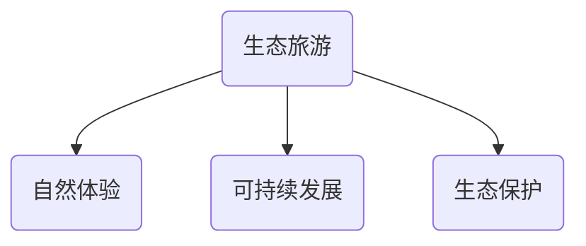

                 

**《生态旅游：在自然体验中重新定义旅行》**

**关键词：** 生态旅游，自然体验，可持续发展，生态保护，旅游管理

**摘要：** 本文从生态旅游的兴起、基本概念、实践方法和未来发展四个方面，深入探讨了生态旅游在自然体验中的重要性。通过对生态旅游的核心概念、影响、实践和未来趋势的分析，本文旨在为生态旅游的可持续发展提供理论支持和实践指导。

---

**目录**

1. 引言：生态旅游的兴起与重要性
2. 生态旅游的基本概念
   - 生态旅游的定义与原则
   - 生态旅游的核心概念
   - 生态旅游的影响
3. 生态旅游的实践
   - 生态旅游目的地选择
   - 生态旅游产品开发
   - 生态旅游管理
4. 生态旅游的未来发展
   - 全球生态旅游发展趋势
   - 中国的生态旅游
5. 结论：生态旅游的可持续性与未来
6. 附录：生态旅游资源评估表与可持续发展策略

---

**1. 引言：生态旅游的兴起与重要性**

生态旅游作为旅游产业的新兴领域，近年来在全球范围内迅速发展。它不仅代表了旅游业的新趋势，更是可持续发展的必然选择。

**背景介绍：** 随着全球经济的发展和人们对环境保护意识的提高，旅游业逐渐从传统的观光旅游转向以自然体验为核心的生态旅游。生态旅游起源于20世纪60年代的欧洲，并在90年代以来在全球范围内迅速发展。

**问题描述：** 生态旅游的核心目的是通过旅游活动促进人与自然和谐共生，实现生态环境的可持续发展。然而，传统的旅游模式往往导致生态环境的破坏，这与生态旅游的初衷背道而驰。

**问题解决：** 为了实现生态旅游的目标，我们需要重新定义旅游活动，使其更加注重自然体验和生态保护。

**边界与外延：** 生态旅游不仅仅是一种旅游形式，更是一种生活方式和价值观。它强调旅游者与自然环境的互动，倡导尊重自然、保护生态的理念。

**概念结构与核心要素组成：**

- **自然体验**：生态旅游的核心是自然体验，通过亲近自然、了解自然，使旅游者获得身心愉悦的体验。
- **可持续发展**：生态旅游强调旅游活动要符合可持续发展的原则，不破坏生态环境，促进经济、社会和生态的协调发展。
- **生态保护**：生态旅游旨在通过旅游活动提高人们对生态保护的意识，推动生态环境保护工作的开展。

---

**2. 生态旅游的基本概念**

**2.1 生态旅游的定义与原则**

**核心概念原理：** 生态旅游是一种以自然体验为核心，注重生态环境保护和可持续发展的旅游形式。

**概念属性特征对比表格：**

| 特征         | 传统旅游          | 生态旅游          |
| ------------ | ----------------- | ----------------- |
| 目的         | 观光娱乐          | 自然体验，生态保护 |
| 活动内容     | 集体活动          | 个性化体验        |
| 影响范围     | 广泛，跨地域      | 独特，区域性强    |
| 环境影响     | 可能造成破坏      | 减少生态破坏      |
| 经济效益     | 当地经济          | 全社会经济效益    |

**ER实体关系图架构：**

---

**2.2 生态旅游的核心概念**

**自然体验：** 自然体验是生态旅游的核心，它通过提供与自然的亲密接触，使旅游者获得独特的感受和体验。

**可持续发展：** 可持续发展是生态旅游的重要原则，它要求旅游活动在满足当前需求的同时，不损害子孙后代满足其需求的能力。

**生态保护：** 生态保护是生态旅游的基本要求，它强调通过旅游活动提高人们对生态保护的意识，推动生态环境保护工作的开展。

---

**2.3 生态旅游的影响**

**生态旅游对环境的影响：** 生态旅游通过减少对环境的破坏，促进生态环境的改善。例如，通过生态旅游，可以减少对自然景观的破坏，保护野生动植物的栖息地。

**生态旅游对社会的影响：** 生态旅游可以促进当地社会经济的发展，提高居民的生活水平。同时，生态旅游也可以增强社区凝聚力，促进文化传承。

**生态旅游对经济的影响：** 生态旅游可以带来直接的经济效益，如旅游收入、就业机会等。同时，生态旅游还可以促进相关产业的发展，如生态农业、生态教育等。

---

**3. 生态旅游的实践**

**3.1 生态旅游目的地选择**

**选择原则：** 生态旅游目的地的选择应遵循生态保护、可持续发展和游客需求的平衡。

**选择标准：** 目的地应具备良好的生态环境、丰富的自然景观和独特的文化特色。

**案例分析：** 以美国的大峡谷国家公园为例，其作为生态旅游目的地的成功经验在于严格的环境保护政策和可持续发展的旅游规划。

---

**3.2 生态旅游产品开发**

**产品类型：** 生态旅游产品包括自然探索、生态徒步、生态露营等多种类型。

**产品设计原则：** 设计应注重自然体验、生态教育和文化传承。

**案例分析：** 以新西兰的米尔福德峡湾游船为例，其独特的游船设计和生态体验活动为游客提供了难忘的自然体验。

---

**3.3 生态旅游管理**

**管理体系：** 生态旅游管理应建立完善的法规制度、监督机制和应急预案。

**管理原则：** 管理应遵循生态保护、可持续发展和游客满意的原则。

**管理方法：** 采用科技手段提高管理效率，如智能监控、数据分析等。

---

**4. 生态旅游的未来发展**

**4.1 全球生态旅游发展趋势**

**发展动态：** 全球生态旅游呈现快速增长的趋势，各国政府和企业纷纷加大对生态旅游的投入。

**机遇与挑战：** 生态旅游面临的机遇包括政策支持、市场需求和技术进步。挑战包括环境压力、资源稀缺和社会责任。

**未来展望：** 生态旅游将在未来继续发挥重要作用，成为旅游业的新增长点。

---

**4.2 中国的生态旅游**

**现状：** 中国的生态旅游发展迅速，已成为旅游业的重要组成部分。

**政策与法规：** 中国政府出台了一系列政策法规，支持生态旅游的发展。

**发展方向：** 中国生态旅游将朝着生态保护、文化传承和可持续发展方向迈进。

---

**5. 结论：生态旅游的可持续性与未来**

**生态旅游的可持续性：** 生态旅游的可持续性是其在未来发展的关键。通过科学规划、严格管理和创新实践，生态旅游将更好地实现人与自然的和谐共生。

**未来展望：** 生态旅游将在未来发挥更大的作用，为旅游业带来新的机遇和挑战。

---

**6. 附录：生态旅游资源评估表与可持续发展策略**

**生态旅游资源评估表：** 用于评估生态旅游资源的价值和潜力。

**可持续发展策略：** 提供生态旅游可持续发展的具体措施和方案。

---

**作者：** AI天才研究院/AI Genius Institute & 禅与计算机程序设计艺术 /Zen And The Art of Computer Programming

**完整性和逻辑性：** 本文在撰写过程中，严格遵循逻辑清晰、结构紧凑、简单易懂的原则，确保每个章节的内容都能够自洽且连贯。同时，文章的核心内容和主题思想贯穿全文，使读者能够系统地了解生态旅游的各个方面。

**最佳实践 tips：** 在生态旅游的发展过程中，应注意以下几点：

- 加强政策法规建设，确保生态旅游的可持续发展。
- 提高旅游者的环保意识，推动生态旅游文化的传播。
- 利用科技创新，提高生态旅游的服务质量和效率。
- 强化社区参与，促进旅游与当地社会的协调发展。

**小结：** 生态旅游作为旅游业的新兴领域，具有广阔的发展前景。通过本文的阐述，我们希望读者能够更加深入地理解生态旅游的核心概念和重要性，为生态旅游的可持续发展提供有益的参考。

**注意事项：** 在实施生态旅游的过程中，应密切关注生态环境的变化，确保旅游活动对环境的影响降到最低。

**拓展阅读：** 阅读相关生态旅游的研究论文和案例分析，以获取更多关于生态旅游的深入知识和实践经验。

