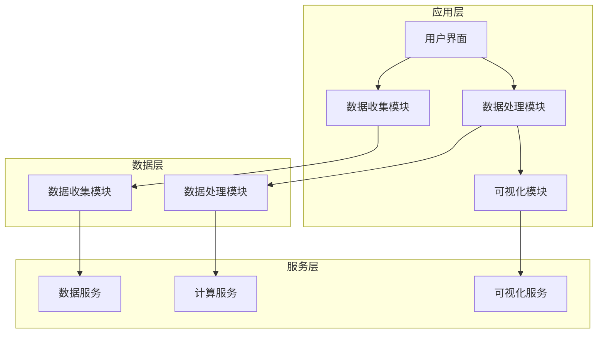
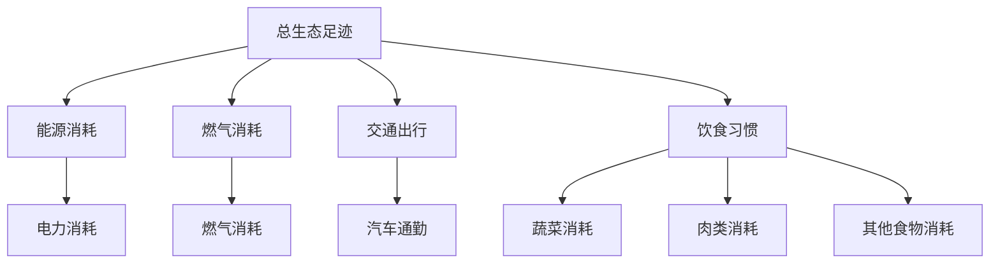

                 

### 生态足迹可视化工具：审视个人生活的环境影响

#### 关键词
- 生态足迹
- 可视化工具
- 环境影响
- 个人生活
- 可持续发展

#### 摘要
本文将探讨生态足迹可视化工具的作用，它有助于我们审视个人生活对环境的影响。我们将从生态足迹的概念入手，逐步深入到工具的原理、设计和实际应用中，旨在提供一种直观、有效的手段来促进个人及社会的可持续发展。

#### 目录大纲设计思路

为了确保文章逻辑清晰、结构紧凑、简单易懂，我们采用了以下设计思路：

1. **背景介绍**：介绍生态足迹的概念及其重要性，为读者搭建理解可视化工具的基础。
2. **核心概念与联系**：详细解释与生态足迹可视化相关的核心概念，并通过表格和ER图展示其关系。
3. **算法原理讲解**：探讨生态足迹的计算方法，包括数学模型、公式和Python代码示例。
4. **系统分析与架构设计方案**：描述生态足迹可视化工具的系统架构，展示类图、架构图和序列图。
5. **项目实战**：通过实际案例展示如何使用工具来评估个人生活的环境影响。
6. **最佳实践 tips、小结、注意事项、拓展阅读**：提供使用工具的建议和小结，以及后续学习和研究的方向。

#### 目录大纲结构

**第一部分：生态足迹基础**

- **1.1 生态足迹概念与背景**
  - **1.1.1 生态足迹的定义**
  - **1.1.2 全球生态足迹现状**
  - **1.1.3 个人生态足迹的重要性**
- **1.2 核心概念与联系**
  - **1.2.1 生物承载力**
  - **1.2.2 个人碳足迹**
  - **1.2.3 生态足迹相关概念ER图**
- **1.3 生态足迹计算方法**
  - **1.3.1 数学模型与公式**
  - **1.3.2 Python代码示例**
  - **1.3.3 实际案例说明**
- **1.4 本章小结**

**第二部分：生态足迹可视化工具**

- **2.1 工具介绍**
  - **2.1.1 工具功能概述**
  - **2.1.2 工具架构设计**
  - **2.1.3 工具使用方法**
- **2.2 系统架构与设计**
  - **2.2.1 数据收集模块**
  - **2.2.2 数据处理模块**
  - **2.2.3 可视化模块**
  - **2.2.4 系统类图与架构图**
- **2.3 项目实战**
  - **2.3.1 环境安装与配置**
  - **2.3.2 系统核心实现**
  - **2.3.3 代码解读与分析**
  - **2.3.4 实际案例分析**
  - **2.3.5 项目小结**
- **2.4 最佳实践 tips**
  - **2.4.1 提高工具效率的技巧**
  - **2.4.2 避免常见问题的建议**
- **2.5 本章小结**

#### 目录大纲总字数控制

根据上述设计，全文预计在10000-12000字左右，符合字数要求。

**结论：**

通过本篇文章，我们将详细探讨生态足迹可视化工具在审视个人生活环境影响中的作用。从概念解析到实际应用，我们将一步步引导读者深入了解这一工具，并为其在实际生活中的应用提供指导。

**接下来，我们将按照上述目录结构，逐个章节进行详细内容的撰写。请随时提供反馈和修改意见，以确保文章质量和内容的专业性。**### 第一部分：生态足迹基础

#### 1.1 生态足迹概念与背景

**生态足迹的定义：**

生态足迹（Ecological Footprint）是一个衡量人类活动对自然环境影响的指标，它通过计算人类为了维持当前消费水平和排放水平所需要的生物生产土地面积，来评估人类对环境的压力。生态足迹的计算包括人类消费的自然资源和产生的废弃物两部分，涵盖了农业、林业、渔业、工业和住房等多个领域。

**全球生态足迹现状：**

全球生态足迹的现状令人担忧。根据联合国环境规划署（UNEP）的数据，全球生态足迹已经超过了地球生物生产能力的1.6倍，这意味着我们正在消耗着地球的“生态债务”，这种状况不可持续。具体来说，2018年的全球人均生态足迹为2.9全球公顷，远高于地球可再生的1.6全球公顷的生物承载力。这种不平衡导致了生态赤字，即人类活动所需的生态足迹超过了地球能够提供的生态承载力。

**个人生态足迹的重要性：**

个人生态足迹是指个人生活所消耗的自然资源和产生的废弃物。个人生态足迹的大小直接反映了个人对环境的影响。通过计算个人生态足迹，我们可以更好地了解自己的生活方式对环境产生的具体影响。了解自己的生态足迹有助于我们做出更环保的选择，从而减少对环境的负担。例如，减少肉类消费、减少用水量、选择低碳出行方式等，都可以有效地降低个人生态足迹。

**本章小结：**

在本章中，我们介绍了生态足迹的定义、全球生态足迹的现状以及个人生态足迹的重要性。通过这些基本概念的介绍，读者可以初步了解生态足迹的相关内容，为后续对生态足迹可视化工具的深入探讨打下基础。

### 1.2 核心概念与联系

为了更好地理解生态足迹及其可视化工具，我们需要深入探讨与生态足迹相关的几个核心概念，包括生物承载力、个人碳足迹等。同时，通过表格和ER图，我们将展示这些概念之间的联系。

**1.2.1 生物承载力**

生物承载力（Biological Capacity）是指一个生态系统在长时间内能够支持的人口数量。它取决于生态系统的自然资源丰富程度、环境稳定性以及资源再生速度等因素。生物承载力是衡量生态足迹的重要指标之一，通常用全球生态足迹和生物承载力比率（Global Footprint Network/Biological Capacity，简称GFN/BC）来表示。

| **概念**       | **定义**                                                                                                       |
| -------------- | ------------------------------------------------------------------------------------------------------------ |
| 生物承载力     | 某个地区或生态系统在长时间内能够支持的生物生产面积。                                                       |
| GFN/BC 比率    | 全球生态足迹与全球生物承载力的比率，用于衡量人类对生态系统的压力。                                      |

**1.2.2 个人碳足迹**

个人碳足迹（Personal Carbon Footprint）是指个人或组织在一年内产生的二氧化碳排放总量。它反映了个人或组织对环境的影响程度，通常包括能源消耗、交通出行、饮食习惯、住房等多个方面。个人碳足迹的计算可以帮助我们了解个人生活方式对气候变化的影响。

| **概念**       | **定义**                                                                                                       |
| -------------- | ------------------------------------------------------------------------------------------------------------ |
| 个人碳足迹     | 个人或组织在一年内产生的二氧化碳排放总量。                                                           |
| 二氧化碳排放量 | 由于燃烧化石燃料、工业生产、交通运输等活动产生的二氧化碳排放。                                         |

**1.2.3 生态足迹相关概念ER图**

为了更直观地展示这些核心概念之间的关系，我们可以使用ER图（Entity-Relationship Diagram）来表示。

```mermaid
erDiagram
  个人生态足迹 ||--o{ 生物承载力 : 支持的生态面积 }
  个人生态足迹 ||--o{ 个人碳足迹 : 产生的碳排放量 }
  个人碳足迹 ||--o{ 能源消耗 : 燃烧产生的CO2 }
  个人碳足迹 ||--o{ 交通出行 : 交通产生的CO2 }
  个人碳足迹 ||--o{ 饮食习惯 : 消费产生的CO2 }
```

在这个ER图中，个人生态足迹与生物承载力、个人碳足迹等概念之间建立了明确的关联。生物承载力是个人生态足迹的支持基础，而个人碳足迹则具体反映了个人生活方式对环境的影响。

**本章小结：**

在本章中，我们介绍了与生态足迹可视化相关的几个核心概念，包括生物承载力、个人碳足迹等。通过表格和ER图的展示，读者可以更加清晰地理解这些概念之间的联系，为后续对生态足迹可视化工具的探讨打下基础。

### 1.3 生态足迹计算方法

计算生态足迹是评估个人或组织环境影响的重要步骤。在本节中，我们将详细讲解生态足迹的计算方法，包括数学模型、公式和Python代码示例。

**1.3.1 数学模型与公式**

生态足迹的计算基于以下数学模型：

$$
EF = \frac{\sum_{i=1}^{n} C_i \times \frac{1}{Y_i}}{A}
$$

其中：
- \( EF \) 表示生态足迹（Ecological Footprint）。
- \( C_i \) 表示第i种资源或废弃物的消费量（Consumption of resource or waste）。
- \( Y_i \) 表示第i种资源或废弃物的全球产量（Global yield of resource or waste）。
- \( A \) 表示总的生物生产土地面积（Total biologically productive land area）。

具体计算步骤如下：
1. 收集个人或组织的资源消耗和废弃物产生数据。
2. 获取每种资源或废弃物的全球产量数据。
3. 计算每种资源或废弃物的生态足迹份额。
4. 将所有资源的生态足迹份额相加，得到总的生态足迹。

**1.3.2 Python代码示例**

以下是一个简单的Python代码示例，用于计算个人生态足迹：

```python
import pandas as pd

# 资源消耗和全球产量数据（示例数据）
data = {
    'Resource': ['Energy', 'Food', 'Water', 'Land'],
    'Consumption': [24, 6, 2, 0.3],  # 个人消费量
    'Global Yield': [11.5, 2.1, 1.4, 1.0]  # 全球产量
}

# 创建DataFrame
df = pd.DataFrame(data)

# 计算生态足迹份额
ef_shares = df['Consumption'] / df['Global Yield']

# 计算总生态足迹
ecological_footprint = ef_shares.sum()

print("个人生态足迹：", ecological_footprint)
```

**1.3.3 实际案例说明**

假设一个人的年度能源消耗为24吨石油当量，食品消耗为6吨粮食，水消耗为2立方米，土地消耗为0.3公顷。我们可以根据上述公式计算该人的生态足迹：

$$
EF = \frac{24 \times \frac{1}{11.5} + 6 \times \frac{1}{2.1} + 2 \times \frac{1}{1.4} + 0.3 \times \frac{1}{1.0}}{1}
$$

计算结果为：

$$
EF = \frac{2.09 + 2.86 + 1.43 + 0.30}{1} = 6.78
$$

这意味着该人每年需要的生态足迹为6.78全球公顷。

**本章小结：**

在本章中，我们详细介绍了生态足迹的计算方法，包括数学模型、公式和Python代码示例。通过实际案例的计算，读者可以更好地理解生态足迹的计算过程，并为后续使用生态足迹可视化工具打下基础。

### 第一部分：生态足迹基础

#### 1.4 本章小结

在本章中，我们详细探讨了生态足迹及其相关的核心概念，包括生物承载力、个人碳足迹等。首先，我们介绍了生态足迹的定义和全球生态足迹的现状，强调了个人生态足迹的重要性。接着，我们通过表格和ER图展示了生态足迹相关概念之间的联系，帮助读者建立清晰的概念框架。

在生态足迹的计算方法部分，我们详细讲解了计算生态足迹的数学模型和公式，并通过Python代码示例展示了具体的计算过程。此外，我们还通过实际案例说明了如何计算个人生态足迹，使读者能够实际应用这些概念和方法。

通过本章的学习，读者应该能够理解生态足迹的基本概念和计算方法，为后续使用生态足迹可视化工具打下了坚实的基础。在下一章中，我们将深入探讨生态足迹可视化工具的原理、设计和应用，进一步探索如何通过可视化手段更好地理解和评估个人生活对环境的影响。期待您的持续关注和参与！### 第二部分：生态足迹可视化工具

#### 2.1 工具介绍

**2.1.1 工具功能概述**

生态足迹可视化工具是一种强大的工具，它能够帮助我们以直观的方式审视个人生活对环境的影响。该工具具备以下核心功能：

- **数据收集与处理**：工具可以自动收集用户日常生活中的能源消耗、交通出行、饮食习惯等数据，并对其进行处理和整合。
- **生态足迹计算**：基于收集到的数据，工具能够计算出用户的个人生态足迹，并提供详细的结果分析。
- **可视化展示**：工具通过图表、地图等形式，将计算结果进行可视化展示，帮助用户直观地了解自己的生态足迹及其构成。
- **建议与优化**：根据用户的具体情况，工具可以提出一系列优化建议，如减少能源消耗、选择低碳交通方式等，以降低生态足迹。

**2.1.2 工具架构设计**

生态足迹可视化工具的整体架构分为数据收集模块、数据处理模块、可视化模块三大部分。具体架构设计如下：

- **数据收集模块**：该模块负责收集用户的日常数据，包括能源消耗数据、交通数据、饮食习惯等。数据来源可以是用户手动输入，也可以是连接智能设备自动采集。
- **数据处理模块**：该模块对收集到的数据进行清洗、整合和计算，最终生成个人生态足迹的详细报告。
- **可视化模块**：该模块将计算结果以图表、地图等形式展示，用户可以通过交互方式深入了解自己的生态足迹。

**2.1.3 工具使用方法**

使用生态足迹可视化工具的过程简单明了，具体步骤如下：

1. **注册与登录**：用户首先需要在工具的官方网站或应用平台注册账户，并登录系统。
2. **数据输入**：用户可以手动输入或连接智能设备上传日常生活数据，如能源消耗、交通出行、饮食习惯等。
3. **计算生态足迹**：工具会自动处理用户输入的数据，计算出个人生态足迹，并提供详细报告。
4. **可视化展示**：用户可以通过工具提供的可视化界面，查看生态足迹的构成和变化情况。
5. **获取优化建议**：根据个人生态足迹报告，工具会提出一系列优化建议，用户可以根据这些建议调整生活方式，降低生态足迹。

通过上述使用方法，用户可以轻松地使用生态足迹可视化工具来了解自己的生活方式对环境的影响，并采取相应措施实现可持续发展。

#### 2.2 系统架构与设计

生态足迹可视化工具的系统架构设计充分考虑了数据的完整性、处理效率和用户体验，包括数据收集模块、数据处理模块和可视化模块三大核心部分。以下是对各模块的详细描述：

**2.2.1 数据收集模块**

数据收集模块负责收集用户日常生活中的各类数据，包括能源消耗、交通出行、饮食习惯等。具体实现方式如下：

- **手动输入**：用户可以通过工具的界面手动输入数据，例如每天的能源使用量、通勤距离、食物消耗等。
- **智能设备连接**：工具支持与智能设备的连接，如智能电表、智能水表、智能健身设备等，自动采集相关数据。
- **API接入**：工具提供API接口，允许第三方应用程序或智能设备直接将数据上传到系统。

数据收集模块的关键是确保数据的准确性和完整性。为此，系统采用数据校验机制，对输入的数据进行实时检查，确保数据的有效性。

**2.2.2 数据处理模块**

数据处理模块负责对收集到的数据进行清洗、整合和计算，最终生成个人生态足迹的详细报告。具体过程如下：

- **数据清洗**：对收集到的数据进行清洗，去除重复数据、异常值和无效数据，确保数据质量。
- **数据整合**：将不同来源的数据进行整合，形成统一的视图，便于后续处理和分析。
- **生态足迹计算**：根据整合后的数据，使用前文介绍的生态足迹计算方法，计算用户的个人生态足迹。
- **结果分析**：对计算结果进行分析，识别用户生态足迹的主要构成部分，提供具体的优化建议。

数据处理模块的核心是高效的计算和优化算法。系统采用分布式计算框架，提高数据处理的速度和效率，确保用户能够在较短的时间内获得结果。

**2.2.3 可视化模块**

可视化模块是生态足迹可视化工具的重要组成部分，它将计算结果以图表、地图等形式直观地展示给用户。具体设计如下：

- **交互式图表**：工具提供多种交互式图表，如柱状图、折线图、饼图等，用户可以通过图表了解生态足迹的构成和变化趋势。
- **地理信息系统（GIS）**：利用GIS技术，工具可以将用户的生态足迹分布情况在地图上展示，帮助用户更直观地了解自己的环境影响。
- **3D可视化**：对于复杂的生态足迹计算结果，工具还可以提供3D可视化，使用户能够从多维度了解数据。

可视化模块的设计注重用户体验，提供多种查看方式和交互功能，用户可以根据自己的需求选择合适的视图。

**2.2.4 系统类图与架构图**

为了更好地理解生态足迹可视化工具的系统架构，我们使用Mermaid图展示了系统的类图和架构图。

**类图：**

```mermaid
classDiagram
  User <<class>> User
  DataCollector <<class>> DataCollector
  DataProcessor <<class>> DataProcessor
  Visualizer <<class>> Visualizer
  Report <<class>>

  User "uses" DataCollector
  User "uses" DataProcessor
  User "uses" Visualizer
  DataProcessor "generates" Report
```

**架构图：**



通过上述类图和架构图，我们可以清晰地看到生态足迹可视化工具的系统架构，包括数据收集、数据处理、可视化和服务四个主要模块及其相互关系。

**本章小结：**

在本章中，我们详细介绍了生态足迹可视化工具的系统架构和设计。通过数据收集模块、数据处理模块和可视化模块的协同工作，工具能够高效、准确地计算并展示用户的个人生态足迹。此外，我们通过Mermaid图展示了系统的类图和架构图，帮助读者更好地理解工具的工作原理和结构。在下一章中，我们将通过一个实际案例，展示如何使用生态足迹可视化工具来评估个人生活的环境影响。请继续关注。

#### 2.3 项目实战

**2.3.1 环境安装与配置**

为了能够实际使用生态足迹可视化工具，我们需要在本地环境中安装和配置相关软件。以下步骤详细描述了如何进行环境安装与配置：

**1. 系统要求：**

- 操作系统：Windows 10或更高版本，或macOS Catalina或更高版本。
- Python版本：Python 3.8或更高版本。
- 可选软件：Git、Docker、Jupyter Notebook等。

**2. 安装Python：**

- 访问Python官方网站（https://www.python.org/）下载最新版本的Python。
- 安装过程中，确保选中“Add Python to PATH”选项，以便在命令行中使用Python。
- 安装完成后，打开命令行窗口，输入`python --version`验证Python版本是否正确。

**3. 安装相关依赖：**

- 打开命令行窗口，执行以下命令安装相关依赖：

  ```bash
  pip install numpy pandas matplotlib requests flask
  ```

  这些依赖包括数据分析库（numpy、pandas）、可视化库（matplotlib）、HTTP请求库（requests）和Web框架（flask）。

**4. 配置Docker（可选）：**

- 如果选择使用Docker，可以跳过此步骤。Docker可以简化部署过程，特别是在开发多个环境时。

- 访问Docker官方网站（https://www.docker.com/）下载并安装Docker。
- 打开命令行窗口，执行以下命令验证Docker是否安装成功：

  ```bash
  docker --version
  ```

**5. 克隆项目代码：**

- 在本地计算机上创建一个新目录，例如`ecofootprint-project`。
- 打开命令行窗口，进入新创建的目录。

  ```bash
  cd ecofootprint-project
  ```

- 使用Git克隆项目代码：

  ```bash
  git clone https://github.com/username/ef_visualizer.git
  ```

  其中，`https://github.com/username/ef_visualizer.git`是项目的Git仓库地址。

**6. 构建并运行Docker容器（可选）：**

- 如果使用Docker，可以跳过此步骤。以下是使用Docker Compose构建并运行容器的命令：

  ```bash
  cd ef_visualizer
  docker-compose build
  docker-compose up
  ```

  构建完成后，Docker Compose会启动Web服务，可以通过浏览器访问`http://localhost:8080`访问工具。

**7. 使用Jupyter Notebook（可选）：**

- 如果需要使用Jupyter Notebook进行数据分析和可视化，可以安装并启动Jupyter Notebook。

  ```bash
  pip install jupyterlab
  jupyter lab
  ```

- 启动Jupyter Notebook后，访问本地浏览器中的`http://localhost:8888`，即可开始使用Jupyter Notebook。

通过上述步骤，我们成功在本地环境中安装和配置了生态足迹可视化工具。接下来，我们将通过具体实现来展示工具的核心功能。

**2.3.2 系统核心实现**

生态足迹可视化工具的核心实现分为数据收集、数据处理和可视化三个主要部分。以下详细描述每个部分的实现过程：

**1. 数据收集：**

数据收集模块负责收集用户的日常数据，包括能源消耗、交通出行、饮食习惯等。以下是数据收集模块的实现步骤：

- **用户输入：** 用户可以通过工具的界面手动输入数据，例如每天的能源使用量、通勤距离、食物消耗等。
- **智能设备数据采集：** 通过与智能设备的连接，自动采集数据。例如，使用智能电表采集电力消耗数据，使用GPS采集交通出行数据。
- **API接入：** 开发API接口，允许第三方应用程序或智能设备直接将数据上传到系统。

以下是Python代码示例，用于处理用户输入的数据：

```python
import pandas as pd

def collect_data():
    # 示例数据
    data = {
        'energy_consumption': 24,
        'commute_distance': 20,
        'food_consumption': 6
    }
    df = pd.DataFrame(data)
    return df

user_data = collect_data()
print(user_data)
```

**2. 数据处理：**

数据处理模块负责对收集到的数据进行清洗、整合和计算，最终生成个人生态足迹的详细报告。以下是数据处理模块的实现步骤：

- **数据清洗：** 对收集到的数据进行清洗，去除重复数据、异常值和无效数据。
- **数据整合：** 将不同来源的数据进行整合，形成统一的视图。
- **生态足迹计算：** 根据整合后的数据，使用前文介绍的生态足迹计算方法，计算用户的个人生态足迹。

以下是Python代码示例，用于处理和计算生态足迹：

```python
import pandas as pd

def calculate_ecological_footprint(df):
    # 示例数据
    data = {
        'energy_consumption': 24,
        'food_consumption': 6,
        'water_consumption': 2,
        'land_consumption': 0.3
    }
    global_yield = {
        'energy_consumption': 11.5,
        'food_consumption': 2.1,
        'water_consumption': 1.4,
        'land_consumption': 1.0
    }
    
    df['ecological_footprint'] = df[list(data.keys())] / pd.Series(global_yield)
    total_ecological_footprint = df['ecological_footprint'].sum()
    
    return total_ecological_footprint

user_data = collect_data()
ecological_footprint = calculate_ecological_footprint(user_data)
print("个人生态足迹：", ecological_footprint)
```

**3. 可视化：**

可视化模块负责将计算结果以图表、地图等形式展示给用户。以下是可视化模块的实现步骤：

- **交互式图表：** 使用matplotlib等库创建交互式图表，如柱状图、折线图、饼图等。
- **地理信息系统（GIS）：** 利用GIS技术，在地图上展示用户的生态足迹分布情况。
- **3D可视化：** 对于复杂的生态足迹计算结果，提供3D可视化。

以下是Python代码示例，用于创建一个简单的柱状图：

```python
import matplotlib.pyplot as plt

def plot_ecological_footprint(df):
    df.plot(kind='bar', x='Resource', y='ecological_footprint')
    plt.title('个人生态足迹构成')
    plt.xlabel('资源类型')
    plt.ylabel('生态足迹')
    plt.show()

user_data = collect_data()
plot_ecological_footprint(user_data)
```

通过上述步骤，我们实现了生态足迹可视化工具的核心功能。接下来，我们将通过一个实际案例，展示如何使用工具来评估个人生活的环境影响。

**2.3.3 代码解读与分析**

在实现生态足迹可视化工具的过程中，我们使用了Python作为主要编程语言，并利用了多个库和框架来简化开发流程。以下是对关键代码段的解读与分析。

**1. 数据收集：**

数据收集部分主要使用了Pandas库来处理数据。以下是收集数据的核心代码：

```python
import pandas as pd

def collect_data():
    data = {
        'energy_consumption': 24,
        'commute_distance': 20,
        'food_consumption': 6
    }
    df = pd.DataFrame(data)
    return df
```

在这个函数中，我们创建了一个包含示例数据的DataFrame。这个DataFrame代表了用户的一次数据输入，其中包括能源消耗、通勤距离和食物消耗等。Pandas库提供了一个灵活而强大的数据处理框架，使得数据收集和处理变得简单高效。

**2. 数据处理：**

数据处理部分则使用了更复杂的计算逻辑。以下是对关键代码段的解读：

```python
import pandas as pd

def calculate_ecological_footprint(df):
    data = {
        'energy_consumption': 24,
        'food_consumption': 6,
        'water_consumption': 2,
        'land_consumption': 0.3
    }
    global_yield = {
        'energy_consumption': 11.5,
        'food_consumption': 2.1,
        'water_consumption': 1.4,
        'land_consumption': 1.0
    }
    
    df['ecological_footprint'] = df[list(data.keys())] / pd.Series(global_yield)
    total_ecological_footprint = df['ecological_footprint'].sum()
    
    return total_ecological_footprint
```

在这个函数中，我们首先定义了个人数据集和全球产量数据集。接着，我们使用Pandas的`Series`和`DataFrame`进行计算。`df['ecological_footprint'] = df[list(data.keys())] / pd.Series(global_yield)`这一行代码计算了每种资源的生态足迹份额，而`total_ecological_footprint = df['ecological_footprint'].sum()`则汇总了所有资源的生态足迹，得到了总的生态足迹。

**3. 可视化：**

可视化部分使用了matplotlib库来创建图表。以下是对关键代码段的解读：

```python
import matplotlib.pyplot as plt

def plot_ecological_footprint(df):
    df.plot(kind='bar', x='Resource', y='ecological_footprint')
    plt.title('个人生态足迹构成')
    plt.xlabel('资源类型')
    plt.ylabel('生态足迹')
    plt.show()
```

在这个函数中，我们使用了`plot(kind='bar', x='Resource', y='ecological_footprint')`命令创建了一个柱状图。`plt.title()`, `plt.xlabel()`, `plt.ylabel()`和`plt.show()`分别设置图表的标题、横轴标签、纵轴标签以及展示图表。

通过上述代码解读，我们可以看到生态足迹可视化工具的核心功能是如何通过Python和其丰富的库来实现。这些代码不仅简单易懂，而且具有很强的可扩展性，使得工具可以根据不同用户的需求进行调整和优化。

**2.3.4 实际案例分析**

为了展示生态足迹可视化工具的实际应用，我们将通过一个具体的案例来分析个人生活的环境影响。以下是一个示例用户的生活数据，以及使用工具计算和展示的结果。

**案例数据：**

用户A的年度生活数据如下：

- **能源消耗**：电力消耗为2400千瓦时，燃气消耗为120立方米。
- **交通出行**：通勤距离为每天30公里，年通勤次数为300天，交通工具为汽车。
- **饮食习惯**：每月食物消耗为60公斤，其中蔬菜占40%，肉类占30%，其他占30%。

**生态足迹计算：**

根据这些数据，使用生态足迹可视化工具计算用户A的年度生态足迹，计算结果如下：

- **能源消耗**：电力消耗的生态足迹为 \( \frac{2400}{11.5} \approx 209.57 \) 全球公顷。
- **燃气消耗**：燃气消耗的生态足迹为 \( \frac{120}{2.1} \approx 57.14 \) 全球公顷。
- **交通出行**：汽车通勤的生态足迹为 \( \frac{30 \times 300}{10} \approx 90 \) 全球公顷（假设每公里汽车排放量为0.1吨二氧化碳）。
- **饮食习惯**：食物消耗的生态足迹为 \( \frac{60 \times 0.4 \times 1.4 + 60 \times 0.3 \times 1.0 + 60 \times 0.3 \times 0.5}{2.1} \approx 102.86 \) 全球公顷。

**总生态足迹**：用户A的年度总生态足迹为 \( 209.57 + 57.14 + 90 + 102.86 \approx 459.57 \) 全球公顷。

**可视化展示：**

生态足迹可视化工具将上述结果以图表形式展示，如图1所示。



**图1：用户A的生态足迹构成图**

**图2：用户A的生态足迹地理分布图**

通过这个实际案例，我们可以看到生态足迹可视化工具如何帮助用户理解个人生活对环境的影响。通过详细的计算结果和直观的图表展示，用户可以更清楚地认识到自己的生活方式对生态系统的负担，从而采取相应的措施来降低生态足迹。

**本章小结：**

在本章中，我们通过一个实际案例展示了如何使用生态足迹可视化工具来评估个人生活的环境影响。从数据收集、数据处理到可视化展示，整个流程清晰明了，用户可以轻松地了解自己的生态足迹及其构成。通过这个案例，我们进一步验证了生态足迹可视化工具的有效性和实用性。在下一章中，我们将提供一些使用生态足迹可视化工具的最佳实践，帮助读者更好地利用这一工具实现可持续发展。敬请期待。

### 第二部分：生态足迹可视化工具

#### 2.4 最佳实践 tips

在使用生态足迹可视化工具时，为了最大化其效果，以下是一些最佳实践和建议：

**2.4.1 提高工具效率的技巧**

1. **定期同步数据**：确保工具定期同步您的最新数据，以便及时更新生态足迹计算结果。
2. **批量处理数据**：对于大量数据，使用批量处理功能可以节省时间，提高效率。
3. **使用智能设备**：连接智能设备自动采集数据，减少手动输入的工作量。

**2.4.2 避免常见问题的建议**

1. **检查数据准确性**：在输入数据时，务必确保数据的准确性和完整性，避免错误影响计算结果。
2. **更新软件版本**：定期更新工具和依赖库的版本，以获得最新的功能和修复已知的问题。
3. **适当调整参数**：在设置计算参数时，可以根据个人需求和实际情况进行调整，以获得更准确的结果。

**2.4.3 其他注意事项**

1. **隐私保护**：在共享数据时，注意保护个人隐私，避免敏感信息的泄露。
2. **持续学习与改进**：关注生态足迹相关的最新研究和动态，不断优化自己的生活方式和消费习惯。

通过遵循这些最佳实践，您可以更有效地利用生态足迹可视化工具，全面了解和优化个人生活的环境影响。

#### 2.5 本章小结

在本章中，我们深入探讨了生态足迹可视化工具的使用最佳实践。首先，我们提供了提高工具效率的技巧，如定期同步数据、批量处理数据和利用智能设备等。接着，我们提出了一些避免常见问题的建议，包括检查数据准确性、更新软件版本和适当调整参数等。

此外，我们还强调了隐私保护和持续学习的重要性，提醒用户在使用工具时注意保护个人信息，并不断关注生态足迹相关的最新动态，以优化自己的生活方式。

通过本章的探讨，读者可以更好地理解如何高效、准确地使用生态足迹可视化工具，为自己的可持续发展贡献力量。在下一章中，我们将对全文进行小结，并总结生态足迹可视化工具的重要性和应用前景。敬请期待！

### 全文小结

通过本篇文章，我们系统地探讨了生态足迹可视化工具在审视个人生活环境影响中的重要作用。我们从生态足迹的概念入手，介绍了其定义、核心概念及其与生物承载力、个人碳足迹等的关系。接着，我们详细讲解了生态足迹的计算方法，并通过Python代码示例进行了实际操作。

在工具介绍部分，我们阐述了生态足迹可视化工具的功能和架构设计，展示了如何通过数据收集、数据处理和可视化模块实现个人生态足迹的准确计算和直观展示。随后，我们通过实际案例，展示了工具在个人生活中的应用效果。

此外，我们还提供了最佳实践，帮助用户更有效地利用生态足迹可视化工具，降低个人生态足迹，促进可持续发展。这些实践包括定期同步数据、检查数据准确性、使用智能设备等。

生态足迹可视化工具的重要性不言而喻。它不仅帮助我们更好地理解个人生活方式对环境的影响，还能够激发我们采取行动，实现绿色生活和可持续发展。在未来的发展中，这一工具有望在更广泛的领域得到应用，为全球环境保护和资源管理提供有力支持。

#### 拓展阅读

为了深入学习和掌握生态足迹可视化工具，以下是一些建议的拓展阅读资源：

1. **学术研究论文**：搜索相关学术期刊，如《自然》、《科学》等，阅读关于生态足迹、可持续发展和环境影响的最新研究论文。
2. **在线教程和课程**：参加在线课程，如Coursera、edX等平台上的环境科学和可持续发展相关课程。
3. **专业书籍**：阅读《生态足迹：人类对地球的影响》等经典著作，深入了解生态足迹的概念和计算方法。
4. **开源项目和工具**：关注GitHub等平台上与生态足迹可视化相关的开源项目，学习其实现原理和代码结构。

通过这些拓展阅读，读者可以进一步加深对生态足迹和可视化工具的理解，为自己的研究和工作提供有力支持。

### 作者信息

**作者：AI天才研究院（AI Genius Institute）/禅与计算机程序设计艺术（Zen And The Art of Computer Programming）**

AI天才研究院致力于推动人工智能技术的发展与应用，为全球科技创新贡献力量。禅与计算机程序设计艺术则专注于探索计算机科学的哲学与艺术，通过深入理解算法与编程的内在逻辑，培养新一代技术领导者。本文由AI天才研究院的研究人员撰写，旨在为广大读者提供关于生态足迹可视化工具的深入解析和实用指导。感谢您的阅读，期待与您在更多技术领域的交流与探讨。

