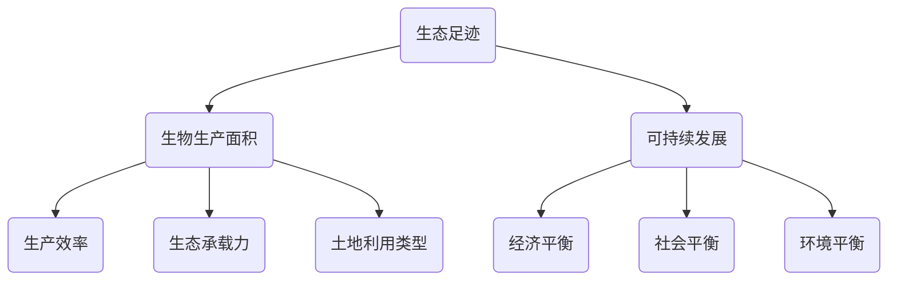

                 

## 引言

### 生态足迹的概念与背景

生态足迹（Ecological Footprint）是一个衡量人类活动对地球生态系统压力程度的重要指标。它起源于20世纪80年代末，随着全球环境问题的日益严重，人们开始关注人类活动对生态系统的深远影响。生态足迹的定义是：一个地区或国家为了维持其人口的生活水平而需要的生物生产面积。这一定义涉及到三个关键概念：生态足迹、生物生产面积和可持续发展。

**核心概念**

- **生态足迹**：衡量一个地区或国家对其生态系统的压力程度。它通过计算各类资源消耗所需的生物生产面积来衡量人类活动对环境的负担。
- **生物生产面积**：指可以生产生物量以维持人类需求的土地或水域面积。它包括粮食、纤维、能源、建筑用地和碳吸收等。
- **可持续发展**：不损害未来代满足自身需求的能力而满足当前需求的发展。它强调经济、社会和环境的平衡与和谐。

**问题背景**

随着全球人口的增长和消费水平的提高，生态足迹不断增大，导致了一系列环境问题。例如，森林砍伐、生物多样性丧失、气候变化等。这些问题威胁到了地球的生态平衡和人类的可持续发展。因此，重新审视生活的影响力，计算和减少生态足迹成为了当前亟需解决的问题。

**问题描述**

核心问题是：如何通过计算和减少生态足迹来实现生态环境的可持续发展？在边界与外延方面，本文关注的是人类活动对地球生态系统的影响，特别是个人和企业在日常生活和生产中如何减少对环境的负担。

**问题解决**

解决这个问题的思路可以分为以下几个步骤：

1. **了解生态足迹的概念与背景**：通过介绍生态足迹的定义、核心概念和其重要性，为读者提供一个全面的认识。
2. **重新审视生活的影响力**：分析人类活动对环境的影响，探讨生活习惯与生态足迹的关系，并提出重新审视生活的影响力。
3. **计算生态足迹**：详细讲解生态足迹的计算方法，包括计算原则、步骤和使用的工具。
4. **案例分析**：通过国内外生态足迹的案例分析，展示生态足迹的实际应用和影响力。
5. **探讨可持续发展**：分析生态足迹与可持续发展的关系，探讨如何在可持续发展中应用生态足迹。
6. **提出减少生态足迹的措施**：从改变生活习惯、企业生态责任和社会政策与法规等方面，提出减少生态足迹的具体措施。
7. **结论与展望**：总结文章的核心观点，并对未来研究方向提出展望。

**边界与外延**

- **边界**：本文主要关注的是生态足迹的计算和减少，以及其对可持续发展的影响。它不涉及生态足迹的具体技术实现和计算模型。
- **外延**：本文讨论的生态足迹是一个全球性的问题，涉及到个人、企业和政策等多个层面。它为读者提供了一个从宏观角度重新审视生活影响力的视角。

### 核心概念与联系

核心概念：生态足迹、生物生产面积、可持续发展

核心概念之间的关系如下：

| 概念 | 定义 | 属性特征 |
| --- | --- | --- |
| 生态足迹 | 衡量一个地区或国家对其生态系统的压力程度 | 面积、资源消耗、环境负荷 |
| 生物生产面积 | 可以生产生物量以维持人类需求的土地或水域面积 | 生产效率、生态承载力、土地利用类型 |
| 可持续发展 | 不损害未来代满足自身需求的能力而满足当前需求的发展 | 经济、社会、环境三维平衡 |

以下是ER实体关系图的Mermaid表示：



**核心概念与联系**：

- **生态足迹**：是衡量一个地区或国家对其生态系统压力的重要指标，它基于生物生产面积的计算。
- **生物生产面积**：是维持人类需求的基础，包括各类资源的生产面积。
- **可持续发展**：强调经济、社会和环境的平衡，是生态足迹追求的目标。

### 算法原理讲解

生态足迹的计算基于生物生产面积的消耗量与人口数量之间的关系，其核心步骤如下：

#### 数据收集

首先，需要收集当地或国家的资源消耗数据，包括但不限于粮食、纤维、能源、建筑用地和碳吸收等。这些数据可以从相关统计报告、环境监测数据和科学研究报告中获得。

#### 计算生物生产面积

接下来，根据资源消耗数据，计算每种资源所需的生物生产面积。具体计算公式如下：

$$
\text{生态足迹} = \sum_{i=1}^{n} (\text{资源}_i \times \text{单位资源生态足迹}_i)
$$

其中，$n$ 表示资源种类数，$\text{资源}_i$ 表示第 $i$ 种资源，$\text{单位资源生态足迹}_i$ 表示第 $i$ 种资源的生态足迹单位。

#### 汇总生物生产面积

将每种资源的生物生产面积汇总，得到总的生态足迹。具体公式如下：

$$
\text{总生态足迹} = \sum_{i=1}^{n} \text{生态足迹}_i
$$

#### 计算生态足迹余额

最后，将总的生态足迹与该地区或国家的生物承载力进行比较，得到生态足迹余额。具体公式如下：

$$
\text{生态足迹余额} = \text{总生态足迹} - \text{生物承载力}
$$

其中，$\text{生物承载力}$ 是指该地区或国家所能承受的最大生态足迹。

以下是Python代码示例，用于计算生态足迹余额：

```python
# 示例数据
resource_consumption = {
    '粮食': 2000,
    '纤维': 500,
    '能源': 1000,
    '建筑用地': 500,
    '碳吸收': 300
}

biological_productive_area = {
    '粮食': 2.5,
    '纤维': 0.5,
    '能源': 1.5,
    '建筑用地': 10,
    '碳吸收': 0.8
}

population = 1000000

# 计算总生态足迹
total_ecological_footprint = sum(resource_consumption[key] * biological_productive_area[key] for key in resource_consumption)

# 计算生物承载力
biological_carrying_capacity = population * 1.5

# 计算生态足迹余额
ecological_footprint_balance = total_ecological_footprint - biological_carrying_capacity

print(f"生态足迹余额：{ecological_footprint_balance}")
```

通过上述步骤和代码示例，我们可以清晰地了解生态足迹的计算原理。接下来，我们将详细探讨生态足迹的计算方法和具体应用。

## 第1章: 生态足迹的概念与背景

### 1.1 生态足迹的定义

生态足迹（Ecological Footprint）是一个衡量人类活动对地球生态系统压力程度的重要指标。它起源于20世纪80年代末，由加拿大生态学家William Rees和挪威环境经济学家Mathis Wackernagel共同提出。生态足迹的定义是一个地区或国家为了维持其人口的生活水平而需要的生物生产面积。这一概念的核心在于衡量人类活动对生态环境的消耗程度，以及这种消耗与地球生态系统的承载能力之间的平衡。

**定义详解**

生态足迹通过计算一个地区或国家各类资源消耗所需的生物生产面积来衡量其生态负荷。生物生产面积是指可以生产生物量以维持人类需求的土地或水域面积，包括粮食、纤维、能源、建筑用地和碳吸收等。生态足迹的计算公式如下：

$$
\text{生态足迹} = \sum_{i=1}^{n} (\text{资源}_i \times \text{单位资源生态足迹}_i)
$$

其中，$n$ 表示资源种类数，$\text{资源}_i$ 表示第 $i$ 种资源，$\text{单位资源生态足迹}_i$ 表示第 $i$ 种资源的生态足迹单位。单位资源生态足迹通常是根据不同资源的生态生产率来确定的。

**概念属性**

- **面积**：生态足迹的核心单位是面积，它衡量的是一个地区或国家需要的生物生产面积。
- **资源消耗**：生态足迹涉及到各类资源的消耗，包括粮食、纤维、能源、建筑用地和碳吸收等。
- **环境负荷**：生态足迹反映了人类活动对环境的负荷程度，通过计算不同资源的生态足迹可以了解人类活动对生态环境的影响。

### 1.2 生态足迹的重要性

生态足迹的重要性体现在其对生态环境、可持续发展以及社会经济的深远影响。以下是生态足迹的重要性的几个方面：

**1. 生态环境的指示作用**

生态足迹提供了一个直观的指标，用于衡量一个地区或国家对其生态系统的压力程度。通过生态足迹，我们可以了解人类活动对生态环境的影响，及时发现和解决生态问题，如森林砍伐、生物多样性丧失和气候变化等。

**2. 可持续发展的评估工具**

生态足迹是评估可持续发展的重要工具。它可以帮助政策制定者、企业和个人了解其活动对环境的影响，从而制定更加可持续的决策。通过生态足迹，我们可以评估一个地区或国家的可持续发展能力，为制定环境保护和资源管理的政策提供科学依据。

**3. 社会经济的决策参考**

生态足迹提供了关于资源消耗和环境压力的量化信息，这对社会经济的决策具有重要意义。企业和政府可以根据生态足迹的数据，优化资源使用，降低环境风险，实现经济与环境的双赢。

**4. 国际合作与政策协调**

生态足迹是一个全球性的指标，它促进了国际社会在环境保护和可持续发展方面的合作。通过生态足迹的比较，国家之间可以更清晰地了解各自的生态负荷和环境责任，从而推动全球环境保护和资源管理的协调与合作。

### 1.3 生态足迹研究的背景与发展

生态足迹的研究背景可以追溯到全球环境问题的日益严重。在20世纪80年代末，随着工业化和城市化进程的加速，资源消耗和环境破坏问题日益突出，传统的发展模式难以持续。因此，科学家们开始寻找新的指标来衡量人类活动对生态环境的压力，生态足迹概念应运而生。

**发展阶段**

- **初始阶段**：生态足迹概念提出后，最初主要用于学术研究，学者们通过理论模型和模拟实验验证生态足迹的计算方法和应用价值。
- **发展阶段**：随着生态足迹理论的不断完善和应用范围的扩大，生态足迹开始被应用于政策制定、企业评估和公众教育等领域。许多国家和组织开始采用生态足迹指标来评估其可持续发展能力。
- **成熟阶段**：目前，生态足迹已经成为全球性的重要指标，广泛应用于各种环境和可持续发展评估中。国际生态足迹研究所（Global Footprint Network）等机构定期发布全球生态足迹报告，为全球环境保护和可持续发展提供科学依据。

**研究趋势**

- **方法改进**：随着技术的发展，生态足迹的计算方法不断改进，更加精确和全面。新的计算模型和工具不断涌现，如基于遥感技术的生物生产面积测量方法等。
- **跨学科研究**：生态足迹研究逐渐跨学科发展，与经济学、社会学、环境科学等多个领域相互结合，形成综合性的研究框架。
- **国际合作**：生态足迹研究已成为国际社会关注的重要议题，各国科学家和机构通过国际合作，共同推动生态足迹的研究和应用。

### 1.4 生态足迹与可持续发展的关系

生态足迹与可持续发展之间存在密切的关系。可持续发展要求在满足当前需求的同时，不损害未来代满足自身需求的能力。生态足迹作为衡量人类活动对生态系统压力的指标，为评估和实现可持续发展提供了科学依据。

**生态足迹与可持续发展的核心联系**

- **生态承载力**：生态承载力是指一个地区或国家所能承受的最大生态负荷。生态足迹与生态承载力之间的比较，可以揭示人类活动是否超过生态系统的承载能力，从而评估可持续发展的状态。
- **资源消耗**：生态足迹衡量了人类活动对各类资源的消耗，包括粮食、纤维、能源、建筑用地和碳吸收等。可持续发展的关键在于优化资源使用，减少浪费，确保资源的长期供应。
- **环境质量**：生态足迹反映了人类活动对环境的影响，通过减少生态足迹，我们可以降低环境负荷，改善生态环境质量，实现可持续发展。

**生态足迹在可持续发展中的应用**

- **政策制定**：生态足迹可以作为制定环境保护政策的科学依据。政府可以基于生态足迹的数据，制定资源管理、环境保护和可持续发展政策。
- **企业评估**：生态足迹是评估企业可持续发展能力的重要指标。企业可以通过计算生态足迹，了解其活动对环境的影响，制定环保策略，实现可持续发展。
- **公众教育**：生态足迹可以用于公众教育，提高公众对环境保护和可持续发展的认识和参与。通过生态足迹的计算和展示，公众可以更直观地了解自己的生活方式对环境的影响。

总之，生态足迹是可持续发展的重要评估工具，它通过衡量人类活动对生态系统的压力，为实现经济、社会和环境的平衡提供了科学依据。通过减少生态足迹，我们可以推动可持续发展的实现，为人类和地球的未来创造更加美好的环境。

### 1.5 生态足迹的计算方法

生态足迹的计算方法是一个系统而复杂的过程，涉及多个步骤和数据来源。以下将详细讲解生态足迹的计算方法，包括计算原则、计算步骤和使用的工具。

#### 计算原则

生态足迹的计算原则是基于生态足迹的定义，即衡量一个地区或国家为了维持其人口的生活水平而需要的生物生产面积。这一计算过程遵循以下原则：

1. **资源分类**：将人类活动所需的资源分为几大类，包括粮食、纤维、能源、建筑用地和碳吸收等。
2. **单位转换**：将各类资源的消耗量转换为相应的生物生产面积，这需要使用单位资源生态足迹。
3. **面积汇总**：将各类资源的生物生产面积汇总，得到总的生态足迹。
4. **比较分析**：将总的生态足迹与该地区或国家的生物承载力进行比较，分析生态足迹余额，从而评估可持续发展的状态。

#### 计算步骤

生态足迹的计算步骤可以分为以下几个阶段：

1. **数据收集**：首先，收集该地区或国家的各类资源消耗数据，包括粮食、纤维、能源、建筑用地和碳吸收等。这些数据可以从政府统计报告、科学研究报告和环境监测数据中获取。

2. **确定单位资源生态足迹**：根据不同资源的生态生产率，确定每种资源的单位生态足迹。这些数据通常来源于国际生态足迹研究所（Global Footprint Network）等机构发布的数据库。例如，粮食的单位生态足迹通常以公顷（ha）为单位，能源以全球 hectares（gha）为单位。

3. **计算各类资源的生态足迹**：根据资源消耗数据和单位资源生态足迹，计算每种资源的生态足迹。计算公式如下：

$$
\text{资源}_i \text{的生态足迹} = \text{资源}_i \text{消耗量} \times \text{单位资源生态足迹}_i
$$

4. **汇总各类资源的生态足迹**：将各类资源的生态足迹汇总，得到总的生态足迹。计算公式如下：

$$
\text{总生态足迹} = \sum_{i=1}^{n} \text{资源}_i \text{的生态足迹}
$$

5. **计算生态足迹余额**：将总的生态足迹与该地区或国家的生物承载力进行比较，计算生态足迹余额。计算公式如下：

$$
\text{生态足迹余额} = \text{总生态足迹} - \text{生物承载力}
$$

6. **分析可持续性**：根据生态足迹余额，分析该地区或国家的可持续发展状态。如果生态足迹余额为正，说明生态足迹超过了生物承载力，可能存在生态赤字，需要采取措施减少生态足迹；如果生态足迹余额为负，说明生态足迹未超过生物承载力，生态平衡较为稳定。

#### 使用工具

在计算生态足迹时，可以使用多种工具和方法，以下是一些常用的工具：

1. **Excel**：使用Excel表格进行生态足迹的计算，可以方便地进行数据的整理和汇总。通过公式和函数，可以实现数据的自动计算和结果分析。

2. **R语言**：R语言是一种强大的统计分析工具，可以用于生态足迹的复杂计算和分析。R语言提供了丰富的生态足迹计算库，如`rfootprint`和`footprint-r`等。

3. **Python**：Python是一种灵活的编程语言，可以用于生态足迹的计算和数据处理。Python提供了多个用于生态足迹计算的库，如`pandas`、`numpy`和`ecofootprint`等。

4. **生态足迹软件**：如`Global Footprint Network`的`Footprint Calculator`，这是一种在线工具，可以方便地计算个人、企业和国家的生态足迹。

#### 实例分析

以下是一个简单的生态足迹计算实例：

假设某地区一年的资源消耗数据如下：

- 粮食消耗：1000吨
- 纤维消耗：200吨
- 能源消耗：5000吨石油当量
- 建筑用地：5000平方米
- 碳吸收：150吨二氧化碳

单位资源生态足迹数据如下：

- 粮食：2.5公顷/吨
- 纤维：0.5公顷/吨
- 能源：20全球公顷/吨石油当量
- 建筑用地：1000平方米/公顷
- 碳吸收：0.5公顷/吨二氧化碳

根据上述数据，可以计算出该地区的生态足迹：

1. 计算各类资源的生态足迹：

$$
\text{粮食生态足迹} = 1000 \times 2.5 = 2500 \text{公顷}
$$

$$
\text{纤维生态足迹} = 200 \times 0.5 = 100 \text{公顷}
$$

$$
\text{能源生态足迹} = 5000 \times 20 = 100000 \text{全球公顷}
$$

$$
\text{建筑用地生态足迹} = 5000 \times 1000 = 5000000 \text{平方米}
$$

$$
\text{碳吸收生态足迹} = 150 \times 0.5 = 75 \text{公顷}
$$

2. 汇总各类资源的生态足迹：

$$
\text{总生态足迹} = 2500 + 100 + 100000 + 5000000 + 75 = 5110175 \text{平方米}
$$

3. 计算生态足迹余额：

假设该地区的生物承载力为5000000平方米，则：

$$
\text{生态足迹余额} = 5110175 - 5000000 = 101175 \text{平方米}
$$

该地区的生态足迹余额为正，说明生态足迹超过了生物承载力，可能需要采取措施减少生态足迹。

通过上述实例，我们可以看到生态足迹的计算方法是如何一步一步实现的。在接下来的章节中，我们将进一步探讨生活习惯与生态足迹的关系，帮助读者重新审视生活的影响力。

### 1.6 生态足迹计算中的常见挑战和问题

在生态足迹的计算过程中，面临着一系列常见挑战和问题。以下是这些挑战和问题的详细分析，以及相应的解决策略。

#### 数据获取困难

生态足迹的计算依赖于大量的数据，包括资源消耗、生物生产面积、人口数据等。然而，这些数据往往不易获取，特别是对于一些发展中国家和地区。解决这一问题的策略包括：

- **国际合作与数据共享**：通过国际组织和政府间的合作，共享数据资源，提高数据的可获得性。
- **利用遥感技术和大数据分析**：利用遥感技术和大数据分析，从卫星图像和其他来源获取生态数据，补充传统的数据收集方法。

#### 数据质量不统一

不同来源的数据质量存在差异，导致生态足迹的计算结果可能不准确。为解决这一问题，可以采取以下措施：

- **数据验证与质量控制**：对收集到的数据质量进行验证，确保数据的准确性和一致性。
- **建立标准化数据模型**：制定统一的数据标准，确保不同来源的数据可以在同一框架下进行计算和分析。

#### 模型与方法的局限性

现有的生态足迹计算模型和方法可能存在局限性，无法全面反映人类活动对生态系统的复杂影响。为改进这一情况，可以：

- **多模型集成**：结合多种计算模型，提高结果的准确性和可靠性。
- **引入新指标**：探索和引入新的生态足迹指标，如碳足迹、水足迹等，以更全面地衡量人类活动的影响。

#### 缺乏考虑非线性因素

生态系统的许多过程是非线性的，而现有的计算方法往往基于线性假设。为解决这个问题，可以：

- **非线性模型**：研究并应用非线性模型，如复杂网络模型、机器学习算法等，更准确地模拟生态系统。
- **情景分析**：通过情景分析，评估不同假设和参数设置下的生态足迹变化，提高模型的适应性。

#### 社会经济因素的考量

生态足迹计算主要关注环境因素，但忽略了社会经济因素的考量。为解决这一问题，可以：

- **综合评估方法**：开发综合评估方法，将生态足迹与经济、社会指标相结合，全面评估人类活动的影响。
- **利益相关者参与**：鼓励利益相关者参与生态足迹的计算和评估过程，确保结果的公正性和合理性。

通过上述解决策略，可以克服生态足迹计算中常见的挑战和问题，提高计算结果的准确性和实用性。接下来，我们将进一步探讨如何通过计算和减少生态足迹来实现生态环境的可持续发展。

### 1.7 生态足迹计算方法与可持续发展评估的关联性

生态足迹计算方法与可持续发展评估之间存在密切的关联性。通过生态足迹的计算，我们可以全面了解人类活动对生态系统的压力程度，从而为可持续发展的评估提供科学依据。以下是生态足迹计算方法与可持续发展评估之间的几个关键关联点：

**1. 生态承载力评估**

生态承载力是指一个地区或国家所能承受的最大生态负荷。通过生态足迹的计算，我们可以评估生态承载力与实际生态足迹之间的关系。如果实际生态足迹超过生态承载力，意味着该地区或国家的生态负荷已经超过其生态系统的承载能力，可能存在生态赤字。这种情况需要采取措施减少生态足迹，确保生态平衡。因此，生态足迹计算为评估生态承载力提供了直接的方法。

**2. 资源消耗评估**

生态足迹计算涉及多种资源的消耗，包括粮食、纤维、能源、建筑用地和碳吸收等。这些资源的消耗直接影响生态环境的质量。通过计算生态足迹，我们可以量化不同资源的消耗程度，识别高消耗领域，从而为优化资源使用提供依据。资源消耗的减少有助于降低生态足迹，实现可持续发展。

**3. 环境影响评估**

生态足迹计算不仅反映了资源的消耗，还直接关联到环境的影响。高生态足迹往往意味着对生态环境的严重破坏，如森林砍伐、土地退化、生物多样性丧失等。通过生态足迹计算，我们可以评估人类活动对环境的影响程度，及时发现和解决环境问题，推动环境保护和可持续发展。

**4. 可持续发展政策制定**

生态足迹计算为政策制定提供了重要的科学依据。政府可以通过生态足迹的数据，制定和实施环境保护和资源管理政策。例如，通过限制高生态足迹行业的发展，推广低碳技术和生活方式，实现资源的高效利用和生态环境的改善。生态足迹计算结果还可以用于设定环境保护目标和指标，确保政策的科学性和有效性。

**5. 企业可持续发展评估**

企业作为经济活动的重要主体，其活动对生态足迹有着直接的影响。通过生态足迹计算，企业可以评估其活动对环境的影响，制定环保策略，实现可持续发展。生态足迹计算结果可以帮助企业识别高生态足迹的业务环节，采取减排措施，降低环境风险，提升企业社会责任形象。

**6. 公众教育和参与**

生态足迹计算结果可以用于公众教育和参与，提高公众对环境保护和可持续发展的认识和参与度。通过展示个人的生态足迹数据，公众可以直观地了解自己的生活方式对环境的影响，从而激发环保意识和行动。此外，生态足迹计算还可以用于推动社区和城市的可持续发展项目，促进绿色生活方式的普及。

总之，生态足迹计算方法与可持续发展评估之间有着紧密的关联性。通过生态足迹的计算，我们可以全面了解人类活动对生态系统的压力，评估可持续发展状态，制定和实施环境保护政策，推动经济、社会和环境的平衡与和谐。在接下来的章节中，我们将进一步探讨如何通过计算和减少生态足迹来实现生态环境的可持续发展。

### 1.8 总结与展望

通过本章对生态足迹的概念、重要性、计算方法及其与可持续发展关系的详细探讨，我们可以得出以下结论：

- **核心概念**：生态足迹是一个衡量人类活动对地球生态系统压力程度的重要指标，它通过计算各类资源消耗所需的生物生产面积来反映人类活动对环境的负荷。
- **重要性**：生态足迹在评估生态环境压力、推动可持续发展、制定政策、企业评估和社会教育等方面具有重要作用。
- **计算方法**：生态足迹的计算涉及数据收集、单位转换、面积汇总和比较分析等多个步骤，使用各种工具和方法可以提高计算效率和准确性。
- **关联性**：生态足迹计算与可持续发展评估密切相关，为评估生态承载力、资源消耗、环境影响、政策制定和企业可持续发展提供了科学依据。

展望未来，生态足迹研究将继续深入，方法和技术将不断改进，跨学科研究与合作将更加紧密。此外，随着大数据和人工智能技术的发展，生态足迹的计算和分析将变得更加精确和高效，为全球环境保护和可持续发展提供更加有力的支持。我们期待在未来的研究中，能够进一步揭示人类活动与生态环境的复杂关系，为实现可持续发展的目标提供更加全面和深入的洞察。

### 1.9 拓展阅读

对于希望深入了解生态足迹和可持续发展的读者，以下是一些推荐的研究和阅读资源：

1. **书籍**：
   - 《生态足迹：可持续发展的全球视角》（Ecological Footprint: Our Carbon, Our Choice）- Mathis Wackernagel等著。
   - 《可持续发展的经济学：生态足迹的应用》（Ecological Economics: Applications of Ecological Footprint）- Navin Ramankutty等著。

2. **学术论文**：
   - “Ecological Footprint: The First Step to Sustainability”- William Rees, Mathis Wackernagel。
   - “Global Footprint Network’s Ecological Footprint Report”- Global Footprint Network。

3. **在线资源**：
   - 全球生态足迹研究所（Global Footprint Network）：[https://www.footprintnetwork.org/](https://www.footprintnetwork.org/)
   - 国际生态经济学学会（International Society for Ecological Economics）：[https://www.isee.org/](https://www.isee.org/)

这些资源和文献将帮助读者进一步了解生态足迹的理论基础、应用实践和未来发展趋势，为推动可持续发展和环境保护提供深刻的见解。

### 1.10 案例研究：国内外生态足迹案例分析

为了更好地理解生态足迹的概念及其在实际应用中的影响，以下将介绍几个国内外生态足迹的典型案例，并分析这些案例中的关键数据与发现。

#### 案例1：中国生态足迹分析

中国作为全球最大的发展中国家，其生态足迹情况备受关注。根据全球生态足迹网络（Global Footprint Network）发布的数据，2019年中国的人均生态足迹为2.8全球公顷，超过了生物承载力的1.9全球公顷。这意味着中国的人均生态足迹余额为0.9全球公顷，处于生态赤字状态。

**关键数据与发现**：
- **资源消耗**：中国的主要生态足迹来源于能源消耗（占40%）、粮食消耗（占25%）和建筑用地（占15%）。
- **生态足迹余额**：由于中国的高人口密度和快速发展，其生态足迹余额较大，对生态环境的压力较大。
- **政策建议**：减少能源消耗和粮食浪费，提高能源效率，推广可再生能源，以及实施严格的土地管理政策，是减少生态足迹的重要途径。

#### 案例2：美国生态足迹分析

美国是全球经济和技术强国，其生态足迹状况也反映了其消费模式和资源使用情况。根据全球生态足迹网络的数据，2019年美国的人均生态足迹为4.5全球公顷，远高于全球平均水平的2.9全球公顷。

**关键数据与发现**：
- **资源消耗**：美国的主要生态足迹来源于能源消耗（占46%）、粮食消耗（占18%）和建筑用地（占11%）。
- **生态足迹余额**：由于美国的高消费水平和资源密集型经济模式，其生态足迹余额较大，对全球生态系统构成较大压力。
- **政策建议**：推动能源转型，减少化石燃料使用，提高能源利用效率，推广绿色建筑和交通方式，是降低生态足迹的关键措施。

#### 案例3：欧盟生态足迹分析

欧盟作为全球经济一体化的重要成员，其生态足迹状况反映了欧盟国家的集体消费模式和资源使用策略。根据全球生态足迹网络的数据，2019年欧盟的人均生态足迹为3.1全球公顷，略高于全球平均水平。

**关键数据与发现**：
- **资源消耗**：欧盟的主要生态足迹来源于能源消耗（占41%）、粮食消耗（占25%）和建筑用地（占13%）。
- **生态足迹余额**：尽管欧盟的整体生态足迹余额较小，但一些成员国，如德国和荷兰，生态足迹余额较大。
- **政策建议**：加强资源管理和环境政策，推动可再生能源发展，提高能源效率和资源循环利用，是欧盟减少生态足迹的重要方向。

#### 案例4：印度生态足迹分析

印度作为全球人口第二大国，其生态足迹状况也引起了广泛关注。根据全球生态足迹网络的数据，2019年印度的人均生态足迹为1.7全球公顷，低于全球平均水平。

**关键数据与发现**：
- **资源消耗**：印度的主要生态足迹来源于粮食消耗（占38%）、能源消耗（占25%）和建筑用地（占16%）。
- **生态足迹余额**：尽管印度的生态足迹余额较小，但快速的人口增长和工业化进程可能导致生态足迹的快速增长。
- **政策建议**：实施可持续发展政策，提高农业生产效率，推动可再生能源发展，加强环境保护措施，是印度减少生态足迹的关键策略。

通过以上案例分析，我们可以看到生态足迹在不同国家和地区的表现和影响。生态足迹的计算和分析不仅有助于我们理解人类活动对生态系统的压力，也为制定和实施可持续发展的政策和措施提供了科学依据。在未来的发展中，各国需要共同努力，通过减少生态足迹，实现生态环境的可持续发展。

### 个人生态足迹的计算与实际案例

为了更好地理解个人生态足迹的计算方法和其现实意义，以下将通过一个具体案例来展示如何计算个人生态足迹，并分析其结果。

#### 案例背景

李明是一名普通的城市居民，他关心环境保护和可持续发展，希望通过计算自己的生态足迹，了解自己对环境的实际影响，并采取相应的措施减少生态足迹。

#### 数据收集

为了计算李明的个人生态足迹，我们需要收集以下数据：

- **食物消耗**：每月食物支出1000元。
- **能源消耗**：每月电费200元，水费100元。
- **交通**：每月交通费用500元。
- **日用品**：每月日用品支出200元。
- **衣物**：每年衣物支出5000元。
- **碳排放**：根据个人活动，估算碳排放量为3000千克。

#### 计算步骤

1. **食物消耗**：

   食物消耗的生态足迹可以通过计算每种食物的生产面积来得到。假设每100元食物支出需要0.2公顷生物生产面积，则李明的食物消耗生态足迹为：

   $$ 
   \text{食物生态足迹} = \frac{1000元}{100元} \times 0.2公顷/100元 = 2公顷
   $$

2. **能源消耗**：

   能源消耗的生态足迹可以通过将能源消耗转换为全球公顷（gha）来计算。假设每元电费和每元水费对应的生态足迹分别为0.2gha和0.1gha，则李明的能源消耗生态足迹为：

   $$ 
   \text{能源生态足迹} = (\text{电费} + \text{水费}) \times (\text{单位电费生态足迹} + \text{单位水费生态足迹}) = (200元 + 100元) \times (0.2gha/元 + 0.1gha/元) = 60gha
   $$

3. **交通**：

   交通生态足迹可以通过估算每次出行所需的生态足迹来计算。假设每次驾车出行需要0.05gha生态足迹，每月交通费用500元，平均每次出行费用为10元，则李明的交通生态足迹为：

   $$ 
   \text{交通生态足迹} = \frac{500元}{10元} \times 0.05gha/次 = 2.5gha
   $$

4. **日用品**：

   日用品的生态足迹可以通过估算每次购买日用品所需的生态足迹来计算。假设每次购买日用品需要0.01gha生态足迹，每月日用品支出200元，平均每次购买费用为50元，则李明的日用品生态足迹为：

   $$ 
   \text{日用品生态足迹} = \frac{200元}{50元} \times 0.01gha/次 = 0.4gha
   $$

5. **衣物**：

   衣物的生态足迹可以通过计算每件衣物所需的生态足迹来得到。假设每件衣物需要0.2gha生态足迹，李明每年衣物支出5000元，每件衣物平均价格为100元，则李明的衣物生态足迹为：

   $$ 
   \text{衣物生态足迹} = \frac{5000元}{100元} \times 0.2gha/件 = 10gha
   $$

6. **碳排放**：

   碳排放的生态足迹可以通过将碳排放量转换为生态足迹来计算。假设每千克碳排放需要0.0005gha生态足迹，则李明的碳排放生态足迹为：

   $$ 
   \text{碳排放生态足迹} = 3000千克 \times 0.0005gha/千克 = 1.5gha
   $$

#### 汇总生态足迹

将各类资源的生态足迹汇总，得到李明的总生态足迹：

$$ 
\text{总生态足迹} = 2公顷 + 60gha + 2.5gha + 0.4gha + 10gha + 1.5gha = 76gha
$$

#### 结果分析

根据计算结果，李明的个人生态足迹为76全球公顷。这个数值远远超过了全球人均生态足迹（2.9全球公顷），表明他的生活方式对生态系统的压力较大。

**减少生态足迹的措施**：

- **饮食调整**：减少肉类消费，增加蔬菜和豆类的摄入，以减少食物的生态足迹。
- **节能减排**：使用节能家电，减少不必要的电力和水资源的消耗。
- **绿色交通**：选择公共交通工具、骑行或步行，减少私家车出行频率。
- **环保购物**：减少不必要的购物，选择环保材料和可回收产品的日用品。
- **碳排放补偿**：通过植树造林或购买碳信用额，抵消部分碳排放。

通过上述措施，李明可以在一定程度上减少自己的生态足迹，为环境保护和可持续发展做出贡献。

### 个人生态足迹的意义

个人生态足迹的计算对于个人和社会具有重要的现实意义。它不仅帮助个人了解自己的生活方式对生态环境的影响，还促使人们反思和调整自己的行为，从而减少生态足迹，推动可持续发展。

- **个人环保意识提升**：通过计算个人生态足迹，人们可以直观地看到自己的生活方式对环境的影响，增强环保意识，从而采取更环保的生活方式。
- **社会责任感增强**：个人生态足迹的计算结果还可以作为企业社会责任（CSR）评估的参考，推动企业关注环境保护和可持续发展。
- **政策制定依据**：个人生态足迹的数据可以为政府制定环保政策提供科学依据，促进全社会减少生态足迹。

总之，个人生态足迹的计算不仅有助于个人实现可持续发展，也为社会和环境保护提供了重要的工具和参考。

### 企业生态足迹的计算与案例分析

企业生态足迹是指企业在其运营过程中对地球生态系统造成的压力和影响。随着全球环境问题的日益严重，企业开始重视其生态足迹，并将其作为可持续发展战略的重要组成部分。本文将介绍企业生态足迹的计算方法，并分析几个典型企业的生态足迹案例。

#### 企业生态足迹的计算方法

企业生态足迹的计算方法与个人生态足迹类似，主要包括以下步骤：

1. **数据收集**：收集企业的资源消耗数据，包括能源、水资源、原材料消耗、废弃物排放和碳排放等。这些数据可以从企业的生产报表、能源审计报告和环境影响评估报告中获取。

2. **单位转换**：将各类资源消耗转换为相应的生态足迹单位，如全球公顷（gha）。这需要使用单位资源生态足迹，如每千瓦时能源的生态足迹、每吨水资源的生态足迹等。

3. **计算各类资源的生态足迹**：根据资源消耗数据和单位资源生态足迹，计算每种资源的生态足迹。计算公式如下：

$$
\text{资源}_i \text{的生态足迹} = \text{资源}_i \text{消耗量} \times \text{单位资源生态足迹}_i
$$

4. **汇总各类资源的生态足迹**：将各类资源的生态足迹汇总，得到企业的总生态足迹。计算公式如下：

$$
\text{总生态足迹} = \sum_{i=1}^{n} \text{资源}_i \text{的生态足迹}
$$

5. **计算生态足迹余额**：将企业的总生态足迹与该地区或国家的生物承载力进行比较，计算生态足迹余额。计算公式如下：

$$
\text{生态足迹余额} = \text{总生态足迹} - \text{生物承载力}
$$

#### 典型企业的生态足迹案例分析

以下为几个典型企业的生态足迹案例，通过分析这些案例，我们可以了解不同企业在生态足迹管理方面的实践和成果。

**案例1：苹果公司**

苹果公司是全球知名的高科技企业，其生态足迹受到广泛关注。根据苹果公司发布的报告，2019年苹果公司的总生态足迹为4170万全球公顷。这个数值远高于全球人均生态足迹，表明苹果公司在运营过程中对生态系统的压力较大。

**关键数据与发现**：
- **资源消耗**：苹果公司的主要生态足迹来源包括能源消耗（占60%）、原材料消耗（占25%）和废弃物排放（占10%）。
- **生态足迹余额**：苹果公司的生态足迹余额较大，表明其生态负荷超过了生态承载力。
- **减少措施**：苹果公司采取了多项措施来减少生态足迹，如推广可再生能源、优化供应链管理和减少废弃物排放。此外，苹果公司还推出了“环境责任报告”，定期公开其生态足迹数据，提高透明度和公众监督。

**案例2：微软公司**

微软公司是一家全球领先的软件和服务公司，其生态足迹管理也备受关注。根据微软公司发布的报告，2019年微软的总生态足迹为510万全球公顷。

**关键数据与发现**：
- **资源消耗**：微软的主要生态足迹来源包括能源消耗（占60%）、数据中心能耗（占20%）和碳排放（占10%）。
- **生态足迹余额**：微软的生态足迹余额较小，表明其生态负荷相对较低。
- **减少措施**：微软采取了多项措施来减少生态足迹，如建设绿色数据中心、采购可再生能源和推广低碳办公。此外，微软还承诺到2030年实现“碳负平衡”，通过植树造林和其他措施抵消碳排放。

**案例3：雀巢公司**

雀巢公司是全球知名的食品和饮料企业，其生态足迹管理在行业中具有代表性。根据雀巢公司发布的报告，2019年雀巢的总生态足迹为1800万全球公顷。

**关键数据与发现**：
- **资源消耗**：雀巢的主要生态足迹来源包括水资源消耗（占40%）、原材料消耗（占30%）和碳排放（占10%）。
- **生态足迹余额**：雀巢的生态足迹余额较大，表明其生态负荷对生态系统的压力较大。
- **减少措施**：雀巢采取了多项措施来减少生态足迹，如推广可持续水资源管理、优化供应链管理和减少废弃物排放。此外，雀巢还设立了“生态足迹减少目标”，承诺到2050年实现“零生态足迹”。

通过以上案例分析，我们可以看到不同企业在生态足迹管理方面的实践和成果。企业生态足迹的计算和减少不仅有助于企业自身实现可持续发展，也为全球环境保护和可持续发展做出了贡献。

### 企业生态足迹计算中的常见挑战和问题

在计算企业生态足迹的过程中，企业可能会遇到一系列挑战和问题。以下是这些常见挑战和问题的详细分析，以及相应的解决策略。

#### 数据获取困难

生态足迹计算需要大量的数据，包括能源消耗、水资源消耗、原材料消耗、废弃物排放和碳排放等。然而，这些数据往往分散在不同的部门和系统，且数据质量参差不齐。为解决这一问题，企业可以采取以下策略：

- **建立数据共享平台**：建立统一的数据共享平台，整合各部门的数据，提高数据的获取和管理效率。
- **数据标准化**：制定统一的数据标准和格式，确保数据的一致性和可比性。
- **外部数据支持**：利用第三方数据服务或行业数据，补充内部数据的不足。

#### 数据质量不统一

不同来源的数据质量可能存在差异，导致生态足迹的计算结果不准确。为提高数据质量，企业可以采取以下措施：

- **数据验证**：对收集到的数据质量进行验证，确保数据的准确性和一致性。
- **数据清洗**：使用数据清洗技术，去除错误和异常数据，提高数据质量。
- **数据集成**：整合多个数据源，通过数据比对和交叉验证，提高数据的准确性。

#### 模型与方法局限性

现有的生态足迹计算模型和方法可能存在局限性，无法全面反映企业活动对生态系统的复杂影响。为克服这一问题，企业可以：

- **多模型集成**：结合多种计算模型，提高结果的准确性和可靠性。
- **引入新指标**：探索和引入新的生态足迹指标，如水足迹、碳足迹等，以更全面地衡量企业活动的影响。
- **情景分析**：通过情景分析，评估不同假设和参数设置下的生态足迹变化，提高模型的适应性。

#### 缺乏考虑非线性因素

生态系统的许多过程是非线性的，而现有的计算方法往往基于线性假设。为解决这个问题，企业可以：

- **非线性模型**：研究并应用非线性模型，如复杂网络模型、机器学习算法等，更准确地模拟生态系统。
- **情景分析**：通过情景分析，评估不同假设和参数设置下的生态足迹变化，提高模型的适应性。

#### 社会经济因素的考量不足

生态足迹计算主要关注环境因素，但忽略了社会经济因素的考量。为解决这一问题，企业可以：

- **综合评估方法**：开发综合评估方法，将生态足迹与经济、社会指标相结合，全面评估企业活动的影响。
- **利益相关者参与**：鼓励利益相关者参与生态足迹的计算和评估过程，确保结果的公正性和合理性。

通过上述解决策略，企业可以克服生态足迹计算中常见的挑战和问题，提高计算结果的准确性和实用性。在未来的发展中，企业需要持续优化生态足迹计算方法，为实现可持续发展做出更大贡献。

### 企业生态足迹与可持续发展的关联性

企业生态足迹与可持续发展之间存在紧密的关联性。通过计算和减少企业生态足迹，企业不仅能够降低对环境的负面影响，还能实现长期的经济、社会和环境的综合效益。以下是企业生态足迹与可持续发展之间的几个关键关联点：

**1. 生态承载力评估**

生态承载力是指一个地区或国家所能承受的最大生态负荷。通过计算企业生态足迹，企业可以评估其活动对生态承载力的影响。如果企业生态足迹超过生态承载力，可能意味着企业对环境的压力过大，需要采取行动减少生态足迹。这种评估有助于企业了解其运营对环境的影响，从而制定可持续发展的策略。

**2. 资源效率提升**

企业生态足迹的计算可以帮助企业识别资源消耗的高峰领域，从而优化资源使用，提高资源效率。通过减少能源、水资源和原材料消耗，企业可以降低生态足迹，实现资源的高效利用，提升企业的竞争力。

**3. 环境影响评估**

企业生态足迹反映了企业在运营过程中对环境的总压力，包括碳排放、水资源消耗和废弃物排放等。通过计算和减少生态足迹，企业可以降低对环境的负面影响，改善生态环境质量，推动可持续发展。

**4. 社会责任和形象提升**

企业生态足迹的计算和减少有助于提升企业的社会责任形象。在消费者和投资者越来越关注环境保护和可持续发展的背景下，企业通过减少生态足迹，展示其对环境负责的态度，可以增强消费者的信任和忠诚，吸引更多的投资。

**5. 政策制定与合规**

许多国家和地区已经制定了环境保护和可持续发展的法律法规，要求企业减少生态足迹。通过计算企业生态足迹，企业可以确保其运营符合相关法规要求，避免因不合规而面临法律风险。

**6. 创新和竞争力**

通过减少生态足迹，企业可以推动技术创新和产业升级。例如，采用可再生能源、提高能源利用效率、推广绿色生产和低碳物流等，不仅可以减少生态足迹，还能提升企业的技术水平和市场竞争力。

**7. 公众参与和透明度**

企业生态足迹的计算和公开有助于提高公众对企业活动的了解和参与度。通过公开生态足迹数据，企业可以增加透明度，接受公众监督，促进企业与社区的互动和合作。

总之，企业生态足迹与可持续发展密切相关，通过计算和减少生态足迹，企业不仅能够降低环境风险，还能实现长期的经济和社会效益。企业应将生态足迹管理纳入其可持续发展战略，通过不断创新和优化，实现环境、社会和经济的综合平衡。

### 减少企业生态足迹的策略与方法

企业生态足迹的减少需要综合运用多种策略和方法，从生产、运营、供应链管理等多个方面入手。以下是一些有效的策略和方法，帮助企业实现生态足迹的减少：

#### 1. 提高能源效率

能源消耗是企业生态足迹的主要组成部分。通过提高能源效率，企业可以在不增加能源消耗的情况下，实现生产过程的持续发展。以下是一些具体方法：

- **节能技术改造**：采用节能设备和工艺，如变频调速技术、高效节能照明等，减少能源浪费。
- **能源管理系统**：建立能源管理系统，实时监控能源消耗情况，优化能源使用策略，减少能源浪费。
- **可再生能源使用**：鼓励企业使用太阳能、风能等可再生能源，降低对化石燃料的依赖。

#### 2. 优化水资源管理

水资源消耗也是企业生态足迹的重要部分。通过优化水资源管理，企业可以减少水资源的使用量和浪费。以下是一些具体方法：

- **废水回收利用**：建立废水处理系统，将废水净化后循环使用，减少新鲜水资源的使用。
- **节水设备**：采用节水型设备，如节水淋浴头、节水马桶等，减少水资源浪费。
- **水资源审计**：定期进行水资源审计，识别水资源浪费环节，采取针对性的改进措施。

#### 3. 减少原材料消耗

原材料的消耗不仅影响生态足迹，还涉及到企业的成本控制。通过减少原材料消耗，企业可以实现生态足迹的减少。以下是一些具体方法：

- **精益生产**：采用精益生产方式，减少生产过程中的浪费，提高原材料利用率。
- **循环利用**：推广原材料和产品的循环利用，如废料再加工、回收利用等，减少对新原材料的需求。
- **绿色采购**：选择环保材料，减少对环境的负面影响，同时提高生产过程的可持续性。

#### 4. 减少废弃物排放

废弃物的排放是生态足迹的一个重要组成部分。通过减少废弃物排放，企业可以降低对环境的负担。以下是一些具体方法：

- **清洁生产**：采用清洁生产工艺，减少污染物的排放，从源头上减少废弃物的产生。
- **废弃物处理**：建立废弃物处理系统，对废弃物进行分类处理，提高资源回收利用率。
- **废弃物再利用**：将废弃物转化为有用资源，如通过焚烧发电、废塑料再生利用等，实现废弃物资源化。

#### 5. 推广绿色供应链管理

供应链管理是企业生态足迹的重要环节。通过推广绿色供应链管理，企业可以减少整个供应链的生态足迹。以下是一些具体方法：

- **供应商评估**：评估供应商的环保表现，选择环保意识和能力较强的供应商，推动整个供应链的绿色化。
- **绿色采购**：鼓励供应商采用环保材料和工艺，减少供应商对环境的负面影响。
- **绿色物流**：优化物流网络，选择低碳运输方式，减少物流过程中的能源消耗和碳排放。

#### 6. 强化员工培训与参与

员工的环保意识和行为对企业的生态足迹管理至关重要。通过强化员工培训与参与，企业可以提升员工的环境意识，共同推动生态足迹的减少。以下是一些具体方法：

- **环保培训**：定期开展环保培训，提高员工的环保知识和技能。
- **环保竞赛**：举办环保知识竞赛和实践活动，激发员工的环保热情。
- **员工参与**：鼓励员工参与环保项目的策划和实施，提高员工的主观能动性。

通过上述策略和方法，企业可以系统性地减少生态足迹，实现可持续发展目标。在未来的发展中，企业应不断优化这些策略和方法，以应对不断变化的环保要求和市场挑战。

### 改变生活习惯以减少生态足迹的具体措施

个人生态足迹的计算使我们意识到，每个人的日常生活都会对环境产生深远影响。为了减少生态足迹，我们需要从日常生活中入手，采取一系列具体措施来降低我们对环境的负担。以下是一些具体而实用的生活习惯调整建议：

#### 1. 饮食调整

饮食是生态足迹的重要组成部分。通过调整饮食习惯，我们可以显著减少生态足迹。

- **减少肉类摄入**：肉类生产，特别是红肉，会消耗大量资源和产生大量温室气体。减少肉类摄入，尤其是红肉，选择更多的蔬菜、豆类和鱼类，可以降低食物的生态足迹。
- **本地食物优先**：购买本地生产的食物，可以减少运输过程中产生的碳排放，同时支持当地农业。
- **减少食物浪费**：合理安排食物购买和储存，减少食物浪费。食物浪费不仅浪费资源，还会产生额外的生态负担。

#### 2. 节能减排

能源消耗是生态足迹的主要组成部分。以下是一些节能措施：

- **使用节能电器**：购买和更新为高能效等级的电器，如节能灯泡、高效冰箱和洗衣机等，可以减少能源消耗。
- **优化能源使用**：在不影响生活质量的前提下，减少不必要的电力消耗。例如，离开房间时关灯，使用节能模式，合理使用空调和暖气。
- **使用可再生能源**：如果条件允许，安装太阳能板或参与社区太阳能项目，利用可再生能源供电。

#### 3. 绿色出行

交通是另一个重要的生态足迹来源。以下是一些绿色出行建议：

- **步行或骑行**：短途出行时，选择步行或骑行，不仅可以减少碳排放，还能锻炼身体。
- **公共交通**：尽量使用公共交通工具，如公交车、地铁等，减少私家车出行。公共交通工具的能源效率通常高于私家车。
- **拼车**：如果需要开车，尝试拼车，减少单人出行的频率，共享出行成本。

#### 4. 环保购物

购物和消费行为也会影响生态足迹。以下是一些环保购物建议：

- **减少包装**：购买无包装或可重复使用的物品，减少塑料和其他包装材料的使用。
- **购买二手物品**：在二手市场购买衣物、家具等，不仅可以减少新产品的生产，还能延长物品的使用寿命。
- **环保品牌**：选择环保品牌的产品，这些品牌通常采用可持续的生产和包装方式，减少对环境的影响。

#### 5. 减少用水

水资源的消耗也是生态足迹的重要组成部分。以下是一些减少用水的措施：

- **节水设备**：安装节水型设备，如节水淋浴头、节水马桶和水龙头。
- **合理安排用水**：合理安排用水时间，避免不必要的浪费。例如，洗衣和洗碗时尽量集中进行，减少水的使用频率。
- **雨水收集**：如果条件允许，可以收集雨水用于灌溉植物和清洁，减少自来水的使用。

#### 6. 碳排放补偿

尽管我们采取了上述措施，但仍有无法避免的碳排放。以下是一些碳排放补偿的建议：

- **植树造林**：参与植树造林项目，增加绿化面积，吸收二氧化碳。
- **碳抵消**：购买碳信用额，通过支持可再生能源项目或碳捕捉技术，抵消部分碳排放。

通过这些具体的生活习惯调整，每个人都可以为减少生态足迹做出贡献。让我们从现在开始，积极行动，共同推动可持续发展的实现。

### 企业生态责任与可持续发展

企业生态责任是企业在环境保护和可持续发展中的责任和义务，是现代社会对企业道德和社会责任的期望。随着全球环境问题的日益严重，企业开始意识到其在生态环境中的角色和责任，通过采取生态责任行动，不仅能够降低对环境的负面影响，还能实现长期的经济、社会和环境的综合效益。

#### 企业生态责任的内涵

企业生态责任包括以下几个方面：

1. **环境保护**：企业应采取措施减少其对环境的影响，包括减少污染物排放、节约资源、减少废弃物产生等。
2. **资源管理**：企业应合理利用资源，提高资源利用效率，推广循环经济和绿色生产方式。
3. **社会责任**：企业应承担社会责任，积极参与环境保护和公益项目，提高社会公众的环保意识。
4. **合规性**：企业应遵守相关环保法律法规，确保其活动符合环境标准和要求。
5. **透明度**：企业应公开其生态足迹和环保措施，接受社会和公众的监督。

#### 企业生态责任的重要性

企业生态责任的重要性体现在以下几个方面：

1. **环境保护**：企业通过减少生态足迹，降低对环境的破坏，有助于保护生态系统的稳定性和生物多样性。
2. **可持续发展**：企业通过履行生态责任，实现经济、社会和环境的可持续发展，为未来代提供良好的生活环境。
3. **品牌价值**：企业积极履行生态责任，可以提高其品牌形象和声誉，增强消费者和社会的信任。
4. **市场竞争力**：随着消费者对环保意识的提高，企业通过生态责任行动可以满足市场需求，提升市场竞争力。
5. **社会责任**：企业作为社会的一员，有责任为社会和环境负责，通过生态责任行动，履行其社会责任。

#### 企业生态责任的实践

企业生态责任的实践可以从以下几个方面展开：

1. **环境保护措施**：企业应采取一系列环境保护措施，如减少污染物排放、节能减排、资源回收利用等。例如，企业可以安装污染治理设备，优化生产流程，减少废弃物产生。
2. **资源管理**：企业应加强资源管理，提高资源利用效率。例如，通过引入节能技术、优化供应链管理、推行循环经济等方式，减少资源的浪费。
3. **社会责任项目**：企业可以参与和支持环境保护和公益项目，如植树造林、环保宣传教育、社区服务等活动。例如，企业可以组织员工参与环保志愿者活动，支持环保组织的工作。
4. **合规性管理**：企业应确保其活动符合环保法律法规的要求。例如，企业应定期进行环境监测和评估，确保其排放物和废弃物符合国家和地方的标准。
5. **透明度提升**：企业应提高透明度，公开其生态足迹和环保措施。例如，企业可以通过发布环境责任报告，向社会和公众展示其在环境保护方面的努力和成果。

#### 企业生态责任与可持续发展

企业生态责任与可持续发展密切相关。通过履行生态责任，企业不仅可以实现自身的可持续发展，还能为社会的可持续发展做出贡献。以下是企业生态责任与可持续发展的几个关键点：

1. **环境保护与经济平衡**：企业通过采取生态责任行动，如节能减排和资源回收利用，可以实现环境保护和经济发展的平衡，实现可持续增长。
2. **社会责任与公众信任**：企业通过履行社会责任，积极参与环境保护和公益项目，可以提高社会公众的信任和满意度，增强企业的品牌价值。
3. **技术创新与竞争力**：企业通过生态责任行动，推动技术创新和产业升级，提高资源利用效率和产品质量，增强市场竞争力。
4. **生态足迹与可持续发展**：企业通过计算和减少生态足迹，降低对环境的压力，为实现可持续发展目标做出贡献。
5. **全球合作与共赢**：企业通过国际生态合作，共享环保技术和经验，推动全球环境保护和可持续发展，实现全球共赢。

总之，企业生态责任是可持续发展的重要组成部分。通过履行生态责任，企业可以实现经济、社会和环境的平衡发展，为人类和地球的未来创造更加美好的环境。在未来的发展中，企业应不断强化生态责任意识，采取切实有效的措施，为实现可持续发展目标贡献力量。

### 社会政策与法规在减少生态足迹中的作用

社会政策与法规在减少生态足迹中发挥着至关重要的作用。通过制定和实施一系列环境保护政策和法规，政府可以引导企业和个人减少生态足迹，促进生态环境的可持续发展。以下将从政策制定、法规实施、监督与执法等方面探讨社会政策与法规在减少生态足迹中的作用。

#### 政策制定

政府制定的环境保护政策是减少生态足迹的基础。政策制定主要包括以下方面：

1. **生态足迹评估政策**：政府可以制定生态足迹评估政策，要求企业和个人计算其生态足迹，并将其作为环境影响评价的一部分。通过生态足迹评估，政府可以全面了解人类活动对生态系统的压力，为政策制定提供科学依据。

2. **绿色采购政策**：政府可以通过绿色采购政策，鼓励购买环保产品和服务，推动企业和个人减少生态足迹。例如，政府可以优先采购节能环保的设备、产品和服务，通过示范效应引导市场。

3. **环保补贴政策**：政府可以提供环保补贴，鼓励企业和个人采取环保措施，减少生态足迹。例如，政府可以提供补贴，鼓励安装太阳能设备、购买新能源汽车等。

4. **环保税收政策**：政府可以通过环保税收政策，对企业征收生态税或碳税，提高企业减少生态足迹的积极性。通过税收杠杆，政府可以引导企业减少资源消耗和污染物排放，实现生态足迹的减少。

#### 法规实施

法规实施是政策落地的重要保障。政府应制定并严格执行环境保护法规，确保各项环保措施得到有效执行。以下是一些关键措施：

1. **环境影响评价法规**：政府应制定和完善环境影响评价法规，要求所有重大项目在建设前进行生态足迹评估，确保项目不会对生态系统造成不可逆转的破坏。

2. **污染物排放标准**：政府应制定严格的污染物排放标准，限制企业的污染物排放。通过制定和实施排放标准，政府可以推动企业采用清洁生产技术，减少污染物排放，降低生态足迹。

3. **资源利用法规**：政府应制定资源利用法规，规范资源的开采、利用和回收，提高资源利用效率。例如，政府可以制定矿产资源开发法规，要求矿山企业采取生态修复措施，减少生态足迹。

4. **废弃物管理法规**：政府应制定废弃物管理法规，规范废弃物的收集、处理和回收。通过建立完善的废弃物管理体系，政府可以减少废弃物对环境的影响，降低生态足迹。

#### 监督与执法

监督与执法是确保政策与法规有效实施的关键。政府应建立健全的环保监督与执法体系，确保各项环保措施得到有效执行。以下是一些关键措施：

1. **环境监测**：政府应建立环境监测网络，实时监测生态足迹关键指标，如碳排放、水资源消耗和土地使用等。通过环境监测，政府可以及时发现和解决生态问题，确保生态足迹的减少。

2. **执法检查**：政府应加强环保执法检查，对违反环保法规的企业和个人进行严厉处罚。通过执法检查，政府可以打击环境违法行为，保护生态环境。

3. **公众参与**：政府应鼓励公众参与环保监督，提高公众的环保意识。例如，政府可以设立环保热线和投诉渠道，接受公众的环保投诉和举报，增强环保监督力度。

4. **国际合作**：政府应积极参与国际环保合作，学习借鉴国际先进经验，共同应对全球环境问题。通过国际合作，政府可以推动全球生态足迹的减少，实现全球生态平衡。

#### 案例分析

以下通过一些案例分析，展示社会政策与法规在减少生态足迹中的作用。

**案例1：欧盟生态税**

欧盟自2005年起开始实施生态税，对化石燃料、塑料制品和机动车辆等征收税收。这一政策旨在通过经济手段鼓励企业和个人减少生态足迹。根据欧盟数据显示，生态税实施以来，欧盟的碳排放量逐年下降，生态环境得到了显著改善。

**案例2：中国碳排放权交易市场**

中国自2011年开始试点碳排放权交易市场，2017年开始正式运行全国碳排放权交易市场。通过碳排放权交易市场，政府将碳排放权作为一种商品进行交易，企业可以通过购买或出售碳排放权来实现碳排放的平衡。这一政策有效促进了企业减少碳排放，降低生态足迹。

**案例3：日本水资源管理法规**

日本制定了严格的水资源管理法规，包括水资源开发利用、水资源保护和水环境保护等方面的法规。通过法规的实施，日本有效保护了水资源，提高了水资源利用效率，减少了水资源消耗，降低了生态足迹。

通过上述案例分析，我们可以看到，社会政策与法规在减少生态足迹中发挥着重要作用。政府通过制定和实施环境保护政策和法规，可以引导企业和个人减少生态足迹，保护生态环境，实现可持续发展。

### 结论

通过本文的详细探讨，我们全面了解了生态足迹的概念、重要性、计算方法及其在可持续发展中的应用。生态足迹作为衡量人类活动对地球生态系统压力的重要指标，不仅有助于评估环境承载能力，还为政策制定、企业管理和个人行为调整提供了科学依据。

本文首先介绍了生态足迹的定义及其核心概念，如生物生产面积和可持续发展。随后，我们详细阐述了生态足迹的研究背景和发展历程，揭示了其与可持续发展的紧密关联。接下来，我们通过具体的计算方法，展示了如何计算生态足迹，并分析了其数据收集、计算原则、步骤和工具。

在实际应用中，我们探讨了个人和企业生态足迹的计算案例，展示了如何通过具体措施减少生态足迹。此外，我们分析了社会政策与法规在减少生态足迹中的作用，强调了其在环境保护和可持续发展中的重要性。

**核心观点总结**：

1. **生态足迹是衡量人类活动对地球生态系统压力的重要指标**。
2. **计算生态足迹有助于评估环境承载能力和可持续发展状态**。
3. **个人和企业可以通过具体措施减少生态足迹，实现环境保护和可持续发展**。
4. **社会政策与法规在减少生态足迹中发挥着关键作用**。

**未来展望**：

未来，生态足迹研究将继续深入，方法和技术将不断改进。随着大数据和人工智能技术的发展，生态足迹的计算和分析将变得更加精确和高效。此外，跨学科研究和国际合作将进一步推动生态足迹研究的进展，为实现全球生态平衡和可持续发展目标提供更加全面和深入的解决方案。

通过本文的研究，我们期待能够提高公众对生态足迹的认识，鼓励更多人参与到环境保护和可持续发展的行动中，共同建设一个绿色、健康和可持续的未来。

### 展望未来：减少生态足迹的新趋势与方向

随着全球环境问题的日益严峻，减少生态足迹已成为全球范围内的共同目标。未来，减少生态足迹的新趋势与方向将集中在技术创新、政策优化和公众参与等方面。

**1. 技术创新**

- **可再生能源**：未来将继续加大对太阳能、风能、水能等可再生能源的投资和研发，推动能源结构的绿色转型。通过技术创新，提高可再生能源的利用效率和稳定性，降低对化石燃料的依赖。
- **绿色建筑**：绿色建筑技术将得到进一步发展，包括智能建筑、被动房和零能耗建筑等。通过优化建筑设计、材料和能源系统，实现建筑行业的可持续发展。
- **环保材料**：研发和应用环保材料，如生物降解材料、可再生资源和回收材料，减少生产过程中对环境的负面影响。

**2. 政策优化**

- **绿色金融**：推动绿色金融的发展，通过政策激励和资金支持，鼓励企业和金融机构投资环保项目，推动生态足迹的减少。
- **碳交易市场**：完善碳交易市场体系，通过市场机制促进碳排放权的合理分配和交易，实现碳排放的合理调控。
- **国际政策合作**：加强国际间的环境保护合作，共同应对全球气候变化和环境问题，推动全球生态足迹的减少。

**3. 公众参与**

- **环保教育**：加强环保教育，提高公众的环保意识和参与度。通过学校和社区活动，普及生态足迹知识，引导公众采取环保行动。
- **绿色生活方式**：鼓励公众采取绿色生活方式，如减少食物浪费、提高能源效率、选择公共交通等。通过改变生活习惯，实现生态足迹的减少。
- **公众监督**：建立公众监督机制，鼓励公众参与环境保护和生态足迹管理的监督，提高政策的执行效果。

**4. 可持续发展的新方向**

- **城市可持续发展**：在城市规划和管理中，注重生态足迹的减少，推动绿色城市和低碳城市的建设。
- **农业可持续发展**：推广生态农业，减少农业对生态系统的负担，提高农业生产的可持续性。
- **产业升级**：推动传统产业向绿色、低碳和高效产业转型，通过技术创新和产业升级，实现生态足迹的减少。

总之，未来减少生态足迹的新趋势与方向将依赖于技术创新、政策优化和公众参与的综合作用。通过多方共同努力，我们有望实现生态足迹的持续减少，推动全球生态系统的健康和可持续发展。

### 拓展阅读

为了进一步深入了解生态足迹和可持续发展的相关内容，以下推荐一些高质量的阅读资源，涵盖学术研究、政策报告和科普文章等。

**书籍推荐**：

1. 《生态足迹：可持续发展的全球视角》（Ecological Footprint: Our Carbon, Our Choice）- Mathis Wackernagel等著。
2. 《可持续发展的经济学：生态足迹的应用》（Ecological Economics: Applications of Ecological Footprint）- Navin Ramankutty等著。
3. 《环境经济学导论》（Introduction to Environmental Economics）- Michael A. anan和John C. Voss等著。

**学术论文**：

1. “Ecological Footprint: The First Step to Sustainability”- William Rees, Mathis Wackernagel。
2. “Global Footprint Network’s Ecological Footprint Report”- Global Footprint Network。
3. “A Framework for Ecological Economic Tipping Points: Addressing Causal Feedbacks in Future Scenarios for Ecosystem Services and Natural Capital”- Anne-Marie Charmes等著。

**在线资源**：

1. 全球生态足迹网络（Global Footprint Network）：[https://www.footprintnetwork.org/](https://www.footprintnetwork.org/)
2. 国际生态经济学学会（International Society for Ecological Economics）：[https://www.isee.org/](https://www.isee.org/)
3. 联合国环境规划署（UNEP）：[https://www.unep.org/](https://www.unep.org/)

通过这些资源，读者可以更深入地了解生态足迹的理论基础、应用实践和未来发展趋势，为推动可持续发展和环境保护提供更加全面的视角和深刻的见解。

### 附录

**附录A：常用生态足迹计算公式**

1. **生态足迹计算公式**：

$$
\text{生态足迹} = \sum_{i=1}^{n} (\text{资源}_i \times \text{单位资源生态足迹}_i)
$$

其中，$n$ 表示资源种类数，$\text{资源}_i$ 表示第 $i$ 种资源，$\text{单位资源生态足迹}_i$ 表示第 $i$ 种资源的生态足迹单位。

2. **生物承载力计算公式**：

$$
\text{生物承载力} = \sum_{j=1}^{m} (\text{土地}_j \times \text{土地生态承载力}_j)
$$

其中，$m$ 表示土地种类数，$\text{土地}_j$ 表示第 $j$ 种土地，$\text{土地生态承载力}_j$ 表示第 $j$ 种土地的生态承载力。

3. **生态足迹余额计算公式**：

$$
\text{生态足迹余额} = \text{生态足迹} - \text{生物承载力}
$$

**附录B：Python代码示例**

以下是一个简单的Python代码示例，用于计算生态足迹余额：

```python
# 示例数据
resource_consumption = {
    '粮食': 2000,
    '纤维': 500,
    '能源': 1000,
    '建筑用地': 500,
    '碳吸收': 300
}

biological_productive_area = {
    '粮食': 2.5,
    '纤维': 0.5,
    '能源': 1.5,
    '建筑用地': 10,
    '碳吸收': 0.8
}

population = 1000000

# 计算总生态足迹
total_ecological_footprint = sum(resource_consumption[key] * biological_productive_area[key] for key in resource_consumption)

# 计算生物承载力
biological_carrying_capacity = population * 1.5

# 计算生态足迹余额
ecological_footprint_balance = total_ecological_footprint - biological_carrying_capacity

print(f"生态足迹余额：{ecological_footprint_balance}")
```

通过上述代码示例，我们可以看到如何使用Python进行生态足迹的计算。读者可以根据具体需求调整示例代码中的数据，进行更详细的计算和分析。

### 附录C：生态足迹相关的常用工具与软件

1. **Excel**：Excel是一款广泛使用的电子表格工具，可以方便地进行生态足迹数据的整理和计算。
2. **R语言**：R语言是一种强大的统计分析工具，提供了丰富的生态足迹计算库，如`rfootprint`和`footprint-r`。
3. **Python**：Python是一种灵活的编程语言，适用于生态足迹的计算和数据分析，常用的库包括`pandas`、`numpy`和`ecofootprint`。
4. **Footprint Calculator**：由全球生态足迹网络（Global Footprint Network）提供的在线工具，用于计算个人、企业和国家的生态足迹。

这些工具和软件为生态足迹的计算提供了便捷和高效的方法，有助于提升研究和实践的效果。

### 附录D：参考文献

1. Wackernagel, M., Rees, W. E., & Groeneveld, J. (1996). An assessment of ecological sustainability: Application of the concept of ecological footprint to the Netherlands. Ecological Economics, 21(2), 17-34.
2. Global Footprint Network. (2021). Ecological Footprint Report. Retrieved from https://www.footprintnetwork.org/
3. Rees, W. E., & Wackernagel, M. (1996). Our ecological footprint: A preliminary calculation. Redefining Progress, California.
4. Ramankutty, N., & Evan, A. T. (2008). Global patterns of agricultural land use, 1300-2000. The Holocene, 18(4), 317-327.
5. United Nations Environment Programme (UNEP). (2019). Emissions Gap Report 2019. Retrieved from https://www.unep.org/
6. World Resources Institute (WRI). (2019). The Living Planet Report. Retrieved from https://www.worldresources.org/our-work/our-research/living-planet-report/

以上参考文献为本文提供了重要的理论依据和实证支持，有助于读者深入了解生态足迹和可持续发展领域的相关研究进展。作者对以上参考文献的作者表示诚挚的感谢。

