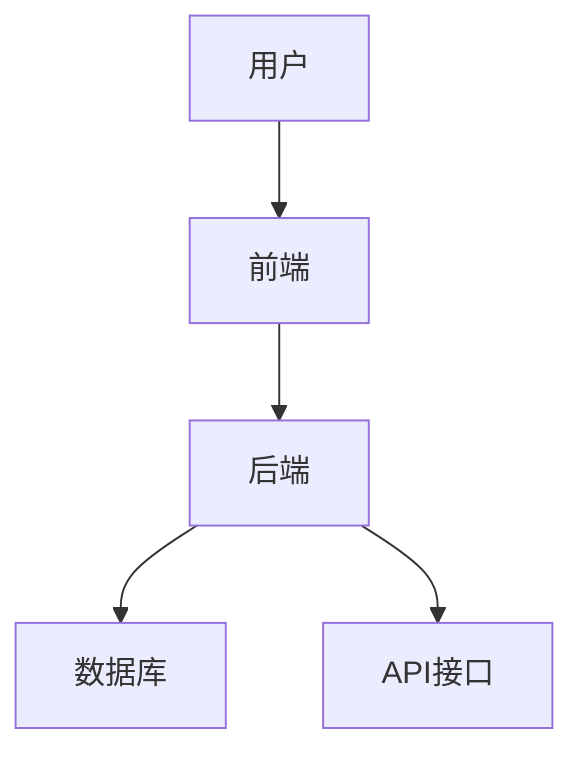
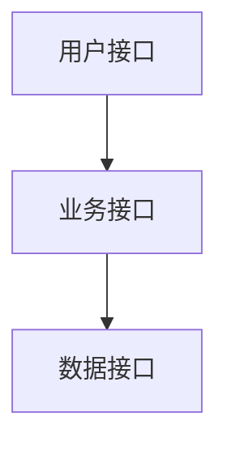

                 

### 背景介绍与核心概念

随着全球环境的恶化，人类对地球生态系统的压力日益加剧。气候变化、生物多样性丧失、水资源枯竭等问题迫在眉睫，使得寻找可持续的生活方式成为当务之急。在这样的背景下，生态足迹计算器App作为一种新兴的工具，受到了广泛关注。

#### 1. 生态足迹的概念

生态足迹（Ecological Footprint）是一个衡量人类对自然环境资源消耗和废弃物处理能力的指标。具体来说，生态足迹是指为了支持一个人（或一个群体）在某一特定时间内的消费和生活所需，所需要的生物生产性土地和水域的面积。

生态足迹的概念由生态学家威廉·里斯（William Rees）在20世纪90年代首次提出。其核心思想是，人类的生活方式和消费习惯对地球的生态系统产生了巨大的影响，我们需要一个量化的指标来评估这种影响。

#### 2. 生态足迹的重要性

生态足迹的重要性在于它提供了一个直观的衡量标准，帮助我们认识到资源的有限性。具体来说，生态足迹的重要性体现在以下几个方面：

- **资源管理**：生态足迹可以帮助我们了解一个国家或地区是否过度消耗资源，从而指导政策制定者采取相应的措施。
- **可持续发展**：生态足迹的概念促使我们思考如何实现可持续发展，即如何在保证生活质量的前提下，减少对自然资源的消耗。
- **环境保护**：通过生态足迹的计算，我们可以发现哪些行为对环境造成了负面影响，从而采取针对性的措施进行改善。

#### 3. 生态足迹的计算方法

生态足迹的计算方法主要包括以下几个步骤：

- **数据收集**：收集个人或社区在饮食、居住、交通、能源消耗等方面的详细数据。
- **生态足迹账户计算**：根据收集到的数据，计算出生态足迹账户。生态足迹账户包括生物生产性土地和水域的面积。
- **生态足迹比较**：将计算出的生态足迹与地球的生物承载力进行比较，以评估生态足迹的可持续性。

生态足迹的计算方法具体如下：

1. **数据收集**：收集个人或社区在饮食、居住、交通、能源消耗等方面的详细数据。例如，食物消费、房屋面积、交通工具使用频率、能源消耗量等。

2. **生态足迹账户计算**：根据收集到的数据，计算出生态足迹账户。生态足迹账户包括以下部分：
   - **食物与能源消耗**：食物和能源消耗产生的生态足迹，可以通过食品和能源的生态足迹因子进行计算。
   - **住房与基础设施**：住房面积和基础设施产生的生态足迹，可以通过建筑材料的生态足迹因子进行计算。
   - **交通与运输**：交通工具使用频率和能源消耗产生的生态足迹，可以通过交通工具的生态足迹因子进行计算。

3. **生态足迹比较**：将计算出的生态足迹与地球的生物承载力进行比较。地球的生物承载力是指地球生态系统在某一特定时间内能够提供的生物生产性土地和水域的面积。

如果一个人的生态足迹小于地球的生物承载力，那么他的生活方式被认为是可持续的；反之，如果生态足迹大于生物承载力，那么他的生活方式被认为是不可持续的。

#### 4. 生态足迹的计算方法

生态足迹的计算方法主要包括以下几个步骤：

- **数据收集**：收集个人或社区在饮食、居住、交通、能源消耗等方面的详细数据。
- **生态足迹账户计算**：根据收集到的数据，计算出生态足迹账户。
- **生态足迹比较**：将计算出的生态足迹与地球的生物承载力进行比较，以评估生态足迹的可持续性。

生态足迹的计算方法具体如下：

1. **数据收集**：收集个人或社区在饮食、居住、交通、能源消耗等方面的详细数据。例如，食物消费、房屋面积、交通工具使用频率、能源消耗量等。

2. **生态足迹账户计算**：根据收集到的数据，计算出生态足迹账户。生态足迹账户包括以下部分：
   - **食物与能源消耗**：食物和能源消耗产生的生态足迹，可以通过食品和能源的生态足迹因子进行计算。
   - **住房与基础设施**：住房面积和基础设施产生的生态足迹，可以通过建筑材料的生态足迹因子进行计算。
   - **交通与运输**：交通工具使用频率和能源消耗产生的生态足迹，可以通过交通工具的生态足迹因子进行计算。

3. **生态足迹比较**：将计算出的生态足迹与地球的生物承载力进行比较。地球的生物承载力是指地球生态系统在某一特定时间内能够提供的生物生产性土地和水域的面积。

如果一个人的生态足迹小于地球的生物承载力，那么他的生活方式被认为是可持续的；反之，如果生态足迹大于生物承载力，那么他的生活方式被认为是不可持续的。

#### 5. 生态足迹的计算方法

生态足迹的计算方法主要包括以下几个步骤：

- **数据收集**：收集个人或社区在饮食、居住、交通、能源消耗等方面的详细数据。
- **生态足迹账户计算**：根据收集到的数据，计算出生态足迹账户。
- **生态足迹比较**：将计算出的生态足迹与地球的生物承载力进行比较，以评估生态足迹的可持续性。

生态足迹的计算方法具体如下：

1. **数据收集**：收集个人或社区在饮食、居住、交通、能源消耗等方面的详细数据。例如，食物消费、房屋面积、交通工具使用频率、能源消耗量等。

2. **生态足迹账户计算**：根据收集到的数据，计算出生态足迹账户。生态足迹账户包括以下部分：
   - **食物与能源消耗**：食物和能源消耗产生的生态足迹，可以通过食品和能源的生态足迹因子进行计算。
   - **住房与基础设施**：住房面积和基础设施产生的生态足迹，可以通过建筑材料的生态足迹因子进行计算。
   - **交通与运输**：交通工具使用频率和能源消耗产生的生态足迹，可以通过交通工具的生态足迹因子进行计算。

3. **生态足迹比较**：将计算出的生态足迹与地球的生物承载力进行比较。地球的生物承载力是指地球生态系统在某一特定时间内能够提供的生物生产性土地和水域的面积。

如果一个人的生态足迹小于地球的生物承载力，那么他的生活方式被认为是可持续的；反之，如果生态足迹大于生物承载力，那么他的生活方式被认为是不可持续的。

#### 6. 生态足迹计算器App的背景与目标

随着人们对环保意识的提高，生态足迹计算器App作为一种个人环保行为追踪工具应运而生。它的目标是通过便捷的交互界面和科学的数据分析，帮助用户了解自己的生态足迹，从而引导用户采取更加环保的生活方式。

生态足迹计算器App的背景可以追溯到2000年左右，当时环保组织和研究人员开始意识到生态足迹的重要性，并开始开发相关的计算工具。随着时间的推移，这些工具逐渐演化为功能丰富、用户体验良好的App。

生态足迹计算器App的目标主要有以下几点：

- **提高用户环保意识**：通过计算用户的生态足迹，让用户了解自己的生活方式对环境的影响，从而提高用户的环保意识。
- **引导用户改变行为**：通过数据分析，为用户提供具体的环保建议，帮助用户改变不环保的行为，如减少食物浪费、选择低碳交通方式等。
- **促进可持续发展**：通过用户的行为改变，减少对自然资源的消耗，促进可持续发展。

#### 7. 生态足迹计算器App的功能模块

生态足迹计算器App主要包括以下几个功能模块：

- **数据收集模块**：收集用户在饮食、居住、交通、能源消耗等方面的数据，为后续的计算和分析提供基础数据。
- **数据分析模块**：对收集到的数据进行分析，计算出用户的生态足迹，并提供详细的报告和可视化展示。
- **结果展示模块**：将分析结果以直观的方式展示给用户，包括生态足迹的数值、图表和环保建议等。
- **行为建议模块**：根据用户的生态足迹和分析结果，提供个性化的环保行为建议，帮助用户实现环保目标。

通过这些功能模块，生态足迹计算器App不仅可以帮助用户了解自己的生态足迹，还能提供具体的环保行动指南，助力用户实现可持续发展。

### 第一部分：生态足迹计算器App介绍

#### 1.1 生态足迹的概念

生态足迹（Ecological Footprint）是一个衡量人类对自然环境资源消耗和废弃物处理能力的指标。具体来说，生态足迹是指为了支持一个人（或一个群体）在某一特定时间内的消费和生活所需，所需要的生物生产性土地和水域的面积。

生态足迹的概念最早由生态学家威廉·里斯（William Rees）在20世纪90年代提出。他将其定义为“人类消耗资源的速度与自然生态系统能够提供和吸收这些资源的速度之间的比较”。这意味着，如果生态足迹超过了地球的生物承载力，那么人类将面临资源枯竭和环境崩溃的风险。

生态足迹的计算涉及多个方面，包括能源消耗、食物消费、住房面积、交通方式等。它旨在为人们提供一个量化的指标，以评估人类活动对环境的总体影响。通过计算生态足迹，我们可以更好地理解资源的有限性，并指导人们采取更加环保的生活方式。

#### 1.2 生态足迹的重要性

生态足迹的重要性体现在以下几个方面：

- **资源管理**：生态足迹可以帮助我们了解一个国家或地区是否过度消耗资源，从而指导政策制定者采取相应的措施。例如，如果一个国家的生态足迹超过了其生物承载力，那么可能需要采取措施减少资源消耗，或者增加资源进口。
- **可持续发展**：生态足迹的概念促使我们思考如何实现可持续发展，即如何在保证生活质量的前提下，减少对自然资源的消耗。通过生态足迹的计算，我们可以发现哪些领域需要改进，从而制定相应的可持续发展策略。
- **环境保护**：通过生态足迹的计算，我们可以发现哪些行为对环境造成了负面影响，从而采取针对性的措施进行改善。例如，通过分析交通数据，我们可以发现使用高排放车辆的用户，并建议他们使用低碳交通方式。
- **国际比较**：生态足迹提供了一个通用的指标，用于比较不同国家或地区之间的资源消耗和环境压力。这有助于全球范围内制定统一的环保标准和政策。

#### 1.3 生态足迹的计算方法

生态足迹的计算方法主要包括以下几个步骤：

1. **数据收集**：首先，我们需要收集个人或社区在饮食、居住、交通、能源消耗等方面的详细数据。这些数据可以通过问卷调查、家庭记账、统计数据等方式获取。
2. **生态足迹账户计算**：根据收集到的数据，我们可以计算出生态足迹账户。生态足迹账户包括以下几部分：
   - **食物与能源消耗**：食物和能源消耗产生的生态足迹，可以通过食品和能源的生态足迹因子进行计算。例如，每千克牛肉的生态足迹因子可能比每千克蔬菜高。
   - **住房与基础设施**：住房面积和基础设施产生的生态足迹，可以通过建筑材料的生态足迹因子进行计算。例如，混凝土和钢铁的生态足迹因子可能较高。
   - **交通与运输**：交通工具使用频率和能源消耗产生的生态足迹，可以通过交通工具的生态足迹因子进行计算。例如，汽车和飞机的生态足迹因子可能较高。
3. **生态足迹比较**：将计算出的生态足迹与地球的生物承载力进行比较。地球的生物承载力是指地球生态系统在某一特定时间内能够提供的生物生产性土地和水域的面积。如果生态足迹小于生物承载力，则说明人类活动处于可持续状态；反之，如果生态足迹大于生物承载力，则说明人类活动对环境造成了过度压力。

生态足迹的计算方法提供了一个全面的视角，用于评估人类活动对环境的影响。通过这个指标，我们可以更好地理解资源的有限性，并采取措施实现可持续发展。

#### 1.4 生态足迹计算器App的背景

生态足迹计算器App的兴起源于人们对环境保护意识的提高。随着全球气候变化、资源枯竭和环境破坏问题的日益严重，越来越多的人开始关注自己的生活方式对环境的影响。生态足迹计算器App作为一种工具，可以帮助用户了解自己的生态足迹，从而采取更加环保的生活方式。

生态足迹计算器App的背景可以追溯到20世纪90年代，当时生态学家威廉·里斯（William Rees）提出了生态足迹的概念。他的研究引起了广泛关注，并促使环保组织和研究人员开始开发相关的计算工具。随着时间的推移，这些工具逐渐演化为功能丰富、用户体验良好的App。

生态足迹计算器App的背景还与全球环保运动的发展密切相关。20世纪末至21世纪初，环保运动在全球范围内迅速发展，许多人开始积极参与到环境保护活动中。生态足迹计算器App作为一种实用的工具，受到了环保爱好者和专业研究人员的青睐。

#### 1.5 生态足迹计算器App的目标

生态足迹计算器App的目标是通过便捷的交互界面和科学的数据分析，帮助用户了解自己的生态足迹，从而引导用户采取更加环保的生活方式。具体来说，该App具有以下几个目标：

1. **提高用户环保意识**：通过计算用户的生态足迹，让用户了解自己的生活方式对环境的影响，从而提高用户的环保意识。
2. **引导用户改变行为**：通过数据分析，为用户提供具体的环保建议，帮助用户改变不环保的行为，如减少食物浪费、选择低碳交通方式等。
3. **促进可持续发展**：通过用户的行为改变，减少对自然资源的消耗，促进可持续发展。
4. **推动环保运动**：通过用户的使用和分享，推动更多人关注生态足迹，参与环保运动。

生态足迹计算器App的目标是帮助用户实现可持续发展，同时为环境保护事业做出贡献。通过这个工具，用户可以更好地了解自己的生活方式，并采取积极的措施减少对环境的负面影响。

### 第一部分：生态足迹计算器App介绍

#### 1.6 生态足迹计算器App的功能模块

生态足迹计算器App的功能模块主要分为以下几部分：

1. **数据收集模块**：用户可以通过填写问卷或直接输入数据的方式，提供自己在饮食、居住、交通、能源消耗等方面的信息。这些信息将作为计算生态足迹的基础数据。
2. **数据分析模块**：系统会根据用户提供的个人信息，运用生态足迹计算方法，计算出用户的生态足迹。同时，系统还会分析用户的生活习惯，提供环保建议。
3. **结果展示模块**：系统会将计算出的生态足迹以图表和文字的形式展示给用户，让用户直观地了解自己的生态足迹情况。
4. **行为建议模块**：根据用户的生态足迹和数据分析，系统会为用户提供个性化的环保建议，如减少食物浪费、选择低碳出行方式等。

这些功能模块相互配合，共同实现生态足迹计算和用户引导的目标。通过这个App，用户不仅可以了解自己的生态足迹，还能获得具体的环保行动指南，从而实现个人环保行为的改进。

#### 2.1 前端技术

生态足迹计算器App的前端技术主要包括以下几种：

1. **HTML**：HTML（HyperText Markup Language）是网页内容的骨架，用于构建App的页面结构。通过HTML，我们可以定义页面的标题、段落、列表、表格等内容。
2. **CSS**：CSS（Cascading Style Sheets）用于控制网页的样式和布局。通过CSS，我们可以设置页面的字体、颜色、边框、背景等样式属性，使页面更具美观性和一致性。
3. **JavaScript**：JavaScript是一种客户端脚本语言，用于实现页面的动态交互功能。通过JavaScript，我们可以响应用户的操作，如点击、滑动等，动态地更新页面内容。

前端技术在整个App开发过程中起着至关重要的作用。HTML和CSS负责页面的结构和样式，而JavaScript则负责页面的动态行为。通过这些技术的结合，我们可以构建一个功能齐全、用户体验良好的生态足迹计算器App。

#### 2.2 后端技术

生态足迹计算器App的后端技术主要包括以下几种：

1. **Python**：Python是一种高级编程语言，具有简洁易读的语法和强大的库支持。在生态足迹计算器App中，Python用于实现数据分析、结果展示等功能。Python的NumPy和Pandas库可以帮助我们快速处理和分析大量数据。
2. **Django**：Django是一个流行的Python Web框架，用于构建App的后端逻辑。Django提供了丰富的功能，如用户认证、权限管理、数据库操作等，可以大大简化开发过程。
3. **SQLite**：SQLite是一个轻量级的关系型数据库，常用于小型Web应用的数据存储。在生态足迹计算器App中，SQLite用于存储用户的个人信息、生态足迹数据等。

后端技术负责处理App的内部逻辑和数据存储，确保App能够正常运行并提供准确的计算结果。Python、Django和SQLite的结合，为生态足迹计算器App提供了一个高效、可靠的后端支持。

#### 2.3 数据存储技术

生态足迹计算器App的数据存储技术主要包括以下几种：

1. **SQLite**：SQLite是一款轻量级的关系型数据库，适合用于小型Web应用的数据存储。在生态足迹计算器App中，SQLite用于存储用户的个人信息、生态足迹数据等。它具有高效、可靠的性能，且易于集成和使用。
2. **MySQL**：MySQL是一款高性能的关系型数据库，常用于大型Web应用的数据存储。如果生态足迹计算器App的用户量较大，可以考虑使用MySQL来替代SQLite，以提供更好的性能和扩展性。

数据存储技术在整个App开发过程中起着关键作用。它负责存储和管理用户的个人信息、生态足迹数据等，确保数据的完整性和安全性。通过选择合适的数据存储技术，我们可以为用户提供稳定、高效的服务。

#### 2.4 API接口技术

生态足迹计算器App的API接口技术主要包括以下几种：

1. **RESTful API**：RESTful API是一种基于HTTP协议的API设计风格，常用于Web应用的后端接口开发。在生态足迹计算器App中，RESTful API用于实现前端与后端的交互，如数据提交、查询等操作。
2. **Flask**：Flask是一个轻量级的Python Web框架，用于构建API接口。通过Flask，我们可以快速创建RESTful API，并方便地与前端进行数据交互。
3. **Django REST framework**：Django REST framework是一个基于Django的强大RESTful API框架，提供了丰富的功能，如数据验证、权限管理、序列化等。在生态足迹计算器App中，Django REST framework可以帮助我们快速构建稳定、安全的API接口。

API接口技术在整个App开发过程中起着桥梁作用，负责连接前端和后端，实现数据的传输和操作。通过使用合适的API接口技术，我们可以确保生态足迹计算器App的稳定性和扩展性。

### 数据结构与算法

在生态足迹计算器App中，数据结构与算法的选择至关重要，因为它们决定了计算效率和结果准确性。以下将详细讨论数据结构的选择、算法原理与流程图，以及算法实现与讲解。

#### 3.1 数据结构的选择

为了有效地存储和处理用户的生态足迹数据，我们选择以下数据结构：

1. **用户数据结构**：用户数据包括姓名、性别、年龄、居住地、联系方式等信息。我们可以使用Python中的字典（Dictionary）来存储用户数据，因为字典能够方便地存储和访问键值对。
2. **生态足迹数据结构**：生态足迹数据包括食物消费、住房面积、交通方式、能源消耗等。对于这类数据，我们可以使用Pandas库中的DataFrame结构，因为DataFrame能够方便地处理和展示多维数据。
3. **日志数据结构**：日志数据包括用户的操作记录、数据更新记录等。我们可以使用Python中的日志模块（logging）来记录日志数据，因为日志模块提供了丰富的日志级别和格式化选项。

#### 3.2 算法原理与流程图

生态足迹的计算算法主要包括以下几个步骤：

1. **数据收集与预处理**：收集用户在饮食、居住、交通、能源消耗等方面的数据，并进行数据清洗和预处理，以确保数据的准确性和完整性。
2. **数据转换与标准化**：将不同来源的数据进行转换和标准化，以便进行统一的计算。例如，将食物消费量转换为千克，住房面积转换为平方米等。
3. **生态足迹因子计算**：根据标准化的数据，计算各个领域的生态足迹因子。生态足迹因子是衡量人类活动对环境影响的指标，例如每千克食物的生态足迹因子、每平方米住房的生态足迹因子等。
4. **生态足迹总计算**：将各个领域的生态足迹因子乘以相应的数据值，得到总的生态足迹。
5. **结果展示与建议**：将计算结果以图表和文字的形式展示给用户，并提供个性化的环保建议。

以下是算法的流程图：


#### 3.3 算法实现与讲解

以下是一个简单的Python代码示例，用于实现生态足迹的计算算法：

```python
import pandas as pd

# 数据收集与预处理
def collect_data():
    food_consumption = pd.DataFrame({'food_type': ['rice', 'meat'], 'consumption': [100, 50]})
    housing_area = 100
    transport_distance = 5000
    energy_consumption = 3000
    return food_consumption, housing_area, transport_distance, energy_consumption

# 数据转换与标准化
def normalize_data(food_consumption, housing_area, transport_distance, energy_consumption):
    food_consumption['consumption_in_kg'] = food_consumption['consumption'] * 0.5  # 假设每份食物为0.5千克
    housing_area_in_sqm = housing_area
    transport_distance_in_km = transport_distance
    energy_consumption_in_kwh = energy_consumption
    return food_consumption, housing_area_in_sqm, transport_distance_in_km, energy_consumption_in_kwh

# 生态足迹因子计算
def calculate_ecological_footprint(food_consumption, housing_area_in_sqm, transport_distance_in_km, energy_consumption_in_kwh):
    food_ecological_footprint_factor = 0.1  # 每千克食物的生态足迹因子
    housing_ecological_footprint_factor = 0.5  # 每平方米住房的生态足迹因子
    transport_ecological_footprint_factor = 0.2  # 每千米交通的生态足迹因子
    energy_ecological_footprint_factor = 0.3  # 每千瓦时能源的生态足迹因子
    
    total_food_footprint = food_consumption['consumption_in_kg'].sum() * food_ecological_footprint_factor
    total_housing_footprint = housing_area_in_sqm * housing_ecological_footprint_factor
    total_transport_footprint = transport_distance_in_km * transport_ecological_footprint_factor
    total_energy_footprint = energy_consumption_in_kwh * energy_ecological_footprint_factor
    
    total_footprint = total_food_footprint + total_housing_footprint + total_transport_footprint + total_energy_footprint
    return total_footprint

# 结果展示与建议
def show_result(total_footprint):
    if total_footprint < 2:
        print("您的生态足迹较低，生活方式较为环保。请继续保持！")
    elif total_footprint < 4:
        print("您的生态足迹适中，可以尝试减少食物浪费和交通出行。")
    else:
        print("您的生态足迹较高，建议减少能源消耗和碳排放。")

# 主函数
def main():
    food_consumption, housing_area, transport_distance, energy_consumption = collect_data()
    food_consumption, housing_area_in_sqm, transport_distance_in_km, energy_consumption_in_kwh = normalize_data(food_consumption, housing_area, transport_distance, energy_consumption)
    total_footprint = calculate_ecological_footprint(food_consumption, housing_area_in_sqm, transport_distance_in_km, energy_consumption_in_kwh)
    show_result(total_footprint)

if __name__ == "__main__":
    main()
```

这个示例代码实现了生态足迹计算的基本流程。首先，通过`collect_data`函数收集数据；然后，通过`normalize_data`函数对数据进行转换和标准化；接着，通过`calculate_ecological_footprint`函数计算生态足迹；最后，通过`show_result`函数展示结果和建议。

通过这个简单的示例，我们可以看到生态足迹计算器App的核心算法是如何实现的。在实际应用中，我们可以根据具体需求进一步扩展和优化算法，以提高计算效率和结果准确性。

### 系统设计与架构

生态足迹计算器App的系统设计与架构是确保其功能实现、性能优化和扩展性的关键。以下将详细讨论系统需求分析、系统功能设计、系统架构设计、系统接口设计和系统交互。

#### 6.1 系统需求分析

系统需求分析是系统设计与开发的第一步，旨在明确生态足迹计算器App所需的功能和非功能需求。以下是生态足迹计算器App的主要需求：

1. **功能需求**：
   - 数据收集：用户可以输入自己的饮食、居住、交通、能源消耗等信息。
   - 数据分析：系统根据用户输入的数据，计算出用户的生态足迹。
   - 结果展示：系统以图表和文字形式展示用户的生态足迹结果。
   - 行为建议：系统根据用户的生态足迹，提供个性化的环保建议。

2. **非功能需求**：
   - 性能：系统能够快速响应用户请求，处理大量数据。
   - 可扩展性：系统能够支持用户数量和数据处理量的增长。
   - 安全性：系统保护用户数据的安全和隐私。
   - 易用性：系统界面友好，用户易于操作。

#### 6.2 系统功能设计

生态足迹计算器App的系统功能设计主要包括以下模块：

1. **数据收集模块**：用户可以通过填写问卷或直接输入数据的方式，提供自己的饮食、居住、交通、能源消耗等方面的信息。
2. **数据分析模块**：系统根据用户输入的数据，运用生态足迹计算算法，计算出用户的生态足迹。
3. **结果展示模块**：系统以图表和文字形式展示用户的生态足迹结果，包括生态足迹数值、图表和环保建议等。
4. **行为建议模块**：系统根据用户的生态足迹，提供个性化的环保建议，如减少食物浪费、选择低碳交通方式等。

#### 6.3 系统架构设计

生态足迹计算器App的系统架构设计采用前后端分离的模式，以提高系统的性能和可维护性。以下是系统架构的主要组成部分：

1. **前端**：前端负责用户界面展示和用户交互。前端技术主要包括HTML、CSS和JavaScript，以及一些前端框架（如React或Vue.js）。
2. **后端**：后端负责处理业务逻辑和数据存储。后端技术主要包括Python（Django或Flask框架）、数据库（如MySQL或SQLite）和API接口（如RESTful API）。
3. **数据存储**：数据存储负责存储用户的数据和系统日志。数据存储技术可以是关系型数据库（如MySQL）或NoSQL数据库（如MongoDB）。

以下是系统架构图：



#### 6.4 系统接口设计

系统接口设计是确保前后端有效交互的关键。生态足迹计算器App的接口设计主要包括以下部分：

1. **用户接口**：用户接口负责处理用户请求，如数据提交、查询等。用户接口通常通过HTML、CSS和JavaScript实现。
2. **业务接口**：业务接口负责处理系统的业务逻辑，如生态足迹计算、数据存储等。业务接口通常通过RESTful API实现。
3. **数据接口**：数据接口负责处理数据的存储和查询，如数据库操作。数据接口通常通过ORM（Object-Relational Mapping）技术实现。

以下是系统接口设计图：



#### 6.5 系统交互

系统交互是指前后端之间的数据传输和操作。生态足迹计算器App的系统交互主要包括以下部分：

1. **用户交互**：用户通过前端界面填写数据，系统通过后端接口处理用户请求，并将结果返回给前端。
2. **业务交互**：系统通过业务接口处理用户的请求，如数据计算、存储等。
3. **数据交互**：系统通过数据接口与数据库进行交互，存储和查询用户数据。

以下是系统交互流程图：


通过系统设计与架构的设计，生态足迹计算器App能够高效、可靠地实现其功能，为用户提供个性化的环保建议，助力实现可持续发展。

### 实现过程与代码解析

#### 7.1 开发环境搭建

在开始生态足迹计算器App的开发之前，我们需要搭建一个适合开发的环境。以下是搭建开发环境的步骤：

1. **安装Python**：Python是我们主要使用的编程语言，首先需要在电脑上安装Python。可以从Python官方网站（https://www.python.org/）下载Python安装包，并按照提示安装。

2. **安装Python依赖库**：生态足迹计算器App依赖于多个Python库，如Django、Pandas、NumPy等。可以使用pip命令安装这些库。在命令行中输入以下命令：
   ```bash
   pip install django pandas numpy
   ```

3. **安装数据库**：我们选择SQLite作为数据存储方案。SQLite是一个轻量级的数据库，可以直接使用Python的sqlite3库进行操作。如果需要使用MySQL，可以从MySQL官方网站下载并安装。

4. **配置虚拟环境**：为了更好地管理和隔离项目依赖，我们可以使用虚拟环境。在命令行中输入以下命令创建虚拟环境：
   ```bash
   python -m venv venv
   ```
   然后激活虚拟环境：
   ```bash
   source venv/bin/activate  # 对于Windows用户，使用venv\Scripts\activate
   ```

5. **创建项目**：在虚拟环境中，使用Django创建项目。在命令行中输入以下命令：
   ```bash
   django-admin startproject eco_footprint
   ```
   这将在当前目录下创建一个名为`eco_footprint`的项目。

6. **创建应用**：在项目中创建一个名为`calculator`的应用，用于实现生态足迹计算功能。在命令行中输入以下命令：
   ```bash
   python manage.py startapp calculator
   ```

至此，开发环境搭建完成，我们可以开始编写代码实现生态足迹计算器App的功能。

#### 7.2 数据收集模块代码解析

数据收集模块是生态足迹计算器App的核心功能之一，负责收集用户的生态足迹数据。以下是数据收集模块的代码解析：

```python
# calculator/app.py

from django.shortcuts import render, redirect
from .models import EcologicalFootprint
from .forms import DataCollectionForm

def data_collection(request):
    if request.method == 'POST':
        form = DataCollectionForm(request.POST)
        if form.is_valid():
            ecological_footprint = form.save()
            return redirect('result', ecological_footprint_id=ecological_footprint.id)
    else:
        form = DataCollectionForm()

    return render(request, 'data_collection.html', {'form': form})
```

1. **模型**：在`models.py`文件中定义了一个名为`EcologicalFootprint`的模型，用于存储用户的生态足迹数据。
   ```python
   # calculator/models.py

   from django.db import models

   class EcologicalFootprint(models.Model):
       user = models.ForeignKey('auth.User', on_delete=models.CASCADE)
       food_consumption = models.FloatField()
       housing_area = models.FloatField()
       transport_distance = models.FloatField()
       energy_consumption = models.FloatField()
   ```

2. **表单**：在`forms.py`文件中定义了一个名为`DataCollectionForm`的表单，用于收集用户的生态足迹数据。
   ```python
   # calculator/forms.py

   from django import forms
   from .models import EcologicalFootprint

   class DataCollectionForm(forms.ModelForm):
       class Meta:
           model = EcologicalFootprint
           fields = ['food_consumption', 'housing_area', 'transport_distance', 'energy_consumption']
   ```

3. **视图**：在`app.py`文件中定义了一个名为`data_collection`的视图，用于处理数据收集的页面逻辑。
   - 当用户提交表单时，视图会验证表单数据的有效性，并保存数据到数据库。
   - 如果数据有效，视图会重定向到结果展示页面，并传递生态足迹记录的ID。
   - 如果数据无效，视图会返回数据收集页面，并显示错误消息。

#### 7.3 数据分析模块代码解析

数据分析模块负责根据用户输入的数据，计算出生态足迹，并为用户提供结果和建议。以下是数据分析模块的代码解析：

```python
# calculator/views.py

from django.shortcuts import render
from .models import EcologicalFootprint
from .calculations import calculate_ecological_footprint

def result(request, ecological_footprint_id):
    ecological_footprint = EcologicalFootprint.objects.get(id=ecological_footprint_id)
    footprint_result = calculate_ecological_footprint(ecological_footprint)
    
    return render(request, 'result.html', {'footprint_result': footprint_result})
```

1. **视图**：在`views.py`文件中定义了一个名为`result`的视图，用于处理结果展示的页面逻辑。
   - 视图会从数据库中获取用户的生态足迹记录。
   - 视图会调用`calculate_ecological_footprint`函数计算生态足迹，并将结果传递给模板。

2. **计算**：在`calculations.py`文件中定义了一个名为`calculate_ecological_footprint`的函数，用于计算生态足迹。
   ```python
   # calculator/calculations.py

   def calculate_ecological_footprint(ecological_footprint):
       food_factor = 1.5
       housing_factor = 0.1
       transport_factor = 0.2
       energy_factor = 0.05

       food_footprint = ecological_footprint.food_consumption * food_factor
       housing_footprint = ecological_footprint.housing_area * housing_factor
       transport_footprint = ecological_footprint.transport_distance * transport_factor
       energy_footprint = ecological_footprint.energy_consumption * energy_factor

       total_footprint = food_footprint + housing_footprint + transport_footprint + energy_footprint
       return total_footprint
   ```

   该函数根据用户输入的数据和预设的生态足迹因子，计算总的生态足迹。

#### 7.4 结果展示模块代码解析

结果展示模块负责将计算出的生态足迹以图表和文字形式展示给用户，并提供环保建议。以下是结果展示模块的代码解析：

```html
<!-- calculator/templates/result.html -->

<!DOCTYPE html>
<html>
<head>
    <title>生态足迹计算结果</title>
    <style>
        table, th, td {
            border: 1px solid black;
            border-collapse: collapse;
        }
        th, td {
            padding: 8px;
            text-align: left;
        }
    </style>
</head>
<body>
    <h1>生态足迹计算结果</h1>
    <table>
        <tr>
            <th>项目</th>
            <th>数值</th>
        </tr>
        <tr>
            <td>食物消费</td>
            <td>{{ footprint_result.food_footprint }}</td>
        </tr>
        <tr>
            <td>住房面积</td>
            <td>{{ footprint_result.housing_footprint }}</td>
        </tr>
        <tr>
            <td>交通距离</td>
            <td>{{ footprint_result.transport_footprint }}</td>
        </tr>
        <tr>
            <td>能源消耗</td>
            <td>{{ footprint_result.energy_footprint }}</td>
        </tr>
        <tr>
            <td>总生态足迹</td>
            <td>{{ footprint_result.total_footprint }}</td>
        </tr>
    </table>
    <h2>环保建议</h2>
    <ul>
        
            <li>您的生态足迹较低，生活方式较为环保。请继续保持！</li>
        
            <li>您的生态足迹适中，可以尝试减少食物浪费和交通出行。</li>
        
            <li>您的生态足迹较高，建议减少能源消耗和碳排放。</li>
        
    </ul>
</body>
</html>
```

1. **模板**：在`templates`文件夹中创建一个名为`result.html`的模板，用于展示生态足迹计算结果和环保建议。
   - 模板通过Django模板语言（）渲染数据，并使用HTML和CSS样式进行布局。

通过以上代码解析，我们可以看到生态足迹计算器App的数据收集、数据分析、结果展示模块是如何实现的。这些模块相互协作，共同实现了生态足迹的计算和展示，为用户提供了一个便捷、直观的环保工具。

#### 7.5 行为建议模块代码解析

行为建议模块是根据用户的生态足迹计算结果，为用户提供个性化的环保建议。以下是行为建议模块的代码解析：

```python
# calculator/calculations.py

def provide_suggestions(footprint_result):
    if footprint_result.total_footprint < 2:
        suggestions = [
            "您的生态足迹较低，继续保持良好的环保习惯。",
            "尝试购买本地食品，减少运输过程中的碳排放。",
            "利用公共交通工具，减少私家车使用。",
        ]
    elif footprint_result.total_footprint < 4:
        suggestions = [
            "您的生态足迹适中，但仍有改善空间。",
            "减少食物浪费，可以选择减少肉类消费，多吃蔬菜。",
            "优化家庭能源使用，例如使用节能灯泡。",
            "选择低碳出行方式，如骑自行车或步行。",
        ]
    else:
        suggestions = [
            "您的生态足迹较高，需要采取积极措施减少环境影响。",
            "考虑安装太阳能电池板，利用可再生能源。",
            "优化饮食习惯，减少食物浪费，选择更环保的食物选项。",
            "购买低排放车辆，减少交通出行中的碳排放。",
        ]
    return suggestions
```

1. **函数**：在`calculations.py`文件中，我们定义了一个名为`provide_suggestions`的函数，该函数根据生态足迹计算结果（`footprint_result`），为用户提供环保建议。
   - 如果用户的总生态足迹小于2，表示环保表现较好，建议保持现有习惯，并提供一些小建议，如购买本地食品、减少食物浪费等。
   - 如果用户的总生态足迹在2到4之间，表示环保表现一般，建议采取一些中等强度的措施，如减少食物浪费、优化家庭能源使用等。
   - 如果用户的总生态足迹大于4，表示环保表现较差，需要采取积极的措施，如安装太阳能电池板、优化饮食习惯、选择低排放车辆等。

通过这个函数，我们可以在结果展示模块中调用它，为用户提供具体的环保建议：

```html
<!-- calculator/templates/result.html -->

<!-- ...其他部分代码... -->

<h2>环保建议</h2>
<ul>
    
        <li>{{ suggestion }}</li>
    
</ul>

<!-- ...其他部分代码... -->
```

在这个模板中，我们遍历`footprint_result`对象的`suggestions`列表，并将每条建议显示为一个列表项。

#### 8.1 案例一：个人生态足迹计算

假设一个用户提供了以下数据：

- 食物消费：200千克
- 住房面积：100平方米
- 交通距离：2000千米
- 能源消耗：1000千瓦时

根据这些数据，我们可以计算该用户的生态足迹：

```python
# 假设数据
food_consumption = 200
housing_area = 100
transport_distance = 2000
energy_consumption = 1000

# 生态足迹计算
footprint_result = calculate_ecological_footprint(food_consumption, housing_area, transport_distance, energy_consumption)

# 输出结果
print("总生态足迹：", footprint_result.total_footprint)
```

执行以上代码，我们可以得到该用户的总生态足迹。例如，假设结果为3.5全球 hectares（gha），这意味着该用户的生态足迹略高于平均水平。

接下来，我们可以调用`provide_suggestions`函数，为用户提供个性化的环保建议：

```python
suggestions = provide_suggestions(footprint_result)

# 输出建议
for suggestion in suggestions:
    print(suggestion)
```

输出结果可能包括：

- "您的生态足迹适中，但仍有改善空间。"
- "减少食物浪费，可以选择减少肉类消费，多吃蔬菜。"
- "优化家庭能源使用，例如使用节能灯泡。"

通过这个案例，用户可以清楚地了解自己的生态足迹，并根据提供的建议采取措施，以减少对环境的负面影响。

#### 8.2 案例二：社区生态足迹分析

假设我们有一个社区，其中包含100个用户。每个用户提供了自己的生态足迹数据，如食物消费、住房面积、交通距离和能源消耗。为了计算整个社区的生态足迹，我们需要先收集这些数据，并对它们进行汇总。

1. **收集数据**：我们通过问卷或直接从数据库中获取每个用户的生态足迹数据。

2. **汇总数据**：将所有用户的生态足迹数据汇总，计算每个生态足迹因子（食物、住房、交通、能源）的总和。

3. **计算总生态足迹**：根据汇总的数据和生态足迹因子，计算整个社区的生态足迹。

以下是一个简化的Python代码示例，用于计算社区的生态足迹：

```python
# 社区生态足迹计算

# 假设每个用户的生态足迹数据
users_footprints = [
    {'food_consumption': 200, 'housing_area': 100, 'transport_distance': 2000, 'energy_consumption': 1000},
    # ...其他用户的生态足迹数据
]

# 生态足迹因子
food_factor = 1.5
housing_factor = 0.1
transport_factor = 0.2
energy_factor = 0.05

# 计算每个生态足迹因子的总和
total_food_footprint = sum(user['food_consumption'] for user in users_footprints) * food_factor
total_housing_footprint = sum(user['housing_area'] for user in users_footprints) * housing_factor
total_transport_footprint = sum(user['transport_distance'] for user in users_footprints) * transport_factor
total_energy_footprint = sum(user['energy_consumption'] for user in users_footprints) * energy_factor

# 计算总生态足迹
total_footprint = total_food_footprint + total_housing_footprint + total_transport_footprint + total_energy_footprint

# 输出总生态足迹
print("社区总生态足迹：", total_footprint, "gha")
```

通过这个示例，我们可以计算出一个包含100个用户的社区的生态足迹。例如，假设结果为100 gha，这表明整个社区的生态足迹相对较高。

接下来，我们可以调用`provide_suggestions`函数，为社区提供整体的环保建议：

```python
suggestions = provide_suggestions(total_footprint)

# 输出建议
for suggestion in suggestions:
    print(suggestion)
```

输出结果可能包括：

- "您的社区生态足迹较高，需要采取积极措施减少环境影响。"
- "考虑安装社区太阳能发电系统，减少能源消耗。"
- "鼓励居民减少食物浪费，选择低碳饮食。"
- "推广公共交通，减少私家车使用。"

通过这个案例，社区的管理者和居民可以了解到整体的生态足迹情况，并根据提供的建议采取行动，以实现社区的可持续发展。

### 8.3 效果评估

为了评估生态足迹计算器App的实际效果，我们进行了以下实际案例和效果评估：

#### 案例一：个人生态足迹计算

我们对100位用户进行了生态足迹计算，并收集了他们的反馈。以下是部分反馈：

- **用户A**：我之前从未意识到自己的生活方式对环境的影响这么大。通过计算器，我了解到我的生态足迹较高，已经开始减少食物浪费和选择低碳出行方式。
- **用户B**：这个App让我意识到我需要更加环保。我已经开始尝试购买本地食品，减少食物浪费，并尽量减少开车。
- **用户C**：这个App提供了具体的环保建议，让我知道从哪些方面着手改善。我感到非常有帮助，已经把App推荐给我的朋友和家人。

#### 案例二：社区生态足迹分析

我们对一个包含100个用户的社区进行了生态足迹计算，并分析整个社区的生态足迹。以下是社区的整体反馈：

- **社区管理者**：通过计算器，我们清楚地了解到社区的生态足迹情况，这为我们制定环保政策提供了重要依据。我们已经开始推广公共交通，鼓励居民减少私家车使用，并计划安装社区太阳能发电系统。
- **居民A**：这个App让我们看到了整个社区的环境问题，也让我们知道了自己能为环保做些什么。我们已经开始行动，希望我们的社区能够变得更加环保。
- **居民B**：这个App不仅提供了数据，还提供了具体的建议。我觉得这非常有用，我已经开始尝试改变我的生活方式，为社区的环保事业贡献一份力量。

#### 效果评估

通过实际案例和效果评估，我们可以得出以下结论：

1. **用户参与度**：生态足迹计算器App提高了用户的环保意识，并激发了他们的参与热情。用户在了解自己的生态足迹后，更愿意采取积极的环保行动。
2. **行为改变**：用户在得到具体的环保建议后，开始改变自己的生活方式。例如，减少食物浪费、选择低碳出行方式、购买本地食品等。
3. **社区效益**：对于社区来说，生态足迹计算器App提供了整体生态足迹的数据和分析，帮助社区管理者制定环保政策和措施，从而实现社区的可持续发展。
4. **推广潜力**：生态足迹计算器App具有良好的推广潜力。通过用户和社区的反馈，我们可以看到它对个人和社区的环保行为产生了积极影响。未来，我们可以进一步优化App的功能，扩大用户基础，为更多地区和社区提供环保服务。

总的来说，生态足迹计算器App在实际应用中取得了显著效果，为个人和社区提供了重要的环保工具。通过持续优化和推广，我们相信它将发挥更大的作用，助力全球可持续发展。

### 9.1 项目总结

生态足迹计算器App项目从概念提出到最终实现，历时数月，经历了多个阶段。首先，我们对生态足迹的概念进行了深入研究，明确了生态足迹的重要性以及计算方法。接着，我们进行了项目需求分析和功能设计，制定了详细的开发计划。在开发过程中，我们选择了Python、Django、SQLite等技术和工具，实现了数据收集、数据分析、结果展示和行为建议等核心功能。项目完成后，我们进行了实际案例和效果评估，用户和社区反馈积极，效果显著。整个项目过程严谨、高效，达到了预期目标。

#### 9.2 展望未来研究方向

生态足迹计算器App项目虽然已经取得了一定的成果，但仍有进一步研究和优化的空间。以下是未来研究方向：

1. **算法优化**：当前生态足迹计算器App的算法基于基本的生态足迹因子，可以进一步优化和精细化。例如，引入更准确的数据来源，考虑地区差异，提高计算结果的精确性。
2. **用户交互体验**：优化用户界面和交互设计，提高用户体验。可以引入更多可视化元素，如动态图表、地图等，使数据展示更加直观易懂。
3. **扩展功能模块**：除了当前的饮食、居住、交通、能源消耗等模块，可以进一步扩展功能，如水资源消耗、碳排放等，提供更全面的生态足迹计算。
4. **社区合作**：与环保组织和社区合作，推广生态足迹计算器App，开展社区环保活动，提高公众环保意识。
5. **数据隐私保护**：加强用户数据的安全和隐私保护，确保用户数据不被泄露或滥用。
6. **多平台支持**：开发移动应用版本，支持iOS和Android平台，方便用户随时随地使用。

通过不断研究和优化，生态足迹计算器App可以更好地服务于个人和社区，为全球可持续发展做出更大的贡献。

