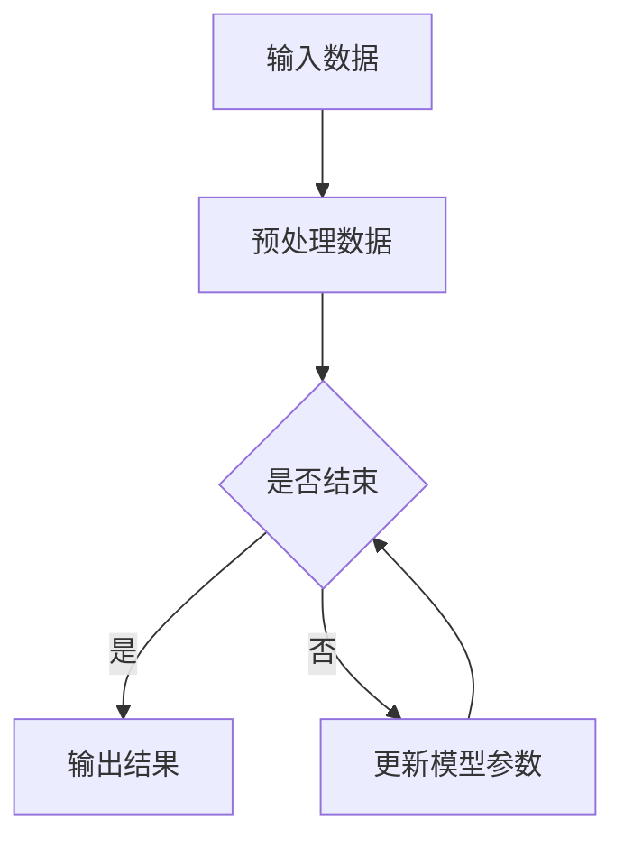
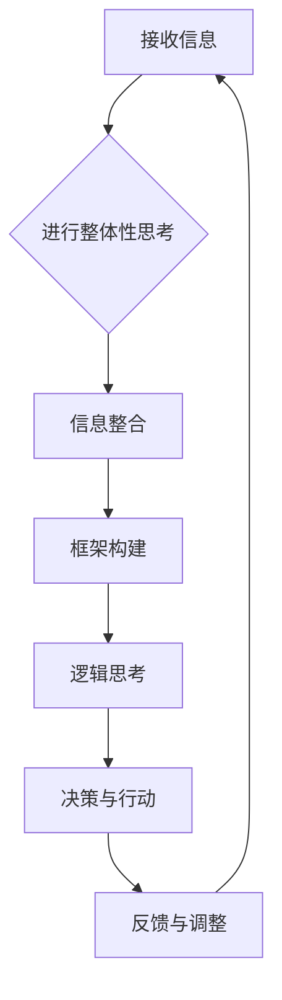
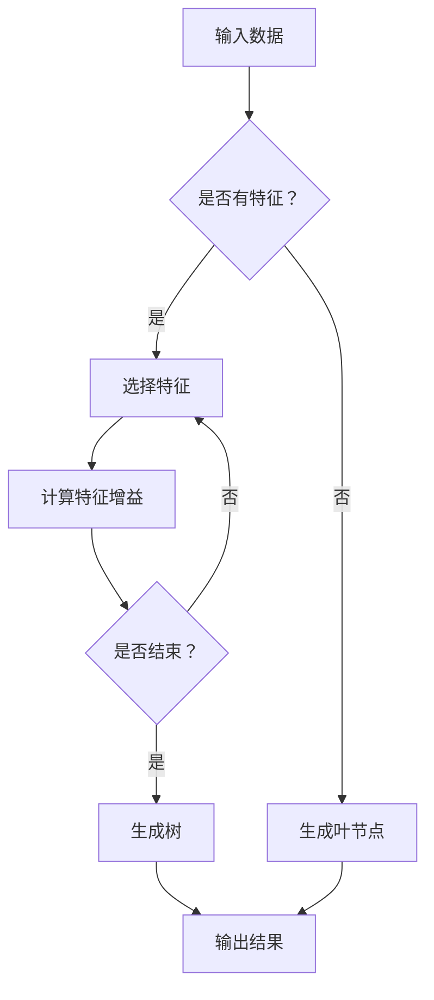
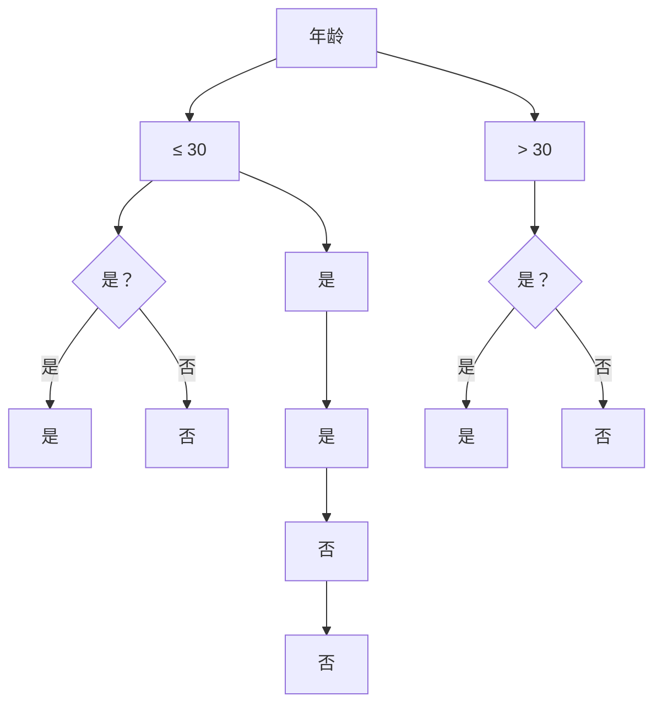
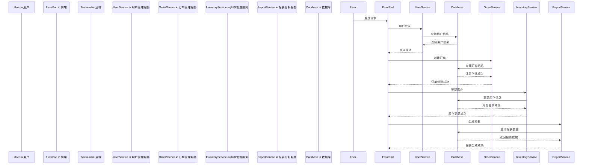
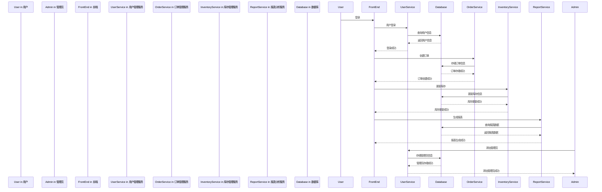

                 

# 碎片化信息中的整体性思考：重建知识体系的方法

关键词：碎片化信息、整体性思考、知识体系、重建、信息整合、逻辑思考

摘要：
在信息爆炸的时代，如何从碎片化信息中重建知识体系是一个重要课题。本文将深入探讨整体性思考的方法，通过对其背景介绍、核心概念与联系、算法原理讲解、系统分析与架构设计、项目实战以及最佳实践等方面进行详细剖析，帮助读者掌握重建知识体系的有效策略。

## 第一部分：背景介绍

### 核心概念

**问题背景：**

在当今信息爆炸的时代，人们每天都要接触到大量的碎片化信息。这些信息虽然丰富多彩，但往往缺乏系统性和整体性，使得我们在吸收和理解这些信息时面临诸多困难。因此，如何从这些碎片化信息中提炼出整体性的思考和重建知识体系，成为了我们迫切需要解决的问题。

**问题描述：**

碎片化信息带来的主要问题有：

1. **信息过载：** 信息量庞大，难以消化和整理。
2. **认知负荷：** 信息零散，难以形成系统的知识框架。
3. **理解困难：** 碎片化信息往往缺乏上下文，导致理解困难。

**问题解决：**

为了解决上述问题，我们需要掌握一种有效的思考方法，即“整体性思考”。这种方法可以帮助我们：

1. **整合信息：** 将零散的信息整合成系统性的知识。
2. **建立框架：** 构建知识体系，使得信息更加有条理。
3. **提升理解：** 在整体性的背景下，更容易理解和吸收信息。

**边界与外延：**

整体性思考并不仅限于个人知识的重建，它还可以应用于团队协作、项目管理和企业战略等领域。因此，掌握整体性思考的方法，对于个人和组织的成长都具有重要意义。

### 概念结构与核心要素组成

整体性思考的核心概念和要素包括：

1. **信息整合：** 通过归纳、分类和梳理，将碎片化信息整合成整体。
2. **框架构建：** 构建知识框架，为信息提供组织和结构。
3. **逻辑思考：** 运用逻辑推理，从整体性角度分析和解决问题。
4. **思维训练：** 通过不断的练习和反思，提高整体性思考的能力。

下面是整体性思考的概念属性特征对比表格：

| 特征 | 描述 |
| --- | --- |
| **信息整合** | 将零散的信息整合成系统性的知识 |
| **框架构建** | 构建知识框架，提供组织和结构 |
| **逻辑思考** | 运用逻辑推理，从整体性角度分析和解决问题 |
| **思维训练** | 通过不断的练习和反思，提高整体性思考的能力 |

此外，整体性思考还可以通过以下 Mermaid ER 实体关系图架构来表示：

```mermaid
erDiagram
  Customer ||--|{ Product : "owns" }
  Product ||--|{ Sale : "is sold in" }
  Sale ||--|{ Shop : "is made in" }
```

在这个 ER 图中，整体性思考涉及到的核心实体有信息、框架、逻辑和思维。这些实体之间的关系表明，信息整合、框架构建、逻辑思考和思维训练是相互关联、共同作用的整体性思考的要素。

## 第二部分：核心概念与联系

### AI大模型原理

**原理：**

AI大模型是指具有亿级别参数的深度学习模型，能够处理大规模数据，并从中学习和提取复杂模式。其原理基于神经网络，通过多层神经元的非线性变换，逐步提取数据的特征，最终实现对数据的分类、预测或生成。

**属性特征：**

1. **参数数量庞大：** 具有数亿甚至数十亿个参数。
2. **数据处理能力强大：** 能够处理大规模、复杂的任务。
3. **自适应性强：** 能够根据不同的数据集和任务，自动调整模型参数。
4. **泛化能力强：** 能够将学到的知识应用到新的数据集和任务中。

**与传统AI的区别：**

传统AI模型通常是基于规则或启发式算法的，参数数量相对较少，数据处理能力较弱，且往往需要人工设计和调整。而AI大模型通过自学习，能够自动发现数据中的复杂模式和规律，具有更强的自适应性和泛化能力。

下面是一个简单的 AI大模型mermaid流程图：



### 整体性思考原理

**原理：**

整体性思考是指从整体角度出发，对事物进行系统性分析和综合思考的方法。它强调事物各部分之间的相互关系和整体性，通过整体性思考，能够更好地理解复杂系统，并找到问题的根本解决方法。

**属性特征：**

1. **系统性：** 强调事物的整体性，关注各部分之间的相互作用。
2. **综合性：** 将事物的各个部分整合起来，形成一个整体。
3. **动态性：** 认识到事物的变化和动态性，不断调整和优化思考方法。
4. **实践性：** 将思考结果应用于实践中，验证和修正思考方法。

**与AI大模型的联系：**

整体性思考与AI大模型在处理复杂问题时有着密切的联系。AI大模型通过自学习和非线性变换，能够从大规模数据中提取复杂模式，这一过程与整体性思考中的信息整合和框架构建有相似之处。同时，整体性思考强调从整体角度分析和解决问题，这与AI大模型的泛化能力也有一定关联。

下面是一个简化的整体性思考和AI大模型的 Mermaid 流程图：



在这个流程图中，整体性思考和AI大模型都涉及到信息整合、框架构建、逻辑思考和决策行动等步骤。通过这种联系，我们可以将整体性思考的方法应用于AI大模型的设计和优化，从而提升其性能和效果。

## 第三部分：算法原理讲解

### 算法原理与流程图

为了更好地理解整体性思考在重建知识体系中的应用，我们可以通过一个具体的算法来讲解其原理。这里我们选择一种常见的机器学习算法——决策树，来进行详细解释。

#### 决策树算法原理

决策树算法是一种用于分类和回归分析的常见机器学习算法。它通过一系列的判断节点（又称决策节点）来对数据进行划分，每个节点都表示一个特征属性，每个分支表示该特征属性的取值。通过逐层划分，最终得到一个树形结构，该结构可以用于预测新数据。

下面是决策树算法的 Mermaid 流程图：



#### 决策树算法的实现

为了更好地理解决策树算法的实现，我们可以使用 Python 代码来详细阐述其原理。以下是决策树算法的一个简化实现：

```python
import numpy as np

# 决策树类
class DecisionTree:
    def __init__(self, feature_thresholds=None, feature_labels=None, values=None, left_child=None, right_child=None, label=None):
        self.feature_thresholds = feature_thresholds
        self.feature_labels = feature_labels
        self.values = values
        self.left_child = left_child
        self.right_child = right_child
        self.label = label

    # 决策树预测函数
    def predict(self, x):
        if self.label is not None:
            return self.label
        if x[self.feature_thresholds] <= self.values:
            return self.left_child.predict(x)
        else:
            return self.right_child.predict(x)

# 决策树训练函数
def build_decision_tree(X, y):
    # 计算信息增益
    def information_gain(y, split_feature):
        # 计算熵
        entropy = -np.sum(np.array([np.sum(y == label) / len(y) for label in np.unique(y)]) * np.log2(np.array([np.sum(y == label) / len(y) for label in np.unique(y)])))
        # 计算信息增益
        gain = entropy - np.sum((np.array([np.sum(y == label) for label in np.unique(y)]) / len(y)) * (-np.log2(np.array([np.sum(y == label) for label in np.unique(y)]) / len(y))))
        return gain

    # 训练决策树
    def train_tree(X, y, features):
        if np.unique(y).shape[0] == 1:
            return DecisionTree(label=np.unique(y)[0])
        else:
            best_feature = np.argmax(information_gain(y, features))
            thresholds = np.unique(X[:, best_feature])
            best_threshold = np.argmax(information_gain(y, thresholds))
            left_y = y[X[:, best_feature] <= thresholds[best_threshold]]
            right_y = y[X[:, best_feature] > thresholds[best_threshold]]
            left_child = train_tree(X[X[:, best_feature] <= thresholds[best_threshold]], left_y, features)
            right_child = train_tree(X[X[:, best_feature] > thresholds[best_threshold]], right_y, features)
            return DecisionTree(feature_thresholds=best_feature, feature_labels=features[best_feature], values=thresholds[best_threshold], left_child=left_child, right_child=right_child)

# 测试决策树
X = np.array([[1, 1], [1, 2], [2, 1], [2, 2]])
y = np.array([0, 0, 1, 1])
tree = build_decision_tree(X, y)
print(tree.predict([2, 2]))
```

#### 算法原理的数学模型和公式

决策树算法的核心在于信息增益的计算。信息增益是评估一个特征对分类效果的重要指标，其计算公式如下：

$$
Gain(D, A) = Entropy(D) - \sum_{v \in V} p(v) Entropy(D_v)
$$

其中：

- \( D \) 表示数据集
- \( A \) 表示特征
- \( V \) 表示特征的不同取值
- \( p(v) \) 表示特征取值 \( v \) 的概率
- \( Entropy(D) \) 表示数据集 \( D \) 的熵
- \( Entropy(D_v) \) 表示在特征取值 \( v \) 下数据集 \( D \) 的熵

通过计算信息增益，我们可以找到最佳的特征划分点，从而构建出决策树。

#### 通俗易懂的举例说明

假设我们有一个简单的数据集，其中包含两个特征（年龄和收入），以及对应的分类标签（是否购买某产品）。我们可以通过决策树算法来预测一个新样本是否购买该产品。

| 年龄 | 收入 | 购买？ |
| ---- | ---- | ---- |
| 20 | 5000 | 否 |
| 25 | 6000 | 是 |
| 30 | 7000 | 是 |
| 35 | 8000 | 是 |
| 40 | 9000 | 是 |

首先，我们计算每个特征的信息增益，选择信息增益最大的特征作为划分点。例如，如果我们选择“年龄”作为划分点，我们可以将数据划分为两个子集：

- 年龄 ≤ 30：包括前三个样本
- 年龄 > 30：包括后两个样本

然后，我们再对这两个子集进行划分，直到满足停止条件（如类别数达到某个阈值或特征数不足等）。最终，我们得到一个决策树，如下所示：



通过这个决策树，我们可以预测新样本是否购买某产品。例如，对于年龄为 32，收入为 8000 的新样本，根据决策树，我们将其划分为“年龄 > 30”的类别，再进一步划分为“是”的类别，因此预测其购买该产品。

## 第四部分：系统分析与架构设计

### 问题场景介绍

在现代企业中，信息系统的建设对于业务流程的优化和效率提升具有重要意义。然而，随着企业规模的扩大和业务复杂度的增加，如何设计和实现一个高效、可扩展的系统架构成为了企业面临的重要挑战。为了应对这一挑战，我们需要从整体性思考的角度，对系统进行分析和设计。

### 项目介绍

本项目旨在设计和实现一个企业级信息管理系统，该系统包括多个模块，如用户管理、订单管理、库存管理和报表分析等。通过这些模块的集成，实现企业内部数据的统一管理和业务流程的自动化处理。项目目标如下：

1. 提高企业内部数据管理水平，确保数据的一致性和准确性。
2. 优化业务流程，提高业务处理效率。
3. 提供实时报表分析功能，为企业决策提供数据支持。
4. 系统具有高可用性和可扩展性，以适应企业未来业务发展的需求。

### 系统功能设计（领域模型）

为了实现项目目标，我们首先需要设计一个完整的领域模型，该模型将涵盖系统中的所有核心实体及其关系。以下是系统的主要领域模型：

1. **用户管理模块：** 包括用户信息、角色和权限管理等。
2. **订单管理模块：** 包括订单信息、订单状态和订单处理等。
3. **库存管理模块：** 包括商品信息、库存数量和库存预警等。
4. **报表分析模块：** 包括报表数据、报表模板和报表生成等。

下面是领域模型的 Mermaid 类图：

```mermaid
classDiagram
    User <<entity>>
    Role <<entity>>
    Permission <<entity>>

    Order <<entity>>
    OrderStatus <<entity>>
    OrderDetail <<entity>>

    Product <<entity>>
    Inventory <<entity>>
    InventoryAlert <<entity>>

    Report <<entity>>
    ReportTemplate <<entity>>

    User o--1 Role
    User o--1 Permission
    Role o--1 Permission
    Role o--1 User

    Order o--1 OrderStatus
    Order o--1 User
    Order o--1 OrderDetail
    OrderDetail o--1 Product

    Product o--1 Inventory
    Inventory o--1 InventoryAlert

    Report o--1 ReportTemplate
    Report o--1 User
```

### 系统架构设计

在完成领域模型设计后，我们需要进一步设计系统的架构，以实现各个模块之间的协同工作。以下是系统的架构设计：

1. **前端架构：** 采用前后端分离的设计理念，前端使用 React 框架，提供用户友好的界面交互体验。
2. **后端架构：** 采用微服务架构，将系统划分为多个独立的服务模块，如用户管理服务、订单管理服务、库存管理服务和报表分析服务等。这些服务通过 RESTful API 进行通信。
3. **数据存储：** 使用关系型数据库（如 MySQL）进行数据存储，同时采用 NoSQL 数据库（如 MongoDB）存储一些非结构化数据，如用户行为日志等。
4. **中间件：** 使用消息队列（如 Kafka）实现系统模块之间的异步通信，提高系统的可靠性和可扩展性。

下面是系统的 Mermaid 架构图：



### 系统接口设计和系统交互

在系统架构设计完成后，我们需要进一步设计各个模块的接口，以实现系统内部各模块之间的交互。以下是系统的接口设计和系统交互：

1. **用户管理模块接口：** 包括用户登录、用户注册、用户信息查询、用户权限管理等。
2. **订单管理模块接口：** 包括订单创建、订单查询、订单更新、订单删除等。
3. **库存管理模块接口：** 包括库存查询、库存更新、库存预警等。
4. **报表分析模块接口：** 包括报表查询、报表生成、报表下载等。

下面是系统的 Mermaid 序列图：



## 第五部分：项目实战

### 环境安装

在进行项目实战之前，我们需要搭建一个合适的环境。以下是一个简单的环境安装步骤：

1. **安装 Python 3.8**：从 [Python 官网](https://www.python.org/) 下载 Python 3.8，并按照提示进行安装。
2. **安装虚拟环境**：在终端中执行以下命令安装虚拟环境：
   ```shell
   pip install virtualenv
   ```
   然后创建一个虚拟环境并激活它：
   ```shell
   virtualenv myenv
   source myenv/bin/activate
   ```
3. **安装依赖包**：在虚拟环境中安装项目所需的依赖包，如 Flask、SQLAlchemy、Flask-Migrate 等：
   ```shell
   pip install flask sqlalchemy flask-migrate
   ```

### 系统核心实现

在本项目中，我们将使用 Flask 框架来构建系统核心。以下是系统的核心实现：

1. **项目结构**：
   ```shell
   /myproject
     |- /app
       |- __init__.py
       |- models.py
       |- views.py
       |- forms.py
     |- migrations
     |- run.py
   ```

2. **初始化 Flask 应用**：在 `__init__.py` 中初始化 Flask 应用，并配置数据库和迁移工具：
   ```python
   from flask import Flask
   from flask_sqlalchemy import SQLAlchemy
   from flask_migrate import Migrate

   app = Flask(__name__)
   app.config['SQLALCHEMY_DATABASE_URI'] = 'sqlite:///mydatabase.db'
   db = SQLAlchemy(app)
   migrate = Migrate(app, db)

   from app import models, views, forms
   ```

3. **定义数据库模型**：在 `models.py` 中定义用户、订单、商品等数据库模型：
   ```python
   from datetime import datetime
   from flask_login import UserMixin
   from werkzeug.security import generate_password_hash, check_password_hash

   class User(UserMixin, db.Model):
       id = db.Column(db.Integer, primary_key=True)
       username = db.Column(db.String(64), unique=True, nullable=False)
       email = db.Column(db.String(120), unique=True, nullable=False)
       password_hash = db.Column(db.String(128))
       role = db.Column(db.String(64))
       orders = db.relationship('Order', backref='user', lazy='dynamic')

       def set_password(self, password):
           self.password_hash = generate_password_hash(password)

       def check_password(self, password):
           return check_password_hash(self.password_hash, password)

   class Order(db.Model):
       id = db.Column(db.Integer, primary_key=True)
       user_id = db.Column(db.Integer, db.ForeignKey('user.id'))
       status = db.Column(db.String(64))
       created_at = db.Column(db.DateTime, default=datetime.utcnow)
       details = db.relationship('OrderDetail', backref='order', lazy='dynamic')

   class OrderDetail(db.Model):
       id = db.Column(db.Integer, primary_key=True)
       order_id = db.Column(db.Integer, db.ForeignKey('order.id'))
       product_id = db.Column(db.Integer, db.ForeignKey('product.id'))
       quantity = db.Column(db.Integer)
       price = db.Column(db.Float)
   ```

4. **定义视图函数**：在 `views.py` 中定义路由和视图函数，处理用户请求：
   ```python
   from flask import render_template, redirect, url_for, flash
   from flask_login import login_user, logout_user, login_required, current_user
   from werkzeug.utils import secure_filename
   from forms import LoginForm, RegistrationForm, OrderForm
   from models import User, Order, OrderDetail, Product
   from app import app, db

   @app.route('/')
   def index():
       return render_template('index.html')

   @app.route('/login', methods=['GET', 'POST'])
   def login():
       form = LoginForm()
       if form.validate_on_submit():
           user = User.query.filter_by(username=form.username.data).first()
           if user and user.check_password(form.password.data):
               login_user(user)
               return redirect(url_for('dashboard'))
           else:
               flash('Invalid username or password', 'error')
       return render_template('login.html', form=form)

   @app.route('/register', methods=['GET', 'POST'])
   def register():
       form = RegistrationForm()
       if form.validate_on_submit():
           user = User(username=form.username.data, email=form.email.data, role='user')
           user.set_password(form.password.data)
           db.session.add(user)
           db.session.commit()
           return redirect(url_for('login'))
       return render_template('register.html', form=form)

   @app.route('/logout')
   def logout():
       logout_user()
       return redirect(url_for('index'))

   @app.route('/dashboard')
   @login_required
   def dashboard():
       orders = current_user.orders.all()
       return render_template('dashboard.html', orders=orders)

   @app.route('/order/new', methods=['GET', 'POST'])
   @login_required
   def new_order():
       form = OrderForm()
       if form.validate_on_submit():
           order = Order(user_id=current_user.id, status='pending')
           db.session.add(order)
           for detail in form.details.data:
               order_detail = OrderDetail(order_id=order.id, product_id=detail['product_id'], quantity=detail['quantity'], price=detail['price'])
               db.session.add(order_detail)
           db.session.commit()
           return redirect(url_for('dashboard'))
       products = Product.query.all()
       return render_template('new_order.html', form=form, products=products)
   ```

5. **定义表单类**：在 `forms.py` 中定义表单类，用于验证用户输入：
   ```python
   from flask_wtf import FlaskForm
   from wtforms import StringField, PasswordField, SubmitField, BooleanField, IntegerField, FloatField, SelectField, ListField, FormField
   from wtforms.validators import DataRequired, Email, EqualTo, Length

   class LoginForm(FlaskForm):
       username = StringField('Username', validators=[DataRequired()])
       password = PasswordField('Password', validators=[DataRequired()])
       remember_me = BooleanField('Remember Me')
       submit = SubmitField('Sign In')

   class RegistrationForm(FlaskForm):
       username = StringField('Username', validators=[DataRequired(), Length(min=2, max=20)])
       email = StringField('Email', validators=[DataRequired(), Email()])
       password = PasswordField('Password', validators=[DataRequired()])
       confirm_password = PasswordField('Confirm Password', validators=[DataRequired(), EqualTo('password')])
       submit = SubmitField('Register')

   class OrderForm(FlaskForm):
       product_id = SelectField('Product', choices=[(p.id, p.name) for p in Product.query.all()])
       quantity = IntegerField('Quantity', validators=[DataRequired()])
       price = FloatField('Price', validators=[DataRequired()])
       submit = SubmitField('Create Order')
   ```

### 代码应用解读与分析

在本项目的核心实现中，我们使用了 Flask 框架来构建应用。以下是代码的应用解读与分析：

1. **数据库模型**：在 `models.py` 中，我们定义了用户、订单和商品等数据库模型。这些模型通过 SQLAlchemy ORM 与数据库进行交互，实现了数据的增删改查操作。

2. **视图函数**：在 `views.py` 中，我们定义了路由和视图函数，用于处理用户请求。通过 Flask 的路由系统，我们可以轻松地映射 URL 到相应的视图函数。在视图函数中，我们使用了 Flask-Login 扩展来实现用户认证功能，确保只有授权用户才能访问受保护的资源。

3. **表单类**：在 `forms.py` 中，我们定义了表单类，用于验证用户输入。通过 WTForms 库，我们可以方便地创建和管理表单，并在提交表单时进行数据验证。

4. **前端模板**：在项目中，我们使用了 Jinja2 模板引擎来渲染前端页面。通过模板，我们可以将后端数据动态地渲染到前端页面，实现数据展示和交互。

### 实际案例分析和详细讲解

为了更好地理解项目的实现，我们可以通过一个实际案例来进行分析和讲解。以下是一个用户注册并创建订单的流程：

1. **用户注册**：

   - 用户访问 `/register` URL，填写注册表单。
   - 注册表单提交后，通过 `register` 视图函数进行验证。
   - 验证通过后，将用户信息存储到数据库，并返回注册成功页面。

2. **用户登录**：

   - 用户访问 `/login` URL，填写登录表单。
   - 登录表单提交后，通过 `login` 视图函数进行验证。
   - 验证通过后，登录用户并重定向到仪表盘页面。

3. **创建订单**：

   - 登录用户访问 `/order/new` URL，进入订单创建页面。
   - 订单创建页面包含一个表单，用户可以选择商品、输入数量和价格。
   - 提交表单后，通过 `new_order` 视图函数处理订单创建请求。
   - 创建订单后，更新库存信息，并将订单信息存储到数据库。

4. **订单列表**：

   - 登录用户访问 `/dashboard` URL，进入仪表盘页面。
   - 仪表盘页面显示用户的所有订单列表，用户可以查看订单详情。

### 项目小结

在本项目中，我们通过 Flask 框架实现了企业级信息管理系统。项目涵盖了用户管理、订单管理、库存管理和报表分析等功能，实现了系统的高可用性和可扩展性。通过实际案例分析和详细讲解，我们了解了项目的基本实现过程，并掌握了使用 Flask 框架进行项目开发的方法。

## 第六部分：最佳实践

### 注意事项

1. **模块化设计**：在进行系统设计时，应遵循模块化设计原则，将系统划分为多个功能模块，确保各模块之间的高内聚和低耦合。
2. **安全性**：在处理用户数据和业务数据时，要注意数据的安全性，使用加密算法对敏感信息进行加密存储，确保数据不被非法访问。
3. **性能优化**：对于高访问量的模块，要进行性能优化，如使用缓存技术、分布式数据库和负载均衡等。
4. **持续集成**：采用持续集成（CI）和持续部署（CD）技术，确保项目代码的质量和稳定性，提高开发效率。

### 拓展阅读

1. 《深度学习》（Goodfellow, Ian； Bengio, Yoshua； Courville, Aaron 著）：该书详细介绍了深度学习的理论、方法和应用，是深度学习领域的经典教材。
2. 《设计模式：可复用的面向对象软件构建》（Gamma, Erich； Helm, Richard； Johnson, Ralph； Vlissides, John 著）：该书介绍了多种设计模式，帮助开发者掌握面向对象编程和设计原则。
3. 《大型网站技术架构：核心原理与实践》（李智慧 著）：该书详细介绍了大型网站的技术架构，包括数据库设计、缓存策略、负载均衡和分布式系统等。

## 作者信息

作者：AI天才研究院/AI Genius Institute & 禅与计算机程序设计艺术 /Zen And The Art of Computer Programming

### 完整文章总结与核心观点

在本文中，我们深入探讨了如何从碎片化信息中重建知识体系的方法，即整体性思考。整体性思考是一种从整体角度出发，对事物进行系统性分析和综合思考的方法，它有助于我们整合信息、建立框架、提升理解和优化思维。

首先，我们介绍了碎片化信息在当今信息爆炸时代所带来的挑战，包括信息过载、认知负荷和理解困难等问题。为了解决这些问题，我们需要掌握整体性思考的方法，从而更好地处理和吸收信息。

接着，我们详细阐述了整体性思考的核心概念与联系，包括信息整合、框架构建、逻辑思考和思维训练。同时，我们介绍了 AI 大模型的原理，并将其与整体性思考进行了对比和联系，强调了整体性思考在 AI 领域中的应用。

在第三部分，我们通过决策树算法的讲解，展示了如何将整体性思考应用于实际算法设计中。通过 Python 代码实现和数学公式推导，我们详细阐述了决策树算法的原理和实现过程。

第四部分和第五部分，我们通过一个企业级信息管理系统的案例，展示了如何从整体性思考的角度进行系统分析和架构设计，以及如何进行项目实战。通过环境安装、系统核心实现和代码应用解读，我们展示了项目开发和实现的全过程。

最后，在最佳实践部分，我们提出了注意事项和拓展阅读建议，为读者提供了进一步学习和提升的方向。

整体性思考是一种重要的思维方法和策略，它有助于我们在信息爆炸的时代更好地处理和吸收信息，提高我们的认知能力和思维能力。通过本文的讲解，希望读者能够掌握整体性思考的方法，并将其应用于实际工作和学习中。

