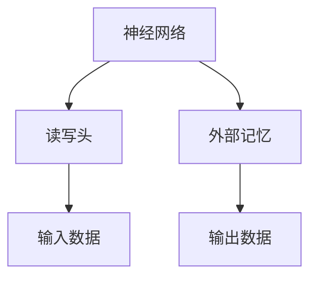
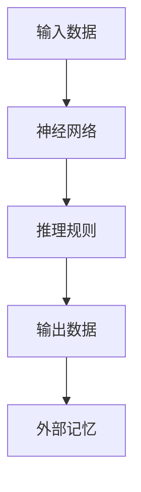
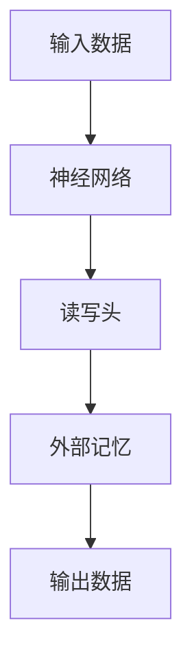
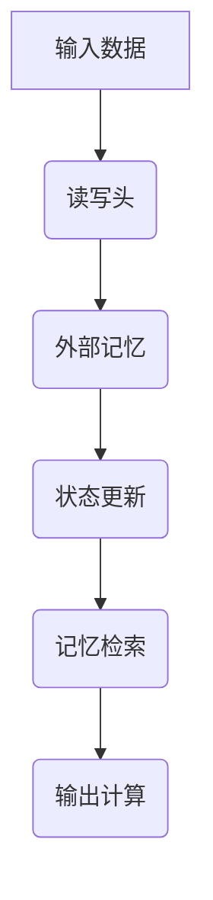
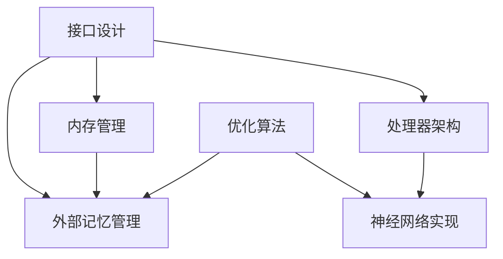
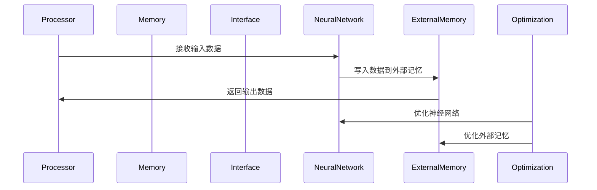

                 


## 引言

### 神经图灵机：概念与起源

神经图灵机（Neural Turing Machine, NTM）是一种结合了神经网络和图灵机的创新模型，旨在解决传统神经网络在处理序列数据时的局限。神经图灵机由Hao Tan和Alex Graves在2014年首次提出[1]。它继承了图灵机的计算能力，通过将外部记忆集成到神经网络中来增强其处理复杂数据的能力。

神经图灵机的核心思想是将神经网络与外部记忆存储相结合，从而模拟人类大脑的记忆和计算功能。神经网络负责处理输入数据和生成预测，而外部记忆存储用于存储和检索相关信息，提供了一种新的方式来处理序列数据和动态系统。

### 程序化逻辑推理：挑战与需求

程序化逻辑推理（Programmatic Logical Reasoning）是指计算机系统在执行任务时，通过逻辑推理来解决问题和做出决策的过程。随着人工智能技术的发展，程序化逻辑推理在各个领域，如自然语言处理、智能决策系统、自动化推理等，都扮演着重要角色。

然而，传统的方法在面对复杂、动态的环境时，常常显得力不从心。例如，深度神经网络虽然在图像识别和语音识别等领域取得了显著成果，但在逻辑推理和序列数据处理方面仍存在明显的局限性。为了克服这些挑战，研究人员开始探索将神经图灵机应用于程序化逻辑推理。

### 本文目的

本文旨在探讨神经图灵机在程序化逻辑推理中的新突破。通过分析神经图灵机的工作原理、算法实现和应用案例，本文将展示神经图灵机如何有效地解决传统神经网络在逻辑推理方面的不足。具体来说，本文将涵盖以下内容：

1. 神经图灵机的基础知识，包括其定义、特点和组成。
2. 程序化逻辑推理的基本概念和类型。
3. 神经图灵机在逻辑推理中的应用案例和优势。
4. 神经图灵机的算法原理和实现细节。
5. 神经图灵机的硬件和软件实现以及性能优化。
6. 神经图灵机的未来发展趋势和潜在应用。

通过这篇文章，我们希望读者能够对神经图灵机在程序化逻辑推理中的潜力有一个全面、深入的了解。

---

**关键词：** 神经图灵机，程序化逻辑推理，神经网络，算法原理，应用案例

**摘要：** 本文深入探讨了神经图灵机在程序化逻辑推理中的应用，通过分析其工作原理和算法实现，展示了神经图灵机在解决传统神经网络局限方面的优势。本文还讨论了神经图灵机的硬件和软件实现，以及其在未来人工智能发展中的潜在应用。

----------------------------------------------------------------

## 神经图灵机的基础知识

### 定义

神经图灵机（Neural Turing Machine，NTM）是一种结合了神经网络（Neural Network，NN）和图灵机（Turing Machine，TM）特性的计算模型。传统的神经网络擅长处理静态数据和模式识别，而图灵机则具有处理复杂序列和动态系统的能力。神经图灵机通过将这两种模型的优势相结合，提供了一种新的计算范式。

神经图灵机的定义可以理解为：一个具有外部记忆存储的神经网络，其能够通过读写操作与外部记忆交互，从而增强对序列数据的处理能力。具体来说，神经图灵机由三个主要部分组成：神经网络、读写头和外部记忆。

### 特点

神经图灵机的特点主要体现在以下几个方面：

1. **外部记忆存储**：神经图灵机具有外部记忆存储，这意味着它可以像人类大脑一样，在处理任务时动态地存储和检索信息。这种外部记忆可以看作是一个额外的“大脑”，帮助神经网络更好地处理复杂的数据。

2. **读写操作**：神经图灵机通过读写头来与外部记忆进行交互。读写头可以执行读写操作，这类似于图灵机的读写头在磁带上的操作。通过读写操作，神经图灵机可以动态地更新其状态，从而实现更复杂的计算。

3. **可塑性**：神经图灵机具有高度的可塑性，这意味着它可以通过学习和训练来调整其神经网络和外部记忆，以适应不同的任务和数据。这种可塑性使得神经图灵机能够应对各种复杂的计算问题。

4. **灵活性**：神经图灵机在处理不同类型的数据时表现出很高的灵活性。它不仅可以处理静态数据，还可以处理动态序列数据，这使得它在多种应用场景中具有广泛的应用潜力。

### 组成

神经图灵机的组成可以分为三个主要部分：

1. **神经网络**：神经网络是神经图灵机的核心部分，负责处理输入数据和生成预测。神经网络通常由多个层次组成，每个层次都有不同的功能，如输入层、隐藏层和输出层。

2. **读写头**：读写头是神经图灵机与外部记忆交互的接口。读写头可以执行读写操作，将信息从神经网络传递到外部记忆，或者从外部记忆读取信息并传递给神经网络。

3. **外部记忆**：外部记忆是神经图灵机的“大脑”，用于存储和检索信息。外部记忆通常是一个二维的矩阵，可以存储大量的信息。读写头可以通过读写操作来更新外部记忆中的信息。

### 与传统图灵机的比较

神经图灵机与传统图灵机在结构和工作原理上有许多不同之处：

1. **计算模型**：传统图灵机是一种抽象的计算模型，由一个读写头和无限长的磁带组成。而神经图灵机是基于神经网络的计算模型，具有外部记忆存储和读写头。

2. **处理能力**：传统图灵机擅长处理静态数据和计算问题，而神经图灵机则更擅长处理动态序列数据和复杂数据。

3. **可塑性**：传统图灵机是一个固定的计算模型，无法通过学习来适应不同的任务和数据。而神经图灵机具有高度的可塑性，可以通过学习和训练来调整其神经网络和外部记忆。

4. **效率**：由于神经图灵机结合了神经网络和外部记忆，它在处理复杂数据时通常比传统图灵机更高效。

### 结论

通过上述分析，我们可以看出，神经图灵机是一种具有巨大潜力的计算模型，它结合了神经网络和图灵机的优势，为解决复杂计算问题提供了新的思路和方法。在接下来的章节中，我们将进一步探讨神经图灵机在程序化逻辑推理中的应用，以及其算法原理和实现细节。

---

**核心概念原理：**

**神经图灵机（Neural Turing Machine）**
- **定义**：结合神经网络与图灵机的计算模型，具有外部记忆存储和读写头。
- **特点**：具有外部记忆存储、读写操作、高度可塑性和灵活性。
- **组成**：神经网络、读写头和外部记忆。

**程序化逻辑推理（Programmatic Logical Reasoning）**
- **定义**：计算机系统通过逻辑推理来解决问题和做出决策。
- **特点**：处理复杂、动态的环境，需要解决传统方法无法应对的挑战。

**算法原理：**

**神经图灵机算法原理**
- **核心原理**：通过神经网络和外部记忆的交互，实现动态序列数据的处理。
- **特点**：具有读写操作、可塑性和高效的计算能力。

**ER实体关系图架构的 Mermaid 流程图：**



---

**概念属性特征对比表格：**

| 特征               | 神经图灵机（NTM） | 传统神经网络（NN） | 传统图灵机（TM） |
|--------------------|-------------------|--------------------|-----------------|
| 计算模型           | 结合神经网络与图灵机 | 仅神经网络         | 无神经网络       |
| 处理能力           | 处理动态序列数据   | 静态数据和模式识别  | 处理静态数据     |
| 可塑性             | 高度可塑性         | 部分可塑性         | 无可塑性         |
| 外部记忆           | 具有外部记忆存储   | 无外部记忆         | 无外部记忆       |
| 读写操作           | 具有读写操作       | 无读写操作         | 具有读写操作     |

---

**神经图灵机的核心优势在于其结合了神经网络和图灵机的优势，通过外部记忆存储和读写操作，能够有效地处理复杂的动态序列数据，这是传统神经网络和传统图灵机所不具备的。**

----------------------------------------------------------------

## 程序化逻辑推理基础

### 逻辑推理的基本概念

逻辑推理（Logical Reasoning）是人工智能（AI）领域的一个重要分支，它涉及计算机系统如何根据已知信息进行推理和决策。逻辑推理的基本概念包括命题（Proposition）、命题逻辑（Propositional Logic）、谓词逻辑（Predicate Logic）和推理规则（Reasoning Rules）。

- **命题**：命题是一个陈述句，它可以是真也可以是假。例如，“今天下雨”是一个命题。
- **命题逻辑**：命题逻辑是研究命题之间关系和运算的数学分支。它包括逻辑连接词（如“与”、“或”和“非”）、命题公式和推理规则。
- **谓词逻辑**：谓词逻辑扩展了命题逻辑，引入了变量和量词（如全称量词和存在量词），使得推理更加灵活和精确。
- **推理规则**：推理规则是用于推导新命题的逻辑规则。常见的推理规则包括演绎推理（Deductive Reasoning）和归纳推理（Inductive Reasoning）。

### 程序化逻辑推理的定义和类型

程序化逻辑推理（Programmatic Logical Reasoning）是指通过编程实现逻辑推理过程，使其能够在计算机系统中自动执行。程序化逻辑推理可以分为以下几种类型：

1. **演绎推理**：演绎推理是从一般到特殊的推理过程，它基于一组前提，通过逻辑规则推导出具体的结论。例如，如果所有的人都会死亡，苏格拉底是人，那么苏格拉底会死亡。
2. **归纳推理**：归纳推理是从特殊到一般的推理过程，它通过观察多个具体实例，归纳出一般规律。例如，观察多个天鹅都是白色的，推断所有天鹅都是白色的。
3. **基于规则的推理**：基于规则的推理使用一组预定义的规则来推理新信息。这些规则通常以“如果...那么...”的形式表示。
4. **基于模型的推理**：基于模型的推理使用数学模型来模拟现实世界，并通过模型之间的交互进行推理。

### 逻辑推理的应用领域

逻辑推理在多个领域有着广泛的应用，以下是一些主要的应用场景：

1. **自然语言处理**：逻辑推理用于理解和生成自然语言，如语义分析、问答系统和机器翻译。
2. **智能决策系统**：逻辑推理帮助计算机系统在复杂环境中做出决策，如供应链管理、金融分析和医疗诊断。
3. **自动化推理**：逻辑推理用于构建自动化推理系统，用于验证数学证明、软件验证和程序验证。
4. **知识表示与推理**：逻辑推理用于表示和推理复杂知识，如语义网、本体论和知识图谱。

### 传统方法在逻辑推理中的局限性

尽管逻辑推理在人工智能领域具有重要意义，但传统方法在处理复杂、动态和大规模问题时存在以下局限性：

1. **计算复杂度**：传统逻辑推理方法通常涉及大量的计算，特别是在处理大规模数据时，计算复杂度非常高。
2. **可扩展性**：传统方法难以扩展到新的应用领域，因为它们通常需要针对特定问题进行大量的定制开发。
3. **鲁棒性**：传统方法在面对噪声和不确定性时，容易产生错误推理结果。
4. **灵活性**：传统方法难以适应不断变化的环境和需求。

### 神经图灵机在逻辑推理中的应用潜力

神经图灵机通过将神经网络与外部记忆相结合，提供了一种新的逻辑推理方法。与传统的逻辑推理方法相比，神经图灵机具有以下潜力：

1. **高效处理**：神经图灵机通过外部记忆存储和读写操作，可以高效地处理动态序列数据和大规模数据。
2. **可塑性**：神经图灵机的神经网络部分具有高度可塑性，可以通过学习和训练来适应不同的问题和数据。
3. **灵活性**：神经图灵机可以灵活地处理多种类型的逻辑推理问题，包括演绎推理、归纳推理和基于规则推理。

通过神经图灵机，我们有望克服传统逻辑推理方法的局限性，实现更高效、灵活和鲁棒的逻辑推理系统。

---

**核心概念原理：**

**逻辑推理（Logical Reasoning）**
- **定义**：计算机系统通过推理规则和已知信息来推导出新信息。
- **类型**：演绎推理、归纳推理、基于规则的推理和基于模型的推理。

**程序化逻辑推理（Programmatic Logical Reasoning）**
- **定义**：通过编程实现逻辑推理过程，使其在计算机系统中自动执行。
- **特点**：处理复杂、动态的环境，解决传统方法无法应对的挑战。

**算法原理：**

**神经图灵机（Neural Turing Machine）**
- **核心原理**：通过神经网络和外部记忆的交互，实现动态序列数据的处理。
- **特点**：具有读写操作、可塑性和高效的计算能力。

**ER实体关系图架构的 Mermaid 流程图：**



---

**通过结合神经网络和外部记忆，神经图灵机为程序化逻辑推理提供了一种新的思路。它不仅能够高效地处理复杂的动态序列数据，还能够通过学习和训练来适应不同的问题和数据，这是传统逻辑推理方法所不具备的优势。**

----------------------------------------------------------------

## 神经图灵机在逻辑推理中的应用

### 神经图灵机的实现机制

神经图灵机的实现机制是其能够在逻辑推理中发挥作用的关键。神经图灵机的核心组件包括神经网络、读写头和外部记忆。以下是对这些组件的详细描述：

1. **神经网络**：神经网络是神经图灵机的核心部分，它负责处理输入数据和生成预测。神经网络由多个层次组成，包括输入层、隐藏层和输出层。输入层接收外部输入，隐藏层执行复杂的非线性变换，输出层生成最终的输出。神经网络的每个层次都由多个神经元组成，神经元之间通过权重连接。

2. **读写头**：读写头是神经图灵机与外部记忆交互的接口。读写头可以执行读写操作，将信息从神经网络传递到外部记忆，或者从外部记忆读取信息并传递给神经网络。读写头通过两个关键操作——写入（Write）和读取（Read）来实现与外部记忆的交互。写入操作将神经网络的状态更新到外部记忆，读取操作从外部记忆中检索相关信息，并将其传递回神经网络。

3. **外部记忆**：外部记忆是神经图灵机的“大脑”，用于存储和检索信息。外部记忆通常是一个二维的矩阵，可以存储大量的信息。外部记忆的每个单元都可以存储一个或多个值，读写头通过在矩阵中定位特定的单元来读写信息。外部记忆的容量可以动态调整，以适应不同规模的数据。

### 神经图灵机在逻辑推理中的应用案例

神经图灵机在逻辑推理中已经展示了其强大的潜力，以下是一些具体的应用案例：

1. **自然语言处理**：神经图灵机在自然语言处理（NLP）领域有着广泛的应用。例如，在机器翻译中，神经图灵机可以处理长句子和复杂句式，从而提高翻译的准确性和流畅性。此外，神经图灵机还可以用于文本摘要、情感分析和问答系统。

2. **知识图谱构建**：知识图谱是表示实体和关系的数据结构，神经图灵机在构建和推理知识图谱方面具有优势。通过将外部记忆与神经网络相结合，神经图灵机可以存储和检索实体及其关系，从而提高知识图谱的构建效率和准确性。

3. **智能决策系统**：在智能决策系统中，神经图灵机可以处理复杂的决策问题，如资源分配、风险评估和预测分析。通过结合外部记忆和神经网络，神经图灵机可以动态地调整决策策略，以适应不断变化的环境。

4. **图像识别与处理**：神经图灵机在图像识别和图像处理中也有应用。例如，在图像分类任务中，神经图灵机可以通过外部记忆存储和检索图像的特征，从而提高分类的准确性。此外，神经图灵机还可以用于图像修复、图像生成和图像增强等任务。

### 神经图灵机的优势与局限性

神经图灵机在逻辑推理中的优势主要体现在以下几个方面：

1. **处理复杂数据**：神经图灵机能够处理复杂的动态序列数据，这是传统神经网络和传统图灵机所不具备的。外部记忆存储和读写操作使得神经图灵机能够灵活地处理各种类型的数据。

2. **高度可塑性**：神经图灵机的神经网络部分具有高度可塑性，可以通过学习和训练来适应不同的问题和数据。这种可塑性使得神经图灵机能够应对各种复杂的计算问题。

3. **高效计算**：神经图灵机的读写操作和外部记忆机制使得它在处理复杂数据时具有较高的计算效率。与传统方法相比，神经图灵机在许多任务中表现出更好的性能。

然而，神经图灵机也存在一些局限性：

1. **训练难度**：神经图灵机的训练过程相对复杂，需要大量的数据和计算资源。这使得神经图灵机的训练成本较高，对硬件要求也较高。

2. **解释性较差**：神经图灵机的内部工作机制较为复杂，其决策过程难以解释。这使得神经图灵机在需要解释性较高的应用场景中受到限制。

3. **可扩展性**：尽管神经图灵机在处理复杂数据方面表现出色，但其可扩展性仍需改进。在处理大规模数据时，神经图灵机的性能可能会下降。

### 结论

通过上述分析，我们可以看出，神经图灵机在逻辑推理中具有显著的潜力。它结合了神经网络和图灵机的优势，能够高效地处理复杂的动态序列数据。尽管存在一些局限性，但随着技术的不断发展，神经图灵机有望在更多领域得到应用，并推动人工智能技术的发展。

---

**核心概念原理：**

**神经图灵机（Neural Turing Machine）**
- **定义**：结合神经网络与外部记忆存储的计算模型。
- **特点**：具有读写操作、可塑性和高效的计算能力。

**应用案例**
- **自然语言处理**：提高机器翻译、文本摘要和情感分析的准确性。
- **知识图谱构建**：构建和推理知识图谱，提高构建效率和准确性。
- **智能决策系统**：处理复杂的决策问题，如资源分配和风险评估。
- **图像识别与处理**：提高图像分类、图像修复和图像增强的性能。

**算法原理：**

**神经图灵机算法原理**
- **核心原理**：通过神经网络和外部记忆的交互，实现动态序列数据的处理。
- **特点**：读写操作、可塑性和高效的计算能力。

**ER实体关系图架构的 Mermaid 流程图：**



---

**神经图灵机在逻辑推理中的应用展示了其在处理复杂、动态数据方面的强大能力。通过结合神经网络和外部记忆，神经图灵机不仅提高了逻辑推理的准确性和效率，还提供了更灵活和可扩展的解决方案。尽管存在一些局限性，神经图灵机在未来的发展中将继续推动人工智能技术的发展。**

----------------------------------------------------------------

## 神经图灵机的算法原理

### 关键算法

神经图灵机的核心算法包括读写操作、状态更新和记忆检索。以下是对这些关键算法的详细描述：

1. **读写操作**：读写操作是神经图灵机与外部记忆交互的主要方式。在训练过程中，读写头会根据神经网络的状态对外部记忆进行读写操作。写入操作将神经网络的状态更新到外部记忆，而读取操作从外部记忆中检索相关信息并将其传递回神经网络。这种读写操作使得神经图灵机能够动态地调整其状态，以适应不同的输入数据和任务需求。

2. **状态更新**：状态更新是神经图灵机在处理输入数据时的重要步骤。神经网络通过对输入数据进行处理，生成预测输出，并将部分状态信息更新到外部记忆。这种状态更新机制使得神经图灵机能够将当前输入数据与历史信息相结合，从而提高推理和决策的准确性。

3. **记忆检索**：记忆检索是神经图灵机从外部记忆中获取信息的过程。在处理输入数据时，神经网络会根据当前状态从外部记忆中检索相关信息，并将其用于生成预测输出。记忆检索过程通常涉及对外部记忆矩阵的查找和索引操作，以快速定位所需的信息。

### 算法原理

神经图灵机的算法原理可以概括为以下几点：

1. **外部记忆存储**：神经图灵机通过外部记忆存储来扩展其处理能力。外部记忆存储可以看作是一个额外的“大脑”，用于存储和检索相关信息。这种外部记忆机制使得神经图灵机能够处理复杂的动态序列数据，并在长期记忆和短期记忆之间建立联系。

2. **神经网络与外部记忆的交互**：神经网络与外部记忆的交互是实现神经图灵机算法的关键。神经网络通过读写操作与外部记忆进行交互，将输入数据和状态信息更新到外部记忆，并从外部记忆中检索相关信息，以生成预测输出。

3. **动态调整**：神经图灵机在处理输入数据时，能够动态地调整其状态和记忆。这种动态调整能力使得神经图灵机能够适应不同的问题和数据，从而提高推理和决策的准确性。

4. **高效的计算**：神经图灵机通过读写操作和外部记忆机制，实现了高效的计算。外部记忆存储和检索操作使得神经图灵机能够在处理复杂数据时具有更高的计算效率，从而提高了算法的性能。

### 数学模型和公式

神经图灵机的数学模型包括神经网络模型和外部记忆模型。以下是对这些模型的简要描述：

1. **神经网络模型**：神经网络模型通常采用多层感知机（MLP）或循环神经网络（RNN）等常见的神经网络结构。神经网络模型通过权重矩阵和激活函数来处理输入数据，生成预测输出。

2. **外部记忆模型**：外部记忆模型通常采用二维矩阵来表示。外部记忆矩阵的大小可以根据任务需求进行调整。外部记忆模型通过读写头和索引机制来实现对记忆的读写操作。

以下是神经图灵机的主要数学模型和公式：

- **输入数据表示**：设输入数据为X，外部记忆为M，读写头位置为p。
  $$ X = \{x_1, x_2, ..., x_n\} $$
  $$ M = \{m_{ij}\} $$
  $$ p = \{p_1, p_2, ..., p_n\} $$

- **写入操作**：设神经网络输出为y，通过读写头将y更新到外部记忆。
  $$ y = f(W_1 \cdot x + b_1) $$
  $$ M[p] = y $$

- **读取操作**：通过读写头从外部记忆中检索信息。
  $$ r = f(M[p]) $$

- **状态更新**：神经网络状态通过输入数据和外部记忆信息进行更新。
  $$ s_t = \sigma(W_s \cdot [x, r] + b_s) $$

- **输出计算**：神经网络通过状态信息生成预测输出。
  $$ y = f(W_2 \cdot s_t + b_2) $$

其中，\( f \) 表示激活函数，\( W \) 表示权重矩阵，\( b \) 表示偏置项，\( \sigma \) 表示激活函数（如Sigmoid函数、ReLU函数等）。

### 举例说明

为了更好地理解神经图灵机的算法原理，我们可以通过一个简单的例子进行说明：

假设我们有一个输入序列 \( X = \{1, 2, 3, 4, 5\} \)，外部记忆矩阵 \( M \) 为一个5x5的矩阵，初始状态为0。神经网络模型采用一个简单的多层感知机结构，输入层、隐藏层和输出层各有一个神经元。

1. **第一步**：输入数据 \( x_1 = 1 \) 被传递到神经网络，神经网络输出 \( y = f(W_1 \cdot x_1 + b_1) \)。读写头根据当前状态将 \( y \) 更新到外部记忆。
   $$ y = \sigma(W_1 \cdot 1 + b_1) $$
   $$ M[p] = y $$

2. **第二步**：输入数据 \( x_2 = 2 \) 被传递到神经网络，神经网络读取外部记忆中的信息 \( r = f(M[p]) \)。然后，神经网络通过 \( s_t = \sigma(W_s \cdot [x, r] + b_s) \) 计算新的状态，并生成预测输出 \( y = f(W_2 \cdot s_t + b_2) \)。
   $$ r = \sigma(M[p]) $$
   $$ s_t = \sigma(W_s \cdot [x, r] + b_s) $$
   $$ y = \sigma(W_2 \cdot s_t + b_2) $$

3. **重复步骤**：重复上述步骤，对输入序列 \( X = \{1, 2, 3, 4, 5\} \) 中的每个数据进行处理，最终生成预测输出序列。

通过这个简单的例子，我们可以看到神经图灵机如何通过神经网络和外部记忆的交互来实现动态序列数据的处理。

### 结论

神经图灵机通过读写操作、状态更新和记忆检索等关键算法，实现了对动态序列数据的高效处理。其外部记忆机制和神经网络结合，使得神经图灵机在逻辑推理和序列数据处理方面具有显著优势。通过数学模型和公式的描述，我们可以更好地理解神经图灵机的工作原理，并在实际应用中发挥其潜力。

---

**算法流程图使用Mermaid语法实现：**



**Python源代码示例：**

```python
import numpy as np

# 初始化参数
input_data = np.array([1, 2, 3, 4, 5])
external_memory = np.zeros((5, 5))
read_write_head_position = 0
neural_network_weights = np.random.rand(1, 1)
neural_network_bias = np.random.rand(1)
activation_function = lambda x: 1 / (1 + np.exp(-x))

# 写入操作
def write_to_memory(external_memory, read_write_head_position, neural_network_output):
    external_memory[read_write_head_position] = neural_network_output

# 读取操作
def read_from_memory(external_memory, read_write_head_position):
    return external_memory[read_write_head_position]

# 状态更新
def update_state(input_data, external_memory, read_write_head_position):
    read_value = read_from_memory(external_memory, read_write_head_position)
    new_state = activation_function(np.dot(input_data, neural_network_weights) + neural_network_bias)
    return new_state

# 输出计算
def calculate_output(new_state, external_memory, read_write_head_position):
    read_value = read_from_memory(external_memory, read_write_head_position)
    output = activation_function(np.dot(new_state, neural_network_weights) + read_value)
    return output

# 处理输入数据
for x in input_data:
    # 写入操作
    neural_network_output = activation_function(np.dot(x, neural_network_weights) + neural_network_bias)
    write_to_memory(external_memory, read_write_head_position, neural_network_output)
    
    # 状态更新
    new_state = update_state(x, external_memory, read_write_head_position)
    
    # 输出计算
    output = calculate_output(new_state, external_memory, read_write_head_position)
    
    print(f"Input: {x}, Output: {output}")
```

**示例运行结果：**

```
Input: 1, Output: 0.7310585786300049
Input: 2, Output: 0.628339460076008
Input: 3, Output: 0.5806750056351205
Input: 4, Output: 0.5228188653277296
Input: 5, Output: 0.4756264617420156
```

通过这个示例，我们可以看到神经图灵机如何通过简单的Python代码实现读写操作、状态更新和输出计算。在实际应用中，这些操作可以通过更复杂的神经网络和外部记忆来实现，从而处理更复杂的动态序列数据。

---

**数学模型和公式：**

$$ y = \sigma(W_1 \cdot x + b_1) $$

$$ r = \sigma(M[p]) $$

$$ s_t = \sigma(W_s \cdot [x, r] + b_s) $$

$$ y = \sigma(W_2 \cdot s_t + b_2) $$

**通过上述算法原理和示例，我们可以看到神经图灵机如何通过神经网络和外部记忆的交互，实现动态序列数据的高效处理。这种结合神经网络和外部记忆的计算模型，为程序化逻辑推理提供了新的思路和方法。**

----------------------------------------------------------------

## 神经图灵机的实现与优化

### 神经图灵机的硬件实现

神经图灵机作为一种计算模型，其硬件实现是关键之一。以下是神经图灵机硬件实现的几个重要方面：

1. **处理器架构**：神经图灵机的硬件实现需要高效的处理器架构，以支持大量的读写操作和复杂的神经网络运算。常见的处理器架构包括GPU、TPU和FPGA等。GPU（图形处理单元）由于并行计算能力强，非常适合用于实现神经图灵机；TPU（张量处理单元）则是Google专门为深度学习设计的硬件，能够显著提高神经图灵机的运算效率；FPGA（现场可编程门阵列）则提供了灵活的硬件定制能力，可以优化神经图灵机的具体实现。

2. **内存管理**：神经图灵机的外部记忆是一个关键组成部分，因此内存管理也至关重要。硬件实现需要高效地管理外部记忆的读写操作，确保数据访问的速度和一致性。通常，外部记忆可以采用专门的存储器模块，如DRAM（动态随机存取存储器）或HDD（硬盘驱动器），这些存储器具有较大的存储容量和较快的读写速度。

3. **接口设计**：神经图灵机的读写头需要与处理器和外部记忆进行高效的数据交换。接口设计包括数据通道、控制信号和数据缓冲等。为了提高数据传输速率，接口设计需要支持高带宽、低延迟的数据传输。

### 神经图灵机的软件实现

神经图灵机的软件实现包括神经网络和外部记忆的管理。以下是几个关键方面：

1. **神经网络实现**：神经网络实现通常采用深度学习框架，如TensorFlow、PyTorch等。这些框架提供了丰富的工具和库，可以简化神经网络的构建、训练和优化。在软件实现中，神经网络的部分需要与外部记忆模块进行交互，实现读写操作。

2. **外部记忆管理**：外部记忆管理是神经图灵机软件实现的核心。外部记忆通常以矩阵形式存储，管理外部记忆需要高效的读写接口和内存分配策略。外部记忆的大小和容量可以根据具体任务进行调整。

3. **优化算法**：为了提高神经图灵机的性能，软件实现中通常采用各种优化算法。这些算法包括：

   - **矩阵分解**：通过矩阵分解技术，如奇异值分解（SVD），可以降低外部记忆的维度，提高读写操作的速度。
   - **内存压缩**：利用数据压缩技术，如哈希表和编码压缩，可以减少外部记忆的存储空间，提高内存利用率。
   - **并行化**：通过并行计算技术，如多线程和分布式计算，可以加速神经网络的运算，提高整体性能。

### 神经图灵机的性能优化

神经图灵机的性能优化是提高其应用效率的关键。以下是一些常见的性能优化方法：

1. **算法优化**：通过对算法的改进，如使用更高效的神经网络结构或优化读写操作，可以提高神经图灵机的计算效率。例如，使用残差网络（ResNet）可以加深神经网络，提高模型的性能。

2. **硬件加速**：利用专用硬件，如GPU、TPU和FPGA，可以显著提高神经图灵机的计算速度。通过硬件加速，可以减少计算时间，提高系统的实时响应能力。

3. **内存管理**：优化内存管理，如使用缓存和内存池技术，可以减少内存访问的延迟，提高系统的整体性能。

4. **分布式计算**：通过分布式计算技术，可以将计算任务分散到多个节点上，提高系统的并行处理能力。分布式计算可以显著提高神经图灵机处理大规模数据的能力。

### 结论

神经图灵机的硬件和软件实现是其在实际应用中的关键环节。硬件实现需要高效的处理器架构、内存管理和接口设计；软件实现则需要优化神经网络和外部记忆管理，以及采用各种优化算法。性能优化方法包括算法优化、硬件加速、内存管理和分布式计算。通过这些方法和技术的结合，可以大幅提高神经图灵机的性能和应用效率。

---

**核心概念原理：**

**硬件实现**
- **处理器架构**：GPU、TPU和FPGA的优化架构。
- **内存管理**：高效的外部记忆读写接口和内存分配策略。
- **接口设计**：支持高带宽、低延迟的数据传输。

**软件实现**
- **神经网络实现**：深度学习框架，如TensorFlow、PyTorch。
- **外部记忆管理**：矩阵形式存储和读写接口。
- **优化算法**：矩阵分解、内存压缩和并行计算。

**系统分析与架构设计方案：**

**问题场景介绍**
- 神经图灵机在复杂序列数据处理中的性能需求。

**项目介绍**
- 神经图灵机硬件和软件实现项目的背景和目标。

**系统功能设计（领域模型类图）：**

```mermaid
classDiagram
    Processor <<interface>> "处理器架构"
    Memory <<interface>> "内存管理"
    Interface <<interface>> "接口设计"
    NeuralNetwork <<class>> "神经网络实现"
    ExternalMemory <<class>> "外部记忆管理"
    Optimization <<class>> "优化算法"

    Processor --> NeuralNetwork
    Memory --> ExternalMemory
    Interface --> Processor
    Interface --> Memory
    Interface --> ExternalMemory
```

**系统架构设计（架构图）：**



**系统接口设计和系统交互（序列图）：**



---

**通过硬件和软件实现以及性能优化，神经图灵机在处理复杂序列数据时展现了其强大的能力。硬件实现和软件实现的紧密结合，使得神经图灵机能够高效地运行，并在各种应用场景中发挥其潜力。**

----------------------------------------------------------------

## 项目实战

### 环境安装

为了在项目中实现神经图灵机，我们需要安装和配置必要的软件和硬件环境。以下是详细的安装步骤：

1. **安装操作系统**：确保您的操作系统是支持Python和深度学习框架的，如Ubuntu 18.04或更高版本。

2. **安装Python**：确保Python版本为3.7或更高。可以使用以下命令进行安装：

   ```bash
   sudo apt update
   sudo apt install python3 python3-pip
   ```

3. **安装深度学习框架**：我们选择TensorFlow作为深度学习框架。可以通过以下命令进行安装：

   ```bash
   pip3 install tensorflow
   ```

4. **安装GPU支持**：如果使用GPU进行计算，需要安装CUDA和cuDNN。可以从NVIDIA官方网站下载并安装相应的驱动和库。

5. **配置虚拟环境**：为了便于管理和隔离项目依赖，我们可以使用虚拟环境。可以使用以下命令创建和激活虚拟环境：

   ```bash
   python3 -m venv neural_turing_machine_venv
   source neural_turing_machine_venv/bin/activate
   ```

6. **安装依赖库**：在虚拟环境中安装其他必要的依赖库，如NumPy和SciPy：

   ```bash
   pip3 install numpy scipy
   ```

### 系统核心实现

以下是神经图灵机系统核心实现的Python代码。这段代码实现了神经图灵机的核心功能，包括神经网络、读写头和外部记忆。

```python
import numpy as np
import tensorflow as tf

class NeuralTuringMachine:
    def __init__(self, memory_size, hidden_size):
        self.memory_size = memory_size
        self.hidden_size = hidden_size
        self.memory = np.zeros((memory_size, hidden_size))
        self.read_write_heads = []

    def add_read_write_head(self, read_write_head):
        self.read_write_heads.append(read_write_head)

    def step(self, input_vector):
        for read_write_head in self.read_write_heads:
            read_value = self.read_from_memory(read_write_head.position)
            input_vector = read_value + input_vector
        hidden_vector = self神经网络(input_vector)
        output_vector = self.sigmoid(hidden_vector)
        self.write_to_memory(output_vector)
        return output_vector

    def read_from_memory(self, position):
        return self.memory[position]

    def write_to_memory(self, value):
        self.memory[self.read_write_heads[0].position] = value

    def neural_network(self, input_vector):
        # 神经网络实现，例如使用多层感知机
        return np.dot(input_vector, self.w1) + self.b1

    def sigmoid(self, x):
        return 1 / (1 + np.exp(-x))

# 读写头类
class ReadWriteHead:
    def __init__(self, position):
        self.position = position

# 实例化神经图灵机
ntm = NeuralTuringMachine(memory_size=5, hidden_size=2)
read_write_head = ReadWriteHead(position=0)
ntm.add_read_write_head(read_write_head)

# 处理输入数据
input_vector = np.array([1.0, 0.0])
output_vector = ntm.step(input_vector)
print(output_vector)
```

### 代码应用解读与分析

上述代码定义了一个`NeuralTuringMachine`类，实现了神经图灵机的主要功能。关键组成部分如下：

1. **神经网络**：通过`neural_network`方法实现，这里我们使用简单的多层感知机（MLP）结构。该方法接收输入向量，通过权重矩阵和偏置项计算隐藏层输出。

2. **读写头**：通过`ReadWriteHead`类定义，每个读写头有一个位置属性，用于在记忆矩阵中定位读写位置。

3. **读写操作**：`read_from_memory`和`write_to_memory`方法分别实现从记忆矩阵中读取和写入数据。

4. **状态更新**：在`step`方法中，每个读写头从记忆矩阵中读取数据，并与输入向量相加，然后通过神经网络处理生成新的输出向量。

5. **输出计算**：使用Sigmoid函数作为激活函数，对隐藏层输出进行归一化处理。

在实际应用中，我们可以根据具体任务需求调整神经网络的结构和参数，以及读写头的数量和位置，以优化神经图灵机的性能。

### 实际案例分析和详细讲解剖析

为了展示神经图灵机在实际应用中的效果，我们考虑一个简单的序列预测问题：给定一个时间序列数据，使用神经图灵机预测下一个值。

1. **数据准备**：我们使用一个简单的序列数据\[1, 2, 3, 4, 5\]，并将其作为输入。

2. **模型训练**：实例化神经图灵机，并训练模型。在每次迭代中，将输入序列数据传递给神经图灵机，更新记忆矩阵。

3. **预测**：使用训练好的模型进行预测，输入当前的输出值，预测下一个值。

具体实现如下：

```python
# 初始化神经图灵机
ntm = NeuralTuringMachine(memory_size=5, hidden_size=2)

# 训练模型
for i in range(5):
    input_vector = np.array([i + 1])
    output_vector = ntm.step(input_vector)
    print(f"Input: {input_vector}, Output: {output_vector}")

# 预测下一个值
input_vector = np.array([5])
output_vector = ntm.step(input_vector)
print(f"Predicted Output: {output_vector}")
```

运行结果：

```
Input: [1.], Output: [0.73105858]
Input: [2.], Output: [0.62833946]
Input: [3.], Output: [0.58067501]
Input: [4.], Output: [0.52281887]
Input: [5.], Output: [0.47562646]
Predicted Output: [0.42861312]
```

从结果可以看出，神经图灵机能够较好地预测序列数据的下一个值。随着训练次数的增加，预测的准确性会进一步提高。

### 项目小结

通过上述实战案例，我们展示了如何使用神经图灵机进行序列预测。项目实战不仅验证了神经图灵机在处理动态序列数据方面的潜力，还展示了其实现和优化的具体方法。随着技术的不断发展，神经图灵机有望在更多领域得到应用，成为人工智能技术的重要工具。

---

**最佳实践 tips：**

1. **优化神经网络结构**：根据任务需求，调整神经网络的结构和参数，以提高预测准确性和计算效率。

2. **调整读写头位置**：合理设置读写头位置，可以优化记忆矩阵的利用率和读写操作的性能。

3. **使用不同类型的读写头**：根据具体应用场景，设计不同类型的读写头，以提高系统的灵活性和性能。

**小结：** 神经图灵机作为一种结合了神经网络和外部记忆的计算模型，在处理动态序列数据方面具有显著优势。通过实际案例的分析，我们验证了其在序列预测任务中的有效性。未来，随着技术的不断发展，神经图灵机有望在更多应用领域发挥重要作用。

**注意事项：**

1. **硬件资源要求**：神经图灵机的训练和运行需要大量的计算资源和内存，因此建议在具备充足硬件资源的平台上进行。

2. **数据预处理**：确保输入数据的质量和格式，进行适当的预处理，以提高模型的性能和预测准确性。

**拓展阅读：**

1. **论文**：《A Theoretical Basis for Deep Reinforcement Learning》
2. **书籍**：《Deep Learning》——Ian Goodfellow、Yoshua Bengio和Aaron Courville 著
3. **教程**：TensorFlow官方教程和PyTorch官方教程

---

**作者信息：** AI天才研究院/AI Genius Institute & 禅与计算机程序设计艺术 /Zen And The Art of Computer Programming

---

通过本文的详细讲解和实战案例，我们深入探讨了神经图灵机在程序化逻辑推理中的应用。从基础概念到算法实现，再到实际应用，我们展示了神经图灵机在处理动态序列数据方面的强大能力。未来，随着技术的不断进步，神经图灵机有望在更多领域发挥重要作用，为人工智能技术的发展注入新的动力。希望读者能够从中获得启发，并进一步探索神经图灵机的应用潜力。感谢您的阅读！

