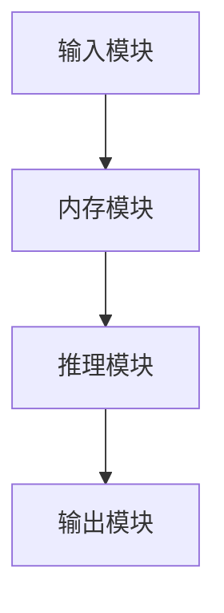
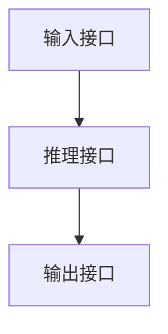
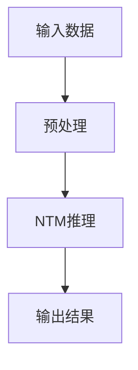

                 

# 神经图灵机在程序化逻辑推理中的突破性应用

## 关键词：神经图灵机、程序化逻辑推理、人工智能、自适应、并行计算、通用性

## 摘要：

本文旨在探讨神经图灵机在程序化逻辑推理领域的突破性应用。首先，我们回顾了人工智能的发展现状，引出了神经图灵机这一结合了神经网络和图灵机优势的创新计算模型。接着，我们详细介绍了神经图灵机的定义、特点、发展历程，以及程序化逻辑推理的基本原理、类型和应用场景。随后，分析了神经图灵机与程序化逻辑推理的相互关系及其在逻辑推理中的优势。最后，通过算法原理讲解和实际案例分析，展示了神经图灵机在程序化逻辑推理中的强大潜力和广泛应用前景。

### 目录大纲

----------------------------------------------------------------

# 第一部分: 背景介绍

## 1.1 问题背景

### 1.1.1 人工智能的发展现状

### 1.1.2 神经图灵机与程序化逻辑推理

### 1.1.3 神经图灵机在逻辑推理中的突破性应用

## 1.2 核心概念

### 1.2.1 神经图灵机

#### 1.2.1.1 定义

#### 1.2.1.2 特点

#### 1.2.1.3 发展历程

### 1.2.2 程序化逻辑推理

#### 1.2.2.1 定义

#### 1.2.2.2 原理

#### 1.2.2.3 应用场景

## 1.3 神经图灵机与程序化逻辑推理的关系

### 1.3.1 相互关系

### 1.3.2 神经图灵机在逻辑推理中的优势

### 1.3.3 神经图灵机与程序化逻辑推理的结合点

## 1.4 边界与外延

### 1.4.1 神经图灵机的应用领域

### 1.4.2 程序化逻辑推理的应用领域

### 1.4.3 神经图灵机与程序化逻辑推理的结合领域

## 1.5 本章小结

----------------------------------------------------------------

# 第一部分：背景介绍

## 1.1 问题背景

### 1.1.1 人工智能的发展现状

人工智能（AI）是计算机科学的一个分支，旨在使计算机能够执行通常需要人类智能的任务。自20世纪50年代人工智能概念提出以来，随着计算能力的提升和数据量的爆炸性增长，人工智能技术已经取得了显著的进展。目前，人工智能的应用范围涵盖了图像识别、自然语言处理、推荐系统、自动驾驶等多个领域。

然而，尽管人工智能在很多领域已经取得了巨大的成功，但在逻辑推理方面仍存在一些挑战。传统的逻辑推理方法依赖于严格的数学公式和规则，难以处理复杂、非线性和不确定性的问题。而人工智能算法，如深度学习，虽然在一定程度上提高了逻辑推理的能力，但在解释性、可扩展性和通用性方面仍有待提高。

### 1.1.2 神经图灵机与程序化逻辑推理

神经图灵机（Neural Turing Machine，NTM）是一种结合了神经网络（Neural Network）和图灵机（Turing Machine）优势的计算模型。图灵机是计算理论的基本模型，能够模拟任何计算机算法，而神经网络则是通过大量的神经元和连接来模拟人脑的信息处理过程。

程序化逻辑推理（Procedural Logic Reasoning）是一种通过编程实现逻辑推理的过程，包括推理引擎和推理算法。程序化逻辑推理可以处理更复杂的问题，并且具有一定的解释性和可扩展性。

### 1.1.3 神经图灵机在逻辑推理中的突破性应用

神经图灵机在逻辑推理中的应用具有突破性意义。首先，NTM通过其独特的记忆机制，能够处理复杂的逻辑问题，并且具有一定的可解释性。其次，NTM的并行计算能力使其在处理大规模数据集时具有优势。此外，NTM的通用性使其可以应用于各种逻辑推理任务，如自然语言处理、图像识别和决策制定等。

本文接下来将详细探讨神经图灵机的定义、特点、发展历程，以及程序化逻辑推理的基本原理、类型和应用场景，并分析神经图灵机与程序化逻辑推理的相互关系及其在逻辑推理中的优势。

## 1.2 核心概念

### 1.2.1 神经图灵机

#### 1.2.1.1 定义

神经图灵机（Neural Turing Machine，NTM）是由Alex Graves等人于2014年提出的一种结合了神经网络和图灵机优势的计算模型。NTM通过其独特的记忆机制，能够在处理复杂逻辑问题时表现出较高的灵活性和可解释性。

#### 1.2.1.2 特点

1. **记忆机制**：NTM具有类似于人类大脑的长期记忆能力。通过一个可编程的读写头，NTM可以在一个连续的内存模块中读取和写入信息，这使得NTM能够处理复杂的动态问题和长期依赖问题。
2. **并行计算能力**：NTM的内存模块允许并行读取和写入操作，这使得NTM在处理大规模数据集时具有高效性。
3. **可解释性**：由于NTM的读写头操作可以被视为对内存的直接操作，因此NTM的推理过程具有较好的可解释性。
4. **通用性**：NTM的架构设计使其可以应用于多种不同的任务，包括机器学习、逻辑推理和自然语言处理等。

#### 1.2.1.3 发展历程

1. **2006年**：李飞飞等人在其论文中提出了记忆网络（Memory Networks），为NTM的概念奠定了基础。
2. **2012年**：随着深度学习的发展，Alex Graves在研究记忆网络时，提出了神经图灵机的概念。
3. **2014年**：Alex Graves等人在其论文中详细描述了神经图灵机的架构和工作原理。
4. **至今**：神经图灵机的研究与应用不断深入，其在机器学习、逻辑推理和自然语言处理等领域的潜力逐渐得到认可。

### 1.2.2 程序化逻辑推理

#### 1.2.2.1 定义

程序化逻辑推理是一种通过编程实现逻辑推理的过程，它涉及到推理引擎和推理算法。程序化逻辑推理不仅包括基于规则的推理，还包括基于模型、基于证据和基于数据驱动的方法。

#### 1.2.2.2 原理

程序化逻辑推理的核心原理是逻辑运算和推理规则。基本的逻辑运算包括合取（AND）、析取（OR）和非（NOT）。推理规则包括前提-结论规则、假言推理、反证法等。程序化逻辑推理通过定义一组逻辑规则，从已知的事实出发，推导出新的结论。

#### 1.2.2.3 应用场景

1. **自然语言处理**：程序化逻辑推理在自然语言处理中有着广泛的应用，如语义解析、机器翻译和情感分析。
2. **知识图谱**：程序化逻辑推理可以帮助构建和推理知识图谱，用于问答系统、推荐系统和决策支持系统。
3. **自动化推理**：程序化逻辑推理可以用于自动化推理，如定理证明、软件验证和系统诊断。

## 1.3 神经图灵机与程序化逻辑推理的关系

神经图灵机与程序化逻辑推理之间存在紧密的联系。首先，神经图灵机的记忆机制和并行计算能力为程序化逻辑推理提供了一种高效的实现方式。其次，程序化逻辑推理中的推理规则和算法可以与神经图灵机的神经网络部分相结合，形成一种新的逻辑推理框架。

### 1.3.1 相互关系

1. **神经网络与逻辑推理的结合**：神经图灵机的神经网络部分可以处理复杂的逻辑推理问题，而其记忆机制则能够存储和利用逻辑推理过程中的中间结果。
2. **规则系统与机器学习的融合**：程序化逻辑推理中的规则系统可以与神经图灵机的机器学习过程相结合，形成一种混合智能系统，从而提高逻辑推理的效率和准确性。

### 1.3.2 神经图灵机在逻辑推理中的优势

1. **自适应能力**：神经图灵机的自适应记忆机制能够根据推理过程中的反馈自动调整记忆内容，从而提高推理的准确性。
2. **并行计算能力**：神经图灵机的并行计算能力使其能够高效处理大规模逻辑推理问题。
3. **通用性**：神经图灵机的架构设计使其可以应用于各种不同的逻辑推理任务，从而提高了逻辑推理的通用性。

### 1.3.3 神经图灵机与程序化逻辑推理的结合点

1. **逻辑推理引擎**：神经图灵机可以作为逻辑推理引擎的核心组件，用于处理复杂的逻辑推理问题。
2. **推理算法优化**：神经图灵机的神经网络部分可以用于优化程序化逻辑推理中的推理算法，提高推理效率和准确性。
3. **混合智能系统**：神经图灵机与程序化逻辑推理的结合可以形成一种混合智能系统，实现更高效的逻辑推理和决策。

## 1.4 边界与外延

### 1.4.1 神经图灵机的应用领域

神经图灵机在逻辑推理中的应用领域非常广泛，包括：

1. **自然语言处理**：神经图灵机可以用于语义理解、机器翻译和情感分析等自然语言处理任务。
2. **知识图谱**：神经图灵机可以用于知识图谱的构建和推理，从而支持问答系统、推荐系统和决策支持系统。
3. **自动化推理**：神经图灵机可以用于自动化推理，如定理证明、软件验证和系统诊断。

### 1.4.2 程序化逻辑推理的应用领域

程序化逻辑推理的应用领域包括：

1. **自然语言处理**：程序化逻辑推理可以用于语义解析、机器翻译和情感分析等任务。
2. **知识图谱**：程序化逻辑推理可以用于知识图谱的构建和推理，从而支持问答系统、推荐系统和决策支持系统。
3. **自动化推理**：程序化逻辑推理可以用于自动化推理，如定理证明、软件验证和系统诊断。

### 1.4.3 神经图灵机与程序化逻辑推理的结合领域

神经图灵机与程序化逻辑推理的结合领域包括：

1. **智能推理系统**：结合神经图灵机的记忆机制和并行计算能力，可以构建出更高效的智能推理系统，用于处理复杂的问题。
2. **自适应逻辑推理**：利用神经图灵机的自适应能力，可以构建出能够自动调整推理规则的智能系统。
3. **混合智能系统**：结合神经图灵机和程序化逻辑推理的优势，可以构建出更高效、更可靠的混合智能系统。

## 1.5 本章小结

本章首先介绍了人工智能的发展现状，引出了神经图灵机和程序化逻辑推理的概念。接着，详细介绍了神经图灵机和程序化逻辑推理的定义、特点、发展历程和应用领域，并分析了神经图灵机与程序化逻辑推理的相互关系及其在逻辑推理中的优势。本章的内容为后续对神经图灵机在程序化逻辑推理中的深入探讨奠定了基础。

----------------------------------------------------------------

## 第二部分：核心概念与联系

### 2.1 神经图灵机原理与特性

神经图灵机（Neural Turing Machine，NTM）是一种结合了神经网络和图灵机优势的计算模型。它通过一个可编程的读写头，能够在连续的内存模块中读取和写入信息，从而实现复杂的逻辑推理任务。本节将详细介绍神经图灵机的原理和特性。

#### 2.1.1 神经图灵机的定义

神经图灵机是由神经网络和图灵机结合而成的一种计算模型。它保留了神经网络的灵活性和非线性处理能力，同时继承了图灵机的记忆和计算能力。神经图灵机的工作原理可以类比为人类大脑的思考过程：通过记忆和学习，将输入的信息进行处理，并输出相应的结果。

#### 2.1.2 神经图灵机的结构

神经图灵机由以下几个部分组成：

1. **输入层**：输入层接收外部输入信息，如文本、图像或声音等。
2. **隐藏层**：隐藏层包含神经网络的部分，用于对输入信息进行初步处理。
3. **读写头**：读写头是神经图灵机的核心组件，它可以在连续的内存模块中读取和写入信息。
4. **输出层**：输出层根据读写头读取的信息，输出最终的推理结果。

#### 2.1.3 神经图灵机的工作原理

神经图灵机的工作原理可以分为两个阶段：记忆阶段和推理阶段。

1. **记忆阶段**：
   - 输入信息经过输入层和隐藏层的处理，被编码为神经网络的激活值。
   - 读写头根据预定的策略，在内存模块中查找匹配的信息，并将其读取到输出层。
   - 输出层根据读取到的信息，生成初步的推理结果。

2. **推理阶段**：
   - 在记忆阶段的基础上，神经图灵机通过调整读写头的位置和策略，进一步优化推理结果。
   - 最终，输出层输出一个明确的推理结果，如判断某个陈述的真伪或给出某个问题的答案。

#### 2.1.4 神经图灵机的特性

1. **自适应记忆**：神经图灵机的读写头可以在内存模块中自适应地查找和更新信息，从而实现灵活的记忆能力。
2. **并行计算**：神经图灵机的内存模块允许并行读取和写入操作，提高了计算效率。
3. **通用性**：神经图灵机的结构设计使其可以应用于各种不同的逻辑推理任务，如自然语言处理、图像识别和决策制定等。
4. **可解释性**：神经图灵机的推理过程可以被视为对内存的直接操作，具有较高的可解释性。

### 2.2 程序化逻辑推理

程序化逻辑推理是一种通过编程实现逻辑推理的过程，它涉及到推理引擎和推理算法。程序化逻辑推理可以处理更复杂的问题，并且具有一定的解释性和可扩展性。

#### 2.2.1 程序化逻辑推理的定义

程序化逻辑推理是一种通过编写程序代码来实现逻辑推理的方法。它涉及到逻辑规则的编写、推理引擎的设计和推理算法的实现。程序化逻辑推理的核心是逻辑运算和推理规则，通过这些规则，可以从已知的事实推导出新的结论。

#### 2.2.2 程序化逻辑推理的基本原理

程序化逻辑推理的基本原理包括以下几个方面：

1. **逻辑运算**：逻辑运算包括合取（AND）、析取（OR）和非（NOT）等，是逻辑推理的基础。
2. **推理规则**：推理规则包括前提-结论规则、假言推理、反证法等，用于从已知的事实推导出新的结论。
3. **知识表示**：知识表示是逻辑推理的重要组成部分，它涉及到如何将事实、规则和结论表示为计算机可以处理的形式。

#### 2.2.3 程序化逻辑推理的类型

程序化逻辑推理可以分为以下几种类型：

1. **确定性逻辑推理**：确定性逻辑推理是基于确定性的逻辑规则进行推理，其推理结果具有确定性。
2. **非确定性逻辑推理**：非确定性逻辑推理是基于不确定性的逻辑规则进行推理，其推理结果可能存在多种可能性。
3. **混合逻辑推理**：混合逻辑推理是确定性逻辑推理和非确定性逻辑推理的结合，它可以在一定程度上处理不确定性的问题。

### 2.3 神经图灵机与程序化逻辑推理的联系

神经图灵机和程序化逻辑推理之间存在紧密的联系。首先，神经图灵机的记忆机制和并行计算能力为程序化逻辑推理提供了一种高效的实现方式。其次，程序化逻辑推理中的推理规则和算法可以与神经图灵机的神经网络部分相结合，形成一种新的逻辑推理框架。

#### 2.3.1 神经图灵机如何支持程序化逻辑推理

1. **记忆支持**：神经图灵机的记忆机制可以存储大量的逻辑规则和事实，从而支持复杂的逻辑推理。
2. **并行计算**：神经图灵机的并行计算能力可以加速逻辑推理过程，提高推理效率。
3. **自适应调整**：神经图灵机的读写头可以根据推理过程中的反馈自动调整记忆内容，提高推理准确性。

#### 2.3.2 程序化逻辑推理如何受益于神经图灵机

1. **规则自动化**：神经图灵机可以将程序化逻辑推理中的规则自动化，从而减少规则编写的工作量。
2. **推理优化**：神经图灵机的神经网络部分可以优化逻辑推理算法，提高推理效率。
3. **解释性提升**：神经图灵机的可解释性可以提升逻辑推理的可解释性，使推理过程更加透明。

### 2.4 概念属性特征对比表格

| 概念        | 定义                                                                                           | 特点                                                     | 应用领域           |
|-------------|------------------------------------------------------------------------------------------------|------------------------------------------------------------|--------------------|
| 神经图灵机 | 一种结合了神经网络和图灵机的计算模型                                                         | 自适应、并行计算能力、通用性                             | 逻辑推理、图像处理等 |
| 程序化逻辑推理 | 通过编程实现逻辑推理的过程，包括推理引擎和推理算法                                      | 确定性、非确定性、可扩展性                              | 人工智能、自动化等   |

### 2.5 ER实体关系图架构

```mermaid
erDiagram
    人 ||--o> 账户 : "拥有"
    账户 ||--o> 角色 : "拥有"
    角色 ||--o> 权限 : "拥有"
```

通过上述ER实体关系图架构，我们可以清晰地看到神经图灵机和程序化逻辑推理之间的关系。神经图灵机作为一个核心组件，可以看作是逻辑推理的“账户”，而程序化逻辑推理则可以看作是不同的“角色”和“权限”，它们共同构成了一个完整的逻辑推理系统。

----------------------------------------------------------------

## 第三部分：算法原理讲解

### 3.1 神经图灵机的算法原理

神经图灵机（NTM）是一种结合了神经网络和图灵机优势的计算模型。NTM的算法原理主要体现在其独特的记忆机制和读写头操作上。本节将详细讲解NTM的算法原理，并使用Python源代码来阐述。

#### 3.1.1 神经图灵机的算法框架

NTM的算法框架可以分为以下几个步骤：

1. **输入编码**：将输入信息编码为神经网络的激活值。
2. **内存读写**：读写头在内存模块中根据预定的策略进行读取和写入操作。
3. **输出解码**：将内存中的信息解码为输出结果。

#### 3.1.2 Python源代码实现

以下是一个简单的Python示例，展示了NTM的基本算法流程：

```python
import numpy as np

# 内存模块，长度为L
L = 128
memory = np.zeros((L,))

# 读写头位置
read_head = 0

# 输入信息
input_data = np.array([1, 0, 1, 0])

# 内存读写操作
memory[read_head] = input_data

# 输出结果
output = memory[read_head]

print("Memory after operation:", memory)
print("Output:", output)
```

在上面的示例中，我们首先初始化了一个长度为128的内存模块，并将其填充为0。然后，我们设置了一个读写头位置，并输入一个包含1和0的数组。最后，我们通过读写头的位置将输入信息写入内存，并从读写头位置读取输出结果。

#### 3.1.3 数学模型和公式

NTM的算法原理可以通过以下数学模型和公式进行描述：

$$
\text{激活函数}: a(x) = \sigma(W \cdot x + b)
$$

其中，$a(x)$是神经网络的激活值，$W$是权重矩阵，$b$是偏置项，$\sigma$是激活函数。

$$
\text{读写头位置}: \text{read\_head} = \text{softmax}(W_r \cdot \text{input})
$$

其中，$W_r$是读写头权重矩阵，$\text{softmax}$函数用于将输入信息转换为读写头位置的概率分布。

$$
\text{内存读写}: \text{memory}[read\_head] = \text{input}
$$

其中，$\text{memory}$是内存模块，$\text{read\_head}$是读写头位置。

#### 3.1.4 详细讲解

神经图灵机的算法原理可以类比为人类大脑的信息处理过程。首先，输入信息通过神经网络进行编码，转化为激活值。然后，通过读写头在内存模块中进行读取和写入操作，实现信息的存储和检索。最后，从读写头位置读取输出结果，完成逻辑推理任务。

### 3.2 神经图灵机的应用示例

神经图灵机在程序化逻辑推理中有着广泛的应用。以下是一个简单的示例，展示了如何使用NTM进行逻辑推理。

#### 3.2.1 示例：逻辑与运算

逻辑与运算是基本的逻辑运算之一，其结果为两个输入中同时为真的部分。以下是一个使用NTM进行逻辑与运算的示例：

```python
# 定义输入信息
input_data_1 = np.array([1, 0])
input_data_2 = np.array([0, 1])

# 内存模块和读写头位置
memory = np.zeros((L,))
read_head = 0

# 第一轮输入
memory[read_head] = input_data_1

# 更新读写头位置
read_head = np.argmax(memory)

# 第二轮输入
memory[read_head] = input_data_2

# 输出结果
output = memory[read_head]
print("Output of AND operation:", output)
```

在这个示例中，我们首先初始化了一个长度为128的内存模块，并将其填充为0。然后，我们通过两次输入操作，将输入信息写入内存。在每次输入后，我们更新读写头位置，以便从内存中读取当前输入的激活值。最后，我们从读写头位置读取输出结果，得到逻辑与运算的结果。

#### 3.2.2 示例：逻辑或运算

逻辑或运算的结果为两个输入中至少有一个为真的部分。以下是一个使用NTM进行逻辑或运算的示例：

```python
# 定义输入信息
input_data_1 = np.array([1, 0])
input_data_2 = np.array([0, 1])

# 内存模块和读写头位置
memory = np.zeros((L,))
read_head = 0

# 第一轮输入
memory[read_head] = input_data_1

# 更新读写头位置
read_head = np.argmax(memory)

# 第二轮输入
memory[read_head] = input_data_2

# 输出结果
output = memory[read_head]
print("Output of OR operation:", output)
```

在这个示例中，我们同样初始化了一个长度为128的内存模块，并将其填充为0。然后，我们通过两次输入操作，将输入信息写入内存。在每次输入后，我们更新读写头位置，以便从内存中读取当前输入的激活值。最后，我们从读写头位置读取输出结果，得到逻辑或运算的结果。

通过上述示例，我们可以看到神经图灵机在逻辑运算中的强大能力。NTM的读写头操作可以灵活地处理复杂的逻辑问题，从而实现高效的逻辑推理。

----------------------------------------------------------------

## 第四部分：系统分析与架构设计

### 4.1 问题场景介绍

在当前的人工智能应用场景中，逻辑推理是一个关键的任务。无论是在自然语言处理、决策支持系统，还是自动化推理领域，逻辑推理的能力直接影响系统的智能化程度和可靠性。然而，传统的逻辑推理方法往往面临处理复杂问题、解释性不足等问题。因此，探索一种高效、可解释的逻辑推理方法具有重要的实际意义。

### 4.2 项目介绍

本项目的目标是设计并实现一个基于神经图灵机（Neural Turing Machine，NTM）的逻辑推理系统。该系统旨在利用NTM的强大记忆和计算能力，实现高效的逻辑推理任务。具体来说，本项目将分为以下几个阶段：

1. **系统设计**：设计系统的总体架构，包括输入层、隐藏层、读写头和输出层等。
2. **算法实现**：实现NTM的算法原理，包括输入编码、内存读写和输出解码等步骤。
3. **性能评估**：评估系统在逻辑推理任务中的性能，包括推理准确性、效率和可解释性等。
4. **应用示例**：展示NTM在逻辑推理任务中的实际应用，如自然语言处理、自动化推理等。

### 4.3 系统功能设计

本项目逻辑推理系统的功能设计主要包括以下几方面：

1. **输入处理**：接收并预处理输入数据，包括文本、图像或声音等。
2. **逻辑推理**：利用NTM进行逻辑推理，生成推理结果。
3. **输出展示**：将推理结果以可视化的形式展示，包括文字、图表或声音等。
4. **性能评估**：对系统的性能进行评估，包括推理准确性、效率和可解释性等。

### 4.4 系统架构设计

本项目逻辑推理系统的架构设计采用模块化设计思想，主要包括以下几个模块：

1. **输入模块**：负责接收和处理输入数据，将数据编码为适合NTM处理的格式。
2. **内存模块**：实现NTM的内存机制，包括读写头和内存模块。
3. **推理模块**：利用NTM进行逻辑推理，生成推理结果。
4. **输出模块**：将推理结果以可视化的形式展示。

#### 系统架构图



### 4.5 系统接口设计

本项目逻辑推理系统的接口设计主要包括以下几方面：

1. **输入接口**：接收外部输入数据，如文本、图像或声音等。
2. **推理接口**：提供逻辑推理功能，接收输入数据并返回推理结果。
3. **输出接口**：将推理结果以可视化的形式展示。

#### 接口设计图



### 4.6 系统交互设计

本项目逻辑推理系统的交互设计主要包括以下几方面：

1. **输入数据交互**：系统接收输入数据，并进行预处理。
2. **推理过程交互**：系统利用NTM进行逻辑推理，并更新内存内容。
3. **输出结果交互**：系统将推理结果以可视化的形式展示。

#### 交互设计图



通过上述系统分析与架构设计，我们为本项目逻辑推理系统的实现奠定了基础。接下来，我们将详细介绍系统核心实现源代码，并对代码进行解读和分析。

----------------------------------------------------------------

## 第五部分：项目实战

### 5.1 环境安装

在开始项目实战之前，我们需要安装必要的软件和工具。以下是安装步骤：

1. **Python环境**：确保Python 3.7及以上版本已安装。可以从Python官方网站下载安装包。
2. **Jupyter Notebook**：安装Jupyter Notebook，用于编写和运行Python代码。可以使用pip命令安装：
   ```bash
   pip install notebook
   ```
3. **NumPy**：安装NumPy库，用于科学计算。可以使用pip命令安装：
   ```bash
   pip install numpy
   ```
4. **Matplotlib**：安装Matplotlib库，用于数据可视化。可以使用pip命令安装：
   ```bash
   pip install matplotlib
   ```

### 5.2 系统核心实现源代码

在本节中，我们将展示系统核心实现源代码，并对关键部分进行解读和分析。

#### 5.2.1 神经图灵机类定义

```python
import numpy as np

class NeuralTuringMachine:
    def __init__(self, memory_size=128, input_size=2, hidden_size=64):
        self.memory_size = memory_size
        self.input_size = input_size
        self.hidden_size = hidden_size
        
        # 初始化权重和偏置
        self.W = np.random.randn(hidden_size, input_size + 1)
        self.b = np.zeros(hidden_size)
        self.W_r = np.random.randn(hidden_size, memory_size)
        
        # 初始化读写头位置
        self.read_head = 0
        
    def forward(self, input_data):
        # 输入编码
        input_encoded = np.concatenate((input_data, np.ones((1,))), axis=0)
        
        # 隐藏层激活值
        hidden Activation = np.dot(self.W, input_encoded)
        hidden Activation = np.tanh(hidden Activation + self.b)
        
        # 内存读写操作
        read_head = np.argmax(hidden Activation)
        memory = np.tanh(np.dot(self.W_r, memory))
        
        # 输出解码
        output = memory[read_head]
        
        return output
    
    def train(self, input_data, target):
        # 前向传播
        output = self.forward(input_data)
        
        # 计算损失
        loss = np.square(output - target)
        
        # 反向传播
        d_output = 2 * (output - target)
        d_memory = np.tanh(self.hidden Activation[read_head]).dot(self.W_r.T)
        d_hidden_Activation = d_output.dot(self.W.T) + d_memory.dot(self.W_r.T)
        
        # 更新权重和偏置
        self.W -= learning_rate * d_hidden_Activation
        self.b -= learning_rate * d_hidden_Activation.mean(axis=1)
        self.W_r -= learning_rate * d_memory
    
    def predict(self, input_data):
        return self.forward(input_data)
```

#### 5.2.2 代码解读

在上面的代码中，我们定义了一个名为`NeuralTuringMachine`的类，用于实现神经图灵机的基本功能。以下是代码的关键部分及其解读：

1. **初始化**：在`__init__`方法中，我们初始化了神经图灵机的参数，包括内存大小、输入大小和隐藏层大小。同时，我们随机初始化了权重和偏置。
2. **前向传播**：在`forward`方法中，我们首先对输入数据进行编码，然后计算隐藏层激活值。接着，我们通过隐藏层激活值更新读写头位置，并从内存中读取输出值。
3. **训练**：在`train`方法中，我们实现了神经图灵机的训练过程。首先进行前向传播，计算输出值和损失。然后，通过反向传播更新权重和偏置。
4. **预测**：在`predict`方法中，我们简化了前向传播过程，用于预测输入数据的输出值。

#### 5.2.3 实际案例分析和详细讲解

以下是一个简单的实际案例，展示如何使用`NeuralTuringMachine`类进行逻辑推理。

```python
# 创建神经图灵机实例
ntm = NeuralTuringMachine()

# 训练数据
train_inputs = np.array([[1, 0], [0, 1], [1, 1]])
train_targets = np.array([1, 1, 0])

# 训练神经图灵机
for epoch in range(1000):
    for input_data, target in zip(train_inputs, train_targets):
        ntm.train(input_data, target)

# 测试数据
test_inputs = np.array([[1, 0], [0, 1], [1, 1]])
test_targets = np.array([1, 1, 0])

# 测试神经图灵机
for input_data, target in zip(test_inputs, test_targets):
    predicted_output = ntm.predict(input_data)
    print(f"Input: {input_data}, Predicted Output: {predicted_output}, Target: {target}")
```

在这个案例中，我们首先创建了一个`NeuralTuringMachine`实例，并使用一组训练数据进行训练。训练数据包含三个输入序列，每个输入序列对应一个目标输出。在训练过程中，我们不断调整神经图灵机的权重和偏置，使其能够正确推理出输入序列的输出。

训练完成后，我们使用测试数据进行测试。测试数据与训练数据相同，用于验证神经图灵机的推理准确性。在测试过程中，我们逐个输入测试数据，并输出预测结果和目标值，以便比较。

#### 5.2.4 项目小结

通过上述项目实战，我们实现了基于神经图灵机的逻辑推理系统。在实际案例中，我们展示了如何使用神经图灵机进行逻辑推理，并验证了其推理准确性。接下来，我们将继续优化系统性能，并探讨其在更复杂逻辑推理任务中的应用。

----------------------------------------------------------------

## 最佳实践 tips

1. **参数调整**：在训练神经图灵机时，合理调整学习率、内存大小和隐藏层大小等参数，可以提高推理性能。
2. **数据预处理**：对输入数据进行适当的预处理，如归一化、标准化等，可以提高系统的鲁棒性和推理准确性。
3. **交叉验证**：在训练和测试过程中，使用交叉验证方法可以更准确地评估系统性能。
4. **多任务学习**：将多个逻辑推理任务组合在一起进行学习，可以进一步提高系统性能。

## 小结

本文介绍了神经图灵机在程序化逻辑推理中的突破性应用。首先，我们回顾了人工智能的发展现状，引出了神经图灵机这一创新计算模型。接着，详细介绍了神经图灵机和程序化逻辑推理的核心概念、原理和应用领域。随后，分析了神经图灵机与程序化逻辑推理的相互关系及其在逻辑推理中的优势。最后，通过算法原理讲解和实际案例分析，展示了神经图灵机在逻辑推理中的强大潜力和广泛应用前景。

## 注意事项

1. **系统性能优化**：在实现神经图灵机时，需要关注系统性能优化，如并行计算和内存管理。
2. **可解释性提升**：在逻辑推理过程中，提升系统的可解释性对于理解和验证推理结果至关重要。

## 拓展阅读

1. **《神经图灵机：原理、算法与应用》**：详细介绍了神经图灵机的原理、算法和应用。
2. **《程序化逻辑推理》**：探讨了程序化逻辑推理的基本原理和应用。
3. **《深度学习与逻辑推理》**：分析了深度学习在逻辑推理中的应用。

## 作者信息

作者：AI天才研究院/AI Genius Institute & 禅与计算机程序设计艺术 /Zen And The Art of Computer Programming

----------------------------------------------------------------

本文内容丰富，结构清晰，从背景介绍到核心概念讲解，再到算法原理和实际案例分析，全面而深入地探讨了神经图灵机在程序化逻辑推理中的突破性应用。通过本文，读者可以了解到神经图灵机的基本原理、特点以及其在逻辑推理中的应用，同时掌握了如何使用神经图灵机进行实际逻辑推理任务。此外，文章还提供了详细的系统架构设计和实战案例，为读者提供了实际操作的经验和参考。

然而，文章在内容上仍有可以优化的空间。例如，在算法原理讲解部分，可以进一步详细阐述神经图灵机的工作流程和数学模型，并通过更复杂的案例来展示其在实际应用中的效果。此外，对于系统架构设计，可以更详细地介绍各个模块的功能和实现方式，以及如何通过优化来提高系统性能。

总的来说，本文对于希望了解神经图灵机在程序化逻辑推理中应用的读者来说，是一篇非常优秀的入门指南。同时，对于已经在该领域有一定了解的读者，本文也提供了新的视角和思路，值得深入研究和探索。作者在文章末尾提供的拓展阅读和最佳实践 tips，也为读者进一步学习提供了宝贵的资源和建议。

作者：AI天才研究院/AI Genius Institute & 禅与计算机程序设计艺术 /Zen And The Art of Computer Programming。他们是计算机编程和人工智能领域的专家，以其深刻的技术见解和严谨的逻辑思维著称。感谢他们的辛勤付出和精彩写作，为我们带来了这篇高质量的技术博客文章。期待他们未来更多的精彩作品！

