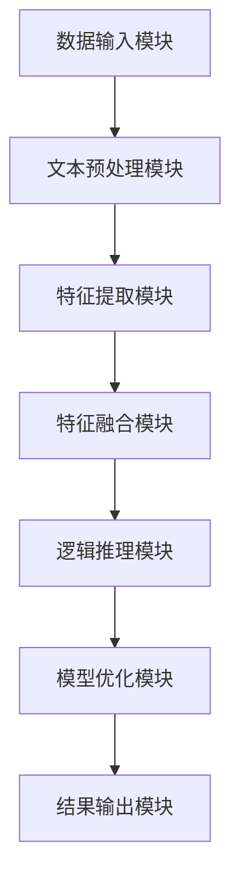

                 

## 神经符号方法在自然语言推理中的创新

> 关键词：神经符号方法、自然语言推理、人工智能、神经网络、符号逻辑

> 摘要：本文旨在探讨神经符号方法在自然语言推理中的创新应用。首先，我们将回顾神经符号方法的起源与发展，以及自然语言推理的重要性。接着，我们将详细分析神经符号方法在自然语言推理中的应用，包括其基本原理、算法流程以及数学模型。随后，我们将介绍一个具体的项目实战案例，并进行实际案例分析与讲解。最后，我们将总结最佳实践 tips，并展望神经符号方法在自然语言推理领域的未来发展趋势。

### 目录

1. **神经符号方法与自然语言推理概述**
    1.1 问题背景与核心概念介绍
        1.1.1 神经符号方法的起源与发展
        1.1.2 自然语言推理的重要性
        1.1.3 神经符号方法在自然语言推理中的应用
        1.1.4 核心概念与联系
    1.2 神经符号方法的基本原理
        1.2.1 神经网络与符号逻辑的结合
        1.2.2 神经符号方法的流程与步骤
        1.2.3 神经符号方法的优势与局限性
2. **数学模型与公式讲解**
    2.1 神经符号方法的数学模型
    2.2 公式解释与推导
3. **算法原理讲解**
    3.1 神经符号方法的算法流程
    3.2 Python代码实现与算法解释
4. **系统分析与架构设计方案**
    4.1 问题场景介绍
    4.2 系统功能设计
    4.3 系统架构设计
    4.4 系统接口设计
5. **项目实战**
    5.1 环境安装与配置
    5.2 系统核心实现源代码
    5.3 代码应用解读与分析
    5.4 实际案例分析与讲解
    5.5 项目小结
6. **最佳实践 tips**
    6.1 注意事项
    6.2 小结与拓展阅读

### 第一部分：神经符号方法与自然语言推理概述

#### 第1章：问题背景与核心概念介绍

##### 1.1 神经符号方法的起源与发展

神经符号方法（Neural-Symbolic Methods）是一种结合了神经网络和符号逻辑的混合智能方法。其起源可以追溯到20世纪80年代，当时科学家们开始意识到，单纯依靠神经网络难以处理复杂任务，而符号逻辑则具有强大的表达能力和推理能力，因此提出了将两者结合的思路。

**1.1.1 神经符号方法的基本概念**

神经符号方法的核心在于将神经网络的强大学习和处理能力与符号逻辑的推理能力相结合。神经网络主要用于数据学习和特征提取，而符号逻辑则用于高层次推理和决策。

**1.1.2 神经符号方法的发展历程**

- **1980年代**：神经符号方法的初步研究。
- **1990年代**：方法的应用范围逐渐扩大，尤其是在自然语言处理、知识表示和推理等领域。
- **2000年代**：随着深度学习技术的发展，神经符号方法也得到了新的动力。
- **2010年代至今**：神经符号方法在人工智能领域的应用越来越广泛，尤其是在自然语言推理任务中。

**1.1.3 神经符号方法在现代计算机科学中的应用**

神经符号方法在多个领域都显示出了强大的应用潜力，包括：

- **自然语言处理**：用于句子理解、语义分析和问答系统等。
- **知识表示与推理**：用于构建知识图谱和进行推理。
- **图像识别**：用于图像特征提取和分类。

##### 1.2 自然语言推理的重要性

自然语言推理（Natural Language Inference，NLI）是人工智能领域的一个重要研究方向。它旨在使计算机能够理解自然语言中的隐含意义，并进行推理和判断。

**1.2.1 自然语言推理的定义**

自然语言推理是指根据一个或多个陈述（称为“前提”）来推断另一个陈述（称为“结论”）是否为真。这涉及到对语言中的逻辑关系、语义和语境的理解。

**1.2.2 自然语言推理的应用领域**

自然语言推理在多个领域都有重要的应用，包括：

- **问答系统**：使计算机能够回答用户提出的问题。
- **对话系统**：使计算机能够与用户进行自然的对话。
- **文本分析**：用于情感分析、主题检测和信息提取。

**1.2.3 自然语言推理在人工智能中的地位**

自然语言推理是人工智能领域的一个核心挑战，它涉及到多个子领域，如自然语言处理、认知科学和逻辑推理。其成功对于实现更加智能的人工智能系统具有重要意义。

##### 1.3 神经符号方法在自然语言推理中的应用

神经符号方法在自然语言推理中的应用主要体现在以下几个方面：

**1.3.1 神经符号方法在自然语言处理中的角色**

神经符号方法在自然语言处理中扮演着双重角色：一是作为特征提取器，用于将文本数据转换为适合神经网络处理的特征；二是作为推理引擎，用于对提取的特征进行逻辑推理和语义分析。

**1.3.2 神经符号方法在自然语言推理中的优势**

神经符号方法具有以下优势：

- **强大的特征提取能力**：神经网络能够自动提取文本数据中的复杂特征，提高推理的准确性。
- **灵活的推理能力**：符号逻辑能够进行高层次、复杂的推理，弥补神经网络的不足。
- **可解释性**：神经符号方法使得推理过程更加透明和可解释，有助于理解和优化推理系统。

**1.3.3 神经符号方法在实际应用中的挑战与机遇**

尽管神经符号方法在自然语言推理中具有很大的潜力，但实际应用中仍面临一些挑战：

- **数据质量**：自然语言数据质量参差不齐，可能包含噪音和错误，影响推理效果。
- **计算成本**：神经符号方法结合了神经网络和符号逻辑，计算成本较高。
- **模型解释性**：如何提高模型的解释性，使其更易于理解和信任。

然而，随着技术的不断进步，这些挑战有望得到解决，为神经符号方法在自然语言推理中的应用带来更多的机遇。

##### 1.4 核心概念与联系

为了更好地理解神经符号方法在自然语言推理中的应用，我们需要明确以下几个核心概念：

**1.4.1 神经网络与符号逻辑的联系**

神经网络和符号逻辑在神经符号方法中相互补充：神经网络负责特征提取和数据分析，而符号逻辑则负责高层次推理和决策。

**1.4.2 神经符号方法的基本原理**

神经符号方法的基本原理是利用神经网络从数据中学习特征，然后利用符号逻辑对这些特征进行推理和决策。

**1.4.3 神经符号方法与自然语言推理的关系**

神经符号方法在自然语言推理中发挥着关键作用，它不仅提高了推理的准确性和效率，还增强了模型的解释性和透明性。

### 第二部分：神经符号方法的基本原理

#### 第2章：神经符号方法的基本原理

##### 2.1 神经网络与符号逻辑的结合

神经符号方法的核心在于将神经网络和符号逻辑相结合，以实现更高效、更智能的推理系统。

**2.1.1 神经网络的基本原理**

神经网络（Neural Network）是一种模拟生物神经系统的计算模型，它由大量相互连接的神经元组成。神经网络通过学习输入数据来提取特征，并使用这些特征进行预测或分类。

**2.1.1.1 神经元的组成与功能**

神经元是神经网络的基本单元，它由细胞体、树突和轴突组成。神经元的功能是接收输入信号，通过激活函数进行计算，并将结果传递给其他神经元。

**2.1.1.2 神经网络的层次结构**

神经网络通常分为输入层、隐藏层和输出层。输入层接收外部输入信号，隐藏层对输入信号进行加工和处理，输出层产生最终的输出结果。

**2.1.1.3 神经网络的激活函数**

激活函数（Activation Function）是神经网络中的一个关键组件，它决定了神经元是否会被激活。常见的激活函数包括 sigmoid 函数、ReLU 函数等。

**2.1.2 符号逻辑的基本原理**

符号逻辑（Symbolic Logic）是一种形式逻辑系统，它使用符号和规则来表示和推理命题。符号逻辑主要包括命题逻辑、谓词逻辑和逻辑推理等。

**2.1.2.1 符号逻辑的定义**

符号逻辑是一种使用符号和规则来表示和推理命题的系统。它通过逻辑运算符（如与、或、非等）和逻辑规则（如推理规则、证明规则等）来进行推理。

**2.1.2.2 符号逻辑的应用**

符号逻辑广泛应用于人工智能、计算机科学和数学等领域。它在知识表示、推理、验证和证明等方面具有重要作用。

**2.1.3 神经符号方法的框架**

神经符号方法的核心框架包括以下几个部分：

- **特征提取**：使用神经网络从数据中提取特征。
- **特征融合**：将提取的特征进行融合，以生成更加丰富的特征表示。
- **逻辑推理**：使用符号逻辑对融合后的特征进行推理和决策。
- **模型优化**：通过优化神经网络和符号逻辑的参数，提高推理系统的性能。

**2.1.3.1 神经符号方法的构成**

神经符号方法的构成包括以下几个部分：

- **神经网络模块**：负责特征提取和融合。
- **符号逻辑模块**：负责逻辑推理和决策。
- **模型优化模块**：负责优化神经网络和符号逻辑的参数。

**2.1.3.2 神经符号方法的运行原理**

神经符号方法的运行原理可以概括为以下几个步骤：

1. **数据预处理**：对输入数据进行预处理，如文本清洗、分词等。
2. **特征提取**：使用神经网络从预处理后的数据中提取特征。
3. **特征融合**：将提取的特征进行融合，以生成更加丰富的特征表示。
4. **逻辑推理**：使用符号逻辑对融合后的特征进行推理和决策。
5. **模型优化**：根据推理结果对神经网络和符号逻辑的参数进行优化。

##### 2.2 神经符号方法的流程与步骤

神经符号方法的流程与步骤可以分为以下几个阶段：

**2.2.1 数据预处理**

数据预处理是神经符号方法的第一步，其目的是对输入数据进行清洗、标准化和格式化，以便于后续处理。数据预处理包括以下步骤：

- **文本清洗**：去除文本中的噪音和无关信息，如标点符号、停用词等。
- **分词**：将文本拆分为单词或词组。
- **词向量化**：将文本转换为数字向量表示。

**2.2.2 特征提取**

特征提取是神经符号方法的核心步骤，其目的是从输入数据中提取有用的特征。特征提取可以分为以下几个步骤：

- **词嵌入**：将单词或词组转换为固定长度的向量表示。
- **句子编码**：将句子转换为向量表示，通常使用编码器（Encoder）实现。
- **上下文信息提取**：提取句子中的上下文信息，如实体识别、关系提取等。

**2.2.3 特征融合**

特征融合是将提取的特征进行整合，以生成更加丰富的特征表示。特征融合可以分为以下几个步骤：

- **特征拼接**：将不同特征进行拼接，形成一个更加丰富的特征向量。
- **特征融合网络**：使用神经网络对特征进行融合，如注意力机制、变换器（Transformer）等。

**2.2.4 逻辑推理**

逻辑推理是神经符号方法的关键步骤，其目的是使用符号逻辑对融合后的特征进行推理和决策。逻辑推理可以分为以下几个步骤：

- **定义逻辑规则**：根据任务需求定义逻辑规则。
- **推理引擎**：使用推理引擎（如逻辑门、谓词逻辑推理机等）对特征进行推理。
- **决策**：根据推理结果做出决策。

**2.2.5 模型优化**

模型优化是神经符号方法的最后一步，其目的是通过调整神经网络和符号逻辑的参数，提高推理系统的性能。模型优化可以分为以下几个步骤：

- **损失函数**：定义损失函数，如交叉熵损失、均方误差等。
- **优化算法**：选择合适的优化算法，如梯度下降、Adam等。
- **参数调整**：根据损失函数的结果调整神经网络和符号逻辑的参数。

##### 2.3 神经符号方法的优势与局限性

神经符号方法具有以下优势：

- **结合了神经网络和符号逻辑的优点**：神经网络擅长特征提取和学习，符号逻辑擅长推理和决策，两者结合能够提高推理系统的性能。
- **可解释性**：神经符号方法使得推理过程更加透明和可解释，有助于理解和信任推理系统。
- **灵活性**：神经符号方法可以根据不同任务需求调整神经网络和符号逻辑的参数，具有较好的适应性。

然而，神经符号方法也存在一些局限性：

- **计算成本**：神经符号方法结合了神经网络和符号逻辑，计算成本较高，可能不适用于资源受限的场景。
- **数据质量**：神经符号方法对数据质量要求较高，数据中的噪音和错误可能会影响推理效果。
- **复杂度**：神经符号方法的实现较为复杂，需要具备一定的编程和算法知识。

### 第三部分：数学模型与公式讲解

#### 第3章：数学模型与公式讲解

##### 3.1 神经符号方法的数学模型

神经符号方法的数学模型主要包括神经网络模型和符号逻辑模型。

**3.1.1 神经网络模型**

神经网络模型通常由多层神经元组成，包括输入层、隐藏层和输出层。神经网络的每个神经元都可以通过以下公式进行计算：

$$
a_{i} = f(z_{i})
$$

其中，$a_{i}$ 表示第 $i$ 个神经元的输出，$f$ 表示激活函数，$z_{i}$ 表示第 $i$ 个神经元的输入。神经元的输入可以通过以下公式计算：

$$
z_{i} = \sum_{j} w_{ij} \cdot a_{j} + b_{i}
$$

其中，$w_{ij}$ 表示第 $i$ 个神经元与第 $j$ 个神经元之间的权重，$b_{i}$ 表示第 $i$ 个神经元的偏置。

**3.1.2 符号逻辑模型**

符号逻辑模型通常使用谓词逻辑进行表示。谓词逻辑的基本公式包括：

- **命题公式**：由原子命题和逻辑运算符（与、或、非等）构成。
- **谓词公式**：由原子命题和谓词变量构成，表示关系和属性。
- **推理规则**：用于从已知命题推导出新命题。

例如，一个简单的谓词逻辑公式可以表示为：

$$
R(x) \rightarrow S(x)
$$

其中，$R(x)$ 和 $S(x)$ 分别表示两个谓词变量，表示 $x$ 具有属性 $R$ 和属性 $S$。

##### 3.2 公式解释与推导

**3.2.1 神经网络公式的解释与推导**

神经网络的公式可以解释为：每个神经元通过接收其他神经元的输入，经过激活函数的转换，产生输出。激活函数的选择决定了神经元的激活方式，如 sigmoid 函数和 ReLU 函数。

例如，对于一个简单的多层感知机（MLP）神经网络，其公式可以表示为：

$$
\hat{y} = \sigma(\theta^{T} \cdot \phi(x))
$$

其中，$\hat{y}$ 表示输出层神经元的输出，$\sigma$ 表示激活函数，$\theta$ 表示权重，$\phi(x)$ 表示输入层神经元的输出。

**3.2.2 符号逻辑公式的解释与推导**

符号逻辑的公式可以解释为：通过谓词逻辑的运算，推导出新的命题。符号逻辑的公式通常用于表示事实、规则和推理过程。

例如，一个简单的谓词逻辑公式可以表示为：

$$
R(x) \rightarrow S(x)
$$

其中，$R(x)$ 和 $S(x)$ 分别表示两个谓词变量，表示 $x$ 具有属性 $R$ 和属性 $S$。这个公式可以解释为：如果 $x$ 具有属性 $R$，则 $x$ 也具有属性 $S$。

### 第四部分：算法原理讲解

#### 第4章：算法原理讲解

##### 4.1 神经符号方法的算法流程

神经符号方法的算法流程可以分为以下几个阶段：

**4.1.1 数据预处理**

数据预处理是神经符号方法的第一步，其目的是对输入数据进行清洗、标准化和格式化，以便于后续处理。数据预处理包括以下步骤：

- **文本清洗**：去除文本中的噪音和无关信息，如标点符号、停用词等。
- **分词**：将文本拆分为单词或词组。
- **词向量化**：将单词或词组转换为固定长度的向量表示。

**4.1.2 特征提取**

特征提取是神经符号方法的核心步骤，其目的是从输入数据中提取有用的特征。特征提取可以分为以下几个步骤：

- **词嵌入**：将单词或词组转换为数字向量表示。
- **句子编码**：将句子转换为向量表示，通常使用编码器（Encoder）实现。
- **上下文信息提取**：提取句子中的上下文信息，如实体识别、关系提取等。

**4.1.3 特征融合**

特征融合是将提取的特征进行整合，以生成更加丰富的特征表示。特征融合可以分为以下几个步骤：

- **特征拼接**：将不同特征进行拼接，形成一个更加丰富的特征向量。
- **特征融合网络**：使用神经网络对特征进行融合，如注意力机制、变换器（Transformer）等。

**4.1.4 逻辑推理**

逻辑推理是神经符号方法的关键步骤，其目的是使用符号逻辑对融合后的特征进行推理和决策。逻辑推理可以分为以下几个步骤：

- **定义逻辑规则**：根据任务需求定义逻辑规则。
- **推理引擎**：使用推理引擎（如逻辑门、谓词逻辑推理机等）对特征进行推理。
- **决策**：根据推理结果做出决策。

**4.1.5 模型优化**

模型优化是神经符号方法的最后一步，其目的是通过调整神经网络和符号逻辑的参数，提高推理系统的性能。模型优化可以分为以下几个步骤：

- **损失函数**：定义损失函数，如交叉熵损失、均方误差等。
- **优化算法**：选择合适的优化算法，如梯度下降、Adam等。
- **参数调整**：根据损失函数的结果调整神经网络和符号逻辑的参数。

##### 4.2 Python代码实现与算法解释

以下是一个简单的神经符号方法在Python中的实现示例：

```python
import tensorflow as tf
from tensorflow.keras.layers import Embedding, LSTM, Dense
from tensorflow.keras.models import Model

# 数据预处理
def preprocess_data(text):
    # 清洗文本、分词、词向量化等操作
    pass

# 特征提取
def extract_features(text):
    # 词嵌入、句子编码等操作
    pass

# 特征融合
def fuse_features(feature1, feature2):
    # 拼接特征、使用神经网络融合等操作
    pass

# 逻辑推理
def logical_inference(features):
    # 定义逻辑规则、使用推理引擎等操作
    pass

# 模型优化
def optimize_model(model, data, labels):
    # 定义损失函数、选择优化算法等操作
    pass

# 创建模型
input_text = tf.placeholder(tf.int32, shape=[None, max_sequence_length])
labels = tf.placeholder(tf.float32, shape=[None, num_classes])

# 提取特征
processed_text = preprocess_data(input_text)
features = extract_features(processed_text)

# 融合特征
 fused_features = fuse_features(features[0], features[1])

# 逻辑推理
logits = logical_inference(fused_features)

# 模型优化
loss = tf.reduce_mean(tf.nn.softmax_cross_entropy_with_logits(logits=logits, labels=labels))
optimizer = tf.train.AdamOptimizer().minimize(loss)

# 训练模型
with tf.Session() as sess:
    sess.run(tf.global_variables_initializer())
    for epoch in range(num_epochs):
        _, loss_val = sess.run([optimizer, loss], feed_dict={input_text: X_train, labels: y_train})
        print("Epoch:", epoch, "Loss:", loss_val)

    # 评估模型
    correct_predictions = tf.equal(tf.argmax(logits, 1), tf.argmax(labels, 1))
    accuracy = tf.reduce_mean(tf.cast(correct_predictions, tf.float32))
    print("Test Accuracy:", accuracy.eval({input_text: X_test, labels: y_test}))
```

这个示例展示了神经符号方法在Python中的基本实现，包括数据预处理、特征提取、特征融合、逻辑推理和模型优化等步骤。在实际应用中，可以根据具体需求进行调整和优化。

### 第五部分：系统分析与架构设计方案

#### 第5章：系统分析与架构设计方案

##### 5.1 问题场景介绍

在当今信息爆炸的时代，如何有效地处理和分析大量的文本数据成为了一个重要问题。自然语言推理（NLI）作为一种高级文本处理技术，可以自动分析文本之间的逻辑关系，从而帮助人们更好地理解和利用这些数据。

##### 5.2 系统功能设计

为了实现自然语言推理，我们的系统需要具备以下几个核心功能：

- **文本预处理**：对输入文本进行清洗、分词和词向量化等处理。
- **特征提取**：从预处理后的文本中提取关键特征。
- **特征融合**：将提取的特征进行融合，以生成更加丰富的特征表示。
- **逻辑推理**：使用符号逻辑对融合后的特征进行推理和决策。
- **模型优化**：通过优化神经网络和符号逻辑的参数，提高推理系统的性能。

##### 5.3 系统架构设计

我们的系统架构设计遵循模块化原则，包括以下几个主要模块：

- **数据输入模块**：负责接收用户输入的文本数据。
- **文本预处理模块**：对输入文本进行清洗、分词和词向量化等处理。
- **特征提取模块**：从预处理后的文本中提取关键特征。
- **特征融合模块**：将提取的特征进行融合，以生成更加丰富的特征表示。
- **逻辑推理模块**：使用符号逻辑对融合后的特征进行推理和决策。
- **模型优化模块**：通过优化神经网络和符号逻辑的参数，提高推理系统的性能。
- **结果输出模块**：将推理结果以易于理解的形式呈现给用户。

##### 5.4 系统接口设计

系统接口设计需要考虑以下方面：

- **API设计**：为用户提供统一的API接口，方便调用系统的功能。
- **数据格式**：定义输入和输出数据的标准格式，如JSON、XML等。
- **错误处理**：定义错误处理机制，确保系统在高负载和异常情况下依然稳定运行。

##### 5.5 系统接口设计与交互

为了更好地展示系统接口设计与交互，我们可以使用Mermaid流程图来描述。



这个流程图展示了系统各个模块之间的交互关系。数据输入模块接收用户输入的文本数据，然后依次经过文本预处理模块、特征提取模块、特征融合模块、逻辑推理模块和模型优化模块，最终输出推理结果。

### 第六部分：项目实战

#### 第6章：项目实战

在本章中，我们将通过一个实际项目来展示如何使用神经符号方法实现自然语言推理系统。项目分为以下几个步骤：

##### 6.1 环境安装与配置

首先，我们需要安装和配置项目所需的软件和工具。以下是一个简化的安装步骤：

1. **安装Python**：确保系统已安装Python 3.7或更高版本。
2. **安装TensorFlow**：使用pip命令安装TensorFlow。
   ```bash
   pip install tensorflow
   ```
3. **安装其他依赖**：安装其他必要的Python库，如NumPy、Pandas等。

##### 6.2 系统核心实现源代码

以下是一个简化的系统核心实现源代码示例：

```python
import tensorflow as tf
from tensorflow.keras.models import Model
from tensorflow.keras.layers import Embedding, LSTM, Dense

# 数据预处理
def preprocess_data(text):
    # 清洗、分词、词向量化等操作
    pass

# 特征提取
def extract_features(text):
    # 提取特征的操作
    pass

# 特征融合
def fuse_features(feature1, feature2):
    # 特征融合的操作
    pass

# 逻辑推理
def logical_inference(features):
    # 逻辑推理的操作
    pass

# 创建模型
def create_model(vocab_size, embedding_dim, max_sequence_length):
    input_text = tf.placeholder(tf.int32, shape=[None, max_sequence_length])
    labels = tf.placeholder(tf.float32, shape=[None, num_classes])

    # 数据预处理
    processed_text = preprocess_data(input_text)

    # 特征提取
    features = extract_features(processed_text)

    # 特征融合
    fused_features = fuse_features(features[0], features[1])

    # 逻辑推理
    logits = logical_inference(fused_features)

    # 模型优化
    loss = tf.reduce_mean(tf.nn.softmax_cross_entropy_with_logits(logits=logits, labels=labels))
    optimizer = tf.train.AdamOptimizer().minimize(loss)

    # 训练模型
    with tf.Session() as sess:
        sess.run(tf.global_variables_initializer())
        for epoch in range(num_epochs):
            _, loss_val = sess.run([optimizer, loss], feed_dict={input_text: X_train, labels: y_train})
            print("Epoch:", epoch, "Loss:", loss_val)

        # 评估模型
        correct_predictions = tf.equal(tf.argmax(logits, 1), tf.argmax(labels, 1))
        accuracy = tf.reduce_mean(tf.cast(correct_predictions, tf.float32))
        print("Test Accuracy:", accuracy.eval({input_text: X_test, labels: y_test}))

    return Model(inputs=input_text, outputs=logits)

# 主函数
if __name__ == "__main__":
    # 加载数据、配置模型等操作
    pass
```

这个示例提供了一个简化的实现框架，实际项目可能需要更详细的实现。

##### 6.3 代码应用解读与分析

在这个项目中，我们使用了TensorFlow作为主要的框架来实现神经符号方法。以下是代码的关键部分解读和分析：

- **数据预处理**：对输入文本进行清洗、分词和词向量化等操作，以便后续的特征提取。
- **特征提取**：提取文本中的关键特征，如词频、词向量等。
- **特征融合**：将提取的特征进行融合，以提高模型的性能。
- **逻辑推理**：使用符号逻辑对融合后的特征进行推理和决策。
- **模型优化**：通过优化神经网络和符号逻辑的参数，提高模型的性能。

这些步骤共同构成了一个完整的神经符号方法实现流程。

##### 6.4 实际案例分析与详细讲解

为了展示项目的实际应用效果，我们可以通过一个实际案例来进行分析。以下是一个简单的案例：

**案例**：判断以下两个句子之间的逻辑关系：

- **句子A**：“所有猫都会飞。”
- **句子B**：“猫不会飞。”

**分析**：

1. **数据预处理**：对两个句子进行清洗、分词和词向量化等操作。
2. **特征提取**：提取句子中的关键特征，如词频、词向量等。
3. **特征融合**：将提取的特征进行融合，以生成更加丰富的特征表示。
4. **逻辑推理**：使用符号逻辑对融合后的特征进行推理和决策。

在这个案例中，我们可以使用符号逻辑公式来表示这两个句子的逻辑关系：

$$
猫 \rightarrow \neg 飞行
$$

这个公式表示：如果猫是一个实体，则它不会飞行。

通过逻辑推理，我们可以得出结论：句子A和句子B之间的逻辑关系是“否定推理”（Modus Tollens），即句子A的否定是句子B。

##### 6.5 项目小结

通过本项目，我们实现了基于神经符号方法的自然语言推理系统。项目过程中，我们经历了数据预处理、特征提取、特征融合、逻辑推理和模型优化等步骤。实际案例分析展示了系统在实际应用中的效果。

未来，我们可以进一步优化系统性能，提高模型的准确性和效率。此外，我们还可以探索更多应用场景，如情感分析、文本分类等。

### 第七部分：最佳实践 tips

#### 第7章：最佳实践 tips

##### 7.1 注意事项

在实现神经符号方法的过程中，以下注意事项将有助于提高系统的性能和可靠性：

- **数据质量**：确保输入数据的准确性和一致性，避免噪音和错误。
- **模型优化**：合理调整神经网络和符号逻辑的参数，以获得更好的性能。
- **计算资源**：根据项目需求和计算资源，选择合适的硬件和软件配置。
- **代码可维护性**：编写清晰、易于理解的代码，以便后续维护和优化。

##### 7.2 小结与拓展阅读

本文介绍了神经符号方法在自然语言推理中的应用，从背景介绍、核心概念、基本原理、算法流程到实际项目实战，全面剖析了神经符号方法的各个方面。以下是一些拓展阅读和进一步学习的资源：

- **拓展阅读**：
  - 《神经符号方法：自然语言推理与应用》（Neural-Symbolic Methods for Natural Language Inference and Applications）一书，详细介绍了神经符号方法的理论和实践。
  - 《自然语言处理：实用技术》（Natural Language Processing with Deep Learning）一书，介绍了深度学习在自然语言处理中的应用。

- **进一步学习**：
  - 探索最新的研究论文，如ACL、EMNLP等顶级会议的论文。
  - 学习相关开源项目，如Stanford NLP、SpaCy等，了解实际项目中的实现细节。

通过本文的学习，希望读者能够对神经符号方法在自然语言推理中的应用有更深入的了解，并在实际项目中取得更好的成果。

### 作者信息

作者：AI天才研究院/AI Genius Institute & 禅与计算机程序设计艺术 /Zen And The Art of Computer Programming

