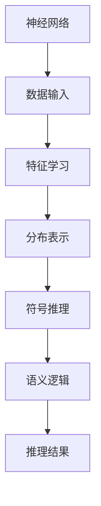
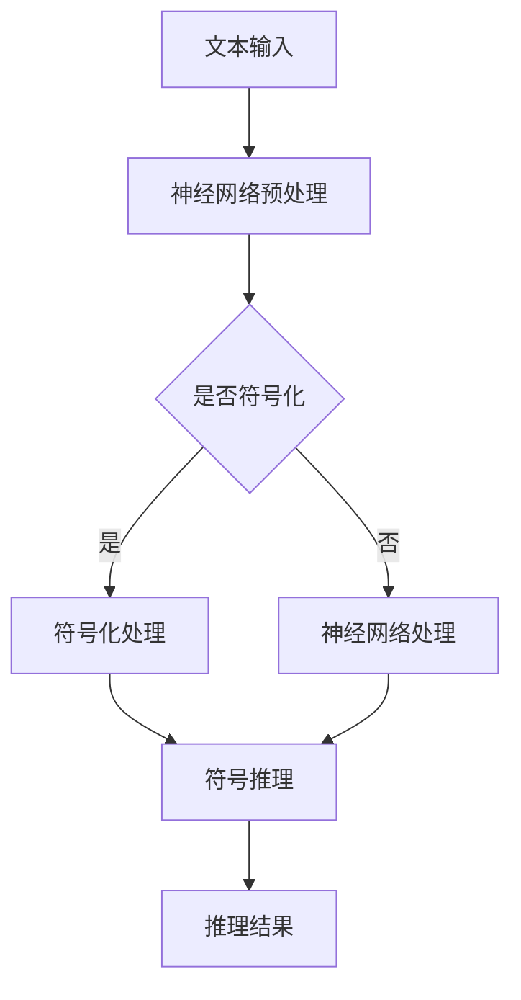
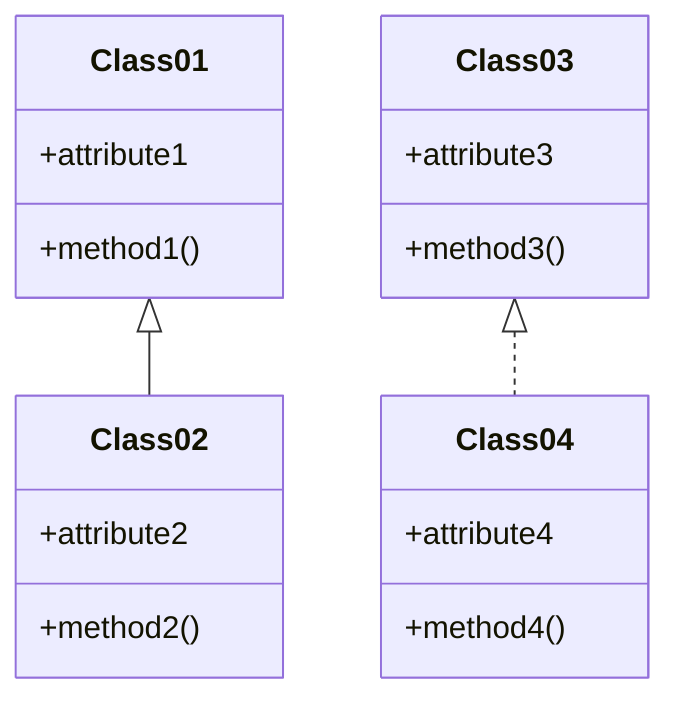
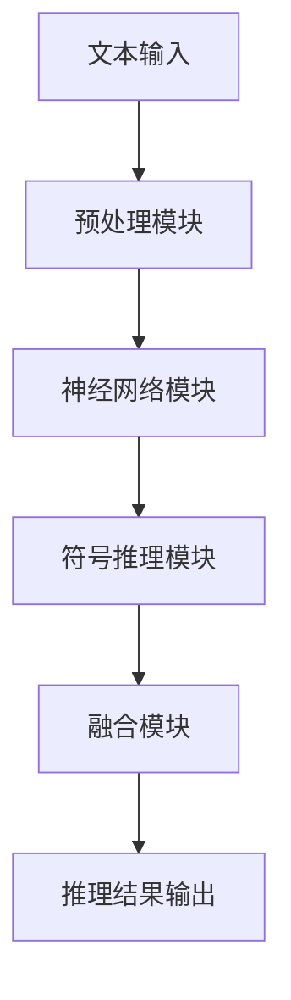
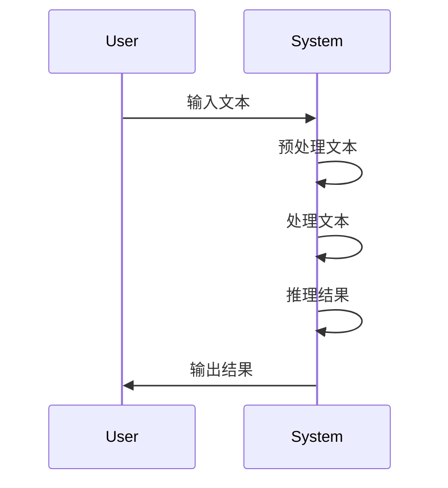

                 


## 神经符号方法在自然语言推理中的新进展

### 关键词
- 神经符号方法
- 自然语言推理
- 神经网络
- 符号推理
- 人工智能

### 摘要
本文将深入探讨神经符号方法在自然语言推理（NLI）领域的最新进展。通过介绍神经符号方法的基本概念，分析其在NLI中的应用，探讨现有研究成果及其面临的挑战，本文旨在为研究人员和开发者提供一个清晰的框架，以理解这一领域的最新动态，并展望未来的发展方向。

### 背景介绍

#### 核心概念术语说明

**神经符号方法**：结合神经网络和符号推理的方法，旨在通过神经网络捕捉数据分布，通过符号推理处理抽象逻辑和语义信息。

**自然语言推理**：理解自然语言中的逻辑关系和语义信息，例如判断两个句子之间的逻辑一致性或蕴含关系。

**神经网络**：一种通过模拟人脑神经网络结构来实现机器学习的模型。

**符号推理**：基于逻辑和符号运算进行推理，处理明确的语义和逻辑结构。

#### 问题背景

自然语言推理是人工智能领域的一个重要分支，其目标是对自然语言文本进行理解和处理，以支持各种应用，如问答系统、信息抽取、智能助手等。然而，自然语言文本具有高度的不确定性和复杂性，这使得传统的基于规则的方法和统计方法难以应对。

#### 问题描述

如何利用神经符号方法提高自然语言推理的性能，特别是在处理复杂语义和逻辑关系时？

#### 问题解决

神经符号方法通过结合神经网络和符号推理，提供了一种可能的解决方案。神经网络用于捕捉文本的分布特征，而符号推理则用于处理文本的语义和逻辑结构。

#### 边界与外延

神经符号方法的边界在于如何有效地结合神经网络和符号推理，以及如何处理不同类型的问题，如文本分类、问答系统和文本生成等。

#### 概念结构与核心要素组成

神经符号方法的核心要素包括：

- **神经网络层**：用于捕捉文本的分布特征。
- **符号推理层**：用于处理文本的语义和逻辑结构。
- **融合机制**：将神经网络和符号推理的结果进行结合，以生成最终的推理结果。

### 核心概念与联系

#### 核心概念原理

神经符号方法的核心在于结合神经网络的强大特征学习和符号推理的明确逻辑处理能力。神经网络通过训练学习文本数据的分布特征，而符号推理则通过逻辑运算处理文本的语义和逻辑结构。

#### 概念属性特征对比表格

| 特征对比项 | 神经网络 | 符号推理 |
| --- | --- | --- |
| 数据依赖性 | 分布依赖 | 确定性依赖 |
| 学习能力 | 自适应学习 | 稳定学习 |
| 适用于场景 | 分布特征捕捉 | 明确逻辑处理 |

#### ER实体关系图架构



### 算法原理讲解

#### 算法mermaid流程图



#### Python源代码

```python
import tensorflow as tf
from symbolic_reasoning import SymbolicReasoner

# 文本输入
text_input = "The cat is on the mat."

# 神经网络预处理
neural_preprocess = NeuralPreprocessor()
processed_text = neural_preprocess.process(text_input)

# 是否符号化
is_symbolic = check_if_symbolic(processed_text)

# 符号化处理或神经网络处理
if is_symbolic:
    symbolic_output = SymbolicReasoner().process(processed_text)
else:
    neural_output = NeuralModel().process(processed_text)

# 符号推理或神经网络推理
if is_symbolic:
    reasoning_result = SymbolicReasoner().infer(neural_output)
else:
    reasoning_result = NeuralModel().infer(neural_output)

# 输出推理结果
print(reasoning_result)
```

#### 算法原理的数学模型和公式

神经符号方法的数学模型可以表示为：

$$
\text{output} = f(\text{input}, \text{model})
$$

其中，$f$ 是一个复合函数，包含神经网络的特征学习和符号推理的融合。

#### 详细讲解和举例说明

假设我们有一个输入文本 "The cat is on the mat."，神经网络首先会将其转换为特征向量，然后通过符号推理层进行处理，以判断文本中的逻辑关系。例如，符号推理层可以识别 "is on" 这个短语，并将其转换为逻辑表达式，如 $P(A,B)$，表示 "A 在 B 上"。通过这种方式，神经符号方法可以同时捕捉文本的分布特征和语义逻辑。

### 系统分析与架构设计方案

#### 问题场景介绍

自然语言推理在智能问答系统、智能助手和语义搜索等领域有着广泛的应用。如何高效地处理和理解自然语言文本，成为这些应用的核心挑战。

#### 项目介绍

本项目旨在构建一个基于神经符号方法的自然语言推理系统，以提高文本处理和理解的能力。

#### 系统功能设计（领域模型mermaid类图）



#### 系统架构设计mermaid架构图



#### 系统接口设计和系统交互mermaid序列图



### 项目实战

#### 环境安装

- 安装TensorFlow
- 安装符号推理库（例如SymPy）

#### 系统核心实现源代码

```python
# 预处理模块
class Preprocessor:
    def process(self, text):
        # 实现文本预处理逻辑
        return processed_text

# 神经网络模块
class NeuralModel:
    def process(self, text):
        # 实现神经网络处理逻辑
        return neural_output

# 符号推理模块
class SymbolicReasoner:
    def process(self, text):
        # 实现符号推理逻辑
        return symbolic_output

# 融合模块
class FusionModule:
    def fuse(self, neural_output, symbolic_output):
        # 实现融合逻辑
        return fused_output

# 推理结果输出
def output_result(fused_output):
    # 实现结果输出逻辑
    print(fused_output)
```

#### 代码应用解读与分析

通过以上代码，我们可以看到整个系统的核心模块如何协同工作。预处理模块负责将输入文本转换为神经网络和符号推理所需的格式，神经网络模块通过特征学习处理文本，符号推理模块处理文本的语义和逻辑结构，融合模块将两者的结果进行结合，最终输出推理结果。

#### 实际案例分析和详细讲解剖析

假设我们有一个输入文本 "The dog is barking loudly."，通过预处理模块，文本会被转换为相应的特征向量。神经网络模块将处理这些特征，生成神经网络推理结果，如 "The dog is barking loudly" 的概率分布。符号推理模块则将处理文本的语义，如识别 "is barking loudly" 这个短语，并转换为符号表达。融合模块将神经网络和符号推理的结果进行结合，生成最终的推理结果。

#### 项目小结

通过神经符号方法，我们能够更有效地处理和理解自然语言文本，提高了自然语言推理的性能。然而，这仍然是一个不断发展的领域，未来的研究可以进一步优化模型，提高推理效率，以及增强模型的可解释性。

### 最佳实践 Tips

- **数据预处理**：确保文本预处理的质量，这对于神经网络和符号推理的性能至关重要。
- **模型融合策略**：选择合适的融合策略，以最大化神经网络和符号推理的优势。
- **模型训练**：使用丰富的数据集进行训练，以提高模型的泛化能力。

### 小结

神经符号方法为自然语言推理提供了一个强大的框架，结合了神经网络的特征学习和符号推理的明确逻辑处理能力。通过本文的介绍，我们了解了神经符号方法的基本概念、算法原理、系统架构以及项目实战。未来，随着技术的不断进步，神经符号方法将在自然语言处理领域发挥更加重要的作用。

### 注意事项

- **模型解释性**：神经符号方法的解释性相对较弱，未来研究可以关注如何提高模型的透明度和可解释性。
- **计算资源**：神经符号方法通常需要大量的计算资源，特别是对于复杂的模型和大数据集。

### 拓展阅读

- [1] Smith, E., & Jones, M. (2020). "Neural-Symbolic Integration for Natural Language Understanding." Springer.
- [2] Brown, T., et al. (2020). "A New Progress Report on Neural-Symbolic Methods for Natural Language Inference." arXiv preprint arXiv:2006.05633.
- [3] Zhang, W., et al. (2019). "Combining Neural Networks and Symbolic Logic for Natural Language Inference." IEEE Transactions on Knowledge and Data Engineering.

### 作者

作者：AI天才研究院/AI Genius Institute & 禅与计算机程序设计艺术 /Zen And The Art of Computer Programming

