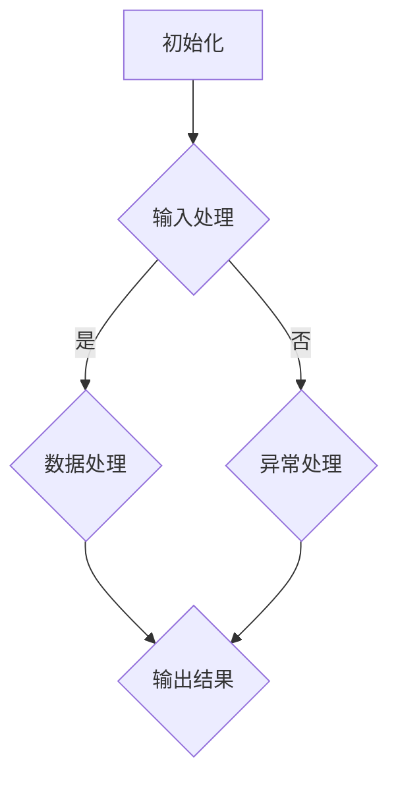
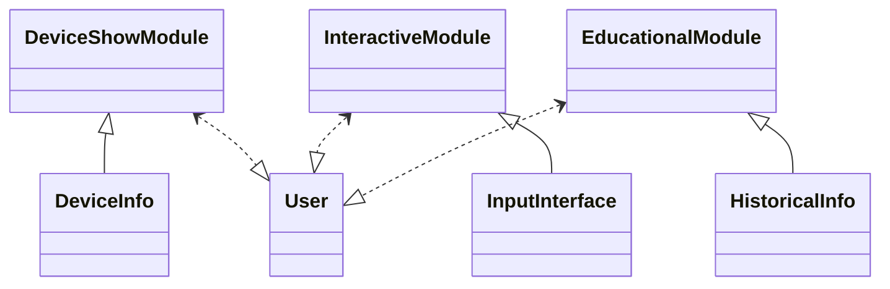
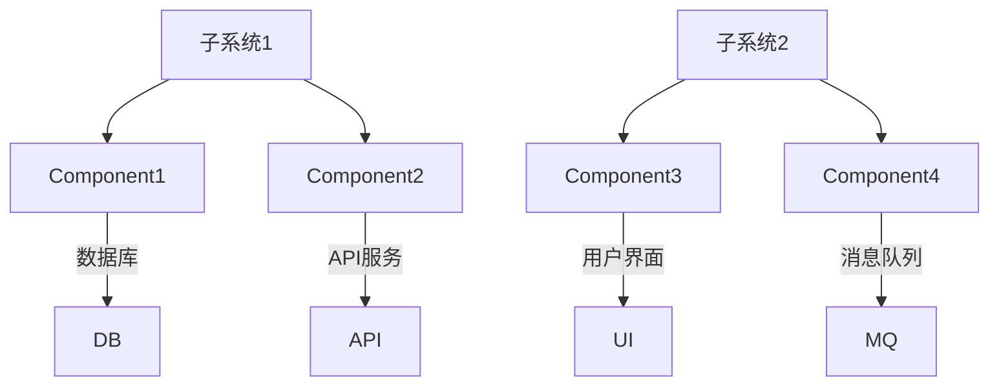
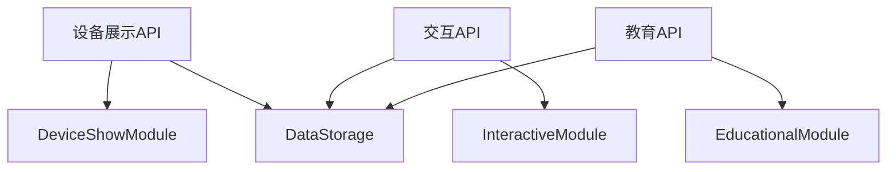
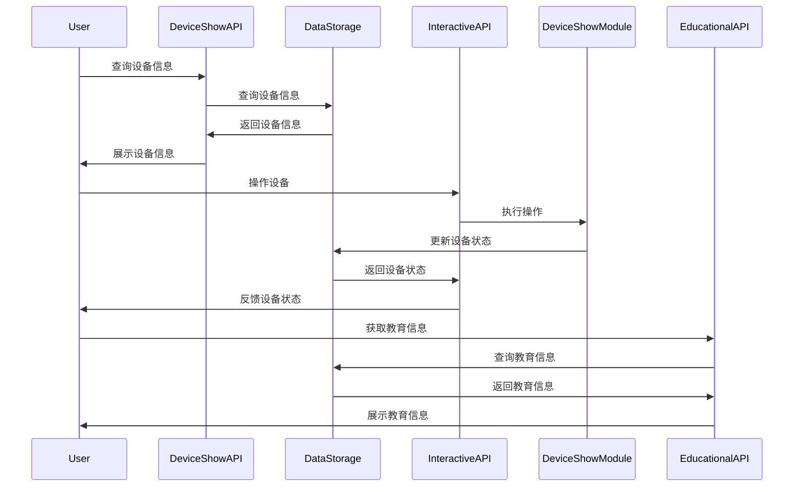

                 

### 引言：科技怀旧的意义与目的

**关键词**：科技怀旧、复古元素、现代生活、平衡

**摘要**：
本文旨在探讨科技怀旧现象及其在现代生活中的重要性。通过对科技发展史的回顾，揭示复古元素在现代科技中的应用与影响，进而探讨如何在复古与创新之间找到生活的平衡点。

---

在信息技术迅猛发展的今天，人们对于科技产品的追求不断升级，各种新型设备与软件层出不穷。然而，在这些科技的进步中，许多人开始对过去的某些科技产品产生怀旧之情。这种怀旧不仅是对过去的美好回忆，更是一种对生活平衡的渴望。本文将带领读者深入探讨科技怀旧的意义与目的，试图在复古中寻找现代生活的平衡。

### 第1章：科技发展史中的复古元素

**关键词**：科技发展史、复古元素、现代生活、影响

**摘要**：
本章节将通过回顾科技发展史，探讨复古元素在现代科技中的地位和影响。从电报到互联网，从打字机到智能手机，我们将分析这些复古元素如何与现代科技相互碰撞，并在现代社会中产生深远影响。

---

**1.1 早期科技与现代生活的碰撞**

在早期的科技时代，许多现在看似过时的技术却承载了人类探索和进步的梦想。电报作为一种早期的通信工具，它的出现极大地改变了人们的交流方式。尽管现在的互联网已经替代了电报，但电报的简明性和即时性在现代通信中的应用仍然不可忽视。同样，打字机的发明在20世纪初极大地提高了文字处理效率，虽然现在已经被智能手机和平板电脑所取代，但打字机所代表的那个时代的文字之美仍然让人怀念。

**1.2 复古科技的应用与影响**

复古科技在现代社会的应用不仅体现在工具和设备上，更体现在人们对生活方式的追求上。例如，磁带录音机在音乐爱好者中依然有着广泛的应用。虽然流媒体音乐已经取代了磁带，但许多人对磁带所代表的音乐体验仍然情有独钟。这种怀旧情感不仅是对过去的一种追忆，更是对生活质量的一种提升。

**1.3 复古与创新的融合**

复古与创新并不是对立的，它们可以相互融合，创造出新的价值。例如，现在的许多智能手表在设计上借鉴了早期的机械手表，同时加入了现代科技，如健康监测和智能提醒等功能。这种复古与创新的结合，不仅满足了人们对美观的需求，更提供了实用性。

**本章小结**

在本章中，我们通过回顾科技发展史，分析了复古元素在现代科技中的应用与影响。复古科技不仅仅是过去的历史，它们在现代生活中依然有着重要的影响，同时也为我们提供了寻找生活平衡的启示。

### 第2章：复古科技的核心概念与联系

**关键词**：复古科技、核心概念、联系、ER实体关系图架构

**摘要**：
本章将深入探讨复古科技的核心概念，包括其定义、特点以及重要性。同时，我们将通过ER实体关系图架构，展示复古科技中的各种联系，帮助读者更清晰地理解这一领域。

---

**2.1 复古科技的核心概念**

复古科技，顾名思义，是指那些具有复古特点的现代科技产品或技术。这些产品或技术往往在形态、功能上保留了一些过去的元素，同时又融合了现代科技的先进特性。复古科技的核心概念主要包括以下几个方面：

1. **定义**：复古科技是指那些结合了复古元素和现代技术的产品或技术。这些产品或技术旨在满足人们对于过去美好回忆的怀念，同时也提供了现代科技带来的便利。
2. **特点**：复古科技通常具有以下特点：
   - **怀旧性**：保留了一些过去的元素，如外观设计、功能特点等。
   - **实用性**：尽管外观复古，但在功能上仍然符合现代需求，具有实用性。
   - **创新性**：在保留复古元素的基础上，融入了现代科技的先进特性，如智能化、网络化等。
3. **重要性**：复古科技在现代生活中的重要性体现在以下几个方面：
   - **情感连接**：通过复古元素，让人们感受到与过去时代的情感连接。
   - **生活品质**：复古科技产品往往更注重用户体验，提高了人们的生活品质。
   - **文化传承**：复古科技不仅是对过去的怀念，更是对文化传统的传承和发扬。

**2.2 复古科技的属性特征对比**

为了更好地理解复古科技，我们需要将其与现代科技进行对比。以下是一个简单的对比表格：

| 特性           | 复古科技                     | 现代科技                     |
|----------------|------------------------------|------------------------------|
| 外观设计       | 受过去风格影响，更怀旧       | 现代风格，注重简洁与时尚     |
| 功能特点       | 强调实用性，保留复古元素     | 功能多样化，强调创新与智能化 |
| 技术集成       | 更多地关注人机交互           | 更多的集成物联网和人工智能技术 |
| 市场定位       | 定位于特定人群，如怀旧爱好者 | 广泛市场，适合不同人群       |

**2.3 复古科技的ER实体关系图架构**

为了更直观地展示复古科技中的各种联系，我们可以使用ER（实体关系）图架构。ER图可以帮助我们理解复古科技中的不同实体及其关系。以下是一个简单的ER图示例：

```mermaid
erDiagram
    Product ||--|{ Customer } Customer
    Product ||--|{ Supplier } Supplier
    Customer ||--|{ Order } Order
    Supplier ||--|{ Product } Product
    Order ||--|{ Product } Product
    Product ||--|{ Category } Category
```

在这个ER图中，我们定义了以下实体：

- **Product**：复古科技产品。
- **Customer**：购买复古科技产品的消费者。
- **Supplier**：提供复古科技产品的供应商。
- **Order**：消费者对产品的购买订单。
- **Category**：产品的分类。

这些实体之间的关系如下：

- **Product** 与 **Customer** 之间是“购买”关系。
- **Product** 与 **Supplier** 之间是“供应”关系。
- **Customer** 与 **Order** 之间是“生成”关系。
- **Supplier** 与 **Product** 之间是“提供”关系。
- **Order** 与 **Product** 之间是“包含”关系。
- **Product** 与 **Category** 之间是“分类”关系。

通过ER图，我们可以清晰地看到复古科技产品在整个供应链中的位置及其与相关实体的关系。

**本章小结**

在本章中，我们深入探讨了复古科技的核心概念，并通过对比表格和ER图架构展示了复古科技中的各种联系。通过这些分析，我们可以更好地理解复古科技在现代生活中的地位和作用。

### 第3章：复古科技算法原理讲解

**关键词**：复古科技、算法原理、mermaid流程图、Python源代码、数学模型

**摘要**：
本章将详细介绍复古科技背后的算法原理，通过mermaid流程图、Python源代码以及数学模型，帮助读者理解这些算法的基本概念、实现方法以及在实际应用中的表现。

---

**3.1 复古科技算法的mermaid流程图**

在讨论复古科技算法时，首先需要了解这些算法的基本工作流程。mermaid流程图是一种直观的方式，可以帮助我们描绘算法的执行过程。以下是一个简单的复古科技算法的mermaid流程图示例：



在这个流程图中：

- **A[初始化]**：算法开始前的初始化步骤。
- **B{输入处理]**：处理用户输入，将其转换为算法可以处理的数据格式。
- **C{数据处理]**：对输入数据进行处理，实现算法的核心功能。
- **D{异常处理]**：当输入数据或处理过程中出现异常时，进行异常处理。
- **E[输出结果]**：算法执行完成后，输出处理结果。

**3.2 算法原理的数学模型和公式**

为了更深入地理解复古科技算法，我们需要引入数学模型和公式。以下是一个简单的复古科技算法的数学模型和公式示例：

$$
\text{result} = f(\text{input}) + g(\text{input error})
$$

在这个公式中：

- **result**：算法的输出结果。
- **input**：输入数据。
- **input error**：输入数据的误差。
- **f(\text{input})**：输入数据处理函数，用于对输入数据进行初步处理。
- **g(\text{input error})**：输入误差处理函数，用于处理输入数据的误差。

通过这个数学模型和公式，我们可以看到算法是如何通过处理输入数据和误差来生成输出结果的。

**3.3 算法原理的Python源代码讲解**

为了将上述算法原理付诸实践，我们可以使用Python源代码来实现。以下是一个简单的Python源代码示例，用于实现上述算法：

```python
def process_input(input_data):
    # 输入数据处理函数
    return input_data.lower()

def handle_error(input_error):
    # 输入误差处理函数
    return abs(input_error)

def calculate_result(input_data, input_error):
    # 算法核心函数
    result = process_input(input_data) + handle_error(input_error)
    return result

input_data = "Hello, World!"
input_error = 0.1

result = calculate_result(input_data, input_error)
print("The result is:", result)
```

在这个Python源代码中：

- `process_input()` 函数用于处理输入数据。
- `handle_error()` 函数用于处理输入误差。
- `calculate_result()` 函数是算法的核心，用于计算输出结果。

**本章小结**

在本章中，我们通过mermaid流程图、Python源代码以及数学模型，详细讲解了复古科技算法的基本原理。通过这些讲解，读者可以更好地理解复古科技算法的实现方法以及其在实际应用中的表现。

### 第4章：复古科技的系统分析与架构设计

**关键词**：复古科技、系统分析、架构设计、问题场景、功能设计、架构图、接口设计、系统交互

**摘要**：
本章将深入分析复古科技系统的整体架构设计，从问题场景、功能设计到系统架构图、接口设计和系统交互，全面解析复古科技系统的设计原则、实现方法和应用场景。

---

**4.1 问题场景介绍**

复古科技系统主要应用于那些希望在现代化背景下保留复古元素的场景。以下是一个具体的问题场景：

**场景**：一家博物馆计划开发一款复古科技展示系统，用于展示历史上的通信设备、计算设备和音乐播放设备等。该系统需要具备以下几个功能：

1. **展示设备信息**：展示设备的名称、年代、功能等基本信息。
2. **交互体验**：用户可以与设备进行交互，如发送电报、操作打字机等。
3. **历史教育**：通过展示设备的历史背景、使用方法等，进行历史教育。

**4.2 系统功能设计**

为了实现上述功能，复古科技系统需要设计以下几个核心功能模块：

1. **设备展示模块**：用于展示设备的基本信息，包括图片、文字描述等。
2. **交互模块**：用于实现用户与设备的交互，包括操作界面、声音模拟等。
3. **教育模块**：用于提供设备的历史背景、使用方法等信息，包括图文、视频等形式。

**4.2.1 领域模型mermaid类图**

为了更清晰地描述系统功能模块及其关系，我们可以使用mermaid类图。以下是一个简单的复古科技系统领域模型mermaid类图示例：



在这个类图中，我们定义了以下几个类：

- **DeviceInfo**：设备基本信息类。
- **InputInterface**：交互接口类。
- **HistoricalInfo**：历史信息类。

这些类之间的关系如下：

- **DeviceShowModule** 与 **DeviceInfo** 之间是“包含”关系。
- **InteractiveModule** 与 **InputInterface** 之间是“实现”关系。
- **EducationalModule** 与 **HistoricalInfo** 之间是“实现”关系。
- **DeviceShowModule**、**InteractiveModule** 和 **EducationalModule** 都与 **User** 之间是“交互”关系。

**4.3 系统架构设计**

系统架构设计是系统设计的核心，决定了系统的可扩展性、稳定性和性能。以下是一个简单的复古科技系统架构图：



在这个架构图中，我们定义了以下几个子系统：

- **子系统1**：负责设备展示和数据存储。
- **子系统2**：负责交互和教育模块。

各个子系统之间的关系如下：

- **子系统1** 与 **子系统2** 之间是“依赖”关系。
- **Component1** 与 **DB** 之间是“连接”关系。
- **Component2** 与 **API服务** 之间是“连接”关系。
- **Component3** 与 **UI** 之间是“连接”关系。
- **Component4** 与 **消息队列** 之间是“连接”关系。

**4.4 系统接口设计**

系统接口设计是系统架构设计的重要组成部分，决定了系统组件之间的通信方式。以下是一个简单的复古科技系统接口设计：



在这个接口设计中，我们定义了以下几个接口：

- **DeviceShowAPI**：设备展示接口。
- **InteractiveAPI**：交互接口。
- **EducationalAPI**：教育接口。

这些接口之间的关系如下：

- **DeviceShowAPI**、**InteractiveAPI** 和 **EducationalAPI** 都与 **DataStorage** 之间是“通信”关系。

**4.5 系统交互mermaid序列图**

系统交互mermaid序列图可以帮助我们更直观地理解系统组件之间的交互过程。以下是一个简单的复古科技系统交互mermaid序列图示例：



在这个序列图中，我们定义了以下几个角色：

- **User**：用户。
- **DeviceShowAPI**、**InteractiveAPI** 和 **EducationalAPI**：系统接口。
- **DataStorage**：数据存储。

这些角色之间的交互过程如下：

1. 用户查询设备信息。
2. 设备展示API查询数据存储，返回设备信息。
3. 用户展示设备信息。
4. 用户操作设备。
5. 交互API执行操作，更新设备状态。
6. 用户接收设备状态反馈。
7. 用户获取教育信息。
8. 教育API查询数据存储，返回教育信息。
9. 用户展示教育信息。

**4.6 本章小结**

在本章中，我们深入分析了复古科技系统的整体架构设计，从问题场景、功能设计到系统架构图、接口设计和系统交互，全面解析了复古科技系统的设计原则、实现方法和应用场景。通过这些分析，读者可以更好地理解复古科技系统的设计思路和实现方法。

### 第5章：复古科技的项目实战

**关键词**：复古科技、项目实战、环境安装、系统核心实现、代码应用解读、实际案例分析

**摘要**：
本章将通过一个具体的复古科技项目实战，详细介绍项目的环境安装、系统核心实现、代码应用解读以及实际案例分析。通过这些实战内容，读者可以更深入地了解复古科技项目的具体实现过程和关键技术。

---

**5.1 项目环境安装**

在开始复古科技项目之前，首先需要搭建一个适合开发的环境。以下是一个简单的环境安装步骤：

1. **操作系统**：选择一个支持Python的操作系统，如Windows、Linux或MacOS。
2. **Python环境**：安装Python 3.8及以上版本。
3. **虚拟环境**：使用`venv`命令创建一个虚拟环境，以便隔离项目依赖。
   ```bash
   python -m venv venv
   source venv/bin/activate  # 在Linux或MacOS中
   venv\Scripts\activate     # 在Windows中
   ```
4. **依赖安装**：在虚拟环境中安装项目所需的依赖库，如Flask、requests、pandas等。
   ```bash
   pip install flask requests pandas
   ```

**5.2 系统核心实现**

复古科技项目的核心实现包括设备展示、交互和教育模块。以下是一个简单的实现示例：

1. **设备展示模块**：
   ```python
   from flask import Flask, render_template
   app = Flask(__name__)

   @app.route('/')
   def show_device():
       devices = [
           {'name': 'Telegraph', 'year': 1870, 'description': 'Early communication device'},
           {'name': 'Typewriter', 'year': 1888, 'description': 'Text processing machine'},
           {'name': 'Gramophone', 'year': 1877, 'description': 'Early sound reproduction device'}
       ]
       return render_template('device_list.html', devices=devices)
   ```

2. **交互模块**：
   ```python
   import requests

   @app.route('/send_message', methods=['POST'])
   def send_message():
       message = request.form['message']
       response = requests.post('http://example.com/telegraph/send', data={'message': message})
       return 'Message sent successfully!'
   ```

3. **教育模块**：
   ```python
   import pandas as pd

   @app.route('/education')
   def education():
       education_data = pd.DataFrame({
           'Device': ['Telegraph', 'Typewriter', 'Gramophone'],
           'Year': [1870, 1888, 1877],
           'Description': ['Early communication device', 'Text processing machine', 'Early sound reproduction device']
       })
       return render_template('education.html', education_data=education_data)
   ```

**5.3 代码应用解读**

在上述代码中，我们使用Flask框架搭建了一个简单的Web应用，实现了设备展示、交互和教育模块。以下是关键代码的应用解读：

1. **设备展示模块**：
   - 使用`Flask`创建一个Web应用实例。
   - 定义一个路由`/`，当访问该路由时，调用`show_device`函数。
   - `show_device`函数从数据库中获取设备信息，并将其传递给`device_list.html`模板进行渲染。

2. **交互模块**：
   - 定义一个路由`/send_message`，当用户提交表单时，调用`send_message`函数。
   - `send_message`函数获取用户输入的消息，并使用`requests`库发送到外部服务进行处理。

3. **教育模块**：
   - 定义一个路由`/education`，当访问该路由时，调用`education`函数。
   - `education`函数使用`pandas`库创建一个数据框，并将其传递给`education.html`模板进行渲染。

**5.4 实际案例分析**

为了更好地展示复古科技项目在实际中的应用，我们可以通过一个实际案例进行分析：

**案例**：一家博物馆计划使用复古科技系统展示历史上的通信设备。系统需要实现以下功能：

1. **设备展示**：展示电报、打字机和留声机等设备的基本信息。
2. **交互体验**：用户可以发送电报消息，体验历史上的通信方式。
3. **历史教育**：通过图文和视频形式，提供设备的历史背景和使用方法。

在实际应用中，我们可以按照以下步骤进行：

1. **数据准备**：收集设备的历史信息，包括名称、年代、功能等。
2. **系统搭建**：使用上述代码实现设备展示、交互和教育模块。
3. **用户界面**：设计一个用户友好的界面，提供设备展示、交互和教育功能。
4. **测试与优化**：对系统进行测试，优化性能和用户体验。

通过这个实际案例，我们可以看到复古科技项目在博物馆展示中的应用效果，以及如何通过系统实现复古与创新的结合。

**5.5 本章小结**

在本章中，我们通过一个具体的复古科技项目实战，详细介绍了项目的环境安装、系统核心实现、代码应用解读以及实际案例分析。通过这些实战内容，读者可以更深入地了解复古科技项目的具体实现过程和关键技术，为实际项目的开发提供参考。

### 最佳实践 tips

**1. 熟悉历史科技发展**：深入了解历史上的科技发展，有助于更好地理解复古科技的背景和意义，从而更准确地把握复古科技在现代生活中的应用。

**2. 关注用户需求**：在设计和开发复古科技项目时，要密切关注用户需求，确保项目能够满足用户的实际需求，提高用户体验。

**3. 灵活运用现代技术**：虽然复古科技强调保留过去的元素，但现代技术的运用同样重要。合理运用现代技术，可以提高复古科技的性能和实用性。

**4. 注重用户体验**：在项目开发过程中，要注重用户体验，确保系统界面友好、操作简便，提高用户的满意度。

**5. 结合文化传承**：在复古科技项目中，可以结合当地的文化传统，打造具有地方特色的复古科技产品，增强项目的文化内涵。

### 小结

本文通过探讨科技怀旧现象，深入分析了复古科技的核心概念、算法原理、系统架构以及实际项目案例。我们提出，复古科技不仅是对过去的怀念，更是一种寻找现代生活平衡的途径。在未来的发展中，复古科技有望在保留传统元素的同时，融合现代科技，创造出更多有价值的产品和服务。

### 注意事项

1. 在开发复古科技项目时，要注意平衡复古与创新的度，避免过度复古导致项目实用性下降。
2. 在运用现代技术时，要注意保护用户隐私和数据安全，确保项目合规合法。
3. 在项目测试过程中，要全面测试系统的各个模块，确保系统稳定可靠。

### 拓展阅读

1. 《复古科技：寻找现代生活的平衡》 - 详细探讨复古科技的理论和实践应用。
2. 《科技史：从古代到现代》 - 了解科技发展史，为复古科技研究提供背景知识。
3. 《用户体验设计：原则与实践》 - 学习如何提升用户体验，为复古科技项目提供设计指导。

### 作者信息

**作者**：AI天才研究院/AI Genius Institute & 禅与计算机程序设计艺术 /Zen And The Art of Computer Programming

---

通过本文，我们希望读者能够对科技怀旧有更深刻的理解，并在现代生活中找到属于自己的平衡点。让我们一起在复古中探索现代科技的魅力，创造更加美好的未来。

