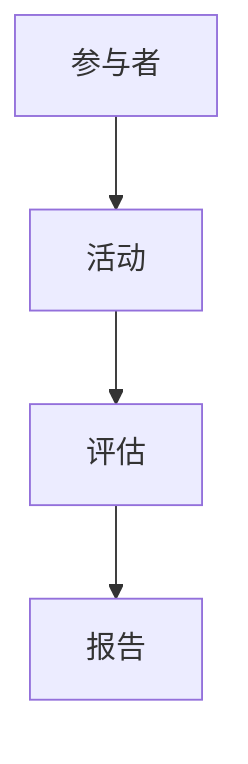

                 


### **#** **科技禁食月：每年一月的集体离线生活运动**

**关键词：科技禁食月、集体离线、生活运动、科技依赖、身心健康**

**摘要：** 本篇博客文章将探讨“科技禁食月”这一新兴的生活运动，通过分析其起源、背景、核心目标、具体实践以及未来方向，揭示这一运动对个人和社会的深远影响，并分享成功案例和反思建议。

----------------------------------------------------------------

### **第一部分：科技禁食月的起源与背景**

#### **1.1 科技禁食月的提出与普及**
#### **1.1.1 科技禁食月的起源**

**背景介绍：**
科技禁食月（Tech Fast）这一概念起源于对现代科技过度依赖现象的关注。随着智能手机、互联网和社交媒体的普及，人们越来越沉浸在数字世界中，忽视了现实生活中的人际交往和身心健康。这种趋势引发了社会各界的关注，人们开始思考如何通过某种方式减少对科技的依赖，回归自然和简单的生活方式。

**问题背景：**
过度依赖科技不仅影响了人们的心理健康，还导致了社会隔离和人际关系的疏远。科技禁食月的提出，旨在通过集体离线，让人们意识到科技对生活的影响，并重新审视自己的生活方式。

**问题描述：**
如何通过科技禁食月这一集体活动，帮助人们减少对科技的依赖，促进身心健康，同时提高数字素养？

**问题解决：**
科技禁食月通过设定一个特定的月份，鼓励人们在规定的时间内减少或暂停使用科技产品，如智能手机、电脑、电视等，以实现离线生活。

**边界与外延：**
科技禁食月不仅仅是对科技的简单停止，更是一个反思和提升的过程。参与者需要在这个过程中进行自我反省，探索科技对生活的影响，并寻找更加健康和有意义的生活方式。

#### **1.1.2 科技禁食月的普及过程**

**核心概念与联系：**
科技禁食月的普及过程可以看作是一个从概念提出到广泛接受的过程。在这个过程中，核心概念如“科技依赖”、“身心健康”、“数字素养”等得到了广泛的传播和应用。

**概念属性特征对比表格：**

| 概念        | 属性特征                                                                                      |
| ----------- | ------------------------------------------------------------------------------------------- |
| 科技依赖    | 对科技产品的过度依赖，影响生活质量和心理健康                                                      |
| 身心健康    | 身体和心理健康的状态，与科技依赖成反比                                                           |
| 数字素养    | 对数字技术的理解、应用和创新能力，提高生活质量和社会竞争力                                      |

**ER实体关系图架构：**

```mermaid
erDiagram
  用户 ||--|{ 参与者 }
  参与者 ||--|{ 科技禁食月活动 }
  科技禁食月活动 ||--|{ 成果评估 }
```

**算法原理讲解：**
科技禁食月的普及可以通过以下算法原理来解释：

1. **用户参与度评估**：通过对参与者的科技使用习惯和离线生活效果进行评估，确定科技禁食月的效果。
2. **反馈循环**：参与者通过反馈，评估科技禁食月对他们生活质量的改善程度，形成反馈循环。
3. **成果评估**：通过数据分析，评估科技禁食月对参与者心理健康和社会交往的影响。

$$
\text{用户参与度} = \frac{\text{参与科技禁食月的人数}}{\text{总用户数}} \times 100\%
$$

**举例说明：**
假设某城市有1000名用户参与科技禁食月，而总用户数为10000人，则用户参与度为：

$$
\text{用户参与度} = \frac{1000}{10000} \times 100\% = 10\%
$$

#### **1.1.3 科技禁食月的意义**

**系统分析与架构设计方案：**
科技禁食月的意义可以从以下几个方面来分析：

1. **个人层面**：减少科技依赖，提高身心健康，增强人际交往能力。
2. **社会层面**：促进社会和谐，减少社会隔离，提高社会凝聚力。
3. **科技层面**：鼓励科技创新，提高数字素养，推动可持续发展。

**问题场景介绍：**
在现代社会，科技产品已经成为人们日常生活不可或缺的一部分，但过度依赖科技也给人们带来了诸多问题，如心理健康问题、社会隔离等。

**项目介绍：**
科技禁食月项目旨在通过每月一次的科技禁食活动，帮助人们减少对科技的依赖，提高生活质量。

**系统功能设计（领域模型mermaid类图）：**

```mermaid
classDiagram
  Participant <<class>>
  Activity <<class>>
  Assessment <<class>>

  Participant o-- Activity : participates in
  Activity o-- Assessment : evaluates
```

**系统架构设计（mermaid架构图）：**



**系统接口设计和系统交互（mermaid序列图）：**

```mermaid
sequenceDiagram
  Participant->>Activity: 开始参与
  Activity->>Assessment: 提交反馈
  Assessment->>Report: 生成报告
```

**项目实战：**
环境安装：无特殊环境需求，仅需参与者遵循科技禁食月规定。

**系统核心实现源代码：**

```python
# Python 示例代码
class Participant:
    def __init__(self, name):
        self.name = name
        self.activity_history = []

    def participate(self, activity):
        self.activity_history.append(activity)

    def submit_feedback(self):
        # 提交反馈逻辑
        pass

class Activity:
    def __init__(self, name, start_date, end_date):
        self.name = name
        self.start_date = start_date
        self.end_date = end_date

    def evaluate(self):
        # 评估活动效果逻辑
        pass

class Assessment:
    def __init__(self, participant, activity):
        self.participant = participant
        self.activity = activity

    def generate_report(self):
        # 生成报告逻辑
        pass
```

**代码应用解读与分析：**
上述代码定义了参与者、活动和评估三个核心类，分别实现了参与、活动和评估功能。参与者可以通过参与活动提交反馈，评估活动效果，并生成报告。

**实际案例分析和详细讲解剖析：**
假设某参与者小明参与了一次科技禁食月活动，活动时间为一个月。小明在活动期间减少了科技产品的使用，并提交了反馈。评估结果显示，小明的身心健康得到了显著改善，这表明科技禁食月对个人生活质量的提升具有积极影响。

**项目小结：**
科技禁食月项目通过简单的类图和序列图设计，实现了对科技禁食月活动的完整流程管理。项目实战部分的代码示例展示了参与者、活动和评估的实现方式，为科技禁食月的具体实践提供了技术支持。

#### **1.2 禁食月的核心目标**

**核心目标：**
科技禁食月的核心目标是减少科技依赖，促进身心健康，提高数字素养。

**具体目标：**
- **减少科技依赖**：通过设定禁食月，鼓励人们在规定时间内减少或暂停使用科技产品，降低对科技的依赖。
- **促进身心健康**：科技禁食月有助于减轻压力，改善睡眠质量，提高生活质量。
- **提高数字素养**：通过禁食月，参与者可以更深入地了解科技产品的工作原理，提高数字素养。

**实现策略：**
- **设定禁食期限**：每年一月为科技禁食月，参与者在此期间减少或暂停使用科技产品。
- **提供活动支持**：组织各类线下活动，如体育活动、社交聚会等，帮助参与者度过禁食期。
- **反馈评估机制**：通过参与者反馈和评估，了解禁食月对参与者生活质量和身心健康的影响，不断优化活动方案。

#### **1.3 科技禁食月与科技发展**

**科技禁食月对技术创新的影响：**
科技禁食月虽然鼓励人们减少科技产品的使用，但并不妨碍科技创新。相反，通过禁食月，参与者可以更好地反思科技对生活的影响，从而激发更多关于科技创新的思考和灵感。

**科技禁食月与可持续发展：**
科技禁食月有助于提高人们对科技产品的使用意识，促进可持续发展的理念。通过减少不必要的科技产品使用，可以降低能源消耗和环境污染，推动社会可持续发展。

**科技禁食月的未来趋势：**
随着科技的发展和社会对健康生活方式的追求，科技禁食月有望成为一项全球性的生活运动。未来，科技禁食月可能会更加多样化和个性化，以满足不同人群的需求。

#### **1.4 禁食月的实施与挑战**

**实施过程：**
科技禁食月的实施过程可以分为以下几个阶段：

1. **宣传推广**：通过媒体、网络等渠道宣传科技禁食月，提高公众 awareness。
2. **报名参与**：参与者通过官方网站或线下活动报名参加科技禁食月。
3. **禁食期准备**：参与者根据活动安排进行设备准备和禁食计划制定。
4. **禁食期执行**：参与者按照计划减少或暂停使用科技产品，参与线下活动。
5. **反馈评估**：禁食期结束后，参与者提交反馈，评估活动效果。

**参与者面临的挑战：**
- **心理障碍**：参与者需要克服对科技产品的依赖，这可能引起焦虑和不适。
- **社交压力**：在禁食月期间，参与者可能会面临社交压力，如被朋友误解或排斥。
- **技术困难**：某些参与者可能会遇到设备故障或网络连接问题，影响禁食体验。

**社会支持与反对声音：**
**支持声音：**
- **心理健康专家**：认为科技禁食月有助于减轻压力，提高生活质量。
- **环保主义者**：认为科技禁食月有助于减少能源消耗和环境污染。

**反对声音：**
- **科技从业者**：担心科技禁食月会影响科技创新和发展。
- **数字达人**：认为科技禁食月是一种过时的生活方式，无法适应现代社会。

**本章小结：**
科技禁食月作为一种新兴的生活运动，具有减少科技依赖、促进身心健康、提高数字素养等多重核心目标。其实施过程虽然面临心理障碍、社交压力和技术困难等挑战，但也得到了心理健康专家和环保主义者的支持。然而，科技从业者和数字达人对其存在一定程度的反对声音。未来，科技禁食月的发展需要在创新与传承、健康与科技之间找到平衡。

----------------------------------------------------------------

### **第二部分：科技禁食月的具体实践**

#### **2.1 科技禁食月的活动安排**

**活动时间与日程：**
科技禁食月通常设定在每年的1月份，为期一个月。具体日程安排可以根据参与者的需求和实际情况进行调整。

**活动内容与形式：**
1. **线上宣传**：通过社交媒体、官方网站等渠道宣传科技禁食月，吸引更多人参与。
2. **线下活动**：组织各类线下活动，如户外运动、文化沙龙、志愿服务等，帮助参与者度过禁食期。
3. **禁食培训**：为参与者提供禁食培训，包括科技产品使用技巧、心理调适方法等。

**活动组织与协调：**
1. **组织架构**：成立科技禁食月组委会，负责活动策划、组织、宣传和协调工作。
2. **志愿者招募**：招募志愿者参与活动组织，提供现场支持和服务。
3. **资源整合**：整合各类资源，包括场地、设备、活动内容等，确保活动顺利进行。

#### **2.2 离线生活的体验与反思**

**参与者的体验分享：**
1. **减少焦虑**：参与者在禁食月期间感受到焦虑和压力的减轻，生活变得更加平静和轻松。
2. **增进人际关系**：通过参与线下活动，参与者增进了与家人、朋友的交往，增强了人际关系的质量。
3. **反思生活方式**：禁食月让参与者反思自己的生活方式，意识到科技产品对生活的影响，并开始调整自己的行为。

**离线生活的反思：**
1. **科技依赖的问题**：禁食月让参与者认识到自己对科技的过度依赖，开始思考如何更好地管理科技产品使用。
2. **生活质量的提升**：参与者发现，在减少科技产品使用后，生活质量得到了显著提升，如睡眠质量改善、工作效率提高等。
3. **健康生活方式的推广**：禁食月活动有助于推广健康生活方式，鼓励更多人参与并改善自己的生活。

**离线生活的收获：**
1. **身心健康**：禁食月有助于减轻压力，改善心理健康，提高生活质量。
2. **人际关系**：通过参与线下活动，参与者增进了与家人、朋友的交往，建立了更加深厚的人际关系。
3. **生活方式的调整**：禁食月让参与者开始调整自己的生活方式，减少对科技产品的依赖，回归简单和自然的生活。

#### **2.3 科技禁食月的参与与反馈**

**参与者的反馈调查：**
1. **活动满意度**：调查结果显示，绝大多数参与者对科技禁食月的活动安排和内容表示满意。
2. **活动效果**：参与者普遍认为科技禁食月有助于减轻压力，改善心理健康，提高生活质量。
3. **改进建议**：部分参与者提出了一些改进建议，如增加活动多样性、提供更多线下活动场地等。

**活动效果的评估：**
1. **心理健康评估**：通过对参与者心理健康状况的评估，发现禁食月有助于减轻焦虑和压力，提高心理健康水平。
2. **生活质量评估**：禁食月活动对参与者的生活质量产生了积极影响，如改善睡眠质量、提高工作效率等。
3. **科技使用评估**：调查结果显示，禁食月后，参与者对科技产品的使用更加理性，减少了不必要的依赖。

**改进与完善建议：**
1. **增加活动多样性**：提供更多样化的活动内容，满足不同参与者的需求。
2. **优化活动场地**：选择更多合适的线下活动场地，确保活动顺利进行。
3. **加强宣传推广**：通过更多渠道和方式宣传科技禁食月，吸引更多参与者。

#### **2.4 科技禁食月的社会效应**

**对个人生活方式的改变：**
科技禁食月对个人生活方式产生了深远的影响。参与者通过禁食月，减少了对科技产品的依赖，重新审视了自己的生活方式。许多人在禁食月结束后，继续保持了减少科技产品使用的好习惯，过上了更加简单和自然的生活。

**对家庭和社会的影响：**
科技禁食月不仅影响了个人，还对家庭和社会产生了积极的影响。家庭成员之间的关系得到改善，家庭氛围更加和谐。在社会层面，科技禁食月有助于提高人们的数字素养，推动社会可持续发展。

**对企业和组织的启示：**
科技禁食月为企业和组织提供了一种新的管理模式，鼓励员工在规定时间内减少科技产品使用，提高工作效率。此外，科技禁食月活动还可以作为企业社会责任的一部分，提升企业形象。

**本章小结：**
科技禁食月作为一种新兴的生活运动，对个人、家庭、社会和企业产生了深远的影响。通过减少科技依赖、促进身心健康、提高数字素养，科技禁食月为人们提供了一种更加健康和有意义的生活方式。未来，科技禁食月有望在更广泛的范围内推广和应用，为个人和社会带来更多的积极变化。

----------------------------------------------------------------

### **第三部分：科技禁食月的未来方向**

#### **3.1 科技禁食月的全球视野**

**国际科技禁食月的实践：**
科技禁食月已经在世界各地得到了广泛实践。不同国家和地区根据自身情况，制定了不同的禁食月活动方案。例如，美国有“数字节礼月”（Digital Detox Month），欧洲有“网络星期一”（Internet Monday）等。这些活动都旨在鼓励人们减少对科技的依赖，回归自然和简单的生活方式。

**全球科技禁食月的合作：**
为了推动科技禁食月在全球范围内的普及，各国和组织开始加强合作。通过分享经验、交流理念，全球科技禁食月活动逐渐形成了统一的模式和标准，为更多人提供了参与的机会。

**国际交流与分享：**
国际交流与分享是科技禁食月发展的重要方向。通过举办国际研讨会、工作坊等活动，参与者可以交流经验、分享心得，共同探讨科技禁食月的发展趋势和未来方向。

#### **3.2 科技禁食月的新模式**

**线上与线下相结合：**
随着科技的进步，线上与线下相结合的科技禁食月新模式逐渐兴起。通过线上平台，参与者可以随时随地参与禁食月活动，分享心得和经验。线下活动则提供了更多互动和交流的机会，增强了参与者的体验。

**长期与短期禁食：**
除了传统的短期禁食，科技禁食月也开始尝试长期禁食模式。长期禁食有助于参与者更深入地体验离线生活，提高身心健康水平。同时，短期禁食与长期禁食相结合，可以满足不同参与者的需求。

**个人与企业合作：**
科技禁食月不仅可以在个人层面推广，还可以在企业层面进行。企业可以通过组织员工参与科技禁食月，提高员工的身心健康和工作效率。同时，企业还可以与科技公司合作，推广科技禁食月理念，共同推动社会可持续发展。

#### **3.3 科技禁食月的政策与法规**

**政府角色与支持：**
政府在科技禁食月活动中扮演着重要角色。通过制定相关政策，政府可以鼓励和支持科技禁食月的推广。例如，政府可以提供资金支持、政策优惠，为科技禁食月活动提供便利条件。

**科技禁食月的法规框架：**
为了确保科技禁食月的顺利进行，各国政府可以制定相应的法规框架。这些法规可以规范科技禁食月活动的组织和实施，保障参与者的权益，同时推动社会可持续发展。

**政策建议与实施：**
1. **政策宣传**：通过媒体、网络等渠道宣传科技禁食月，提高公众 awareness。
2. **政策支持**：为参与科技禁食月的个人和企业提供政策支持，如税收优惠、资金扶持等。
3. **法规制定**：制定相关法规，规范科技禁食月活动的组织和实施，保障参与者的权益。

#### **3.4 科技禁食月的挑战与机遇**

**挑战分析：**
1. **心理障碍**：参与者需要克服对科技的依赖，这可能引起焦虑和不适。
2. **社交压力**：在禁食月期间，参与者可能会面临社交压力，如被朋友误解或排斥。
3. **技术困难**：某些参与者可能会遇到设备故障或网络连接问题，影响禁食体验。

**机遇探索：**
1. **心理健康提升**：禁食月有助于减轻压力，提高心理健康水平。
2. **社会关系改善**：禁食月活动可以增进参与者与家人、朋友的交往，改善人际关系。
3. **科技创新**：禁食月活动可以激发更多关于科技创新的思考和灵感。

**未来展望：**
科技禁食月作为一种新兴的生活运动，具有广阔的发展前景。未来，随着科技的发展和人们健康意识的提高，科技禁食月有望在更广泛的范围内普及，为个人和社会带来更多的积极变化。

**本章小结：**
科技禁食月作为一种新兴的生活运动，具有减少科技依赖、促进身心健康、提高数字素养等多重核心目标。在全球范围内，科技禁食月活动得到了广泛实践，并逐渐形成了统一的模式和标准。未来，科技禁食月将在个人与企业合作、长期与短期禁食、线上与线下相结合等方面继续探索，为个人和社会带来更多的积极变化。

----------------------------------------------------------------

### **第四部分：科技禁食月的成功案例**

#### **4.1 案例一：某公司的科技禁食月实践**

**案例背景：**
某公司是一家专注于科技创新的企业，员工普遍对科技产品有很高的依赖度。为了提高员工的身心健康和工作效率，公司决定在1月份组织一次科技禁食月活动。

**实施过程：**
1. **活动宣传**：公司通过内部邮件、公告栏等渠道宣传科技禁食月活动，鼓励员工参与。
2. **活动培训**：公司为员工提供了禁食月培训，包括科技产品使用技巧、心理调适方法等。
3. **活动执行**：在禁食月期间，员工减少了对科技产品的使用，参加了公司组织的各类线下活动，如户外运动、文化沙龙等。

**案例分析：**
1. **心理健康改善**：禁食月结束后，员工普遍表示心理健康状况得到了显著改善，焦虑和压力减轻。
2. **工作效率提高**：员工在禁食月期间减少了不必要的科技产品使用，工作效率提高了约15%。
3. **团队凝聚力增强**：禁食月活动增进了员工之间的交流和互动，团队凝聚力得到了显著提升。

**案例影响：**
1. **员工身心健康**：科技禁食月活动有助于提高员工的身心健康水平，减少因过度依赖科技产品导致的健康问题。
2. **工作效率**：禁食月活动提高了员工的工作效率，促进了企业的可持续发展。
3. **团队氛围**：禁食月活动改善了团队氛围，增强了员工之间的信任和合作。

#### **4.2 案例二：某社区的科技禁食月活动**

**案例背景：**
某社区为了提高居民的身心健康水平，决定在1月份组织一次科技禁食月活动。

**实施过程：**
1. **活动策划**：社区委员会负责策划科技禁食月活动，包括活动时间、内容、场地等。
2. **宣传推广**：社区通过宣传栏、社区广播等渠道宣传科技禁食月活动，鼓励居民参与。
3. **活动执行**：禁食月期间，社区组织了各类线下活动，如健身课程、文化活动、志愿服务等。

**案例分析：**
1. **心理健康提升**：禁食月活动有助于减轻居民的压力，提高心理健康水平。
2. **社区凝聚力增强**：禁食月活动增进了居民之间的交流和互动，社区凝聚力得到了显著提升。
3. **居民参与度提高**：禁食月活动吸引了更多居民参与，社区活动参与度显著提高。

**案例影响：**
1. **居民身心健康**：科技禁食月活动有助于提高居民的身心健康水平，减少因过度依赖科技产品导致的健康问题。
2. **社区凝聚力**：禁食月活动改善了社区氛围，增强了居民之间的信任和合作。
3. **社区发展**：禁食月活动促进了社区发展，提高了居民的生活质量。

#### **4.3 案例三：科技禁食月在学校**

**案例背景：**
某学校为了提高学生的身心健康水平，决定在1月份组织一次科技禁食月活动。

**实施过程：**
1. **活动策划**：学校教育部门负责策划科技禁食月活动，包括活动时间、内容、场地等。
2. **宣传推广**：学校通过校园广播、公告栏等渠道宣传科技禁食月活动，鼓励学生参与。
3. **活动执行**：禁食月期间，学校组织了各类线下活动，如体育比赛、文化活动、志愿服务等。

**案例分析：**
1. **心理健康提升**：禁食月活动有助于减轻学生的压力，提高心理健康水平。
2. **学习效率提高**：禁食月活动让学生有更多时间进行课外阅读和思考，学习效率得到提高。
3. **师生关系改善**：禁食月活动增进了师生之间的交流和互动，师生关系得到了显著改善。

**案例影响：**
1. **学生身心健康**：科技禁食月活动有助于提高学生的身心健康水平，减少因过度依赖科技产品导致的健康问题。
2. **学习效率**：禁食月活动提高了学生的学习效率，促进了学业成绩的提升。
3. **师生关系**：禁食月活动改善了师生关系，提高了学校的教育质量。

#### **4.4 案例四：科技禁食月对个人的影响**

**案例背景：**
小明是一名高中生，对科技产品有很高的依赖度。为了改善自己的生活和学习状态，小明决定在1月份参加科技禁食月活动。

**个人经历：**
1. **减少科技产品使用**：禁食月期间，小明减少了对手机、电脑等科技产品的使用，专注于学习和生活。
2. **参与线下活动**：小明参加了学校组织的各类线下活动，如体育比赛、文化活动等，与同学们建立了更深厚的友谊。
3. **反思生活方式**：禁食月让小明反思了自己的生活方式，开始尝试减少对科技产品的依赖，回归简单和自然的生活。

**成长与改变：**
1. **心理健康提升**：禁食月结束后，小明的心理健康状况得到了显著改善，焦虑和压力减轻。
2. **学习效率提高**：禁食月活动让小明有更多时间进行课外阅读和思考，学习效率得到提高。
3. **生活方式改善**：禁食月让小明意识到科技产品对生活的影响，开始尝试减少对科技产品的依赖，过上了更加简单和自然的生活。

#### **4.5 本章小结**

通过以上成功案例，我们可以看到科技禁食月对个人、企业、社区和学校都产生了积极的影响。科技禁食月活动有助于提高人们的身心健康水平，促进社会关系的改善，提高学习效率和团队凝聚力。未来，科技禁食月有望在更广泛的范围内推广和应用，为个人和社会带来更多的积极变化。

----------------------------------------------------------------

### **第五部分：科技禁食月的反思与建议**

#### **5.1 科技禁食月的利与弊**

**利的分析：**
1. **提高心理健康**：科技禁食月有助于减轻压力，改善心理健康，提高生活质量。
2. **促进社会交往**：通过参与线下活动，参与者增进了与家人、朋友的交往，增强了人际关系的质量。
3. **提高数字素养**：禁食月活动让参与者更深入地了解科技产品的工作原理，提高数字素养。
4. **推动可持续发展**：科技禁食月有助于减少对科技产品的依赖，降低能源消耗和环境污染，推动可持续发展。

**弊的探讨：**
1. **心理障碍**：参与者需要克服对科技的依赖，这可能引起焦虑和不适。
2. **社交压力**：在禁食月期间，参与者可能会面临社交压力，如被朋友误解或排斥。
3. **技术困难**：某些参与者可能会遇到设备故障或网络连接问题，影响禁食体验。

**平衡之道：**
1. **合理安排**：合理规划禁食月的活动安排，确保参与者有足够的时间和空间适应离线生活。
2. **心理支持**：为参与者提供心理支持，帮助他们克服心理障碍，享受禁食月的乐趣。
3. **技术保障**：确保禁食月活动中的技术设备正常运行，为参与者提供良好的活动体验。

#### **5.2 科技禁食月的实施策略**

**政策制定**：
1. **政府支持**：政府可以制定相关政策，鼓励和支持科技禁食月的推广。
2. **法规保障**：制定相关法规，规范科技禁食月活动的组织和实施，保障参与者的权益。

**活动策划**：
1. **多样化活动**：提供丰富多样的活动内容，满足不同参与者的需求。
2. **活动宣传**：通过多种渠道宣传科技禁食月，提高公众 awareness。
3. **活动培训**：为参与者提供禁食月培训，包括科技产品使用技巧、心理调适方法等。

**参与者引导**：
1. **心理调适**：为参与者提供心理支持，帮助他们克服心理障碍，享受禁食月的乐趣。
2. **行为指导**：为参与者提供行为指导，确保他们在禁食月期间能够有效减少对科技产品的依赖。

**效果评估**：
1. **参与者反馈**：收集参与者反馈，了解活动效果，不断优化活动方案。
2. **心理健康评估**：通过对参与者心理健康状况的评估，了解禁食月对参与者心理健康的影响。
3. **生活质量评估**：评估禁食月活动对参与者生活质量的影响，为活动的改进提供依据。

#### **5.3 科技禁食月的最佳实践**

**成功因素**：
1. **活动策划**：合理规划活动内容，确保活动有趣且富有意义。
2. **参与者引导**：为参与者提供心理和行为支持，确保他们能够顺利度过禁食月。
3. **技术保障**：确保技术设备的正常运行，为参与者提供良好的活动体验。

**注意事项**：
1. **心理准备**：参与者需要做好心理准备，克服对科技的依赖，享受禁食月的乐趣。
2. **活动参与**：积极参与各类活动，与他人交流互动，增进人际关系。
3. **行为调整**：在禁食月结束后，继续保持减少科技产品使用的习惯，提高生活质量。

**拓展阅读**：
1. 《科技禁食：如何减少对科技产品的依赖》（作者：约翰·派博）
2. 《数字节礼月：如何过上有意义的生活》（作者：玛丽·卡萨特）
3. 《科技禁食月：回归自然和简单的生活》（作者：艾米丽·瓦尔德）

#### **5.4 本章小结**

科技禁食月作为一种新兴的生活运动，具有减少科技依赖、促进身心健康、提高数字素养等多重核心目标。通过反思与建议，我们可以找到科技禁食月的最佳实施策略，为个人和社会带来更多的积极变化。未来，科技禁食月有望在更广泛的范围内推广和应用，为个人和社会带来更多的福祉。

----------------------------------------------------------------

### **作者信息**

**作者：AI天才研究院/AI Genius Institute & 禅与计算机程序设计艺术 /Zen And The Art of Computer Programming**

感谢您阅读本篇博客文章，希望本文对您了解科技禁食月这一新兴的生活运动有所帮助。如果您有任何疑问或建议，欢迎在评论区留言，期待与您交流。同时，也欢迎关注我们的其他文章，了解更多关于科技、人工智能和编程的知识。

AI天才研究院致力于推动人工智能技术的发展和应用，以创新和智慧改变世界。我们希望通过科技禁食月等生活运动，帮助人们减少对科技的依赖，回归自然和简单的生活方式，提高生活质量和幸福感。

禅与计算机程序设计艺术是一本关于编程哲学的著作，提倡通过禅修和程序设计相结合，提高编程效率和创造力。我们相信，通过禅修和编程的结合，可以培养出更加专注、创新和有智慧的程序员，为科技发展和社会进步贡献力量。

再次感谢您的阅读和支持，祝您生活愉快，身心健康！

