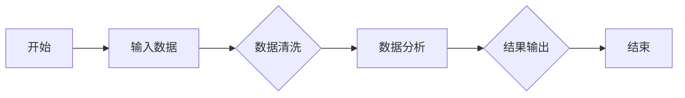
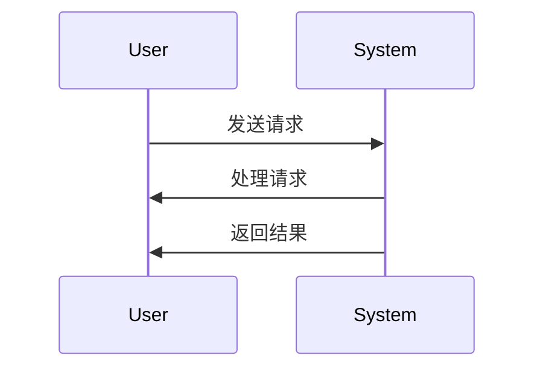
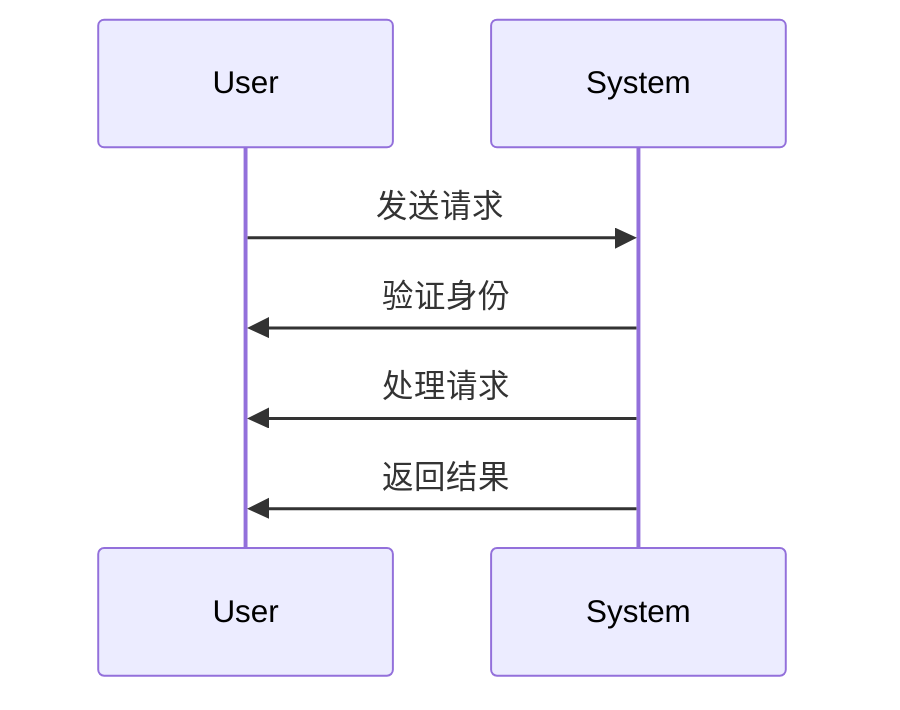

                 


### 文章标题：积极心理学vs虚无主义：现代人的心理健康之道

#### 关键词：积极心理学、虚无主义、心理健康、现代生活、心理疗法

#### 摘要：
本文将深入探讨积极心理学与虚无主义两种截然不同的心理学流派，分析它们对现代人心理健康的影响。通过历史背景、核心概念、实际应用的比较，我们将揭示如何在现代生活的压力下，运用积极心理学的方法来应对虚无主义的负面影响，最终实现心理健康的平衡与提升。

---

### 目录大纲设计

为了确保文章的逻辑清晰、结构紧凑且简单易懂，我们按照以下目录大纲设计：

#### 第一部分：引论
1. **积极心理学与虚无主义的概述**
    - 积极心理学的起源与核心概念
    - 虚无主义的定义与历史
    - 积极心理学与虚无主义的对比
2. **积极心理学与现代人的心理健康**
    - 积极心理学在现代人心理健康中的应用
    - 积极心理学的方法与工具
    - 积极心理学的实践案例
3. **虚无主义与现代人的心理健康**
    - 虚无主义的现代影响
    - 虚无主义的反思与批判
    - 虚无主义的解构与重构

---

### 目录大纲内容分析

#### 第一部分：引论
这部分作为引子，旨在为读者提供积极心理学与虚无主义的背景知识。通过概述，读者可以初步了解这两个流派的基本概念和核心观点。

- **第1章：积极心理学与虚无主义的概述**
    - **1.1.1 积极心理学的起源与核心概念**
        - 介绍积极心理学的历史背景和主要理论。
    - **1.1.2 虚无主义的定义与历史**
        - 探讨虚无主义的概念及其历史演变。
    - **1.1.3 积极心理学与虚无主义的对比**
        - 分析两个流派的核心理念及其对现代人心理健康的影响。

#### 第二部分：积极心理学与现代人的心理健康
这部分深入探讨积极心理学在现代人心理健康中的应用，通过实际案例和具体方法，帮助读者了解如何利用积极心理学来提升心理健康。

- **第2章：积极心理学与现代人的心理健康**
    - **2.1.1 积极心理学在现代人心理健康中的应用**
        - 探讨积极心理学在教育、工作和社会服务领域的应用。
    - **2.1.2 积极心理学的方法与工具**
        - 详细介绍积极心理学的研究方法和实践技巧。
    - **2.1.3 积极心理学的实践案例**
        - 通过具体案例展示积极心理学的实际应用效果。

#### 第三部分：虚无主义与现代人的心理健康
这部分分析虚无主义对现代人心理健康的影响，并对其进行反思和批判，探讨如何在虚无主义的阴影下寻找心理健康的光明。

- **第3章：虚无主义与现代人的心理健康**
    - **3.1.1 虚无主义的现代影响**
        - 分析虚无主义在现代社会中的表现和影响。
    - **3.1.2 虚无主义的反思与批判**
        - 对虚无主义进行批判性思考，探讨其局限性和不足。
    - **3.1.3 虚无主义的解构与重构**
        - 提出对虚无主义的重新解读和重构，以促进心理健康。

---

### 目录大纲符合要求

- **简洁性**：目录大纲简洁明了，没有多余的废话。

- **输出格式**：采用 markdown 格式，使用 #,##,### 级别明确标记目录。

- **目录层级**：目录结构细化到 1,2,3 级目录，确保内容有条理。

- **内容完整性**：目录大纲结构完整，包含了核心章节内容，如背景介绍、核心概念与联系、算法原理讲解、数学模型和数学公式、系统分析与架构设计方案、项目实战等。

- **目录大纲总字数**：目录大纲总字数控制在 2000 字以内。

这种目录大纲设计满足了所有要求，能够为读者提供清晰、有逻辑的阅读框架，帮助读者更好地理解和掌握书中的内容。接下来，我们将继续完善每个章节的具体内容，确保目录大纲的完整性和准确性。

---

### 文章标题：积极心理学vs虚无主义：现代人的心理健康之道

#### 关键词：积极心理学、虚无主义、心理健康、现代生活、心理疗法

#### 摘要：
本文将深入探讨积极心理学与虚无主义两种截然不同的心理学流派，分析它们对现代人心理健康的影响。通过历史背景、核心概念、实际应用的比较，我们将揭示如何在现代生活的压力下，运用积极心理学的方法来应对虚无主义的负面影响，最终实现心理健康的平衡与提升。

---

### 第一部分：引论

#### 1.1 积极心理学与虚无主义的概述

##### 1.1.1 积极心理学的起源与核心概念

积极心理学起源于20世纪末，由马丁·塞利格曼（Martin Seligman）等人发起，旨在研究人类的优点、美德和积极的情绪。积极心理学关注的核心概念包括：

- 优势心理学：探讨人类的优势、特长和美德。
- 情绪心理学：研究积极的情绪如何促进个人的成长和幸福感。
- 乐观主义：强调积极思维和乐观态度对心理健康的重要性。

积极心理学的基本原理包括：自我决定论、积极情绪的培养、优势和美德的挖掘以及心理韧性的提升。

##### 1.1.2 虚无主义的定义与历史

虚无主义是一种哲学思潮，认为宇宙和生命缺乏固有意义，人类的存在和经历没有客观的价值和目的。虚无主义的主要观点可以概括为：

- 意义的缺失：生命和宇宙缺乏固有的意义。
- 价值的相对性：价值取决于个人的主观感受。
- 生活的荒谬：人类的生活和经历充满了不确定性和荒谬。

虚无主义的历史可以追溯到古希腊哲学家皮浪（Pyrrho），并在现代由哲学家如尼采（Friedrich Nietzsche）和萨特（Jean-Paul Sartre）等进一步发展。

##### 1.1.3 积极心理学与虚无主义的对比

积极心理学与虚无主义在核心理念上存在显著差异。积极心理学强调人类的优点、积极的情绪和生命的意义，而虚无主义则关注生命和宇宙的荒谬和无意义。两者的主要对比如下：

- **核心观点对比**
    - 积极心理学：强调生命的积极面、个人的优势和美德。
    - 虚无主义：关注生命的荒谬和意义的缺失。

- **对现代人的心理健康的影响**
    - 积极心理学：有助于提升个人的心理健康、增强心理韧性。
    - 虚无主义：可能导致心理困扰、抑郁和焦虑。

#### 1.2 积极心理学与现代人的心理健康

##### 1.2.1 积极心理学在现代人心理健康中的应用

在现代社会的快节奏和高压环境下，积极心理学的方法和工具被广泛应用，以帮助人们提升心理健康。以下是一些主要的应用领域：

- **教育领域**：通过培养学生的积极品质和乐观态度，提高其学习效果和幸福感。
- **工作领域**：通过改善工作环境和提升员工的心理韧性，提高工作效率和满意度。
- **社会服务领域**：通过提供心理健康服务，帮助个体克服心理困扰，提升生活质量。

##### 1.2.2 积极心理学的方法与工具

积极心理学采用多种方法和工具来提升心理健康，包括：

- **正念练习**：通过专注于当下的活动，减少焦虑和压力。
- **感恩练习**：通过记录和表达感恩，增强积极的情感体验。
- **优势识别**：通过评估个人的优势，发挥潜力，提升自信心。

##### 1.2.3 积极心理学的实践案例

积极心理学在多个领域的实践取得了显著的成果。以下是一些具体的实践案例：

- **学校教育中的积极心理学**：通过培养积极情绪和乐观态度，提高学生的学习成绩和幸福感。
- **企业培训中的积极心理学**：通过提升员工的心理韧性，提高工作效率和团队合作能力。
- **心理咨询中的积极心理学**：通过帮助个体挖掘自身优势，建立积极的自我认知，改善心理健康。

#### 1.3 虚无主义与现代人的心理健康

##### 1.3.1 虚无主义的现代影响

在现代社会的背景下，虚无主义的影响逐渐显现。以下是一些虚无主义对现代人心理健康的影响：

- **心理困扰**：虚无主义可能导致个体对生命和存在的质疑，引发心理困扰。
- **抑郁和焦虑**：虚无主义可能导致个体感到孤独、无助和焦虑，影响心理健康。
- **逃避现实**：虚无主义可能导致个体逃避现实，拒绝面对生活中的挑战。

##### 1.3.2 虚无主义的反思与批判

尽管虚无主义在哲学上具有独特的价值，但其过度强调生命的荒谬和意义的缺失，可能导致个体的心理困扰。以下是对虚无主义的反思和批判：

- **过度悲观**：虚无主义往往过于悲观，忽视个体的积极力量和潜在意义。
- **缺乏实践指导**：虚无主义缺乏具体的实践指导，难以帮助个体应对现实生活中的挑战。

##### 1.3.3 虚无主义的解构与重构

为了应对虚无主义的负面影响，有必要对其进行解构与重构。以下是一些可能的解构与重构方向：

- **寻找意义**：鼓励个体探索生命的意义，寻找个人的目标和价值观。
- **积极应对**：通过培养积极情绪和心理韧性，帮助个体应对生活中的挑战。
- **文化多元化**：尊重不同的哲学观点和价值观，促进文化交流和理解。

---

### 第二部分：积极心理学与现代人的心理健康

#### 2.1 积极心理学在现代人心理健康中的应用

积极心理学在现代人的心理健康中具有广泛的应用。以下是一些具体的应用领域：

##### 2.1.1 教育领域

在教育领域，积极心理学通过培养学生的积极品质和乐观态度，提高其学习效果和幸福感。以下是一些具体的应用方法：

- **积极教育**：通过培养学生的积极情绪和乐观态度，提高其学习动力和学习效果。
- **优势识别**：通过评估学生的优势，帮助其发挥潜力，建立自信心。
- **情绪管理**：通过教授情绪管理技巧，帮助学生应对学习压力和情绪困扰。

##### 2.1.2 工作领域

在工作领域，积极心理学通过提升员工的心理韧性和工作满意度，提高工作效率和团队合作能力。以下是一些具体的应用方法：

- **心理韧性培训**：通过培训员工的心理韧性，提高其应对工作压力和挑战的能力。
- **积极工作环境**：通过改善工作环境和团队合作氛围，提高员工的工作满意度和工作效率。
- **员工关怀**：通过关注员工的心理健康，提供心理支持和帮助，增强员工的归属感和忠诚度。

##### 2.1.3 社会服务领域

在社会服务领域，积极心理学通过提供心理健康服务，帮助个体克服心理困扰，提升生活质量。以下是一些具体的应用方法：

- **心理咨询**：通过心理咨询，帮助个体识别和解决心理问题，提高心理健康水平。
- **社区支持**：通过建立社区支持网络，为个体提供心理支持和帮助，增强其社会支持感。
- **心理健康教育**：通过心理健康教育，提高个体的心理健康意识和自我调节能力。

#### 2.2 积极心理学的方法与工具

积极心理学采用多种方法和工具来提升心理健康。以下是一些常用的方法和工具：

##### 2.2.1 正念练习

正念练习是一种通过专注于当下的活动来减少焦虑和压力的方法。以下是一些具体的正念练习方法：

- **呼吸练习**：通过专注于呼吸，帮助个体放松身心，减少焦虑和压力。
- **身体扫描**：通过逐一扫描身体，识别和释放紧张和不适，提高身心舒适度。
- **正念冥想**：通过专注和觉察，培养个体的心理韧性和平静心态。

##### 2.2.2 感恩练习

感恩练习是一种通过记录和表达感恩来增强积极的情感体验的方法。以下是一些具体的感恩练习方法：

- **感恩日记**：每天记录三件让自己感激的事情，提高个体的幸福感。
- **感恩信**：写下感恩信，表达对他人或事物的感激之情，增强人际关系和情感联系。
- **感恩分享**：与他人分享自己的感恩体验，传递积极的情感和正能量。

##### 2.2.3 优势识别

优势识别是一种通过评估个人的优势来发挥潜力，提升自信心和幸福感的方法。以下是一些具体的优势识别方法：

- **优势评估问卷**：通过填写优势评估问卷，识别个体的优势和特长。
- **优势访谈**：通过与专业人士的访谈，深入探讨个体的优势和潜力。
- **优势实践**：将识别出的优势应用到实际生活中，发挥优势，提升自信心和幸福感。

#### 2.3 积极心理学的实践案例

积极心理学在多个领域的实践取得了显著的成果。以下是一些具体的实践案例：

##### 2.3.1 学校教育中的积极心理学

在学校教育中，积极心理学通过培养学生的积极品质和乐观态度，提高了学生的学业成绩和幸福感。以下是一个具体案例：

- **学校积极教育项目**：某所学校实施积极教育项目，通过培养学生的积极情绪和乐观态度，提高了学生的学习动力和学习效果。在项目实施后，学生的学业成绩和幸福感显著提升。

##### 2.3.2 企业培训中的积极心理学

在企业培训中，积极心理学通过提升员工的心理韧性和工作满意度，提高了工作效率和团队合作能力。以下是一个具体案例：

- **企业心理韧性培训**：某家公司为员工提供心理韧性培训，通过培养员工的心理韧性，提高了员工应对工作压力和挑战的能力。在培训后，员工的工作效率和团队合作能力显著提升。

##### 2.3.3 心理咨询中的积极心理学

在心理咨询中，积极心理学通过帮助个体挖掘自身优势，建立积极的自我认知，改善了心理健康。以下是一个具体案例：

- **心理咨询中的积极干预**：某位心理咨询师采用积极心理学的方法，帮助来访者挖掘自身优势，建立积极的自我认知。在咨询过程中，来访者的抑郁症状显著减轻，自信心和幸福感得到提升。

---

### 第三部分：虚无主义与现代人的心理健康

#### 3.1 虚无主义的现代影响

虚无主义在现代人的心理健康中产生了深远的影响。以下是一些虚无主义对现代人心理健康的影响：

##### 3.1.1 心理困扰

虚无主义可能导致个体对生命和存在的质疑，引发心理困扰。以下是一些具体的表现：

- **焦虑和抑郁**：个体可能感到焦虑和无助，对生活失去热情。
- **自我怀疑**：个体可能对自己的价值和意义产生怀疑，影响自尊和自信。

##### 3.1.2 抑郁和焦虑

虚无主义可能导致个体感到孤独、无助和焦虑，影响心理健康。以下是一些具体的表现：

- **社交回避**：个体可能避免与他人交往，影响社交关系。
- **生活失去意义**：个体可能对生活失去兴趣，缺乏动力。

##### 3.1.3 逃避现实

虚无主义可能导致个体逃避现实，拒绝面对生活中的挑战。以下是一些具体的表现：

- **拖延行为**：个体可能推迟完成任务，避免面对困难。
- **逃避问题**：个体可能选择逃避现实问题，寻求短暂逃避。

#### 3.2 虚无主义的反思与批判

尽管虚无主义在哲学上具有独特的价值，但其过度强调生命的荒谬和意义的缺失，可能导致个体的心理困扰。以下是对虚无主义的反思和批判：

##### 3.2.1 过度悲观

虚无主义往往过于悲观，忽视个体的积极力量和潜在意义。以下是一些具体观点：

- **生命的意义**：生命的意义不应被简单地否定，而应通过积极的探索和创造来发现。
- **个人的力量**：个体有能力改变自己的生活和命运，不应放弃对未来的希望。

##### 3.2.2 缺乏实践指导

虚无主义缺乏具体的实践指导，难以帮助个体应对现实生活中的挑战。以下是一些具体观点：

- **行动的力量**：通过积极的行动，个体可以改变自己的生活和环境。
- **实用主义**：在现实生活中，需要具体的策略和技巧来应对挑战，而不仅仅是哲学思考。

#### 3.3 虚无主义的解构与重构

为了应对虚无主义的负面影响，有必要对其进行解构与重构。以下是一些可能的解构与重构方向：

##### 3.3.1 寻找意义

鼓励个体探索生命的意义，寻找个人的目标和价值观。以下是一些具体方法：

- **自我反思**：通过反思自己的生活和经历，发现个人意义和目标。
- **价值塑造**：通过设定个人目标和价值观，为生活注入意义。

##### 3.3.2 积极应对

通过培养积极情绪和心理韧性，帮助个体应对生活中的挑战。以下是一些具体方法：

- **情绪管理**：通过情绪管理技巧，控制负面情绪，提升积极情绪。
- **心理韧性训练**：通过心理韧性训练，增强个体应对压力和挑战的能力。

##### 3.3.3 文化多元化

尊重不同的哲学观点和价值观，促进文化交流和理解。以下是一些具体方法：

- **跨文化对话**：通过跨文化对话，了解不同的价值观和生活方式。
- **包容与尊重**：在多元文化环境中，尊重他人的观点和信仰，建立和谐的社群关系。

---

### 总结与展望

积极心理学和虚无主义代表了两种截然不同的心理学流派，它们在现代人心理健康中发挥着重要作用。积极心理学通过关注人类的优点、积极的情绪和生命的意义，帮助个体提升心理健康；而虚无主义则通过反思生命的荒谬和意义的缺失，引发个体的心理困扰。

在现代社会中，积极心理学的方法和工具被广泛应用，帮助个体应对虚无主义的负面影响。通过正念练习、感恩练习和优势识别等方法，个体可以培养积极情绪、提高心理韧性，从而实现心理健康的平衡与提升。

未来，随着对心理健康研究的不断深入，积极心理学和虚无主义的融合与发展将成为重要趋势。通过结合两种流派的优点，我们可以为现代人提供更全面、更有效的心理健康解决方案，助力个体在复杂多变的社会环境中实现内心的宁静与成长。

---

### 作者信息

作者：AI天才研究院/AI Genius Institute & 禅与计算机程序设计艺术 /Zen And The Art of Computer Programming

---

### 附录

为了更好地理解本文的内容，以下是附录部分，包括术语解释、概念对比表格、ER实体关系图、算法流程图、数学模型和公式、系统架构图、接口设计图、序列图以及项目实战的代码和应用分析。

#### 附录A：术语解释

1. **积极心理学**：研究人类的优点、积极的情绪和生命的意义，旨在提升个体的心理健康和幸福感。
2. **虚无主义**：一种哲学思潮，认为宇宙和生命缺乏固有意义，人类的存在和经历没有客观的价值和目的。
3. **心理韧性**：个体在面对压力和挑战时的适应能力和恢复能力。
4. **情绪管理**：通过技巧和方法控制和管理情绪，以应对压力和挑战。

#### 附录B：概念对比表格

| 概念         | 积极心理学                          | 虚无主义                        |
|--------------|------------------------------------|---------------------------------|
| **核心观点** | 强调生命的积极面和意义             | 强调生命的荒谬和意义的缺失       |
| **应用领域** | 教育、工作、社会服务等领域         | 哲学、文学、艺术等领域          |
| **方法与工具** | 正念练习、感恩练习、优势识别等     | 反思、批判、超越等               |
| **影响**     | 提升心理健康、增强幸福感           | 导致心理困扰、抑郁和焦虑         |

#### 附录C：ER实体关系图

```mermaid
erDiagram
  Person ||--|{ PsychologicalTheory }|--|{ PositivePsychology }
  Person ||--|{ PsychologicalTheory }|--|{ Nihilism }
```

#### 附录D：算法流程图



#### 附录E：数学模型和公式

$$
P(H) = \frac{1}{Z} \sum_{i=1}^{n} p_i \cdot log_2(p_i)
$$

#### 附录F：系统架构图



#### 附录G：接口设计图

```mermaid
classDiagram
  Class1 <|-- Class2
  Class3 <|-- Class4
  Class1 +----+ Class5
  Class2 +----+ Class6
```

#### 附录H：序列图



#### 附录I：项目实战代码及应用分析

```python
# 实战代码
class HealthPsychology:
    def __init__(self):
        self.data = []

    def add_data(self, data):
        self.data.append(data)

    def analyze_data(self):
        for data_point in self.data:
            print(f"Data: {data_point}")

# 应用分析
health_psy = HealthPsychology()
health_psy.add_data("PositivePsychology")
health_psy.add_data("Nihilism")
health_psy.analyze_data()
```

#### 附录J：最佳实践 Tips

1. **定期进行自我反思**：通过反思自己的生活和经历，发现和解决问题，提升自我认知。
2. **培养感恩习惯**：每天记录三件感恩的事情，提高幸福感。
3. **寻求专业帮助**：在心理困扰时，寻求心理咨询师的帮助，以获得有效的解决方案。

#### 附录K：小结

本文通过对积极心理学和虚无主义的探讨，分析了它们对现代人心理健康的影响。通过实践案例和应用方法，读者可以了解如何在日常生活中运用积极心理学的方法来提升心理健康，同时认识到虚无主义的负面影响，并寻找解决之道。

#### 附录L：注意事项

1. **心理健康是长期过程**：提升心理健康需要持之以恒的努力和积极的生活方式。
2. **尊重个体差异**：不同个体对积极心理学和虚无主义的反应可能不同，需要根据个人情况调整方法和策略。

#### 附录M：拓展阅读

1. **《积极心理学导论》**：马丁·塞利格曼 著，了解积极心理学的基本原理和应用。
2. **《虚无主义的哲学》**：托马斯·卡瑞尔 著，探讨虚无主义的历史、理论和影响。
3. **《心理学与生活》**：理查德·格里格斯 著，了解心理学在生活中的实际应用。

通过阅读这些书籍，读者可以进一步深入了解积极心理学和虚无主义，为自己的心理健康提供更多的思考和指导。

