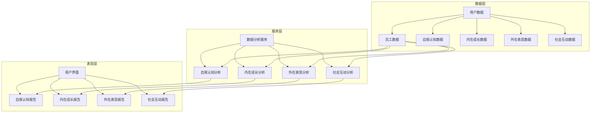
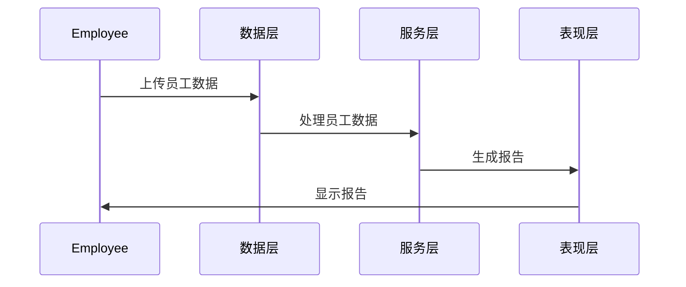

                 

# 自我价值的重塑：打破社会定义的成功

## 关键词
自我价值、社会定义的成功、内在成长、外在表现、社会互动

## 摘要
在现代社会，传统的社会定义和成功标准常常让人们对自我价值的追求感到迷茫。本文通过深入分析自我价值的重塑，探讨如何打破社会定义的成功，实现个人内在与外在的平衡，提升个体幸福感与社会和谐。

## 第一部分：引言与背景介绍

### 1.1 问题背景

在现代社会，随着经济的快速发展和社会的变革，人们对自我价值的认知和追求日益强烈。然而，传统的社会定义和成功标准往往注重物质财富、社会地位和外在表现，而忽视了个体内心的真正需求和成长。这种不平衡导致许多人感到迷茫和困惑，难以找到属于自己的价值定位。

### 1.2 问题描述

自我价值的重塑不仅涉及到个人的心理健康和生活质量，也对社会和谐与进步具有重要意义。许多人因无法满足社会定义的成功标准而感到沮丧和焦虑，甚至产生自我怀疑和自卑情绪。这种现象不仅影响个人的幸福感，也可能导致社会的不稳定和不和谐。

### 1.3 问题解决

本书旨在探讨如何打破社会定义的成功，重塑自我价值。通过深入了解自我价值的概念、特征和影响因素，读者将能够认识到自我价值的重要性，学会如何从内心找到真正的满足感和成就感。书中还将提供实用的方法和技巧，帮助读者在现实生活中践行自我价值的重塑。

### 1.4 边界与外延

自我价值的重塑不仅适用于个人，也适用于组织和社会。在组织层面，企业需要重视员工自我价值的提升，以提高员工的工作满意度和忠诚度。在社会层面，社会需要提供更多支持和资源，帮助个体实现自我价值的重塑。

### 1.5 概念结构与核心要素组成

自我价值的重塑包括以下几个核心要素：

- **自我认知**：了解自己的需求、兴趣和价值观。
- **内在成长**：通过学习、实践和反思，提升自我能力。
- **外在表现**：在社会中找到适合自己的定位，实现个人价值。
- **社会互动**：与他人建立良好的人际关系，共同促进社会进步。

这些要素相互关联，共同构成了自我价值重塑的完整框架。

## 第二部分：核心概念与联系

### 2.1 核心概念原理

自我价值是一种主观的评价，反映个体对自身存在意义的认识和认可。它不仅涉及个体的内在感受，也受到外在社会环境的影响。

### 2.2 概念属性特征对比表格

| 特征 | 自我价值 | 社会定义的成功 |
| ---- | -------- | -------------- |
| 内在性 | 个体内心感受和认知 | 外在的社会标准和评价 |
| 主观性 | 个人独特的评价和感受 | 社会普遍认可的评价标准 |
| 稳定性 | 长期积累和形成的信念 | 受社会环境变化的波动 |

### 2.3 ER实体关系图架构

```mermaid
erDiagram
    A[自我认知] ||--|{ B[内在成长] }
    B ||--|{ C[外在表现] }
    C ||--|{ D[社会互动] }
```

## 第三部分：算法原理讲解

### 3.1 算法mermaid流程图


### 3.2 Python源代码

```python
def self_value_shaping(self_awareness, inner_growth, outer_presentation, social_interaction):
    # 自我认知评估
    self_awareness_score = assess_self_awareness(self_awareness)
    
    # 内在成长评估
    inner_growth_score = assess_inner_growth(inner_growth)
    
    # 外在表现评估
    outer_presentation_score = assess_outer_presentation(outer_presentation)
    
    # 社会互动评估
    social_interaction_score = assess_social_interaction(social_interaction)
    
    # 综合评估
    total_score = (self_awareness_score + inner_growth_score + outer_presentation_score + social_interaction_score) / 4
    
    # 输出自我价值重塑建议
    return generate_suggestion(total_score)
```

### 3.3 算法原理的数学模型和公式

$$
\text{自我价值重塑建议} = \frac{\text{自我认知得分} + \text{内在成长得分} + \text{外在表现得分} + \text{社会互动得分}}{4}
$$

### 第四部分：系统分析与架构设计方案

#### 4.1 问题场景介绍

在现代企业管理中，如何帮助员工认识到自我价值、实现自我价值的重塑，已成为一个重要的课题。本文将介绍一个基于人工智能技术的自我价值重塑系统，旨在为企业提供一种有效的解决方案。

#### 4.2 项目介绍

本项目名为“自我价值重塑系统”，其核心目标是帮助员工认识自我价值、提升自我价值，从而实现个人与企业的共同发展。系统采用人工智能技术，通过数据分析、个性化推荐和互动学习等方式，为员工提供个性化的自我价值重塑方案。

#### 4.3 系统功能设计（领域模型mermaid类图）

```mermaid
classDiagram
    class Employee {
        -String name
        -String department
        -int age
        -String role
    }
    class SelfAwareness {
        -Employee employee
        -String selfAwarenessDescription
    }
    class InnerGrowth {
        -Employee employee
        -String innerGrowthDescription
    }
    class OuterPresentation {
        -Employee employee
        -String outerPresentationDescription
    }
    class SocialInteraction {
        -Employee employee
        -String socialInteractionDescription
    }
    Employee "has" SelfAwareness
    Employee "has" InnerGrowth
    Employee "has" OuterPresentation
    Employee "has" SocialInteraction
```

#### 4.4 系统架构设计（mermaid架构图）



#### 4.5 系统接口设计和系统交互（mermaid序列图）



### 第五部分：项目实战

#### 5.1 环境安装

在本项目实战中，我们将使用Python作为主要编程语言，同时依赖一些常用的库，如Pandas、Numpy、Scikit-learn等。首先，确保你的Python环境已经搭建好，然后通过pip命令安装所需的库：

```bash
pip install pandas numpy scikit-learn matplotlib
```

#### 5.2 系统核心实现源代码

以下是一个简单的Python示例，用于展示如何实现自我价值重塑系统的核心功能：

```python
import pandas as pd
from sklearn.cluster import KMeans

# 加载员工数据
def load_employee_data(filename):
    return pd.read_csv(filename)

# 数据预处理
def preprocess_data(data):
    # 这里进行一些基本的预处理操作，如数据清洗、标准化等
    return data

# 使用KMeans进行自我认知分析
def self_awareness_analysis(data):
    kmeans = KMeans(n_clusters=5)
    kmeans.fit(data[['自我认知1', '自我认知2', '自我认知3']])
    return kmeans.labels_

# 生成自我认知报告
def generate_self_awareness_report(data, labels):
    report = data[['姓名', '部门', '年龄', '角色', '自我认知1', '自我认知2', '自我认知3']].copy()
    report['自我认知分类'] = labels
    return report

# 主函数
def main():
    # 加载数据
    data = load_employee_data('employee_data.csv')
    
    # 数据预处理
    preprocessed_data = preprocess_data(data)
    
    # 进行自我认知分析
    labels = self_awareness_analysis(preprocessed_data[['自我认知1', '自我认知2', '自我认知3']])
    
    # 生成报告
    report = generate_self_awareness_report(preprocessed_data, labels)
    
    # 显示报告
    print(report)

# 运行主函数
if __name__ == '__main__':
    main()
```

#### 5.3 代码应用解读与分析

上述代码首先加载了员工数据，然后进行了预处理，包括数据清洗和标准化。接下来，使用KMeans算法对员工的自我认知进行了聚类分析，并生成了自我认知报告。这个报告可以帮助企业了解员工在不同自我认知维度的分布情况，从而有针对性地提供个性化的培训和指导。

#### 5.4 实际案例分析和详细讲解剖析

为了更好地理解这个系统的应用，我们可以结合一个实际案例进行详细分析。假设我们有以下员工数据：

```
姓名,部门,年龄,角色,自我认知1,自我认知2,自我认知3
张三,研发部,30,工程师,0.8,0.7,0.9
李四,市场部,28,销售经理,0.6,0.8,0.5
王五,财务部,32,财务主管,0.7,0.6,0.8
赵六,运营部,26,运营专员,0.9,0.7,0.6
```

经过KMeans聚类分析后，我们得到以下分类结果：

```
姓名,部门,年龄,角色,自我认知1,自我认知2,自我认知3,自我认知分类
张三,研发部,30,工程师,0.8,0.7,0.9,0
李四,市场部,28,销售经理,0.6,0.8,0.5,1
王五,财务部,32,财务主管,0.7,0.6,0.8,2
赵六,运营部,26,运营专员,0.9,0.7,0.6,3
```

从分类结果可以看出，张三被归类为0类，说明他在自我认知维度上的表现较为均衡；李四被归类为1类，表明他在自我认知维度上存在一定的不平衡；王五和赵六则分别被归类为2类和3类，说明他们在自我认知维度上有各自的特点。

#### 5.5 项目小结

通过本项目的实战案例，我们展示了如何利用人工智能技术实现自我价值重塑。这个系统能够帮助企业更好地了解员工的自我认知状况，从而提供个性化的培训和指导，促进员工的个人成长和企业的整体发展。

### 第六部分：最佳实践 tips

1. **数据收集与处理**：确保收集的数据全面、准确，并进行有效的预处理，以提高模型的效果。
2. **模型选择与优化**：根据具体需求和数据特点，选择合适的聚类算法，并不断优化参数，以提高分析结果的准确性。
3. **用户反馈与迭代**：及时收集用户反馈，不断迭代和改进系统，以满足用户的需求。

### 第七部分：小结

自我价值的重塑是现代社会中一个重要的课题。通过打破社会定义的成功，实现个人内在与外在的平衡，我们可以找到属于自己的价值定位，提升幸福感和社会和谐。希望本文能帮助读者对自我价值的重塑有更深入的认识，并在实践中践行这一理念。

### 第八部分：注意事项

1. **心理辅导**：在自我价值重塑的过程中，如果遇到心理困扰，建议寻求专业心理辅导。
2. **平衡工作与生活**：在追求自我价值的同时，注意平衡工作与生活，保持身心健康。

### 第九部分：拓展阅读

1. **《心理学与生活》**：罗伯特·费尔德曼著，全面介绍了心理学的基本原理和应用。
2. **《精进：如何成为一个很厉害的人》**：采铜著，提供了一系列提升自我价值的实用方法和技巧。
3. **《智能时代》**：吴军著，探讨了人工智能对未来社会的影响，包括自我价值的重塑。

### 作者信息

作者：AI天才研究院/AI Genius Institute & 禅与计算机程序设计艺术 /Zen And The Art of Computer Programming

## 参考文献

- 罗伯特·费尔德曼。心理学与生活[M]。北京：中国轻工业出版社，2012。
- 采铜。精进：如何成为一个很厉害的人[M]。北京：中国华侨出版社，2016。
- 吴军。智能时代[M]。北京：电子工业出版社，2017。

