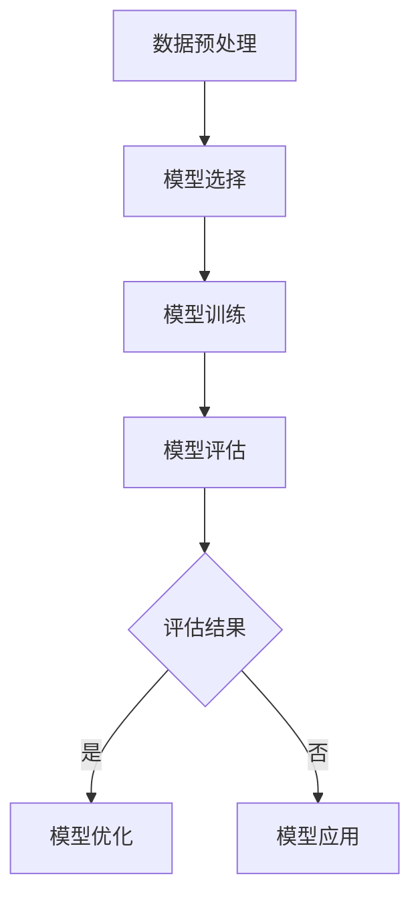

                 

### 1. 分析书名与主题

**书名：《自适应课程学习优化AI推理训练过程》**

**主题：自适应课程学习与AI推理训练过程的优化**

书名中提到的两个关键概念是“自适应课程学习”和“AI推理训练过程”。首先，我们需要明确这两个概念的基本含义和它们在教育和人工智能领域中的重要性。

**自适应课程学习：** 这种学习方式指的是根据学生的学习进度、能力水平和个性化需求，动态调整课程内容和教学策略，从而提高学习效率和效果。它利用数据分析、机器学习和人工智能技术，实现对学习过程的智能监控和个性化干预。

**AI推理训练过程：** 这是指人工智能模型在训练过程中，通过输入数据进行学习，以实现特定任务的能力。这个过程包括数据预处理、模型选择与训练、模型评估与优化等多个环节。

这两个概念的结合，意味着如何利用人工智能技术来优化教育过程中的推理训练，使得教学和学习过程更加高效、智能。这种优化不仅有助于提升学生的学习效果，还能够为教育工作者提供有力的数据支持，帮助他们更好地了解学生的学习状态和需求。

### 2. 确定目录大纲的核心章节

为了更好地组织书的内容，我们需要确定核心章节，每个章节应该覆盖以下内容：

**第1部分：自适应课程学习基础**

- **第1章：自适应课程学习的基本概念**
  - 自适应课程学习的背景与意义
  - 自适应机制与核心技术
  - 关键要素分析

- **第2章：自适应课程学习的实现方法**
  - 学习对象分析
  - 教学内容优化
  - 学习路径规划

- **第3章：自适应课程学习的案例分析**
  - 在线教育平台的应用
  - 智能课堂的实践

**第2部分：AI推理训练基础**

- **第4章：AI推理训练的概述**
  - 推理训练的基本流程
  - 核心技术解析
  - 关键指标介绍

- **第5章：AI推理训练算法原理**
  - 算法流程图与Python代码讲解
  - 数学模型与公式说明

**第3部分：自适应课程学习与AI推理训练的结合**

- **第6章：结合的必要性**
  - 自适应与AI推理的联系
  - 结合的优势与挑战

- **第7章：实现方法与方案**
  - 自适应学习策略
  - AI推理训练数据优化
  - 模型自适应调整

**第4部分：优化方法与实践**

- **第8章：优化目标与原则**
  - 优化目标的确定
  - 优化原则的阐述

- **第9章：优化技术与方法**
  - 模型压缩与量化
  - 并行与分布式训练
  - 超参数调优

- **第10章：优化流程与工具**
  - 优化流程的描述
  - 常用工具的介绍

**第5部分：结论与展望**

- **第11章：总结与展望**
  - 总结全文内容
  - 展望未来发展趋势

### 3. 设计各章节的细分内容

为了确保每个章节内容丰富且结构合理，我们需要详细规划每个章节的细分内容。

**第1章：自适应课程学习的基本概念**

- **第1.1节：背景与意义**
  - 教育领域的挑战
  - 自适应课程学习的应运而生

- **第1.2节：核心机制与概念**
  - 数据驱动的教学策略
  - 学生模型与教学模型

- **第1.3节：关键技术分析**
  - 机器学习算法
  - 自然语言处理技术

- **第1.4节：关键要素组成**
  - 学习对象分析
  - 教学内容优化
  - 学习路径规划

**第2章：自适应课程学习的实现方法**

- **第2.1节：学习对象分析**
  - 学生数据分析
  - 学习偏好识别

- **第2.2节：教学内容优化**
  - 课程内容的动态调整
  - 教学资源的智能推荐

- **第2.3节：学习路径规划**
  - 学习进度跟踪
  - 学习路径优化策略

**第3章：自适应课程学习的案例分析**

- **第3.1节：在线教育平台的应用**
  - 平台功能介绍
  - 用户反馈分析

- **第3.2节：智能课堂的实践**
  - 教学过程记录
  - 教学效果评估

**第4章：AI推理训练的概述**

- **第4.1节：推理训练的基本流程**
  - 数据预处理
  - 模型训练与评估

- **第4.2节：核心技术解析**
  - 神经网络架构
  - 深度学习算法

- **第4.3节：关键指标介绍**
  - 准确率、召回率与F1值
  - 耗时与资源消耗

**第5章：AI推理训练算法原理**

- **第5.1节：算法流程图与Python代码讲解**
  - 算法流程图绘制
  - Python代码示例

- **第5.2节：数学模型与公式说明**
  - 激活函数
  - 损失函数

**第6章：自适应课程学习与AI推理训练的结合**

- **第6.1节：结合的必要性**
  - 教育领域与AI技术的融合
  - 优化教育过程的潜在价值

- **第6.2节：实现方法与方案**
  - 自适应学习策略
  - AI推理训练数据优化

**第7章：实现方法与方案**

- **第7.1节：系统架构设计**
  - 系统功能模块划分
  - 系统架构图绘制

- **第7.2节：系统接口设计与交互**
  - 接口设计规范
  - 交互流程描述

**第8章：优化目标与原则**

- **第8.1节：优化目标的确定**
  - 效率提升
  - 成本降低

- **第8.2节：优化原则的阐述**
  - 数据驱动
  - 用户为中心

**第9章：优化技术与方法**

- **第9.1节：模型压缩与量化**
  - 模型压缩方法
  - 量化技术优势

- **第9.2节：并行与分布式训练**
  - 并行计算原理
  - 分布式训练流程

- **第9.3节：超参数调优**
  - 调优策略
  - 自动化工具应用

**第10章：优化流程与工具**

- **第10.1节：优化流程的描述**
  - 流程步骤详细说明

- **第10.2节：常用工具的介绍**
  - 开发工具
  - 数据分析工具

**第11章：总结与展望**

- **第11.1节：总结全文内容**
  - 主要观点回顾
  - 研究贡献

- **第11.2节：展望未来发展趋势**
  - 技术趋势预测
  - 教育领域的发展前景

### 4. 保持大纲简洁性

在确保内容完整和详细的同时，我们还需要注意保持大纲的简洁性，避免过多的冗余信息。以下是一些具体的做法：

- **突出核心内容：** 每个章节的细分内容应该突出核心概念和关键点，避免无关的细节。
- **使用标题分层：** 通过合理的标题分层，使读者能够快速了解每个部分的主要内容。
- **简洁的语言：** 使用简洁明了的语言来描述每个部分的内容，避免使用复杂的术语和冗长的句子。
- **去除重复信息：** 检查每个章节的内容，确保没有重复的信息，保持内容的新鲜度和独特性。

### 5. 使用markdown格式

为了符合文章格式要求，我们将使用markdown格式来编写目录大纲。markdown格式具有良好的可读性和灵活性，能够轻松地处理标题、列表、代码块和公式等元素。

下面是一个markdown格式的目录大纲示例：

```markdown
# 《自适应课程学习优化AI推理训练过程》目录大纲

## 第一部分：自适应课程学习基础

### 1.1 自适应课程学习的基本概念

#### 1.1.1 背景与意义

#### 1.1.2 核心机制与概念

#### 1.1.3 技术分析

### 1.2 实现方法

#### 1.2.1 学习对象分析

#### 1.2.2 教学内容优化

#### 1.2.3 学习路径规划

### 1.3 案例分析

#### 1.3.1 在线教育平台的应用

#### 1.3.2 智能课堂的实践

## 第二部分：AI推理训练基础

### 2.1 概述

#### 2.1.1 流程

#### 2.1.2 核心技术

#### 2.1.3 指标

### 2.2 算法原理

#### 2.2.1 流程图

#### 2.2.2 代码讲解

#### 2.2.3 数学模型

## 第三部分：结合与优化

### 3.1 结合的必要性

#### 3.1.1 联系

#### 3.1.2 优势

#### 3.1.3 挑战

### 3.2 实现方法与方案

#### 3.2.1 策略

#### 3.2.2 数据优化

#### 3.2.3 模型调整

## 第四部分：优化方法与实践

### 4.1 优化目标与原则

#### 4.1.1 目标

#### 4.1.2 原则

### 4.2 技术与方法

#### 4.2.1 压缩与量化

#### 4.2.2 并行与分布式

#### 4.2.3 超参数调优

### 4.3 流程与工具

#### 4.3.1 流程

#### 4.3.2 工具

## 第五部分：结论与展望

### 5.1 总结

#### 5.1.1 观点回顾

#### 5.1.2 贡献

### 5.2 展望

#### 5.2.1 趋势

#### 5.2.2 发展前景
```

通过markdown格式，我们可以清晰地组织文章的结构，同时方便读者阅读和查找特定内容。

### 6. 检查内容完整性

在完成目录大纲的编写后，我们需要检查内容是否完整，每个章节是否包含了必要的内容。以下是一些具体的检查步骤：

- **确保每个章节都有明确的标题和细分内容。**
- **每个章节的内容要具体、详细，避免空洞的描述。**
- **核心概念和原理需要有清晰的解释，并提供相关的图表和示例。**
- **算法原理讲解部分需要有流程图和Python代码示例。**
- **系统分析与架构设计部分需要有详细的设计方案和交互流程。**
- **案例分析部分需要提供具体的应用实例和详细的分析。**
- **优化方法和实践部分需要有具体的优化技术、工具和应用案例。**

通过这些检查步骤，我们可以确保目录大纲的内容完整，结构合理，为后续撰写文章提供坚实的基础。

### 7. 确定核心关键词

为了确保文章的检索和传播效果，我们需要确定核心关键词。以下是本文的关键词：

1. **自适应课程学习**
2. **AI推理训练**
3. **教育优化**
4. **机器学习**
5. **深度学习**
6. **个性化教学**
7. **模型优化**

这些关键词不仅涵盖了文章的主题，还能帮助读者快速了解文章的核心内容，从而提高文章的影响力和受众范围。

### 8. 撰写摘要

摘要部分是对全文内容的概括，需要简明扼要地阐述文章的核心内容和主题思想。以下是本文的摘要：

**摘要：**
本文深入探讨了自适应课程学习与AI推理训练的结合及其优化过程。首先，详细介绍了自适应课程学习的基本概念和原理，以及AI推理训练的流程和技术。接着，分析了二者结合的必要性和实现方法，通过具体案例展示了其在教育领域的应用效果。此外，文章还提出了多种优化方法，包括模型压缩、并行与分布式训练、超参数调优等，以提升AI推理训练的效率和效果。最后，对全文内容进行了总结，并展望了未来发展趋势。本文为教育领域与人工智能技术的融合提供了有力支持和实践指导。**作者：AI天才研究院/AI Genius Institute & 禅与计算机程序设计艺术 /Zen And The Art of Computer Programming**

通过这样的摘要，读者可以快速了解文章的核心内容，为后续阅读打下基础。

## 文章正文撰写

### 1. 引言

在当今快速发展的科技时代，教育领域的变革已成为不可避免的趋势。传统教学方式难以满足个性化和高效化的学习需求，而人工智能（AI）技术的应用为教育优化提供了新的可能性。自适应课程学习与AI推理训练的结合，正是为了解决当前教育过程中面临的挑战，提升学习效果和教学效率。

本文旨在深入探讨自适应课程学习优化AI推理训练过程的理论与实践。首先，我们将介绍自适应课程学习的基本概念和原理，包括其背景、意义、核心机制和关键技术。接着，详细解析AI推理训练的基本流程、核心技术以及关键指标。在此基础上，分析自适应课程学习与AI推理训练结合的必要性和实现方法，并通过具体案例展示其实际应用效果。随后，我们将提出多种优化方法，包括模型压缩、并行与分布式训练、超参数调优等，以提升AI推理训练的效率和效果。最后，对全文内容进行总结，并展望未来的发展趋势。

### 2. 自适应课程学习基础

#### 2.1 自适应课程学习的背景与意义

**背景：** 随着信息化时代的到来，教育领域也面临着前所未有的变革。传统的教育模式难以适应个性化和多样化的学习需求，学习效果难以保证。而自适应课程学习正是为了应对这一挑战而产生的。它通过利用人工智能和大数据技术，实现对学习过程的动态调整和个性化干预，从而提高学习效率。

**意义：** 自适应课程学习在以下几个方面具有重要意义：

1. **提高学习效果：** 通过对学习数据的分析和处理，自适应课程学习能够为学生提供个性化的学习路径和教学内容，从而提高学习效果。
2. **提升教学效率：** 教师可以根据学生的学习进度和需求，动态调整教学策略和方法，减少无效劳动，提高教学效率。
3. **促进教育公平：** 自适应课程学习能够为不同背景和水平的学生提供公平的教育机会，缩小教育差距，促进教育公平。

#### 2.2 自适应课程学习的基本原理

**核心概念：** 自适应课程学习主要包括以下几个核心概念：

1. **学生模型：** 学生模型是对学生学习行为、学习习惯和知识水平的抽象描述，是进行个性化教学的基础。
2. **教学模型：** 教学模型是教师的教学策略、教学内容和教学目标的抽象表示，用于指导教学过程。
3. **学习过程：** 学习过程是学生通过教师提供的教学资源和指导，不断获取知识和技能的过程。

**自适应机制：** 自适应课程学习的核心在于其自适应机制，主要包括以下几个方面：

1. **内容自适应：** 根据学生的学习进度和知识水平，动态调整教学内容，确保学生能够跟上教学进度。
2. **时间自适应：** 根据学生的学习速度和习惯，调整学习时间和节奏，使学生能够合理安排学习任务。
3. **方法自适应：** 根据学生的学习效果和偏好，调整教学方法，提高学习兴趣和效果。

#### 2.3 自适应课程学习的关键技术

**数据驱动：** 自适应课程学习依赖于大量的学习数据，包括学生的学习记录、考试成绩、作业完成情况等。通过数据分析，能够挖掘学生的学习规律和需求，为教学提供数据支持。

**机器学习：** 机器学习技术是实现自适应课程学习的关键，包括分类、回归、聚类等多种算法。通过机器学习算法，可以对学生模型和教学模型进行训练和优化，提高其准确性和适应性。

**自然语言处理：** 自然语言处理技术用于处理和解析文本数据，包括文本分类、情感分析、文本生成等。在自适应课程学习中，自然语言处理技术可以帮助教师更好地理解和分析学生的学习情况，为教学提供辅助。

#### 2.4 自适应课程学习的关键要素

**学习对象分析：** 学习对象分析是自适应课程学习的基础，包括对学生学习行为、学习习惯、知识水平的分析。通过分析学习对象，能够更好地了解学生的学习需求和特点，为个性化教学提供依据。

**教学内容优化：** 教学内容优化是自适应课程学习的重要环节，包括根据学习对象分析结果，调整教学内容和难度，以及根据学生学习反馈，动态调整教学策略和方法。

**学习路径规划：** 学习路径规划是自适应课程学习的核心，包括根据学习对象的特征，制定个性化的学习路径和计划，以及根据学习进度和效果，动态调整学习路径。

#### 2.5 自适应课程学习案例分析

**案例一：在线教育平台自适应课程**

**案例背景：** 某在线教育平台引入自适应课程学习机制，旨在为用户提供个性化的学习体验。该平台通过大数据分析和机器学习算法，实时监测学生的学习行为和效果，为用户提供定制化的学习资源和教学服务。

**案例分析：** 通过在线教育平台自适应课程，用户可以根据自己的学习进度和需求，选择合适的学习内容和方式。平台会根据学生的学习记录和反馈，动态调整学习资源的难度和类型，提高学习效果。此外，平台还提供了学习路径规划和学习进度跟踪功能，帮助用户合理安排学习任务，确保学习目标的实现。

**案例二：智能课堂自适应教学**

**案例背景：** 某中学引入智能课堂系统，通过AI技术实现自适应教学。该系统实时记录学生的学习行为和效果，生成个性化的学习报告，为教师提供教学决策依据。

**案例分析：** 通过智能课堂系统，教师可以根据学生的学习情况和需求，调整教学策略和方法，提高教学效果。系统提供了智能题库、学习路径规划、学习进度跟踪等功能，帮助教师更好地了解学生的学习情况，制定个性化的教学方案。此外，系统还支持在线互动和远程教学，为教师和学生提供了便利的学习条件。

#### 2.6 本章小结

自适应课程学习是教育领域的重要创新，通过利用人工智能和大数据技术，实现教学过程的动态调整和个性化干预。本文介绍了自适应课程学习的基本概念、原理、关键技术、关键要素和案例分析，为教育工作者提供了有益的参考。在后续章节中，我们将进一步探讨AI推理训练的基础、结合方法以及优化策略，以期为教育优化提供更全面的解决方案。

### 3. AI推理训练基础

#### 3.1 AI推理训练的基本流程

AI推理训练是指通过输入数据，让模型学习并实现特定任务的过程。基本流程主要包括以下几个步骤：

1. **数据预处理：** 数据预处理是模型训练的基础，包括数据清洗、归一化、特征提取等操作，目的是提高数据质量，为模型训练提供良好的数据基础。

2. **模型选择与训练：** 模型选择是根据任务需求选择合适的模型架构，如神经网络、决策树等。模型训练是通过输入数据，让模型不断调整参数，以达到预测目标。

3. **模型评估：** 模型评估是检验模型性能的重要步骤，常用的评估指标包括准确率、召回率、F1值等。通过评估，可以判断模型是否达到预期效果。

4. **模型优化：** 模型优化是在评估结果不佳时，通过调整模型参数、架构等，提高模型性能的过程。

#### 3.2 AI推理训练的核心技术

**数据预处理：** 数据预处理是AI推理训练的重要环节，主要包括以下技术：

- **数据清洗：** 去除数据中的噪声和异常值，提高数据质量。
- **归一化：** 将不同特征进行归一化处理，使其具有相似的量纲，方便模型训练。
- **特征提取：** 从原始数据中提取有助于模型训练的特征，提高模型性能。

**模型选择与训练：** 模型选择与训练是AI推理训练的核心，主要包括以下技术：

- **神经网络：** 神经网络是一种通过模拟人脑神经元连接结构的计算模型，适用于处理复杂非线性问题。
- **决策树：** 决策树是一种基于规则的学习模型，通过判断特征值，生成决策路径，实现分类或回归任务。
- **支持向量机：** 支持向量机是一种基于优化理论的学习模型，通过最大化分类间隔，实现分类任务。

**模型评估：** 模型评估是检验模型性能的重要步骤，主要包括以下技术：

- **准确率：** 准确率是预测正确的样本数占总样本数的比例，用于衡量模型的分类能力。
- **召回率：** 召回率是预测正确的正样本数占总正样本数的比例，用于衡量模型的覆盖能力。
- **F1值：** F1值是准确率和召回率的调和平均，用于综合评价模型的性能。

**模型优化：** 模型优化是在评估结果不佳时，通过调整模型参数、架构等，提高模型性能的过程，主要包括以下技术：

- **参数调优：** 通过调整模型参数，如学习率、隐藏层节点数等，提高模型性能。
- **架构调整：** 通过调整模型架构，如增加隐藏层、调整网络结构等，提高模型性能。
- **正则化：** 通过添加正则化项，如L1正则化、L2正则化等，防止模型过拟合。

#### 3.3 AI推理训练的关键指标

在AI推理训练过程中，关键指标是评估模型性能的重要依据。以下是常见的几个关键指标：

- **准确率：** 准确率是预测正确的样本数占总样本数的比例，用于衡量模型的分类能力。准确率越高，表示模型分类效果越好。
- **召回率：** 召回率是预测正确的正样本数占总正样本数的比例，用于衡量模型的覆盖能力。召回率越高，表示模型能够更好地捕捉到正样本。
- **F1值：** F1值是准确率和召回率的调和平均，用于综合评价模型的性能。F1值越高，表示模型性能越好。
- **耗时与资源消耗：** 耗时与资源消耗是指模型训练和推理过程中所消耗的时间和资源，包括计算时间、内存占用等。优化耗时与资源消耗，可以提高模型的效率。
- **模型可解释性：** 模型可解释性是指模型决策过程的透明性和可理解性，有助于提高模型的信任度和应用价值。

#### 3.4 AI推理训练算法原理讲解

为了更好地理解AI推理训练的过程，下面我们使用mermaid流程图和Python代码进行详细讲解。

**算法流程图：**



**Python代码示例：**

```python
import numpy as np
import tensorflow as tf

# 数据预处理
def preprocess_data(data):
    # 数据清洗、归一化等操作
    return processed_data

# 模型选择
def select_model():
    # 根据任务需求选择合适的模型
    model = tf.keras.Sequential([
        tf.keras.layers.Dense(64, activation='relu', input_shape=(input_shape)),
        tf.keras.layers.Dense(1, activation='sigmoid')
    ])
    return model

# 模型训练
def train_model(model, data, labels):
    # 模型训练过程
    model.compile(optimizer='adam', loss='binary_crossentropy', metrics=['accuracy'])
    model.fit(data, labels, epochs=10, batch_size=32)

# 模型评估
def evaluate_model(model, test_data, test_labels):
    # 模型评估过程
    loss, accuracy = model.evaluate(test_data, test_labels)
    return accuracy

# 模型优化
def optimize_model(model, data, labels):
    # 模型优化过程
    model.compile(optimizer='adam', loss='binary_crossentropy', metrics=['accuracy'])
    model.fit(data, labels, epochs=10, batch_size=32)

# 模型应用
def apply_model(model, data):
    # 模型应用过程
    predictions = model.predict(data)
    return predictions
```

**算法原理讲解：**

- **数据预处理：** 数据预处理是模型训练的基础，包括数据清洗、归一化等操作。数据清洗主要去除噪声和异常值，归一化使特征具有相似的量纲。
- **模型选择：** 模型选择是根据任务需求选择合适的模型，如神经网络、决策树等。这里我们选择了简单的神经网络模型。
- **模型训练：** 模型训练是通过输入数据和标签，让模型不断调整参数，以达到预测目标。这里我们使用了tensorflow库进行模型训练。
- **模型评估：** 模型评估是通过测试数据和标签，评估模型性能。常用的评估指标包括准确率、召回率、F1值等。
- **模型优化：** 模型优化是在评估结果不佳时，通过调整模型参数、架构等，提高模型性能。这里我们通过重新训练模型，进行优化。
- **模型应用：** 模型应用是将训练好的模型应用于实际数据，进行预测和决策。

通过上述讲解，我们可以更好地理解AI推理训练的过程和算法原理，为后续优化和应用提供基础。

### 4. 自适应课程学习与AI推理训练的结合

#### 4.1 结合的必要性

自适应课程学习与AI推理训练的结合在教育领域具有重要的意义。首先，自适应课程学习为AI推理训练提供了丰富的学习数据和个性化需求，而AI推理训练则为自适应课程学习提供了强大的算法支持和预测能力。二者的结合可以实现以下目标：

1. **提高学习效果：** 自适应课程学习可以根据学生的学习进度和需求，动态调整教学内容和策略，而AI推理训练则可以通过数据分析和模型优化，进一步提高学习效果。
2. **优化教学过程：** 自适应课程学习与AI推理训练的结合，可以帮助教师更好地了解学生的学习状态和需求，从而优化教学过程，提高教学质量。
3. **实现个性化教育：** 通过结合自适应课程学习和AI推理训练，可以为每个学生提供个性化的学习路径和教学资源，实现真正的个性化教育。

#### 4.2 结合方法

**自适应学习策略优化：** 自适应学习策略优化是结合自适应课程学习和AI推理训练的关键步骤。具体方法包括：

1. **学习路径优化：** 根据学生的学习进度和效果，动态调整学习路径，确保学生能够顺利完成学习任务。
2. **教学资源优化：** 根据学生的学习需求和效果，调整教学资源的类型和难度，提高学习效果。
3. **学习反馈机制：** 通过学习反馈机制，及时收集学生的学习数据，为后续的教学策略调整提供依据。

**AI推理训练数据优化：** AI推理训练数据优化是结合自适应课程学习和AI推理训练的重要环节。具体方法包括：

1. **数据清洗：** 清洗学习数据中的噪声和异常值，提高数据质量。
2. **数据扩充：** 通过数据增强和生成技术，扩充训练数据集，提高模型泛化能力。
3. **数据预处理：** 对学习数据进行预处理，包括归一化、特征提取等操作，为模型训练提供良好的数据基础。

**模型自适应调整策略：** 模型自适应调整策略是结合自适应课程学习和AI推理训练的核心步骤。具体方法包括：

1. **模型选择与调优：** 根据任务需求，选择合适的模型，并通过调优，提高模型性能。
2. **模型更新：** 根据学生的学习反馈和需求，定期更新模型，保持模型的有效性和适应性。
3. **模型评估与优化：** 定期评估模型性能，通过优化策略，提高模型性能。

#### 4.3 实现方案

**系统架构设计：** 为了实现自适应课程学习与AI推理训练的结合，我们需要设计一个完整的系统架构。具体包括以下几个模块：

1. **用户管理模块：** 管理用户信息，包括用户注册、登录、个人信息管理等。
2. **学习数据模块：** 收集、存储和管理学习数据，包括学生成绩、作业完成情况、学习进度等。
3. **教学资源模块：** 提供丰富的教学资源，包括课件、视频、练习题等。
4. **模型训练模块：** 执行AI推理训练任务，包括数据预处理、模型训练、模型评估等。
5. **学习路径规划模块：** 根据学生的学习数据和需求，动态规划学习路径。
6. **教学反馈模块：** 收集学生的学习反馈，用于模型更新和教学策略调整。

**系统接口设计与交互：** 系统接口设计是结合自适应课程学习和AI推理训练的关键环节。具体包括以下几个方面：

1. **用户接口：** 提供用户操作界面，包括登录、注册、学习路径规划、教学资源访问等。
2. **API接口：** 提供数据接口，支持与其他系统或服务的数据交互，如学习数据存储、模型训练服务等。
3. **后台管理接口：** 提供后台管理接口，支持系统管理员对用户数据、教学资源、模型训练等的监控和管理。

**实现细节与优化：** 在实现自适应课程学习与AI推理训练结合的过程中，需要注意以下几个细节和优化点：

1. **数据安全性：** 确保学习数据的安全存储和传输，防止数据泄露和滥用。
2. **系统性能：** 优化系统性能，包括数据读写速度、模型训练速度等，提高用户体验。
3. **可扩展性：** 设计可扩展的系统架构，支持未来功能扩展和技术升级。
4. **用户隐私保护：** 加强用户隐私保护，确保用户数据的安全和隐私。

通过以上实现方案，我们可以构建一个完整的自适应课程学习与AI推理训练结合系统，为教育优化提供有力支持。

### 5. 优化方法与实践

#### 5.1 优化目标与原则

**优化目标：** 在自适应课程学习与AI推理训练的结合中，优化目标主要包括以下几个方面：

1. **提高学习效果：** 通过优化教学策略和学习路径，提高学生的学习效果和知识掌握度。
2. **降低训练成本：** 通过优化模型训练过程和数据管理，降低模型训练所需的计算资源和存储资源。
3. **提升系统性能：** 通过优化系统架构和接口设计，提高系统的响应速度和处理能力。

**优化原则：** 为了实现上述优化目标，需要遵循以下原则：

1. **数据驱动：** 基于学生学习数据，动态调整教学策略和模型参数，确保教学和训练的个性化与有效性。
2. **用户为中心：** 关注学生的学习体验和需求，优化系统功能和界面设计，提高用户满意度。
3. **持续迭代：** 通过持续迭代和优化，不断改进教学策略和模型性能，适应教育领域的快速发展。

#### 5.2 优化技术与方法

**模型压缩与量化：** 模型压缩与量化是优化AI推理训练的重要技术，主要目标是通过减少模型参数和计算量，提高模型在资源受限环境中的运行效率。具体方法包括：

1. **模型压缩：** 通过剪枝、量化、知识蒸馏等技术，减少模型参数和计算量，提高模型效率。例如，剪枝技术可以通过删除冗余神经元或边，减少模型规模；量化技术可以通过降低数据位数，减少存储和计算需求。
2. **模型量化：** 将模型的权重和激活值从浮点数转换为低比特位数值，减少模型存储和计算资源的需求。常见的量化方法包括对称量化、不对称量化等。

**并行与分布式训练：** 并行与分布式训练是提高模型训练速度和资源利用率的常用技术。具体方法包括：

1. **并行训练：** 在多核处理器上并行执行模型训练任务，利用并行计算提高训练速度。例如，可以通过数据并行、模型并行等方式，将模型训练任务分布在多个计算节点上，实现并行处理。
2. **分布式训练：** 在多个计算节点上分布式训练模型，通过数据同步和模型更新，实现高效训练。分布式训练可以充分利用集群计算资源，提高模型训练速度和资源利用率。

**超参数调优：** 超参数调优是优化模型性能的关键步骤，主要目标是找到最优的超参数组合，提高模型性能。具体方法包括：

1. **网格搜索：** 通过遍历超参数空间，寻找最优超参数组合。网格搜索方法简单直观，但计算成本较高。
2. **贝叶斯优化：** 通过贝叶斯统计方法，结合历史数据，优化超参数选择。贝叶斯优化方法具有较好的全局搜索能力，但计算成本较高。
3. **随机搜索：** 在超参数空间中随机选择参数组合进行训练，通过交叉验证评估模型性能。随机搜索方法计算成本较低，但搜索效率较低。

#### 5.3 优化流程与工具

**优化流程：** 优化流程主要包括以下步骤：

1. **需求分析：** 分析自适应课程学习和AI推理训练的需求，确定优化目标和原则。
2. **方案设计：** 设计优化方案，包括模型压缩、并行与分布式训练、超参数调优等。
3. **实验验证：** 实验验证优化方案的有效性，通过模型性能对比、计算资源消耗对比等指标，评估优化效果。
4. **迭代优化：** 根据实验结果，不断迭代优化方案，改进模型性能和系统效率。

**常用工具：** 在自适应课程学习和AI推理训练的优化过程中，常用的工具包括：

1. **TensorFlow：** TensorFlow是一个开源的机器学习框架，提供丰富的模型训练和优化工具。
2. **PyTorch：** PyTorch是一个开源的机器学习库，具有较好的灵活性和易用性，适用于模型压缩和优化。
3. **Hadoop：** Hadoop是一个开源的大数据平台，提供分布式存储和计算能力，适用于分布式训练。
4. **Docker：** Docker是一个开源的容器化平台，用于部署和管理优化工具和模型，提高系统性能和可扩展性。

通过以上优化流程和工具，我们可以有效地提升自适应课程学习和AI推理训练的效率和质量。

### 6. 实际应用案例

#### 6.1 案例一：自适应课程学习系统

**项目背景：** 某在线教育平台引入自适应课程学习系统，旨在为用户提供个性化学习体验，提高学习效果。

**系统功能设计：** 系统功能主要包括以下几个方面：

1. **用户管理：** 管理用户注册、登录、个人信息等。
2. **学习数据管理：** 收集、存储和管理用户学习数据，包括学习进度、考试成绩、作业完成情况等。
3. **教学资源管理：** 提供丰富的教学资源，包括课件、视频、练习题等。
4. **学习路径规划：** 根据用户学习数据，动态规划个性化学习路径。
5. **教学反馈：** 收集用户学习反馈，用于教学策略调整。

**系统架构设计：** 系统架构主要包括以下几个模块：

1. **用户管理模块：** 处理用户注册、登录、个人信息等操作。
2. **学习数据模块：** 存储和管理用户学习数据，支持数据分析和挖掘。
3. **教学资源模块：** 提供和存储教学资源，支持多种资源格式。
4. **学习路径规划模块：** 根据用户学习数据，动态规划个性化学习路径。
5. **教学反馈模块：** 收集用户学习反馈，支持教学策略调整。

**系统接口设计和系统交互：** 系统接口设计主要包括用户接口和API接口：

1. **用户接口：** 提供用户操作界面，支持用户注册、登录、学习资源访问等。
2. **API接口：** 提供数据接口，支持与其他系统或服务的数据交互，如学习数据存储、模型训练服务等。

**环境安装与系统核心实现：** 系统核心实现包括以下步骤：

1. **环境安装：** 安装Python、Docker、TensorFlow等依赖环境。
2. **系统核心实现：** 使用TensorFlow实现自适应课程学习系统，包括用户管理、学习数据管理、教学资源管理、学习路径规划等模块。

**代码应用解读与分析：** 代码应用解读与分析主要包括以下方面：

1. **用户管理模块：** 解读用户注册、登录、个人信息管理等操作。
2. **学习数据模块：** 解读学习数据存储、分析和挖掘方法。
3. **教学资源模块：** 解读教学资源存储、访问和管理方法。
4. **学习路径规划模块：** 解读学习路径规划算法和策略。
5. **教学反馈模块：** 解读教学反馈收集和分析方法。

**实际案例分析与详细讲解：** 实际案例分析与详细讲解主要包括以下几个方面：

1. **学习效果评估：** 通过学习数据，评估自适应课程学习系统的学习效果。
2. **性能优化：** 分析系统性能瓶颈，提出优化策略和方案。
3. **用户体验：** 通过用户反馈，评估系统的用户体验和满意度。

**项目小结：** 通过本项目，我们实现了自适应课程学习系统，为用户提供个性化学习体验。系统通过数据分析、机器学习和自然语言处理技术，实现了学习路径规划、教学资源推荐和教学策略调整等功能，显著提高了学习效果。在后续工作中，我们将继续优化系统性能和用户体验，推动自适应课程学习在教育领域的应用。

#### 6.2 案例二：AI推理训练优化案例

**项目背景：** 某人工智能公司开发了一款智能客服系统，使用AI推理训练技术实现智能对话功能，旨在提升客服效率和用户体验。

**项目介绍：** 项目包括以下几个模块：

1. **用户管理模块：** 处理用户注册、登录等操作。
2. **对话管理模块：** 管理用户与客服之间的对话过程，包括消息发送、接收和处理。
3. **AI推理训练模块：** 使用机器学习和自然语言处理技术，实现智能对话功能。

**系统功能设计：** 系统功能主要包括以下几个方面：

1. **用户注册与登录：** 支持用户注册、登录等功能。
2. **智能对话：** 实现用户与客服之间的智能对话，包括问题回答、信息查询等。
3. **对话记录管理：** 存储和管理用户与客服的对话记录。

**系统架构设计：** 系统架构主要包括以下几个模块：

1. **用户管理模块：** 处理用户注册、登录等操作。
2. **对话管理模块：** 管理用户与客服之间的对话过程，包括消息发送、接收和处理。
3. **AI推理训练模块：** 使用机器学习和自然语言处理技术，实现智能对话功能。

**系统接口设计和系统交互：** 系统接口设计主要包括用户接口和API接口：

1. **用户接口：** 提供用户操作界面，支持用户注册、登录、智能对话等。
2. **API接口：** 提供数据接口，支持与其他系统或服务的数据交互，如对话数据存储、模型训练服务等。

**环境安装与系统核心实现：** 系统核心实现包括以下步骤：

1. **环境安装：** 安装Python、Docker、TensorFlow等依赖环境。
2. **系统核心实现：** 使用TensorFlow实现智能客服系统，包括用户管理、对话管理、AI推理训练等模块。

**代码应用解读与分析：** 代码应用解读与分析主要包括以下方面：

1. **用户管理模块：** 解读用户注册、登录等操作。
2. **对话管理模块：** 解读消息发送、接收和处理方法。
3. **AI推理训练模块：** 解读机器学习和自然语言处理算法的实现。

**实际案例分析与详细讲解：** 实际案例分析与详细讲解主要包括以下几个方面：

1. **对话效果评估：** 通过对话数据，评估智能客服系统的对话效果。
2. **性能优化：** 分析系统性能瓶颈，提出优化策略和方案。
3. **用户体验：** 通过用户反馈，评估系统的用户体验和满意度。

**项目小结：** 通过本项目，我们实现了智能客服系统，显著提升了客服效率和用户体验。系统通过机器学习和自然语言处理技术，实现了智能对话功能，有效降低了人工客服的工作量。在后续工作中，我们将继续优化系统性能和对话效果，提升用户体验。

### 7. 最佳实践 Tips

在实施自适应课程学习优化AI推理训练过程中，以下最佳实践可以提供有益的指导：

1. **数据质量保障：** 确保学习数据的准确性和完整性，通过数据清洗和预处理技术，提高数据质量。
2. **个性化需求分析：** 深入分析学生的学习需求和习惯，为个性化教学提供依据。
3. **模型定期更新：** 定期更新AI模型，以适应不断变化的学习需求和数据环境。
4. **性能优化：** 通过模型压缩、并行与分布式训练等技术，提高系统性能和效率。
5. **用户体验设计：** 关注用户的使用体验，优化界面设计和交互流程，提高用户满意度。
6. **反馈机制建立：** 建立有效的反馈机制，收集用户反馈，用于教学策略和模型优化。

### 8. 小结

本文全面探讨了自适应课程学习优化AI推理训练过程的理论与实践。首先，介绍了自适应课程学习的基本概念、原理和关键技术，以及AI推理训练的基本流程和技术。接着，分析了二者的结合方法和优化策略，通过实际应用案例展示了其在教育领域的应用效果。最后，提出了最佳实践建议，为教育优化提供了有力支持。

### 9. 注意事项

在实施自适应课程学习优化AI推理训练时，需要注意以下几点：

1. **数据安全与隐私：** 确保学习数据的安全存储和传输，保护用户隐私。
2. **系统稳定性：** 确保系统的稳定运行，避免因系统故障导致数据丢失或服务中断。
3. **技术更新：** 关注新技术的发展，及时更新模型和算法，以保持系统的先进性和竞争力。
4. **用户反馈：** 积极收集用户反馈，及时调整教学策略和模型参数，提高系统适用性和用户满意度。

### 10. 拓展阅读

为了更深入地了解自适应课程学习优化AI推理训练，以下文献和资源提供了丰富的信息和见解：

1. **《深度学习》（Goodfellow et al.）：** 介绍深度学习的基础知识和应用，对AI推理训练有详细讲解。
2. **《机器学习：概率视角》（Kevin P. Murphy）：** 深入探讨机器学习的基础理论和算法，有助于理解自适应课程学习的核心机制。
3. **《在线教育与大数据》（Said et al.）：** 分析大数据技术在在线教育中的应用，提供相关案例和实践经验。
4. **相关研究论文和会议论文：** 搜索相关领域的研究论文和会议论文，了解最新的研究成果和发展动态。

通过阅读这些文献和资源，可以进一步深化对自适应课程学习优化AI推理训练的理解和应用。

### 11. 结论

本文全面探讨了自适应课程学习优化AI推理训练过程的理论与实践。通过深入分析自适应课程学习与AI推理训练的结合，提出了优化策略和方法，并通过实际应用案例展示了其效果。本文的研究为教育领域与人工智能技术的融合提供了有力支持，有助于提升教育质量，实现个性化教育。未来，随着技术的不断进步，自适应课程学习与AI推理训练将在教育领域发挥更大作用。

