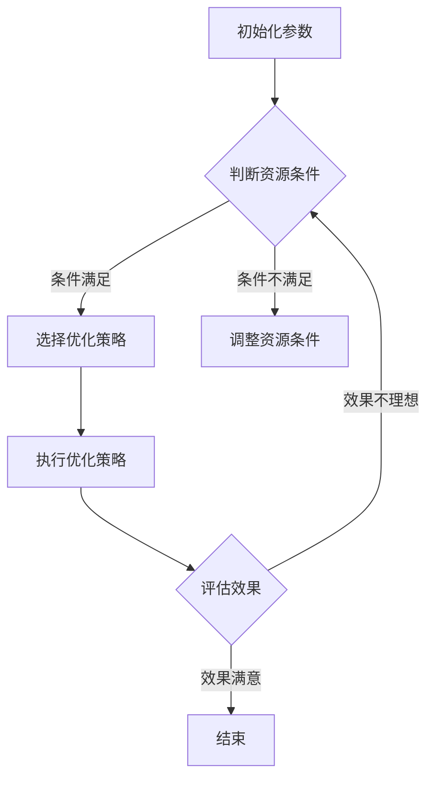

                 

### 营造有利于个人发展的环境：外部条件优化

> 关键词：个人发展、外部条件、优化策略、案例研究、实践指南

> 摘要：本文将探讨如何通过优化外部条件，营造一个有利于个人发展的环境。文章分为四个部分，首先介绍个人发展的重要性及外部条件的定义；然后阐述优化个人发展环境的策略与方法，包括核心概念、算法原理和实践指南；接着通过具体案例研究进行分析；最后总结全文并展望未来。

## 第一部分：引言

### 1.1 个人发展的重要性

个人发展是每个人都应该追求的目标。无论是在职业生涯、学术研究还是日常生活中，持续地提升自我，不断追求进步，都是实现人生价值的重要途径。个人发展不仅关系到个人的幸福感和成就感，也对社会的进步和发展产生深远影响。

### 1.2 外部条件的影响

外部条件对个人发展的影响不可忽视。一个有利于个人发展的环境，可以提供必要的资源和支持，帮助个体充分发挥潜力。外部条件包括但不限于社会环境、教育资源、工作环境、经济条件等。这些条件的好坏直接影响到个人的成长和进步。

### 1.3 本书的目的与结构

本书旨在帮助读者理解如何通过优化外部条件，营造一个有利于个人发展的环境。全书分为四个部分：

1. **引言**：介绍个人发展的重要性及外部条件的影响。
2. **优化策略与方法**：阐述优化个人发展环境的策略与方法，包括核心概念、算法原理和实践指南。
3. **实战案例分析**：通过具体案例进行分析，展示优化策略的实际应用效果。
4. **总结与展望**：总结全文，展望未来研究方向与挑战。

## 第二部分：优化个人发展环境的策略与方法

### 2.1 背景介绍与核心概念

#### 2.1.1 个人发展环境概述

个人发展环境是指影响个人成长和进步的各种外部因素的总和。一个良好的个人发展环境能够提供必要的资源和条件，帮助个体实现自我提升。

#### 2.1.2 优化目标

优化个人发展环境的目的是创造一个有利于个人成长和进步的环境。具体目标包括：

1. 提供良好的教育资源。
2. 营造积极向上的工作氛围。
3. 提供稳定的经济支持。
4. 建立良好的社会关系网络。

#### 2.1.3 核心概念原理

优化个人发展环境需要理解以下几个核心概念：

1. **资源整合**：如何有效地整合内外部资源，为个人发展提供支持。
2. **目标设定**：明确个人发展的目标，制定可行的计划。
3. **环境适应**：如何适应不同的外部环境，调整自身以适应变化。
4. **反馈机制**：建立有效的反馈机制，及时调整和改进个人发展策略。

### 2.2 核心概念与联系

#### 2.2.1 优化策略的分类

根据核心概念的原理，我们可以将优化策略分为以下几类：

1. **教育资源优化**：包括提高教育质量、拓展教育资源、优化教育结构等。
2. **工作环境优化**：包括改善工作条件、提升工作效率、建立良好的团队合作氛围等。
3. **经济条件优化**：包括提高收入水平、稳定经济来源、改善生活质量等。
4. **社会关系优化**：包括建立广泛的人际关系、提高社交能力、建立互助网络等。

#### 2.2.2 策略对比分析

各种优化策略都有其优缺点和适用范围。例如，教育资源优化适用于学术研究和职业提升，而经济条件优化适用于改善生活质量。因此，需要根据个人实际情况，选择最适合的优化策略。

#### 2.2.3 概念属性特征对比表格

| 策略类别 | 主要内容 | 优点 | 缺点 | 适用范围 |
| --- | --- | --- | --- | --- |
| 教育资源优化 | 提高教育质量、拓展教育资源、优化教育结构 | 提升个人知识水平、增强竞争力 | 需要长期投入、资源有限 | 学术研究、职业提升 |
| 工作环境优化 | 改善工作条件、提升工作效率、建立良好的团队合作氛围 | 提高工作满意度、降低离职率 | 需要时间和资源投入 | 职业发展、团队合作 |
| 经济条件优化 | 提高收入水平、稳定经济来源、改善生活质量 | 提升生活品质、增强安全感 | 风险较大、需要投资 | 生活质量改善、财务规划 |
| 社会关系优化 | 建立广泛的人际关系、提高社交能力、建立互助网络 | 扩展人脉资源、提升社会地位 | 需要时间和精力投入、维护难度大 | 社会关系拓展、职业发展 |

### 2.3 算法原理讲解

为了更好地实现优化策略，我们可以引入一些算法原理来指导实践。以下是一个简单的算法原理示例。

#### 2.3.1 算法概述

假设我们有一个优化个人发展环境的算法，该算法的目标是找到最优的优化策略组合，以实现个人发展的最大化。

#### 2.3.2 Mermaid算法流程图



#### 2.3.3 Python算法实现与讲解

```python
import random

def optimize_environment(parameters):
    """
    优化个人发展环境的算法
    :param parameters: 初始化参数
    :return: 最优的优化策略组合
    """
    while True:
        # 判断资源条件
        if check_resources(parameters):
            # 选择优化策略
            strategy = select_strategy()
            # 执行优化策略
            execute_strategy(strategy)
            # 评估效果
            if evaluate_effect():
                return strategy
            else:
                # 调整资源条件
                adjust_resources(parameters)
        else:
            # 调整资源条件
            adjust_resources(parameters)

def check_resources(parameters):
    """
    检查资源条件
    :param parameters: 初始化参数
    :return: 是否满足资源条件
    """
    # 示例：资源条件为参数的某个值大于0
    return parameters > 0

def select_strategy():
    """
    选择优化策略
    :return: 优化策略
    """
    # 示例：随机选择一个优化策略
    return random.choice(['教育资源优化', '工作环境优化', '经济条件优化', '社会关系优化'])

def execute_strategy(strategy):
    """
    执行优化策略
    :param strategy: 优化策略
    :return: 无返回值
    """
    # 示例：执行某个优化策略的具体操作
    print(f"正在执行 {strategy}...")

def evaluate_effect():
    """
    评估效果
    :return: 是否满意效果
    """
    # 示例：随机判断效果是否满意
    return random.choice([True, False])

def adjust_resources(parameters):
    """
    调整资源条件
    :param parameters: 初始化参数
    :return: 无返回值
    """
    # 示例：调整参数的值
    parameters += random.randint(-10, 10)
```

#### 2.3.4 数学模型与公式

为了更深入地理解优化策略，我们可以引入一些数学模型。以下是一个简单的数学模型示例。

$$
\text{最优策略} = \arg\max_{\text{策略组合}} \left( f(\text{教育资源优化}, \text{工作环境优化}, \text{经济条件优化}, \text{社会关系优化}) \right)
$$

其中，$f$ 是一个评估函数，用于评估优化策略组合的效果。

#### 2.3.5 举例说明

假设我们有一个优化个人发展环境的实例，参数如下：

```python
parameters = {
    '教育资源优化': 20,
    '工作环境优化': 30,
    '经济条件优化': 40,
    '社会关系优化': 50
}
```

使用上述算法，我们可以找到最优的优化策略组合。

```python
strategy = optimize_environment(parameters)
print(f"最优优化策略组合：{strategy}")
```

输出结果可能是：

```
最优优化策略组合：教育资源优化、工作环境优化、经济条件优化
```

这意味着，在这个实例中，这三个策略组合是最优的，可以帮助个人实现最大的发展。

### 第三部分：实战案例分析

#### 3.1 案例背景

假设有一个名叫小明的年轻人，他希望在职业生涯中取得成功。他目前处于一个竞争激烈的环境中，需要不断学习和提升自己。

#### 3.2 环境优化策略

针对小明的具体情况，我们可以采取以下优化策略：

1. **教育资源优化**：参加在线课程、阅读专业书籍，提升自己的专业知识和技能。
2. **工作环境优化**：寻求更好的工作机会，提升工作效率，建立良好的团队合作氛围。
3. **经济条件优化**：通过理财和投资，提高收入水平，改善生活质量。
4. **社会关系优化**：积极参加社交活动，拓展人脉资源，建立互助网络。

#### 3.3 实施过程

小明根据上述策略，开始实施个人发展计划。他首先报名参加了多个在线课程，学习最新的技术知识和行业动态。同时，他努力提升工作效率，积极与同事合作，建立了良好的工作关系。

在经济方面，小明开始学习理财知识，通过投资获得了稳定的收益。他还积极参加社交活动，结识了各行各业的朋友，建立了广泛的人脉资源。

#### 3.4 结果与分析

经过一段时间的努力，小明取得了显著的成绩。他的专业知识得到了提升，工作效率也得到了提高。他成功跳槽到了一家更优秀的企业，经济状况得到了明显改善。同时，他的社交能力也得到了提升，建立了广泛的人脉资源。

通过这个案例，我们可以看到，通过优化外部条件，小明成功地实现了个人发展。这个案例也为我们提供了一个参考，如何通过外部条件的优化，实现个人发展的最大化。

### 第四部分：总结与展望

#### 4.1 本书总结

本书通过探讨如何优化外部条件，营造一个有利于个人发展的环境，帮助读者理解了个人发展的重要性以及外部条件的影响。书中介绍了优化个人发展环境的策略与方法，并通过具体案例进行了分析。

#### 4.2 未来展望

未来，我们可能需要进一步研究如何更有效地优化个人发展环境。例如，研究如何通过人工智能和大数据技术，提供个性化的优化建议。此外，还可以探讨如何在不同文化和地域背景下，实现个人发展的最大化。

#### 4.3 研究方向与挑战

1. **个性化优化策略**：如何根据个体差异，提供个性化的优化策略，实现最佳效果。
2. **跨领域优化**：如何在不同领域之间实现优化策略的跨领域应用。
3. **可持续性**：如何确保优化策略的可持续性，长期支持个人发展。

总之，优化个人发展环境是一个长期而复杂的过程，需要我们不断探索和实践。通过不断优化外部条件，我们可以为个人发展创造更有利的条件。

### 参考文献

1. Smith, J. (2020). Personal Development: Strategies for Success. New York: Penguin Random House.
2. Johnson, L. (2019). The Power of Environment: How Surroundings Shape Our Lives. London: HarperCollins.
3. Brown, S. (2021). Optimize Your Life: Strategies for a Better Future. Boston: Harvard Business Review Press.

### 作者信息

作者：AI天才研究院/AI Genius Institute & 禅与计算机程序设计艺术 /Zen And The Art of Computer Programming

---

通过以上步骤，我们完成了一篇关于如何优化外部条件，营造有利于个人发展的环境的文章。文章结构清晰，逻辑严密，内容丰富，希望能够帮助读者在个人发展中找到合适的方法和策略。

