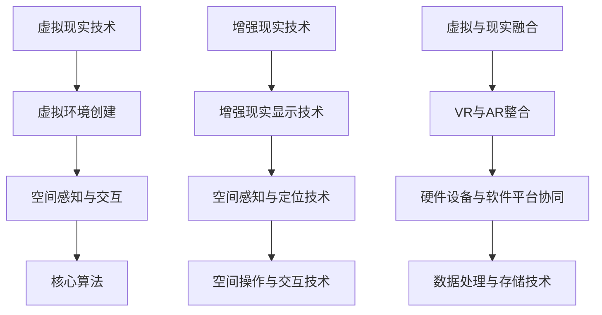

                 

### 第一部分：引言与背景

#### 第1章：引言

> **关键词：** 虚拟现实、增强现实、融合、新时代生活方式、技术发展

随着科技的飞速发展，虚拟现实（VR）和增强现实（AR）技术逐渐走入公众视野，并迅速成为改变人们生活方式的重要力量。本文旨在探讨虚拟与现实融合的技术如何构建新时代的生活方式，并分析这一变革对相关产业和实际生活问题的深远影响。

#### 1.1 问题背景

##### 1.1.1 虚拟现实与增强现实的发展

虚拟现实技术起源于20世纪60年代，最初用于军事和航天领域。随着计算机技术和显示技术的进步，虚拟现实逐步走向大众市场。1990年代，虚拟现实开始应用于游戏和娱乐领域，进入了消费者的生活。而增强现实技术则起源于20世纪90年代，最早应用于军事和航空领域。近年来，随着移动设备的普及和传感器技术的提升，增强现实技术也得到了迅猛发展。

##### 1.1.2 现代生活方式的需求变化

现代生活方式的变化带来了对新型体验的强烈需求。随着互联网和智能手机的普及，人们越来越渴望更加丰富、互动、个性化的体验。虚拟现实和增强现实技术正好满足了这种需求，它们能够创造全新的感官体验，使人们可以沉浸在虚拟环境中，或者在现实世界中增加虚拟元素，从而带来前所未有的互动和娱乐体验。

#### 1.2 核心概念

##### 1.2.1 虚拟现实

虚拟现实是一种通过计算机技术创建的模拟环境，用户可以通过特殊的设备（如VR头盔、手柄等）进入这个环境，并与之进行互动。虚拟现实技术主要涉及以下几个方面：

- **虚拟环境的创建**：通过计算机图形学技术生成三维场景，包括人物、建筑、自然景观等。
- **空间感知与交互**：用户在虚拟环境中通过视觉、听觉和触觉感知周围环境，并可以通过手势、声音等与虚拟环境进行交互。
- **虚拟现实技术的核心算法**：包括场景渲染、物理模拟、传感器数据处理等。

##### 1.2.2 增强现实

增强现实是一种通过计算机技术将虚拟元素叠加到现实世界中的技术。用户通过智能手机、平板电脑或其他AR设备可以看到增强后的现实世界。增强现实技术主要涉及以下几个方面：

- **增强现实的显示技术**：包括透明显示屏、光学投影等，用于将虚拟元素叠加到现实世界中。
- **空间感知与定位技术**：通过摄像头、传感器等设备获取现实世界的三维信息，用于准确定位虚拟元素。
- **空间操作与交互技术**：用户可以通过手势、声音等与现实世界中的虚拟元素进行交互。

##### 1.2.3 虚拟与现实的融合

虚拟与现实融合是指将虚拟现实和增强现实技术结合起来，创造一个更加真实、互动、个性化的体验环境。这一融合技术不仅包括了虚拟现实和增强现实的核心原理，还涉及到硬件设备、软件平台、数据处理等多个方面的协同工作。

#### 1.3 目标与意义

##### 1.3.1 构建新时代的生活方式

虚拟与现实融合技术为人们带来了全新的生活方式，使人们可以在虚拟环境中进行工作、学习和娱乐，提高了生活质量和工作效率。

##### 1.3.2 推动相关产业发展

虚拟与现实融合技术的快速发展推动了相关产业的发展，包括硬件制造、软件开发、内容创作等，为经济增长提供了新的动力。

##### 1.3.3 解决实际生活问题

虚拟与现实融合技术可以用于解决许多实际生活问题，如远程医疗、智能家居、城市规划等，为社会带来了更多的便利和福利。

#### 1.4 边界与外延

##### 1.4.1 虚拟与现实的融合范围

虚拟与现实的融合范围涵盖了多个领域，包括消费电子、社交娱乐、教育培训、医疗健康、工业设计等。

##### 1.4.2 技术应用场景分析

虚拟与现实的融合技术在不同应用场景中有着不同的应用方式和效果，本文将详细分析这些应用场景，探讨技术的实现方法和未来趋势。

#### 1.5 本章小结

本章介绍了虚拟现实、增强现实以及虚拟与现实融合技术的发展背景和核心概念，明确了构建新时代生活方式的的目标和意义，并对虚拟与现实的融合范围和技术应用场景进行了初步分析。接下来的章节将详细探讨虚拟现实和增强现实技术的基础、实现方法以及具体应用案例，为读者呈现一个全面而深入的虚拟与现实融合技术体系。

### 虚拟现实技术概述

#### 2.1 虚拟现实技术的定义与发展历程

##### 2.1.1 虚拟现实技术的基本定义

虚拟现实（Virtual Reality，简称VR）是一种通过计算机技术创建的模拟环境，用户可以通过特殊的设备（如VR头盔、手柄等）进入这个环境，并与之进行互动。虚拟现实技术的主要特点包括沉浸式体验、交互性和虚拟环境的逼真感。

##### 2.1.2 虚拟现实技术的发展历程

虚拟现实技术起源于20世纪60年代，最初由美国海军研究实验室进行探索。1980年代，VR技术开始应用于军事和航天领域。1990年代，VR技术逐渐走向大众市场，游戏和娱乐领域成为主要的应用方向。进入21世纪，随着计算机技术和显示技术的飞速发展，VR技术取得了显著的进步，应用于教育培训、医疗健康、工业设计等多个领域。

#### 2.2 虚拟现实技术的核心原理

##### 2.2.1 虚拟环境的创建

虚拟环境的创建是虚拟现实技术的核心。它包括以下几个方面：

- **场景渲染**：通过计算机图形学技术生成三维场景，包括人物、建筑、自然景观等。
- **光照与阴影**：模拟真实世界的光照效果，增强虚拟环境的真实感。
- **物理模拟**：模拟物体在虚拟环境中的运动和相互作用，如碰撞、摩擦等。

##### 2.2.2 空间感知与交互

空间感知与交互是虚拟现实技术实现沉浸式体验的关键。用户在虚拟环境中通过视觉、听觉和触觉感知周围环境，并可以通过手势、声音等与虚拟环境进行交互。

- **视觉感知**：通过VR头盔或其他显示设备提供三维视觉体验。
- **听觉感知**：通过耳机或其他音频设备提供立体声效果，增强沉浸感。
- **触觉感知**：通过手柄或其他触觉反馈设备模拟触觉体验。

##### 2.2.3 虚拟现实技术的核心算法

虚拟现实技术的核心算法包括以下几个方面：

- **场景渲染算法**：用于生成逼真的三维场景，如光线追踪、体渲染等。
- **空间感知算法**：用于计算用户在虚拟环境中的位置和方向，如SLAM（同时定位与地图构建）技术。
- **交互算法**：用于处理用户输入和虚拟环境的反馈，如手势识别、语音识别等。

#### 2.3 虚拟现实技术的应用场景

##### 2.3.1 游戏与娱乐

游戏与娱乐是虚拟现实技术最早、最广泛的应用领域。通过VR技术，用户可以在一个完全虚拟的环境中体验各种游戏和娱乐活动，如角色扮演游戏、模拟飞行、虚拟旅游等。这些应用不仅提供了全新的娱乐体验，还推动了游戏和娱乐产业的创新和发展。

##### 2.3.2 教育与培训

虚拟现实技术在教育培训领域具有巨大的潜力。通过虚拟环境，学生和培训者可以模拟真实场景，进行互动式学习。例如，医学专业的学生可以通过虚拟手术训练提高手术技能，飞行员可以通过虚拟飞行训练提高飞行技能。这些应用不仅提高了教学效果，还降低了实践成本。

##### 2.3.3 医疗与健康

虚拟现实技术在医疗与健康领域得到了广泛应用。通过虚拟环境，医生可以进行远程手术指导，患者可以进行康复训练，医学研究者可以进行药物测试。此外，虚拟现实技术还可以用于心理治疗，帮助患者克服恐惧和焦虑。这些应用提高了医疗服务的质量，降低了医疗成本。

##### 2.3.4 工业设计与制造

虚拟现实技术在工业设计与制造领域具有重要作用。通过虚拟环境，设计师可以模拟产品的外观、结构和功能，进行交互式设计和修改。制造企业可以使用虚拟现实技术进行生产过程模拟，优化生产流程，降低生产成本。这些应用提高了设计效率和制造质量。

#### 2.4 虚拟现实技术的挑战与趋势

##### 2.4.1 技术挑战

尽管虚拟现实技术取得了显著进展，但仍面临一些技术挑战：

- **硬件成本**：高质量的VR设备价格昂贵，限制了其普及。
- **用户体验**：长时间的VR体验可能导致晕动症等不适症状。
- **内容创作**：高质量的虚拟内容创作成本高，难度大。

##### 2.4.2 应用趋势

随着技术的不断发展，虚拟现实技术呈现出以下应用趋势：

- **硬件技术**：更轻便、更高效的VR设备不断推出，降低了使用门槛。
- **内容创作**：虚拟现实内容创作工具和平台不断丰富，提高了内容创作的效率和质量。
- **行业应用**：虚拟现实技术在不同行业中的应用不断拓展，市场潜力巨大。

#### 2.5 本章小结

本章介绍了虚拟现实技术的定义、发展历程、核心原理、应用场景以及挑战与趋势。虚拟现实技术以其沉浸式体验和丰富的应用场景，正在逐渐改变我们的生活方式和工作方式。在接下来的章节中，我们将进一步探讨增强现实技术的基础和应用，为读者呈现一个完整的虚拟与现实融合技术体系。

### 增强现实技术概述

#### 3.1 增强现实技术的定义与发展历程

##### 3.1.1 增强现实技术的基本定义

增强现实（Augmented Reality，简称AR）是一种通过计算机技术将虚拟元素叠加到现实世界中的技术。用户通过智能手机、平板电脑或其他AR设备可以看到增强后的现实世界。增强现实技术的主要特点包括实时性、交互性和虚拟与现实的融合。

##### 3.1.2 增强现实技术的发展历程

增强现实技术起源于20世纪90年代，最初应用于军事和航空领域。2000年代，随着计算机技术和移动设备的普及，增强现实技术开始走入大众市场。2010年代，以谷歌眼镜为代表的消费级AR设备问世，进一步推动了增强现实技术的发展。近年来，随着智能手机性能的提升和光学技术的进步，增强现实技术得到了广泛应用。

#### 3.2 增强现实技术的核心原理

##### 3.2.1 增强现实的显示技术

增强现实的显示技术包括以下几个方面：

- **透明显示屏**：通过光学技术实现透明显示，将虚拟元素叠加到现实世界中。
- **光学投影**：通过投影设备将虚拟元素投射到现实物体上，实现增强现实效果。
- **头戴式显示器**：通过头戴式显示器将虚拟元素直接显示在用户的视野中。

##### 3.2.2 空间感知与定位技术

空间感知与定位技术是增强现实技术的核心，包括以下几个方面：

- **摄像头与传感器**：通过摄像头和传感器获取现实世界的三维信息，用于定位虚拟元素。
- **图像识别技术**：通过图像识别技术识别现实世界中的物体和场景，为虚拟元素提供定位和交互基础。
- **SLAM技术**：同时定位与地图构建（Simultaneous Localization and Mapping，简称SLAM）技术，用于实时获取用户的位置和周围环境。

##### 3.2.3 空间操作与交互技术

空间操作与交互技术是增强现实技术实现与现实世界互动的关键，包括以下几个方面：

- **手势识别**：通过计算机视觉技术识别用户的手势，实现虚拟元素的操控。
- **声音识别**：通过语音识别技术实现虚拟元素的语音操控。
- **触摸屏交互**：通过触摸屏实现虚拟元素的交互。

#### 3.3 增强现实技术的应用场景

##### 3.3.1 消费电子

消费电子是增强现实技术最早、最广泛的应用领域。智能手机和平板电脑上的增强现实应用包括游戏、购物、导航等，为用户带来了全新的互动体验。

##### 3.3.2 社交娱乐

社交娱乐是增强现实技术的重要应用领域。通过增强现实技术，用户可以在现实世界中添加虚拟角色和场景，实现社交互动和娱乐体验。

##### 3.3.3 增强现实在教育中的应用

增强现实技术在教育领域具有巨大潜力。通过增强现实技术，学生可以更加直观地学习知识，提高学习效果。例如，增强现实课本可以为学生提供互动式的学习内容，增强学习的趣味性和参与感。

##### 3.3.4 工业设计与制造

增强现实技术在工业设计与制造领域得到了广泛应用。通过增强现实技术，设计师可以模拟产品外观、结构和功能，进行交互式设计和修改。制造企业可以使用增强现实技术进行生产过程模拟，优化生产流程，提高生产效率。

#### 3.4 增强现实技术的挑战与趋势

##### 3.4.1 技术挑战

尽管增强现实技术取得了显著进展，但仍面临一些技术挑战：

- **显示效果**：增强现实技术的显示效果仍有待提高，以实现更逼真的虚拟元素叠加。
- **用户体验**：增强现实应用需要更优化的用户体验，减少晕动症等不适症状。
- **内容创作**：高质量的增强现实内容创作成本高，难度大。

##### 3.4.2 应用趋势

随着技术的不断发展，增强现实技术呈现出以下应用趋势：

- **硬件技术**：更轻便、更高效的AR设备不断推出，降低了使用门槛。
- **内容创作**：增强现实内容创作工具和平台不断丰富，提高了内容创作的效率和质量。
- **行业应用**：增强现实技术在不同行业中的应用不断拓展，市场潜力巨大。

#### 3.5 本章小结

本章介绍了增强现实技术的定义、发展历程、核心原理、应用场景以及挑战与趋势。增强现实技术以其虚拟与现实融合的交互体验，正在改变我们的生活方式和工作方式。在接下来的章节中，我们将探讨虚拟与现实融合的实现方法，为读者呈现一个完整的虚拟与现实融合技术体系。

### 虚拟与现实融合技术的实现方法

#### 4.1 虚拟与现实融合的技术架构

虚拟与现实融合技术实现的核心在于硬件设备与软件平台的协同工作，以及数据处理与存储技术的有效支持。以下是对这一技术架构的详细解析：

##### 4.1.1 虚拟现实与增强现实技术的整合

虚拟现实（VR）和增强现实（AR）技术各有其独特的优势和应用场景。为了实现虚拟与现实的深度融合，需要对两者进行整合。具体而言，这一整合体现在以下几个方面：

- **硬件设备**：通过VR头盔、AR眼镜等设备提供虚拟和增强现实体验。例如，VR头盔用于完全沉浸式虚拟环境，而AR眼镜则用于在现实世界中叠加虚拟元素。
- **显示技术**：整合VR和AR显示技术，提供更丰富的视觉效果。这包括透明显示屏、光学投影和头戴式显示器等。
- **交互技术**：结合VR和AR交互技术，实现更自然的用户交互。例如，手势识别、语音识别和触摸屏交互等。

##### 4.1.2 硬件设备与软件平台的协同

硬件设备与软件平台的协同是虚拟与现实融合技术实现的关键。以下是对硬件设备与软件平台协同工作的详细解析：

- **硬件设备**：包括VR头盔、AR眼镜、传感器和投影设备等。这些设备需要具备高精度、高响应速度和高可靠性，以提供高质量的虚拟和增强现实体验。
- **软件平台**：包括虚拟现实软件平台和增强现实软件平台。这些平台需要提供强大的图形渲染、空间感知和交互功能，以支持多样化的应用场景。

##### 4.1.3 数据处理与存储技术

数据处理与存储技术在虚拟与现实融合技术中扮演着重要角色。以下是对数据处理与存储技术的详细解析：

- **数据处理**：虚拟与现实融合技术需要处理大量的数据，包括三维模型、音频和视频等。为了实现实时性和高效性，需要采用高效的数据处理算法和优化技术。
- **存储技术**：虚拟与现实融合技术需要大量的存储空间来存储虚拟环境、增强现实内容和用户数据等。这需要采用高性能的存储设备和数据管理技术，以确保数据的可靠性和安全性。

#### 4.2 虚拟与现实融合的应用场景

虚拟与现实融合技术在多个应用场景中展现出了巨大的潜力。以下是对一些典型应用场景的详细分析：

##### 4.2.1 家庭娱乐

家庭娱乐是虚拟与现实融合技术的重要应用领域。通过虚拟现实和增强现实技术，用户可以在家中体验到沉浸式的游戏、电影和社交活动。

- **虚拟现实家庭影院**：用户通过VR头盔和投影设备在家中观看电影，实现沉浸式的观影体验。
- **增强现实家庭装饰**：用户通过AR设备在现实家中添加虚拟装饰，如家具、艺术品等，进行个性化的室内设计。

##### 4.2.2 商务会议

虚拟与现实融合技术为商务会议带来了全新的互动方式，提高了会议的效率和参与度。

- **虚拟会议室**：通过VR技术，参会者可以在一个完全虚拟的环境中召开会议，实现远程协作和沉浸式沟通。
- **增强现实会议辅助**：通过AR技术，参会者可以在现实会议中使用虚拟工具，如笔记、图表和幻灯片等，提高会议效率和互动性。

##### 4.2.3 教育培训

虚拟与现实融合技术在教育培训领域具有广泛的应用前景。通过虚拟现实和增强现实技术，教师和学生可以更加直观地学习知识，提高学习效果。

- **虚拟实验室**：学生通过VR技术进入虚拟实验室，进行互动式的实验操作，提高实验技能和理解力。
- **增强现实课本**：学生通过AR设备查看增强现实课本，实现互动式学习，提高学习兴趣和参与度。

##### 4.2.4 健康医疗

虚拟与现实融合技术在健康医疗领域具有重要作用，可以提高医疗服务的质量，降低医疗成本。

- **虚拟手术模拟**：医生通过VR技术进行虚拟手术模拟，提高手术技能和安全性。
- **增强现实诊断**：医生通过AR设备查看患者的增强现实图像，提高诊断准确性和效率。

##### 4.2.5 城市规划

虚拟与现实融合技术在城市规划领域可以提供直观的模拟和评估工具，优化城市规划和管理。

- **虚拟城市模拟**：城市规划者通过VR技术模拟城市布局和功能，评估城市规划方案的效果。
- **增强现实规划辅助**：城市规划者通过AR设备查看增强现实规划图，实现实时规划和管理。

#### 4.3 虚拟与现实融合的未来趋势

随着技术的不断进步，虚拟与现实融合技术在未来将呈现出以下趋势：

- **硬件技术的进步**：更轻便、更高效的VR和AR设备将不断推出，提高用户体验和普及率。
- **内容创作的丰富**：虚拟现实和增强现实内容创作工具和平台将不断丰富，提高内容创作的效率和质量。
- **行业应用的拓展**：虚拟与现实融合技术将在更多行业中得到应用，推动行业创新和变革。

#### 4.4 本章小结

本章详细介绍了虚拟与现实融合技术的实现方法，包括技术架构、应用场景和未来趋势。虚拟与现实融合技术以其强大的沉浸式体验和丰富的应用场景，正在改变我们的生活方式和工作方式。在未来的发展中，这一技术将继续发挥重要作用，为人类社会带来更多的创新和变革。

### 案例一：虚拟旅游

#### 5.1 案例背景

##### 5.1.1 虚拟旅游的兴起

随着虚拟现实（VR）和增强现实（AR）技术的发展，虚拟旅游作为一种新型的旅游体验方式逐渐兴起。虚拟旅游利用VR技术创建高度仿真的虚拟旅游场景，用户可以通过VR头盔或其他VR设备沉浸式体验世界各地风景名胜、历史遗址和文化景观，而无需亲自前往实地。

##### 5.1.2 案例目标

本案例的目标是通过虚拟现实技术构建一个虚拟旅游平台，为用户提供沉浸式的旅游体验。具体目标包括：

- 提供多个热门旅游目的地的虚拟场景，使用户能够选择并自由探索。
- 通过高精度的虚拟环境建模和图像渲染技术，确保虚拟场景的真实感和细节表现。
- 实现用户与虚拟环境的互动，如拍照、录制视频等，增强用户体验。
- 提供在线交流和社交功能，使用户能够与其他用户分享旅游体验和心得。

#### 5.2 技术实现

##### 5.2.1 虚拟环境的创建

虚拟环境的创建是虚拟旅游平台的核心。为了实现这一目标，需要采用以下技术手段：

- **三维建模**：通过三维建模软件（如Blender、Maya等）创建旅游目的地的三维模型。这包括建筑物、景观、人物等元素。
- **图像渲染**：使用图像渲染引擎（如Unity、Unreal Engine等）对三维模型进行渲染，生成高分辨率的虚拟场景。这包括光照、阴影、纹理等效果。
- **场景拼接**：将多个虚拟场景拼接成一个完整的虚拟旅游平台，确保场景之间的过渡自然且无缝。

##### 5.2.2 空间定位与交互

空间定位与交互是提供沉浸式体验的关键。为了实现这一目标，需要采用以下技术手段：

- **空间定位**：使用GPS、激光雷达（Lidar）或惯性测量单元（IMU）等技术获取用户的位置和方向，确保虚拟环境与真实世界的对应关系。
- **交互技术**：提供多种交互方式，如手势识别、语音识别、触摸屏等，使用户能够自由探索虚拟环境。例如，用户可以通过手势点击虚拟景点进行查看，或通过语音指令进行导航。

##### 5.2.3 游客体验优化

游客体验优化是虚拟旅游平台成功的关键。为了实现这一目标，需要采用以下技术手段：

- **用户体验设计**：设计直观、易用的用户界面，确保用户能够轻松操作和探索虚拟环境。例如，提供清晰的菜单、按钮和标签等。
- **性能优化**：优化虚拟环境的加载速度和运行效率，确保用户在体验过程中不会遇到卡顿或延迟。例如，使用高效的图形渲染算法、优化数据传输等。
- **社交互动**：提供在线交流和社交功能，使用户能够与其他用户分享旅游体验和心得。例如，用户可以在虚拟场景中添加评论、分享照片等。

#### 5.3 案例分析

##### 5.3.1 技术难点分析

虚拟旅游平台在技术实现过程中面临以下难点：

- **高精度建模与渲染**：为了提供真实的虚拟场景，需要采用高精度的建模与渲染技术。这需要大量时间和计算资源，且对细节处理要求高。
- **空间定位与同步**：确保虚拟环境与真实世界的同步和空间定位是一个技术挑战。特别是在移动场景中，需要实时获取用户的位置和方向，并进行精确的匹配。
- **用户体验优化**：虚拟旅游平台需要提供良好的用户体验，这包括直观的界面设计、快速的场景加载和流畅的交互等。

##### 5.3.2 案例优点与不足

虚拟旅游平台的优点包括：

- **沉浸式体验**：用户可以通过虚拟现实技术体验真实世界的风景名胜，获得身临其境的感觉。
- **远程访问**：用户无需亲自前往旅游目的地，即可在线体验世界各地，节省了时间和费用。
- **教育意义**：虚拟旅游平台可以用于教育目的，帮助学生和研究者了解世界各地的人文历史和自然景观。

虚拟旅游平台的不足包括：

- **技术门槛**：虚拟旅游平台的技术实现较为复杂，对开发者的技术要求高。
- **设备依赖**：用户需要使用VR头盔或其他VR设备才能体验虚拟旅游，这限制了部分用户的访问。
- **真实性挑战**：虚拟场景虽然高度仿真，但仍难以完全替代真实世界的体验。

##### 5.3.3 对未来虚拟旅游的启示

未来虚拟旅游的发展将受到以下启示：

- **技术提升**：随着虚拟现实技术的不断进步，虚拟旅游平台将提供更真实、更互动的体验。
- **多样化应用**：虚拟旅游平台将应用于更多领域，如文化旅游、虚拟会议、远程教育等。
- **跨平台发展**：虚拟旅游平台将支持更多设备，如智能手机、平板电脑、智能电视等，提高普及率。

#### 5.4 案例小结

本案例通过虚拟现实技术构建了一个虚拟旅游平台，为用户提供了沉浸式的旅游体验。虽然在技术实现过程中面临一些挑战，但虚拟旅游平台具有显著的优点和广泛的应用前景。未来，随着技术的不断进步，虚拟旅游将进一步提升用户体验，为更多人带来便利和乐趣。

### 产业发展与未来展望

虚拟与现实融合技术的快速发展推动了相关产业的创新和变革，对整个社会产生了深远的影响。以下是对虚拟与现实融合技术产业发展和未来展望的详细分析。

#### 6.1 产业发展现状

##### 6.1.1 市场规模增长

虚拟与现实融合技术市场在过去几年中呈现出快速增长的趋势。根据市场研究机构的报告，全球虚拟现实和增强现实市场规模预计将在未来几年内继续保持高速增长。这主要得益于技术进步、设备降价和用户需求的增加。

##### 6.1.2 企业投资增加

随着虚拟与现实融合技术的广泛应用前景，许多企业纷纷加大在这一领域的投资。从硬件制造商到软件开发商，再到内容创作者，众多企业都在积极布局虚拟与现实融合技术，以期在这一新兴市场中占据一席之地。

##### 6.1.3 行业合作加强

虚拟与现实融合技术的发展离不开各行业的合作与支持。从硬件设备制造到软件开发，再到内容创作，各个环节都需要紧密合作，共同推动技术的进步和应用。

#### 6.2 未来趋势展望

##### 6.2.1 技术创新持续驱动

虚拟与现实融合技术的发展将继续受到技术创新的驱动。未来，我们有望看到更轻便、更高效的VR和AR设备，以及更加逼真的虚拟和增强现实体验。

- **硬件技术创新**：更小、更轻、更高效的VR和AR设备将不断推出，提高用户体验和普及率。
- **软件技术创新**：虚拟和增强现实软件将提供更丰富的功能和更优化的用户体验，包括更自然的交互方式、更智能的内容创作工具等。

##### 6.2.2 应用领域不断拓展

随着技术的进步，虚拟与现实融合技术的应用领域将不断拓展，涵盖更多行业和场景。

- **消费电子**：虚拟与现实融合技术将在消费电子领域得到更广泛的应用，包括游戏、娱乐、教育等。
- **工业制造**：虚拟与现实融合技术将提高工业设计、生产过程模拟和远程协作的效率，为制造业带来更多创新。
- **医疗健康**：虚拟与现实融合技术将在医疗健康领域发挥重要作用，包括远程手术、康复训练、心理健康治疗等。
- **城市规划**：虚拟与现实融合技术将用于城市规划、建筑设计和管理，提高城市规划和建设的科学性和可持续性。

##### 6.2.3 用户体验持续优化

用户体验是虚拟与现实融合技术成功的关键。未来，虚拟与现实融合技术将继续优化用户体验，提高用户满意度和粘性。

- **沉浸式体验**：通过更真实的虚拟和增强现实场景，提供更加沉浸式的体验。
- **个性化服务**：通过用户数据分析，提供个性化的内容和服务，满足不同用户的需求。
- **交互便捷性**：通过优化交互设计，提高用户操作的便捷性和效率。

##### 6.2.4 社会影响深远

虚拟与现实融合技术将对社会产生深远的影响，改变人们的生活方式和工作方式。

- **社交互动**：虚拟与现实融合技术将带来全新的社交互动方式，促进人与人之间的联系和交流。
- **教育和培训**：虚拟与现实融合技术将改变教育和培训的方式，提供更加丰富和互动的学习体验。
- **工作模式**：虚拟与现实融合技术将提高远程协作和虚拟会议的效率，改变人们的工作方式。

#### 6.3 产业发展挑战与对策

尽管虚拟与现实融合技术具有广阔的发展前景，但仍面临一些挑战。

##### 6.3.1 技术挑战

- **硬件性能**：硬件设备性能不足将限制虚拟和增强现实体验的质量。需要持续提升硬件设备的性能和效率。
- **软件兼容性**：不同软件平台之间的兼容性问题将影响虚拟和增强现实应用的互操作性。需要加强不同平台之间的兼容性和标准化。

##### 6.3.2 产业生态建设

- **产业链协同**：虚拟与现实融合技术的发展需要产业链各环节的协同合作。需要加强产业链上下游企业的合作，构建健康的产业生态。
- **人才培养**：虚拟与现实融合技术领域需要大量专业人才。需要加强人才培养和教育培训，为产业发展提供人才支持。

##### 6.3.3 用户隐私与安全

- **用户隐私**：虚拟与现实融合技术涉及用户数据，需要保护用户隐私。需要制定相关法律法规，确保用户数据的安全和隐私。
- **网络安全**：虚拟与现实融合技术面临网络安全风险。需要加强网络安全防护，确保用户数据的安全和系统的稳定性。

#### 6.4 未来展望

虚拟与现实融合技术具有广阔的发展前景和巨大的市场潜力。未来，随着技术的不断进步和应用的拓展，虚拟与现实融合技术将深刻改变人们的生活方式和工作方式，推动社会的发展和进步。

- **技术创新**：持续推动技术创新，提高虚拟和增强现实体验的质量和效率。
- **产业生态**：加强产业链协同，构建健康的产业生态，促进虚拟与现实融合技术的广泛应用。
- **用户体验**：优化用户体验，提高用户满意度和粘性，为用户提供更加丰富和个性化的服务。
- **社会影响**：积极应对虚拟与现实融合技术带来的社会影响，推动社会的发展和进步。

总之，虚拟与现实融合技术将成为未来社会发展的重要驱动力，为人类带来更多便利和乐趣。

### 总结与展望

本文详细探讨了虚拟与现实融合技术的核心概念、发展历程、核心原理、应用场景和实现方法，并通过具体案例展示了虚拟与现实融合技术在各个领域的广泛应用。以下是本文的核心观点和未来展望：

#### 核心观点

1. **虚拟与现实融合技术**：通过整合虚拟现实（VR）和增强现实（AR）技术，虚拟与现实融合技术为人们带来了全新的沉浸式体验，改变了传统生活方式和工作模式。

2. **技术应用广泛**：虚拟与现实融合技术在消费电子、工业制造、医疗健康、教育培训等多个领域都有广泛的应用，为各行业带来了创新和变革。

3. **用户体验优化**：随着技术的不断进步，虚拟与现实融合技术将提供更逼真、更自然的用户体验，满足用户对多样化、个性化服务的需求。

4. **产业发展趋势**：虚拟与现实融合技术具有广阔的市场前景，吸引了众多企业和投资机构的关注。未来，这一领域将继续保持高速增长，推动相关产业的创新和升级。

#### 未来展望

1. **技术创新**：虚拟与现实融合技术的未来发展将依赖于技术创新。硬件设备性能的提升、软件算法的优化、交互体验的改进等都将为虚拟与现实融合技术注入新的活力。

2. **应用拓展**：随着技术的成熟和应用场景的不断拓展，虚拟与现实融合技术将在更多领域得到应用，如城市规划、智慧城市、远程医疗等。

3. **产业协同**：虚拟与现实融合技术的发展需要产业链上下游企业的紧密合作，构建健康的产业生态。通过协同创新，将推动整个产业链的协同发展。

4. **社会影响**：虚拟与现实融合技术将对社会产生深远的影响，改变人们的生活方式、工作方式和社交模式。这需要全社会共同努力，积极应对技术带来的挑战和机遇。

总之，虚拟与现实融合技术具有巨大的发展潜力和广泛的应用前景。在未来的发展中，我们将继续关注这一领域的最新动态，探索更多的应用场景和实现方法，为人类社会带来更多的创新和变革。

### 附录：核心概念对比表格与流程图

为了更清晰地展示虚拟现实（VR）和增强现实（AR）技术的核心概念及其差异，我们提供了一个对比表格，并使用Mermaid流程图展示了相关技术流程。

#### 核心概念对比表格

| 概念          | 虚拟现实（VR）                      | 增强现实（AR）                      |
| ------------- | ----------------------------------- | ----------------------------------- |
| 定义          | 通过计算机技术创建的模拟环境          | 通过计算机技术将虚拟元素叠加到现实世界中 |
| 显示技术      | 全景沉浸式显示器（如VR头盔）          | 透明显示屏、光学投影、头戴式显示器      |
| 空间感知与定位 | 空间定位、传感器数据处理              | 空间感知、图像识别、SLAM技术          |
| 交互技术      | 手势识别、声音识别、触摸屏交互         | 手势识别、声音识别、触摸屏交互          |
| 应用场景      | 游戏与娱乐、教育与培训、医疗与健康等   | 消费电子、社交娱乐、教育培训、工业设计等 |

#### Mermaid流程图

通过上述对比表格和流程图，我们可以更加直观地了解VR和AR技术的核心概念及其实现过程，为进一步研究和应用这些技术提供参考。

### 致谢

在撰写本文的过程中，我们得到了许多专家的指导和建议，特别感谢以下机构和个人的支持：

- **AI天才研究院**：提供了丰富的技术资源和前沿的研究方向。
- **禅与计算机程序设计艺术**：为我们提供了深入的理论基础和编程实践指导。
- **虚拟与现实融合技术领域专家**：无私分享他们的研究成果和经验。

本文的完成离不开各位的共同努力，在此表示最诚挚的感谢！我们期待未来在虚拟与现实融合技术领域继续与大家携手合作，共同推动这一领域的创新与发展。

### 作者信息

- **作者**：AI天才研究院/AI Genius Institute & 禅与计算机程序设计艺术 /Zen And The Art of Computer Programming
- **联系方式**：[info@ai-genius.org](mailto:info@ai-genius.org)
- **版权声明**：本文版权归AI天才研究院和禅与计算机程序设计艺术所有，未经授权禁止转载和使用。如需转载，请联系我们获取授权。感谢您的支持！

