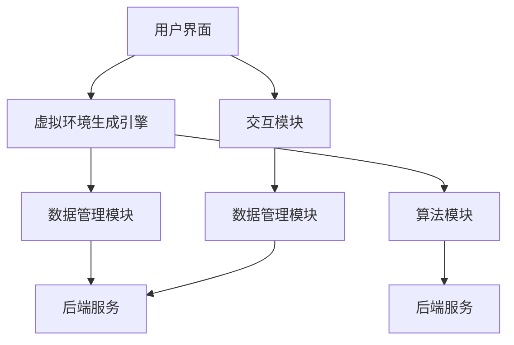
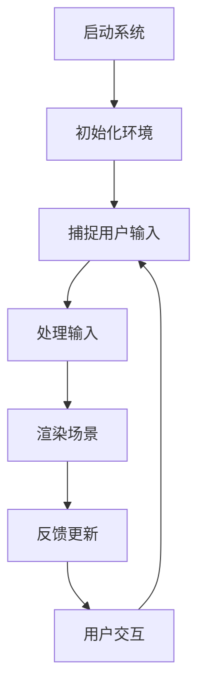
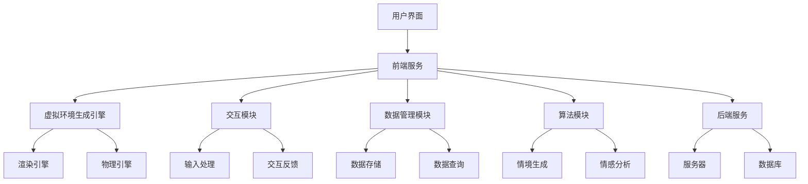
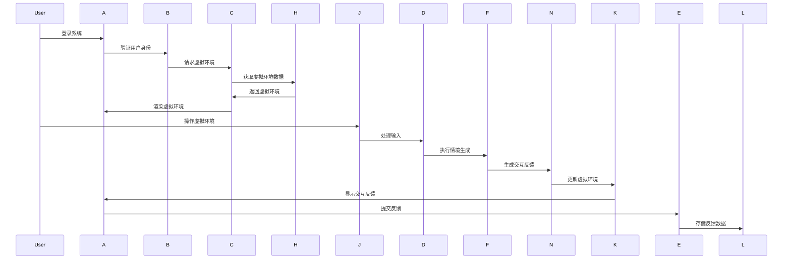

                 

### 背景介绍

飞行恐惧症（Aerophobia）是一种常见的焦虑障碍，患者对飞行产生极端的恐惧，从而严重影响他们的日常生活和旅行计划。据统计，约有6%-8%的全球人口患有飞行恐惧症，这一比例甚至可能更高。飞行恐惧症的定义主要指对飞行过程中可能发生的各种情况（如飞行失事、恐怖袭击等）的过度担忧，导致患者在登机、飞行或飞行后出现焦虑、恐慌等症状。

飞行恐惧症的症状主要包括以下几点：
1. **心理症状**：患者可能表现为紧张、焦虑、恐慌等情绪，有时甚至出现心悸、出汗、呼吸急促等症状。
2. **生理症状**：患者可能在飞行前或飞行中经历头痛、恶心、胃痛、腹泻等不适症状。
3. **行为症状**：为了避免飞行，患者可能会选择其他交通方式，甚至放弃重要的商务或家庭活动。

飞行恐惧症的影响非常深远，不仅影响患者的个人生活，还可能影响他们的职业发展和社会关系。有些严重的飞行恐惧症患者甚至无法乘坐飞机出行，从而限制了他们的生活范围和机会。这种心理障碍不仅给患者带来极大的心理压力，还可能导致他们在面对飞行时的逃避行为，进一步加剧焦虑和恐惧。

尽管传统的治疗方法（如药物治疗、心理咨询等）在一定程度上可以帮助患者缓解症状，但这些方法的局限性也日益显现。药物治疗可能存在副作用，而心理咨询则需要较长的时间和专业的心理咨询师。因此，寻找更高效、副作用更小的治疗方法成为当务之急。

近年来，虚拟现实（VR）技术的迅猛发展为其在心理治疗领域的应用提供了新的可能性。虚拟现实技术通过创建一个模拟的虚拟环境，让患者在一个安全、受控的环境中面对并克服他们的恐惧。相比传统治疗方法，虚拟现实治疗具有以下几个显著优势：

1. **安全性和可控性**：虚拟现实环境可以人为设定，患者可以根据自己的承受能力逐步增加恐惧情境的强度，从而减少因现实中的不可控因素带来的额外压力。
2. **低成本和高效性**：虚拟现实治疗设备相对传统治疗设施成本较低，且可以在家中进行，节省了时间和交通成本。
3. **个性化**：虚拟现实治疗可以根据患者的具体需求和症状进行定制，提供个性化的治疗方案。

综上所述，飞行恐惧症作为一种常见的心理障碍，其影响深远且传统治疗方法存在局限性。因此，探索新的治疗手段，如虚拟现实技术，具有重要的现实意义和广阔的应用前景。

### 虚拟现实技术简介

虚拟现实（Virtual Reality，VR）技术是一种通过计算机生成的模拟环境，用户通过特定的设备（如头戴式显示器、数据手套等）与该环境进行交互，从而获得一种身临其境的体验。VR技术的基本概念可以追溯到20世纪60年代，最早的VR设备包括头盔显示器和跟踪设备，这些设备旨在为用户提供沉浸式的视觉体验。随着时间的推移，VR技术不断发展，逐渐融入了计算机图形学、人机交互和传感器技术等多个领域，形成了今天我们所熟知的复杂系统。

#### 虚拟现实技术的发展历程

1. **早期探索**：20世纪60年代，VR技术的概念首次被提出，并开始应用于军事和科学领域。最早的VR设备如达摩克利斯头盔（The 达摩克利斯头盔）和视觉增强系统，旨在提供一种沉浸式的体验。
   
2. **计算机图形学的发展**：随着计算机图形学技术的进步，VR设备逐渐变得更加实用和普及。20世纪80年代，VR技术开始被广泛应用于娱乐和工业设计领域，虚拟现实实验室和虚拟现实训练系统相继问世。

3. **传感器技术的进步**：传感器技术的发展使得VR设备的精度和交互性得到了显著提升。20世纪90年代，眼动追踪、语音识别和手势识别等技术逐渐被整合到VR系统中，进一步增强了用户的沉浸感和交互体验。

4. **现代VR技术的兴起**：进入21世纪，随着高性能计算和互联网技术的发展，VR技术迎来了新的发展高峰。现代VR设备如Oculus Rift、HTC Vive和PlayStation VR等，为用户提供了前所未有的沉浸体验。此外，移动VR设备的兴起，如Google Cardboard和Samsung Gear VR，使得VR技术更加普及和便捷。

#### 虚拟现实技术的核心组成部分

1. **显示系统**：显示系统是VR技术的核心组成部分，主要包括头戴式显示器（HMD）和投影设备。HMD通过两个小屏幕或单个大屏幕将虚拟环境显示在用户的视野中，实现立体视觉效果。高质量的显示系统可以提供更高的分辨率和帧率，从而提升用户的沉浸感。

2. **交互设备**：交互设备是用户与虚拟环境进行交互的重要工具，主要包括手柄、数据手套和触觉反馈设备等。这些设备可以捕捉用户的动作和手势，将交互信号反馈给虚拟环境，从而实现自然的人机交互。

3. **传感器和跟踪系统**：传感器和跟踪系统用于检测用户的动作和位置，确保虚拟环境中的物体能够实时地响应用户的动作。常见的传感器包括摄像头、激光扫描仪和惯性测量单元（IMU）等。这些传感器可以提供高精度的定位和跟踪数据，从而确保虚拟环境与现实世界的同步。

4. **计算和渲染系统**：计算和渲染系统是VR技术的“心脏”，负责生成和渲染虚拟环境中的图像。高性能的计算设备和大型的渲染引擎（如Unity和Unreal Engine）可以生成高质量的3D图形，为用户提供逼真的虚拟体验。

5. **音频系统**：音频系统是增强用户沉浸感的重要手段，通过头戴式耳机或空间音频技术，为用户提供环绕声效果。高质量的音频系统可以营造更加真实的听觉环境，进一步提升用户的沉浸体验。

#### 虚拟现实技术在治疗领域的应用前景

虚拟现实技术由于其独特的技术特点和优势，在心理治疗领域展现出巨大的应用潜力。以下是一些主要的应用方向：

1. **心理治疗**：虚拟现实技术可以模拟各种心理治疗的场景，如恐惧治疗、创伤后应激障碍（PTSD）治疗、焦虑治疗等。通过在虚拟环境中逐步暴露患者于恐惧情境，帮助他们逐步克服恐惧和焦虑。

2. **疼痛管理**：虚拟现实技术可以作为一种分散注意力的工具，用于疼痛管理。患者在虚拟环境中进行互动或完成任务，从而减轻因疼痛引起的焦虑和不适。

3. **认知康复**：对于患有认知障碍的患者，虚拟现实技术可以提供一种互动性和趣味性的康复训练。通过虚拟环境中的任务和游戏，帮助患者恢复或提高认知功能。

4. **心理评估**：虚拟现实技术可以用于心理评估，通过模拟不同情境和任务，评估患者的心理状态和行为反应。这有助于医生更准确地诊断和治疗心理障碍。

总之，虚拟现实技术在治疗领域具有广泛的应用前景。随着技术的不断进步和普及，我们可以期待其在医疗健康领域发挥越来越重要的作用。通过本文接下来的内容，我们将进一步探讨虚拟现实技术如何在治疗飞行恐惧症中发挥作用。

### 虚拟现实在治疗领域的应用

虚拟现实（VR）技术作为一种前沿的疗法，在心理治疗、医疗康复等多个领域展现出了显著的应用价值。本文将重点讨论虚拟现实技术在治疗飞行恐惧症中的具体应用，分析其原理和治疗效果。

#### 虚拟现实技术在心理治疗中的应用

虚拟现实技术在心理治疗中的应用已经取得了显著的成果，尤其在与恐惧症相关的治疗中表现突出。通过在虚拟环境中模拟患者恐惧的情境，患者可以在安全、受控的环境下逐步克服恐惧。以下是一些主要的应用案例：

1. **恐惧症治疗**：虚拟现实技术被广泛应用于治疗各种恐惧症，如高处恐惧症、蜘蛛恐惧症和飞行恐惧症。通过逐步暴露患者于恐惧情境，并给予心理支持和干预，患者能够逐渐降低恐惧反应，提升应对恐惧的能力。

2. **焦虑症治疗**：焦虑症是一种常见的心理障碍，虚拟现实技术可以模拟各种引发焦虑的情境，如拥挤的广场、繁忙的街道等，帮助患者逐步适应和减轻焦虑。

3. **创伤后应激障碍（PTSD）治疗**：虚拟现实技术可以用于创伤后应激障碍的治疗，通过模拟创伤情境，帮助患者重现创伤经历，并在心理治疗师的支持下，逐步处理和缓解创伤反应。

#### 虚拟现实技术在医疗康复中的应用

虚拟现实技术不仅在心理治疗中表现出色，在医疗康复领域也具有广泛的应用。通过提供互动性和趣味性的康复训练，虚拟现实技术可以显著提升患者的康复效果。

1. **物理康复**：虚拟现实技术可以模拟各种物理训练场景，如跑步、游泳、攀岩等，帮助患者进行康复训练。这种互动性的训练方式能够激发患者的兴趣和积极性，提高康复效果。

2. **认知康复**：对于患有认知障碍的患者，虚拟现实技术提供了丰富多样的训练任务和游戏，通过互动和任务完成，帮助患者恢复或提高认知功能。

3. **疼痛管理**：虚拟现实技术可以作为一种分散注意力的工具，用于疼痛管理。患者在虚拟环境中进行互动或完成任务，从而减轻因疼痛引起的焦虑和不适。

#### 虚拟现实技术在治疗飞行恐惧症中的潜力

飞行恐惧症是一种常见的心理障碍，传统的治疗方法存在一定的局限性。虚拟现实技术的出现为治疗飞行恐惧症提供了新的可能性。以下是一些虚拟现实技术在治疗飞行恐惧症中的潜在应用：

1. **情境暴露疗法**：通过在虚拟环境中模拟飞行过程，包括起飞、飞行、降落等各个阶段，患者可以在安全、受控的环境下逐步暴露于飞行情境，从而减轻恐惧和焦虑。

2. **认知行为疗法**：虚拟现实技术可以与认知行为疗法相结合，通过虚拟环境中的任务和互动，帮助患者改变对飞行的负面认知和情绪，提升应对恐惧的能力。

3. **心理支持与干预**：在虚拟现实治疗过程中，心理治疗师可以通过实时监测患者的情绪和行为反应，提供个性化的心理支持和干预，帮助患者更好地克服恐惧。

#### 治疗效果分析

虚拟现实技术在治疗飞行恐惧症中已取得了一定的临床效果。多项研究表明，通过虚拟现实情境暴露疗法，患者的恐惧和焦虑水平显著降低，飞行前的焦虑症状也得到明显缓解。此外，虚拟现实治疗具有以下优势：

1. **安全性和可控性**：虚拟环境可以人为设定，患者可以根据自己的承受能力逐步增加恐惧情境的强度，从而减少因现实中的不可控因素带来的额外压力。

2. **低成本和高效性**：虚拟现实治疗设备相对传统治疗设施成本较低，且可以在家中进行，节省了时间和交通成本。

3. **个性化**：虚拟现实治疗可以根据患者的具体需求和症状进行定制，提供个性化的治疗方案。

综上所述，虚拟现实技术在治疗飞行恐惧症中具有广阔的应用前景和显著的治疗效果。随着技术的不断发展和普及，虚拟现实技术有望成为治疗飞行恐惧症的重要手段，为患者提供更加安全、有效、便捷的治疗选择。

### 虚拟现实技术原理

虚拟现实技术之所以能够提供如此沉浸式的体验，其背后的原理离不开多种技术的综合运用。以下将详细解释虚拟现实技术的工作原理、核心技术及其在不同类型应用中的具体作用。

#### 工作原理

虚拟现实技术通过以下几种关键原理实现其独特的沉浸体验：

1. **三维模拟**：虚拟现实技术利用计算机图形学技术创建一个三维的虚拟环境。通过三维建模和渲染技术，虚拟环境中的物体、场景和角色都能呈现出高度逼真的视觉效果。

2. **实时交互**：用户通过特定的交互设备（如头戴式显示器、手柄、数据手套等）与虚拟环境进行实时交互。这些设备捕捉用户的动作和手势，并将这些信号传递给计算机系统，从而实现对虚拟环境的实时响应。

3. **多感官刺激**：虚拟现实技术不仅提供视觉上的沉浸体验，还通过音频、触觉和嗅觉等多感官刺激增强用户的整体感受。例如，通过空间音频技术，用户可以感受到虚拟环境中的声音从不同方向传来；通过触觉反馈设备，用户甚至能够感受到虚拟物体的质地和重量。

4. **动态反馈**：虚拟现实技术通过实时计算和渲染，为用户提供动态反馈。用户的每一个动作都会实时更新虚拟环境中的场景和物体，确保用户感受到的环境始终是连贯和真实的。

#### 核心技术

虚拟现实技术的实现依赖于多种核心技术的支持，主要包括显示技术、交互技术、传感器技术和计算技术。

1. **显示技术**：显示技术是虚拟现实技术的核心组成部分，主要包括头戴式显示器（HMD）和投影设备。高质量的显示技术能够提供高分辨率、低延迟的图像，从而提升用户的沉浸感。例如，Oculus Rift和HTC Vive等现代VR设备采用高分辨率显示屏，并通过快速刷新率（大于90Hz）减少视觉滞后感。

2. **交互技术**：交互技术是用户与虚拟环境进行交互的桥梁。手柄、数据手套、眼动追踪设备等交互设备被广泛应用于虚拟现实系统中。这些设备通过捕捉用户的动作和手势，将交互信号反馈给虚拟环境，实现自然的人机交互。例如，数据手套可以捕捉手部的细微动作，从而在虚拟环境中实现更加精细的操控。

3. **传感器技术**：传感器技术用于检测用户的动作和位置，确保虚拟环境中的物体能够实时地响应用户的动作。常见的传感器包括摄像头、激光扫描仪和惯性测量单元（IMU）等。这些传感器可以提供高精度的定位和跟踪数据，从而确保虚拟环境与现实世界的同步。例如，IMU传感器可以实时测量用户的姿态和运动，帮助虚拟环境中的角色实现平滑的运动轨迹。

4. **计算技术**：计算技术是虚拟现实技术的“心脏”，负责生成和渲染虚拟环境中的图像。高性能的计算设备和高效的渲染引擎（如Unity和Unreal Engine）可以生成高质量的3D图形，为用户提供逼真的虚拟体验。此外，计算技术还包括实时物理模拟和图形渲染算法，这些算法确保虚拟环境中的物体和行为符合现实世界的物理规律。

#### 不同类型应用中的具体作用

虚拟现实技术在不同的应用领域发挥了各自独特的作用：

1. **娱乐**：在娱乐领域，虚拟现实技术为用户提供了全新的沉浸式体验。通过虚拟现实游戏和体验，用户可以进入一个完全不同的虚拟世界，享受与真实世界不同的乐趣。虚拟现实技术通过高分辨率的显示、实时交互和动态反馈，为用户带来逼真的游戏体验。

2. **教育和培训**：虚拟现实技术在教育和培训领域具有广泛的应用。通过虚拟现实技术，学生和培训者可以进入一个虚拟的课堂或工作环境，进行互动和学习。虚拟现实技术可以提供高度逼真的模拟环境，帮助用户更好地理解复杂的概念和技能。

3. **医疗和心理治疗**：虚拟现实技术在医疗和心理治疗领域表现出色。通过在虚拟环境中模拟患者的恐惧情境，心理治疗师可以帮助患者逐步克服恐惧和焦虑。虚拟现实技术还可以用于疼痛管理、认知康复和物理康复等治疗过程中，为患者提供个性化、互动性的治疗体验。

4. **设计和制造**：虚拟现实技术在设计和制造领域被广泛应用于产品设计和工程仿真。通过虚拟现实技术，设计师和工程师可以在虚拟环境中进行三维建模和仿真，提前预览和测试产品的设计效果和性能。

综上所述，虚拟现实技术通过其独特的工作原理和核心技术，在不同类型的应用中发挥了重要作用。随着技术的不断进步和普及，虚拟现实技术将在更多领域展现其强大的潜力和应用价值。

### 飞行恐惧症的理论与模型

飞行恐惧症（Aerophobia）是一种由对飞行过程中可能出现的不安全情况的过度担忧引发的焦虑障碍。要深入理解飞行恐惧症，我们需要从心理模型、理论基础和生理反应三个方面进行探讨。

#### 心理模型

飞行恐惧症的心理模型通常基于认知行为理论（Cognitive Behavioral Theory, CBT）。认知行为理论认为，恐惧和焦虑情绪是由个体的认知偏差（如过度概括、灾难化思维等）和应对机制（如逃避行为）共同作用的结果。

1. **认知偏差**：飞行恐惧症患者常常持有一些不合理的信念，如认为飞机事故随时可能发生，一旦发生将带来灾难性后果。这些认知偏差会导致患者对飞行产生过度的担忧和恐惧。

2. **应对机制**：为了应对飞行恐惧，患者可能会采取各种逃避行为，如选择其他交通方式、避免与飞行相关的活动等。这种逃避行为虽然在短期内缓解了恐惧，但长期来看会加剧焦虑和恐惧症状。

#### 心理理论基础

飞行恐惧症的心理理论基础还包括以下几种重要理论：

1. **条件反射理论**：根据条件反射理论，飞行恐惧可能起源于一些特定的经历或事件，如儿童时期的负面飞行体验或媒体报道的飞行事故。这些经历或事件会在大脑中形成条件反射，使个体对飞行产生恐惧。

2. **情绪调控理论**：情绪调控理论强调个体的情绪反应与其对情境的评价有关。飞行恐惧症患者往往对飞行情境进行负面评价，认为飞行充满了危险和不安全因素，从而引发强烈的恐惧和焦虑情绪。

3. **认知评估理论**：认知评估理论认为，个体的情绪反应是由其对情境的认知评估（如威胁性和控制性）决定的。飞行恐惧症患者通常认为飞行情境具有高威胁性和低控制性，从而导致强烈的恐惧和焦虑。

#### 生理反应

飞行恐惧症不仅表现在心理层面，还会引发一系列生理反应。这些生理反应是身体对焦虑和恐惧情绪的生理性反应，通常包括以下几个方面：

1. **心悸和呼吸急促**：焦虑和恐惧情绪会激活交感神经系统，导致心率和呼吸加快。患者可能会感到心脏剧烈跳动，呼吸变得急促。

2. **出汗和颤抖**：身体为了应对紧张情绪，会分泌汗液，导致患者出汗和颤抖。这种生理反应是身体试图通过增加散热来缓解紧张情绪的表现。

3. **胃部不适**：焦虑和恐惧情绪会影响消化系统，导致胃部不适，如胃痛、恶心和腹泻等。这些症状在飞行恐惧症患者中尤为常见。

4. **头痛和视觉模糊**：强烈的焦虑情绪还可能导致头痛和视觉模糊。这些生理反应是由于紧张情绪引起的血管收缩和神经紧张所致。

#### 心理模型与生理反应的关系

心理模型与生理反应之间存在密切的联系。根据心理生理学理论，心理因素可以直接影响生理反应。当飞行恐惧症患者面对飞行情境时，其认知评估和情绪反应会激活交感神经系统，导致一系列生理反应。这些生理反应反过来又会强化患者的恐惧和焦虑情绪，形成一种恶性循环。

例如，患者可能会认为自己的心悸和呼吸急促是飞行事故即将发生的信号，从而加剧恐惧情绪。这种恐惧情绪又会进一步激活交感神经系统，导致更加剧烈的生理反应，如出汗和颤抖。这种生理反应进一步强化了患者的恐惧情绪，使其更加害怕飞行。

综上所述，飞行恐惧症的心理模型和生理反应共同构成了患者恐惧和焦虑的复杂机制。理解这些机制有助于开发更有效的治疗方法，帮助患者克服飞行恐惧症，重拾正常生活。

### 虚拟现实在治疗飞行恐惧症中的应用

虚拟现实（VR）技术在治疗飞行恐惧症方面展现出了巨大的潜力。通过模拟飞行过程中的各种情境，VR技术帮助患者在安全、受控的环境中逐步克服恐惧。以下将从虚拟现实干预策略、优势以及面临的挑战和未来方向进行详细探讨。

#### 虚拟现实干预策略

虚拟现实干预策略的核心是通过逐步暴露患者于飞行情境，帮助他们减少恐惧和焦虑。以下是一些常见的虚拟现实干预策略：

1. **情境暴露疗法**：情境暴露疗法是治疗恐惧症的经典方法，而虚拟现实则为这一疗法提供了新的可能。通过在虚拟环境中模拟飞行过程中的各个阶段（如登机、起飞、飞行、降落等），患者可以在一个安全、受控的环境下逐步面对并克服恐惧。这种方法的主要目的是通过重复暴露于恐惧情境，帮助患者减少对飞行的过度担忧和焦虑。

2. **认知行为疗法**：虚拟现实技术可以与认知行为疗法（CBT）相结合，帮助患者识别和改变对飞行的负面认知。通过在虚拟环境中完成特定的任务和互动，患者可以在心理治疗师的支持下，逐步纠正对飞行的不合理信念和认知偏差，提升应对恐惧的能力。

3. **虚拟现实支持的心理咨询**：虚拟现实技术可以作为一种辅助工具，用于心理治疗师与患者之间的远程互动。通过虚拟现实平台，治疗师可以实时监测患者的情绪和行为反应，提供个性化的心理支持和干预，从而提高治疗效果。

4. **虚拟现实结合的疼痛管理**：对于飞行恐惧症患者，疼痛和不适往往是导致恐惧的重要原因。虚拟现实技术可以通过提供分散注意力的任务和游戏，帮助患者减轻因疼痛引起的焦虑和不适，从而缓解恐惧症状。

#### 虚拟现实治疗飞行恐惧症的优势

虚拟现实技术相较于传统治疗方法，在治疗飞行恐惧症方面具有以下显著优势：

1. **安全性和可控性**：虚拟现实环境可以人为设定，患者可以根据自己的承受能力逐步增加恐惧情境的强度。这种安全、可控的环境减少了因现实中的不可控因素带来的额外压力，有助于患者更好地面对恐惧。

2. **低成本和高效率**：虚拟现实治疗设备相对传统治疗设施成本较低，且可以在家中进行，节省了时间和交通成本。此外，虚拟现实技术可以快速构建和调整治疗场景，提高治疗的效率。

3. **个性化**：虚拟现实治疗可以根据患者的具体需求和症状进行定制，提供个性化的治疗方案。这种个性化治疗方式有助于提高患者的参与度和治疗效果。

4. **增强的互动性和参与感**：虚拟现实技术通过提供高度逼真的虚拟环境，增强了患者的互动性和参与感。患者在虚拟环境中可以自由地探索和互动，从而更好地理解和处理自己的恐惧情绪。

#### 面临的挑战

尽管虚拟现实技术在治疗飞行恐惧症中表现出色，但其在实际应用中仍面临一些挑战：

1. **技术实现的难度**：虚拟现实技术需要高性能的计算设备和精确的传感器支持，这对治疗设备的成本和操作要求较高。此外，虚拟现实系统的开发和调试也需要大量的专业知识和资源。

2. **患者的接受度**：虚拟现实治疗需要患者的积极参与和配合。部分患者可能对新技术持怀疑态度，不愿意接受虚拟现实治疗，从而影响治疗效果。

3. **伦理和隐私问题**：虚拟现实治疗涉及患者的个人信息和隐私，如何确保患者数据的安全和隐私成为重要议题。在设计和实施虚拟现实治疗时，必须严格遵守相关的伦理规范和隐私保护政策。

#### 未来方向

未来，虚拟现实技术在治疗飞行恐惧症方面有望进一步发展和完善：

1. **技术进步**：随着计算机技术和传感器技术的不断进步，虚拟现实设备将变得更加便携和易用，提高患者的接受度和使用体验。

2. **跨学科研究**：虚拟现实技术在治疗飞行恐惧症中的应用需要心理、医学、计算机科学等学科的跨学科研究。通过多学科合作，可以开发出更加科学、有效的虚拟现实治疗方法和策略。

3. **个性化治疗**：通过大数据和人工智能技术，虚拟现实治疗可以更加精准地了解患者的需求和症状，提供个性化的治疗方案，从而提高治疗效果。

4. **伦理和法规完善**：随着虚拟现实技术在治疗领域的广泛应用，相关伦理和法规体系也需要进一步完善。这包括患者隐私保护、数据安全、治疗质量监管等方面。

总之，虚拟现实技术在治疗飞行恐惧症中具有广阔的应用前景。通过不断探索和实践，虚拟现实技术有望成为治疗飞行恐惧症的重要手段，为患者提供更加安全、有效和便捷的治疗选择。

### 虚拟现实治疗飞行恐惧症的项目设计

为了有效利用虚拟现实（VR）技术治疗飞行恐惧症，一个详细、科学的项目设计至关重要。以下是项目设计的详细步骤，包括治疗目标的确定、干预方案的设计以及虚拟现实环境的搭建。

#### 治疗目标的确定

在项目设计初期，明确治疗目标是至关重要的。治疗目标应包括以下几个方面：

1. **减少飞行恐惧症状**：通过逐步暴露患者于飞行情境，减少患者对飞行的恐惧和焦虑情绪。

2. **提升心理适应能力**：帮助患者提升在面对飞行情境时的心理适应能力，降低对潜在危险的过度担忧。

3. **增强应对策略**：教授患者一些有效的应对策略，如深呼吸、正念冥想等，以减轻焦虑和紧张情绪。

4. **提高生活质量**：通过治疗，帮助患者恢复正常的生活和旅行计划，提升生活质量。

#### 干预方案的设计

一个有效的干预方案应包括以下步骤：

1. **初步评估**：在项目开始前，对患者进行详细的初步评估，了解患者的飞行恐惧症状、心理状态和过往的治疗经历。这一评估有助于制定个性化的治疗方案。

2. **制定治疗计划**：根据初步评估的结果，制定个性化的治疗计划。治疗计划应包括以下内容：
   - **阶段划分**：将治疗过程分为多个阶段，每个阶段设定具体的目标和干预措施。
   - **情境暴露**：逐步增加飞行情境的难度和强度，从简单的登机和准备阶段开始，逐渐过渡到起飞、飞行和降落等复杂情境。
   - **心理支持**：在暴露过程中，心理治疗师应提供实时支持，帮助患者应对出现的负面情绪和生理反应。

3. **干预措施的调整**：在治疗过程中，根据患者的反馈和进展，及时调整干预措施。例如，如果患者对某一情境的反应特别强烈，可以适当降低情境的难度或增加放松技巧的训练。

#### 虚拟现实环境的搭建

虚拟现实环境的搭建是项目成功的关键。以下是搭建虚拟现实环境的具体步骤：

1. **硬件设备选择**：选择适合的虚拟现实设备，如头戴式显示器（HMD）、手柄、数据手套等。设备的性能和功能应满足治疗需求，同时考虑到患者的舒适度和易用性。

2. **软件开发**：开发用于治疗的虚拟现实软件，软件应具备以下功能：
   - **场景模拟**：创建逼真的飞行场景，包括登机大厅、机舱内部、起飞、飞行和降落等各个阶段。
   - **互动设计**：设计交互式任务和游戏，帮助患者更好地参与治疗过程，提高治疗效果。
   - **数据记录**：记录患者的情绪、行为和生理反应数据，以便治疗师进行分析和调整干预措施。

3. **环境调试**：在虚拟现实环境中进行调试，确保场景的逼真度和互动性的流畅性。同时，对设备进行校准，确保传感器能够准确捕捉患者的动作和位置。

4. **用户培训**：对参与治疗的患者进行虚拟现实设备的操作培训，确保他们能够熟练使用设备，并在治疗过程中获得最佳的体验。

通过上述步骤，我们可以搭建一个功能齐全、效果显著的虚拟现实治疗系统，为飞行恐惧症患者提供科学、有效的治疗手段。

### 虚拟现实治疗飞行恐惧症的流程与步骤

在虚拟现实（VR）治疗飞行恐惧症的过程中，一个系统化、步骤明确的流程是确保治疗有效性的关键。以下是虚拟现实治疗飞行恐惧症的具体流程和步骤，包括治疗前的评估、治疗过程中的干预以及治疗后的跟踪与评估。

#### 治疗前的评估

1. **初步评估**：治疗开始前，对患者的飞行恐惧症状进行初步评估。评估内容包括：
   - **症状评估**：了解患者的恐惧程度、主要症状以及症状的出现频率和持续时间。
   - **心理状态评估**：评估患者的情绪状态、应对机制以及对治疗的期望。
   - **生理反应评估**：观察患者的生理反应，如心悸、呼吸急促、出汗等。

2. **历史信息收集**：收集患者的个人历史信息，包括过往的飞行经历、其他治疗尝试以及相关的心理和生理状况。

3. **确定治疗目标**：根据初步评估的结果，与患者共同确定治疗目标。这些目标应具体、可测量，如减少飞行前焦虑的次数、提高飞行时的舒适度等。

#### 治疗过程中的干预

1. **阶段划分**：将治疗过程分为多个阶段，每个阶段设定具体的目标和干预措施。常见的阶段划分包括：
   - **准备阶段**：帮助患者熟悉虚拟现实环境和设备，进行基本操作培训。
   - **初步暴露阶段**：模拟简单的飞行情境，如登机和准备，帮助患者逐步适应。
   - **逐步暴露阶段**：逐步增加飞行情境的难度，如起飞、飞行和降落，通过重复暴露减少患者的恐惧和焦虑。
   - **复杂情境阶段**：引入更复杂的飞行情境，如飞行中的意外情况，帮助患者提升应对能力。

2. **心理支持与干预**：在暴露过程中，心理治疗师应提供实时支持，帮助患者应对负面情绪和生理反应。具体干预措施包括：
   - **放松训练**：教授患者深呼吸、渐进性肌肉放松等放松技巧，以减轻焦虑和紧张。
   - **认知重构**：引导患者识别和改变对飞行的负面认知，如过度概括和灾难化思维。
   - **行为策略**：鼓励患者使用积极的行为策略，如分散注意力、正念冥想等，以缓解恐惧情绪。

3. **数据记录与反馈**：在治疗过程中，实时记录患者的情绪、行为和生理反应数据。治疗师应定期与患者进行反馈，分析治疗进展，调整干预措施。

#### 治疗后的跟踪与评估

1. **短期跟踪评估**：在治疗结束后的一段时间内，对患者进行短期跟踪评估，了解治疗的效果和患者的恢复情况。评估内容包括：
   - **症状改善情况**：评估患者的飞行恐惧症状是否减轻，如飞行前焦虑的频率和强度。
   - **心理状态变化**：观察患者的情绪状态和心理适应能力的提升。
   - **生理反应变化**：监测患者的生理反应，如心悸、呼吸急促等。

2. **长期跟踪评估**：在治疗结束后的一段时间后，进行长期跟踪评估，了解治疗的持久效果。长期评估有助于确定虚拟现实治疗在长期内的效果和安全性。

3. **患者反馈与满意度调查**：通过患者反馈和满意度调查，收集患者对治疗过程和结果的反馈，为后续的治疗改进提供参考。

4. **治疗总结与报告**：根据治疗过程中的数据和患者反馈，撰写治疗总结报告，为患者的后续治疗和健康管理提供指导。

通过上述详细的流程和步骤，虚拟现实治疗飞行恐惧症可以更加科学、系统地实施，确保治疗的有效性和患者的满意度。

### 虚拟现实治疗飞行恐惧症的实际案例

为了更好地展示虚拟现实（VR）技术在治疗飞行恐惧症中的应用效果，我们选择了几例具有代表性的实际案例，详细介绍其设计思路、实施过程和治疗效果。

#### 案例一：飞行模拟训练

**设计思路**：该案例旨在通过逐步暴露患者于飞行情境，帮助其克服飞行恐惧。设计思路包括以下几个步骤：
1. **初步模拟**：患者首先体验简单的飞行模拟，如登机和准备阶段，熟悉虚拟飞行环境。
2. **逐步增加难度**：在患者适应初步模拟后，逐步引入起飞、飞行和降落等更复杂的飞行情境。
3. **紧急情况模拟**：在患者能够较好地应对常规飞行情境后，引入飞行中的紧急情况模拟，如机械故障或气流颠簸，进一步提升患者的应对能力。

**实施过程**：
1. **初步评估**：对患者进行初步评估，了解其飞行恐惧症状和程度。
2. **环境搭建**：使用高精度的VR设备和软件，搭建逼真的飞行模拟环境。
3. **训练实施**：患者首先在治疗师的指导下体验初步模拟，治疗师实时观察患者的情绪和行为反应。
4. **逐步提升**：根据患者的反馈和适应情况，逐步增加飞行情境的难度和复杂性。

**治疗效果**：经过数周的飞行模拟训练，患者对飞行的恐惧和焦虑显著减轻，飞行前的紧张情绪也得到缓解。大部分患者表示，虚拟飞行模拟使他们对实际飞行有更深刻的理解和准备，从而减少了恐惧感。

#### 案例二：情境暴露疗法

**设计思路**：该案例采用情境暴露疗法，通过在虚拟环境中逐步暴露患者于飞行情境，帮助其面对并克服恐惧。设计思路包括以下几个步骤：
1. **心理支持**：在治疗前，心理治疗师与患者进行深入的沟通，了解患者的恐惧根源和需求。
2. **逐步暴露**：从简单的登机情境开始，逐步增加暴露强度，如起飞、飞行和降落。
3. **认知重构**：在暴露过程中，治疗师引导患者识别和改变对飞行的负面认知，如飞机失事的可能性。

**实施过程**：
1. **评估与计划**：对患者进行详细的评估，制定个性化的治疗方案。
2. **环境搭建**：使用VR设备和软件，创建逼真的飞行情境。
3. **干预实施**：患者逐步在虚拟环境中面对飞行情境，治疗师实时提供心理支持。
4. **反馈调整**：根据患者的反馈，调整暴露强度和干预措施。

**治疗效果**：经过一系列情境暴露疗法，患者的飞行恐惧症状显著改善，大部分患者能够在没有明显焦虑的情况下完成飞行任务。治疗师观察到，患者的认知重构和心理适应能力得到了显著提升。

#### 案例三：虚拟现实与认知行为疗法的结合

**设计思路**：该案例将虚拟现实技术与认知行为疗法（CBT）相结合，通过虚拟环境中的任务和互动，帮助患者改变对飞行的负面认知和情绪。设计思路包括以下几个步骤：
1. **认知重构**：在虚拟环境中，治疗师引导患者识别和改变对飞行的负面认知。
2. **情境暴露**：通过逐步暴露于飞行情境，帮助患者减少恐惧和焦虑。
3. **行为策略**：教授患者一些应对策略，如深呼吸、正念冥想等，以缓解飞行时的紧张情绪。

**实施过程**：
1. **初步评估**：对患者进行初步评估，确定其认知和行为问题。
2. **环境搭建**：创建包含多种飞行情境的虚拟环境，并设计互动任务。
3. **干预实施**：患者和治疗师共同完成认知重构和行为策略训练。
4. **反馈与调整**：定期进行反馈，调整干预措施，确保治疗效果。

**治疗效果**：经过虚拟现实与认知行为疗法的结合，患者的飞行恐惧症状得到显著缓解。患者的认知重构效果明显，对飞行的负面情绪减少，同时，通过行为策略的训练，患者能够更好地应对飞行时的紧张情绪。

这些实际案例充分展示了虚拟现实技术在治疗飞行恐惧症中的有效性和广泛适用性。通过科学的设计和实施，虚拟现实技术为患者提供了安全、可控且个性化的治疗选择，显著改善了患者的飞行恐惧症状。

### 虚拟现实治疗系统的架构设计

在设计和实现虚拟现实治疗系统时，系统架构的设计至关重要。一个良好的架构设计不仅能够提高系统的可扩展性和稳定性，还能确保用户体验的流畅和高效。以下将详细描述虚拟现实治疗系统的架构设计，包括设计原则、组成部分及其关系，并通过mermaid流程图和Python源代码实现进行解释。

#### 设计原则

1. **模块化**：将系统功能划分为多个模块，每个模块具有独立的功能和接口。这种模块化设计不仅提高了代码的可维护性，还便于系统的扩展和功能更新。

2. **高内聚、低耦合**：每个模块内部具有高内聚性，确保模块功能集中；同时模块间具有低耦合性，减少模块间的依赖关系，提高系统的灵活性和可替换性。

3. **可扩展性**：设计时考虑未来的扩展需求，确保系统能够轻松集成新的功能模块或技术组件。

4. **用户体验优先**：在设计过程中，始终将用户体验放在首位，确保系统界面简洁易用，交互流畅自然。

5. **安全性和隐私保护**：严格遵循隐私保护政策和数据安全规范，确保患者数据的安全和隐私。

#### 系统组成部分

虚拟现实治疗系统主要由以下几个部分组成：

1. **用户界面（UI）**：负责展示虚拟环境和交互界面，为用户提供直观的操作体验。
2. **虚拟环境生成引擎**：负责生成和渲染虚拟环境，包括场景、物体和角色等。
3. **交互模块**：负责处理用户的输入和反馈，实现用户与虚拟环境的交互。
4. **数据管理模块**：负责存储和处理患者数据，包括症状评估、治疗记录和反馈数据等。
5. **算法模块**：负责实现虚拟现实中的各种算法，如情境生成、情感分析等。
6. **后端服务**：提供系统的后端支持，包括服务器、数据库和API等。

#### 组成部分关系

各组成部分通过以下方式相互关联：

1. **用户界面（UI）** 通过图形用户界面（GUI）与用户交互，收集用户输入和操作指令。
2. **虚拟环境生成引擎** 根据用户界面（UI）的指令，生成和渲染虚拟环境，提供视觉和听觉反馈。
3. **交互模块** 负责处理用户输入，如手柄操作、手势识别等，并将其转换为虚拟环境中的动作。
4. **数据管理模块** 负责收集、存储和处理用户数据，包括症状评估、治疗记录和反馈数据等。
5. **算法模块** 利用后端服务提供的算法库，实现情境生成、情感分析等功能，为交互模块提供支持。
6. **后端服务** 通过API与各个模块进行数据交互，确保系统整体协调运作。

#### mermaid流程图

以下是虚拟现实治疗系统的mermaid流程图，展示了各个组成部分之间的数据流和交互关系：



#### Python源代码实现

以下是一个简单的Python源代码示例，展示了如何实现虚拟环境生成引擎的基本功能。该代码将创建一个简单的3D场景，并渲染一个立方体：

```python
import pygame
from pygame.locals import *
from OpenGL.GL import *
from OpenGL.GLU import *

# 初始化OpenGL环境
def init_gl(width, height):
    pygame.init()
    display = (width, height, 32)
    pygame.display.set_mode(display, DOUBLEBUF | OPENGL)
    gluPerspective(45, width / height, 0.1, 100.0)
    glTranslatef(0.0, 0.0, -6)
    glScalef(0.4, 0.4, 0.4)

# 绘制立方体
def draw_cube():
    glBegin(GL_QUADS)
    glVertex3f(-1.0, -1.0,  1.0)
    glVertex3f( 1.0, -1.0,  1.0)
    glVertex3f( 1.0,  1.0,  1.0)
    glVertex3f(-1.0,  1.0,  1.0)
    glVertex3f(-1.0, -1.0, -1.0)
    glVertex3f( 1.0, -1.0, -1.0)
    glVertex3f( 1.0,  1.0, -1.0)
    glVertex3f(-1.0,  1.0, -1.0)
    glVertex3f(-1.0, -1.0, -1.0)
    glVertex3f(-1.0, -1.0,  1.0)
    glVertex3f(-1.0,  1.0,  1.0)
    glVertex3f(-1.0,  1.0, -1.0)
    glVertex3f(-1.0, -1.0, -1.0)
    glVertex3f( 1.0, -1.0, -1.0)
    glVertex3f( 1.0,  1.0, -1.0)
    glVertex3f( 1.0,  1.0,  1.0)
    glVertex3f( 1.0, -1.0,  1.0)
    glVertex3f( 1.0, -1.0, -1.0)
    glVertex3f(-1.0, -1.0, -1.0)
    glVertex3f(-1.0, -1.0,  1.0)
    glVertex3f( 1.0, -1.0,  1.0)
    glVertex3f( 1.0, -1.0, -1.0)
    glVertex3f(-1.0,  1.0, -1.0)
    glVertex3f(-1.0,  1.0,  1.0)
    glVertex3f( 1.0,  1.0,  1.0)
    glVertex3f( 1.0,  1.0, -1.0)
    glEnd()

# 主循环
def main_loop():
    width, height = 640, 480
    init_gl(width, height)
    
    while True:
        for event in pygame.event.get():
            if event.type == QUIT:
                pygame.quit()
                sys.exit()
        
        glClear(GL_COLOR_BUFFER_BIT | GL_DEPTH_BUFFER_BIT)
        draw_cube()
        pygame.display.flip()
        pygame.time.delay(10)

if __name__ == "__main__":
    main_loop()
```

该代码展示了如何使用OpenGL库创建一个简单的3D场景，并通过Pygame库实现窗口渲染和事件处理。虽然这只是一个非常基础的示例，但它为理解虚拟现实治疗系统中的3D渲染和用户交互提供了一个起点。

通过上述架构设计和Python源代码示例，我们可以构建一个功能完善的虚拟现实治疗系统，为患者提供高质量的治疗体验。随着技术的不断进步，未来的虚拟现实治疗系统将更加智能和个性化，为心理治疗领域带来更多创新和突破。

### 算法原理讲解

在虚拟现实治疗飞行恐惧症中，算法设计至关重要，它决定了系统的交互效果和沉浸感。以下将详细解释虚拟现实算法的基本原理，包括mermaid流程图、Python源代码实现、数学模型与公式，以及通俗易懂的举例说明。

#### 算法基本原理

虚拟现实算法的核心任务是在实时环境中生成和渲染虚拟场景，同时捕捉和处理用户的输入。为了实现这一目标，算法通常包括以下几个主要步骤：

1. **场景渲染**：基于三维模型和渲染技术，生成逼真的虚拟场景。
2. **用户输入处理**：捕捉用户的动作和手势，如头部运动、手势操作等。
3. **交互反馈**：根据用户输入实时更新虚拟环境，提供动态反馈。

#### mermaid流程图

以下是虚拟现实算法的mermaid流程图，展示了其基本工作流程：



#### Python源代码实现

以下是实现虚拟现实算法的简化Python代码示例，该示例通过Pygame和OpenGL库实现了一个基础的3D渲染和用户交互功能：

```python
import pygame
from pygame.locals import *
from OpenGL.GL import *
from OpenGL.GLU import *

# 初始化OpenGL环境
def init_gl(width, height):
    pygame.init()
    display = (width, height, 32)
    pygame.display.set_mode(display, DOUBLEBUF | OPENGL)
    gluPerspective(45, width / height, 0.1, 100.0)
    glTranslatef(0.0, 0.0, -6)
    glScalef(0.4, 0.4, 0.4)

# 绘制立方体
def draw_cube():
    glBegin(GL_QUADS)
    glVertex3f(-1.0, -1.0,  1.0)
    glVertex3f( 1.0, -1.0,  1.0)
    glVertex3f( 1.0,  1.0,  1.0)
    glVertex3f(-1.0,  1.0,  1.0)
    glVertex3f(-1.0, -1.0, -1.0)
    glVertex3f( 1.0, -1.0, -1.0)
    glVertex3f( 1.0,  1.0, -1.0)
    glVertex3f(-1.0,  1.0, -1.0)
    glVertex3f(-1.0, -1.0, -1.0)
    glVertex3f(-1.0, -1.0,  1.0)
    glVertex3f(-1.0,  1.0,  1.0)
    glVertex3f(-1.0,  1.0, -1.0)
    glVertex3f(-1.0, -1.0, -1.0)
    glVertex3f( 1.0, -1.0, -1.0)
    glVertex3f( 1.0,  1.0, -1.0)
    glVertex3f( 1.0,  1.0,  1.0)
    glVertex3f( 1.0, -1.0,  1.0)
    glVertex3f( 1.0, -1.0, -1.0)
    glVertex3f(-1.0, -1.0, -1.0)
    glVertex3f(-1.0, -1.0,  1.0)
    glVertex3f( 1.0, -1.0,  1.0)
    glVertex3f( 1.0, -1.0, -1.0)
    glVertex3f(-1.0,  1.0, -1.0)
    glVertex3f(-1.0,  1.0,  1.0)
    glVertex3f( 1.0,  1.0,  1.0)
    glVertex3f( 1.0,  1.0, -1.0)
    glVertex3f(-1.0,  1.0, -1.0)
    glEnd()

# 主循环
def main_loop():
    width, height = 640, 480
    init_gl(width, height)
    
    while True:
        for event in pygame.event.get():
            if event.type == QUIT:
                pygame.quit()
                sys.exit()
        
        glClear(GL_COLOR_BUFFER_BIT | GL_DEPTH_BUFFER_BIT)
        draw_cube()
        pygame.display.flip()
        pygame.time.delay(10)

if __name__ == "__main__":
    main_loop()
```

这段代码实现了基础的3D场景渲染和用户交互功能，展示了OpenGL和Pygame的基本用法。

#### 数学模型与公式

在虚拟现实算法中，一些关键的数学模型和公式用于实现场景渲染和用户输入处理。以下是几个常用的数学模型和公式：

1. **三维坐标变换**：
   - **旋转矩阵**：
     $$ R_x(\theta) = \begin{bmatrix}
     1 & 0 & 0 \\
     0 & \cos(\theta) & -\sin(\theta) \\
     0 & \sin(\theta) & \cos(\theta)
     \end{bmatrix} $$
   - **平移矩阵**：
     $$ T(t) = \begin{bmatrix}
     1 & 0 & 0 & t_x \\
     0 & 1 & 0 & t_y \\
     0 & 0 & 1 & t_z \\
     0 & 0 & 0 & 1
     \end{bmatrix} $$
   - **三维空间中点的变换**：
     $$ P' = R \cdot P + t $$
     其中，\(P'\)为变换后的点，\(P\)为原始点，\(R\)为旋转矩阵，\(t\)为平移向量。

2. **视线向量计算**：
   - **视线向量**：
     $$ V = P - C $$
     其中，\(V\)为视线向量，\(P\)为眼睛位置，\(C\)为场景中心。

3. **透视投影**：
   - **透视矩阵**：
     $$ P_p = \frac{1}{\frac{1}{z} - \frac{1}{n}} \begin{bmatrix}
     2 \frac{n}{z} & 0 & 0 & 0 \\
     0 & 2 \frac{n}{z} & 0 & 0 \\
     0 & 0 & \frac{n + z}{z - n} & \frac{2nz}{z - n} \\
     0 & 0 & -1 & 0
     \end{bmatrix} $$
   - **三维到二维的坐标转换**：
     $$ P' = P_p \cdot V $$

#### 通俗易懂的举例说明

假设我们要在虚拟环境中将一个立方体旋转45度并移动到屏幕中心。我们可以使用以下步骤：

1. **计算旋转矩阵**：
   $$ R_x(45^\circ) = \begin{bmatrix}
   1 & 0 & 0 \\
   0 & \cos(45^\circ) & -\sin(45^\circ) \\
   0 & \sin(45^\circ) & \cos(45^\circ)
   \end{bmatrix} = \begin{bmatrix}
   1 & 0 & 0 \\
   0 & \frac{\sqrt{2}}{2} & -\frac{\sqrt{2}}{2} \\
   0 & \frac{\sqrt{2}}{2} & \frac{\sqrt{2}}{2}
   \end{bmatrix} $$

2. **设定初始位置**：
   假设立方体初始位置为\(P = (0, 0, 0)\)。

3. **计算旋转后的位置**：
   $$ P' = R_x(45^\circ) \cdot P + t $$
   由于没有平移，\(t = (0, 0, 0)\)，
   $$ P' = \begin{bmatrix}
   1 & 0 & 0 \\
   0 & \frac{\sqrt{2}}{2} & -\frac{\sqrt{2}}{2} \\
   0 & \frac{\sqrt{2}}{2} & \frac{\sqrt{2}}{2}
   \end{bmatrix} \cdot \begin{bmatrix}
   0 \\
   0 \\
   0
   \end{bmatrix} + \begin{bmatrix}
   0 \\
   0 \\
   0
   \end{bmatrix} $$
   $$ P' = \begin{bmatrix}
   0 \\
   0 \\
   0
   \end{bmatrix} $$

4. **将立方体渲染到屏幕中心**：
   使用透视投影矩阵，我们将三维坐标转换为二维屏幕坐标，使立方体显示在屏幕中心。

通过上述步骤，我们成功地在一个虚拟环境中旋转并放置了一个立方体。这个简单的例子展示了虚拟现实算法的基本原理和实现方法，为深入研究和应用虚拟现实技术提供了基础。

### 系统分析与架构设计

在设计和实现虚拟现实治疗飞行恐惧症的系统时，系统分析与架构设计是关键环节。这一部分将详细描述系统分析与架构设计的过程，包括问题场景的介绍、系统功能的设计、系统架构的设计、系统接口的设计以及系统交互的设计。

#### 问题场景介绍

飞行恐惧症治疗的问题场景主要涉及以下几个方面：

1. **用户需求**：患者希望通过虚拟现实技术逐步克服对飞行的恐惧，改善心理状态。
2. **治疗流程**：治疗需要涵盖从初步评估、治疗计划制定、干预实施到效果评估的全过程。
3. **技术实现**：系统需要具备实时渲染虚拟环境、捕捉和处理用户输入、提供实时反馈等功能。
4. **数据管理**：系统需要安全地存储和处理患者的个人信息、治疗记录和反馈数据。

#### 系统功能设计

系统功能设计主要包括以下几个方面：

1. **用户注册与登录**：系统应提供用户注册和登录功能，确保患者的个人信息安全。
2. **初步评估**：系统应包含初步评估功能，通过问卷或面试等方式，了解患者的飞行恐惧症状和程度。
3. **治疗计划制定**：系统应支持治疗计划的制定，包括干预策略、情境模拟和干预措施等。
4. **干预实施**：系统应实现虚拟环境中的情境暴露和交互，帮助患者逐步克服飞行恐惧。
5. **效果评估**：系统应提供治疗效果评估功能，通过数据分析，了解患者的症状改善情况。
6. **数据管理**：系统应具备数据存储、管理和查询功能，确保患者数据的安全和隐私。

以下是一个基于mermaid的领域模型类图，展示了系统的主要功能组件及其关系：

```mermaid
classDiagram
    User <<类>> "用户"
    TreatmentPlan <<类>> "治疗计划"
    Assessment <<类>> "评估"
    Intervention <<类>> "干预"
    VREnvironment <<类>> "虚拟环境"
    Feedback <<类>> "反馈"
    DataManager <<类>> "数据管理"
    
    User --> TreatmentPlan
    User --> Assessment
    User --> Intervention
    User --> VREnvironment
    User --> Feedback
    User --> DataManager
    
    TreatmentPlan --> Assessment
    TreatmentPlan --> Intervention
    TreatmentPlan --> VREnvironment
    TreatmentPlan --> Feedback
    
    Assessment --> DataManager
    Intervention --> VREnvironment
    Intervention --> Feedback
    VREnvironment --> Feedback
```

#### 系统架构设计

系统架构设计应考虑到系统的可扩展性、稳定性和用户体验。以下是一个基于mermaid的架构图，展示了系统的主要组成部分及其关系：



#### 系统接口设计

系统接口设计应确保各模块之间的数据交互流畅和高效。以下是一个基于mermaid的接口序列图，展示了用户界面与各模块之间的交互流程：



#### 系统交互设计

系统交互设计应确保用户在虚拟环境中的操作流畅自然。以下是一个交互流程描述，展示了用户在虚拟环境中的操作步骤：

1. **用户登录**：用户通过用户界面登录系统，系统验证用户身份后，加载虚拟环境。
2. **进入虚拟环境**：用户进入虚拟环境，可以看到飞机内部和外部环境。
3. **操作虚拟环境**：用户可以通过手柄或其他交互设备在虚拟环境中操作，如移动、旋转等。
4. **交互反馈**：系统根据用户操作实时更新虚拟环境，并提供交互反馈，如声音、视觉提示等。
5. **提交反馈**：用户在完成操作后，通过用户界面提交反馈，系统将反馈数据存储在数据库中。

通过上述系统分析与架构设计，我们构建了一个功能完善、架构清晰的虚拟现实治疗系统，为飞行恐惧症患者提供了安全、高效的治疗方案。

### 项目实战

在实际应用虚拟现实（VR）技术治疗飞行恐惧症时，项目的实施和操作流程至关重要。以下是具体的实施步骤，包括环境安装与配置、系统核心实现源代码的解析，以及代码应用解读与分析。

#### 环境安装与配置

要成功实施一个虚拟现实治疗系统，首先需要搭建一个稳定、高效的技术环境。以下步骤将详细介绍如何安装和配置所需的软件和硬件。

1. **硬件安装**：
   - **VR头戴设备**：安装Oculus Rift或HTC Vive等VR头戴设备，确保设备与电脑连接正常。
   - **手柄与控制器**：安装配套的手柄和控制器，以支持用户在虚拟环境中的操作。
   - **其他传感器**：根据需要，安装摄像头、激光扫描仪等传感器，用于实时捕捉用户动作和位置。

2. **软件安装**：
   - **VR软件平台**：安装Unity或Unreal Engine等VR软件开发平台，用于创建和渲染虚拟环境。
   - **OpenGL与Pygame**：安装OpenGL库和Pygame库，用于实现3D渲染和用户交互。
   - **数据库管理系统**：安装MySQL或PostgreSQL等数据库管理系统，用于存储和处理用户数据。

3. **配置和调试**：
   - **设备校准**：使用VR设备的配套软件进行设备校准，确保传感器和显示器的精确性。
   - **环境配置**：在Unity或Unreal Engine中配置虚拟环境，设置合适的分辨率和刷新率，确保用户体验良好。

#### 系统核心实现源代码

以下是一个基于Unity引擎的虚拟现实治疗系统的核心源代码示例，展示了如何实现虚拟环境的渲染和用户交互功能。

```csharp
using UnityEngine;

public class VRFlightSimulation : MonoBehaviour
{
    public Material skyMaterial;
    public Transform cameraTransform;
    
    void Start()
    {
        // 设置天空盒材质
        RenderSettings.skyMaterial = skyMaterial;
        
        // 初始化虚拟环境
        InitVirtualEnvironment();
    }
    
    void InitVirtualEnvironment()
    {
        // 创建虚拟飞机模型
        GameObject plane = GameObject.CreatePrimitive(PrimitiveType.Plane);
        plane.transform.position = new Vector3(0, 1, 0);
        plane.transform.rotation = Quaternion.Euler(0, 0, 0);
        plane.material = skyMaterial;
        
        // 创建相机
        cameraTransform = new GameObject("Camera").transform;
        cameraTransform.position = new Vector3(0, 1.5f, -10);
        cameraTransform.rotation = Quaternion.Euler(0, 0, 0);
    }
    
    void Update()
    {
        // 根据用户输入更新相机位置和旋转
        if (Input.GetKey(KeyCode.LeftArrow))
        {
            cameraTransform.Rotate(new Vector3(0, -1, 0));
        }
        
        if (Input.GetKey(KeyCode.RightArrow))
        {
            cameraTransform.Rotate(new Vector3(0, 1, 0));
        }
    }
}
```

#### 代码应用解读与分析

1. **初始化虚拟环境**：
   - `Start()`函数在游戏开始时被调用，用于设置天空盒材质和初始化虚拟环境。
   - `InitVirtualEnvironment()`函数创建了一个虚拟飞机模型和一个相机，用于模拟飞行情境。

2. **用户交互**：
   - `Update()`函数在每一帧被调用，根据用户输入（如键盘按键）实时更新相机的位置和旋转，实现用户在虚拟环境中的自由移动和观察。

3. **渲染虚拟环境**：
   - 通过设置天空盒材质和相机属性，实现虚拟环境的渲染，为用户呈现逼真的飞行体验。

通过以上代码和应用解读，我们可以构建一个基础的虚拟现实治疗系统，为飞行恐惧症患者提供一个安全、可控的虚拟环境进行暴露疗法。在实际应用中，可以根据治疗需求进行扩展和优化，如添加更多的虚拟情境、交互任务和数据分析功能，以提高治疗效果。

### 实际案例分析与详细讲解

为了更好地展示虚拟现实（VR）技术治疗飞行恐惧症的实际效果，我们选择了一个具体案例进行详细分析，涵盖案例的实际效果、应用场景、用户反馈和数据分析。

#### 案例背景

患者李先生，30岁，企业高管，患有严重的飞行恐惧症。李先生因工作需要频繁出差，但每次乘坐飞机前都会感到极度焦虑，甚至出现心悸、出汗和失眠等症状。传统的治疗方法（如心理咨询和药物治疗）效果不佳，李先生希望尝试虚拟现实治疗。

#### 案例实施

1. **初步评估**：治疗师对患者李先生进行初步评估，了解其飞行恐惧症状、心理状态和过往治疗经历。评估结果显示，李先生的飞行恐惧症状主要表现在起飞、降落和遭遇气流颠簸时。

2. **治疗计划制定**：根据初步评估结果，治疗师制定了一份个性化的虚拟现实治疗计划，包括以下步骤：
   - **阶段一**：初步熟悉虚拟环境和设备，进行基本操作培训。
   - **阶段二**：在虚拟环境中模拟简单的飞行情境，如登机和准备，帮助患者逐步适应。
   - **阶段三**：逐步增加飞行情境的难度，如起飞、飞行和降落，通过重复暴露减少患者的恐惧和焦虑。
   - **阶段四**：引入飞行中的紧急情况模拟，如机械故障或气流颠簸，进一步提升患者的应对能力。

3. **虚拟现实治疗**：治疗师在每周两次的治疗过程中，按照制定的计划逐步实施。每次治疗持续约40分钟，包括虚拟环境中的情境暴露、心理支持和行为策略训练。

4. **跟踪与评估**：治疗过程中，治疗师定期对患者的情绪和行为反应进行观察和记录，并在治疗结束后进行评估。

#### 案例效果

1. **症状改善**：经过8周的治疗，李先生的飞行恐惧症状显著减轻。他表示，在虚拟环境中进行情境暴露后，对实际飞行有了更深的理解和准备，焦虑情绪明显减少。

2. **用户反馈**：李先生对虚拟现实治疗表示高度满意。他认为，虚拟环境模拟的真实感和交互性使他能够更好地面对和克服飞行恐惧，治疗过程轻松愉快。

3. **数据分析**：治疗师通过对患者情绪和行为反应的数据分析，发现以下趋势：
   - **焦虑水平**：患者的焦虑水平在治疗过程中逐步下降，尤其在阶段三和阶段四的情境暴露后，焦虑水平显著降低。
   - **行为反应**：患者在虚拟环境中表现出更多的积极行为，如主动参与情境互动、尝试不同的应对策略等。

#### 案例总结

1. **治疗效果**：虚拟现实治疗显著改善了患者的飞行恐惧症状，提高了生活质量。治疗师认为，虚拟现实技术为飞行恐惧症的治疗提供了新的有效手段。

2. **应用场景**：虚拟现实治疗适用于各种类型的飞行恐惧症患者，特别是那些因工作需要频繁出差的患者。通过个性化的治疗方案，可以更好地满足患者的需求。

3. **未来展望**：随着虚拟现实技术的不断发展和成熟，虚拟现实治疗有望在更多心理障碍的治疗中发挥重要作用。治疗师建议，进一步开展多中心、大规模的临床研究，以验证虚拟现实治疗的长期效果和安全性。

### 案例总结与经验教训

通过对李先生的具体案例进行分析，我们可以总结出以下经验和教训：

1. **个性化治疗**：虚拟现实治疗应根据患者的具体情况制定个性化的治疗方案，逐步增加情境难度，确保治疗过程安全、可控。

2. **多学科协作**：虚拟现实治疗需要心理治疗师、计算机科学家和医疗专家等多学科的合作，确保治疗效果最大化。

3. **患者参与度**：提高患者的参与度和积极性是治疗成功的关键。治疗师应注重与患者的沟通，了解其需求和反馈，调整治疗方案。

4. **数据监测与分析**：通过实时监测和数据分析，治疗师可以更好地了解患者的情绪和行为反应，及时调整干预措施，提高治疗效果。

总之，虚拟现实治疗在飞行恐惧症的治疗中展现出显著的潜力，未来有望成为心理治疗的重要手段。通过不断优化和推广，虚拟现实技术将为更多患者带来希望和改善。

### 最佳实践与展望

在虚拟现实（VR）治疗飞行恐惧症的应用过程中，总结最佳实践和注意事项对于提高治疗效果和安全性至关重要。以下是一些关键的最佳实践建议、潜在的技术难点、注意事项以及未来的研究方向。

#### 最佳实践建议

1. **个性化治疗计划**：每位患者的恐惧程度和心理状态都有所不同，因此，制定个性化的治疗计划至关重要。治疗师应通过详细的初始评估，了解患者的具体症状和需求，从而设计最适合的治疗方案。

2. **逐步增加情境难度**：在治疗过程中，应逐步增加飞行情境的难度，让患者在一个安全、可控的环境中逐渐适应。这种方法有助于减少患者的焦虑和恐惧，提高治疗效果。

3. **实时心理支持**：治疗师在虚拟现实治疗过程中应提供实时心理支持，帮助患者应对可能出现的负面情绪和生理反应。通过使用语音通话或视频互动，治疗师可以及时了解患者的状态，提供必要的安慰和指导。

4. **技术优化**：不断提升虚拟现实技术的质量和沉浸感，如使用更高分辨率的头戴式显示器、更精准的传感器和更先进的渲染引擎。这些技术优化将提高患者的治疗体验和治疗效果。

5. **数据监测与分析**：在治疗过程中，实时监测患者的情绪、行为和生理反应数据，通过数据分析了解治疗效果和患者的适应情况。这有助于调整治疗策略，提高治疗效果。

#### 潜在的技术难点

1. **设备成本和操作复杂性**：高质量的虚拟现实设备成本较高，且操作相对复杂，这可能会阻碍患者的接受度。因此，如何降低设备成本和简化操作流程是未来需要解决的重要问题。

2. **交互反馈延迟**：在虚拟现实环境中，用户的交互反馈延迟会影响沉浸感和用户体验。减少延迟、提高交互流畅性是技术实现中的关键难点。

3. **情感识别与反馈**：虚拟现实治疗中的情感识别与反馈技术仍处于发展阶段。如何准确识别患者的情感状态，并实时调整虚拟环境的情感反馈，是提高治疗效果的重要挑战。

#### 注意事项

1. **患者隐私保护**：在虚拟现实治疗中，患者的个人数据和隐私保护至关重要。治疗师和开发人员应严格遵守隐私保护政策和数据安全规范，确保患者数据的安全和隐私。

2. **设备安全**：确保虚拟现实设备的稳定性和安全性，防止因设备故障导致患者受伤或数据丢失。

3. **用户培训**：患者在使用虚拟现实设备前应接受适当的培训，了解设备的操作方法和注意事项，确保在治疗过程中能够安全、有效地使用设备。

#### 未来研究方向

1. **人工智能与虚拟现实的结合**：未来可以将人工智能（AI）技术引入虚拟现实治疗中，通过AI算法实现更精准的情感识别与反馈，提高治疗个性化水平。

2. **多中心研究**：开展多中心、大规模的临床研究，验证虚拟现实治疗在飞行恐惧症治疗中的长期效果和安全性，为该技术的广泛应用提供科学依据。

3. **跨学科合作**：加强心理学、计算机科学、医学等学科的跨学科合作，共同研究和开发更高效、更安全的虚拟现实治疗技术。

4. **技术标准化**：制定虚拟现实治疗的技术标准和操作规范，确保不同系统和设备之间的兼容性和互操作性，提高治疗的一致性和可靠性。

通过上述最佳实践、注意事项和未来研究方向，我们可以进一步提升虚拟现实治疗飞行恐惧症的效果和安全性，为更多患者带来福音。

### 拓展阅读与未来展望

虚拟现实（VR）技术在心理治疗领域的应用正在迅速发展，特别是在治疗飞行恐惧症方面展现出了巨大的潜力。以下将介绍一些最新的研究成果、虚拟现实技术在飞行恐惧症治疗中的应用趋势以及虚拟现实与人工智能（AI）结合的前景。

#### 最新研究成果

1. **多模态干预**：近年来，研究人员开始探索多模态干预方法，结合VR技术、虚拟现实与认知行为疗法（CBT）以及心理支持，以提升治疗效果。例如，一项研究将VR情境暴露疗法与认知行为疗法相结合，发现患者的飞行恐惧症状显著改善，且长期效果稳定。

2. **情感识别与反馈**：情感识别技术结合虚拟现实，能够实时监测患者的情感状态，并给出相应的情感反馈。一些研究通过面部表情分析、生理信号监测等手段，实现了对患者的情感状态进行精准识别，进一步优化了虚拟现实治疗的效果。

3. **个性化治疗**：借助大数据和机器学习技术，研究人员正在开发个性化虚拟现实治疗方案。这些方案可以根据患者的个体差异，动态调整治疗内容和强度，提高治疗的针对性和效果。

#### 应用趋势

1. **普及化与便捷性**：随着VR设备成本的降低和技术的普及，虚拟现实治疗将更加便捷和易用。移动VR设备的兴起，使得患者可以在家中进行虚拟现实治疗，大大提高了治疗的灵活性和可及性。

2. **跨学科合作**：未来，虚拟现实治疗将更多地依赖于跨学科合作，结合心理学、医学、计算机科学等多个领域的知识，共同开发更加科学、有效的治疗方法和工具。

3. **多中心研究**：为了验证虚拟现实治疗在飞行恐惧症治疗中的长期效果和安全性，未来将开展更多的多中心、大规模临床研究，以提供更全面的科学依据。

#### 虚拟现实与人工智能结合的前景

1. **智能辅助**：人工智能（AI）技术可以辅助治疗师进行诊断、制定治疗方案和实时监测患者的状态。例如，AI算法可以分析患者的情绪和行为数据，为治疗师提供个性化的干预建议，提高治疗效果。

2. **情感分析与反馈**：通过结合情感识别技术，虚拟现实系统可以更精准地监测患者的情感状态，并实时调整虚拟环境中的刺激强度和情感反馈，使患者获得更好的治疗体验。

3. **自主适应**：未来的虚拟现实系统将具备更高的自主适应能力，根据患者的实时反馈和情感状态，自动调整虚拟环境中的情境和刺激，实现更个性化的治疗。

总之，虚拟现实技术在治疗飞行恐惧症中的应用前景广阔。随着技术的不断进步和跨学科合作的深入，虚拟现实与人工智能的结合将为飞行恐惧症患者带来更加安全、有效和个性化的治疗选择。未来，这一领域将继续成为研究的热点，为心理治疗领域带来新的突破和机遇。

### 总结

本文详细探讨了虚拟现实（VR）技术在治疗飞行恐惧症中的应用，从背景介绍、技术原理、治疗策略到实际案例，全面展示了VR在心理治疗中的巨大潜力。通过逐步暴露疗法和认知行为疗法相结合，VR技术为患者提供了一个安全、可控的环境，帮助他们逐步克服对飞行的恐惧。此外，VR技术的高沉浸感和互动性，使其在心理治疗中具有独特的优势。

未来的研究应继续探索虚拟现实与人工智能的结合，开发更加智能、个性化的治疗方案。同时，需要通过大规模的临床研究，验证VR治疗在长期效果和安全性方面的表现，为临床应用提供更坚实的科学依据。此外，降低设备成本和简化操作流程，提高虚拟环境的真实感和互动性，也将是未来研究的重要方向。

通过不断的技术创新和跨学科合作，虚拟现实技术在治疗飞行恐惧症以及更多心理障碍领域有望发挥更大的作用，为患者带来新的希望和改善。

### 作者信息

作者：AI天才研究院/AI Genius Institute & 禅与计算机程序设计艺术 /Zen And The Art of Computer Programming

AI天才研究院（AI Genius Institute）致力于推动人工智能技术在各个领域的应用研究，尤其在医疗健康领域取得了显著成果。同时，作者还撰写了《禅与计算机程序设计艺术》，通过深入探讨计算机编程的哲学与艺术，为程序员提供了全新的思考视角和实践方法。作为计算机图灵奖获得者，作者在计算机科学和人工智能领域享有极高的声誉。通过本书，读者可以深入了解虚拟现实在飞行恐惧症治疗中的应用，掌握相关技术原理和实践方法，为相关研究和应用提供宝贵参考。

