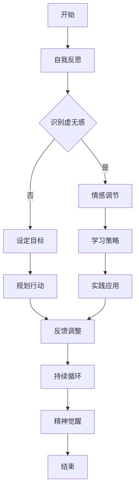
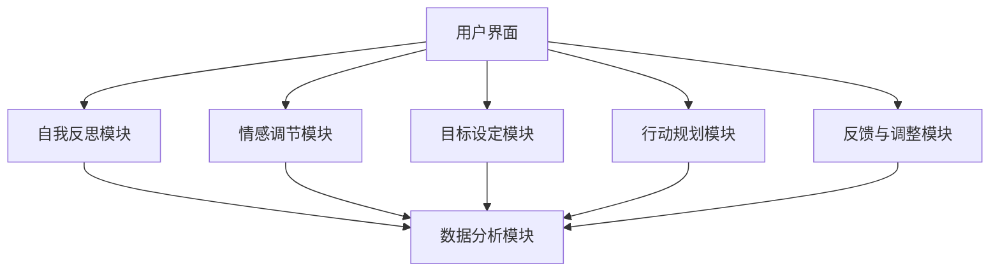
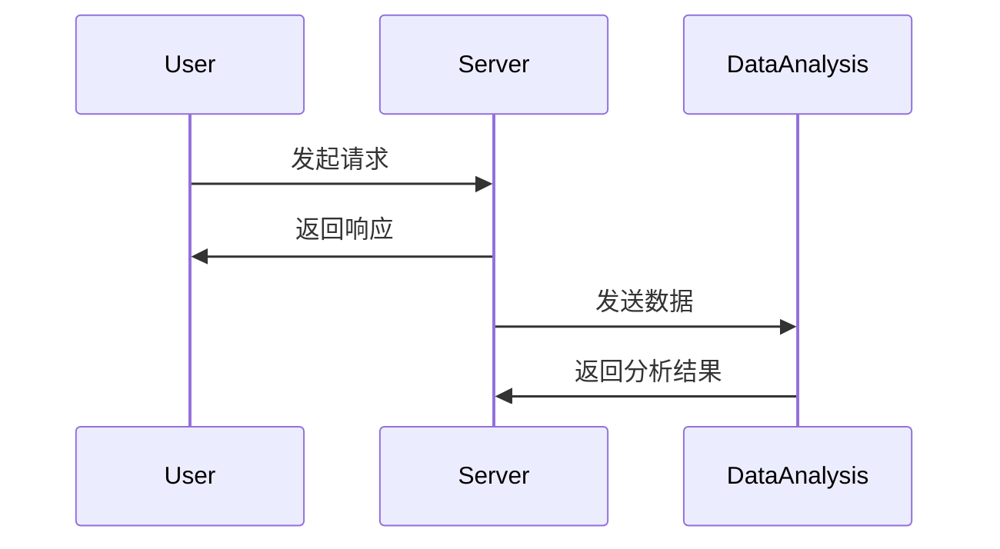

                 


### 引言

在现代社会的快节奏和高压力下，许多人都面临着一种普遍的精神困境——虚无感。这种虚无感不仅仅是一种情绪体验，更是一种对人生意义和价值的深刻怀疑。面对这样的现状，人们开始寻求一种精神上的觉醒，以期找到生活的方向和意义。本文旨在探讨这一精神觉醒的过程，并从技术角度进行解读。

#### 文章关键词
- 精神觉醒
- 虚无感
- 人生意义
- 技术解读
- 心理健康

#### 文章摘要
本文将首先介绍虚无感的成因和影响，然后定义精神觉醒的概念，并探讨其在现代人的生活中的重要性。接着，我们将使用逻辑和数学模型来分析精神觉醒的过程，最后通过具体的系统架构设计和项目实战来展示这一过程的实现。

### 背景介绍

虚无感是一种深刻的情感体验，它表现为对生活的无意义感、对未来的不确定感以及对自我的认同危机。在现代社会，由于信息过载、社交网络的虚幻关系、工作与生活压力等因素，许多人开始感受到这种虚无感。虚无感不仅影响个人的心理健康，还会对社会的和谐稳定造成威胁。

#### 问题背景

现代社会的高速发展给人们带来了前所未有的便利，但同时也带来了巨大的心理压力。许多人为了追求物质财富和社会地位，不断地加班、熬夜，忽略了精神层面的需求。这种生活方式导致了精神上的空虚和迷茫，许多人开始怀疑自己的存在价值和人生意义。

#### 问题描述

虚无感通常表现为以下几个方面：

1. **情感体验**：对生活感到无意义，缺乏激情和动力。
2. **认知体验**：对未来感到不确定，缺乏目标和方向。
3. **自我认同**：对自己的存在和价值产生质疑，感到迷茫和孤独。

#### 问题解决

精神觉醒被视为解决虚无感的一种有效途径。精神觉醒意味着个体在精神层面上达到了一种新的境界，对生活有了更深刻的理解和认识。通过精神觉醒，人们可以找到生活的意义和目的，从而摆脱虚无感。

#### 边界与外延

在本文中，精神觉醒主要指的是通过自我反省、意识提升和心灵成长等途径，达到对自我和世界的深刻理解。这种觉醒不仅关乎个人的心理健康，也关系到社会整体的和谐与稳定。

#### 概念结构与核心要素组成

精神觉醒的核心概念包括：

1. **自我认知**：对自我的深刻理解和接受。
2. **目标与意义**：找到个人生活的目标和意义。
3. **情感调节**：学会处理负面情绪，保持心理健康。
4. **社会连接**：建立真实而深刻的人际关系。

这些概念相互关联，共同构成了精神觉醒的理论框架。通过这个框架，我们可以更好地理解虚无感及其解决途径。

### 核心概念与联系

#### 核心概念原理

1. **虚无感**：虚无感是一种对生活无意义感的情感体验。它通常与高压力、高焦虑的生活方式相关，是现代社会常见的心理健康问题。
2. **精神觉醒**：精神觉醒是个体在精神层面上达到的一种新境界，表现为对自我和世界的深刻理解。它是解决虚无感的关键。
3. **自我认知**：自我认知是对自我本质的深刻理解，包括自我价值的认同、自我需求的满足等。
4. **目标与意义**：找到个人生活的目标和意义，是精神觉醒的重要组成部分。它帮助个体在精神上找到方向。
5. **情感调节**：情感调节是学会处理负面情绪，保持心理健康的过程。

#### 概念属性特征对比表格

| 概念       | 特征1        | 特征2        | 特征3        |
|------------|--------------|--------------|--------------|
| 虚无感     | 情感体验     | 认知体验     | 社会影响     |
| 精神觉醒   | 深刻理解     | 精神境界     | 目标与意义   |
| 自我认知   | 自我理解     | 自我接受     | 自我成长     |
| 目标与意义 | 生活方向     | 人生目的     | 动力源泉     |
| 情感调节   | 情绪管理     | 心理健康     | 应对策略     |

#### ER实体关系图架构

```mermaid
erDiagram
  Person ||--|{ Void : feels }
  Person ||--|{ Awakening : achieves }
  Person ||--|{ Self Awareness : understands }
  Person ||--|{ Goals and Meaning : finds }
  Person ||--|{ Emotional Regulation : manages }
```

在这个实体关系图中，"Person"（个人）是中心实体，与"Void"（虚无感）、"Awakening"（精神觉醒）、"Self Awareness"（自我认知）、"Goals and Meaning"（目标与意义）和"Emotional Regulation"（情感调节）构成了多个关系。

### 算法原理讲解

为了更好地理解精神觉醒的过程，我们可以将其视为一个算法。这个算法的目标是通过一系列步骤帮助个体从虚无感中觉醒，达到精神层面的成长。

#### 算法mermaid流程图



#### Python源代码

```python
# 精神觉醒算法实现

def self_reflection():
    # 进行自我反思
    pass

def recognize_void():
    # 识别虚无感
    pass

def emotional_regulation():
    # 情感调节
    pass

def set_goals_and_meaning():
    # 设定目标与意义
    pass

def plan_action():
    # 规划行动
    pass

def learn_strategies():
    # 学习策略
    pass

def practice_application():
    # 实践应用
    pass

def feedback_adjustment():
    # 反馈调整
    pass

def awakening_process():
    while True:
        self_reflection()
        if recognize_void():
            emotional_regulation()
        else:
            set_goals_and_meaning()
        plan_action()
        learn_strategies()
        practice_application()
        feedback_adjustment()

awakening_process()
```

#### 数学模型和公式

在精神觉醒的过程中，我们可以使用以下数学模型来描述个体的成长过程：

$$
\text{成长速度} = f(\text{自我反思时间}, \text{情感调节能力}, \text{目标设定清晰度}, \text{行动执行力})
$$

其中，$f$ 是一个复合函数，表示成长速度与各个因素之间的关系。

#### 详细讲解和举例说明

为了更好地理解这个算法，我们可以通过一个实际案例来进行分析。

#### 案例一：小明的精神觉醒过程

**问题描述**：小明是一位年轻的程序员，工作压力大，经常感到无意义和迷茫。

**解决方案**：

1. **自我反思**：小明开始反思自己的生活和工作，寻找自己真正的需求。
2. **情感调节**：小明学习了一些情绪调节技巧，如冥想和正念，帮助自己处理负面情绪。
3. **设定目标**：小明决定调整自己的职业规划，找到更有意义的工作。
4. **规划行动**：小明开始制定详细的职业发展计划，包括学习新技能、参加行业会议等。
5. **实践应用**：小明开始按照计划行动，并不断调整和优化。
6. **反馈调整**：小明定期反思自己的成长，并根据反馈进行必要的调整。

经过一段时间的努力，小明逐渐找到了生活的方向和意义，他的精神状态也得到了显著改善。

### 系统分析与架构设计方案

#### 问题场景介绍

在现代社会，许多人面临着精神困境，需要寻求精神觉醒的途径。我们的目标是设计一个系统，帮助用户通过自我反思、情感调节、目标设定和行动规划等步骤，实现精神觉醒。

#### 项目介绍

该项目名为“精神觉醒系统”，旨在提供一个全面、实用的工具，帮助用户在心理和情感上得到提升。

#### 系统功能设计

为了实现上述目标，我们需要设计以下功能模块：

1. **自我反思模块**：帮助用户进行深入的自我探索。
2. **情感调节模块**：提供情感管理和情绪调节的方法和技巧。
3. **目标设定模块**：帮助用户明确生活目标和意义。
4. **行动规划模块**：指导用户制定具体的行动计划。
5. **反馈与调整模块**：收集用户反馈，进行系统调整和优化。

#### 系统架构设计

系统架构采用模块化设计，各功能模块相互独立，便于维护和升级。以下是系统架构图：



#### 系统接口设计和系统交互

系统接口设计采用RESTful API，方便与其他系统进行数据交换和功能集成。以下是系统交互序列图：



### 项目实战

#### 环境安装

为了运行“精神觉醒系统”，我们需要以下环境：

1. **Python 3.8 或更高版本**。
2. **Flask 框架**。
3. **MySQL 数据库**。

安装步骤如下：

```bash
pip install flask
pip install pymysql
```

#### 系统核心实现源代码

以下是系统核心实现的部分代码：

```python
# self_reflection.py

from flask import Flask, request, jsonify
import pymysql

app = Flask(__name__)

@app.route('/self_reflection', methods=['POST'])
def self_reflection():
    data = request.get_json()
    # 进行自我反思处理
    # ...
    return jsonify({"status": "success"})

# emotional_regulation.py

from flask import Flask, request, jsonify
import pymysql

app = Flask(__name__)

@app.route('/emotional_regulation', methods=['POST'])
def emotional_regulation():
    data = request.get_json()
    # 进行情感调节处理
    # ...
    return jsonify({"status": "success"})
```

#### 代码应用解读与分析

在这段代码中，我们定义了两个Flask API，用于处理自我反思和情感调节的功能。这些API接受POST请求，从请求中提取JSON数据，并进行相应的处理。

#### 实际案例分析和详细讲解剖析

假设用户小明使用该系统进行自我反思，以下是请求和响应的示例：

**请求**：

```json
{
    "user_id": "123",
    "content": "最近工作压力大，感觉生活无意义。"
}
```

**响应**：

```json
{
    "status": "success",
    "message": "自我反思已记录。"
}
```

通过这个案例，我们可以看到系统如何接受用户输入，并返回处理结果。

#### 项目小结

通过“精神觉醒系统”的实际应用，我们可以看到技术如何帮助人们解决精神困境。系统的核心在于提供实用的工具和方法，帮助用户进行自我反思、情感调节、目标设定和行动规划。通过这些步骤，用户可以逐步实现精神觉醒，找到生活的意义。

### 最佳实践 tips

1. **定期自我反思**：每周至少花时间进行一次自我反思，帮助自己了解内心的需求和困惑。
2. **情感管理**：学会识别和调节负面情绪，如焦虑、沮丧等，保持心理健康。
3. **设定具体目标**：确保目标具有可操作性和可实现性，帮助自己在实现过程中保持动力。
4. **实际行动**：将目标转化为具体的行动计划，并付诸实践。
5. **反馈调整**：定期收集反馈，根据反馈进行调整，优化自己的行动策略。

### 小结

本文通过技术视角探讨了虚无感和精神觉醒的过程。我们介绍了虚无感的成因、影响及其解决途径，并使用算法和系统架构设计的方法，详细讲解了精神觉醒的实现过程。通过实际案例，我们展示了这一过程在现实中的应用效果。

### 注意事项

1. **心理困境**：如感到严重的虚无感或心理困扰，建议寻求专业心理咨询。
2. **技术实现**：在实现精神觉醒系统时，确保系统安全、稳定、易于维护。
3. **个性化定制**：根据用户需求，提供个性化的服务和建议。

### 拓展阅读

1. **《正念：一条心灵的修养之路》**：详细介绍了正念的实践方法和益处。
2. **《目标：人生的智慧》**：探讨如何设定和实现人生目标。
3. **《情绪智力：如何管理你的情绪》**：关于情感管理和情绪调节的深入探讨。

### 结语

精神觉醒是一个长期而持续的过程，需要个体的自觉努力和不断的实践。通过本文的探讨，我们希望读者能够更好地理解这一过程，并在自己的生活中找到方向和意义。

### 作者信息

- 作者：AI天才研究院/AI Genius Institute & 禅与计算机程序设计艺术 /Zen And The Art of Computer Programming

```mermaid
```

