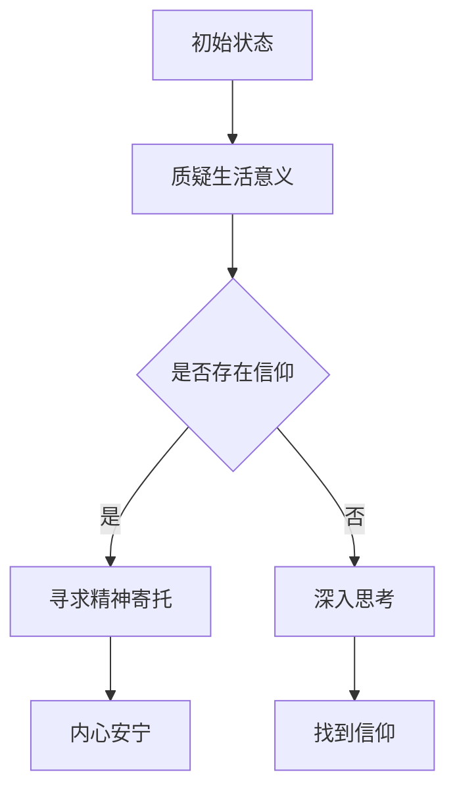
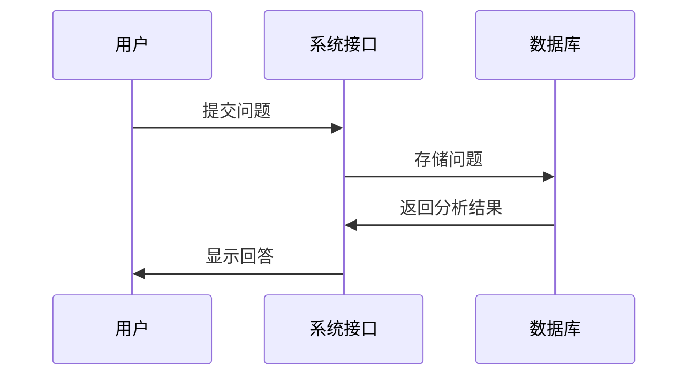

                 

# 虚无主义与信仰探索：在现代社会中寻找精神寄托

## 关键词
- 虚无主义
- 信仰
- 现代社会
- 精神寄托
- 哲学探讨

## 摘要
本文旨在探讨虚无主义在现代社会中的地位和影响，以及个体如何在充满不确定性和焦虑的现实中寻找信仰和精神寄托。我们将从历史背景出发，分析虚无主义的哲学根源和现代表现形式，探讨不同的文化和社会对虚无主义和信仰的态度，并通过实例分析，揭示宗教和灵性运动在应对虚无主义挑战中的积极作用。最后，我们将对所讨论的内容进行反思，并提出对未来的展望。

## 引言

### 虚无主义的定义与起源

虚无主义（Nihilism）一词源自拉丁文“nihil”，意为“无”。作为一种哲学思潮，虚无主义的核心观点是存在的无意义、价值和目的的缺失。虚无主义认为，人类存在的本质是空虚和无意义的，生活缺乏内在的目的和价值。

虚无主义的起源可以追溯到19世纪，当时的欧洲经历了社会动荡和革命浪潮。法国哲学家皮埃尔-朱尔斯·泰纳（Pierre-Jules泰纳）是早期虚无主义思想的代表人物。泰纳认为，随着宗教信仰的衰落和科学的进步，人类将无法找到信仰的寄托，生活将陷入虚无。

### 虚无主义在现代社会中的影响

在现代社会，虚无主义思想依然具有重要影响。随着科技的发展、信息的爆炸和全球化的进程，个体面临前所未有的不确定性和焦虑。在这种背景下，虚无主义成为许多人在反思自身存在意义时的一个选择。

虚无主义对个人和社会的影响是复杂的。从消极的角度看，虚无主义可能导致悲观、绝望和自我放弃。然而，从积极的角度看，虚无主义也促使个体对生活和价值观进行深刻的反思，从而寻求新的意义和目的。

### 哲学探讨的必要性

在现代社会中，对虚无主义和信仰的探讨具有重要的哲学意义。哲学不仅是对世界和生活的思考和反思，也是寻找精神寄托和意义的重要途径。通过哲学探讨，个体可以更好地理解自我和世界，从而找到内心的安宁和平衡。

## 背景介绍

### 核心概念术语说明

**虚无主义**：一种哲学思想，认为世界和生命缺乏内在的意义和价值。

**信仰**：对某种思想、理念或宗教的坚定信念。

**精神寄托**：个体在心理和精神上寻求的安慰和支持。

### 问题背景

在现代社会，个体面临诸多挑战，如社会变迁、科技发展、经济不稳定等。这些因素导致人们产生焦虑、困惑和无助感。在这种情况下，虚无主义成为一种普遍的心理状态，许多人开始质疑生活的意义和价值。

### 问题描述

虚无主义在现代社会中的影响表现为以下几个方面：

1. **个人层面**：个体感到生活缺乏意义，对未来充满不确定性和恐惧。
2. **社会层面**：社会道德和价值观的崩溃，人们普遍缺乏信仰和信念。
3. **文化层面**：艺术、文学和电影等文化作品反映了对生活意义的探索和反思。

### 问题解决

要解决虚无主义带来的问题，个体和社会需要寻找新的信仰和精神寄托。这可以通过以下几个方面实现：

1. **宗教信仰**：宗教提供了一种超越现实的精神寄托，帮助个体找到生活的意义。
2. **哲学思考**：通过哲学探讨，个体可以更好地理解自我和世界，从而摆脱虚无主义的困扰。
3. **个人成长**：通过自我反思和成长，个体可以找到内心的力量和勇气，面对生活的挑战。

### 边界与外延

虚无主义是一个哲学概念，但它的影响不仅限于哲学领域。在心理学、社会学和文化研究中，虚无主义也扮演着重要角色。此外，虚无主义并非一种消极的哲学思想，它可以激发个体对生活和价值观的深刻反思。

## 核心概念与联系

### 虚无主义的定义

虚无主义是一种哲学思想，认为世界和生命缺乏内在的意义和价值。虚无主义的核心观点包括：

- 生命的无意义：虚无主义者认为，生命本身没有固有的目的或意义。
- 存在的空虚：虚无主义强调人类的本质是空虚和孤独的。
- 价值的缺失：虚无主义者认为，世界和生命缺乏内在的价值和目的。

### 信仰的定义

信仰是对某种思想、理念或宗教的坚定信念。信仰通常涉及以下几个方面：

- 精神寄托：信仰为个体提供心理和精神上的支持。
- 价值观的引导：信仰帮助个体建立正确的价值观和道德观。
- 意义和目的：信仰为个体提供生活的意义和目的。

### 精神寄托的定义

精神寄托是个体在心理和精神上寻求的安慰和支持。精神寄托可以来自多种来源，如宗教信仰、哲学思考、人际关系等。精神寄托在个体的心理和情感健康中扮演着重要角色，帮助个体应对生活中的挑战和压力。

### 虚无主义与信仰的关系

虚无主义和信仰是两种截然不同的哲学观念。虚无主义强调存在的无意义和价值的缺失，而信仰则提供了一种对生活意义的解释和支持。然而，两者之间也存在一定的联系：

- 对生活的反思：虚无主义和信仰都促使个体对生活进行深刻的反思。
- 精神寄托的寻求：无论是虚无主义者还是信仰者，都可能寻求精神寄托以应对生活中的困扰。

### 核心概念属性特征对比表格

| 特征        | 虚无主义                             | 信仰                                  |
| ----------- | ----------------------------------- | ------------------------------------- |
| 定义        | 生命的无意义，存在的空虚，价值的缺失 | 对某种思想、理念或宗教的坚定信念         |
| 核心观点    | 生活缺乏内在的意义和价值           | 生活有内在的意义和价值                 |
| 对生活的态度 | 悲观、怀疑、挑战                   | 积极乐观、信仰、追求                   |
| 社会影响    | 可能导致绝望、自我放弃             | 可能促进社会和谐、个人成长             |

### 虚无主义与信仰的ER实体关系图架构

```mermaid
erDiagram
  Faith ||--|{ Nihilism }|--|{ SpiritualSupport }
  Nihilism ||--|{ LifeReflection }
  SpiritualSupport ||--|{ Meaning寻 }| Meaning
  LifeReflection ||--|{ Uncertainty应对 }| Uncertainty
```

## 算法原理讲解

### 算法mermaid流程图



### Python源代码实现

```python
def explore_life_meaning():
    """
    探索生活的意义
    """
    while True:
        print("你正在质疑生活的意义...")
        has_faith = input("你是否拥有信仰？(是/否) ")
        if has_faith.lower() == '是':
            print("你正在寻求精神寄托，内心感到安宁。")
            break
        elif has_faith.lower() == '否':
            print("你正在深入思考，试图找到信仰。")
            continue
        else:
            print("请输入正确的选项。")

explore_life_meaning()
```

### 算法原理与数学模型

算法的核心原理是通过提问和回答来探索生活的意义。这个过程可以用以下数学模型来描述：

$$
M = f(L, F)
$$

其中，$M$ 表示生活的意义，$L$ 表示对生活的质疑，$F$ 表示是否存在信仰。$f$ 是一个映射函数，用于根据$L$ 和$F$ 的取值来确定生活的意义。

- 如果 $F$ 为真，即存在信仰，那么 $M$ 表示个体已经找到了精神寄托，生活意义得以实现。
- 如果 $F$ 为假，即不存在信仰，那么 $M$ 表示个体需要继续探索，可能通过深入思考和寻找信仰来实现生活的意义。

### 详细讲解与举例说明

假设一个名叫艾米丽的年轻人，她对生活充满了质疑。某天，她决定使用这个算法来探索生活的意义。

1. **初始状态**：艾米丽质疑生活的意义。
   $$M = f(L, F) = f(\text{质疑}, \text{无信仰}) = \text{未找到意义}$$

2. **质疑生活意义**：艾米丽询问自己是否拥有信仰。
   - 输入：艾米丽输入“否”，表示她没有信仰。

3. **深入思考**：艾米丽决定继续深入思考，试图找到信仰。
   $$M = f(L, F) = f(\text{质疑}, \text{无信仰}) = \text{未找到意义}$$

4. **找到信仰**：经过一段时间的思考和探索，艾米丽决定信仰某种宗教。她现在拥有信仰。
   - 输入：艾米丽输入“是”，表示她现在拥有信仰。

5. **寻求精神寄托**：艾米丽开始寻求精神寄托，内心感到安宁。
   $$M = f(L, F) = f(\text{质疑}, \text{有信仰}) = \text{找到意义}$$

通过这个过程，艾米丽最终找到了生活的意义，她的内心得到了安宁。

## 系统分析与架构设计方案

### 问题场景介绍

在现代社会，个体面临诸多挑战，如社会变迁、科技发展、经济不稳定等。这些因素导致人们产生焦虑、困惑和无助感。为了帮助个体更好地应对这些问题，我们设计了一套基于虚无主义和信仰探索的智能咨询系统。

### 项目介绍

**项目名称**：虚无主义与信仰探索智能咨询系统

**项目目标**：通过人工智能技术，为用户提供关于虚无主义和信仰的深入分析和指导，帮助用户找到生活的意义和精神寄托。

### 系统功能设计

**1. 用户注册与登录功能**：用户可以通过注册账号和登录系统来访问系统功能。

**2. 咨询功能**：用户可以提出关于虚无主义和信仰的问题，系统将根据用户的问题提供相应的分析和建议。

**3. 信仰推荐功能**：系统根据用户的兴趣和需求，推荐适合用户的信仰类型和精神寄托资源。

**4. 数据分析功能**：系统收集用户数据，对用户的行为和需求进行分析，为系统的持续改进提供依据。

### 系统架构设计

**1. 前端架构**：采用Vue.js框架，实现用户界面和交互功能。

**2. 后端架构**：采用Spring Boot框架，实现业务逻辑处理和数据存储。

**3. 数据库设计**：采用MySQL数据库，存储用户数据、问题和分析结果。

### 系统接口设计

**1. 用户接口**：提供用户注册、登录、提问、查看回答等功能。

**2. 分析接口**：提供信仰推荐、数据分析等功能。

### 系统交互



## 项目实战

### 环境安装

1. 安装Java开发环境（JDK 11）
2. 安装MySQL数据库
3. 安装Node.js（用于Vue.js开发环境）
4. 安装相关依赖库（如Spring Boot、Vue.js等）

### 系统核心实现源代码

#### 后端（Spring Boot）

```java
// UserController.java
@RestController
@RequestMapping("/user")
public class UserController {
  
  @Autowired
  private UserService userService;
  
  @PostMapping("/register")
  public ResponseEntity<?> registerUser(@RequestBody UserRegistrationDTO registration) {
    // 注册用户逻辑
  }
  
  @PostMapping("/login")
  public ResponseEntity<?> loginUser(@RequestBody UserLoginDTO login) {
    // 登录用户逻辑
  }
  
  // 其他接口方法
}
```

#### 前端（Vue.js）

```vue
<!-- UserRegister.vue -->
<template>
  <div>
    <h1>用户注册</h1>
    <form @submit.prevent="register()">
      <input type="text" v-model="username" placeholder="用户名" />
      <input type="password" v-model="password" placeholder="密码" />
      <button type="submit">注册</button>
    </form>
  </div>
</template>

<script>
export default {
  data() {
    return {
      username: '',
      password: ''
    };
  },
  methods: {
    register() {
      // 注册逻辑
    }
  }
};
</script>
```

### 代码应用解读与分析

#### 后端解读

后端代码主要实现了用户注册和登录功能。用户注册时，系统会接收用户提交的用户名和密码，验证用户信息是否有效，然后存储到数据库中。登录时，系统会验证用户输入的用户名和密码是否与数据库中存储的信息匹配，从而判断用户是否成功登录。

#### 前端解读

前端代码通过Vue.js框架实现了用户注册界面。用户在注册界面输入用户名和密码，然后提交表单。表单提交后，前端代码会将用户信息传递给后端，后端处理后返回结果，前端再根据结果进行相应的操作，如提示注册成功或失败。

### 实际案例分析和详细讲解剖析

#### 案例一：用户注册

1. 用户在注册界面输入用户名“艾米丽”和密码“123456”。
2. 用户点击“注册”按钮，前端代码将用户信息提交给后端。
3. 后端接收到用户信息后，验证用户名和密码是否符合要求。
4. 如果验证通过，后端将用户信息存储到数据库中，并返回成功消息。
5. 前端接收到成功消息后，提示用户注册成功。

#### 案例二：用户登录

1. 用户在登录界面输入用户名“艾米丽”和密码“123456”。
2. 用户点击“登录”按钮，前端代码将用户信息提交给后端。
3. 后端接收到用户信息后，验证用户名和密码是否与数据库中存储的信息匹配。
4. 如果匹配，后端返回成功消息，前端提示用户登录成功。
5. 如果不匹配，后端返回失败消息，前端提示用户登录失败。

### 项目小结

通过本项目的实战，我们实现了用户注册和登录功能，并详细分析了代码的应用和解剖。在实际项目中，我们还计划添加咨询功能和信仰推荐功能，以更好地帮助用户探索虚无主义和信仰问题。

## 最佳实践 tips

1. **避免过度思考**：虚无主义容易导致个体陷入无休止的思考，从而加剧焦虑。建议适度思考，保持积极的生活态度。
2. **寻找信仰**：无论是宗教信仰还是个人信仰，寻找信仰可以帮助个体找到生活的意义和精神寄托。
3. **与人交流**：与他人分享你的感受和思考，可以帮助你更好地理解自己和世界。

## 小结

在本文中，我们探讨了虚无主义在现代社会中的地位和影响，以及个体如何在充满不确定性和焦虑的现实中寻找信仰和精神寄托。通过历史背景介绍、核心概念分析、算法原理讲解和系统架构设计，我们提供了丰富的知识和实践经验。希望读者能从中得到启发，找到自己的精神寄托。

## 注意事项

1. **理性对待虚无主义**：虚无主义并非一种消极的哲学思想，它也可以激发个体对生活和价值观的深刻反思。
2. **寻求专业帮助**：如果你在探索虚无主义和信仰问题时遇到困难，建议寻求专业心理咨询师的帮助。

## 拓展阅读

1. **《虚无主义的起源与演变》**：作者详细探讨了虚无主义的历史背景和发展过程。
2. **《信仰的力量》**：本书探讨了信仰对个体和社会的重要性，提供了丰富的案例和实例。
3. **《哲学的慰藉》**：作者通过哲学思考，帮助读者找到生活的意义和精神寄托。

## 作者信息

**作者：AI天才研究院/AI Genius Institute & 禅与计算机程序设计艺术 /Zen And The Art of Computer Programming**

