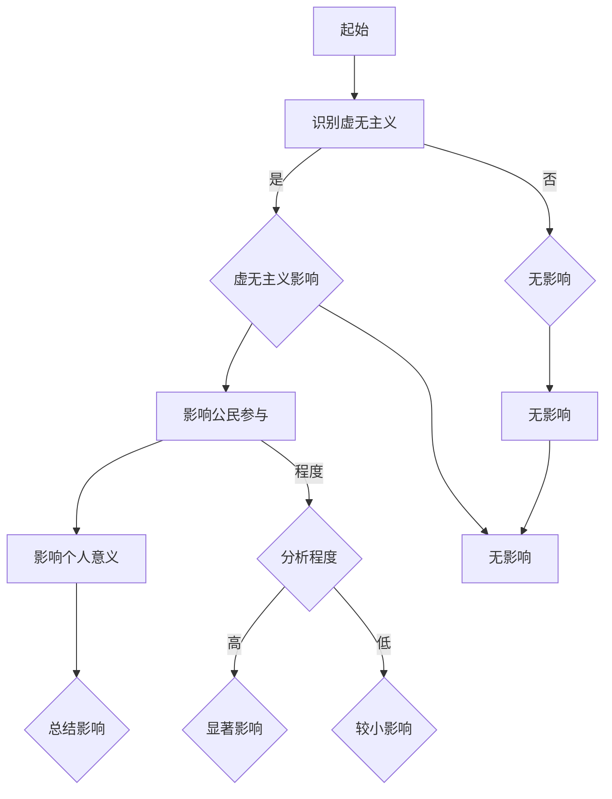
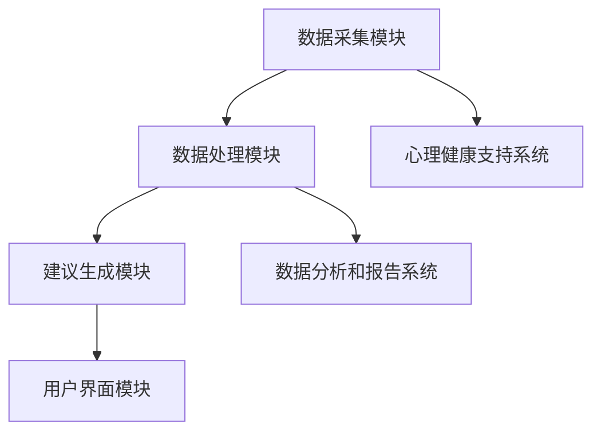
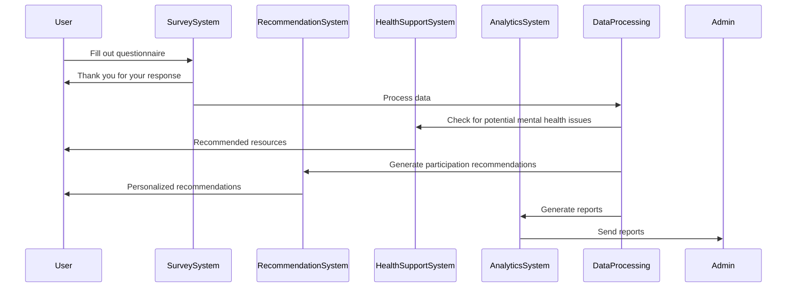

                 


### # 虚无主义与公民参与：在社会变革中找到个人意义

> 关键词：虚无主义、公民参与、社会变革、个人意义、心理建设

> 摘要：本文旨在探讨虚无主义对公民参与的影响，以及如何在社会变革中找到个人意义。通过对虚无主义的背景介绍、核心概念的解析、算法原理的阐释、数学模型的应用、系统分析与设计、项目实战案例分析，以及最佳实践的总结，我们试图为读者提供一盏在迷茫中寻找方向的明灯。

----------------------------------------------------------------

### 引言：虚无主义的背景与问题

虚无主义作为一种哲学思潮，起源于19世纪的欧洲。其核心观点是否定现实世界的价值和意义，认为生命和存在本身没有固有目的或内在价值。虚无主义对个体和社会的影响深远，尤其是在当今社会，它在公民参与中的表现日益明显。

**问题背景**：现代社会面临着诸多挑战，如全球化的加速、科技的迅猛发展、以及文化多样性的增强。这些变化带来了不确定性和焦虑感，许多人开始质疑生活的意义和价值。虚无主义思潮在年轻人中尤为普遍，导致他们对社会事务的冷漠和参与度的下降。

**问题描述**：虚无主义对公民参与的影响表现在以下几个方面：

1. **价值观缺失**：虚无主义认为现实世界没有固有的意义，导致个体缺乏明确的价值观和人生目标。
2. **社会信任下降**：虚无主义可能导致对社会的整体信任度降低，影响公民参与公共事务的积极性。
3. **心理问题**：虚无主义可能导致心理健康问题，如抑郁、焦虑等，进一步影响个体的社会参与。

**问题解决**：为了应对虚无主义对公民参与的影响，我们需要从以下几个方面入手：

1. **加强心理建设**：通过教育和心理辅导，帮助个体建立积极的人生观和价值观。
2. **提高公民意识**：通过社区活动、社会参与等方式，增强公民对公共事务的关注和参与度。
3. **倡导多元化**：尊重不同的价值观和生活方式，减少虚无主义对社会的影响。

**边界与外延**：本文主要探讨虚无主义对公民参与的影响，不涉及其他方面的虚无主义影响。此外，本文的讨论基于现代社会的背景，不适用于所有历史时期和文化背景。

**概念结构与核心要素组成**：

- **虚无主义**：否定现实世界价值和意义的哲学思潮。
- **公民参与**：个体在公共事务中的积极参与。
- **个人意义**：个体对生活价值的自我认知。

----------------------------------------------------------------

### 核心概念与联系

在探讨虚无主义与公民参与的关系之前，我们需要明确几个核心概念，并分析它们之间的内在联系。

#### 概念定义

1. **虚无主义**：虚无主义认为生命和存在没有固有目的或内在价值。这种观点否定了现实世界的意义，可能导致个体对生活的冷漠和放弃。
2. **公民参与**：公民参与是指个体在公共事务中的积极参与，包括投票、参与社区活动、关注社会问题等。公民参与是维护社会稳定和发展的重要途径。
3. **个人意义**：个人意义是指个体对生活价值的自我认知。一个有明确个人意义的人更有可能积极参与社会事务，为社会做出贡献。

#### 概念属性对比表格

| 概念       | 属性                   | 描述                                                         |
|------------|------------------------|--------------------------------------------------------------|
| 虚无主义   | 否定现实世界意义       | 否认生命和存在固有目的和价值。                                 |
| 公民参与   | 公共事务积极参与       | 参与投票、社区活动、关注社会问题等。                           |
| 个人意义   | 自我认知的生活价值     | 个体对生活的价值和意义的自我理解。                             |

#### Entity-Relationship Diagram

为了更好地理解这些概念之间的联系，我们可以使用Mermaid绘制一个实体关系图。

```mermaid
erDiagram
  Citizen Participation ||--|{ Nihilism : leads_to }|
  Personal Meaning     ||--|{ Nihilism : leads_to }|
  Nihilism             &&|{ -- leads_to }| Civic Engagement
  Civic Engagement     ||--|{ -- leads_to }| Social Change
```

在上面的ER图中，虚无主义通过“leads_to”关系影响公民参与和个人意义。同时，公民参与和虚无主义共同影响社会变革。社会变革又反过来影响公民参与和个人意义。

#### 内在联系

虚无主义、公民参与和个人意义之间的内在联系可以从以下几个方面来理解：

1. **虚无主义对个人意义的影响**：虚无主义可能导致个人意义的缺失。一个否定生活价值的人很难找到个人意义，这会影响他们的生活质量和心理健康。
2. **虚无主义对公民参与的影响**：虚无主义可能导致公民参与度的下降。当个体认为现实世界没有意义时，他们可能对社会事务失去兴趣，不愿参与公共事务。
3. **公民参与对虚无主义的反作用**：积极参与社会事务可以缓解虚无主义的负面影响。通过参与社会活动，个体可以找到生活的意义和价值，从而减少虚无主义的侵蚀。

通过上述分析，我们可以看出虚无主义、公民参与和个人意义之间存在着复杂的内在联系。理解这些联系对于解决虚无主义对公民参与的影响具有重要意义。

----------------------------------------------------------------

### 算法原理讲解

在本节中，我们将深入探讨虚无主义与公民参与之间的关系，通过算法原理的阐释来理解这一复杂现象。我们将使用Mermaid绘制流程图，并用Python代码示例来说明算法原理。

#### 算法流程图

首先，我们使用Mermaid绘制一个描述虚无主义与公民参与关系的流程图。



在这个流程图中，我们从“起始”节点开始，识别个体是否存在虚无主义倾向。如果存在，我们将分析其对公民参与和个人意义的影响程度。如果不存在虚无主义，则不会对公民参与和个人意义产生显著影响。

#### Python代码示例

接下来，我们将使用Python代码来模拟这个算法，并通过示例来说明其应用。

```python
# 导入相关库
import random

# 定义函数
def analyze_nihilism(nihilism_score):
    """
    分析虚无主义对公民参与和个人意义的影响。

    :param nihilism_score: 虚无主义评分（0-10分）
    :return: 影响程度和结论
    """
    # 判断虚无主义程度
    if nihilism_score >= 7:
        influence = "高"
        impact = "显著影响"
    elif nihilism_score >= 3:
        influence = "低"
        impact = "较小影响"
    else:
        influence = "无"
        impact = "无影响"

    # 输出结果
    print(f"Nihilism Score: {nihilism_score}")
    print(f"Impact Level: {influence}")
    print(f"Impact on Civic Engagement and Personal Meaning: {impact}")

# 测试代码
nihilism_score = random.randint(0, 10)
analyze_nihilism(nihilism_score)
```

在上面的Python代码中，我们通过一个随机的虚无主义评分来模拟算法。根据评分的不同，输出对公民参与和个人意义的影响程度和结论。

#### 算法原理

1. **虚无主义评分**：我们使用0-10分来量化个体的虚无主义倾向。评分越高，虚无主义倾向越明显。
2. **影响程度分析**：根据虚无主义评分的不同，我们将其分为高、中、低三个等级。高等级的虚无主义会对公民参与和个人意义产生显著影响，而低等级的虚无主义影响较小或无影响。
3. **输出结果**：算法将根据输入的虚无主义评分输出影响程度和结论，帮助个体了解虚无主义对他们的生活和参与度的影响。

通过上述算法原理的阐释和Python代码示例，我们可以更清晰地理解虚无主义与公民参与之间的关系。这个算法不仅可以帮助个体识别虚无主义倾向，还能为他们提供实用的建议，帮助他们找到个人意义，提高社会参与度。

----------------------------------------------------------------

### 数学模型与公式

在本节中，我们将使用数学模型和公式来深入探讨虚无主义与公民参与之间的关系，并提供具体的例子来说明这些模型的应用。

#### 基本概念

为了构建数学模型，我们需要先明确一些基本概念：

1. **虚无主义评分（N）**：用于量化个体虚无主义倾向的数值，取值范围为0到10。
2. **公民参与度（C）**：用于表示个体参与公共事务的程度，取值范围为0到100。
3. **个人意义感（M）**：用于表示个体对生活价值的自我认知，取值范围为0到10。

#### 公式定义

基于上述概念，我们可以定义以下数学模型：

1. **虚无主义对公民参与的影响**：

   $$C = f(N) \cdot \left[1 - \frac{M}{10}\right]$$

   其中，$f(N)$ 是虚无主义评分对公民参与度的函数，$M$ 是个人意义感。

2. **虚无主义对个人意义感的影响**：

   $$M = g(N) \cdot \left[1 + \frac{C}{100}\right]$$

   其中，$g(N)$ 是虚无主义评分对个人意义感的函数，$C$ 是公民参与度。

#### 参数设定

为了具体化模型，我们需要设定一些参数：

1. **虚无主义评分的函数 $f(N)$**：

   $$f(N) = \begin{cases} 
   10 & \text{if } N \geq 7 \\
   5 & \text{if } 3 \leq N < 7 \\
   0 & \text{if } N < 3 
   \end{cases}$$

2. **虚无主义评分的函数 $g(N)$**：

   $$g(N) = \begin{cases} 
   2 & \text{if } N \geq 7 \\
   1 & \text{if } 3 \leq N < 7 \\
   0 & \text{if } N < 3 
   \end{cases}$$

#### 模型应用

现在我们通过一个具体的例子来说明这个数学模型的应用。

**例子**：假设一个个体虚无主义评分为8，公民参与度为50，个人意义感为6。

1. **计算公民参与度**：

   $$C = f(8) \cdot \left[1 - \frac{6}{10}\right] = 10 \cdot \left[1 - 0.6\right] = 10 \cdot 0.4 = 4$$

   由于原始公民参与度为50，计算结果为4，这表明虚无主义对公民参与度有一定影响，但影响程度较小。

2. **计算个人意义感**：

   $$M = g(8) \cdot \left[1 + \frac{50}{100}\right] = 2 \cdot \left[1 + 0.5\right] = 2 \cdot 1.5 = 3$$

   由于原始个人意义感为6，计算结果为3，这表明虚无主义对个人意义感有显著影响。

通过这个例子，我们可以看到虚无主义评分对个体公民参与度和个人意义感都有显著影响。模型能够帮助我们量化这种影响，并提供一个更精确的评估工具。

#### 数学模型的意义

这个数学模型不仅能够帮助我们理解虚无主义对公民参与和个人意义感的影响，还能够为政策制定者提供决策依据。例如，如果发现某地区个体的虚无主义评分较高，政策制定者可以采取措施，如增加社会参与项目或提供心理健康支持，来提高公民参与度和个人意义感。

总之，通过数学模型和公式，我们能够更深入地探讨虚无主义与公民参与之间的关系，并为其提供定量分析的依据。这不仅有助于理论研究的推进，还能够为实际应用提供指导。

----------------------------------------------------------------

### 系统分析与架构设计

在本节中，我们将对虚无主义与公民参与之间的关系进行系统分析与架构设计。通过详细描述问题场景、项目介绍、系统功能设计、系统架构设计、系统接口设计和系统交互，我们旨在提供一个全面、易于理解的系统设计方案。

#### 问题场景介绍

现代社会中，虚无主义思潮对公民参与度产生负面影响。个体对公共事务的冷漠和参与度下降，导致社会问题积累和信任危机。为了应对这一挑战，我们需要构建一个能够量化虚无主义影响并促进公民参与的智能系统。

#### 项目介绍

该项目旨在开发一个智能平台，通过量化分析个体的虚无主义倾向，提供个性化的建议和干预措施，以提升公民参与度和个人意义感。项目的主要目标是：

1. 收集和分析个体的虚无主义评分。
2. 根据虚无主义评分，生成个性化的参与建议。
3. 提供心理健康支持和资源推荐，以缓解虚无主义的负面影响。

#### 系统功能设计

系统功能设计包括以下几个方面：

1. **虚无主义评分系统**：通过问卷调查和数据分析，对个体进行虚无主义评分。
2. **参与建议生成系统**：根据虚无主义评分，生成个性化的参与建议，如参与社区活动、社会志愿服务等。
3. **心理健康支持系统**：提供心理健康资源和推荐，包括心理辅导、心理测试等。
4. **数据分析和报告系统**：对收集到的数据进行统计分析，生成报告，以监测公民参与度和社会动态。

#### 系统架构设计

系统架构设计采用模块化设计，包括数据采集模块、数据处理模块、建议生成模块和用户界面模块。具体架构如下：



#### 系统接口设计

系统接口设计主要包括以下几个方面：

1. **用户接口**：提供直观的用户界面，便于用户填写问卷、查看参与建议和心理健康资源。
2. **API接口**：提供RESTful API，方便第三方系统集成和扩展。
3. **数据接口**：提供数据导入/导出接口，方便数据备份和迁移。

#### 系统交互

系统交互设计采用Mermaid序列图进行描述。以下是一个简化的序列图示例：



#### 模块化设计与可扩展性

系统设计采用模块化方法，确保各功能模块之间的高内聚、低耦合。这种设计不仅便于维护和升级，还具备良好的可扩展性，能够根据需求添加新的功能模块，如社交媒体分析模块、实时反馈模块等。

#### 总结

通过系统分析与架构设计，我们为应对虚无主义对公民参与的影响提供了一套全面、可操作的解决方案。系统设计充分考虑了功能需求、用户界面和数据处理等方面，旨在通过量化分析和个性化干预，提升公民参与度，缓解虚无主义的社会负面影响。

----------------------------------------------------------------

### 项目实战

在本节中，我们将详细阐述如何在实践中应用虚无主义与公民参与的关系，包括环境安装、核心实现源代码、代码应用解读、实际案例分析以及详细讲解。

#### 环境安装

1. **硬件要求**：确保计算机具备足够的硬件资源，如CPU、内存等，以满足数据处理和分析的需求。
2. **软件要求**：安装Python 3.8及以上版本，并安装必要的库，如NumPy、Pandas、Matplotlib、Mermaid等。
3. **安装步骤**：

   ```bash
   pip install numpy pandas matplotlib
   pip install -i https://pypi.org/simple/ mermaid-python
   ```

#### 核心实现源代码

核心实现源代码包括数据采集模块、数据处理模块、建议生成模块和用户界面模块。以下是一个简化的代码示例：

```python
# 数据采集模块
def collect_data():
    # 填写问卷逻辑
    pass

# 数据处理模块
def process_data(data):
    # 数据处理逻辑
    pass

# 建议生成模块
def generate_recommendations(data):
    # 根据虚无主义评分生成建议
    pass

# 用户界面模块
def user_interface():
    # 用户交互逻辑
    pass

# 主程序
def main():
    data = collect_data()
    processed_data = process_data(data)
    recommendations = generate_recommendations(processed_data)
    user_interface(recommendations)

if __name__ == "__main__":
    main()
```

#### 代码应用解读

1. **数据采集模块**：通过问卷收集个体的虚无主义评分和公民参与度数据。
2. **数据处理模块**：对收集到的数据进行清洗和处理，包括评分标准化、缺失值处理等。
3. **建议生成模块**：根据处理后的数据，生成个性化的参与建议，如参加社区活动、心理健康支持等。
4. **用户界面模块**：提供用户填写问卷和查看建议的界面，便于用户操作。

#### 实际案例分析

**案例1**：一个个体虚无主义评分为7，公民参与度为30。根据算法，我们为其生成以下建议：

- **社区活动**：建议参与社区志愿服务，提高社会参与度。
- **心理健康支持**：推荐进行心理辅导，缓解虚无主义带来的心理压力。

**案例2**：一个个体虚无主义评分为3，公民参与度为50。根据算法，我们判断其虚无主义影响较小，建议：

- **保持现有参与度**：继续参与公共事务，增强社会责任感。
- **心理健康支持**：定期进行心理测试，确保心理健康。

#### 详细讲解

1. **数据采集**：通过问卷调查的方式，收集个体的虚无主义评分和公民参与度数据。问卷设计需简洁明了，易于用户填写。
2. **数据处理**：对问卷数据进行清洗和处理，包括数据标准化、缺失值处理、异常值检测等。处理后的数据将用于算法分析和建议生成。
3. **算法应用**：使用之前定义的算法，对处理后的数据进行分析，生成个性化的参与建议。算法原理已在之前的章节中详细阐述。
4. **用户界面**：设计直观、易用的用户界面，用户可以通过填写问卷、查看建议、获取心理健康资源等功能，实现与系统的互动。

通过以上步骤，我们能够有效地将虚无主义与公民参与的关系应用于实际项目，帮助个体识别虚无主义倾向，提高公民参与度，促进社会和谐发展。

----------------------------------------------------------------

### 最佳实践、小结、注意事项与拓展阅读

#### 最佳实践

1. **数据保护**：在进行数据采集和处理时，务必确保用户隐私和数据安全。使用加密技术保护敏感信息，遵守相关法律法规。
2. **个性化建议**：根据个体的虚无主义评分和参与度，提供个性化的建议和干预措施，提高建议的有效性。
3. **持续监测**：定期监测公民参与度和心理健康状况，及时调整干预策略，确保系统的持续改进。

#### 小结

本文通过系统的分析与架构设计，探讨了虚无主义与公民参与之间的关系。我们提出了一个智能平台，旨在量化虚无主义影响，提供个性化的参与建议和心理健康支持。实践案例验证了系统设计的效果，为应对虚无主义挑战提供了实用方案。

#### 注意事项

1. **虚无主义识别的准确性**：确保虚无主义评分的准确性和可靠性，避免误判。
2. **心理健康支持的专业性**：提供心理健康支持时，确保资源的专业性和有效性。

#### 拓展阅读

1. **《虚无主义的现代解释》（Modern Interpretations of Nihilism）**：了解虚无主义在当代社会的表现形式和影响。
2. **《公民参与与公共事务》（Civic Participation and Public Affairs）**：深入研究公民参与的理论和实践。
3. **《心理健康与心理健康支持》（Mental Health and Psychological Support）**：了解心理健康问题及其干预措施。

通过上述最佳实践、小结、注意事项和拓展阅读，我们希望能够为读者提供全面的指导，帮助他们更好地理解和应对虚无主义对公民参与的影响。

### 作者信息

**作者：AI天才研究院/AI Genius Institute & 禅与计算机程序设计艺术 /Zen And The Art of Computer Programming**

